# JavaSE

> 2023.6.27~2023.9.13

#### Java概述

##### 程序执行步骤

- 
- 编写代码：任何一个文本编辑器都可以些代码，如Windows系统自带的记事本
- 编译代码：将人能看懂的源代码（.java文件）转换为Java虚拟机能够执行的字节码文件（.class文件）
- 运行代码：将字节码文件交给Java虚拟机执行

##### JDK组成

- 

- JVM
  - JDK最核心的组成部分是JVM（Java Virtual Machine），它是Java虚拟机，真正运行Java程序的地方。
- 核心类库
	- 它是Java本身写好的一些程序，给程序员调用的。 Java程序员并不是凭空开始写代码，是要基于核心类库提供的一些基础代码，进行编程。
- JRE
    - JRE（Java Runtime Enviroment），意思是Java的运行环境；它是由JVM和核心类库组成的；如果你不是开发人员，只需要在电脑上安装JRE就可以运行Java程序。
- 开发工具
  - Java程序员写好源代码之后，需要编译成字节码，这里会提供一个编译工具叫做javac.exe，编写好源代码之后，想要把class文件加载到JVM内存中运行，这里需要用到运行工具java.exe。

##### 跨平台原理

- 跨平台性的原理是因为在**不同版本的操作系统**中安装有**不同版本的Java虚拟机**，Java程序的运行只依赖于Java虚拟机，和操作系统并没有直接关系。**从而做到一处编译，处处运行**。
- 

##### JVM内存机制

- Java为了便于虚拟机执行Java程序，将虚拟机的内存划分为 方法区、栈、堆、本地方法栈、寄存器 这5块区域。
  - **方法区**：字节码文件先加载到这里
  - **栈**：方法运行时所进入的内存区域，由于变量在方法中，所以变量也在这一块区域中
  - **堆**：存储new出来的东西（引用数据类型），并分配地址。由于数组是new 出来的，所以数组也在这块区域。

- 数组
  - 

- 方法
  - 每次调用方法，方法都会进栈执行，创建一个专属内存；执行完后，又会弹栈出去，内存中的引用就会与堆中的数据链接丢失，由JVM的垃圾回收机制处理。要想数据不丢失，就必须返回出来。
  - 参数传递
    - **Java的参数传递机制都是值传递**
    - 传递基本数据类型时，调用者从栈空间中把参数传递给提供者的栈空间中
    - 传递引用数据类型时，调用者从栈空间中把参数在堆空间的地址传递给提供者的栈空间中，提供者再去堆中找

- 对象
  - 

#### 数据类型

##### 储存原理

- 整数

  - 任何数据在计算机中都是以**二进制**表示的。整数由二进制转化为十进制。需要注意的是**计算机中最小的存储单位是字节（Byte），一个字节占8位（bit）**，也就是说即使某个数据不足8位也需要用8位来存储。

- 字符

  - 字符并不是直接存储的，而是把每一个字符编为一个整数，存储的是字符对应整数的二进制形式。美国人搞了一套字符和整数的对应关系表，叫做ASCII编码表，ASCII编码表是不包含汉字的。

  - ```
    ASCII编码表中字符编码的规律：
    	1.字符0对应48，后面的1,2,3,4...9 对应的十进制整数依次往后顺延
    	2.字符a对应97，后面的b,c,d,e...z 对应的十进制整数依次往后顺延
    	3.字符A对应65，后面的B,C,D,E...Z 对应的十进制整数依次往后顺延
    ```

- 图片视频

  - 如果你把一张图片不断的放大，图片是由一个一个的小方格（像素）组成的，每一个小方格中其实就是一种颜色。任何一种颜色可以使用三原色来表示，简称RGB，其中R（红色），G（绿色），B（蓝色），而RGB中每一种颜色又用一个字节的整数来表示，最小值是0最大值是255，这个整数最终会转换为二进制进行存储。视频就是把多张图片连续播放，在一秒钟内连续播放24张以上。

- 声音

  - 声音是以波的形式传播的。我们可以把声波在表示在一个坐标系上，然后在坐标系上取一些点，把这些点的坐标值以二进制的形式存储到计算机中。

##### 数据类型

- 在定义变量时我们是要声明数据类型的，这里的**数据类型是用来规定变量存储什么类型的数据**。Java的数据类型整体上来说分为两大类： **基本数据类型**、**引用数据类型**。
- 

##### 数据类型转换

- 自动类型转换
  - 自动类型转换其本质就是在较小数据范围的类型数据前面，补了若干个字节。
  - 运算规则
    - 多种数据类型参与运算，其结果以数据范围大的数据类型为准
    - byte,short,char 三种类型数据在和其他类型数据运算时，都会转换为int类型再运算

- 强制类型转换
  - 数据范围大的数据转换为数据范围小的变量要用到强制类型转换
  - 强制类型转换的原理，其实就是**强行把前面几个字节砍掉，但是有数据丢失的风险**。

#### 运算符

##### 逻辑运算符

- 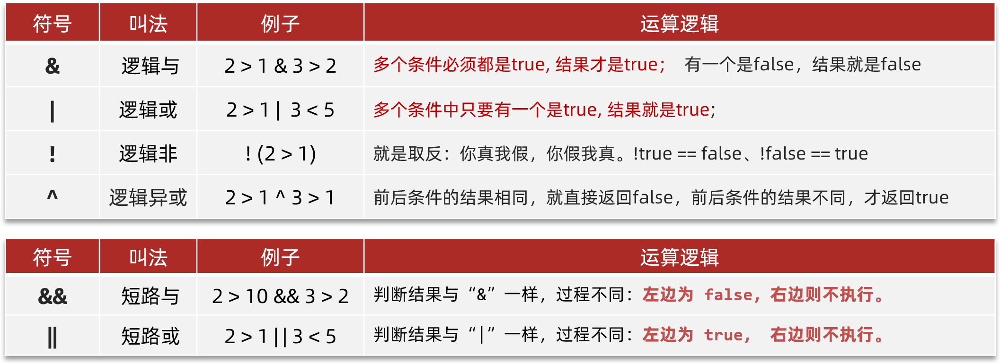

##### 三元运算符

- ```
  关系表达式? 值1 : 值2;
  ```

- 首先计算关系表达式的值，如果关系表达式的值为true，则返回值1；如果关系表达式的值为false, 则返回值2

##### 运算优先级

- 

#### 方法

##### 方法调用机制

- 

##### 递归

##### 可变参数

- 可变参数是一种特殊的形式参数，定义在方法、构造器的形参列表处，它可以让方法接收多个同类型的实际参数。可变参数在方法内部，本质上是一个数组

- 一个形参列表中，只能有一个可变参数

- 一个形参列表中如果多个参数，可变参数需要写在最后

- ```
  int...nums
  ```

#### 面向对象

##### 封装

- 定义：将接口的实现细节与类的内部数据包装隐藏起来并提供外界访问和修改的接口

- 意义：保证代码的安全性；直接修改实现代码，不用修改类的程序片段

- 实现步骤：

  - 属性的可见范围设置为私有

  - 对每个属性提供getter和setter方法

##### 继承

- 定义：子类继承父类的特征和行为

- 意义：便于代码简洁管理，提高复用性

- 特征：
  - 子类拥有父类所有的属性和方法
  - 子类可以拓展自身的属性和方法
  - 子类可以对父类方法进行修改，但没有属性重写这种说法
  - 子类可以通过super调用父类构造器，但是不能继承父类的构造器
  - 加载类时从Oject类一直加载到子类，所有的属性，构造器，方法都会加载，创建实例时父类所有声明的成员属性都会在对象中分配空间，与是否允许被子类访问以及是否被子类覆盖无关

##### 多态

- 定义：同一行为具有不同表现形态
- 意义：利用多态机制，实现对代码统一管理，让同一父类的不同子类互通有无
- 重要思想：编译类型是不能修改的（=左边），运行类型是可以修改的（=右边）
  - 向上转型（父类引用指向子类对象）：可以调用父类成员，不可以调用子类特有成员，方法最终运行效果由子类决定，属性只看编译类型，由父类决定
  - 向下转型（父类引用转为子类）：只能转换父类的引用，不能转换父类对象，可以调用子类的所有成员


- 应用：
  - 多态数组：数组的定义类型为父类类型，里面保存的实际元素类型为子类类型
  - 多态参数：形参为父类，实参为子类


##### 访问修饰符

- public：全公开

- private：只有本类对象可以访问

- protected：只有同一包内的类或其子类可以访问

##### this

- 哪个对象调用，this就代表哪个对象，this就是一个变量，用在方法中，可以拿到当前类的对象。this 不能在类定义的外部使用，只能在类定义的方法中使用

##### super

##### final

- final修饰类：该类称为最终类，特点是不能被继承
- final修饰方法：该方法称之为最终方法，特点是不能被重写。
- final修饰变量：该变量只能被赋值一次。
- 被 static final 修饰的成员变量，称之为常量。

##### 构造器

- 构造器其实是一种特殊的方法，但是这个方法没有返回值类型，方法名必须和类名相同。**new 对象就是在执行构造方法**
- 在设计一个类时，如果不写构造器，Java会自动生成一个无参数构造器。一旦定义了有参数构造器，Java就不再提供空参数构造器，此时建议自己加一个无参数构造器。
- 子类全部构造器，都会先调用父类构造器，再执行自己。子类访问父类构造器：super(参数)；子类访问自己构造器：this(参数)。

##### 重写与重载

- 重写是子类对父类方法的修改；重载是同一类中对处理相似问题的不同对象提供不同方法
- 重写方法的参数类型和返回类型都不能修改，异常与可见性都不能比父类窄
- 重载方法的参数列表必须修改，其他随意

##### 类变量

- 类变量有static修饰，是属于类的，与类一起被加载一次，在JVM中只有一份，被类的所有对象共享，并由访问修饰符决定是否能被其他类共享，只需要通过类名就可以调用；实例对象是属于每个对象的，需要通过对象才能调用。
- 

##### 类方法

- 定义在类中的静态方法
- 不需要实例化对象就能调用类的方法，常用于工具类（构造方法私有化防止使用者用对象调用）
- 注意：
  - 类方法随着类的加载而加载储存在方法区，
  - 类方法可以通过类名调用
  - 类方法中不可出现this和super
  - 类方法只能访问静态变量和静态方法


- 

##### 代码块

- 定义：没有方法名，没有参数，没有返回，只有方法体；不通过对象显式调用，加载类或创建对象时隐式调用（最先调用）
- 意义：如果多个构造器中有相同的语句，可以抽离出代码块
- 注意：
  - static代码块在类加载时调用，只会执行一次；普通代码块在创建对象时执行
  - 类什么时候被加载？创建自身对象时；创建子类对象时；使用该类的静态变量或方法


- 实例化对象时，类的加载顺序：
  - 执行静态代码块，初始化静态变量，
  - 执行普通代码块，初始化普通变量
  - 执行构造函数


##### 类加载

- 类什么时候被加载
  - 创建对象时
  - 创建子类对象时
  - 使用类的静态成员时
- 对象创建流程
  - 类加载(详见反射)
    - 执行静态代码块，初始化静态变量，保存到堆
    - 创建字节码文件，保存类信息到方法区
  - 创建对象
    - 在堆中分配地址
    - 执行普通代码块，初始化普通变量（默认初始化，将有赋值的变量显示初始化）
    - 执行构造函数（构造器初始化）
  - 将地址返回给栈中的引用

##### 抽象类

- 意义：对于子类中已经确定功能进行封装（模板方法模式）
- 特征：
  - 通过继承实现，无法被实例化
  - 子类必须实现抽象类中的抽象方法
  - 抽象类可以拥有任意的成员

##### 接口

- 意义：将设计与实现分离；按相同的规则实现方法，便于不同主体间的联系
- 特征：
  - 接口所有方法都必须是public，默认为抽象方法，不用声明abstract
  - 普通类必须实现接口本身及其继承的所有方法
  - 抽象类可以不全部实现接口的方法
  - 接口中的属性必须是public static final
  - 接口可以多重继承


- 接口多态：
  - 接口声明可以指向实现类及其子类，只能访问实现类中实现的方法
  - 接口数组中可以存放实现类及其子类


- 默认方法(提供方法的默认实现)

  - ```java
    //必须使用default修饰，默认会被public修饰
    default void test1(){
            System.out.println("===默认方法==");
            test2();
        }
    ```

- 私有方法(供实现类自己使用)

  - ```java
    //私有方法：必须使用private修饰。(JDK 9开始才支持的)
        private void test2(){
            System.out.println("===私有方法==");
        }
    ```

- 静态方法

  - ```java
    //静态方法：必须使用static修饰，默认会被public修饰
         static void test3(){
            System.out.println("==静态方法==");
         }
    ```

  - 以上三种方法都不需要对象实现

#### 内部类

- 一个类的内部镶嵌了另一个类，是类的五大结构之一（属性，方法，构造器，代码块，内部类）

##### 局部内部类

- 局部内部类是定义在方法中的类，和局部变量一样，只能在方法中有效。所以局部内部类的局限性很强，一般在开发中是不会使用的。

##### 匿名内部类

- 意义：对于只用一次的类，没必要为此特别创建一个类，可以简化开发

- 特征：

  - ```java
    new 父类/接口(参数值){
        @Override
        重写父类/接口的方法;
    }
    ```

  - 匿名内部类本质上是一个没有名字的子类对象、或者接口的实现类对象。

  - 接口和抽象类是不可以直接实例化的，但是如果在其后添加实现接口或继承抽象类的代码块，就可以被实例化，如此形成了“一次性”的类（重写与实例化同时进行），参数传递给父类构造器（无用），对象只用一次的话甚至不需要接受，直接调用。运行时该类在系统内部隐式创建并马上创建实例，把地址返回给引用变量，名字带＄


- 实践：匿名内部类当作实参传递，简洁高效（参数列表内直接写匿名内部类实例）

##### 成员内部类

- 成员内部类就是类中的一个普通成员，类似于成员变量、成员方法。

- ```java
  //外部类.内部类 变量名 = new 外部类().new 内部类();
  Outer.Inner in = new Outer().new Inner();
  //调用内部类的方法
  in.test();
  ```

- 如果内部类成员和外部类成员同名，可以使用**`类名.this.成员`**区分

##### 静态内部类

- 静态内部类，其实就是在成员内部类的前面加了一个static关键字。静态内部类属于外部类自己持有。

#### 枚举

##### 语法

- ```java
  public enum A{
      //定义枚举项
      X,Y,Z("张三"); //枚举项后面加括号，就是在执行枚举类的带参数构造方法。
      
      //定义空构造器
      public A(){
          
      }
      
      //成员变量
      private String name;
      //定义带参数构造器
      public A(String name){
          this.name=name;
      }
      
      //成员方法
      public String getName(){
          return name;
      }
      ...
  }
  ```

##### 原理

- 枚举就是一个特殊的类，在代码编译阶段被编译为一个具体的类（可以通过类名直接访问属性）

  - ```java
    public final class A extend java.lang.Enum<A>{
        public static final A X("张三");
        public static final A Y;
        public static final A Z;
        public A(){
            
        }
        
        private String name;
    
        public A(String name){
            this.name=name;
        }
        
        public String getName(){
            return name;
        }
    }
    ```

#### 异常

##### 概述

- 写代码时经常会出现问题，Java的设计者们早就为我们写好了很多个异常类，来描述不同场景下的问题。而有些类是有共性的所以就有了异常的继承体系
- 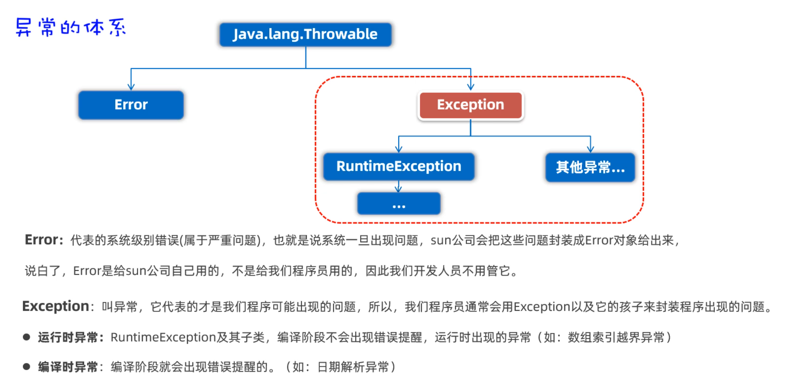

##### 解决异常

- throws
  - 使用throws在方法上声明，意思就是告诉下一个调用者，这里面可能有异常，调用时自行处理
- try catch finally
  - 对异常进行捕获并提供异常出现后的解决方案

##### 自定义异常

- Java提供的异常表达范围有限，有时需要我们根据具体业务自定义异常

- 编译时异常

  - 继承Exception就是编译时异常，编译时异常必须处理，一般为语法错误

  - ```java
    public class AgeIllegalException extends Exception{
        public AgeIllegalException() {
        }
    	//抛异常本质上就是new一个异常对象，可以用无参构造也可以提供异常信息
        public AgeIllegalException(String message) {
            super(message);
        }
    }
    ```

- 运行时异常

  - 继承RuntimeException就是运行时异常，运行时异常不一定要处理，不处理则异常最终被抛到JVM，最终表现形式为控制台输出异常信息。

#### 注解

##### 概述

- Java注解是代码中的特殊标记，比如@Override、@Test等，作用是**让其他程序根据注解信息决定怎么执行该程序**。

- 定义注解本质上是定义接口，每一个注解接口都继承Annotation接口；注解中的属性本质上是抽象方法；使用注解本质上就是实现接口，属性值可以通过调用抽象方法得到

  - ```java
    public @interface MyTest{
        String value(); //每个注解都有的特殊属性，在使用时可省略
        int age() default 10;//指定默认值，相当于抽象方法，返回值是int，默认值是10
    }
    ```

  - ```java
    //反编译
    public interface Mytest extend Annotation{
        public abstract String value();
        public abstract int age();
    }
    ```
  
  - ```java
    @MyTest(value = '张三'， age = '18')
    
    等价于
    
    public class ann implement Mytest{
        public String value(){
            return "张三"
        }
        public int age(){
            return 18;
        }
    }
    
    d
    ```
  
  - 

##### 元注解

- **元注解是修饰注解的注解**
- @Target是用来声明注解只能用在那些位置，比如：类上、方法上、成员变量上等（在ElementType这个枚举中）
- @Retetion是用来声明注解保留周期，比如：源代码时期、字节码时期、运行时期（在RetentionPolicy这个枚举中）
- 我们在自定义注解时要加上这两个注解指定注解的应用范围

##### 解析注解

- 我们可以通过反射技术把类上、方法上、变量上的注解对象获取出来，然后通过调用方法就可以获取注解上的属性值了，结合我们自己的业务判断即可控制代码执行逻辑
- 注解在谁身上，就先获取谁，再用谁获取谁身上的注解
  - 

##### 注解应用

- 注解是用来写框架的，比如现在我们要模拟Junit写一个测试框架，要求有@MyTest注解的方法可以被框架执行，没有@MyTest注解的方法不能被框架执行。

- ```java
  public class AnnotationTest4{
      @MyTest
      public void test1(){
          System.out.println("=====test1====");
      }
      
      @MyTest
      public void test2(){
          System.out.println("=====test2====");
      }
      
  
      public void test3(){
          System.out.println("=====test2====");
      }
      
      public static void main(String[] args){
          AnnotationTest4 a = new AnnotationTest4();
          
          //1.先获取Class对象
          Class c = AnnotationTest4.class;
          
          //2.解析AnnotationTest4类中所有的方法对象
          Method[] methods = c.getDeclaredMethods();
          for(Method m: methods){
              //3.判断方法上是否有MyTest注解，有就执行该方法
              if(m.isAnnotationPresent(MyTest.class)){
              	m.invoke(a);
          	}
          }
      }
  }
  ```

#### 常用API

##### Object类

- Object类是Java中所有类的祖宗类，因此，Java中所有类的对象都可以直接使用Object类中提供的一些方法。

- equals方法

  - 在Object类中equals只能判断引用变量是否指向同一个地址，在子类（String，Integer）中经常通过重写实现判断引用变量指向的内容是否相等


  - ==
    - 判断基本类型时判断值是否相等
    - 判断引用类型时判断地址是否相等

  - equals
    - 只能判断引用类型，在Object类中equals只能判断引用变量是否指向同一个地址，在子类中经常通过重写实现判断引用变量指向的内容是否相等。


- hashCode方法
  - 返回对象的哈希值，哈希值是真实地址转换而来的int型数据，不能代表真实的内存位置，equals是基于hashCode判断的

- toString方法
  - 调用toString()方法可以返回对象的字符串表示形式。默认的格式是：“包名.类名@哈希值16进制”。


- finalize方法

  - 什么时候被回收：当JVM发现某个对象没有引用时


  - 对象被回收时自动调用该方法，通过重写实现释放资源的功能，Systems.gc()主动回收

##### Objects类

- Objects是一个工具类，提供了一些方法可以对任意对象进行操作。
- 

##### 包装类

- 自动装箱：将基本数据类型直接赋值给包装类对象，底层是valueOf()

  - ```java
    //1.创建Integer对象，封装基本类型数据10
    Integer a = new Integer(10);
    
    //2.使用Integer类的静态方法valueOf(数据)
    Integer b = Integer.valueOf(10);
    
    //3.自动装箱的写法（意思就是自动将基本类型转换为引用类型）
    Integer c = 10;
    ```

- 自动拆箱：将包装类对象直接赋值给基本数据类型变量，底层是xxxValue()

  - ```java
    int a = intValue(new Integer(10));
    ```

- 数据类型转换

  - ```java
    //1.字符串转换为数值型数据
    String ageStr = "29";
    int age1 = Integer.parseInt(ageStr);
    (scoreStr);
    //2.整数转换为字符串，以下几种方式都可以
    Integer a = 23;
    String s1 = Integer.toString(a);
    String s2 = a.toString();
    String s3 = a+"";
    String s4 = String.valueOf(a);
    ```

- 注意：Integer使用装箱赋值，JVM为了提高效率，在变量池中存放了一个字节的整型（-128~127），当值在这个范围内时，引用变量直接指向内存池，其他情况包括new一个都要在堆中创建对象

##### String类

- String：不可以被修改，“修改时”引用变量只能重新指向新创建的常量，底层是一个char数组。直接赋值的字符串对象，会存储到字符串常量池，且相同内容的字符串只存储一份。但通过`new`方式创建字符串对象，每new一次都会产生一个新的对象放在堆内存中。
- 

##### StringBuilder

- StringBuilder代表可变字符串对象，相当于是一个容器，它里面的字符串是可以改变的，比String更合适做字符串的修改操作，效率更高，代码也更加简洁。

- | 方法                                    | 描述             |
  | --------------------------------------- | ---------------- |
  | append(String value)                    | 追加             |
  | insert(int location,String value)       | 插入             |
  | delete(int start,int end)               | 删除（左闭右开） |
  | replace(int start,int end,String value) | 替换             |
  | subsString(int start,int end)           | 截取             |
  | reverse()                               | 颠倒             |

##### BigDecimal类

- 提供了一些方法可以对数据进行四则运算，而且不丢失精度，同时还可以保留指定的小数位。

##### Maths类

- | 方法              | 描述      |
  | ----------------- | --------- |
  | abs(num)          | 绝对值    |
  | ceil(double num)  | 向上取整  |
  | floor(double num) | 向下取整  |
  | round(double a)   | 四舍五入  |
  | max(num1,num2)    | 取较大值  |
  | min(num1,num2)    | 取较小值  |
  | pow(num1,num2)    | 幂运算    |
  | random()          | 0~1随机数 |

##### Collections类

- Collections并不是集合，它比Collection多了一个s，一般后缀为s的类很多都是工具类。Collections是用来操作Collection的工具类,提供了一些好用的静态方法:反转(reverse)排序(sort)交换(swap)打乱(shuffle)最大值(max)最小值(min)出现次数(frequency)拷贝(copy)替换(replace)，这些方法的定义中用到了可变参数，以便我们传入多个值

- ```java
  List<String> names = new ArrayList<>();
  Collections.addAll(names, "张三","王五","李四", "张麻子");
  ```

##### Arrays类

- 操作数组的工具类，它可以很方便的对数组中的元素进行遍历、拷贝、排序等操作。

  - ```java
    public static void main(String[] args) {
            // 拷贝数组（左开右闭）
            int[] arr2 = Arrays.copyOfRange(arr, 1, 4);
            // 拷贝数组，可以指定新数组的长度。
            int[] arr3 = Arrays.copyOf(arr, 10);
            // 把数组中的原数据改为新数据又存进去。
            double[] prices = {99.8, 128, 100};
            // 把所有的价格都打八折，然后又存进去。
            Arrays.setAll(prices, new IntToDoubleFunction() {
                @Override
                public double applyAsDouble(int value) {
                    // value = 0  1  2
                    return prices[value] * 0.8;
                }
            });
            // 数组进行排序(默认是升序排序)
            Arrays.sort(prices);
        }
    ```

- 操作对象数组

  - 让实体类实现Comparable接口，同时重写compareTo方法。Arrays的sort方法底层会根据compareTo方法的返回值是正数、负数、还是0来确定谁大、谁小、谁相等。

    - ```java
      public class Student implements Comparable<Student>{
          private String name;
          private double height;
          private int age;
          @Override
          public int compareTo(Student o) {
              // 约定1：认为左边对象 大于 右边对象 请您返回正整数
              // 约定2：认为左边对象 小于 右边对象 请您返回负整数
              // 约定3：认为左边对象 等于 右边对象 请您一定返回0
              return this.age - o.age;
          }
      }
      ```


  - 在调用`Arrays.sort(数组,Comparator比较器);`时，除了传递数组之外，传递一个Comparator比较器对象。Arrays的sort方法底层会根据Comparator比较器对象的compare方法方法的返回值是正数、负数、还是0来确定谁大、谁小、谁相等。

    - ```java
      public static void main(String[] args) {
              Student[] students = new Student[4];
              students[0] = new Student("蜘蛛精", 169.5, 23);
              students[1] = new Student("紫霞", 163.8, 26);
              students[2] = new Student("紫霞", 163.8, 26);
              students[3] = new Student("至尊宝", 167.5, 24);
              Arrays.sort(students, new Comparator<Student>() {
                  @Override
                  public int compare(Student o1, Student o2) {
                       return Double.compare(o1.getHeight(), o2.getHeight()); 
                  }
              });
          }
      ```

##### System类

- 系统类，提供了一些获取获取系统数据的方法。

- | 方法                | 描述                                 |
  | ------------------- | ------------------------------------ |
  | exit(0)             | 终止JVM                              |
  | currentTimeMillis() | 获取当前时间距离1970-1-1 0:0:0毫秒值 |

##### Rumtime类

- Java的运行时类，这可以用来获取JVM的一些信息，也可以用这个类去执行其他的程序。

- | 方法                             | 描述                                   |
  | -------------------------------- | -------------------------------------- |
  | Runtime r = Runtime.getRuntime() | 返回与当前Java应用程序关联的运行时对象 |
  | r.availableProcessors()          | 获取虚拟机能够使用的处理器数           |
  | r.totalMemory()                  | 返回Java虚拟机中的内存总量             |
  | r.freeMemory()                   | 返回Java虚拟机中的可用内存量           |
  | r.exec("QQ")                     | 启动某个程序，并返回代表该程序的对象。 |


##### Date类

- ```java
  public static void main(String[] args) {
          // 1、创建一个Date的对象：代表系统当前时间信息的。
          Date d = new Date();
          // 2、拿到时间毫秒值。
          long time = d.getTime();
          // 3、把时间毫秒值转换成日期对象
          Date d2 = new Date(time);
          // 4、直接把日期对象的时间通过setTime方法进行修改
          Date d3 = new Date();
          d3.setTime(time);
      }
  ```

##### SimpleDateFormate类

- ```java
  public static void main(String[] args) throws ParseException {
          Date d = new Date();
          long time = d.getTime();
          //格式化日期对象，和时间毫秒值。
          SimpleDateFormat sdf = new SimpleDateFormat("yyyy年MM月dd日 HH:mm:ss EEE a");
          String rs = sdf.format(d);
          String rs2 = sdf.format(time);
  
          //SimpleDateFormat解析字符串时间 成为日期对象。
          String dateStr = "2022-12-12 12:12:11";
          SimpleDateFormat sdf2 = new SimpleDateFormat("yyyy-MM-dd HH:mm:ss");
          Date d2 = sdf2.parse(dateStr);
          System.out.println(d2);
      }
  ```

- ```
  字母	   表示含义
  yyyy	年
  MM		月
  dd		日
  HH		时
  mm		分
  ss		秒
  SSS		毫秒
  ```

##### Calendar类

- Calendar类表示日历，可以直接对日历中的年、月、日、时、分、秒等进行运算。

- ```java
  public static void main(String[] args) {
          //得到系统此刻时间对应的日历对象。
          Calendar now = Calendar.getInstance();
          // 获取日历中的某个信息
          int year = now.get(Calendar.YEAR);
          int days = now.get(Calendar.DAY_OF_YEAR);
          // 拿到日历中记录的日期对象。
          Date d = now.getTime();
          // 拿到时间毫秒值
          long time = now.getTimeInMillis();
          // 修改日历中的某个信息
          now.set(Calendar.MONTH, 9); 
          now.set(Calendar.DAY_OF_YEAR, 125); 
          // 为某个信息增加或者减少多少
          now.add(Calendar.DAY_OF_YEAR, 100);
          now.add(Calendar.DAY_OF_YEAR, -10);
          now.add(Calendar.DAY_OF_MONTH, 6);
          now.add(Calendar.HOUR, 12);
          now.set(2026, 11, 22);
      }
  ```

##### LocalDate/LocalTime/LocalDateTime类

- 代替Calendar

- ```java
  public static void main(String[] args) {
          // 获取本地日期对象(不可变对象)
          LocalDate ld = LocalDate.now();
          // 获取日期对象中的信息
          int year = ld.getYear(); 
          int month = ld.getMonthValue(); 
          int day = ld.getDayOfMonth(); 
          int dayOfYear = ld.getDayOfYear();  // 一年中的第几天
          int dayOfWeek = ld.getDayOfWeek().getValue(); // 星期几
          // 直接修改某个信息: withYear、withMonth、withDayOfMonth、withDayOfYear
          LocalDate ld2 = ld.withYear(2099);
          LocalDate ld3 = ld.withMonth(12);
          //把某个信息加多少: plusYears、plusMonths、plusDays、plusWeeks
          LocalDate ld4 = ld.plusYears(2);
          LocalDate ld5 = ld.plusMonths(2);
          // 把某个信息减多少：minusYears、minusMonths、minusDays、minusWeeks
          LocalDate ld6 = ld.minusYears(2);
          LocalDate ld7 = ld.minusMonths(2);
          //获取指定日期的LocalDate对象： public static LocalDate of(int year, int month, int dayOfMonth)
          LocalDate ld8 = LocalDate.of(2099, 12, 12);
          // 判断2个日期对象，是否相等，在前还是在后： equals isBefore isAfter
          System.out.println(ld8.equals(ld9));
          System.out.println(ld8.isAfter(ld));
          System.out.println(ld8.isBefore(ld));
      }
  ```

##### 时区类

- ```java
  public static void main(String[] args) {
          // 获取系统默认的时区
          ZoneId zoneId = ZoneId.systemDefault();
          // 获取Java支持的全部时区Id
          System.out.println(ZoneId.getAvailableZoneIds());
  
          // 把某个时区id封装成ZoneId对象。
          ZoneId zoneId1 = ZoneId.of("America/New_York");
  
          // 获取某个时区的ZonedDateTime对象。
          ZonedDateTime now = ZonedDateTime.now(zoneId1);
  
          // 世界标准时间
          ZonedDateTime now1 = ZonedDateTime.now(Clock.systemUTC());
  
          // 获取系统默认时区的ZonedDateTime对象
          ZonedDateTime now2 = ZonedDateTime.now();
      }
  ```

##### Instant类

- 获取Instant的对象可以拿到此刻的时间，该时间由两部分组成：从1970-01-01 00:00:00 开始走到此刻的总秒数+不够1秒的纳秒数。（代替Date）

- ```java
  public static void main(String[] args) {
         // 创建Instant的对象，获取此刻时间信息
          Instant now = Instant.now(); // 不可变对象
          //、获取总秒数
          long second = now.getEpochSecond();
          // 不够1秒的纳秒数
          int nano = now.getNano();
          Instant instant = now.plusNanos(111);
          // Instant对象的作用：做代码的性能分析，或者记录用户的操作时间点
      }
  ```

##### DateTimeFormater类

- 替代SimpleDateFormat

- ```java
  public static void main(String[] args) {
          // 创建一个日期时间格式化器对象
          DateTimeFormatter formatter = DateTimeFormatter.ofPattern("yyyy年MM月dd日 HH:mm:ss");
          // 对时间进行格式化
          LocalDateTime now = LocalDateTime.now();
          String rs = formatter.format(now); // 正向格式化
          String rs2 = now.format(formatter); // 反向格式化
          // 解析时间
          String dateStr = "2029年12月12日 12:12:11";
          LocalDateTime ldt = LocalDateTime.parse(dateStr, formatter);
      }
  ```

##### Period/Duration类

- 计算两个时间点的时间间隔。其中Period用来计算日期间隔（年、月、日），Duration用来计算时间间隔（时、分、秒、纳秒）

- ```java
  public static void main(String[] args) {
          LocalDate start = LocalDate.of(2029, 8, 10);
          LocalDate end = LocalDate.of(2029, 12, 15);
          LocalDateTime start = LocalDateTime.of(2025, 11, 11, 11, 10, 10);
          LocalDateTime end = LocalDateTime.of(2025, 11, 11, 11, 11, 11);
          // 创建Period对象
          Period period = Period.between(start, end);
          // 得到Duration对象
          Duration duration = Duration.between(start, end);
      }
  ```

#### 集合

##### Collection接口

- 表示单列集合，没有直接的实现子类，由List和Set接口进一步划分为两种类型，其规定了实现类中存放Oject类，以及可以进行增(add)删(remove)改(set)查(get)的特性
  - 

- List接口规定了子类中可重复，可索引，有顺序的特性；Map接口规定了子类中不可重复，不可索引，无顺序的特征
  - 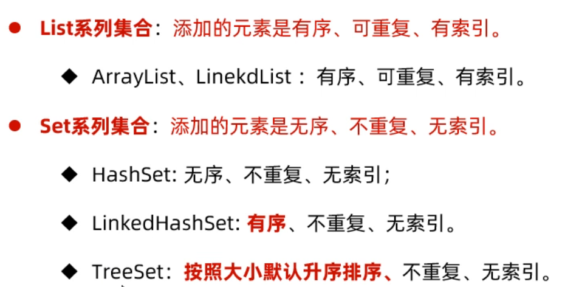

- 单列集合通用方法
  - 

- List接口方法
  - List集合是索引的，所以多了一些有索引操作的方法
  - 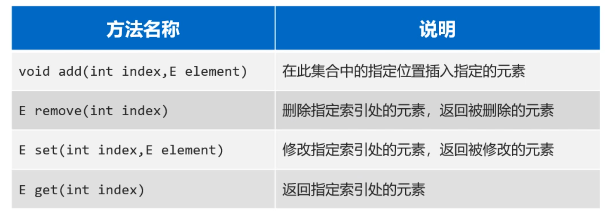

###### ArrayList

- 底层是一个Object类型的数组，具有数组的特点：改查效率高，增删效率低。
- 扩容机制
  - 数组扩容，并不是在原数组上扩容（原数组是不可以扩容的），底层是创建一个新数组，然后把原数组中的元素全部复制到新数组中去。原数组失去引用被回收。
  - 


###### Vector

- 与ArrayList类似，但是线程安全，并且是两倍扩容

###### LinkList

- 底层是双向链表结构，具有链表的特点：查询慢，增删快
- 对于ArrayList新增了一些可以针对头尾进行操作的方法
  - 

###### HashSet

- HashSet集合底层是基于HashMap实现的，HashMap根据JDK版本的不同，也是有点区别的。往HashSet集合中存储元素时，底层调用了元素的两个方法：一个是hashCode方法获取元素的hashCode值（哈希值）；另一个是调用了元素的equals方法，用来比较新添加的元素和集合中已有的元素是否相同。 
  - 只有新添加元素的hashCode值和集合中以后元素的hashCode值相同、新添加的元素调用equals方法和集合中已有元素比较结果为true, 才认为元素重复。
  - 如果hashCode值相同，equals比较不同，则以链表的形式连接在数组的同一个索引为位置
- 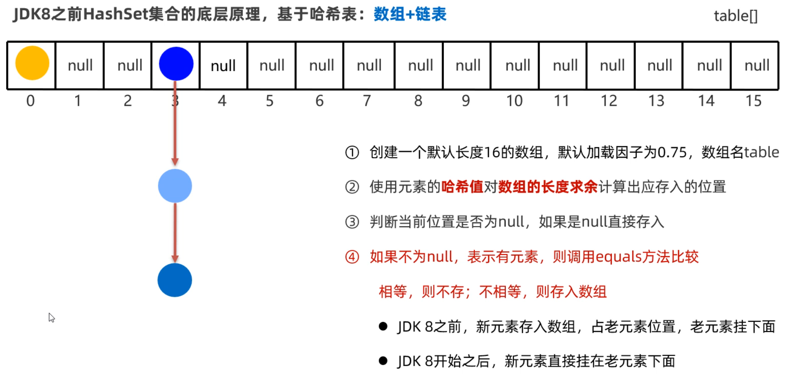

- 

###### LinkedHashSet

- 是HashSet的子类，底层采用的是LinkedHashMap，额外新增了一个双向链表来维护元素的存取顺序。每次添加元素，就和上一个元素用双向链表连接一下。第一个添加的元素是双向链表的头节点，最后一个添加的元素是双向链表的尾节点。这样存入和取出的顺序就能保持一致。

###### TreeSet

- TreeSet底层是TreeMap，可以对元素进行排序，但是必须指定元素的排序规则。

- ```java
  Set<Student> students = new TreeSet<>((Student o1,Student o2) -> Double.compare(o1.getAge,o2,getAge);
  ```

##### Collection遍历方式

###### 迭代器

- 当调用iterator()方法获取迭代器时，当前指向第一个元素
- hasNext()方法则判断这个位置是否有元素，如果有则返回true，进入循环
- 调用next()方法获取元素，并将当月元素指向下一个位置，
- 等下次循环时，则获取下一个元素，依此内推

- 

###### forEach

- ```java
  Collection<String> c = new ArrayList<>();
  c.add("赵敏");
  c.add("小昭");
  c.add("素素");
  c.add("灭绝");
  //匿名内部类
  c.forEach(new Consumer<String>{
      @Override
      public void accept(String s){
          System.out.println(s);
      }
  });
  //lambda表达式
  c.forEach(s->System.out.println(s));
  ```

##### Map接口

- 双列集合中的元素是一对一对的。Map集合中的每一个元素是以`key=value`的形式存在的，一个`key=value`就称之为一个键值对，键不能重复，值可以重复，每一个键只能找到自己对应的值。而且在Java中有一个类叫Entry类，Entry的对象用来表示键值对对象。
  - 


- 通用方法
  - 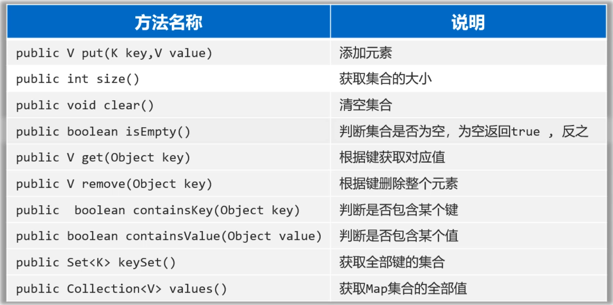

###### HashMap

- 第一次往HashMap集合中存储键值对时，底层会创建一个长度为16的数组

- 把键然后将键和值封装成一个对象，叫做Entry对象

- 再根据Entry对象的键计算hashCode值（和值无关

- 利用hashCode值和数组的长度做一个类似求余数的算法，会得到一个索引位置

- 判断这个索引的位置是否为null，如果为null,就直接将这个Entry对象存储到这个索引位置如果不为null，继续调用equals方法判断两个对象键是否相同，如果equals返回false，则以链表的形式往下挂，如果equals方法true,则认为键重复，此时新的键值对会替换就的键值对。

- HashMap底层需要注意这几点：

  - 底层数组默认长度为16，如果数组中有超过12个位置已经存储了元素，则会对数组进行扩容2倍

  - 数组的同一个索引位置有多个元素、并且在8个元素以内(包括8)，则以链表的形式存储
    	JDK7版本：链表采用头插法（新元素往链表的头部添加）
    	JDK8版本：链表采用尾插法（新元素我那个链表的尾部添加）	
  - 数组的同一个索引位置有多个元素、并且超过了8个，则以红黑树形式存储
  - 往Map集合中存储自定义对象作为键，为了确定重复判定条件，我们应该重写hashCode方法和equals方法。

###### HashTable

- 与HashMap不同点：线程安全；键和值都不能为null

##### Map遍历方式

###### 键找值

- ```java
      public static void main(String[] args) {
          // 1、获取键的集合
          Set<String> keys = map.keySet();
          // 2、遍历全部的键，根据键获取其对应的值
          for (String key : keys) {
              // 根据键获取对应的值
              double value = map.get(key);
          }
      }
  ```

###### 键值对

- ```java
  public static void main(String[] args) { 
          // 1、把Entry存储到Set集合
          Set<Map.Entry<String, Double>> entries = map.entrySet();
      	// 2、遍历
          for (Map.Entry<String, Double> entry : entries) {
              String key = entry.getKey();
              double value = entry.getValue();
          }
      }
  ```

###### forEach

- ```java
  map.forEach(( k,  v) -> {
              System.out.println(k + "---->" + v);
  ```

#### 泛型

##### 概述

- 对集合中的数据类型进行约束，解决数据安全性问题
- 在取出数据时不用类型转换
- 可以在实例化对象时再确定属性的数据类型，提高代码灵活性
- 在编译阶段可以避免出现一些非法的数据。（泛型仅仅存在于编译阶段，.class文件中泛型被抹去）

##### 自定义泛型

- 类

  - ```java
    //具体类型由对象决定
    public class 类名<T,W>{
        //泛型使用
        T name;
        W age;
    }
    ```

- 方法

  - ```java
        //<T>表示泛型定义，T表示泛型使用
        public static <T> test(T t){
            return t;
        }
    ```

##### 泛型限定

- <?> 表示任意类型
- <? extends 数据类型> 表示指定类型或者指定类型的子类
- <? super 数据类型> 表示指定类型或者指定类型的父类

##### 泛型擦除

- **泛型只能编译阶段有效，一旦编译成字节码，字节码中是不包含泛型的**。而且泛型只支持引用数据类型，不支持基本数据类型。

#### 多线程

##### 线程

- 一个运行中的程序就是一个进程，一个进程中有许多个线程，比如百度网盘是一个进程。里面的许多下载任务是不同的线程。多线程可以充分的调度CPU的性能，一个线程是CPU的最小处理单元，一个CPU在同一时间只能处理一个线程，但当其交替切换执行多个线程时，我们观测到的是多个线程同时执行。进程之间是相互隔离的，不会发生安全问题但是比较浪费资源；而线程之间内存是共享的(新建一个线程相当于新开辟一个栈队列，还是可以访问到堆中的数据)，节约资源但是存在安全问题。

##### 线程创建

- 继承Tread类

  - 重写run方法，创建该类的对象并调用start方法启动线程（不能直接去调用run方法，如果直接调用run方法就不认为是一条线程启动了，而是把Thread当做一个普通对象，此时run方法中的执行的代码会成为主线程的一部分）

- 实现Runnable接口

  - ````java
        public static void main(String[] args) {
            //Runnable实现类的对象必须传递给Thread
            new Thread(new Runnable() {
                @Override
                public void run() {
                    for (int i = 1; i <= 5; i++) {
                        System.out.println("子线程2输出：" + i);
                    }
                }
            }).start();
    
            // 简化
            new Thread(() -> {
                    for (int i = 1; i <= 5; i++) {
                        System.out.println("子线程3输出：" + i);
                    }
            }).start();
        }
    ````

- 有返回结果

  - 实现Callable接口

    - ```java
      public class MyCallable implements Callable<String> {
      
              @Override
              public String call() throws Exception {       System.out.println("MyCallable 线程：" + Thread.currentThread().getName());
                  return "MyCallable" ;
              }
          }
      ```

  - 创建线程

    - ```java
      public static void main(String[] args) throws Exception {
              // 创建一个Callable的对象
              Callable<String> call = new MyCallable(10);
              // 把Callable的对象封装成一个FutureTask对象（任务对象）
              // 未来任务对象的作用？
              // 1、是一个任务对象，实现了Runnable接口
              // 2、可以在线程执行完毕之后，用未来任务对象调用get方法获取线程执行完毕后的结果。
              FutureTask<String> f1  = new FutureTask<>(call);
              // 把任务对象交给一个Thread对象
              new Thread(f1).start();
              Callable<String> call2 = new MyCallable(200);
              FutureTask<String> f2  = new FutureTask<>(call2);
              new Thread(f2).start();
              // 获取线程执行完毕后返回的结果。
              // 注意：如果执行到这儿，假如上面的线程还没有执行完毕
              // 这里的代码会暂停，等待上面线程执行完毕后才会获取结果。
              String rs = f1.get();
              String rs2 = f2.get();
          }
      ```

##### 常用方法

- 

##### 锁

###### 同步代码块

- 把访问共享数据的代码锁起来，以此保证线程安全。

  - ```java
    //锁对象：必须是一个唯一的对象（同一个地址，拿到这个对象的线程才能执行下面的代码块）
    synchronized(锁对象){
        //...访问共享数据的代码...
    }
    ```

  - ```java
    public class Account {
        private String cardId; // 卡号
        private double money; // 余额。
    
        // 小明 小红同时过来的
        public void drawMoney(double money) {
            // 先搞清楚是谁来取钱
            String name = Thread.currentThread().getName();
            // 1、判断余额是否足够
        // this正好代表共享资源(同一个账户)
        synchronized (this) {
            if(this.money >= money){
                System.out.println(name + "来取钱" + money + "成功！");
                this.money -= money;
                System.out.println(name + "来取钱后，余额剩余：" + this.money);
            }else {
                System.out.println(name + "来取钱：余额不足~");
            }
        }
    }
    ```

- 锁对象的选择

  - 建议把共享资源作为锁对象, 不要将随便无关的对象当做锁对象
  - 对于实例方法，建议使用this作为锁对象
  - 对于静态方法，建议把类的字节码(类名.class)当做锁对象（类仅仅被加载一次，内存中只有一个Class对象）

###### 同步方法

- 同步方法，就是把整个方法给锁住，一个线程调用这个方法，另一个线程调用的时候就执行不了，只有等上一个线程调用结束，下一个线程调用才能继续执行。

  - ```java
    // 同步方法
    public synchronized void drawMoney(double money) {
        // 先搞清楚是谁来取钱？
        String name = Thread.currentThread().getName();
        // 1、判断余额是否足够
        if(this.money >= money){
            System.out.println(name + "来取钱" + money + "成功！");
            this.money -= money;
            System.out.println(name + "来取钱后，余额剩余：" + this.money);
        }else {
            System.out.println(name + "来取钱：余额不足~");
        }
    }
    ```

- 原理

  - 同步方法也是有锁对象，只不过这个锁对象没有显示的写出来而已。
  - 对于实例方法，锁对象其实是this（也就是方法的调用者）
  - 对于静态方法，锁对象时类的字节码对象（类名.class）

- 同步代码块和同步方法区别

  - 不存在哪个好与不好，只是一个锁住的范围大，一个范围小
  - 同步方法是将方法中所有的代码锁住
  - 同步代码块是将方法中的部分代码锁住

###### Lock锁

- Lock锁是JDK5版本专门提供的一种锁对象，通过这个锁对象的方法来达到加锁，和释放锁的目的，使用起来更加灵活。

  - ```java
    //首先在成员变量位置，需要创建一个Lock接口的实现类对象（这个对象就是锁对象）
    	private final Lock lk = new ReentrantLock();
    //在需要上锁的地方加入下面的代码
    	 lk.lock(); // 加锁
    	 //...中间是被锁住的代码...
    	 lk.unlock(); // 解锁
    ```

- ```java
  // 创建了一个锁对象
  private final Lock lk = new ReentrantLock();
  
  public void drawMoney(double money) {
          // 先搞清楚是谁来取钱？
          String name = Thread.currentThread().getName();
          try {
              lk.lock(); // 加锁
              // 1、判断余额是否足够
              if(this.money >= money){
                  System.out.println(name + "来取钱" + money + "成功！");
                  this.money -= money;
                  System.out.println(name + "来取钱后，余额剩余：" + this.money);
              }else {
                  System.out.println(name + "来取钱：余额不足~");
              }
          } catch (Exception e) {
              e.printStackTrace();
          } finally {
              lk.unlock(); // 解锁
          }
      }
  }
  ```

##### 线程通信

- 概述
  - 当多个线程共同操作共享资源时，线程间通过某种方式互相告知自己的状态，以相互协调，避免无效的资源争抢。
- 生产者与消费者模型
  - 生产者线程负责生成数据
  - 消费者线程负责消费生产者生成的数据
  - 生产者生产完数据后应该让自己等待，通知其他消费者消费；消费者消费完数据之后应该让自己等待，同时通知生产者生成。（同步）

##### 线程池

- 概述

  - **线程池就是一个可以复用线程的技术**，可以提高线程的利用率。用户每次发起一个请求给后台，后台就创建一个新的线程来处理，下次新的任务过来肯定也会创建新的线程，如果用户量非常大，创建的线程也讲越来越多。然而，创建线程是开销很大的，并且请求过多时，会严重影响系统性能。

- 创建线程池

  - 在JDK5版本中提供了代表线程池的接口ExecutorService，而这个接口下有一个实现类叫ThreadPoolExecutor类，使用ThreadPoolExecutor类就可以用来创建线程池对象。下面是它的构造器，参数比较多
  - 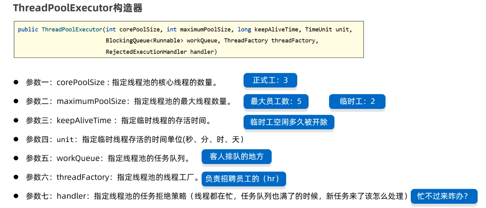

  - ```java
    ExecutorService pool = new ThreadPoolExecutor(
        3,	//核心线程数有3个
        5,  //最大线程数有5个。   临时线程数=最大线程数-核心线程数=5-3=2
        8,	//临时线程存活的时间8秒。 意思是临时线程8秒没有任务执行，就会被销毁掉。
        TimeUnit.SECONDS,//时间单位（秒）
        new ArrayBlockingQueue<>(4), //任务阻塞队列，没有来得及执行的任务在，任务队列中等待
        Executors.defaultThreadFactory(), //用于创建线程的工厂对象
        new ThreadPoolExecutor.CallerRunsPolicy() //拒绝策略
    );
    ```

  - 临时线程创建时机
    - 新任务提交时，发现核心线程都在忙并且任务队列满了才会创建临时线程
  - 拒绝新任务
    - 核心线程和临时线程都在忙、任务队列也满了、新任务过来时才会开始拒绝任务。

- 执行任务
  - 

- 工具类
  - Java为开发者提供了一个创建线程池的工具类，叫做Executors，不推荐使用
  - 

##### 并发和并行

- 并发
  - 进程中的线程由CPU负责调度执行，但是CPU同时处理线程的数量是有限的，为了保证全部线程都能执行到，CPU采用轮询机制为系统的每个线程服务，由于CPU切换的速度很快，给我们的感觉这些线程在同时执行，这就是并发。（简单记：并发就是多条线程交替执行）
- 并行
  - 并行指的是多个线程同时被CPU调度执行，多个CPU核心在执行多条线程

- 其实多个线程在我们的电脑上执行，并发和并行是同时存在的。

##### 线程生命周期

- NEW: 新建状态，线程还没有启动
- RUNNABLE: 可以运行状态，线程调用了start()方法后处于这个状态
- BLOCKED: 锁阻塞状态，没有获取到锁处于这个状态
- WAITING: 无限等待状态，线程执行时被调用了wait方法处于这个状态
- TIMED_WAITING: 计时等待状态，线程执行时被调用了sleep(毫秒)或者wait(毫秒)方法处于这个状态
- TERMINATED: 终止状态, 线程执行完毕或者遇到异常时，处于这个状态。
- 

#### IO流

##### File类

- 程序运行时的数据都是存储在内存中的，只要程序执行结束，数据就消失了，不能永久存储。我们可以将数据以文件的形式存在硬盘里，即使程序结束了，断点了只要硬盘没坏，数据就永久存在。File类就用来表示当前系统下的文件（也可以是文件夹），通过File类提供的方法可以获取文件大小、判断文件是否存在、创建文件、创建文件夹等。（File对象只能对文件进行操作，不能操作文件中的内容）
- 创建File对象
  - 
  - 路径中"\"要写成"\\"， 路径中"/"可以直接用

- 判断和获取
  - 

- 创建删除文件

  - | 方法            | 描述           |
    | --------------- | -------------- |
    | createNewFile() | 创建一个新文件 |
    | mkdir()         | 创建一级文件夹 |
    | mkdirs()        | 创建多级文件夹 |
    | delete()        | 删除文件       |

- 遍历文件夹

  - 

##### 字符集

- UTF-8

  - UTF-8是一种可变长的编码方案，工分为4个长度区

  - 英文字母、数字占1个字节兼容(ASCII编码)

  - 汉字字符占3个字节

  - 极少数字符占4个字节

- 编码解码

  - 编码：把字符串按照指定的字符集转换为字节数组

  - 解码：把字节数组按照指定的字符集转换为字符串

  - ```java
        public static void main(String[] args) throws Exception {
            // 1、编码
            String data = "a我b";
            byte[] bytes = data.getBytes(); // 默认是按照平台字符集（UTF-8）进行编码的。
            System.out.println(Arrays.toString(bytes));
    
            // 按照指定字符集进行编码。
            byte[] bytes1 = data.getBytes("GBK");
            System.out.println(Arrays.toString(bytes1));
    
            // 2、解码
            String s1 = new String(bytes); // 按照平台默认编码（UTF-8）解码
            System.out.println(s1);
    
            String s2 = new String(bytes1, "GBK");
            System.out.println(s2);
        }
    }
    ```

##### 节点流

- 

- FileInputStream FileOutputStream是字节流，传输效率较慢（一个一个字节传输），但能无损传输二进制音频图片文件，在读写非Ascii字符时会将字符拆散出现乱码。
- FileWriter FileReader是字符流，传输效率较快，传输字符时不会出现乱码
- 步骤
  - 创建FileInputStream文件字节输入流管道，与源文件接通。
  - 调用read(byte[] bytes)方法开始读取文件的字节数据。
  - 用close()方法释放资源

##### 处理流

- 缓冲流：BufferInputStream BufferOutputStream BufferReader BufferWriter，对底层的节点流进行代理包装，在内存中开辟数据传输缓冲区（一个长度为8KB的字节数组，），可以更高效率地传输数据
  - **读数据时：**它先用原始字节输入流一次性读取8KB的数据存入缓冲流内部的数组中，再从8KB的字节数组中读取一个字节或者多个字节
  - **写数据时：** 它是先把数据写到缓冲流内部的8BK的数组中，等数组存满了，再通过原始的字节输出流，一次性写到目标文件中
  - 在创建缓冲字节流对象时，需要封装一个原始流对象
- 序列化流：ObjectInputStream(反序列化，恢复数据的值和数据类型) ObjectOutputStream(序列化，保存数据的值和数据类型)，只有实现了Serializable接口的类才能序列化(包装类)，所以读写基本数据类型时会进行自动装箱和拆箱
- 转换流：InputStreamReader OutputStreamWriter，可以将字节流转换为字符流，有效解决中文问题
- 打印流：字节打印流PrintStream，一个是字符打印流PrintWriter，打印其实就是写数据的意思，它和普通的write方法写数据还不太一样，一般会使用打印流特有的方法叫`print(数据)`或者`println(数据)`，它打印啥就输出啥。
- 数据流：把数据和数据的类型一并写到文件中去，读取的时候也将数据和数据类型一并读出来。

##### IO框架

- 框架的名字叫commons-io：其本质是别人写好的一些字节码文件（class文件），打包成了一个jar包。我们只需要把jar包引入到我们的项目中，就可以直接用了。 jar包中提供的工具类叫FileUtils。
- 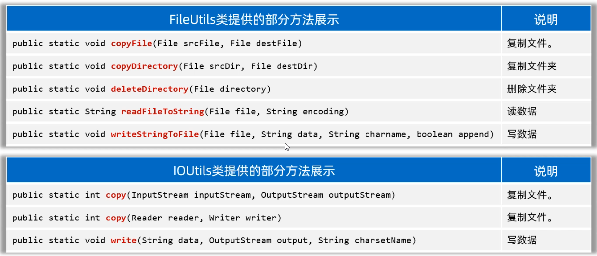

##### 属性文件

- 普通的文本文件，没有任何规律可言，不方便程序对文件中的数据信息处理。后缀为.properties的文件，称之为属性文件，它可以很方便的存储一些类似于键值对的数据。

- Properties

  - Properties是Map接口下面的一个实现类，所以Properties也是一种双列集合，用来存储键值对。Properties类的对象，用来表示属性文件，可以用来读取属性文件中的键值对。
  - 

  - 

##### XML文件

- 本质是一种数据格式，十分严格，可以储存复杂的数据结构和数据关系，经常通过解析用来作为系统的配置文件，或者作为一种特殊的数据结构，在网络中传输严格数据（不严格数据一般采用json）

##### 日志

- 概述
  - 记住某些数据被谁操作，分析用户浏览系统的具体情况，分析，定位Bug...
  - 日志可以将系统执行的信息，方便的记录到指定位置，可以是控制台、可以是文件、可以是数据库中。
  - 日志可以随时以开关的形式控制启停，无需侵入到源代码中去修改。

- 日志使用
  - 使用在行业内最广泛的Logback
  - 在配置文件中配置日志输出的文件地址和日志输出级别
  - 在类上加上@Slf4j注解，这个类中就有了Logger日志对象
  - 通过日志对象记录日志

- 日志级别
  - 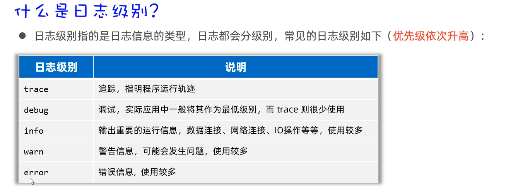

#### 反射

##### 概述

- 反射技术，指的是加载类的字节码（Class对象）到内存，并以编程的方法解刨出类中的各个成分。**每一个成员变量用Field类的对象来表示**、**每一个成员方法用Method类的对象来表示**，**每一个构造器用Constructor类的对象来表示**

- 

##### Class类

- Class就是一个普通的类，封装了类的属性，方法，构造器等信息。JVM在加载类时将类的Class对象创建出来并储存在堆中，类的字节码数据放在方法区中，因此对于一个类只有一个Class对象。创建对象实例时以该Class类为模板，因此每一个对象都保存有Class对象的信息

##### 获取Class对象

- ```java
  类.class
  对象.getClass
  ```

##### 获取构造器

- 

- 初始化对象并返回
  - 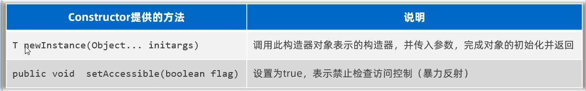

##### 获取成员变量

- 
- 使用成员变量
  - 

##### 获取成员方法

- 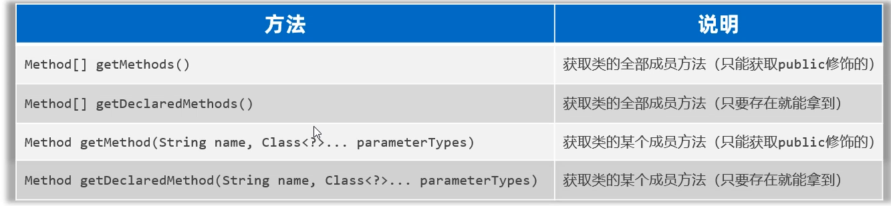

- 执行成员方法
  - 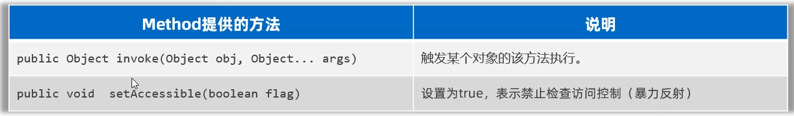

##### 类加载流程

- 反射机制是Java实现动态加载的关键

  - 静态加载：编译时加载相关的类，如果没有需要的类，就会报错
  - 动态加载：运行时加载相关的类，如果不需要用到该类，即使不存在类，也不报错

- 类加载

  - 

  - 加载阶段：将类的class文件以二进制字节流的形式加载到内存中，并生成类的Class对象，由类加载器完成。
  - 连接-验证：确保Class文件中包含的信息符合当前虚拟机的要求，并且不会危害虚拟机的安全
  - 连接-准备：对静态变量分配内存并默认初始化（非静态属性不会分配内存，静态属性分配对应数据类型的默认值，常量直接复制后就不会再改变）
  - 连接-解析：将常量池内的符号引用替换为直接引用
  - 初始化：Class对象中有一个clinit方法，执行此方法自动收集类中静态变量的赋值动作和静态代码块中的语句并执行。clinit方法是被虚拟机内的多个线程争抢执行的（提高效率），它被加锁与同步。

#### 网络编程

##### 概述

- 编写的应用程序可以与网络上其他设备中的应用程序进行数据交互。Java提供的网络编程的解决方案都是在java.net包下。

##### 三要素

- 

- 先通过ip地址找到对方的电脑
- 再通过端口号找到对方的电脑上的应用程序
- 按照双方约定好的规则发送、接收数据

##### IP地址

- **IP（Ineternet Protocol）全称互联网协议地址，是分配给网络设备的唯一表示。**IP地址分为：IPV4地址、IPV6地址。现在的网络设备，一般IPV4和IPV6地址都是支持的。
  - IPV4地址由32个比特位（4个字节）组成，如果下图所示，但是由于采用二进制太不容易阅读了，于是就将每8位看成一组，把每一组用十进制表示（叫做点分十进制表示法）。所以就有了我们经常看到的IP地址形式，如：192.168.1.66
  - 经过不断的发展，现在越来越多的设备需要联网，IPV4地址已经不够用了，所以扩展出来了IPV6地址。IPV6采用128位二进制数据来表示（16个字节），IPV6比较长，为了方便阅读，每16位编成一组，每组采用十六进制数据表示，然后用冒号隔开

- 域名
  - 我们在浏览器上访问某一个网站是，就需要在浏览器的地址栏输入网址，这个网址的专业说法叫做域名。域名和IP其实是一一对应的，由运营商来管理域名和IP的对应关系。我们在浏览器上敲一个域名时，首先由运营商的域名解析服务，把域名转换为ip地址，再通过IP地址去访问对应的服务器设备。

##### InetAddress类

- 用来表IP地址的类
- 

##### 端口号

- 计算机设备上运行的应用程序的标识，被规定为一个16位的二进制数据，范围（0~65535），同一个计算机设备中，不能出现两个应用程序，用同一个端口号。
  - 周知端口：0~1023，被预先定义的知名应用程序占用（如：HTTP占用80，FTP占用21）
  - 注册端口：1024~49151，分配给用户经常或者某些应用程序
  - 动态端口：49152~65536，之所以称为动态端口，是因为它一般不固定分配给某进程，而是动态分配的。

##### 协议

- **网络上通信的设备，事先规定的连接规则，以及传输数据的规则被称为网络通信协议。**
- 

#### 单元测试

- Junit是第三方提供的，所以我们需要把jar包导入到我们的项目中，才能使用

- 断言

  - 程序员可以预测程序的运行结果，检查程序的运行结果是否与预期一致

    - ```java
      public class StringUtilTest{
          @Test
          public void testGetMaxIndex(){
             int index1 = StringUtil.getMaxIndex(null);
             System.out.println(index1);
              
             int index2 = StringUtil.getMaxIndex("admin");
             System.out.println(index2);
              
              //断言机制：预测index2的结果
              Assert.assertEquals("方法内部有Bug",4,index2);
          }
      }
      ```

- Junit4注解

  - 

- Junit5注解
  - 

#### 正则表达式

##### 概述

- **正则表达式其实是由一些特殊的符号组成的，它代表的是某种规则。**
  - 作用1：用来校验字符串数据是否合法
  - 作用2：可以从一段文本中查找满足要求的内容
- 匹配一个字符串是否匹配正则表达式的规则要用到一个String类的方法matches(String regex)，参数需要调用者传递一个正则表达式。

##### 书写规则

- 

##### 信息爬取

- ```java
  public static void main(String[] args) {
          method1();
      }
      public static void method1(){
          String data = " 来黑马程序员学习Java，\n" +
                  "        电话：1866668888，18699997777\n" +
                  "        或者联系邮箱：boniu@itcast.cn，\n" +
                  "        座机电话：01036517895，010-98951256\n" +
                  "        邮箱：bozai@itcast.cn，\n" +
                  "        邮箱：dlei0009@163.com，\n" +
                  "        热线电话：400-618-9090 ，400-618-4000，4006184000，4006189090";
          // 1、定义爬取规则
          String regex = "(1[3-9]\\d{9})|(0\\d{2,7}-?[1-9]\\d{4,19})|(\\w{2,}@\\w{2,20}(\\.\\w{2,10}){1,2})"
                  + "|(400-?\\d{3,7}-?\\d{3,7})";
          // 2、把正则表达式封装成一个Pattern对象
          Pattern pattern = Pattern.compile(regex);
          // 3、通过pattern对象去获取查找内容的匹配器对象。
          Matcher matcher = pattern.matcher(data);
          // 4、定义一个循环开始爬取信息
          while (matcher.find()){
              String rs = matcher.group(); // 获取到了找到的内容了。
              System.out.println(rs);
          }
      }
  ```

##### 替换分割

- String类中的Api可以接收正则表达式对字符串进行替换和切割

#### 单例模式

- 定义：在整个软件运行过程中，某个类只能有一个实例

- 意义：对某个核心且关键的重量级类的使用，只允许使用一个，防止占用过多资源

##### 饿汉式（线程安全）

- 实现步骤：

1. 构造器私有化（防止用户直接new一个对象）
2. 在类的内部实例化private的static对象（类在加载时就已经实例化了一个对象，无论是否从外部获取，可能造成类的浪费）
3. 向外暴露一个public的static获得对象的方法
4. 在外部直接通过类名调用该静态方法接受对象

##### 懒汉式（线程不安全）

- 实现步骤：

1. 构造器私有化
2. 在类的内部声名一个private的static对象（防止类在加载时直接实例化，造成资源的浪费）
3. 向外部暴露一个public的static获得对象的方法，在此方法中实例化之前声明的对象（如果对象为空，则创建对象并返回，如果对象不为空，则直接返回对象）

#### JDK8

##### lambda表达式

- 本质上是一个实现类对象用于简化匿名内部类代码的书写，使用Lambda表达式之前，必须先有一个接口，而且接口中只能有一个抽象方法，这种接口叫函数式接口**（不能是抽象类，只能是接口）**

  - ```
    (被重写方法的形参列表) -> {
        被重写方法的方法体代码;
    }
    ```

  - ```java
    public static void main(String[] args) {
            double[] prices = {99.8, 128, 100};
            Arrays.setAll(prices, (int value) -> {
                    return prices[value] * 0.8;
            });
    		
            Student[] students = new Student[4];
            students[0] = new Student("蜘蛛精", 169.5, 23);
            students[1] = new Student("紫霞", 163.8, 26);
            students[2] = new Student("紫霞", 163.8, 26);
            students[3] = new Student("至尊宝", 167.5, 24);
            Arrays.sort(students, (Student o1, Student o2) -> {
                    return Double.compare(o1.getHeight(), o2.getHeight()); 
            });
        }
    ```

- 省略规则

  - ```java
    1.Lambda的标准格式
    	(参数类型1 参数名1, 参数类型2 参数名2)->{
    		...方法体的代码...
    		return 返回值;
    	}
    
    2.在标准格式的基础上()中的参数类型可以直接省略
    	(参数名1, 参数名2)->{
    		...方法体的代码...
    		return 返回值;
    	}
    	
    3.如果{}总的语句只有一条语句，则{}可以省略、return关键字、以及最后的“;”都可以省略
    	(参数名1, 参数名2)-> 结果
    	
    4.如果()里面只有一个参数，则()可以省略
    	(参数名)->结果
    ```

  - ```java
    public class LambdaTest2 {
        public static void main(String[] args) {
             //1.使用匿名内部类
            Arrays.sort(students, new Comparator<Student>() {
                @Override
                public int compare(Student o1, Student o2) {
                    return Double.compare(o1.getHeight(), o2.getHeight()); // 升序
                }
            });
    		//2.使用Lambda表达式表达式——标准格式
            Arrays.sort(students, (Student o1, Student o2) -> {
                    return Double.compare(o1.getHeight(), o2.getHeight()); // 升序
            });
    		//3.使用Lambda表达式表达式——省略参数类型
            Arrays.sort(students, ( o1,  o2) -> {
                return Double.compare(o1.getHeight(), o2.getHeight()); // 升序
            });
    		//4.使用Lambda表达式表达式——省略{}
            Arrays.sort(students, ( o1,  o2) -> Double.compare(o1.getHeight(), o2.getHeight()));
        }
    }
    ```

##### 方法引用

- Lambda是用来简化匿名代码的书写格式的，而方法引用是用来进一步简化Lambda表达式的，它简化的更加过分。本质上是指向方法对象（Funtion）的一个引用，当要Lambda方法体的操作已经有具体的实现方法时(要求形参列表和返回值类型完全相同)，可以直接引用该方法。

- 静态方法引用

  - ```java
    //静态方法引用：类名::方法名
    Arrays.stream.map(student -> String::parseString).collecter(Collect.List);
    ```

- 实例方法引用

  - ```java
    //实例方法引用：对象::方法名
    CompareByData compare = new CompareByData();
    Arrays.sort(students, compare::compareByAgeDesc); 
    ```

- 特定类型的方法引用

  - 如果某个Lambda表达式里只是调用一个实例方法，并且前面参数列表中的第一个参数作为方法的主调，后面的所有参数都是作为该实例方法的入参时，则就可以使用特定类型的方法引用。
    格式：类型::方法名

  - ```java
    public static void main(String[] args) {
            String[] names = {"boby", "angela", "Andy" ,"dlei", "caocao", "Babo", "jack", "Cici"};
            
            // 要求忽略首字符大小写进行排序。
            Arrays.sort(names, new Comparator<String>() {
                @Override
                public int compare(String o1, String o2) {
                    // 制定比较规则。o1 = "Andy"  o2 = "angela"
                    return o1.compareToIgnoreCase(o2);
                }
            });
    		
            //lambda表达式写法
            Arrays.sort(names, ( o1,  o2) -> o1.compareToIgnoreCase(o2) );
            //特定类型的方法引用！
            Arrays.sort(names, String::compareToIgnoreCase);
        }
    ```


- 构造器引用
  - 把构造器看成一个方法。(参数列表)->new 构造器所属类()；类名::new

##### Stream流

- 流程
  - 

- 创建

  - ```java
    list.stream()//List
    set.stream()//Set
    Map.keySet().stream()
    Map.values().stream()//Map
    Arrays.stream(arr)//数组
    ```

  - Stream不会存储数据，不会修改源对象，只会返回一个持有处理结果的Stream，Stream操作是延时执行的，一旦执行终止操作就执行中间操作链，流终止后无法再执行操作，需要重新创建。


- 处理
  - 这些方法调用完后返回类型还是Stream，所以支持链式编程
  - 

- 终结

  - 调用完方法之后，其结果就不再是Stream流了，所以不支持链式编程。

  - ```java
    public static void main(String[] args) {
            List<Student> students = new ArrayList<>();
            Student s1 = new Student("蜘蛛精", 26, 172.5);
            Student s2 = new Student("蜘蛛精", 26, 172.5);
            Student s3 = new Student("紫霞", 23, 167.6);
            Student s4 = new Student("白晶晶", 25, 169.0);
            Student s5 = new Student("牛魔王", 35, 183.3);
            Student s6 = new Student("牛夫人", 34, 168.5);
            Collections.addAll(students, s1, s2, s3, s4, s5, s6);
            // 需求1：请计算出身高超过168的学生有几人。
            long size = students.stream().filter(s -> s.getHeight() > 168).count();
            System.out.println(size);
    
            // 需求2：请找出身高最高的学生对象，并输出。
            Student s = students.stream().max((o1, o2) -> Double.compare(o1.getHeight(), o2.getHeight())).get();
            System.out.println(s);
    
            // 需求3：请找出身高最矮的学生对象，并输出。
            Student ss = students.stream().min((o1, o2) -> Double.compare(o1.getHeight(), o2.getHeight())).get();
            System.out.println(ss);
    
            // 需求4：请找出身高超过170的学生对象，并放到一个新集合中去返回。
            // 流只能收集一次。
            List<Student> students1 = students.stream().filter(a -> a.getHeight() > 170).collect(Collectors.toList());
            System.out.println(students1);
    
            Set<Student> students2 = students.stream().filter(a -> a.getHeight() > 170).collect(Collectors.toSet());
            System.out.println(students2);
    
            // 需求5：请找出身高超过170的学生对象，并把学生对象的名字和身高，存入到一个Map集合返回。
            Map<String, Double> map =
                    students.stream().filter(a -> a.getHeight() > 170)
                            .distinct().collect(Collectors.toMap(a -> a.getName(), a -> a.getHeight()));
    
            Student[] arr = students.stream().filter(a -> a.getHeight() > 170).toArray(len -> new Student[len]);
        }
    ```

##### Optional类

- 是一个可以为null的容器，可以装任何类型的对象，可以理解为所有类型的包装类，使用Optional可以不用显式地进行空值检测，避免空指针异常。创建Optional对象且可以为空Optional.ofNullable(T t);不为空则返回否则返回指定的对象T orElse(T other);不为空则返回否则返回Supplier提供的对象T orElseGet(Supplier<? extend T> other)

#### JDK17

##### Record类

- Record 是一种特殊类型的 Java 类，可用来创建不可变类，语法简短。创建只读的对象，能够读取每个属性，不能设置新的属性值，同时减少了样板代码（构造器，setter，getter，toString，equals...）

- 带有全部参数的构造方法

  - ```java
    //构造方法与类声明合并
    public record Student(Integer id,String name,String email,Integer age) {
    }
    ```

- 提供public 访问器，无 set，get 方法，没有遵循 Bean 的命名规范

  - ```java
    //访问属性的方法
    Student lisi = new Student(1001, "lisi","lisi@qq.com",20);
    lisi.id();
    lisi.name();
    lisi.email();
    lisi.age();
    ```

- 提供toString(),hashCode(),equals()方法，不用我们写了

- 不能被继承

- 可以跟普通类一样定义方法

- 可以与普通类一样实现接口，重写接口的方法

- 不同于Class，可以在代码块和方法中中定义并使用 Record

##### LomBok

- Lombok是一个可以大幅减少java模板代码的工具
- @Getter/@Setter：该注解会为标注的类、字段生成 get/set方法，并且生成的方法名为驼峰命名法
- @ToString：按顺序打印你的类名称以及每个字段，并以逗号分隔，默认情况会打印所有的非静态字段，也可通过配置来打印其他字段。
- @EqualsAndHashCode：为该类生成Equals和 HashCode方法。
- @NoArgsConstructor：为类生成无参的构造函数
- @RequiredArgsConstructo：为每个需要特殊处理的字段生成一个带有对应参数的构造函数。
- @Data：大融合！将@ToString, @EqualsAndHashCode, 所有字段的 Getter, 所有非 final 字段的 @Setter以及 @RequiredArgsConstructor。它通常用来生成简单的 POJO和 Bean

##### Sitch分支

- 箭头表达式

  - ```java
    public static void main(String[] args) {
    int week = 7;
    String memo = "";
    switch (week){
    case 1 -> memo = "星期日，休息";
    case 2,3,4,5,6-> memo="工作日";
    case 7 -> memo="星期六，休息";
    default -> throw new IllegalArgumentException("无效的日期：");
    }
    System.out.println("week = " + memo);
    }
    ```

- yeild返回值

  - ```java
    public static void main(String[] args) {
    int week = 2;
    //yield 是 switch 的返回值， yield 跳出当前 switch 块
    String memo = switch (week){
    case 1: yield "星期日，休息";
    case 2,3,4,5,6: yield "工作日";
    case 7: yield "星期六，休息";
    default: yield "无效日期";
    };
    System.out.println("week = " + memo);
    }
    ```

##### Text Block文本块

- 多行字符串，应该使用 Text Block
- 当 Text Block 可以提高代码的清晰度时，推荐使用。比如代码中嵌入 SQL 语句

##### var类型

- 与JavaScript的var类似

##### sealed密封类

- Sealed Classes 主要特点是限制继承，Java 中通过继承增强，扩展了类的能力，复用某些功能。当这种能力不受控。

  与原有类的设计或逻辑相违背，会导致不预见的异常逻辑。sealed 作为关键字可在 class 和 interface 上使用，结合 permits 关键字。定义限制继承的密封类

  - ```java
    public sealed class Shape permits Circle, Square, Rectangle {
        private Integer width;
        private Integer height;
        public void draw(){
        System.out.println("图形");
    }
    ```

- 子类声明只能是以下三种
  - final 不可被继承和修改
  - sealed 仍然是密封类
  - non-sealed 解除密封限制

# 企业开发基础

> 2023.9.14~2023.11.03

## MySQL

> 2023.9.14~2023.9.22

### DQL

- distinct加在select后面表示对查询结果进行去重
- 给字段起别名一种方式是用as，另一种方式直接用空格隔开就可以了
- 比较运算符使用between and表示之间的数据，like‘_’匹配一个字符%“匹配多个字符，is null，is not null判断空
- 逻辑运算符有and ，or，not
- where语句判断时可以通过()来组合字段
- 聚合函数是作用于一列数据进行纵向运算的，结果只会有一列，如果还查询了其他字段就会显示多列
- 分组查询group by是发生在where之后的，having是对**分组后的数据**进行过滤，where不能对聚合函数进行判断，而having可以，因为where执行在聚合函数之前。 分组之后，**查询的字段必须为聚合函数和分组字段，不能查询其他字段**。
- 排序查询oder by在不指定时默认就是升序排序，指定多个字段时根据指定的顺序确定排序的优先级
- 分页查询limit第一个参数是起始索引，第二个参数是查询记录数；起始索引从0开始，起始索引 = （查询页码 - 1）* 每页显示记录数。
- 执行顺序
  - 

### 连接查询

- 当我们查询两个表，不指定条件时，就会出现笛卡尔积现象，记录的条数等于两个表的记录数的乘积，出现许多无效记录
- 隐式内连接：本质上是使用where条件过滤笛卡尔积的数据，最终还是查出了许多无效数据，效率较低
- 显式内连接：inner join，结果与隐式内连接一样，但是是先连接后查询，可以理解为将两张表中的两条数据通过条件连接成一条数据
- 左右外连接：left join，right join，与内连接不同的是无论连接是否成功，主表的数据一定会全部出现，缺失字段为null
- 自连接：就是自己表中的数据跟自己表中的数据连接，也分内连接和外连接，**必须要为表起别名**，要不然不清楚返回的字段到底是哪一张表字段
- 联合查询：union就是把多次查询的结果合并起来，形成一个新的查询结果集；多张表的列数必须保持一致，字段类型也需要保持一致，不常用
- 子查询：INSERT / UPDATE / DELETE / SELECT 的任何一个中嵌套SELECT语句，常用于where后条件判断；all表示必须满足所有子查询的结果，any表示只需要满足其中一个即可

### JDBC

- JDBC即JAVA Database Connection
- JAVA提供了一套连接数据库的规范(Connection接口)，各数据库实现该接口，我们只需要使用不同数据库提供的与JAVA连接的类就可以将JAVA与数据库连接

```java
import java.sql.*;
import java.util.HashMap;
import java.util.Map;
import java.util.Scanner;

/**
 * 1、解决SQL注入问题？
 *      只要用户提供的信息不参与SQL语句的编译过程，问题就解决了。
 *      即使用户提供的信息中含有SQL语句的关键字，但是没有参与编译，不起作用。
 *      要想用户信息不参与SQL语句的编译，那么必须使用java.sql.PreparedStatement
 *      PreparedStatement接口继承了java.sql.Statement
 *      PreparedStatement是属于预编译的数据库操作对象。
 *      PreparedStatement的原理是：预先对SQL语句的框架进行编译，然后再给SQL语句传“值”。
 * 2、解决SQL注入的关键是什么？
 *      用户提供的信息中即使含有sql语句的关键字，但是这些关键字并没有参与编译。不起作用。
 * 3、对比一下Statement和PreparedStatement?
 *      - Statement存在sql注入问题，PreparedStatement解决了SQL注入问题。
 *      - Statement是编译一次执行一次。PreparedStatement是编译一次，可执行N次。PreparedStatement效率较高一些。
 *      - PreparedStatement会在编译阶段做类型的安全检查。
 *		综上所述：PreparedStatement使用较多。只有极少数的情况下需要使用Statement
 * 4、什么情况下必须使用Statement呢？
 *      业务方面要求必须支持SQL注入的时候。
 *      Statement支持SQL注入，凡是业务方面要求是需要进行sql语句拼接的，必须使用Statement。(用户操作升降序排序，因为
 *		setString会自动加上单引号，而sql语句中关键字不能加上引号)
 */
public class JDBCTest07 {
    public static void main(String[] args) {
        // 初始化一个界面
        Map<String,String> userLoginInfo = initUI();
        // 验证用户名和密码
        boolean loginSuccess = login(userLoginInfo);
        // 最后输出结果
        System.out.println(loginSuccess ? "登录成功" : "登录失败");
    }

    /**
     * 用户登录
     * @param userLoginInfo 用户登录信息
     * @return false表示失败，true表示成功
     */
    private static boolean login(Map<String, String> userLoginInfo) {
        // 打标记的意识
        boolean loginSuccess = false;
        
        // 单独定义变量
        String loginName = userLoginInfo.get("loginName");
        String loginPwd = userLoginInfo.get("loginPwd");

        //使用资源绑定器绑定属性配置文件
        ResourceBundle bundle = ResourceBundle.getBundle("info");
        String driver = bundle.getString("driver");
        //url:网络中某个资源的绝对路径：协议+IP+PROT+资源名
        String url = bundle.getString("url");
        String user = bundle.getString("user");
        String password = bundle.getString(("password"));
        
        // JDBC代码
        Connection conn = null;
        PreparedStatement ps = null; // 这里使用PreparedStatement（预编译的数据库操作对象）
        ResultSet rs = null;

        try {
            // 1、注册驱动
            Class.forName("com.mysql.jdbc.Driver");
            // 2、获取连接
            conn = DriverManager.getConnection(url, username, password);
            // 3、获取预编译的数据库操作对象
            // SQL语句的框子。其中一个?，表示一个占位符，一个?将来接收一个“值”，注意：占位符不能使用单引号括起来。
            String sql = "select * from t_user where loginName = ? and loginPwd = ?";
            // 程序执行到此处，会发送sql语句框子给DBMS，然后DBMS进行sql语句的预先编译。
            ps = conn.prepareStatement(sql);
            // 给占位符?传值（第1个问号下标是1，第2个问号下标是2，JDBC中所有下标从1开始。）
            ps.setString(1, loginName);
            ps.setString(2, loginPwd);
            // 4、执行sql
            rs = ps.executeQuery();
            // 5、处理结果集
            if(rs.next()){
                // 登录成功
                loginSuccess = true;
            }
        } catch (Exception e) {
            e.printStackTrace();
        } finally {
            // 6、释放资源
            if (rs != null) {
                try {
                    rs.close();
                } catch (SQLException e) {
                    e.printStackTrace();
                }
            }
            if (ps != null) {
                try {
                    ps.close();
                } catch (SQLException e) {
                    e.printStackTrace();
                }
            }
            if (conn != null) {
                try {
                    conn.close();
                } catch (SQLException e) {
                    e.printStackTrace();
                }
            }
        }
        return loginSuccess;
    }

    /**
     * 初始化用户界面
     * @return 用户输入的用户名和密码等登录信息
     */
    private static Map<String, String> initUI() {
        Scanner s = new Scanner(System.in);

        System.out.print("用户名：");
        String loginName = s.nextLine();

        System.out.print("密码：");
        String loginPwd = s.nextLine();

        Map<String,String> userLoginInfo = new HashMap<>();
        userLoginInfo.put("loginName", loginName);
        userLoginInfo.put("loginPwd", loginPwd);

        return userLoginInfo;
    }
}
```

```java
conn.setAutoCommit(flase);//关闭JDBC自动提交事务机制
coon.commit();//提交事务
coon.rollback();//事务回滚
```

## JavWeb

> 2023.9.22~2023.10.5

#### Web开发概述

- Tomcat：

  - tomcat是java语言写的，只实现了Servlet+JSP规范，要想运行，必须有Java的运行环境。

- Web开发分析


- 开发角色：
  - 浏览器软件的开发团队（浏览器软件：谷歌浏览器、火狐浏览器、IE浏览器....）
  - WEB Server的开发团队（WEB Server软件：Tomcat、Jetty、WebLogic、JBOSS、WebSphere....）
  - DB Server的开发团队（DB Server软件：Oracle、MySQL.....）
  - webapp的开发团队（WEB应用是JavaWEB程序员开发的）
  
- 遵守规范：

  

  - webapp的开发团队和WEB Server的开发团队之间规范: JavaEE规范之一Servlet规范。Servlet规范的作用:WEB Server   和   webapp解耦合。
  - Browser  和   WebServer之间传输协议：HTTP协议（超文本传输协议。）
  - webapp开发团队和DB Server的开发团队之间规范：JDBC规范。

#### Servlet

##### JavaEE版本

- JavaEE被Oracle捐献了，Oracle将JavaEE规范捐献给Apache了。
- Apache把JavaEE换名了，叫做 jakarta EE。
- JavaEE8的时候对应的Servlet类名是：javax.servlet.Servlet
- JakartaEE9的时候对应的Servlet类名是：jakarta.servlet.Servlet
- 如果你之前的项目还是在使用javax.servlet.Servlet，那么你的项目无法直接部署到Tomcat10+版本上。你只能部署到Tomcat9-版本上。在Tomcat9以及Tomcat9之前的版本中还是能够识别javax.servlet这个包。

##### 使用IDEA开发

- 第一步：New Project（先创建一个Empty Project【空工程】，然后在空工程下新建Module【模块】，这不是必须的，只是一种习惯，你可以直接新建非空的Project），这个Empty Project起名为：javaweb（不是必须的，只是一个名字而已。一般情况下新建的Project的名字最好和目录的名字一致。）

- 第二步：新建模块（File --> new --> Module...）
  - 这里新建的是一个普通的JavaSE模块（这里先不要新建Java Enterprise模块）
  - 这个Module自动会被放在javaweb的project下面。
  - 这个Module起名：servlet01
  
- 第三步：让Module变成JavaEE的模块。（让Module变成webapp的模块。符合webapp规范。符合Servlet规范的Module）
  - 在Module上点击右键：Add Framework Support...（添加框架支持）
  - 在弹出的窗口中，选择Web Application（选择的是webapp的支持）
  - 选择了这个webapp的支持之后，IDEA会自动给你生成一个符合Servlet规范的webpp目录结构。
  - **注意：在IDEA工具中根据Web Application模板生成的目录中有一个web目录，这个目录就代表webapp的根**
  
- 第四步（非必须）：根据Web Application生成的资源中有index.jsp文件，这里我选择删除这个index.jsp文件。

- 第五步：编写Servlet（StudentServlet）
  
  - File --> Project Structrue --> Modules --> + 加号 --> Add JARS....
  
  - 实现jakarta.servlet.Servlet接口中的5个方法。
  
- 第六步：在Servlet当中的service方法中编写业务代码

- 第七步：在WEB-INF目录下新建了一个子目录：lib，并且将连接数据库的驱动jar包放到lib目录下。

- 第八步：在web.xml文件中完成StudentServlet类的注册。

```java
<?xml version="1.0" encoding="UTF-8"?>
<web-app xmlns="http://xmlns.jcp.org/xml/ns/javaee"
         xmlns:xsi="http://www.w3.org/2001/XMLSchema-instance"
         xsi:schemaLocation="http://xmlns.jcp.org/xml/ns/javaee http://xmlns.jcp.org/xml/ns/javaee/web-app_4_0.xsd"
         version="4.0">

    <servlet>
        <servlet-name>studentServlet</servlet-name>
        <servlet-class>com.bjpowernode.javaweb.servlet.StudentServlet</servlet-class>
    </servlet>
    <servlet-mapping>
        <servlet-name>studentServlet</servlet-name>
        <url-pattern>/servlet/student</url-pattern>
    </servlet-mapping>
    
</web-app>
```

- 第九步：给一个html页面，在HTML页面中编写一个超链接，用户点击这个超链接，发送请求，Tomcat执行后台的StudentServlet。

  - ```html
    <!DOCTYPE html>
    <html lang="en">
    <head>
        <meta charset="UTF-8">
        <title>student page</title>
    </head>
    <body>
        <!--这里的项目名是 /xmm ，无法动态获取，先写死-->
        <a href="/xmm/servlet/student">student list</a>
    </body>
    </html>
    ```
  
- 第十步：让IDEA工具去关联Tomcat服务器。关联的过程当中将webapp部署到Tomcat服务器当中。

  - IDEA工具右上角：Add Configuration
  - 左上角加号，点击Tomcat Server --> local
  - 在弹出的界面中设置服务器Server的参数
  - 在当前窗口中有一个Deployment（点击这个用来部署webapp），继续点击加号，部署即可。
  - 修改 Application context为：/xmm

- 第十一步：启动Tomcat服务器

  - 采用debug的模式启动Tomcat服务器。
  - 我们开发中建议适用debug模式启动Tomcat

- 第十二步：打开浏览器，在浏览器地址栏上输入：http://localhost:8080/xmm/student.html

##### 欢迎页面

- 设置了欢迎页面后，访问这个webapp没有指定任何“资源路径”的时候，会默认访问你的欢迎页面。

- 设置欢迎页：

  - 第一步：在IDEA工具的web目录下新建了一个文件login.html

  - 第二步：在web.xml文件中进行了以下的配置

    - ```xml
      <welcome-file-list>
              <welcome-file>login.html</welcome-file>
          </welcome-file-list>
      ```

    - 注意：设置欢迎页面的时候，这个路径不需要以“/”开始。并且这个路径默认是从webapp的根下开始查找。一个webapp是可以设置多个欢迎页面的，越靠上的优先级越高。找不到的继续向下找。当文件名设置为index.html的时候，不需要在web.xml文件中进行配置欢迎页面。这是因为Tomcat服务器已经提前配置好了。（局部优先原则）欢迎页还可以是一个Servlet。

##### Servlet的生命周期

- WEB容器通过反射机制创建的Servlet对象会被放到一个集合当中（HashMap）在这个集合当中存储了Servlet对象和请求路径之间的关系。
- 

- 服务器在启动的Servlet对象有没有被创建出来？

  - 默认情况下，服务器在启动的时候Servlet对象并不会被实例化。
  - 这个设计是合理的。用户没有发送请求之前，如果提前创建出来所有的Servlet对象，必然是耗费内存的，并且创建出来的Servlet如果一直没有用户访问，显然这个Servlet对象是一个废物，没必要先创建。

- 怎么让服务器启动的时候创建Servlet对象呢？

  - 在servlet标签中添加<load-on-startup>子标签，在该子标签中填写整数，越小的整数优先级越高。

  - ```xml
    <servlet>
        <servlet-name>aservlet</servlet-name>
        <servlet-class>com.bjpowernode.javaweb.servlet.AServlet</servlet-class>
        <load-on-startup>1</load-on-startup>
    </servlet>
    <servlet-mapping>
        <servlet-name>aservlet</servlet-name>
        <url-pattern>/a</url-pattern>
    </servlet-mapping>
    ```

- Servlet对象生命周期

  1. 用户在发送第一次请求的时候Servlet对象被实例化

  2. 对象被创建出来之后，Tomcat服务器调用对象的init方法。

  3. Tomcat服务器调用AServlet对象的service方法。

  3. 用户在发送第二次，或者第三次，或者第四次请求的时候，Servlet对象并没有新建，还是使用之前创建好的Servlet对象，直接调用该Servlet对象的service方法，这说明：

  - Servlet对象是单例的（单实例的。但是要注意：Servlet对象是单实例的，但是Servlet类并不符合单例模式。我们称之为假单例。之所以单例是因为Servlet对象的创建我们javaweb程序员管不着，这个对象的创建只能是Tomcat来说了算，Tomcat只创建了一个，所以导致了单例，但是属于假单例。真单例模式，构造方法是私有化的。）

  - 无参数构造方法、init方法只在第一次用户发送请求的时候执行。也就是说无参数构造方法只执行一次。init方法也只被Tomcat服务器调用一次。
  - 只要用户发送一次请求：service方法必然会被Tomcat服务器调用一次。

  4. destroy方法是在服务器关闭的时候调用，服务器在销毁Servlet对象内存之前，会自动调用destroy方法。destroy方法调用的时候，对象还没有销毁。

  - Servlet对象像一个人的一生：
    - Servlet的无参数构造方法执行：标志着你出生了。
    - Servlet对象的init方法的执行：标志着你正在接受教育。
    - Servlet对象的service方法的执行：标志着你已经开始工作了，已经开始为人类提供服务了。
    - Servlet对象的destroy方法的执行：标志着临终。有什么遗言，抓紧的。要不然，来不及了。
  - Servlet的无参数构造方法是在对象第一次创建的时候执行，并且只执行一次。init方法也是在对象第一次创建的时候执行，并且只执行一次。那么这个无参数构造方法可以代替掉init方法吗？

    - 不能。Servlet规范中有要求，作为javaweb程序员，编写Servlet类的时候，不建议手动编写构造方法，因为编写构造方法，很容易让无参数构造方法消失，这个操作可能会导致Servlet对象无法实例化。所以init方法是有存在的必要的。


##### GenericServlet

- 我们编写一个Servlet类直接实现Servlet接口有什么缺点？

  - 我们只需要service方法，其他方法大部分情况下是不需要使用的。代码很丑陋。

- 适配器设计模式Adapter

  - GenericServlet类实现Servlet接口，并将service方法设置成唯一抽象方法。

- 重写init方法

  - 为了即使没有getConfig方法也不丢失ServletConfig对象，需要定义一个ServletConfig成员，并且在init方法中传给Servlet对象。那如果要重写init方法就会将该方法覆盖，解决方法为将无参的init方法放入Tomcat默认调用的init有参方法内

  - Tomcat服务器伪代码：

    - ```java
      public class Tomcat {
          public static void main(String[] args){
              // .....
              // Tomcat服务器伪代码
              // 创建LoginServlet对象（通过反射机制，调用无参数构造方法来实例化LoginServlet对象）
              Class clazz = Class.forName("com.bjpowernode.javaweb.servlet.LoginServlet");
              Object obj = clazz.newInstance();
              
              // 向下转型
              Servlet servlet = (Servlet)obj;
              
              // 创建ServletConfig对象
              // Tomcat服务器负责将ServletConfig对象实例化出来。
              // 多态（Tomcat服务器完全实现了Servlet规范）
              ServletConfig servletConfig = new org.apache.catalina.core.StandardWrapperFacade();
              
              // 调用Servlet的init方法
              servlet.init(servletConfig);
              
              // 调用Servlet的service方法
              // ....
              
          }
      }
      ```

##### ServletConfig

- ServletConfig对象中封装了\<servlet>\</servlet>标签中的配置信息。（web.xml文件中servlet的配置信息）

- 一个Servlet对应一个ServletConfig对象。

- Servlet对象是Tomcat服务器创建，并且ServletConfig对象也是Tomcat服务器创建。并且默认情况下，他们都是在用户发送第一次请求的时候创建。

- ServletConfig接口有哪些常用的方法？

  - ```java
    public String getInitParameter(String name); // 通过初始化参数的name获取value
    public Enumeration<String> getInitParameterNames(); // 获取所有的初始化参数的name
    public ServletContext getServletContext(); // 获取ServletContext对象
    public String getServletName(); // 获取Servlet的name
    ```

##### ServletContext

- 只要在同一个webapp当中，所有的Servlet对象都是共享同一个ServletContext对象的。

- ServletContext对象在服务器启动阶段创建，在服务器关闭的时候销毁。ServletContext对象是应用级对象。

- Tomcat容器可以存放多个webapp，1个webapp对应1个ServletContext对象。

- ServletContext接口中有哪些常用的方法？

  - ```java
    public String getInitParameter(String name); // 通过初始化参数的name获取value
    public Enumeration<String> getInitParameterNames(); // 获取所有的初始化参数的name
    ```

  - ```xml
    <!--以上两个方法是ServletContext对象的方法，这个方法获取的是什么信息？是以下的配置信息-->
    <context-param>
        <param-name>pageSize</param-name>
        <param-value>10</param-value>
    </context-param>
    <context-param>
        <param-name>startIndex</param-name>
        <param-value>0</param-value>
    </context-param>
    <!--注意：以上的配置信息属于应用级的配置信息，一般一个项目中共享的配置信息会放到以上的标签当中。-->
    <!--如果你的配置信息只是想给某一个servlet作为参考，配置到servlet标签当中即可，使用ServletConfig对象来获取。-->
    ```

  - ```java
    // 获取应用的根路径（非常重要），因为在java源代码当中有一些地方可能会需要应用的根路径，这个方法可以动态获取应用的根路径
    String contextPath = application.getContextPath();
    ```
    
  - ```java
    // ServletContext对象：应用域
    public void setAttribute(String name, Object value); // map.put(k, v)
    public Object getAttribute(String name); // Object v = map.get(k)
    public void removeAttribute(String name); // map.remove(k)
    ```

- 大家到目前为止都接触过哪些缓存机制了？

  - 堆内存当中的字符串常量池。
    - "abc" 先在字符串常量池中查找，如果有，直接拿来用。如果没有则新建，然后再放入字符串常量池。
  - 堆内存当中的整数型常量池。
    - [-128 ~ 127] 一共256个Integer类型的引用，放在整数型常量池中。没有超出这个范围的话，直接从常量池中取。
  - 连接池(Connection Cache)
    - 这里所说的连接池中的连接是java语言连接数据库的连接对象：java.sql.Connection对象。
    - JVM是一个进程。MySQL数据库是一个进程。进程和进程之间建立连接，打开通道是很费劲的。是很耗费资源的。怎么办？可以提前先创建好N个Connection连接对象，将连接对象放到一个集合当中，我们把这个放有Connection对象的集合称为连接池。每一次用户连接的时候不需要再新建连接对象，省去了新建的环节，直接从连接池中获取连接对象，大大提升访问效率。
    - 连接池
      - 最小连接数
      - 最大连接数
      - 连接池可以提高用户的访问效率。当然也可以保证数据库的安全性。
  - 线程池
    - Tomcat服务器本身就是支持多线程的。
    - Tomcat服务器是在用户发送一次请求，就新建一个Thread线程对象吗？
      - 当然不是，实际上是在Tomcat服务器启动的时候，会先创建好N多个线程Thread对象，然后将线程对象放到集合当中，称为线程池。用户发送请求过来之后，需要有一个对应的线程来处理这个请求，这个时候线程对象就会直接从线程池中拿，效率比较高。
      - 所有的WEB服务器，或者应用服务器，都是支持多线程的，都有线程池机制。
  - redis
    - NoSQL数据库。非关系型数据库。缓存数据库。
  - 向ServletContext应用域中存储数据，也等于是将数据存放到缓存cache当中了。

##### HTTP协议

- HTTP协议：

  - W3C制定的一种超文本传输协议,不但可以传送普通字符串，同样支持传递声音、视频、图片等流媒体信息。

- GET请求

  - ```
    GET /servlet05/getServlet?username=lucy&userpwd=1111 HTTP/1.1                           请求行
    Host: localhost:8080                                                                    请求头
    Connection: keep-alive
    sec-ch-ua: "Google Chrome";v="95", "Chromium";v="95", ";Not A Brand";v="99"
    sec-ch-ua-mobile: ?0
    sec-ch-ua-platform: "Windows"
    Upgrade-Insecure-Requests: 1
    User-Agent: Mozilla/5.0 (Windows NT 10.0; Win64; x64) AppleWebKit/537.36 (KHTML, like Gecko) Chrome/95.0.4638.54 Safari/537.36
    Accept: text/html,application/xhtml+xml,application/xml;q=0.9,image/avif,image/webp,image/apng,*/*;q=0.8,application/signed-exchange;v=b3;q=0.9
    Sec-Fetch-Site: same-origin
    Sec-Fetch-Mode: navigate
    Sec-Fetch-User: ?1
    Sec-Fetch-Dest: document
    Referer: http://localhost:8080/servlet05/index.html
    Accept-Encoding: gzip, deflate, br
    Accept-Language: zh-CN,zh;q=0.9
                                                                                            空白行
                                                                                            请求体
    ```

- POST请求

  - ```
    POST /servlet05/postServlet HTTP/1.1                                                  请求行
    Host: localhost:8080                                                                  请求头
    Connection: keep-alive
    Content-Length: 25
    Cache-Control: max-age=0
    sec-ch-ua: "Google Chrome";v="95", "Chromium";v="95", ";Not A Brand";v="99"
    sec-ch-ua-mobile: ?0
    sec-ch-ua-platform: "Windows"
    Upgrade-Insecure-Requests: 1
    Origin: http://localhost:8080
    Content-Type: application/x-www-form-urlencoded
    User-Agent: Mozilla/5.0 (Windows NT 10.0; Win64; x64) AppleWebKit/537.36 (KHTML, like Gecko) Chrome/95.0.4638.54 Safari/537.36
    Accept: text/html,application/xhtml+xml,application/xml;q=0.9,image/avif,image/webp,image/apng,*/*;q=0.8,application/signed-exchange;v=b3;q=0.9
    Sec-Fetch-Site: same-origin
    Sec-Fetch-Mode: navigate
    Sec-Fetch-User: ?1
    Sec-Fetch-Dest: document
    Referer: http://localhost:8080/servlet05/index.html
    Accept-Encoding: gzip, deflate, br
    Accept-Language: zh-CN,zh;q=0.9
                                                                                          空白行
    username=lisi&userpwd=123                                                             请求体
    ```

- HTTP响应：

  - ```html
    HTTP/1.1 200 ok                                     状态行
    Content-Type: text/html;charset=UTF-8               响应头
    Content-Length: 160
    Date: Mon, 08 Nov 2021 13:19:32 GMT
    Keep-Alive: timeout=20
    Connection: keep-alive
                                                        空白行
    <!doctype html>                                     响应体
    <html>
        <head>
            <title>from get servlet</title>
        </head>
        <body>
            <h1>from get servlet</h1>
        </body>
    </html>
    ```

- GET请求和POST请求区别：

  - get请求发送数据的时候，数据会挂在URI的后面，并且在URI后面添加一个“?”，"?"后面是数据。这样会导致发送的数据回显在浏览器的地址栏上。（get请求在“请求行”上发送数据）post请求发送数据的时候，在请求体当中发送。不会回显到浏览器的地址栏上。也就是说post发送的数据，在浏览器地址栏上看不到。（post在“请求体”当中发送数据）
  - get请求只能发送普通的字符串。并且发送的字符串长度有限制，不同的浏览器限制不同。这个没有明确的规范。post请求可以发送任何类型的数据，包括普通字符串，流媒体等信息：视频、声音、图片。post请求可以发送大数据量，理论上没有长度限制。
  - get请求是安全的，因为get请求只是请求从服务器上获取数据。不会对服务器造成威胁。post请求是危险的。因为post请求是向服务器提交数据，如果这些数据通过后门的方式进入到服务器当中，服务器是很危险的。
  - get请求支持缓存。任何一个get请求最终的“响应结果”都会被浏览器缓存起来。在浏览器缓存当中维护了一个Map，路径与资源对应。只要发送get请求，浏览器做的第一件事都是先从本地浏览器缓存中找，找不到的时候才会去服务器上获取。这种缓存机制目的是为了提高用户的体验。
  - get请求比较适合请求从服务器端获取数据。post请求比较适合向服务器端传送数据。

##### HttpServlet

- 继承结构：

  - ```java
    jakarta.servlet.Servlet（接口）【爷爷】
    jakarta.servlet.GenericServlet implements Servlet（抽象类）【儿子】
    jakarta.servlet.http.HttpServlet extends GenericServlet（抽象类）【孙子】

- HttpServlet源码分析：
  - 模板方法设计模式
    - 模板类通常是一个抽象类，模板类当中的模板方法定义核心方法法，这个方法通常是final的不可以被子类重写
    - 模板类当中的抽象方法就是因为子类的差异而不确定实现的方法，这个不确定怎么实现的方法定义为交给子类实现


```java
public class HelloServlet extends HttpServlet {
	// 用户第一次请求，创建HelloServlet对象的时候，会执行这个无参数构造方法。
	public HelloServlet() {
    }
    
    //override 重写 doGet方法
    //override 重写 doPost方法
}

public abstract class GenericServlet implements Servlet, ServletConfig,
        java.io.Serializable {
           
	// 用户第一次请求的时候，HelloServlet对象第一次被创建之后，这个init方法会执行。
    public void init(ServletConfig config) throws ServletException {
        this.config = config;
        this.init();
    }
	// 用户第一次请求的时候，带有参数的init(ServletConfig config)执行之后，会执行这个没有参数的init()
	public void init() throws ServletException {
        // NOOP by default
    }
}

// HttpServlet模板类。
public abstract class HttpServlet extends GenericServlet {
    // 用户只要发送一次请求，这个service方法就会执行一次。
    @Override
    public void service(ServletRequest req, ServletResponse res)
        throws ServletException, IOException {

        HttpServletRequest  request;
        HttpServletResponse response;

        try {
            // 将ServletRequest和ServletResponse向下转型为带有Http的HttpServletRequest和HttpServletResponse
            request = (HttpServletRequest) req;
            response = (HttpServletResponse) res;
        } catch (ClassCastException e) {
            throw new ServletException(lStrings.getString("http.non_http"));
        }
        // 调用重载的service方法。
        service(request, response);
    }
    
    // 这个是重载的service方法，不是Tomcat执行的方法，该方法是模板设计模式中的核心方法
    protected void service(HttpServletRequest req, HttpServletResponse resp)
        throws ServletException, IOException {
        // request.getMethod()获取请求方式
        String method = req.getMethod();

        // 如果请求方式是GET请求，则执行doGet方法。
        if (method.equals(METHOD_GET)) {
            long lastModified = getLastModified(req);
            if (lastModified == -1) {
                doGet(req, resp);
            } else {
                long ifModifiedSince;
                try {
                    ifModifiedSince = req.getDateHeader(HEADER_IFMODSINCE);
                } catch (IllegalArgumentException iae) {
                    ifModifiedSince = -1;
                }
                if (ifModifiedSince < (lastModified / 1000 * 1000)) {
                    maybeSetLastModified(resp, lastModified);
                    doGet(req, resp);
                } else {
                    resp.setStatus(HttpServletResponse.SC_NOT_MODIFIED);
                }
            }

        } else if (method.equals(METHOD_HEAD)) {
            long lastModified = getLastModified(req);
            maybeSetLastModified(resp, lastModified);
            doHead(req, resp);

        } else if (method.equals(METHOD_POST)) {
            // 如果请求方式是POST请求，则执行doPost方法。
            doPost(req, resp);

        } else if (method.equals(METHOD_PUT)) {
            doPut(req, resp);

        } else if (method.equals(METHOD_DELETE)) {
            doDelete(req, resp);

        } else if (method.equals(METHOD_OPTIONS)) {
            doOptions(req,resp);

        } else if (method.equals(METHOD_TRACE)) {
            doTrace(req,resp);

        } else {
            String errMsg = lStrings.getString("http.method_not_implemented");
            Object[] errArgs = new Object[1];
            errArgs[0] = method;
            errMsg = MessageFormat.format(errMsg, errArgs);

            resp.sendError(HttpServletResponse.SC_NOT_IMPLEMENTED, errMsg);
        }
    }   
    //doGet和doPost为模板设计模式中的因子类不同而实现不同的方法，交给子类实现
    protected void doGet(HttpServletRequest req, HttpServletResponse resp)
        throws ServletException, IOException{
        // 如果前端发送Get请求而子类没有实现doGet方法，则会自动调用父类的doGet方法，报405错误
        String msg = lStrings.getString("http.method_get_not_supported");
        sendMethodNotAllowed(req, resp, msg);
    }
    
    protected void doPost(HttpServletRequest req, HttpServletResponse resp)
        throws ServletException, IOException {
        // 如果前端发送Get请求而子类没有实现doGet方法，则会自动调用父类的doGet方法，报405错误
        String msg = lStrings.getString("http.method_post_not_supported");
        sendMethodNotAllowed(req, resp, msg);
    }
    
}

/*
有的人为了避免405错误，在Servlet类当中，将doGet和doPost方法都进行了重写。这样确实可以避免405的发生，但是不建议，405错误还是有用的。该报错的时候就应该让他报错。如果同时重写了doGet和doPost，那还不如直接重写service方法。这样代码还能少写一点。
*/
```


##### HttpServletRequest

- 用户发送请求的时候，发送的是HTTP的请求协议，Tomcat服务器将HTTP协议中的信息以及数据全部解析出来，然后Tomcat服务器把这些信息封装到HttpServletRequest对象当中（过程复杂），传给javaweb程序员。

- request对象和response对象，在请求和响应时创建，这两个对象只在当前请求和响应中有效。

- 数据结构：

  - ```
    Map<String, String[]>
        key存储String
        value存储String[]
        key				value
        -------------------------------
        username		{"abc"}
        userpwd			{"111"}
        aihao			{"s","d","tt"}
    ```

  - ```java
    Map<String,String[]> getParameterMap() 获取Map
    Enumeration<String> getParameterNames() 获取Map集合中所有的key
    String[] getParameterValues(String name) 根据key获取Map集合的value
    String getParameter(String name)  获取value这个一维数组当中的第一个元素。这个方法最常用。
    ```

- HttpServletRequest接口的其他常用方法：

  - ```java
    // 获取客户端的IP地址
    String remoteAddr = request.getRemoteAddr();
    // 设置请求体的字符集。（显然这个方法是处理POST请求的乱码问题。这种方式并不能解决get请求的乱码问题。）
    request.setCharacterEncoding("UTF-8");
    // 在Tomcat9之前响应中文也是有乱码的，解决这个响应的乱码问题
    response.setContentType("text/html;charset=UTF-8");
    // 获取应用的根路径
    String contextPath = request.getContextPath();
    // 获取请求方式GET/POST
    String method = request.getMethod();
    // 获取请求的URI（不包括IP和端口号）
    String uri = request.getRequestURI();
    // 获取servlet path（/+Servlet名）
    String servletPath = request.getServletPath();

- request对象中两个容易混淆的方法：

  - ```java
    String username = request.getParameter("username");
    Object obj = request.getAttribute("name");
    // 第一个方法：获取的是用户在浏览器上提交的数据。
    // 第二个方法：获取的是请求域当中绑定的数据。
    ```

##### 域对象

- 应用域对象：ServletContext（项目级别）

  - 所有用户共享的数据。
  - 这个共享的数据量很小，很少修改。
  - 实际上向应用域当中绑定数据，就相当于把数据放到了缓存（Cache）当中，然后用户访问的时候直接从缓存中取，减少IO的操作，大大提升系统的性能，所以缓存技术是提高系统性能的重要手段。
- 会话域对象：HttpSession（用户级别）
  - 用户打开浏览器，访问应用，然后最终将浏览器关闭，这个整个过程就是一次会话。
- 请求域对象：ServletRequest（请求级别）

  - 只在一次请求内有效
- 三个域对象都有以下三个公共的方法：
  - setAttribute（向域当中绑定数据）
  - getAttribute（从域当中获取数据）
  - removeAttribute（删除域当中的数据）
  - 使用原则：尽量使用小的域。

##### 转发

- ```java
  // 第一步和第二步代码可以联合在一起。
  request.getRequestDispatcher("/HelloServlet").forward(request,response);
  ```
  
- 转发原理：将一个Servlet中的请求对象发送给另外一个Servlet，达到用另一个Servlet对象的doGet或doPost方法获得相同的请求对象信息并作出响应的目的，本质上还是用一个请求。

- 转发的下一个资源不必须是一个Servlet，只要是Tomcat服务器当中的合法资源，都是可以转发的。转发的路径以“/”开始，不加项目名。

##### 重定向

- 转发和重定向区别：     

  - 转发：转发本质上是同一个请求，在浏览器地址栏上显示的是第一次请求的地址。是由WEB服务器来控制的，A资源跳转到B资源，这个跳转动作是Tomcat服务器内部完成的。
    
  - 重定向：
  
    - ```java
      response.sendRedirect("/oa/dept/list");
      ```
  
    - 重定向本质上是两个请求，接收第一次请求后，发出让浏览器发送第二次请求的响应，浏览器需要知道完整的URI而不是Servlet名，这是浏览器完成的，并且第二次请求必定为Get请求
  
- 转发和重定向的选择：

  - 如果在上一个Servlet当中向request域当中绑定了数据，希望从下一个Servlet当中把request域里面的数据取出来，使用转发机制。（必须保证是同一个请求，域中的数据才不会丢失）
  - 剩下所有的请求均使用重定向。

##### 注解式开发

- Servlet注解：

  - ```java
    import jakarta.servlet.annotation.WebServlet
    //name属性：用来指定Servlet的名字，等同于<servlet-name>(不写时默认为类名)
    //urlPatterns属性：用来指定Servlet的映射路径，可以指定多个字符串，等同于<url-pattern>
    //loadOnStartUp属性：用来指定在服务器启动阶段是否加载该Servlet，等同于<load-on-startup>
    //@WebInitParam属性：用来指定初始化信息，等同于<servlet-param>
    //value属性：等同于urlPatterns，使用注解的时候，value属性名是可以省略的。
    @WebServlet(name="",urlPatterns={"","",""},loadOnStartUp= ,initParams={@WebInitParam(name="",value=""),@WebInitParam(name="",value="")})
    ```

##### Session

- 会话：用户打开浏览器，访问应用，然后最终将浏览器关闭，这个整个过程就是一次会话。会话在服务器端会有一个对应的java对象，这个java对象叫session。一个会话当中包含多次请求。

- session的作用：保存会话状态。HTTP协议是一种无状态协议。客户端发出请求的瞬间，客户端和服务器是连接的，但是请求结束之后，连接就断开了。HTTP协这样的无状态协议，可以降低服务器的压力。

- session会话域的价值：
  - request请求域在请求完成之后就消亡了，无法保存状态
  - ServletContext应用域对象保存了所有用户的信息，不适合作为私有的域
  
- session对象的申请与销毁：
  
  - ```java
    HttpSession session = request.getSession();
    session.invalidate();
    ```
  
- session的实现原理：
  - 
  - JSESSIONID=xxxxxx  每一个session关联一个Cookie，保存在浏览器的内存中的，浏览器关闭就会释放。
  - 保存在服务器中的session列表是一个Map，map的key是sessionid，map的value是session对象。
  - 用户第一次请求，服务器生成session对象，同时生成id，将id发送给浏览器。
  - 用户第二次请求，自动将浏览器内存中的id发送给服务器，服务器根据id查找session对象。
  - 关闭浏览器，内存消失，cookie消失，sessionid消失，会话等同于结束。

- Session解决登录问题：

  - 登录成功之后，可以将用户的登录信息存储到session域当中。session中如果有用户的信息就代表用户登录成功了，。session中没有用户信息，表示用户没有登录过，则跳转到登录页面。

##### Cookie

- Cookie：
  - JSESSIONID=41C481F0224664BDB28E95081D23D5B8，这个键值对数据其实就是cookie对象。用户再次发送请求的时候，都会自动将运行内存或硬盘中的cookie发送给服务器。
  - 对于session底层的cookie，这个cookie是被保存在浏览器的运行内存当中，将会话的状态保存在服务器端上（session对象是存储在服务器上的）
  - 还有的cookie被保存在硬盘上，同样为了保存会话的状态，只不过更为长久，将会话的状态保存在浏览器客户端上（cookie数据存储是在浏览器上的。）
  - cookie是由name和value组成的，name和value都是字符串类型的。
  - HTTP协议规定当浏览器发送请求时，会自动携带该path下的cookie数据给服务器，不会导致不同应用间的cookie错乱。
  
- cookie语法：

  - ```java
    //cookie的设置与发送
    Cookie cookie = new Cookie(String name,String value);//创建cookies
    cookie.setMaxAge(int second);//设置cookie的有效时间（没有设置有效时间则默认保存在浏览器的运行内存中，浏览器关闭则cookie消失）
    cookie.setPath(String path); //表示只要是这个请求路径及其子路径，都会提交这个cookie给服务器。
    response.addCookie(Cookie cookie);//客户端发送cookie
    
    //cookie的接收
    Cookie[] cookies = request.getCookies(); // 当数组为空时返回null
    cookie.getName();
    cookie.getValue();
    ```

- 使用cookie实现十天内免登录功能：

  - 如果用户登录成功了，并且用户登录时选择了十天内免登录功能，这个时候应该创建cookie，用来存储用户名和密码，并且设置路径，设置有效期，将cookie响应给浏览器。（浏览器将其自动保存在硬盘文件当中10天）

  - 用户在十天内再次访问该网站的时候直接跳过登录页面

#### JSP

##### JSP本质

- JSP(JavaServer Pages)实际上就是一个Servlet。
  - index.jsp访问的时候，Tomcat会自动生成index_jsp.java，自动编译生成index_jsp.class
  - index_jsp 类继承 HttpJspBase，而HttpJspBase类继承的是HttpServlet。所以index_jsp类就是一个Servlet类。
  - jsp的生命周期和Servlet的生命周期完全相同。
- JSP和Servlet职责不同:

  - Servlet：收集数据。（Servlet的强项是逻辑处理，业务处理，然后链接数据库，获取/收集数据。）
  - JSP的：展示数据。（JSP的强项是做数据的展示）
  - 它们都可以独立完成项目的开发（Servlet中内嵌前端代码，JSP中内嵌JAVA程序），但是我们要发挥它们各自的长项。
- jsp文件第一次访问的时候是比较慢的

  - 要把jsp文件翻译生成java源文件
  - java源文件要编译生成class字节码文件
  - 然后通过class去创建servlet对象
  - 然后调用servlet对象的init方法
  - 最后调用servlet对象的service方法。

  - 第二次直接调用单例servlet对象的service方法即可。
- 对JSP进行错误调试的时候，直接打开JSP文件对应的java文件，检查java代码，不要对着jsp文件检查。
- JSP和Servlet职责不同:

  - Servlet：收集数据。（Servlet的强项是逻辑处理，业务处理，然后链接数据库，获取/收集数据。）
  - JSP：展示数据。（JSP的强项是做数据的展示）
  - 它们都可以独立完成项目的开发（Servlet中内嵌前端代码，JSP中内嵌JAVA程序），但是我们要发挥它们各自的长项。

##### JSP基础语法

- JSP中直接编写普通字符串
  - 翻译到service方法的out.write("");被java程序当做普通字符串打印输出到浏览器,由浏览器进行渲染。
- <%%>
  - 翻译到service方法体内部，里面是一条一条的java语句。方法体当中的代码要遵循自上而下的顺序依次逐行执行，不能写静态代码块，不能写方法，不能定义成员变量。
- <%! %>
  - 翻译到service方法之外。不建议使用，因为在service方法外面写静态变量和实例变量，都会存在线程安全问题，因为JSP是单例的，多线程并发的环境下，这个静态变量和实例变量一旦有修改操作，必然会存在线程安全问题。
- <%= %>
  - 翻译到service方法体内部，翻译为：out.print()；输出的内容中含有java的变量时使用，如果输出的是一个固定的字符串，直接在JSP文件中编写即可。
- <%-- --%>
  - 注释，不会被翻译到java文件中。

##### JSP指令

- 指令的作用：指导JSP翻译引擎如何翻译JSP文件。

- 指令分类：

  - include指令：包含指令，在JSP中完成静态包含，很少用。
  - taglib指令：引入标签库的指令。
  - page指令

- 指令的使用语法：

  - <%@指令名  属性名=属性值  属性名=属性值  属性名=属性值....%>（一条语句可完成所有配置）

- page指令：

  - ```java
    //启用JSP的内置对象session，如果执行该Servlet时没有session对象会创建。默认值是true，如果是flase，当前JSP页面中无法使用内置对象session。
    <%@page session="true" %>
    //设置该Servlet响应的内容类型与字符集
    <%@page contentType="text/json;charset=UTF-8" %>
    //导包
    <%@page import="java.util.List, java.util.Date, java.util.ArrayList" %>
    //当前页面出现异常之后，跳转到该页面
    <%@page errorPage="/error.jsp" %>
    //启用JSP九大内置对象之一：exception
    <%@page isErrorPage="true" %>
    ```

##### JSP九大内置对象

- 内置对象已经被Tomcat创建并配置好在即将将我们提供的jsp文件翻译成的java文件当中，我们只需要在jsp文件中的java代码部分使用即可。

- jakarta.servlet.jsp.PageContext pageContext       页面作用域
- jakarta.servlet.http.HttpServletRequest request 请求作用域
- jakarta.servlet.http.HttpSession session  会话作用域
- jakarta.servlet.ServletContext application 应用作用域
  - pageContext < request < session < application
- java.lang.Throwable exception   异常
- jakarta.servlet.ServletConfig config 配置信息
- java.lang.Object page  this，当前的servlet对象
- jakarta.servlet.jsp.JspWriter out  输出
- jakarta.servlet.http.HttpServletResponse response 响应

##### EL表达式

- EL表达式：

  - EL表达式可以代替JSP中的java代码，让JSP文件中的程序看起来更加整洁，美观。EL表达式是JSP语法的一部分，归属于JSP，也就是说，EL表达式最终会被翻译成Service方法中输出性质的JAVA代码

  - EL表达式最主要作用从某个作用域中取数据，然后将其转换成字符串（如果是对象则调用toString方法），然后将其输出到浏览器。

  - 语法格式：${表达式}

- EL表达式语法：

  - ```java
    //取对象,自动调用value中对象的toString方法（不加双引号）相当于<%=request.getAttribute(name)%>
    ${name}
    
    //取属性，底层原理是调用对象的get方法，因此可以访问私有属性（get方法必须严格按照IDEA提供的方法名才会被识别调用）
    ${name.attribute}
    
    //取成员内部类的属性
    ${name.attribute1.attribute2}
    
    //取数组和list集合中数据
    ${name[index]}
    
    //取Map中数据
    ${name.key}
    
    //pageContext内置对象取应用的根（EL表达式中与JSP中内置对象pageContext相同，该对象可以作为EL表达式和JSP的桥梁）
    ${pageContext.request.contextPath}
    
    //param内置对象取用户提交的数据（http://localhost:8080/jsp/15.jsp?username=Jack，用checkbox提交则为一维数组）
    ${param.username}
    
    //initParam内置对象取ServletContext应用域中数据
    ${initParam.pageSize}
    ```
    
  - EL表达式对null进行了预处理。如果是null，则向浏览器输出一个空字符串。
  
  - 如果存储到域的时候，这个name中含有特殊字符，可以使用 [ ]代替.
  
  - EL表达式中的算术运算符只能用作算术运算；关系运算符，逻辑运算符常常和条件运算符（？：）结合判断，控制输出到浏览器中的内容；empty运算符结果是boolean类型，判断取出来的东西是否为空

##### JSTL标签库

- JSTL标签库结合EL表达式一起使用，最终还是会翻译成Service方法中的java代码，让JSP中的java代码完全消失。

- 使用JSTL标签库需要引入jar包，因为JSTL的jar包不在Tomcat服务器中

- JSTL语法：

  - ```java
    //导入标签库，我们只需要掌握核心库，一般起别名为c
    <%@taglib prefix="c" uri="http://java.sun.com/jsp/jstl/core" %>
        
    //if标签
    <c:if test="${empty param.username}"> //test属性是必须的，支持EL表达式，为Boolean类型，用于条件判断
    	<h1>用户名不能为空</h1>
    </c:if>
        
    //普通for标签
    <c:forEach var="i" begin="1" end="10" step="1"> //var指定变量名，begin赋初始值，end为循环结束条件，step为步长
        ${i}<br> //底层将i变量存储到域中才能用EL表达式取出
    </c:forEach>
        
    //增强for标签
    <c:forEach items="${stuList}" var="s" varStatus="stuStatus"> //items为取出的集合或数组，var代表每次循环取出的值，varStatus的count属性从1开始，每次递增1，主要用于编号
        编号：${stuStatus.count},id:${s.id},name:${s.name} <br>
    </c:forEach>
        
    //switch标签
    <c:choose>
        <c:when test="${param.age < 18}">
            青少年
        </c:when>
        <c:when test="${param.age < 35}">
            青年
        </c:when>
        <c:when test="${param.age < 55}">
            中年
        </c:when>
        <c:otherwise>
            老年
        </c:otherwise>
    </c:choose>
    ```

- JSTL的原理：导入标签库时的uri指向了一个xml配置文件，该配置文件描述了标签和java程序之间的映射关系，按照规范将标签翻译成java语句。

- 配置文件tld解析：

  - ```java
    <tag>
        <description>对该标签的描述</description>
        <name>catch</name> 标签的名字
        <tag-class>org.apache.taglibs.standard.tag.common.core.CatchTag</tag-class> 标签对应的java类。
        <body-content>JSP</body-content> 标签体当中可以出现的内容，如果是JSP，就表示标签体中可以出现符合JSP所有语法的代码，包括EL表达式。
        <attribute>属性
            <description>
            	对这个属性的描述
            </description>
            <name>var</name> 属性名
            <required>false</required> false表示该属性不是必须的。true表示该属性是必须的。
            <rtexprvalue>false</rtexprvalue> 这个描述说明了该属性是否支持EL表达式。false表示不支持。true表示支持EL表达式。
        </attribute>
      </tag>
    ```

#### 过滤器

- Filter过滤器的作用：可以在Servlet程序执行之前添加代码。也可以在Servlet执行之后添加代码。将每一个Servlet公共的代码提取出来，达到代码复用的目的。
  
- Filter语法：

  - ```java
    //继承Filter接口
    public class Filter1 implements Filter {
    //重写init方法，在服务器启动时调用（不是必须要重写）
        @Override
        public void init(FilterConfig filterConfig) throws ServletException {
            
        }
    //重写doFilter方法，接收到多少次请求就执行多少次（必须要重写）
        @Override
        public void doFilter(ServletRequest request, ServletResponse response, FilterChain chain)
                throws IOException, ServletException {     
            // 在请求的时候添加过滤规则，只有通过过滤的请求才能进入下一步
            if{
                
            }
            // 执行下一个过滤器，如果下一个不是过滤器了，则执行目标程序Servlet。
            chain.doFilter(request, response);
            // 在响应的时候添加过滤规则，只有通过过滤的响应才能发送
           if{
               
           }
        }
    //重写distory方法，在销毁时调用（不是必须要重写）
        @Override
        public void destroy() {
            System.out.println("destroy方法执行");
        }
    }
    ```

  - ```java
    //也可以用@WebFilter注解配置，但是不推荐，因为这样就将执行顺序链条写死了
    //Filter的优先级取决于在xml文件中配置的前后顺序；注解中类名字符串比较的大小，小号在前
    <filter>
        <filter-name>filter2</filter-name>
        <filter-class>com.bjpowernode.javaweb.servlet.Filter2</filter-class>
    </filter>
    <filter-mapping>
        <filter-name>filter2</filter-name>
        <url-pattern>*.do</url-pattern>
    </filter-mapping>
    ```

  - Filter的优先级，比Servlet优先级高，Filter先执行后退出（类似于栈的数据结构）

  - 关于Filter的配置路径：*.do 是后缀匹配，不要以 / 开始表示匹配所有以.do结束的路径；/dept/ *是前缀匹配，要以/开始，表示匹配所有以/dept开头的路。

  - Filter的生命周期基本和Servlet一致，只是在服务器启动时就会创建。

- Filter过滤器的设计模式：责任链设计模式

  - 因为Filter的调用顺序是配置到web.xml文件中的，只要修改web.xml配置文件中filter-mapping的顺序就可以调整Filter的执行顺序。显然Filter的执行顺序是在程序运行阶段动态组合的。

  - 责任链设计模式最大的核心思想：在程序运行阶段，动态的组合程序的调用顺序。

#### 监听器

- Listener监听器的作用：监听器是Servlet规范让我们在某些特殊时机能执行相应的代码，监听器中的方法不需要程序员手动调用，发生某个特殊事件之后被服务器自动调用。

- 域监听器（专注于监听域对象的变化）：

  - ServletContextListener

  - ServletContextAttributeListener
  - ServletRequestListener
  - ServletRequestAttributeListener

  - HttpSessionListener

  - HttpSessionAttributeListener

  - ```java
    @Weblistener//注解方式配置listener
    public class MyHttpSessionListner implements HttpSessionListener {
        //在域对象被创建时调用
        @Override
        public void sessionCreated(HttpSessionEvent se) {
            System.out.println("session被创建了");
        }
    	//在域对象被销毁时调用
        @Override
        public void sessionDestroyed(HttpSessionEvent se) {
            System.out.println("session被销毁了");
        }
    }
    @Weblistener
    public class MyHttpSessionAttributeListener implements HttpSessionAttributeListener {
        // 向session域当中存储数据时调用
        @Override
        public void attributeAdded(HttpSessionBindingEvent se) {
            System.out.println("session data add");
        }
        // 将session域当中存储的数据删除时调用
        @Override
        public void attributeRemoved(HttpSessionBindingEvent se) {
            System.out.println("session data remove");
        }
        // session域当中的某个数据被替换时调用
        @Override
        public void attributeReplaced(HttpSessionBindingEvent se) {
            System.out.println("session data replace");
        }
    }
    ```

- 对象监听器（专注于监听对象是否被放进域中）：

  - HttpSessionBindingListener（该监听器是让Servlet继承的，不需要使用@WebListener进行标注）

  - ```java
    //一个普通的类继承了HttpSessionBindingListener
    public class User1 implements HttpSessionBindingListener {
    	//对象在被放入session时触发
        @Override
        public void valueBound(HttpSessionBindingEvent event) {
            System.out.println("绑定数据");
        }
    	//对象从session中删除时触发
        @Override
        public void valueUnbound(HttpSessionBindingEvent event) {
            System.out.println("解绑数据");
        }
    }
    ```

- listener应用：记录实时的在线用户的人数。

#### MVC架构模式

- 
- 
- Model:
  - dao（持久化层）：Data Access Object（数据访问对象），DAO只负责数据库表的CRUD，没有任何业务逻辑在里面，以处理的表名命名，需要在接口中规定所有方法，在实现类中实现，在实例化时要运用多态
  - pojo：专门封装数据的对象，也称为bean或domain
  - Service（业务逻辑层）：专门处理业务的一个类，编写纯业务代码，需要在接口中规定所有方法，在实现类中实现，在实例化时要运用多态
- View:
  - （表现层）放在WEB-INF目录外的jsp文件
- Controller:
  - web（表现层）：是一个司令官。他负责调度其他组件来完成任务

#### ThreadLocal

- 

- ```java
  	//在DBUtil中实例化该对象，Tomcat服务器支持多线程，每个用户都是不同的单一线程，因此可以将数据对象作为value绑定到线程key上，形成集合来确保用户与数据的一一对应关系。
  	private static ThreadLocal<Connection> local = new ThreadLocal<>();
  	//修改getConnection方法，不管在dao中对数据库进行CRUD还是在Service中开启提交事务，调用此方法对每个用户来说都是同一个Connection
      public static Connection getConnection() throws SQLException {
          Connection conn = local.get();
          if (conn == null) {
              conn = DriverManager.getConnection(url, user, password);
              local.set(conn);
          }
          return conn;
      }
  	//conn关闭之后，该键值对要从Map中移除，Tomcat服务器是支持线程池的。也就是说一个人用过了t1线程，t1线程还有可能被其他用户使用，要及时释放资源再次利用。
  	 if (conn != null) {
              try {
                  conn.close();
                  local.remove();
              }
  ```

## linux

> 2023.10.26~

#### Linux概述

- 如果说Windows和MacOs是个人桌面操作系统最流行的两个系统，那么Linux就是服务器操作系统的王者，详细虚拟机软件安装，CentOs系统安装，远程登录软件，远程文件上传软件安装看老韩笔记

#### Linux目录结构

- Linux的文件系统是采用层级式的树状目录结构。在Linux的世界里，一切皆文件。
- /bin：存放着最经常使用的命令。
- /sbin：存放的是系统管理员使用的系统管理程序。
- /home：存放普通用户的主目录，在 Linux 中每个用户都有一个自己的目录，一般该目录名是以用户的账号命名。
- /root：为系统管理员的用户主目录。
- /lib ：系统开机所需要最基本的动态连接共享库，其作用类似于 Windows 里的 DLL 文件。
- /lost+found ：这个目录一般情况下是空的，当系统非法关机后，这里就存放了一些文件
- /etc：所有的系统管理所需要的配置文件和子目录，比如安装 mysql 数据库
  - /etc/passwd 文件：用户(user)的配置文件，记录用户的各种信息。每行的含义:用户名:口令:用户标识号:组标识号:注释性描述:主目录:登录 Shell
  - /etc/shadow 文件：口令的配置文件。每行的含义:登录名:加密口令:最后一次修改时间:最小时间间隔:最大时间间隔:警告时间:不活动时间:失效时间:标志
  - /etc/group 文件：组(group)的配置文件，记录 Linux 包含的组的信息。每行含义: 组名:口令:组标识号:组内用户列表
- /usr：用户的应用程序和文件都放在这个目录下，类似与 windows 下的 program files 目录。
- /boot：存放的是启动 Linux 时使用的一些核心文件，包括一些连接文件以及镜像文件
- /proc：一个虚拟的目录，它是系统内存的映射，访问这个目录来获取系统信息
- /srv：存放服务启动之后需要提取的数据
- /sys：安装了 2.6 内核中新出现的一个文件系统 sysfs
- /tmp： 这个目录是用来存放一些临时文件的
- /dev：类似于 windows 的设备管理器，把所有的硬件用文件的形式存储
- /media：U盘、光驱等等识别后，linux 会把识别的设备挂载到这个目录下
- /mnt：让用户临时挂载别的文件系统，可以将外部的存储挂载在/mnt/上，然后进入该目录就可以查看里的内容了。
- /opt： 这是给主机额外安装软件所存放的目录。如安装 ORACLE 数据库就可放到该目录下。
- /usr/local：另一个给主机额外安装软件所安装的目录。一般是通过编译源码方式安装的程序
- /var：存放着在不断扩充着的东西，习惯将经常被修改的目录放在这个目录下。包括各种日志文件
- /selinux SELinux： 是一种安全子系统,它能控制程序只能访问特定文件，有三种工作模式，可以自行设置

#### Vim

- 

- | 命令模式下快捷键           | 描述            |
  | :------------------------- | :-------------- |
  | yy拷贝，p粘贴              | 拷贝当前行      |
  | nyy拷贝，p粘贴             | 拷贝当前向下n行 |
  | dd                         | 删除当前行      |
  | ndd                        | 删除当前向下n行 |
  | /关键字，回车查找，n下一个 | 查找某个单词    |
  | :set nu                    | 显示行号        |
  | :set nonu                  | 取消显示行号    |

 - | 一般模式下快捷键 | 描述             |
    | :--------------- | ---------------- |
    | G                | 光标移动到最末行 |
    | gg               | 光标移动到第一行 |
    | u                | 撤销             |

#### Linux指令

- | 用户管理指令             | 描述                                                     |
  | :----------------------- | -------------------------------------------------------- |
  | halt                     | 关机                                                     |
  | reboot                   | 重启                                                     |
  | sync                     | 把内存数据同步到硬盘                                     |
  | su -用户名               | 用户切换                                                 |
  | logout/exit              | 退出管理员身份                                           |
  | useradd 用户名           | 添加用户（要在home目录下添加用户，因为本质式创建文件夹） |
  | useradd -d 目录名 用户名 | 添加用户并起别名                                         |
  | useradd -g 组名 用户名   | 添加用户并分组（不分组默认加入以用户命名的组）           |
  | passwd 用户名            | 指定密码                                                 |
  | userdel -r 用户名        | 删除用户不保留用户文件                                   |
  | userdel 用户名           | 删除用户保留用户文件                                     |
  | id 用户名                | 查询用户                                                 |
  | who am i                 | 查看当前用户                                             |
  | groupadd组名             | 新增组                                                   |
  | groupdel组名             | 删除组                                                   |
  | usermod -g 组名 用户名   | 修改用户组别                                             |

- | 文件管理指令            | 描述                                                         |
  | :---------------------- | ------------------------------------------------------------ |
  | cd 目录路径             | 切换目录（cd ~回到当前用户家目录；cd ..回到上一级目录）      |
  | ls []                   | 查看目录下文件（-a显示所有包括隐藏文件；-l以列表的方式展示详细信息） |
  | pwd                     | 查看当前工作目录的绝对路径                                   |
  | mkdir []                | 创建目录（-p：创建多级目录）                                 |
  | rmdir                   | 删除目录（rm -rf：删除非空目录）                             |
  | touch                   | 创建空文件                                                   |
  | cp [] 目标文件 目标目录 | 拷贝文件到指定目录（-r：拷贝整个文件夹；/cp：强制覆盖重复文件不提示） |
  | rm [] 文件名            | 删除文件或目录（-r：删除整个文件夹；-f：强制删除不提醒）     |
  | mv [] 文件名 目标位置   | 移动文件与目录（不在同一目录下）与重命名（在同一目录下）     |
  | cat [] 文件名           | 查看文件内容（-n：显示行号；\| more：进行交互）              |
  | less 文件名             | 分屏查看文件内容（）                                         |
  | echo                    | 输出内容到控制台                                             |
  | head                    | 显示文件开头部分内容                                         |
  | tail                    | 显示文件尾部部分内容（-f：实时追踪文档的所有更新）           |
  | 输入内容 > 输出内容     | 输出覆盖重定向                                               |
  | 输入内容 >> 输出内容    | 输出追加重定向                                               |
  | ln -s 源文件 引用链接   | 创建引用链接                                                 |
  | history                 | 查看历史命令                                                 |

- | 实用指令                       | 描述                                                         |
  | :----------------------------- | ------------------------------------------------------------ |
  | systemctl set-default 运行级别 | 多用户状态有网服务：multi-user.target；图形界面：graphical.target |
  | man                            | 获取帮助信息                                                 |
  | help                           | 获取Shell内置命令帮助信息                                    |

## AJAX

> 2023.10.16

##### 传统请求及缺点

- 传统请求存在的问题
  - 页面全部刷新导致了用户的体验较差。
  - 传统的请求导致用户的体验有空白期。（用户的体验是不连贯的）
  - 

##### AJAX概述

- AJAX不能称为一种技术，它是多种技术的综合产物。
- 异步与同步：
  - 假设有t1和t2线程，t1和t2线程并发，就是异步。
  - 假设有t1和t2线程，t2在执行的时候，必须等待t1线程执行到某个位置之后t2才能执行，那么t2在等t1，显然他们是排队的，排队的就是同步。
- AJAX代码属于WEB前端的JS代码。和后端的java没有关系，后端也可以是php语言，也可以是C语言。
- AJAX 应用程序可能使用 XML 来传输数据，但将数据作为纯文本或 JSON 文本传输也同样常见。
- AJAX可以更新网页的部分，而不需要重新加载整个页面。
- AJAX可以做到在同一个网页中同时启动多个请求，类似于在同一个网页中启动“多线程”，一个“线程”一个“请求”。
- 
- 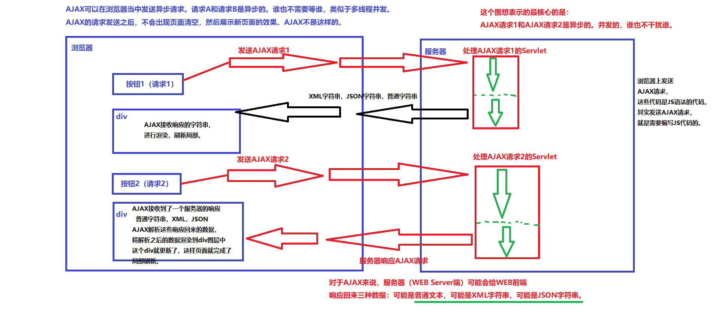

##### XMLHttpRequest对象

- XMLHttpRequest对象是AJAX的核心对象，发送请求以及接收服务器数据的返回，全靠它了。

- XMLHttpRequest对象，现代浏览器都是支持的，都内置了该对象。直接用即可。

- 创建XMLHttpRequest对象

  - ```javascript
    var xhr = new XMLHttpRequest();
    ```

- XMLHttpRequest对象的方法

| 方法                                          | 描述                                                         |
| :-------------------------------------------- | :----------------------------------------------------------- |
| abort()                                       | 取消当前请求                                                 |
| getAllResponseHeaders()                       | 返回头部信息                                                 |
| getResponseHeader()                           | 返回特定的头部信息                                           |
| open(*method*, *url*, *async*, *user*, *psw*) | 规定请求method：请求类型 GET 或 POSTurl：文件位置async：true（异步）或 false（同步）user：可选的用户名称psw：可选的密码 |
| send()                                        | 将请求发送到服务器，用于 GET 请求                            |
| send(*string*)                                | 将请求发送到服务器，用于 POST 请求                           |
| setRequestHeader()                            | 向要发送的报头添加标签/值对                                  |

- XMLHttpRequest对象的属性

| 属性               | 描述                                                         |
| :----------------- | :----------------------------------------------------------- |
| onreadystatechange | 定义当 readyState 属性发生变化时被调用的函数                 |
| readyState         | 保存 XMLHttpRequest 的状态。0：请求未初始化     1：服务器连接已建立     2：请求已收到    3：正在处理请求    4：请求已完成且响应已就绪 |
| responseText       | 以字符串返回响应数据                                         |
| responseXML        | 以 XML 数据返回响应数据                                      |
| status             | 返回请求的状态号200: "OK"403: "Forbidden"404: "Not Found"    |
| statusText         | 返回状态文本（比如 "OK" 或 "Not Found"）                     |

#### AJAX GET请求

- 发送AJAX get请求，前端代码：

  ```html
  <!DOCTYPE html>
  <html lang="en">
  <head>
      <meta charset="UTF-8">
      <title>发送ajax get请求</title>
  </head>
  <body>
  <script type="text/javascript">
      window.onload = function () {
          document.getElementById("btn").onclick = function () {
              //1. 创建AJAX核心对象
              var xhr = new XMLHttpRequest();
              //2. 注册回调函数
              xhr.onreadystatechange = function(){
                  //每一次状态改变时都会执行这个函数，只是加了请求完成的判断
                  if (this.readyState == 4) {
                      //readyState表示请求的状态，state表示请求结果
                      if (this.status == 200) {
                          //通过XMLHttpRequest对象的responseText属性可以获取到服务器响应回来的内容。并且不管服务器响应						回来的是什么，都以普通文本的形势获取。（服务器可能响应回来：普通文本、XML、JSON、HTML...）
                          // innerHTML属性是javascript中的语法，将后面的内容当做一段HTML代码解释并执行
                          document.getElementById("mydiv").innerHTML = this.responseText
                      }else{
                          alert(this.status)
                      }
                  }
              }
              //3. 开启通道
              xhr.open("GET", "/ajax/ajaxrequest2", true)
              //4. 发送请求
              xhr.send()
          }
      }
  </script>
  <button id="btn">发送ajax get请求</button>
  <span id="myspan"></span>
  <div id="mydiv"></div>
  </body>
  </html>
  ```

- 发送AJAX get请求，后端代码：

  ```java
  @WebServlet("/ajaxrequest2")
  public class AjaxRequest2Servlet extends HttpServlet {
      @Override
      protected void doGet(HttpServletRequest request, HttpServletResponse response)
              throws ServletException, IOException {
          // 设置响应的内容类型以及字符集
          response.setContentType("text/html;charset=UTF-8");
          // 获取响应流
          PrintWriter out = response.getWriter();
          // 响应
          out.print("<font color='red'>用户名已存在！！！</font>");
      }
  }
  ```

#### AJAX POST请求

- 发送AJAX POST请求，前端代码：

  ```html
  <!DOCTYPE html>
  <html lang="en">
  <head>
      <meta charset="UTF-8">
      <title>AJAX POST请求验证用户名是否可用</title>
  </head>
  <body>
  
  <script type="text/javascript">
      window.onload = function(){
          document.getElementById("username").onblur = function (){
              var xhr = new XMLHttpRequest()
              xhr.onreadystatechange = function () {
                  if (this.readyState == 4) {
                      if (this.status == 200) {
                          document.getElementById("tipMsg").innerHTML = this.responseText
                      }else{
                          alert(this.status)
                      }
                  }
              }
              xhr.open("POST", "/ajax/ajaxrequest4", true)
              //设置请求头的内容类型：模拟form表单提交，必须在open之后。
              xhr.setRequestHeader("Content-Type", "application/x-www-form-urlencoded")
              // 获取表单数据
              var username = document.getElementById("username").value
              // 放到send()这个函数的小括号当中的数据，会自动在请求体当中提交数据。
              xhr.send("uname=" + username)
          }
      }
  </script>
  
  用户名：<input type="text" id="username">
  
  <span id="tipMsg"></span>
  
  </body>
  </html>
  ```

#### 基于JSON的数据交换

- JSON

  - JavaScript Object Notation（JavaScript对象标记），简称JSON。JSON是一种标准的轻量级的（系统与系统间）数据交换格式。特点是：体积小，易解析。

  - ```javascript
    //JavaScript中JSON语法
    //创建JSON对象（JSON对象中的值可以是任意数据类型，包括JSON对象）
    var studentObj = {
    "sno" : "110",
    "sname" : "张三",
    "sex" : "男"
    };			
    //访问JSON对象的属性
    alert(studentObj.sno + "," + studentObj.sname + "," + studentObj.sex);
    //JSON数组
    var students = [
    				{"sno":"110","sname":"张三","sex":"男"},
    				{"sno":"120","sname":"李四","sex":"男"},
    				{"sno":"130","sname":"王五","sex":"男"}
    			];			
    // 遍历
    for(var i = 0; i < students.length; i++){
        var stuObj = students[i];
        alert(stuObj.sno + "," + stuObj.sname + "," + stuObj.sex);
    }
    ```

- 服务器发送JSON字符串给浏览器

  - ```html
    <!DOCTYPE html>
    <html lang="en">
    <head>
        <meta charset="UTF-8">
        <title>发送AJAX请求，显示学生列表</title>
    </head>
    <body>
    
    <script type="text/javascript">
        window.onload = function () {
            document.getElementById("btn").onclick = function () {
                // 1.创建核心对象
                var xhr = new XMLHttpRequest();
                // 2.注册回调函数
                xhr.onreadystatechange = function () {
                    if (this.readyState == 4) {
                        if (this.status == 200) {
                            // 将json格式的字符串转换成json对象
                            var stuList = JSON.parse(this.responseText)
                            var html = ""
                            for (var i = 0; i < stuList.length; i++) {
                                var stu = stuList[i]
                                html += "<tr>"
                                html += "<td>"+(i+1)+"</td>"
                                html += "<td>"+stu.name+"</td>"
                                html += "<td>"+stu.age+"</td>"
                                html += "<td>"+stu.addr+"</td>"
                                html += "</tr>"
                            }
                            document.getElementById("stutbody").innerHTML = html
                        } else {
                            alert(this.status)
                        }
                    }
                }
                // 3.开启通道
                xhr.open("GET", "/ajax/ajaxrequest5?t=" + new Date().getTime(), true)
                // 4.发送请求
                xhr.send()
            }
        }
    </script>
    
    <input type="button" value="显示学员列表" id="btn">
    
    <table width="50%" border="1px">
        <thead>
        <tr>
            <th>序号</th>
            <th>姓名</th>
            <th>年龄</th>
            <th>住址</th>
        </tr>
        </thead>
        <tbody id="stutbody">
    
        </tbody>
    </table>
    
    </body>
    </html>
    ```

  - ```java
    //连接数据库
    List<Student> studentList = new ArrayList<>();
                while (rs.next()) {
                    String name = rs.getString("name");
                    int age = rs.getInt("age");
                    String addr = rs.getString("addr");
                    // 将数据封装成Student对象
                    Student s = new Student(name, age, addr);
                    studentList.add(s);
                }
                
                //使用阿里巴巴的fastjson工具将List集合转换成json字符串
                jsonStr = JSON.toJSONString(studentList);
                // 响应JSON格式的字符串给前端。
                out.print(jsonStr);
    ```

#### 基于XML的数据交换

- XML

  - XML体积较大，解析麻烦，但是有其优点是：语法严谨。
  
- 

  ```html
  <!DOCTYPE html>
  <html lang="en">
  <head>
      <meta charset="UTF-8">
      <title>使用XML完成数据交换</title>
  </head>
  <body>
  <script type="text/javascript">
      window.onload = function(){
          document.getElementById("btn").onclick = function(){
              // 1.创建XMLHTTPRequest对象
              var xhr = new XMLHttpRequest();
              // 2.注册回调函数
              xhr.onreadystatechange = function () {
                  if (this.readyState == 4) {
                      if (this.status == 200) {
                          // 使用XMLHTTPRequest对象的responseXML属性，接收返回之后，可以自动封装成document对象
                          var xmlDoc = this.responseXML
                          // 获取所有的<student>元素，返回了多个对象，应该是数组。
                          var students = xmlDoc.getElementsByTagName("student")
                          var html = "";
                          for (var i = 0; i < students.length; i++) {
                              var student = students[i]
                              // 获取<student>元素下的所有子元素
                              html += "<tr>"
                              html += "<td>"+(i+1)+"</td>"
                              var nameOrAge = student.childNodes
                              for (var j = 0; j < nameOrAge.length; j++) {
                                  var node = nameOrAge[j]
                                  if (node.nodeName == "name") {
                                      html += "<td>"+node.textContent+"</td>"
                                  }
                                  if (node.nodeName == "age") {
                                      html += "<td>"+node.textContent+"</td>"
                                  }
                              }
                              html += "</tr>"
                          }
                          document.getElementById("stutbody").innerHTML = html
                      }else{
                          alert(this.status)
                      }
                  }
              }
              // 3.开启通道
              xhr.open("GET", "/ajax/ajaxrequest6?t=" + new Date().getTime(), true)
              // 4.发送请求
              xhr.send()
          }
      }
  </script>
  <button id="btn">显示学生列表</button>
  <table width="500px" border="1px">
      <thead>
      <tr>
          <th>序号</th>
          <th>姓名</th>
          <th>年龄</th>
      </tr>
      </thead>
      <tbody id="stutbody">
  
      </tbody>
  </table>
  </body>
  </html>
  ```

  ```java
  @WebServlet("/ajaxrequest6")
  public class AjaxRequest6Servlet extends HttpServlet {
      @Override
      protected void doGet(HttpServletRequest request, HttpServletResponse response)
              throws ServletException, IOException {
          // 注意：响应的内容类型是XML。
          response.setContentType("text/xml;charset=UTF-8");
          PrintWriter out = response.getWriter();
  
          StringBuilder xml = new StringBuilder();
          xml.append("<students>");
          xml.append("<student>");
          xml.append("<name>zhangsan</name>");
          xml.append("<age>20</age>");
          xml.append("</student>");
          xml.append("<student>");
          xml.append("<name>lisi</name>");
          xml.append("<age>22</age>");
          xml.append("</student>");
          xml.append("</students>");
  
          out.print(xml);
      }
  }
  ```

## Maven

> 2023.10.5~2023.10.6

#### 概述

- Maven 可以整合多个项目之间的引用关系，我们可以根据业务和分层需要任意拆分一个项目
- Maven 提供规范的管理各个常用 jar 包及其各个版本，并且可以自动下载和引入项目中
- Maven 可以根据指定版本自动解决 jar 包版本兼容问题
- Maven 可以把 jar 包所依赖的其它 jar 包自动下载并引入项目

#### 生命周期

- 清理：删除以前的编译结果，为重新编译做好准备。
- 编译：将Java源程序编译为字节码文件。
- 测试：针对项目中的关键点进行测试，确保项目在迭代开发过程中关键点的正确性。
- 报告：在每一次测试后以标准的格式记录和展示测试结果。
- 打包：将一个包含诸多文件的工程封装为一个压缩文件用于安装或部署。Java 工程对应 jar 包，Web工程对应war包。
- 安装：在Maven环境下特指将打包的结果——jar包或war包安装到本地仓库中。

#### 仓库

-  Maven 的插件是一些 jar，这些 jar 可以完成一定的功能；我们自己开发项目的模块；第三方框架或工具的 jar 包
- 本地仓库：即repository文件，在打包时会将项目放到这里。
- 中央仓库：包含了绝大多数流行的开源Jar包，当我们在pom文件中配置了jar包而本地仓库中没有时，就会到中央仓库联网下载
- 插件依赖信息搜索地址：https://mvnrepository.com/

#### 常用命令

- clean 清理(会删除原来编译和测试的目录，即 target 目录，但是已经 install 到仓库里的包不会删除)
- compile 编译主程序(会在当前目录下生成一个 target,里边存放编译主程序之后生成的字节码文件)
- test-compile 编译测试程序(会在当前目录下生成一个 target,里边存放编译测试程序之后生成的字节码文件)
- test 测试(会生成一个目录surefire-reports，保存测试结果)
- package 打包主程序(会编译、编译测试、测试、并且按照 pom.xml 配置把主程序打包生成 jar 包或者 war 包)
- install 安装主程序(会把本工程打包，并且按照本工程的坐标保存到本地仓库中)

#### 其他概念

- 插件：made的构建生命周期，由 maven 的插件 plugin 来执行完成。在<build>中设置（七大生命周期插件已经默认配置好）

- 坐标：坐标在仓库中可以唯一定位一个 Maven 项目，groupId：组织名，通常是公司或组织域名倒序+项目名；artifactId：模块名，通常是工程名；version：版本号

- 依赖范围：
  - 

- 指定资源位置：src/main/java 和 src/test/java 这两个目录中的所有*.java 文件会分别在 comile 和 test-comiple 阶段被编译，编

  译结果分别放到了 target/classes 和 targe/test-classes 目录中，但是这两个目录中的其他文件都会被忽略掉，如果需

  要把 src 目录下的文件包放到 target/classes 目录，作为输出的 jar 一部分。需要指定资源文件位置。以下内容放到

  \<buid>标签中。

  ```xml
  <build>
      <resources>
           <resource>
           <directory>src/main/java</directory><!--所在的目录-->
           <includes><!--包括目录下的.properties,.xml 文件都会扫描到-->
               <include>**/*.properties</include>
               <include>**/*.xml</include>
           </includes>
           <!—filtering 选项 false 不启用过滤器， *.property 已经起到过滤的作用了 -->
           <filtering>false</filtering>
           </resource>
       </resources>
  </build>
  ```

## Mybatis

> 2023.10.6~2023.10.11

#### 概述

##### 框架

- 
- Mybatis是一个持久化层的框架，本质上就是对JDBC的封装，属于半自动化ORM框架。
- 框架其实就是对通用代码的封装，以jar包的形式存在，提前写好了一堆接口和类，我们可以在做项目的时候直接引入这些接口和类（引入框架），基于这些现有的接口和类进行开发，可以大大提高开发效率。

##### 开发步骤

- 配置pom文件，设置打包方式，引入依赖（mysql，Junit，mybatis，logback）

- 引入日志依赖logback.xml

  - ```xml
    <?xml version="1.0" encoding="UTF-8"?>
    
    <configuration debug="false">
        <!-- 控制台输出 -->
        <appender name="STDOUT" class="ch.qos.logback.core.ConsoleAppender">
            <encoder class="ch.qos.logback.classic.encoder.PatternLayoutEncoder">
                <!--格式化输出：%d表示日期，%thread表示线程名，%-5level：级别从左显示5个字符宽度%msg：日志消息，%n是换行符-->
                <pattern>[%thread] %-5level %logger{50} - %msg%n</pattern>
            </encoder>
        </appender>
    
        <!--mybatis log configure-->
        <logger name="com.apache.ibatis" level="TRACE"/>
        <logger name="java.sql.Connection" level="DEBUG"/>
        <logger name="java.sql.Statement" level="DEBUG"/>
        <logger name="java.sql.PreparedStatement" level="DEBUG"/>
    
        <!-- 日志输出级别,logback日志级别包括五个：TRACE < DEBUG < INFO < WARN < ERROR -->
        <root level="DEBUG">
            <appender-ref ref="STDOUT"/>
            <appender-ref ref="FILE"/>
        </root>
    
    </configuration>
    ```

- 编写核心配置文件（只有一个）：mybatis-config.xml

  - ```xml
    <?xml version="1.0" encoding="UTF-8" ?>
    <!DOCTYPE configuration
            PUBLIC "-//mybatis.org//DTD Config 3.0//EN"
            "http://mybatis.org/dtd/mybatis-3-config.dtd">
    
    <configuration>
        <!--使用properties文件配置environment-->
        <properties resource="jdbc.properties" />
    	<!--开启驼峰命名-->
        <settings>
     		 <setting name="mapUnderscoreToCamelCase" value="true"/>
    	</settings>
        <!--一个environment对应一个数据库对应一个SqlSessionFactory,default表示未指定时默认环境-->
        <environments default="development">
            <environment id="development">
                <!--事务管理方式,JDBC管理方式在获取对话对象时自动开启事务-->
                <transactionManager type="JDBC"/>
                <!--使用连接池技术，为程序提供Connection对象-->
                <dataSource type="POOLED">
                    <property name="driver" value="${dirver}"/>
                    <property name="url" value="${url}"/>
                    <property name="username" value="${username}"/>
                    <property name="password" value="${password}"/>
                    <!--连接池当中最多的正在使用的连接对象的数量上限，默认值10-->
                    <property name="poolMaximumActiveConnections" value="10"/>
                    <!--当连接对象用完时，每隔2秒打印日志，并且尝试获取连接对象-->
                    <property name="poolTimeToWait" value="2000"/>
                    <!--超过设定的时间强行让某个连接空闲，然后建立连接-->
                    <property name="poolMaximumCheckoutTime" value="10000"/>
                    <!--最多的空闲数量-->
                    <property name="poolMaximumIdleConnections" value="5"/>
                </dataSource>
            </environment>
        </environments>
    
        <mappers>
            <mapper class="com.powernode.mybatis.mapper.*"/>
        </mappers>
    </configuration>
    ```

- 编写sql语句文件（一个表对应一个）：XxxxMapper.xml

  - ```xml
    <?xml version="1.0" encoding="UTF-8" ?>
    <!DOCTYPE mapper
            PUBLIC "-//mybatis.org//DTD Mapper 3.0//EN"
            "http://mybatis.org/dtd/mybatis-3-mapper.dtd">
    <!--指定命名空间的，应该与mapper接口的全限定类名一致-->
    <mapper namespace="fdsafdsa">
    
        <insert id="insertCar">
        <!--应该与mapper接口中的抽象方法名一致-->
            insert into t_car(id,car_num,brand,guide_price,produce_time,car_type)
            values(null,'1003','丰田霸道',30.0,'2000-10-11','燃油车')
        </insert>
    
    </mapper>
    ```

- 使用包装类编写MyBatis程序

  - ```java
    public class SqlSessionUtil {
    
        //构造器私有化
        private SqlSessionUtil() {
        }
    
        //声明SqlSessionFactory
        private static SqlSessionFactory sqlSessionFactory = null;
    
        //静态私有TreadLocal
        private static ThreadLocal<SqlSession> threadLocal= new ThreadLocal<>();
    
        //静态代码块获取SqlSessionFactory对象，一个数据库对应一个
        static {
            try {
                sqlSessionFactory = (new SqlSessionFactoryBuilder()).build(Resources.getResourceAsStream("mybatis-config.xml"));
            } catch (IOException e) {
                e.printStackTrace();
            }
        }
    
        //getSqlSession方法
        public static SqlSession getSqlSession(){
            if (threadLocal.get() == null){
                threadLocal.set(sqlSessionFactory.openSession());
            }
            return threadLocal.get();
        }
    
        //关闭资源
        public s void close(SqlSession sqlSession){
            if (sqlSession != null){
                sqlSession.close();
            }
            //Tomcat支持线程池
            threadLocal.remove();
        }
    }
    ```

#### CRUD

- mybatis中sql语句的占位符是#{}，可以使用Map给占位符赋值，占位符中填key（必须与字段名相同），底层调用set和get方法操作value值；也可以使用pojo给占位符赋值，占位符中填属性（必须与字段名相同且有getter和setter方法），底层通过反射机制创建对象，并调用set和get方法。注意：字段名是指查询结果的，可以通过起别名的方式与pojo中属性名保持一致。

- insert，delete，update都是返回影响数据库中数据数量。
- select标签中resultType属性，查询结果集封装成此类型的java对象，写的是全限定类名。查询所有时返回一个List集合

#### 底层原理

##### javassist

- javassist类似于反射机制，可以理解成是反射机制的加强版，反射机制要有已知的类，javassist可以直接帮你在内存中创建类。适用于简单且代码近似的大量类的编写。

- ```java
  //利用javassist创建类
  public class JavassistTest {
      public static void main(String[] args) throws Exception {
          // 获取类池
          ClassPool pool = ClassPool.getDefault();
          // 创建类
          CtClass ctClass = pool.makeClass("com.powernode.javassist.Test");
          // 创建方法
          // 1.返回值类型 2.方法名 3.形式参数列表 4.所属类
          CtMethod ctMethod = new CtMethod(CtClass.voidType, "execute", new CtClass[]{}, ctClass);
          // 设置方法修饰符
          ctMethod.setModifiers(Modifier.PUBLIC);
          // 设置方法体
          ctMethod.setBody("{System.out.println(\"hello world\");}");
          // 给类添加方法
          ctClass.addMethod(ctMethod);
          // 获取Class对象
          Class<?> aClass = ctClass.toClass();
          //反射机制
          Object o = aClass.newInstance();
          Method method = aClass.getDeclaredMethod("execute");
          method.invoke(o);
      }
  }
  ```

##### getMapper

- Mybatis对javassist进行封装，帮助我们免去对mapper接口的实现，存在的最大问题是Mybatis的开发人员不知道我们的sqlId，所以出台了一套规范：凡是使用代理机制的，namespace必须是mapper接口的全限定名称。id必须是mapper接口中方法名。这样就可以通过传入接口的全类名以及方法名拿到sqlId。

- ```java
  	//用于获取并解析mybatis-config.xml文件，得到Mapper.xml文件
  	SqlSession sqlSession = SqlSessionUtil.openSession();
  	//用于获取sqlId，这样在内存中创建出来的mapper就相当于dao的实现类
      CarMapper mapper = sqlSession.getMapper(CarMapper.class);
  ```

#### Mybatis小技巧

##### #{}与${}

- #{}：底层使用PreparedStatement，先进行SQL语句的编译，然后给SQL语句的占位符问号?传值。可以避免SQL注入的风险。相当于给传入的值加上单引号。模糊查询"%"#{}"%"
- ${}：底层使用Statement，先进行SQL语句的拼接，然后再对SQL语句进行编译，存在SQL注入的风险。相当于直接将传入的值拼接到sql语句中。
  - 如果需要SQL语句的关键字放到SQL语句中，只能使用${}，因为关键字不能加上单引号。比如：升降序（asc，desc），表名需要拼接，用where in()的方法批量操作数据，模糊查询'%\${}%'

##### 配置别名

- ```xml
  <typeAliases>
      <!--采用默认的别名机制，使用类简名作为别名-->
      <typeAlias type="com.powernode.mybatis.pojo.Car"/>
      <typeAlias type="com.powernode.mybatis.pojo.Log"/>
      <!--包下所有的类自动起别名。使用简名作为别名。-->
      <package name="com.powernode.mybatis.pojo"/>
   </typeAliases>
  	<!--即使配置了别名，namespace中仍不可以使用别名-->
  ```

##### mapper标签

- ```xml
      <mapper class="com.powernode.mybatis.mapper.CarMapper"/>
  	<!--如果这样写mybatis框架会自动去com/powernode/mybatis/mapper目录下查找CarMapper.xml文件。采用这种方式，必须在		resources目录下建立与java目录中相同的文件结构，并将Mapper文件单独放入其中-->
  	<!--在IDEA的resources目录下新建多重目录的话，必须这样创建：com/powernode/mybatis/mapper-->
  ```

##### 自动生成主键

- ```xml
   <!--useGeneratedKeys="true" 表示启用主键值。keyProperty="id" 表示说明pojo对象的id属性是主键，自动给id属性自增赋值并将null填补-->
      <insert id="insertCarUseGeneratedKeys" useGeneratedKeys="true" keyProperty="id">
          insert into t_car values(null,#{carNum},#{brand},#{guidePrice},#{produceTime},#{carType})
      </insert>
  ```

#### 参数注入

##### 参数类型推断

- 参数列表传给占位符后，mybatis框架自身带有类型自动推断机制，它是可以自动推断出参数列表的数据类型并调用ps.setXxxx()方法。如果我们主动告诉mybatis框架参数类型，就可以提高效率。

- ```xml
  <!--如果给类起了简名，parameterType中就不必写全类名-->
  <!--resultType表示查询结果封装成的对象，mybatis对基本数据类型内置了很多别名，也不区分大小写-->
  <select id="selectByName" resultType="student" parameterType="String">
    select * from t_student where name = #{name, javaType=String, jdbcType=VARCHAR}
  </select>
  ```

##### 多参数匹配

- 当我们传给sql语句多个参数时，mybatis需要我们提供参数与占位符的对应关系，有三种对应方式：

  - mybatis底层封装了一个map，key为arg0，arg1...，value为按顺序排列的参数列表。

  - mybatis底层封装了一个map，key为param1，param2...，value为按顺序排列的参数列表

  - **使用@Param注释**，mybatis底层封装了一个map，key为我们起的别名，value为arg[0],arg[1]...

  - ```java
    List<Student> selectByNameAndAge(@Param("name") String name, @Param("age") int age);
    ```

#### 结果映射

##### resultMap

- ```xml
  <!--id：是让定位映射表的标识，作为select标签的resultMap属性的值。type：结果集要处理的类，可以使用别名。-->
  <resultMap id="carResultMap" type="car">
    <!--为了提高mybatis的性能，主键建议写上。-->
    <id property="id" column="id"/>
    <!--property为pojo类属性名，column为对应字段名-->
    <result property="carNum" column="car_num"/>
    <!--javaType用来指定属性类型。jdbcType用来指定字段类型。-->
    <result property="brand" column="brand" javaType="string" jdbcType="VARCHAR"/>
    <result property="guidePrice" column="guide_price"/>
    <result property="produceTime" column="produce_time"/>
    <result property="carType" column="car_type"/>
  </resultMap>
  
  <!--resultMap属性的值必须和resultMap标签中id属性值一致。-->
  <select id="selectAllByResultMap" resultMap="carResultMap">
    select * from t_car
  </select>
  ```

##### 驼峰命名

这样可以直接使用resultType

- ```xml
  <!--放在properties标签后面-->
  <settings>
    <setting name="mapUnderscoreToCamelCase" value="true"/>
  </settings>
  ```

#### 动态SQL

##### if

- 注意：

  - test属性不能包含<和<=符号，分别用lt和lte代替

  - 是否等于某个特定字符串

  - ```xml
    <if test='user != null and username !="" and username == "root" '> </if>
    ```

  - 是否以…为开头

  - ```xml
    <if test="username != null and username.indexOf('...') == 0"> </if>
    ```

  - 是否包含某字符

  - ```xml
    <if test="username != null and username.indexOf('ji') >= 0"> </if> 
    ```

  - 是否以…结尾

  - ```xml
    <if test="username != null and username.lastIndexOf('ji') > 0"></if> 
    ```

  - ```xml
    <select id="selectByMultiCondition" resultType="Car">
            select * from t_car where 1 = 1
            <!--如果test是true，则if标签中的sql语句就会拼接。反之，则不会拼接。当使用了@Param注解，那么test中要出现的是@Param注解指定的参数名-->
            <if test="brand != null and brand != ''">
                and brand like "%"#{brand}"%"
            </if>
            <if test="guidePrice != null and guidePrice != ''">
                and guide_price > #{guidePrice}
            </if>
            <if test="carType != null and carType != ''">
                and car_type = #{carType}
            </if>
        </select>
    ```


##### where

- ```xml
  <select id="selectByMultiConditionWithWhere" resultType="Car">
          select * from t_car
          <!--让where子句更加动态智能，所有条件都为空时，where标签保证不会生成where子句；自动去除某些条件前面多余的and或or。所以建议所有开头都加上and-->
          <where>
              <if test="brand != null and brand != ''">
                  and brand like "%"#{brand}"%"
              </if>
              <if test="guidePrice != null and guidePrice != ''">
                  and guide_price > #{guidePrice}
              </if>
              <if test="carType != null and carType != ''">
                  and car_type = #{carType}
              </if>
          </where>
      </select>
  ```

##### trim

- ```xml
  <select id="selectByMultiConditionWithTrim" resultType="Car">
          select * from t_car
          <!--prefix：加前缀；suffix：加后缀；prefixOverrides：删除前缀；suffixOverrides：删除后缀 -->
          <trim prefix="where" suffixOverrides="and|or">
              <if test="brand != null and brand != ''">
                  brand like "%"#{brand}"%" or
              </if>
              <if test="guidePrice != null and guidePrice != ''">
                  guide_price > #{guidePrice} and
              </if>
              <if test="carType != null and carType != ''">
                  car_type = #{carType}
              </if>
          </trim>
  
      </select>
  ```

##### set

- ```xml
  <update id="updateBySet">
          update t_car
      	<!--主要使用在update语句当中，用来生成set关键字，同时去掉最后多余的“,”；比如我们只更新提交的不为空的字段，如果提交的数据是空或者""，那么这个字段我们将不更新。-->
          <set>
              <if test="carNum != null and carNum != ''">car_num = #{carNum},</if>
              <if test="brand != null and brand != ''">brand = #{brand},</if>
              <if test="guidePrice != null and guidePrice != ''">guide_price = #{guidePrice},</if>
              <if test="produceTime != null and produceTime != ''">produce_time = #{produceTime},</if>
              <if test="carType != null and carType != ''">car_type = #{carType},</if>
          </set>
          where
              id = #{id}
      </update>
  ```

##### choose when otherwise

- ```xml
  <select id="selectByChoose" resultType="Car">
          select * from t_car
      	<!--只有一个分支会被选择,需求：先根据品牌查询，如果没有提供品牌，再根据指导价格查询，如果没有提供指导价格，就根据生产日期查询。-->
          <where>
              <choose>
                  <when test="brand != null and brand != ''">
                      brand like "%"#{brand}"%"
                  </when>
                  <when test="guidePrice != null and guidePrice != ''">
                      guide_price > #{guidePrice}
                  </when>
                  <otherwise>
                      car_type = #{carType}
                  </otherwise>
              </choose>
          </where>
      </select>
  ```

##### foreach

- ```xml
  <delete id="deleteByIds">
          delete from t_car where id in
      	<!--collection表示传进来的集合或数组的别名，item为集合中的每一个元素，separator为每一次循环后追加的字符，			open为循环开始前插入的字符，close为循环结束后插入的字符-->
          <foreach collection="ids" item="id" separator="," open="(" close=")">
              #{id}
          </foreach>
      </delete>
  ```

##### sql和include

- ```xml
  <!--sql标签用来声明sql片段,使其得到复用-->
  <sql id="carCols">id,car_num carNum,brand,guide_price guidePrice,produce_time produceTime,car_type carType</sql>
  <!--include标签用来将声明的sql片段包含到某个sql语句当中-->
  <select id="selectAllRetMap" resultType="map">
    select <include refid="carCols"/> from t_car
  </select>
  ```

#### 高级映射

##### 多对一

- 多的表作为主表，映射到java中即是主类，一的表为副表，主类中有副类的成员类。

- 级联属性映射

  - ```xml
    <resultMap id="studentResultMap" type="Student">
            <id property="sid" column="sid"/>
            <result property="sname" column="sname"/>
        	<!--将查询结果用副类.属性名的方式直接对成员类配置-->
            <result property="clazz.cid" column="cid"/>
            <result property="clazz.cname" column="cname"/>
        </resultMap>
    
        <select id="selectById" resultMap="studentResultMap">
            select
                s.sid,s.sname,c.cid,c.cname
            from
                t_stu s left join t_clazz c on s.cid = c.cid
            where
                s.sid = #{sid}
        </select>
    ```

- association

  - ```xml
    <resultMap id="studentResultMapAssociation" type="Student">
            <id property="sid" column="sid"/>
            <result property="sname" column="sname"/>
            <!--association：一个Student对象关联一个Clazz对象。property：要映射的属性名；javaType：该属性的java		类型。-->
            <association property="clazz" javaType="Clazz">
                <id property="cid" column="cid"/>
                <result property="cname" column="cname"/>
            </association>
        </resultMap>
    
        <select id="selectByIdAssociation" resultMap="studentResultMapAssociation">
            select
                s.sid,s.sname,c.cid,c.cname
            from
                t_stu s left join t_clazz c on s.cid = c.cid
            where
                s.sid = #{sid}
        </select>
    ```

- 分步查询

  - ```xml
    	<!--分步查询的优点：复用性增强。可以重复利用。（相当于乐高的小零件）；可以充分利用延迟加载/懒加载机制。（第二步	查询结果需要用的时候再执行查询语句。不用的时候不查询。）-->
    	<!--开启延迟加载：在mybatis-config中添加全局配置，如果某一步不需要使用延迟加载，单独在collection标签中设置		fetchType="eager"-->
    	<settings>
            <setting name="lazyLoadingEnabled" value="true"/>
        </settings>
    
        <!--第一步：根据学生的id查询学生的信息。-->
        <resultMap id="studentResultMapByStep" type="Student">
            <id property="sid" column="sid"/>
            <result property="sname" column="sname"/>
        	<!--将查询到的数据先传递给另一条SQL语句，再将这条SQL语句的执查询结果(column指定的字段)给属性(property指定的属性)赋值，SQL语句要写全ID-->
            <association property="clazz"
                         select="com.powernode.mybatis.mapper.ClazzMapper.selectByIdStep2"
                         column="cid"
                         fetchType="eager"/>
        </resultMap>
    	
    	<select id="studentResultMapByStep" resultMap="studentResultMap">
      		select sid,sname,cid from t_student s where sid = #{sid}
    	</select>
    
    	<!--第二步：根据cid获取班级信息。因为查询结果封装类型为Clazz，所以要写在ClazzMapper中-->
        <select id="selectByIdStep2" resultType="Clazz">
            select cid,cname from t_clazz where cid = #{cid}
        </select>
    ```

##### 一对多

- 一的表作为主表，映射到java中即是主类，多的表为副表，主类中有副类的集合的成员类。

- collection

  - ```xml
        <resultMap id="clazzResultMap" type="Clazz">
            <id property="cid" column="cid"/>
            <result property="cname" column="cname"/>
            <!--collection：ofType指定集合中的元素类型。-->
            <collection property="stus" ofType="Student">
                <id property="sid" column="sid"/>
                <result property="sname" column="sname"/>
            </collection>
        </resultMap>
    
        <select id="selectByCollection" resultMap="clazzResultMap">
            select c.cid,c.cname,s.sid,s.sname from t_clazz c left join t_stu s on c.cid = s.cid where c.cid = #{cid}
        </select>
    ```

- 分步查询

  - ```xml
    	<!--第一步：根据班级的cid获取班级信息。-->
        <resultMap id="clazzResultMapStep" type="Clazz">
            <id property="cid" column="cid"/>
            <result property="cname" column="cname"/>
            <collection property="stus"
                        select="com.powernode.mybatis.mapper.StudentMapper.selectByCidStep2"
                        column="cid" fetchType="eager" />
        </resultMap>
    
        <select id="selectByStep1" resultMap="clazzResultMapStep">
            select cid,cname from t_clazz where cid = #{cid}
        </select>
        
    	<!--第一步：根据班级的cid获取学生信息。自动封装成一个集合。-->
    	<select id="selectByCidStep2" resultType="Student">
            select * from t_stu where cid = #{cid}
        </select>
    ```

#### 缓存机制

- 将读取到的数据储存在缓存中，避免读取相同数据时再到硬盘中的数据库文件中读取，通过减少IO的方式，来提高程序的执行效率。

##### 一级缓存

- 一级缓存默认是开启的，不需要做任何配置。
- 一级缓存将查询到的数据存储到SqlSession中，只要使用同一个SqlSession对象执行同一条SQL语句，就会走缓存。
- 一级缓存失效情况包括两种：
  - 第一次查询和第二次查询之间，手动清空了一级缓存：sqlSession.clearCache();
  - 第一次查询和第二次查询之间，执行了增删改操作（即使不是要查询的表）

##### 二级缓存

- 在需要使用二级缓存的SqlMapper.xml文件中添加配置：\<cache />；使用二级缓存的实体类对象必须是可序列化的，也就是必须实现java.io.Serializable接口。
- 二级缓存将查询到的数据存储到SqlSessionFactory中。SqlSession对象关闭或提交之后，一级缓存中的数据才会被写入到二级缓存当中。此时二级缓存才可用。
- 与一级缓存相同，只要两次查询之间出现了增删改操作，二级缓存就会失效。

- 集成其它第三方的缓存：EhCache

#### 逆向工程

- 只需要开发者提供数据库表，根据数据库表逆向生成Java的pojo类，SqlMapper.xml文件，以及Mapper接口类等。

- 在pom中添加逆向工程插件

  - ```xml
    <build>
      <plugins>
        <plugin>
          <groupId>org.mybatis.generator</groupId>
          <artifactId>mybatis-generator-maven-plugin</artifactId>
          <version>1.4.1</version>
          <configuration>
            <overwrite>true</overwrite>
          </configuration>
          <dependencies>
            <dependency>
              <groupId>mysql</groupId>
              <artifactId>mysql-connector-java</artifactId>
              <version>8.0.30</version>
            </dependency>
          </dependencies>
        </plugin>
      </plugins>
    </build>
    ```

- 配置generatorConfig.xml，该文件必须放在类的根路径下。

  - ```xml
    <?xml version="1.0" encoding="UTF-8"?>
    <!DOCTYPE generatorConfiguration
            PUBLIC "-//mybatis.org//DTD MyBatis Generator Configuration 1.0//EN"
            "http://mybatis.org/dtd/mybatis-generator-config_1_0.dtd">
    
    <generatorConfiguration>
        <!--
            targetRuntime有两个值：
                MyBatis3Simple：生成的是基础版，只有基本的增删改查。
                MyBatis3：生成的是增强版，除了基本的增删改查之外还有复杂的增删改查。
        -->
        <context id="DB2Tables" targetRuntime="MyBatis3">
            <!--防止生成重复代码-->
            <plugin type="org.mybatis.generator.plugins.UnmergeableXmlMappersPlugin"/>
          
            <commentGenerator>
                <!--是否去掉生成日期-->
                <property name="suppressDate" value="true"/>
                <!--是否去除注释-->
                <property name="suppressAllComments" value="true"/>
            </commentGenerator>
    
            <!--连接数据库信息-->
            <jdbcConnection driverClass="com.mysql.cj.jdbc.Driver"
                            connectionURL="jdbc:mysql://localhost:3306/powernode"
                            userId="root"
                            password="root">
            </jdbcConnection>
    
            <!-- 生成pojo包名和位置 -->
            <javaModelGenerator targetPackage="com.powernode.mybatis.pojo" targetProject="src/main/java">
                <!--是否开启子包-->
                <property name="enableSubPackages" value="true"/>
                <!--是否去除字段名的前后空白-->
                <property name="trimStrings" value="true"/>
            </javaModelGenerator>
    
            <!-- 生成SQL映射文件的包名和位置 -->
            <sqlMapGenerator targetPackage="com.powernode.mybatis.mapper" targetProject="src/main/resources">
                <!--是否开启子包-->
                <property name="enableSubPackages" value="true"/>
            </sqlMapGenerator>
    
            <!-- 生成Mapper接口的包名和位置 -->
            <javaClientGenerator
                    type="xmlMapper"
                    targetPackage="com.powernode.mybatis.mapper"
                    targetProject="src/main/java">
                <property name="enableSubPackages" value="true"/>
            </javaClientGenerator>
    
            <!-- 表名和对应的实体类名-->
            <table tableName="t_car" domainObjectName="Car"/>
    
        </context>
    </generatorConfiguration>
    ```

- 运行插件并开始使用

  - ```java
    public class CarMapperTest {
        // CarExample类负责封装查询条件
        @Test
        public void testSelect(){
            SqlSession sqlSession = SqlSessionUtil.openSession();
            CarMapper mapper = sqlSession.getMapper(CarMapper.class);
            // 1. 查询一个
            Car car = mapper.selectByPrimaryKey(165L);
            // 2. 查询所有（selectByExample，根据条件查询，如果条件是null表示没有条件。）
            List<Car> cars = mapper.selectByExample(null);
            // 3. 按照条件进行查询:QBC 风格：Query By Criteria 一种查询方式，比较面向对象，看不到sql语句。
            CarExample carExample = new CarExample();
            // 调用carExample.createCriteria()方法来创建查询条件
            carExample.createCriteria()
                       .andBrandLike("帕萨特")
                       .andGuidePriceGreaterThan(new BigDecimal(20.0));
            // 添加or,与其前面的部分是分开的，相当于加了一个小括号
            carExample.or().andCarTypeEqualTo("燃油车");
            // 执行查询
            List<Car> cars2 = mapper.selectByExample(carExample);
            sqlSession.close();
        }
    }
    ```

#### PageHelper

- 引入依赖

  - ```xml
    <dependency>
      <groupId>com.github.pagehelper</groupId>
      <artifactId>pagehelper</artifactId>
      <version>5.3.1</version>
    </dependency>
    ```

- typeAliases标签下面配置插件

  - ```xml
    <plugins>
      <plugin interceptor="com.github.pagehelper.PageInterceptor"></plugin>
    </plugins>
    ```

- 开始使用

  - ```java
    public void testSelectAll(){
            SqlSession sqlSession = SqlSessionUtil.openSession();
            CarMapper mapper = sqlSession.getMapper(CarMapper.class);
            // 要在执行DQL语句之前开启分页功能，后面的DQL语句就会被自动加上lim
            int pageNum = 2;
            int pageSize = 3;
            PageHelper.startPage(pageNum, pageSize);
    
            List<Car> cars = mapper.selectAll();
        
            // 封装分页信息对象new PageInfo()
            PageInfo<Car> carPageInfo = new PageInfo<>(cars, 3);
    		 /*
            PageInfo{pageNum=2, pageSize=3, size=3, startRow=4, endRow=6, total=7, pages=3,
            list=Page{count=true, pageNum=2, pageSize=3, startRow=3, endRow=6, total=7, pages=3, reasonable=false, pageSizeZero=false}
            [Car{id=168, carNum='1204', brand='奥迪Q7', guidePrice=3.0, produceTime='2009-10-11', carType='燃油车'},
            Car{id=169, carNum='1205', brand='朗逸', guidePrice=4.0, produceTime='2001-10-11', carType='新能源'},
            Car{id=170, carNum='1206', brand='奔驰E300L', guidePrice=50.0, produceTime='2003-02-03', carType='新能源'}],
            prePage=1, nextPage=3, isFirstPage=false, isLastPage=false, hasPreviousPage=true, hasNextPage=true,
            navigatePages=3, navigateFirstPage=1, navigateLastPage=3, navigatepageNums=[1, 2, 3]}
             */
    
            sqlSession.close();
        }
    ```

#### 注解式开发

- 可以通过在Mapper接口方法标注注解免去写Mapper.xml文件，只适合简单的CRUD语句，一旦语句中出现标签，开发效率还不如写Mapper.xml文件。

- ```java
  @Select("select * from t_car where id = #{id}")
  @Results({
      @Result(column = "id", property = "id", id = true),
      @Result(column = "car_num", property = "carNum"),
      @Result(column = "brand", property = "brand"),
      @Result(column = "guide_price", property = "guidePrice"),
      @Result(column = "produce_time", property = "produceTime"),
      @Result(column = "car_type", property = "carType")
  })
  Car selectById(Long id);
  ```

## Spring6

> 2023.10.11~2023.10.14

#### 概述

##### 传统MVC架构弊端

- 违反OCP开闭原则：比如service层中需要实例化dao层的类，dao层的每一个类都是使用不同的数据库进行CRUD，当我们要切换数据库时，就要修改service层中的代码，会引起一系列的连锁反应。
- 违反DIP依赖倒置原则：主要倡导面向抽象编程，面向接口编程，不要面向具体编程，让上层不再依赖下层，下面改动了，上面的代码不会受到牵连。这样可以大大降低程序的耦合度，耦合度低了。

##### Spring框架作用

- 掌握对象的创建权（只需要修改配置文件，不需要修改源代码符合OCP开闭原则）
- 管理对象间的关系（切断层与层之间的依赖关系，符合DIP依赖倒置原则）
- Spring框架实现了Ioc控制反转思想：将对象的创建权交出去，将对象和对象之间关系的管理权交出去，由第三方容器来负责创建与维护。实现方式为DI依赖注入：set方法注入，构造器注入

##### Spring框架结构

- 

##### 开发步骤

- 添加spring context的依赖，只需要添加这个依赖，其他的依赖就会自动添加

- 定义bean类

- 在类的根路径下配置beans.xml文件（IDEA工具自带有spring配置文件的模板）

  - ```xml
    <!--id：代表对象的唯一标识。class属性：用来指定要创建的java对象的类名，这个类名必须是全限定类名-->
    <bean id="userBean" class="com.powernode.spring6.bean.User"/>
    ```

- 生成Spring容器并获取bean

  - ```java
        public void testFistSpringCode(){
            // 获取Spring容器对象。ApplicationContext是一个接口，其实就是Spring容器。								//ClassPathXmlApplicationContext是其中的一个实现类，专门从类路径当中加载spring配置文件
            
            //解析xml文件并通过反射机制调用无参构造方法创建bean对象放入Spring容器中
            ApplicationContext applicationContext = new ClassPathXmlApplicationContext("spring6.xml", "beans.xml", "xml/beans.xml");
    
            // 根据bean的id从Spring容器中获取这个对象，取出来是Object类型的。如果bean的id不存在，出现异常。
            Object userBean = applicationContext.getBean("userBean");
    
            //第二个参数可以指定取出数据的类型
            UserDaoImplForMySQL userDaoBean = applicationContext.getBean("userDaoBean", UserDaoImplForMySQL.class);
        }
    }
    ```

#### IoC实现

##### set注入

- 通过反射机制调用set方法来给属性赋值，让两个对象之间产生关系。(set方法按照bean规范，这样name标签就可以与属性名保持一致)

- 注入外部bean(常用)

  - ```xml
        <bean id="userServiceBean" class="com.powernode.spring6.service.UserService">
            <property name="userDao" ref="userDaoBean"/>
        </bean>
    ```

- 注入内部bean(嵌套bean，不常用)

  - ```xml
        <bean id="userServiceBean" class="com.powernode.spring6.service.UserService">
            <property name="userDao">
                <bean class="com.powernode.spring6.dao.UserDao"/>
            </property>
        </bean>
    ```

- 注入简单类型

  - ```xml
        <bean id="userBean" class="com.powernode.spring6.beans.User">
            <!--基本数据类型及其包装类，枚举类，日期类，URL，URI，字符处理类-->
            <!--此时要用value标签-->
            <property name="age" value="20"/>
        </bean>
    ```

- 注入级联属性(了解)

  - ```xml
        <bean id="clazzBean" class="com.powernode.spring6.beans.Clazz"/>
        
        <bean id="student" class="com.powernode.spring6.beans.Student">
            <property name="name" value="张三"/>
            <!--以下两行配置的顺序不能颠倒-->
            <property name="clazz" ref="clazzBean"/>
            <!--clazz属性必须有getter方法-->
            <property name="clazz.name" value="高三一班"/>
        </bean>
    ```

- 注入数组与集合

  - ```xml
        <bean id="yuQian" class="com.powernode.spring6.bean.QianDaYe">
    
            <property name="aiHaos">
                <!--注入数组，序列用list标签，集合用set标签-->
                <array>
                    <value>抽烟</value>
                    <value>喝酒</value>
                    <value>烫头</value>
                </array>
            </property>
    
            
            <property name="properties">
                <!--注入Properties，key和value都只能是String-->
                <props>
                    <prop key="driver">com.mysql.cj.jdbc.Driver</prop>
                    <prop key="url">jdbc:mysql://localhost:3306/spring6</prop>
                    <prop key="username">root</prop>
                    <prop key="password">123456</prop>
                </props>
            </property>
    
            <property name="phones">
                <!--注入Map集合-->
                <map>
                    <!--key和value不是简单类型：<entry key-ref="" value-ref=""/>-->
                    <entry key="1" value="110"/>
                    <entry key="2" value="120"/>
                    <entry key="3" value="119"/>
                </map>
            </property>
    
        </bean>
    ```

- 注入特殊值

  - ```xml
        <bean id="catBean" class="com.powernode.spring6.bean.Cat">
            <!--注入null第一种方式-->
            <property name="name" value="tom"></property>
            <!--注入null第二种方式--->
            <property name="name">
                <null/>
            </property>
    
            <!--注入空字符串第一种方式-->
            <property name="name" value=""/>
            <!--注入空字符串第二种方式-->
            <property name="name">
                <value/>
            </property>
            
            <!--注入特殊字符-->
            <property name="result">
                <!--只能使用value标签-->
                <value><![CDATA[2 < 3]]></value>
            </property>
        </bean>
    ```

##### 构造器注入

- 通过反射机制调用构造方法来给属性赋值，让两个对象之间产生关系。

- ```java
  public class OrderService {
      private OrderDao orderDao;
      private UserDao userDao;
  
      // 通过反射机制调用构造方法给属性赋值
      public OrderService(OrderDao orderDao, UserDao userDao) {
          this.orderDao = orderDao;
          this.userDao = userDao;
      }
  ```

- ```xml
  <bean id="orderServiceBean" class="com.powernode.spring6.service.OrderService">
    <!--这里使用了构造方法上参数的名字-->
    <constructor-arg name="orderDao" ref="orderDaoBean"/>
    <constructor-arg name="userDao" ref="userDaoBean"/>
  </bean>
  ```

#### Bean的获取方式

- 构造方法实例化

  - ```xml
    	<!--在spring配置文件中直接配置类全路径，Spring会通过反射机制自动调用该类的无参数构造方法实例化Bean-->
        <bean id="sb" class="com.powernode.spring6.bean.SpringBean"/>
    ```

- 简单工厂模式实例化

  - ```xml
    	<!--简单工厂模式需要抽象产品，具体产品，总工厂(静态方法)-->
        <!--factory-method 属性指定的是工厂类当中的静态方法。告诉Spring框架，调用这个方法可以获取Bean。-->
        <bean id="star" class="com.powernode.spring6.bean.StarFactory" factory-method="get"/>
    ```

- 工厂设计模式实例化

  - ```xml
    	<!--工厂设计模式需要抽象产品，具体产品，抽象工厂，具体工厂(分工厂)-->
        <bean id="gunFactory" class="com.powernode.spring6.bean.GunFactory"/>
        <!--factory-bean属性指定工厂对象，factory-method指定调用该对象的哪个方法。-->
        <bean id="gun" factory-bean="gunFactory" factory-method="get"/>
    ```

- FactoryBean接口实例化

  - ```java
    //继承FactoryBean接口表示这是一个工厂Bean
    public class PersonFactoryBean implements FactoryBean<Person> {
    
        // PersonFactoryBean也是一个Bean，通过工厂Bean可以获取一个普通的Bean。
        @Override
        public Person getObject() throws Exception {
            return new Person();
        }
    
        @Override
        public Class<?> getObjectType() {
            return null;
        }
    
        // 在接口中有默认实现，默认返回true，表示单例的。多例则return false
        @Override
        public boolean isSingleton() {
            return true;
        }
    }
    ```

  - ```xml
        <!--因为继承了接口，Spring框架知道这是一个工厂Bean，知道调用什么方法来生产，不需要再手动指定factory-bean、		factory-method-->
        <bean id="person" class="com.powernode.spring6.bean.PersonFactoryBean"/>
    ```

#### Bean的生命周期

- 

##### 实例化Bean

- 调用无参构造器

##### 属性赋值

- set注入调用set方法，构造器注入调用有参构造方法

##### 调用Aware相关接口方法

- 调用这些方法的目的是为了传递一些该Bean创建后的数据（创造Bean的类加载器，创造Bean的工厂Bean，Bean的名字）

- ```java
  public class User implements BeanNameAware, BeanClassLoaderAware, BeanFactoryAware, InitializingBean, DisposableBean {
  
      private String name;
  
      public User() {
          System.out.println("第一步：无参数构造方法执行");
      }
      
      public void setName(String name) {
          System.out.println("第二步：给对象的属性赋值");
          this.name = name;
      }
  
      public void initBean(){
          System.out.println("第六步：初始化Bean");
      }
  
      public void destroyBean(){
          System.out.println("第十步：销毁Bean");
      }
  
      @Override
      public void setBeanClassLoader(ClassLoader classLoader) {
          System.out.println("第三步：调用Aware相关接口方法");
          System.out.println("Bean这个类的加载器：" + classLoader);
      }
  
      @Override
      public void setBeanFactory(BeanFactory beanFactory) throws BeansException {
          System.out.println("生产这个Bean的工厂对象是：" + beanFactory);
      }
  
      @Override
      public void setBeanName(String name) {
          System.out.println("这个Bean的名字是：" + name);
      }
  
      @Override
      public void afterPropertiesSet() throws Exception {
          System.out.println("InitializingBean's afterPropertiesSet执行。");
      }
  
      @Override
      public void destroy() throws Exception {
          System.out.println("DisposableBean's destroy方法执行");
      }
  }
  ```

##### 执行Bean后处理器的before方法

- ```java
  public class LogBeanPostProcessor implements BeanPostProcessor {
      @Override
      public Object postProcessBeforeInitialization(Object bean, String beanName) throws BeansException {
          System.out.println("第四步：执行Bean后处理器的before方法");
          return BeanPostProcessor.super.postProcessBeforeInitialization(bean, beanName);
      }
  
      @Override
      public Object postProcessAfterInitialization(Object bean, String beanName) throws BeansException {
          System.out.println("第六步：执行Bean后处理器的after方法。");
          return BeanPostProcessor.super.postProcessAfterInitialization(bean, beanName);
      }
  }
  ```

- ```xml
      <!--配置Bean后处理器，将作用于整个配置文件中所有的bean-->
      <bean class="com.powernode.spring6.bean.LogBeanPostProcessor"/>
  ```

##### 调用InitializingBean相关接口方法

##### 初始化Bean

- ```xml
      <!--init-method指定初始化执行的方法，destory-method指定销毁时执行的代码-->
  	<bean id="user" class="com.powernode.spring6.bean.User"
            init-method="initBean" destroy-method="destroyBean" scope="prototype">
          <property name="name" value="zhangsan"/>
      </bean>
  ```

##### 执行Bean后处理器的after方法

##### 使用Bean

##### 调用DisposableBean相关接口方法

##### 销毁Bean

#### 循环依赖

- A对象中有B属性，B对象中有A属性，这就是循环依赖。
- Spring底层如何解决依赖循环？Spring框架将实例化Bean和给Bean属性赋值这两个动作分开去完成，当实例化完Bean后，即使没有赋值，这个Bean就可以拿去用了，这种方式叫”曝光“

- 源码分析：

  - singletonObjects一级缓存
    - 存储的是完整的单例Bean对象，这个缓存中的Bean对象的属性都已经赋值了。
  - earlySingletonObjects二级缓存
    - 存储的是早期的单例Bean对象，这个缓存中的单例Bean对象的属性没有赋值。
  - singletonFactories 三级缓存
    - 存储的是单例工厂对象，这个缓存里面存储了大量的工厂对象，每一个单例Bean对象都会对应一个单例工厂对象。

  - 当要获取Spring容器中的单例对象时，先从一级缓存中获取，一级缓存中没有再从二级缓存中获取，二级缓存中没有再从三级缓存中获取，在最后一级三级缓存中获取时，会调用单例工厂对象创造对应的bean放到二级缓存中，接着删除三级缓存中的单例工厂对象，这样就解决了循环依赖问题。

#### IoC注解式开发

##### 注解式开发的原理

- ```java
  public class ComponentScan {
      public static void main(String[] args){
          Map<String,Object> beanMap = new HashMap<>();
          //Spring通过注解得到存放Bean的包名
          String packageName = "com.powernode.bean";
          //得到包的路径
          String packagePath = packageName.replaceAll("\\.", "/");
          //得到包的绝对路径
          URL url = ClassLoader.getSystemClassLoader().getResource(packagePath);
          String path = url.getPath();
          // 获取绝对路径下的所有Bean
          File file = new File(path);
          File[] files = file.listFiles();
          Arrays.stream(files).forEach(f -> {
              try {
  				//得到Bean的全类名
                  String className = packageName + "." + f.getName().split("\\.")[0];
                  //通过反射机制得到Bean的注解
                  Class<?> aClass = Class.forName(className);
                  //判断注解并执行操作
                  if (aClass.isAnnotationPresent(Component.class)) {
                      //获取注解
                      Component annotation = aClass.getAnnotation(Component.class);
                      String id = annotation.value();
                      //有这个注解的都要创建对象
                      Object obj = aClass.newInstance();
                      //放入Spring容器
                      beanMap.put(id, obj);
                  }
              } catch (Exception e) {
                  e.printStackTrace();
              }
          });
      }
  }
  ```

##### 负责Bean创造的注解

- @Controller、@Service、@Repository这三个注解都是@Component注解的别名，它们只有value属性，用来指定Bean的id。java语法中规定如果注解的属性名是value，那么在使用注解时，属性名是可以省略的。如果不写value属性，Spring会自动将id设置成Bean类名的首字母小写。

- ```java
  @Target(value = {ElementType.TYPE})
  @Retention(value = RetentionPolicy.RUNTIME)
  public @interface Component {
      String value();
  }
  ```

##### 负责Bean注入的注解

- @Value：直接用在属性上负责简单类型的注入，可以不提供setter方法
- @Autowired、@Qualifier：直接用在属性上负责非简单类型的注入，单独使用@Autowired根据Bean容器中已存在的Bean类型装配，但如果Bean'容器中有多个该类型的Bean，就会报错。@Autowired、@Qualifier联合使用并在@Qualifier中配置Bean的id就会根据Bean的id装配。
- @Resource：推荐使用，这是java提供的注解，不是Spring提供的注解。默认根据名称装配，未指定name时，使用属性名作为name。通过name找不到的话会自动启动通过类型byType装配。@Resource注解属于JDK扩展包，所以不在JDK当中，需要额外引入依赖。

##### 负责指定Bean包的注解（不推荐）

- 写一个配置类来代替配置文件

- ```java
  @Configuration //表明该类时配置类
  @ComponentScan({"cn.powernode.dao", "cn.powernode.service"})//包扫描
  public class Spring6Config {
  }
  ```

- ```java
  public void testNoXml(){
      ApplicationContext applicationContext = new AnnotationConfigApplicationContext(Spring6Configuration.class);
      UserService userService = applicationContext.getBean("userService", UserService.class);
      userService.save();
  }
  ```

#### GoF之代理模式

##### 代理模式理解

- 当一个类需要保护时，可以使用代理对象去完成某种行为
- 当一个类需要扩展增强时，可以使用代理对象进行增强
  - 符合OCP开闭原则
  - 可以利用继承代理，也可以利用接口代理，但是接口代理可以降低耦合度
- 当两个对象之间无法进行交互时，可以使用代理对象交互

##### 代理模式角色

- 目标类
- 代理类
- 目标类和代理类的共同接口

##### 静态代理

- 静态代理为每个业务接口都提供了一个代理类，业务多会导致类爆炸

##### 动态代理

- 在程序运行阶段，在内存中动态生成代理类的字节码文件并通过反射机制实例化对象，被称为动态代理，目的是为了减少代理类的数量。解决代码复用的问题。

- JDK动态代理

  - 只能代理接口，底层是通过实现接口实现的

  - ```java
    public class Client {
        //客户端程序
        public static void main(String[] args) {
    
            // 创建目标对象
            OrderService target = new OrderServiceImpl();
            // 创建代理对象
            /*第一个参数：ClassLoader loader：类加载器。在内存当中生成的字节码是class文件，加载类就需要类加载器。
                        并且JDK要求，目标类的类加载器必须和代理类的类加载器使用同一个(让代理类可以获取到目标类信息)
    	      第二个参数：Class<?>[] interfaces：代理类和目标类的共同接口
              第三个参数：InvocationHandler：调用处理器，是一个接口。在调用处理器接口中编写的是增强代码。
                 注意：代理对象和目标对象实现的接口一样，所以可以向下转型。
             */
            OrderService proxyObj = 	(OrderService)Proxy.newProxyInstance(target.getClass().getClassLoader(),
                                                    target.getClass().getInterfaces(),
                                                    new TimerInvocationHandler(target));
        }
    }
    ```

  - ```java
    public class TimerInvocationHandler implements InvocationHandler {
    
        // 目标对象
        private Object target;
    	
        //通过构造器获取目标对象
        public TimerInvocationHandler(Object target) {
            this.target = target;
        }
        /*
          invoke方法的三个参数：
          invoke方法是JDK负责调用的，JDK调用这个方法的时候会自动给我们传过来这三个参数。
                第一个参数：Object proxy 代理对象的引用。
                第二个参数：Method method 目标对象上的目标方法。
                第三个参数：Object[] args 目标方法上的实参。
         */
        @Override
        public Object invoke(Object proxy, Method method, Object[] args) throws Throwable {
    
            long begin = System.currentTimeMillis();
    
            // 调用目标对象上的目标方法
            Object retValue = method.invoke(target, args);
    
            long end = System.currentTimeMillis();
            System.out.println("耗时"+(end - begin)+"毫秒");
    
            return retValue;
        }
    }
    ```

- CGLIB动态代理

  - 既可以代理接口，又可以代理类，底层是通过继承实现的。
  - 具体代码实现与JDK代理相似

#### AOP

##### AOP概述

- 一般一个系统当中都会有一些系统服务，例如：日志、事务管理、安全等。这些系统服务被称为交叉业务这些交叉业务几乎是通用的，将与核心业务无关的代码独立的抽取出来，形成一个独立的组件，然后以横向交叉的方式应用到业务流程当中的过程被称为AOP。

- AOP底层使用的就是动态代理来实现的。Spring的AOP使用的动态代理是：JDK动态代理 + CGLIB动态代理技术。Spring在这两种动态代理中灵活切换，如果是代理接口，会默认使用JDK动态代理，如果要代理某个类，这个类没有实现接口，就会切换使用CGLIB。

- AOP优点：

  - 代码复用性增强

  - 代码易维护

  - 使开发者更关注业务逻辑

##### AOP七大术语

- 连接点 Joinpoint：可以织入切面的位置。方法的执行前后，异常抛出之后等位置。

- 切点 Pointcut：需要织入切面的方法

- 通知 Advice：具体要织入的代码

- 切面 Aspect：切点 + 通知

- 织入 Weaving：把通知应用到目标对象上的过程

- 代理对象 Proxy：一个目标对象被织入通知后产生的新对象

- 目标对象 Target：被织入通知的对象

- 切点表达式：

  - 切点表达式用来定义通知往哪些方法上切入

  - execution([访问控制权限修饰符] 返回值类型 [全限定类名]方法名(形式参数列表) [异常])
    - 返回值类型：* 表示返回值类型任意
    - 全限定类名：两个点“..”代表当前包以及子包下的所有类
    - 方法名：*表示所有方法，set\*表示所有set方法
    - 形参列表：(..) 参数类型和个数随意的方法，(*, String) 第一个参数类型随意，第二个参数是String的。


##### 开发步骤

- 编写目标类以及目标方法

- 编写切面类以及通知方法以及切点表达式

- 编写配置类

##### 通知类型

- 前置通知：@Before 目标方法执行之前的通知
- 后置通知：@AfterReturning 目标方法执行之后的通知
- 环绕通知：@Around 目标方法之前添加通知，同时目标方法执行之后添加通知。
- 异常通知：@AfterThrowing 发生异常之后执行的通知
- 最终通知：@After 放在finally语句块中的通知
- 执行顺序：前置->前环绕->后环绕->后置->最终
- 切面插入顺序：

  - @Order注解数字小执行顺序在前

##### 切面表达式

- 包路径表达式

  - ```java
        @Pointcut("execution(public * com.wawa.system.consumer.*ms.*Controller.*(..))")
        public void sysLogAspect() {
    
    }
    ```

- 注解表达式

  - ```java
    	/**
         * 第一种用法：自定义一个注解类。把注解的全限定类名放到你需要切的方法上
         */
        @Pointcut("@annotation(com.wawa.system.annotation.NoLogger)")
        public void noLogAspect() {
       
        }
    ```

  - ```java
     /**
      *第二种用法：直接在函数参数中定义注解，在注解表达式中引用
      */
      	@Around("@annotation(authCheck)")
        public Object doInterceptor(ProceedingJoinPoint joinPoint, AuthCheck authCheck) throws Throwable {
        }
    ```

- 条件表达式

  - ```java
    @Aspect//切面类
    @Component//纳入Spring容器管理
    @Order(1)//设置优先级
    public class SecurityAspect {
        @Pointcut("execution(* com.powernode.spring6.biz..save*(..))")
        public void savePointcut(){}
    
        @Pointcut("execution(* com.powernode.spring6.biz..delete*(..))")
        public void deletePointcut(){}
    
        @Pointcut("execution(* com.powernode.spring6.biz..modify*(..))")
        public void modifyPointcut(){}
    
        //把切点表达式作为条件
        @Before("savePointcut() || deletePointcut() || modifyPointcut()")
        public void beforeAdivce(JoinPoint joinpoint){
            System.out.println("XXX操作员正在操作"+joinpoint.getSignature().getName()+"方法");
        }
    }
    ```

##### 控制放行

- 返回类型设为Object，通过jointPoint控制是否放行，jointPoint中还封装了切点函数的参数信息，可以用point.getArgs来获取

- ```java
  @Around("@annotation(authCheck)")
      public Object doInterceptor(ProceedingJoinPoint joinPoint, AuthCheck authCheck) throws Throwable {
          String mustRole = authCheck.mustRole();
          RequestAttributes requestAttributes = RequestContextHolder.currentRequestAttributes();
          HttpServletRequest request = ((ServletRequestAttributes) requestAttributes).getRequest();
          // 当前登录用户
          User loginUser = userService.getLoginUser(request);
          // 必须有该权限才通过
          if (StringUtils.isNotBlank(mustRole)) {
              UserRoleEnum mustUserRoleEnum = UserRoleEnum.getEnumByValue(mustRole);
              if (mustUserRoleEnum == null) {
                  throw new BusinessException(ErrorCode.NO_AUTH_ERROR);
              }
              String userRole = loginUser.getUserRole();
              // 如果被封号，直接拒绝
              if (UserRoleEnum.BAN.equals(mustUserRoleEnum)) {
                  throw new BusinessException(ErrorCode.NO_AUTH_ERROR);
              }
              // 必须有管理员权限
              if (UserRoleEnum.ADMIN.equals(mustUserRoleEnum)) {
                  if (!mustRole.equals(userRole)) {
                      throw new BusinessException(ErrorCode.NO_AUTH_ERROR);
                  }
              }
          }
          // 通过权限校验，放行
          return joinPoint.proceed();
      }
  ```

##### 全注解式开发

- ```java
  @Configuration
  @ComponentScan("com.powernode.spring6.service")
  @EnableAspectJAutoProxy(proxyTargetClass = true, exposeProxy = true)//开启自动代理，凡是带有@Aspect注解的bean都会生成代理对象。
  public class Spring6Configuration {
  }
  ```

#### Spring 事务

##### 概述

- 在一个业务流程中，总是要在一开始开启事务，再编写业务逻辑代码，最后根据具体情况选择事务提交或事务回滚。实际上，这就是一个切面，这个切面不需要我们再进行编写，Spring框架已经内置了业务切面的支持。
- PlatformTransactionManager接口是Spring事务管理器的核心接口，它有两个实现：
  - DataSourceTransactionManager：支持JdbcTemplate、MyBatis、Hibernate等事务管理。
  - JtaTransactionManager：支持分布式事务管理。

##### @Transactional事务：

- 事务传播行为:Propagation
  - REQUIRED：支持当前事务，如果不存在就新建一个(默认)。多个业务共用一个事务，则一个业务出现异常所有业务都会回滚。
  - REQUIRES_NEW：开启一个新的事务，如果一个事务已经存在，则将这个存在的事务挂起。多个业务分别使用各自的事务，一个业务出现异常不会导致所有业务回滚，但前提是出现异常的业务异常必须捕捉，不能抛到别的业务中。
- 事务隔离级别：Isolation
  - 读未提交：READ_UNCOMMITTED，存在脏读问题，能够读取到其它事务未提交的数据。
  - 读提交：READ_COMMITTED，解决了脏读问题，其它事务提交之后才能读到，但存在不可重复读问题。
  - 可重复读：REPEATABLE_READ，解决了不可重复读，可以达到可重复读效果，只要当前事务不结束，读取到的数据一直都是一样的。但存在幻读问题。
  - 序列化：SERIALIZABLE，解决了幻读问题，事务排队执行。不支持并发。
- 事务超时：timeout
  - 超过规定如果该事务中所有的DML语句还没有执行完毕的话，最终结果会选择回滚。事务的超时时间指的是在当前事务中，最后一条DML语句执行之前的时间。如果最后一条DML语句后面很有很多业务逻辑，这些业务代码执行的时间不被计入超时时间。(如果想让整个方法的所有代码都计入超时时间的话，可以在方法最后一行添加一行无关紧要的DML语句)

- 异常回滚：rollbackFor RuntimeException/Error
- 异常不回滚：noRollbackFor

- 全注解式开发：

  - ```java
    @Configuration//表示该类是xml文件的替代
    @ComponentScan("com.powernode.bank")//Bean包扫描
    @EnableAspectJAutoProxy()
    @EnableTransactionManagement//开启事务注解
    public class Spring6Config {
    	//方法被@Bean注解后会被调用，方法的返回值是一个java对象，这个java对象会自动纳入IoC容器管理。并且这个bean的名字就		 是：dataSource
        @Bean//德鲁伊连接池
        public DataSource getDataSource(){
            DruidDataSource dataSource = new DruidDataSource();
            dataSource.setDriverClassName("com.mysql.cj.jdbc.Driver");
            dataSource.setUrl("jdbc:mysql://localhost:3306/spring6");
            dataSource.setUsername("root");
            dataSource.setPassword("root");
            return dataSource;
        }
    
        @Bean(name = "jdbcTemplate")//Spring内置的访问数据库框架
        public JdbcTemplate getJdbcTemplate(DataSource dataSource){
            JdbcTemplate jdbcTemplate = new JdbcTemplate();
            jdbcTemplate.setDataSource(dataSource);
            return jdbcTemplate;
        }
    
        @Bean//事务管理器
        public DataSourceTransactionManager getDataSourceTransactionManager(DataSource dataSource){
            DataSourceTransactionManager dataSourceTransactionManager = new DataSourceTransactionManager();
            dataSourceTransactionManager.setDataSource(dataSource);
            return dataSourceTransactionManager;
        }
    }
    ```


##### 事务失效

- Spring容器仅仅为纳入容器管理的代理对象添加事务，当我们在类内部调用类自身的方法时是不享受Spring的事务管理机制的，这时我们就需要获取Spring容器中的代理对象，通过该代理对象调用方法

- ```java
  //获取当前类的代理对象
  AopContext.currentProxy();
  ```

#### 整合JUnit

- 可以使用Spring容器中的bean，可以使用Spring框架的管理能力

- JUnit4

  - ```java
    @RunWith(SpringJUnit4ClassRunner.class)//表示启动Spring容器，在测试中不用我们手动开启了
    @ContextConfiguration(locations={"classpath:spring.xml"})//将Bean纳入IoC管理
    public class SpringJUnit4Test {
    
        @Autowired
        private User user;
    
        @Test
        public void testUser(){
            System.out.println(user.getName());
        }
    }
    ```

- JUnit5

  - ```java
    @ExtendWith(SpringExtension.class)
    @ContextConfiguration("classpath:spring.xml")
    public class SpringJUnit5Test {
    
        @Autowired
        private User user;
    
        @Test
        public void testUser(){
            System.out.println(user.getName());
        }
    }
    ```

#### 集成MyBatis

- mybatis配置文件中的配置都迁移到Spring配置文件中了，只需要开启日志，开启驼峰命名

- Mybatis配置文件

  - ```xml
    <?xml version="1.0" encoding="UTF-8" ?>
    <!DOCTYPE configuration
            PUBLIC "-//mybatis.org//DTD Config 3.0//EN"
            "http://mybatis.org/dtd/mybatis-3-config.dtd">
    
    <configuration>
    
        <!--帮助我们打印mybatis的日志信息，sql语句等。-->
        <settings>
            <setting name="logImpl" value="STDOUT_LOGGING"/>
        </settings>
    
    </configuration>
    ```

- Spring配置文件（一个）

  - ```xml
    <?xml version="1.0" encoding="UTF-8"?>
    <beans xmlns="http://www.springframework.org/schema/beans"
           xmlns:xsi="http://www.w3.org/2001/XMLSchema-instance"
           xmlns:context="http://www.springframework.org/schema/context" xmlns:tx="http://www.springframework.org/schema/tx"
           xsi:schemaLocation="http://www.springframework.org/schema/beans http://www.springframework.org/schema/beans/spring-beans.xsd http://www.springframework.org/schema/context https://www.springframework.org/schema/context/spring-context.xsd http://www.springframework.org/schema/tx http://www.springframework.org/schema/tx/spring-tx.xsd">
      
        <!--扫描Bean包-->
        <context:component-scan base-package="com.powernode.bank"/>
      
        <!--Mybatis：外部数据库属性配置文件-->
        <context:property-placeholder location="classpath:jdbc.properties"/>
    
        <!--Mybatis：德鲁伊数据源连接池-->
        <bean id="dataSource" class="com.alibaba.druid.pool.DruidDataSource">
            <property name="driverClassName" value="${jdbc.driver}"/>
            <property name="url" value="${jdbc.url}"/>
            <property name="username" value="${jdbc.username}"/>
            <property name="password" value="${jdbc.password}"/>
        </bean>
    
        <!--Mybatis：SqlSessionFactoryBean是Mybatis内置的，不是我们写的，我们不知道他的类路径，只能通过配置将SqlSessionFactoryBean其纳入IoC容器管理-->
        <bean class="org.mybatis.spring.SqlSessionFactoryBean">
            <!--配置mybatis核心配置文件-->
            <property name="configLocation" value="mybatis-config.xml"/>
            <!--注入数据源-->
            <property name="dataSource" ref="dataSource"/>
            <!--起别名sqlSessionFactoryBean-->
            <property name="typeAliasesPackage" value="com.powernode.bank.pojo"/>
        </bean>
    
        <!--Mybatis：扫描Mapper接口，利用Mybatis框架实现代理类-->
        <bean class="org.mybatis.spring.mapper.MapperScannerConfigurer">
            <property name="basePackage" value="com.powernode.bank.mapper"/>
        </bean>
    
        <!--事务管理器-->
        <bean id="txManager" class="org.springframework.jdbc.datasource.DataSourceTransactionManager">
            <!--配置数据源-->
            <property name="dataSource" ref="dataSource"/>
        </bean>
    
        <!--开启事务注解（基于XML开发则不用配）-->
        <tx:annotation-driven transaction-manager="txManager"/>
        
        <!--配置事务通知，即具体的增强代码，要配置事务管理器-->
        <tx:advice id="txAdvice" transaction-manager="txManager">
            <!--配置通知的相关属性，不配置就是默认-->
            <tx:attributes>
                <!--所有的事务属性都可以在以下标签中配置-->
                <tx:method name="transfer" propagation="REQUIRED" rollback-for="java.lang.Throwable"/>
                <tx:method name="save*" propagation="REQUIRED" rollback-for="java.lang.Throwable"/>
                <tx:method name="delete*" propagation="REQUIRED" rollback-for="java.lang.Throwable"/>
                <tx:method name="update*" propagation="REQUIRED" rollback-for="java.lang.Throwable"/>
                <tx:method name="modify*" propagation="REQUIRED" rollback-for="java.lang.Throwable"/>
                <tx:method name="query*" read-only="true"/>
                <tx:method name="select*" read-only="true"/>
                <tx:method name="find*" read-only="true"/>
                <tx:method name="get*" read-only="true"/>
            </tx:attributes>
        </tx:advice>
    
        <!--配置事务切面（Spring的事务是基于AOP的环绕式切面）-->
        <aop:config>
            <!--切点：通过包指定需要开启事务的方法-->
            <aop:pointcut id="txPointcut" expression="execution(* com.powernode.bank.service..*(..))"/>
            <!--切面 = 通知 + 切点-->
            <aop:advisor advice-ref="txAdvice" pointcut-ref="txPointcut"/>
        </aop:config>
    
    </beans>
    ```

- Spring配置文件（分布）

  - applicationContext_mapper.xml：与连接数据库相关，即Mybatis

  - ```xml
    <?xml version="1.0" encoding="UTF-8"?>
    <beans xmlns="http://www.springframework.org/schema/beans"
           xmlns:xsi="http://www.w3.org/2001/XMLSchema-instance"
           xmlns:context="http://www.springframework.org/schema/context"
           xsi:schemaLocation="http://www.springframework.org/schema/beans http://www.springframework.org/schema/beans/spring-beans.xsd http://www.springframework.org/schema/context https://www.springframework.org/schema/context/spring-context.xsd">
    
        <!--读取属性文件-->
        <context:property-placeholder location="classpath:jdbc.properties"></context:property-placeholder>
    
        <!--配置数据源-->
        <bean id="dataSource" class="com.alibaba.druid.pool.DruidDataSource">
            <property name="driverClassName" value="${jdbc.driverClassName}"></property>
            <property name="url" value="${jdbc.url}"></property>
            <property name="username" value="${jdbc.username}"></property>
            <property name="password" value="${jdbc.password}"></property>
        </bean>
    
        <!--配置SqlSessionFactoryBean-->
        <bean class="org.mybatis.spring.SqlSessionFactoryBean">
            <!--配置数据源-->
            <property name="dataSource" ref="dataSource"></property>
            <!--配置SqlMapConfig.xml核心配置-->
            <property name="configLocation" value="classpath:SqlMapConfig.xml"></property>
            <!--起别名-->
            <property name="typeAliasesPackage" value="com.bjpowernode.pojo"></property>
        </bean>
        <!--注册mapper.xml文件-->
        <bean class="org.mybatis.spring.mapper.MapperScannerConfigurer">
            <property name="basePackage" value="com.bjpowernode.mapper"></property>
        </bean>
    </beans>
    ```
  
  - applicationService_service.xml：与业务逻辑层相关，即Spring
  
  - ````xml
    <?xml version="1.0" encoding="UTF-8"?>
    <beans xmlns="http://www.springframework.org/schema/beans"
           xmlns:xsi="http://www.w3.org/2001/XMLSchema-instance"
           xmlns:context="http://www.springframework.org/schema/context" xmlns:tx="http://www.springframework.org/schema/tx"
           xmlns:aop="http://www.springframework.org/schema/aop"
           xsi:schemaLocation="http://www.springframework.org/schema/beans http://www.springframework.org/schema/beans/spring-beans.xsd http://www.springframework.org/schema/context https://www.springframework.org/schema/context/spring-context.xsd http://www.springframework.org/schema/tx http://www.springframework.org/schema/tx/spring-tx.xsd http://www.springframework.org/schema/aop https://www.springframework.org/schema/aop/spring-aop.xsd">
    
        <!--添加包扫描-->
        <context:component-scan base-package="com.bjpowernode.service.impl"></context:component-scan>
        <!--添加事务管理器-->
        <bean id="transactionManager" class="org.springframework.jdbc.datasource.DataSourceTransactionManager">
            <!--切记切记:配置数据源-->
            <property name="dataSource" ref="dataSource"></property>
        </bean>
        <!--配置事务切面-->
        <tx:advice id="myadvice" transaction-manager="transactionManager">
            <tx:attributes>
                <tx:method name="*select*" read-only="true"/>
                <tx:method name="*find*" read-only="true"/>
                <tx:method name="*serach*" read-only="true"/>
                <tx:method name="*get*" read-only="true"/>
                <tx:method name="*insert*" propagation="REQUIRED"/>
                <tx:method name="*add*" propagation="REQUIRED"/>
                <tx:method name="*save*" propagation="REQUIRED"/>
                <tx:method name="*set*" propagation="REQUIRED"/>
                <tx:method name="*update*" propagation="REQUIRED"/>
                <tx:method name="*change*" propagation="REQUIRED"/>
                <tx:method name="*modify*" propagation="REQUIRED"/>
                <tx:method name="*delete*" propagation="REQUIRED"/>
                <tx:method name="*drop*" propagation="REQUIRED"/>
                <tx:method name="*remove*" propagation="REQUIRED"/>
                <tx:method name="*clear*" propagation="REQUIRED"/>
                <tx:method name="*" propagation="SUPPORTS"/>
            </tx:attributes>
        </tx:advice>
        <!--配置切入点+绑定-->
        <aop:config>
            <aop:pointcut id="mycut" expression="execution(* com.bjpowernode.service.impl.*.*(..))"></aop:pointcut>
            <aop:advisor advice-ref="myadvice" pointcut-ref="mycut"></aop:advisor>
        </aop:config>
    </beans>
    ````
  
- Spring配置文件的import

  - 实际开发中，类很多，service单独配置到一个文件中，dao单独配置到一个文件中，然后在核心配置文件中引入。

  - ```xml
    <import resource="common.xml"/>
    ```

#### Spring体现的设计模式

##### 代理模式

- Spring的AOP就是使用了动态代理实现的。

##### 装饰器模式

- Spring 中配置 DataSource 的时候，这些dataSource可能是各种不同类型的，比如不同的数据库：Oracle、SQL Server、MySQL等，也可能是不同的数据源：比如apache 提供的org.apache.commons.dbcp.BasicDataSource、spring提供的org.springframework.jndi.JndiObjectFactoryBean等。

- 动态切换不同的数据源，用到装饰者模式。Spring根据每次请求的不同，将dataSource属性设置成不同的数据源，以到达切换数据源的目的。

##### 观察者模式

- 定义对象间的一对多的关系，当一个对象的状态发生改变时，所有依赖于它的对象都得到通知并自动更新。Spring中观察者模式一般用在监听器listener的实现。
- Spring中的事件编程模型就是观察者模式的实现。在Spring中定义了一个ApplicationListener接口，用来监听Application的事件，Application其实就是ApplicationContext，ApplicationContext内置了几个事件，其中比较容易理解的是：ContextRefreshedEvent、ContextStartedEvent、ContextStoppedEvent、ContextClosedEvent

##### 策略模式

- 策略模式是行为性模式，调用不同的方法，适应行为的变化 ，强调父类的调用子类的特性 。

- 比如我们自己写了AccountDao接口，然后这个接口下有不同的实现类：AccountDaoForMySQL，AccountDaoForOracle。对于service来说不需要关心底层具体的实现，只需要面向AccountDao接口调用，底层可以灵活切换实现，这就是策略模式。

##### 模板方法模式

- Spring中的JdbcTemplate类就是一个模板类。它就是一个模板方法设计模式的体现。在模板类的模板方法execute中编写核心算法，具体的实现步骤在子类中完成。

## SpringMVC

> 2023.10.14~2023.10.16

#### 概述

##### SpringMVC

- SpringMVC是Spring的一部分，是基于MVC三层架构开发模式的，专注于优化Cotrller层(Mybatis专注于优化Mapper)，

- SpringMVC流程：

  - 

  - DispatcherServlet 根据\<servlet-name>中的配置拦截指定URL，HandlerExecution根据URI以及相关的配置返回处理器的执行顺序，HandlerAdapter利用适配器设计模式，屏蔽了不同处理器之间方法的差异，调用统一的一个方法完成处理，返回参数，如果有异常，则交给HandlerExceptionResolver处理，如果不是前后端分离项目，则视图解析器携带整合了数据的展示页面返回给DispatcherServlet ，最后相应给客户端。
  
  - 用DispatcherServlet拦截请求和响应的好处：
  
    - 解耦了其他组件，所有组件只与 DispatcherServlet 交互。彼此之间没有关联
  
    - 实现 ApplictionContextAware, 每个 DispatcherServlet 都拥自己的 WebApplicationContext（Spring容器），它继承了ApplicationContext。WebApplicationContext 包含了 Web 相关的 Bean 对象。

##### 开发步骤

- 配置web.xml文件

  - ```xml
    <!--注册SpringMVC框架,只有注册了服务器才会将控制权交给SpringMVC-->
        <servlet>
            <servlet-name>springmvc</servlet-name>
            <servlet-class>org.springframework.web.servlet.DispatcherServlet</servlet-class>
            <!--注册springmvc.xml文件，因为Maven最终都会放到Target文件中的classpath-->
            <init-param>
                <param-name>contextConfigLocation</param-name>
                <param-value>classpath:springmvc.xml</param-value>
            </init-param>
        </servlet>
        <servlet-mapping>
            <servlet-name>springmvc</servlet-name>
            <!--指定拦截什么样的请求-->
            <url-pattern>*.action</url-pattern>
        </servlet-mapping>
    	<!--注册Spring框架,目的就是启动spring容器，通过监听器在Tomcat服务器启动的时候启动Spring容器，创建对象，这样就不用我们手动开启Spring容器了-->
        <listener>
            <listener-class>org.springframework.web.context.ContextLoaderListener</listener-class>
        </listener>
        <context-param>
            <param-name>contextConfigLocation</param-name>
            <param-value>classpath:applicationContext_*.xml</param-value>
        </context-param>
    ```

- 配置springmvc.xml文件

  - ```xml
        <!--添加控制器的包扫描-->
        <context:component-scan base-package="com.bjpowernode.controller"></context:component-scan>
        <!--添加视图解析器，AJAX请求不用添加，因为不用跳转到-->
        <bean class="org.springframework.web.servlet.view.InternalResourceViewResolver">
            <!--配置前缀，返回页面展示名称时添加该前缀，在根目录的这个包下寻找-->
            <property name="prefix" value="/admin/"></property>
            <!--配置后缀-->
            <property name="suffix" value=".jsp"></property>
        </bean>
    	<!--添加核心注解驱动-->
        <mvc:annotation-driven></mvc:annotation-driven>
    ```

- 编写Ctroller代码

  - ```java
    @Controller  //交给Spring去创建对象
    @RequestMapping("/zar")  //请求路径映射
    @GetMapping:接收get请求
    @PostMapping 接收post请求
    @PutMapping: 接收put请求
    @DeleteMapping:接收delete请求
    public class DemoAction {
        /**
         * 以前的Servlet的规范
         * protected void doPost(HttpServletRequest request, HttpServletResponse response) throws ServletException, IOException {}
         * 现在action方法的规范
         * 1)访问权限是public
         * 2)方法的返回值任意
         * 3)方法名称任意
         * 4)方法可以没有参数,如果有可是任意类型
         * 5)要使用@RequestMapping注解来声明一个访问的路径(名称)
         */
        @RequestMapping("/demo")//这里不用加.ation，因为后缀只是DispatcherServlet拦截请求用的
        public String demo(){
            System.out.println("zar服务器被访问到了.......");
            return "main";  //sh可以直接跳到/admin/main.jsp页面上
        }
    }
    ```

#### 处理器的声明与映射

- @RequestMapping 注解让DispatcherServlet知道这个方法是处理器方法，并定义处理器对于请求URL的一一映射。该注解可以注解在方法上，也可以注解在类上，但意义是不同的。value 属性值常以“/”开始。一个@Controller 所注解的类中，可以定义多个处理器方法。当然，不同的处理器方法所匹配的 URI 是不同的。这些不同的 URI 被指定在注解于方法之上的@RequestMapping 的value 属性中。但若这些请求具有相同的 URI 部分，则这些相同的 URI部分可以被抽取到注解在类之上的@RequestMapping 的 value 属性中。

#### 处理器的参数获取

##### 单个数据注入

- 在方法中声明和表单提交的参数名称相同的参数，由框架按照名称直接注入。


  - ```xml
    <form action="${pageContext.request.contextPath}/one.action" method="post">
        姓名:<input name="myname"><br>
        年龄:<input name="age"><br>
        <input type="submit" value="提交">
    </form>
    ```


  - ```java
      @RequestMapping("/one")
      public String one(String myname,int age){//SpringMVC会进行自动类型转换
              return "main";
          }
      ```

##### 对象封装注入

- 在方法中声明一个自定义的Bean类参数，框架调用Bean类中相应的setter方法注入属性值，只要保证Bean类中成员变量的名称与提交请求的name属性值一致即可。

- ```java
  @RequestMapping("/two")
  public String two(Users u){
      return "main";
  }
  ```

##### 动态占位符提交

- 使用框架提供的一个注解@PathVariable，将请求url中的值作为参数进行提取，只能是超链接。

- ```html
  <a href="${pageContext.request.contextPath}/three/张三/22.action">动态提交</a><br><br>
  ```

- ```java
   @RequestMapping("/three/{uname}/{uage}")
      public String three(@PathVariable("uname")String name,@PathVariable("uage")int age){
          return "main";
      }
  ```

##### 参数名称与形参名称不一致

- 请求与形参中的名字不对应，可以使用@RequestParam来进行参数名称绑定。@ResquestHeader用来获取请求头中指定字段的值。

- ```java
  	@RequestMapping("/four")
  	//value指定属性名；required指定是否必须传入数据；defaultValue指定无传入数据时的默认值
      public String four(@RequestParam("name")String uname,@RequestParam(value="age",required = false,defaultValue = "26")int uage,@ResquestHeader("Accept")String accept){
          return "main";
      }
  ```

##### 接收POST请求JSON数据

- ```java
  //@RequestBody：从请求体中读取json数据，将数据转为形参对象的属性值（形参只能是对象数据类型）
  @PostMapping("/param/json")
    public String p6(@RequestBody User user){
      return "p6,json:"+user.toString();
    }
  ```

##### 通过IO流接收请求

- ```java
  //使用Reader ，InputStream内置对象读取post请求体的数据
    @PostMapping("/param/json2")
    public String p6(Reader reader){
      StringBuffer content = new StringBuffer("");
      try(BufferedReader bin = new BufferedReader(reader)){
        var line = "";
        while ( (line = bin.readLine()) != null){
          content.append(line);
        }
      }catch (IOException e){
        e.printStackTrace();
      }
      return "p7, reader=" + content.toString();
    }
  ```

##### 接收数组

- ```java
    @GetMapping("/param/vals")
    public String getMulitVal(Integer [] id){
      List<Integer> ids = Arrays.stream(id).toList();
      return ids.toString();
    }
  ```

##### 处理器的参数类型

- 

#### 处理器的返回值

##### String

- 处理器方法返回的字符串可以指定跳转资源名，并通过视图解析器解析拼接路径。

##### void

- 应用在AJAX 响应处理。若处理器对请求处理后，无需跳转到其它任何资源，此时可以让处理器方法返回 void。

##### Object

- 处理器方法也可以返回 Object 对象。这个 Object 可以是 Integer，自定义对象，Map，List 等。但返回的对象不是作为逻辑视图出现的，而是传递给XmlHttprequest处理后作为直接在页面显示的数据出现的。需要方法上需要使用@ResponseBody 注解（如果本类中全部都是ajax请求，也可以把类上的@Controller换成@RestController，则使用此注解,方法上的@ResponseBody可不写），SpringMVC通过反射机制自动将返回的数据转换为JSON对象，将转换后的 JSON 数据放入到响应体中。Ajax请求多用于Object返回值类型。由于转换器底层使用了Jackson 转换方式将对象转换为JSON 数据，所以需要添加Jackson的相关依赖，且自定义对象必须实现getter方法。

- 在SpringMVC配置文件添加驱动

  - ```xml
    	<!--SpringMVC获取控制权后专门用来接收JSON对象和响应JSON对象-->
        <mvc:annotation-driven></mvc:annotation-driven>
    ```

- 处理ajax请求的方法，加@ResponseBody注解，或者直接加@RestCtroller实现restful风格这样会触发SpringMVC对返回值的处理机制。

#####  ResponseEntity：

- 返回JSON的同时返回自己定义的状态码，不用这个的时候是默认根据状态返回的。

- ```java
  @GetMapping("/json3")
  @ResponseBody 
  public ResponseEntity<User> returnEntity(){
      User user = new User();
      user.setUsername("zhangsan");
      user.setAge(20);
  
      RoleVO roleVO = new RoleVO();
      roleVO.setRoleName("管理员");
      roleVO.setMemo("具有较高的权限");
      roleVO.setId(11);
      user.setRoleVO(roleVO);
  
      ResponseEntity<User> response = new ResponseEntity<>(user, HttpStatus.NOT_FOUND);
      return response;
   }
  ```

##### 处理器返回值类型

- 

#### 跳转方式

- 当处理器返回String类型时，默认的跳转是请求转发。也可以使用框架提供的关键字指定跳转方式，这时视图解析器中前缀后缀的拼接就无效了。
- redirect：客户端重定向，包括重定向html资源和重定向action
- forward：服务器内部转发，包括转发html资源和转发action

- ```java
  public class JumpAction {
      @RequestMapping("/one")
      public String one(){
          //return "main"; //默认的访问方式是自动拼接前缀和后缀进行跳转
          return "forward:/fore/user.jsp";//只要使用了forward:就可以屏蔽前缀和后缀的拼接,自己手工构建返回的全部路径
      }
  ```

#### 默认参数类型支持

- ```java
  @Controller
  public class ParamAction {
      @RequestMapping("/param")
      //内置对象，只要写在方法参数中就可以使用了
      public String param(HttpServletRequest request,
                          HttpServletResponse response,
                          HttpSession session,
                          Model model,
                          ModelMap modelMap,
                          Map map){
          //Map ,Model,ModelMap,request本质上都使用请求作用域，所以必须使用请求转发的方式进行跳转,否则丢失数据
          //而Session即使重定向也还是同一次会话
          Student stu = new Student("张三",22);
          request.setAttribute("requestStu",stu);
          session.setAttribute("sessionStu",stu);
          modelMap.addAttribute("modelMapStu",stu);
          model.addAttribute("modelStu",stu);
          map.put("mapStu",stu);
          return "main";
      }
  }
  ```

#### 日期处理

- 日期类型不能自动注入到方法的参数中，需要单独做转换处理。注入后的日期对象也还是丑样子，响应时也需要先处理。

- 日期注入

  - ```java
    //注册一个数据处理器，表示传入的数据样式，注入对象后属性还是丑样子
    @InitBinder
    public void initBinder(WebDataBinder dataBinder) {
        SimpleDateFormat sf = new SimpleDateFormat("yyyy-MM-dd");
    dataBinder.registerCustomEditor(Date.class, new CustomDateEditor(sf, true));
    }
    ```

- 日期响应

  - ```java
    //使用JSON对象响应，在Bean类的getf上加注解，SpringMVC在利用反射机制生成JSON对象时变成的样式
    @JsonFormat(pattern="yyyy-MM-dd HH:mm:ss")
    public Date getDate() {
    	return d
    }
    ```

- @DateTimeFormat强制要求传入参数的格式，否则报400错误

  - ```java
    @GetMapping("/test/date")
    @ResponseBody public String paramDate(@DateTimeFormat(pattern = "yyyy-MM-dd
    HH:mm:ss") LocalDateTime date){
    	return "日期：" + date;
    }
    ```

#### 拦截器

##### 应用场景：

- 日志记录：记录请求信息的日志
- 权限检查，如登录检查
- 性能检测：检测方法的执行时间

##### 执行原理：

- 

- preHandle():在请求被处理之前进行操作

- postHandle():在请求被处理之后,但结果还没有渲染前进行操作,可以改变响应结果
- afterCompletion:所有的请求响应结束后执行善后工作,清理对象,关闭资源

##### 实现步骤：

- 登录方法在session域中存储用户信息,用于进行权限验证

- 开发拦截器的功能.实现HandlerInterceptor接口,重写preHandle()方法

  - ```java
    //接口中三个都是默认方法
    public class LoginInterceptor implements HandlerInterceptor {
        @Override
        public boolean preHandle(HttpServletRequest request, HttpServletResponse response, Object handler) throws Exception {
            //是否登录过的判断
            if(request.getSession().getAttribute("users") == null){
                //此时就是没有登录,打回到登录页面,并给出提示
                request.setAttribute("msg","您还没有登录,请先去登录!");
                request.getRequestDispatcher("/WEB-INF/jsp/login.jsp").forward(request,response);
                return false;
            }
            return true;//放行请求
        }
    }
    ```

- 在springmvc.xml文件中注册拦截器

  - ```xml
    <mvc:interceptors>
            <mvc:interceptor>
                <!--映射要拦截的请求（所有请求）-->
                <mvc:mapping path="/**"/>
                <!--设置放行的请求（不用添加前缀和后缀）-->
                <mvc:exclude-mapping path="/showLogin"></mvc:exclude-mapping>
                <mvc:exclude-mapping path="/login"></mvc:exclude-mapping>
                <!--配置具体的拦截器实现功能的类-->
                <bean class="com.bjpowernode.interceptor.LoginInterceptor"></bean>
            </mvc:interceptor>
        </mvc:interceptors>
    ```

## Git

> 2023.10.21

### 基本架构


### 本地仓库命令

| 命令                    | 描述                                                         |
| ----------------------- | ------------------------------------------------------------ |
| git init                | 为当前目录创建一个git                                        |
| git clone               | 将远程仓库中的git保存到本地                                  |
| git add .               | 将文件添加到暂存区，一个文件只需要添加到暂存区一次，后续有修改可以直接提交 |
| git status              | 查看当前工作区所有文件的状态，Untrace表示没有将文件加入暂存区，Modified表示文件被修改 |
| git reset --hard 版本号 | 回退到指定版本，或者进步到指定版本                           |
| git commit -m           | 提交暂存区中的代码提交到当前分支，只提交源码和必要的配置文件 |
| git log                 | 查看提交日志                                                 |

### 远程仓库命令

- 每天下班代码测试通过或者模块开发完毕之后提交代码，每天上班第一件事拉取最新代码
- 推送代码到远程仓库之前要先提交到本地仓库

| 命令                                     | 描述                                                         |
| ---------------------------------------- | ------------------------------------------------------------ |
| git remote - v                           | 查看本地仓库关联的远程仓库，如果是从远程仓库拉下来的项目已经关联有远程仓库 |
| git remote add 别名(origin) 远程仓库地址 | 本地仓库关联的远程仓库是一对一的关系                         |
| git push 别名(origin) 分支(master)       | 把本地仓库指定分支的代码推送到远程仓库                       |
| git pull 别名(origin) 分支(master)       | 拉取最新别人提交修改的代码，clone只需要一次，每次获取最新版本使用pull |

### 分支


- 分支之间相互独立互不影响，假如主分支的代码在某个时间点需要两个部门分别开发不同的功能模块，这时候就需要创建两个分支避免两个部门的代码相互影响，等到某个部门开发完时，就可以将代码合并到主分支，可以先上线，不必等另一个部门也开发完，然后就可以删除该分支。

| 命令                 | 描述                         |
| -------------------- | ---------------------------- |
| git branch           | 查看当前分支                 |
| git branch -r        | 查看所有远程分支             |
| git branch -a        | 查看所有本地分支             |
| git branch 分支名    | 在当前时间节点创建分支       |
| git checkout 分支名  | 切换分支                     |
| git merge 分支名     | 把指定分支代码合并到当前分支 |
| git branch -d 分支名 | 删除分支                     |

### 标签

- 在开发的某个过程中添加一个标签就相当于保存了一张快照，用来标记发布版本节点，所有分支是共享一个标签的

| 命令                          | 描述                                 |
| ----------------------------- | ------------------------------------ |
| git tag                       | 列出所有标签                         |
| git tag 标签名                | 在当前时间节点创建标签               |
| git push origin 标签名        | 将本地标签推送至远程仓库             |
| git checkout -b 分支名 标签名 | 将本地标签中的代码检出成一个新的分支 |

## SpringBoot3

> 2023.10.22~10.25

#### 概述

##### SpringBoot

- Spring Boot 是一个Spring全家桶中新的框架，可以看做是之前学习的Spring Framework框架的扩展，它消除了设置 Spring 应用程序所需的 XML 配置，更快，更高效的创建 Spring应用。

##### 组成

- 脚手架

  - 软件工程中的脚手架是用来快速搭建一个小的可用的应用程序的骨架，将开发过程中要用到的工具、环境都配置好，同时生

    成必要的模板代码。Spring Initializr 是创建 Spring Boot 项目的脚手架，IDEA 中继承了此工具

- 主类

  - @SpringBootApplication标注的是主类也是配置类，主类表示集成的SpringMVC核心处理器拦截到请求后执行该类的main方法，配置类是指可以在该类中完成xml文件的配置
  - @SpringBootApplication包含三个元注解
    - @Configuration： 集成了JavaConfig的功能，结合@Bean能够将对象注入到spring的IOC容器。
    - @EnableAutoConfiguration ： 开启自动配置。 将spring和第三方库中的内置对象创建好，注入到spring容器，需要使用的对象，由框架提供，我们就可以直接拿来用了。
    - @ComponentScan ： 组件扫描器，相当于<context:component-scan base-package="xxx包"/>，扫描@Controller, @Service, @Repository ,@Component注解， 创建他们的对象注入到容器，主类是扫描包的起点，默认扫描同级目录下的所有类

- parent依赖

  - pom.xml 中的\<parent>指定 spring-boot-starter-parent 作为坐标，表示继承 Spring Boot 提供的父项目，以获得合理的默认值和完整的依赖树，以便快速建立一个 Spring Boot 项目。 父项目提供以下功能：

    - JDK 的基准版本

    - 源码使用 UTF-8 格式编码
    - 公共依赖的版本
    - 自动化的资源过滤：默认把 src/main/resources 目录下的文件进行资源打包
    - 对多个 Maven 插件做了默认配置，如 maven-compile-plugin，maven-jar-plug

- starter依赖

  - starter 是一组依赖描述，可以获取 spring 相关技术的一站式的依赖和版本。不必复制、粘粘代码。通过 starter 能够快速启动并运行项目。starter 包含：
    - 依赖坐标、版本
    - 传递依赖的坐标、版本
    - 配置类，配置项

- 运行方式
  - IDEA中运行
  - 打包成jar包运行（java -jar 文件的路径）

#### 外部配置

##### yml文件语法

- key:空格 值
- 大小写敏感
- 使用缩进表示层级关系
- 缩进只可以使用空格，不允许使用 Tab 键
- 缩进的空格数目不重要，相同层级的元素左侧对齐即可
- \#字符表示注释，只支持单行注释。#放在注释行的第一个字符

##### application.yml

- SpringBoot会解析的外部配置文件，分为properties和yml，优先解析properties

- ```yml
  #application.yml文件
  app:
    name: Lession07-yml
    owner: changming01
    port: 9000
  ```

- ```java
    //注入外部配置值
    @Value("${app.name}")
    private String name;
    
    @Value("${app.owner}")
    private String owner;
    //:后面表示默认值，当读取不到配置文件中的数据时注入该值
    @Value("${app.port:8008}")
    private Integer port;
  ```

- Enviroment

  - Environment 是外部配置的的集合。从中可以读取 application 配置文件，环境变量，系统属性。

  - ```java
    @Service
    public class ReadConfig {
        //使用之前先注入
        @Autowired
        private Environment environment;
        //判断key是否存在
        environment.containsProperty("app.owner")
        //读取key转为需要的类型（非必须），提供默认值（非必须）
        environment.getProperty("app.port", Integer.class, 8000);
    }
    ```

- 多文件配置

  - ```yml
    #从根路径导入其他的配置，多个文件使用",“ 作为分隔符
    spring:
      config:
        import: conf/db.yml,conf/redis.yml
    ```

- 多环境配置

  - Spring Boot 规定环境文件的名称 application-profile.properties(yml)。其中 profile 为自定义的环境名称，dev 表示开发 ，test 表示测试。prod 表示生产，feature 表示特性。Spring Boot会加载 application 以及 application-profile两类文件。

  - ```yml
    myapp:
      memo: 这是测试的配置文件
    
    spring:
      config:
        activate:
          on-profile: test
    ```

  - ```yml
    #激活测试的配置文件（环境）
    spring:  
      profiles:
        active: test
    ```

#### IoC实现

##### Bean创建

- 传统的 XML 配置文件

  - ```java
    //在主类上添加该注解，指定xml文件的路径
    @ImportResource(locations = "classpath:/applicationContext.xml")
    ```

- Java Config 技术， @Configuration 与@Bean

- Spring中创建对象的注解，@Controller ，@Service ， @Repository ，@Component

##### 属性注入

- 扫描注解

  - @ConfigurationProperties 注解起作用，还需要@EnableConfigurationProperties 或@ConfigurationPropertiesScan。这

    个注解是专门寻找@ConfigurationProperties 注解的，将对象注入到 Spring 容器。在启动类上使用扫描注解。

  - ```java
    //启用ConfigurationProperties，属性是Bean类的名字
    @EnableConfigurationProperties({AppBean.class})
    
    //扫描注解的包名， 其中绑定Bean注入到Spring容器
    @ConfigurationPropertiesScan( basePackages = { "com.bjpowernode.config.pk6" ,"com.bjpowernode.config.pk8"} )
    ```

- 简单Bean

  - ```java
    @Configuration(proxyBeanMethods = false)//表示该Bean是根据外部配置文件注入的Bean并纳入Spring容器管理
    @ConfigurationProperties(prefix = "app")//prefix是配置文件中多个 key 的公共前缀
    @PropertySource(value = "classpath:/conf/app.properties")//指定使用哪一个配置文件配置
    //Bean类属性名必须与配置文件一致，并提供无参构造与getter，setter方法
    public class AppBean {
        private String name;
        private String owner;
        private Integer port;
    }
    ```

- 嵌套Bean

  - ```yml
    app:
    	name: Lession07-yml
    	owner: bjpowernode
    	port: 8002
    # app.security.username=root
    # app.security.password=123456
    	security:
    		username: root
    		password: 123456
    ```

- 不提供Bean

  - ```java
    @Configuration
    public class ApplicationConfig {
        @ConfigurationProperties(prefix = "security")
        @Bean
        public Security createSecurity(){
        	return new Security();
        }
    }
    ```


  - 注入集合

    - ```yml
      #数组和List一样，使用“-"表示一个成员
      names:
        - lisi
        - zhangsan
      #List<MyServer> servers
      servers:
        - title: 华北服务器
          ip: 202.12.39.1
        - title: 西南服务器
          ip: 106.90.23.229
      #Map<String,User> users
      users:
        user1:
          name: 张三
          sex: 男
          age: 22
        user2:
          name: 李四
          sex: 男
          age: 26
      ```

#### AOP实现

- 与Spring框架完全一致

#### 自动配置

- 启用 autoconfigure，SpringBoot框架尝试猜测已添加依赖中要使用的 Bean并创建这些Bean。例如我们使用 MyBatis 访问数据, 从我们添加的依赖中寻找 mybatis.jar, 进一步创建SqlSessionFactory对象,和DataSource对象。而这些工作都是交给MyBatisAutoConfiguration类去完成的，XXXAutoConfiguration就是自动配置类。Spring框架自身的自动配置类在自身依赖的jar包中定义了。而第三方框架的XXXAutoConfiguration在starter里面包含。这样我们就不用在xml文件中创建Bean了。
- 那么Spring框架如何去定位第三方框架的XXXAutoConfiguration呢？在Spring框架中有一个import文件，在引入依赖时，第三方框架的XXXAutoConfiguration路径就会被记录到这个文件中。
- 主类上的@SpringBootApplication中包含@EnableAutoConfiguration，表示SpringBoot框架开启自动配置；@EnableAutoConfiguration中又包含@Import({AutoConfigurationImportSelector.class})，通过该类定位到import文件，从而捕获XXXAutoConfiguration类；而XXXAutoConfiguration类上有@AutoConfiguration注解（与@Configuration相似，表示该类是配置类），使用不提供Bean的IoC注入方式创建SqlSessionFactory和DataSource等Bean。然后通过@EnableConfigurationProperties({MyBatisProperties.class})指定配置类，在MyBatisProperties.class中解析我们提供的配置文件。
- 

- 

#### 自定义Starter

#### 集成MyBatis

- 连接池

  - SpringBoot3默认集成的连接池是HikariCP 连接池，可以不用配置

  - 配置方式：

    - ```yml
      spring:
      	datasource:
      		type: com.zaxxer.hikari.HikariDataSource
      		driver-class-name: com.mysql.cj.jdbc.Driver
      		url: jdbc:mysql://localhost:3306/blog?serverTimezone=Asia/Shanghai
      		username: root
      		password: LZGhappy2004
      		hikari:
      			#开启自动提交
      			auto-commit: true
      			#connections = ((cpu 核心数 * 2) + 磁盘数量) 近似值。 默认 10
      			maximum-pool-size: 10
      			#获取连接时，检测语句
      			connection-test-query: select 1
      mybatis:
      	configuration:
      		#开启日志	
      		log-impl: org.apache.ibatis.logging.stdout.StdOutImpl
              #启用缓存
              cache-enabled: true
              #懒加载
              lazy-loading-enabled: true
      	#mapper xml 文件位置(如果有)
      	mapper-locations: classpath:/mappers/**/*.xml
      ```

- xml文件开发

  - 与传统的开放方式一样，适合用于动态SQL

- 全注解式开发

  - 扫描SqlMapper包

    - ```java
      //在主类上添加注释
      @MapperScan(basePackages = "com.bjpowernode.mybatis.mapper")
      ```

  - 一对一

    - ```java
       @Select("""
            select id,article_id,content from article_detail
            where article_id = #{articleId}
            """)
        @Results({
            @Result(id = true, column = "id", property = "id"),
            @Result(column = "article_id", property = "articleId"),
            @Result(column = "content", property = "content")
        })
        ArticleDetail selectDetail(Integer articleId);
        
        @Select("""
            select  id,user_id,title,summary,read_count,create_time,update_time
            from article where id = #{id}
            """)
        @Results({
            @Result(id = true, column = "id", property = "id"),
            @Result(column = "user_id", property = "userId"),
            @Result(column = "title", property = "title"),
            @Result(column = "summary", property = "summary"),
            @Result(column = "read_count", property = "readCount"),
            @Result(column = "create_time", property = "createTime"),
            @Result(column = "update_time", property = "updateTime"),
            //分步查询，@One表示是一对一，fetchType表示开启懒加载
            @Result(column = "id", property = "articleDetail",
                one = @One(select = "com.bjpowernode.mybatis.mapper.ArticleOneToOneMapper.selectDetail",
                      fetchType = FetchType.LAZY)
            )
        })
        Article selectAllArticle(Integer id);
      ```

  - 一对多

    - ```java
      @Select("""
            select id,article_id, content from comment where article_id = #{articleId}
            order by id;
            """)
        @Results(id = "CommentMapper", value = {
            @Result(id = true, column = "id", property = "id"),
            @Result(column = "article_id", property = "articleId"),
            @Result(column = "content", property = "content")
        })
        List<CommentPO> selectComments(Integer articleId);
      
      
        @Select("""
            select id,user_id,title,summary,read_count,create_time,update_time
                  from article where id = #{articleId}
            """)
        @Results({
            @Result(id = true, column = "id", property = "id"),
            @Result(column = "user_id", property = "userId"),
            @Result(column = "title", property = "title"),
            @Result(column = "summary", property = "summary"),
            @Result(column = "read_count", property = "readCount"),
            @Result(column = "create_time", property = "createTime"),
            @Result(column = "update_time", property = "updateTime"),
            @Result(column = "id", property = "comments",
                many = @Many(select = "com.bjpowernode.mybatis.mapper.ArticleCommentMapper.selectComments",
                    fetchType = FetchType.LAZY))
        })
        ArticleEntity selectArticleComment(Integer id);
      
      }
      ```

  - SQL提供者

    - 我们可以通过在别的类中定义SQL语句来解决SQL语句与接口在同一文件中的问题

    - ```java
      //provider包中创建SQL提供者类，类中必须是静态方法
      public class SqlProvider {
        public static String selectArticle(){
          return "select * from article where id=#{id}";
        }
        public static String updateSql(){
          return "update article set update_time=#{newTime} where id=#{id}";
        }
        public static  String insertSql(){
          return """
               insert into article(user_id,title,summary,read_count,create_time,update_time)
               values(#{userId},#{title},#{summary},#{readCount},#{createTime},#{updateTime})
              """;
        }
        public static String deleteSql(){
          return """
              delete from article where id=#{articleId}
              """;
        }
      }
      ```

    - ```java
        @ResultMap("BaseArticleMap")
        //type为SQL提供者类，method为存放SQL语句的方法
        @SelectProvider(type = SqlProvider.class,method = "selectArticle")
        ArticlePO selectByPrimary(Integer id);
        
        @UpdateProvider(type = SqlProvider.class,method = "updateSql")
        int updateTime(Integer id, LocalDateTime newTime);
        
        @InsertProvider(type = SqlProvider.class,method = "insertSql")
        //定位主键，使用自增，注意这个生成的主键是先赋值给对象再传递给SQLy
        @Options(useGeneratedKeys = true,keyColumn = "id",keyProperty = "id")
        int insertArticle(ArticlePO po);
          
        @DeleteProvider(type = SqlProvider.class,method = "deleteSql")
        int deleteById(Integer id);
    

#### 事务

- 与Spring中注解式实现事务完全一致，在xml中的事务开启配置变为在主类上添加@EnableTransactionManagement注解

- 无效事务

  - 假如A方法中实现了事务，用B方法调用A方法，事务是不起作用的。因为事务是基于AOP实现的，AOP是基于动态代理实现的，A方法1中加上事务注解，在程序运行时内存中生成了A方法增强的动态代理对象，但是用B方法调的还是原来没有增强的A方法。

  - 在同一线程中方法具有事务功能， 新的线程中的代码事务无效。

#### Web服务

##### 参数验证

- Spring Boot使用Java Bean Validation验证域模型属性值是否符合预期，如果验证失败，立即返回错误信息。Java Bean Validation 将验证规则从controller或service 集中到 Bean 对象，控制所有的验证。Bean 的属性上，加入 JSR-303的注解即可。

- 

- ```java
  //定义接口表示分组
  public static interface AddArticleGroup{};
  public static interface EditArticleGroup{};
  //message属性指定错误信息，groups指定应用范围，用于分组校验
  @NotNull(message = "必须有作者",groups = { AddArticleGroup.class,EditArticleGroup.class})
  ```
  
- ```java
    @PostMapping("/article/add")
    //@Validated表示启用参数验证，可以指定分组，BindingResult为内置封装错误信息对象
    public Map<String,Object> addArticle(@Validated(Article.AddArticleGroup.class)  @RequestBody Article article, BindingResult br){
      Map<String,Object> map = new HashMap<>();
      if( br.hasErrors() ){
        //获取错误信息列表
        List<FieldError> fieldErrors = br.getFieldErrors();
        for (int i=0,len = fieldErrors.size(); i<len ;i++){
          FieldError field = fieldErrors.get(i);
          //getField()获取错误属性名，如果在一个参数上有多个参数验证，则field.getField()是一样的
          //getDefaultMessage()获取错误信息
          map.put(i+"-"+field.getField(), field.getDefaultMessage());
        }
      }
      return map;
    }
  ```

##### 集成SpringMVC

- WebMvcAutoConfiguration（Spring MVC 自动配置类）创建的对象
  - ContentNegotiatingViewResolver 和 BeanNameViewResolver bean
  - 支持提供静态资源，包括对 WebJars 的支持
  - 自动注册 Converter、GenericConverter 和 Formatter bean。
  - 对 HttpMessageConverters 的支持
  - 自动注册 MessageCodesResolver
  - 静态 index.html 支持。
  - 自动使用 ConfigurableWebBindingInitializer bean

- 内置Tomcat服务器配置（可以不配置）

  - ```properties
    #服务器端口号
    server.port=8080
    #上下文访问路径（默认是/）
    server.servlet.context-path=/api
    #request，response 字符编码
    server.servlet.encoding.charset=utf-8
    #强制 request，response 设置 charset 字符编码
    server.servlet.encoding.force=true
    #日志路径
    server.tomcat.accesslog.directory=D:/logs
    #启用访问日志
    server.tomcat.accesslog.enabled=true
    #日志文件名前缀
    server.tomcat.accesslog.prefix=access_log
    #日志文件日期时间
    server.tomcat.accesslog.file-date-format=.yyyy-MM-dd
    #日志文件名称后缀
    server.tomcat.accesslog.suffix=.log
    #post 请求内容最大值，默认 2M
    server.tomcat.max-http-form-post-size=2000000
    #服务器最大连接数
    server.tomcat.max-connections=8192
    ```

- SpringMVC 配置

  - ```properties
    #核心控制器拦截的路径（默认是/）
    spring.mvc.servlet.path=/course
    #Servlet 的加载顺序，越小创建时间越早
    spring.mvc.servlet.load-on-startup=0
    #时间格式，在接收Date参数时自动转化为该格式
    spring.mvc.format.date-time=yyyy-MM-dd HH:mm:ss
    ```

- Servlet，Filter，Listener

  - 仍可以利用注解开发Servlet，Filter，Listener，只不过要在主类上添加扫描@ServletComponentScan(basePackages = "com.bjpowernode.web")

- WebMvcConfigurer（手动配置，对自动配置类的增强）

  - ```java
    @Configuration
    public class MvcSettings implements WebMvcConfigurer {
    
      //页面跳转控制器（从请求直达视图页面）
      @Override
      public void addViewControllers(ViewControllerRegistry registry) {
        //addViewController()指定拦截的请求，setViewName()指定视图
        registry.addViewController("/welcome").setViewName("index");
      }
    
      //数据格式转换器（前端大多传来String类型数据，我们需要转换成各种类型的数据；以及处理前端数据不规范问题）
      @Override
      public void addFormatters(FormatterRegistry registry) {
          //Formatter需要单独定义
          registry.addFormatter(new DeviceFormatter());
      }
    
      //拦截器
      @Override
      public void addInterceptors(InterceptorRegistry registry) {
    
        //权限拦截器
        AuthInterceptor authInterceptor  = new AuthInterceptor();
        //添加拦截器
        registry.addInterceptor(authInterceptor)
            .order(2)
            .addPathPatterns("/article/**") //拦截以article开头的所有请求
            .excludePathPatterns("/article/query"); //不拦截的地址
    
        //登录拦截器
        LoginInterceptor loginInterceptor = new LoginInterceptor();
        registry.addInterceptor(loginInterceptor)
            .order(1) //顺序，整数值，越小先执行
            .addPathPatterns("/**") //拦截所有对controller的请求
            .excludePathPatterns("/article/query"); //排除
      }
    }
    ```

  - ```java
    ublic class DeviceFormatter  implements Formatter<DeviceInfo> {
    
      //parse方法的返回值是需要要处理的参数类型（处理器接收到该参数就会交给数据转换器处理），text表示请求传过来的值
      @Override
      public DeviceInfo parse(String text, Locale locale) throws ParseException {
        DeviceInfo info = null;
        if(StringUtils.hasLength(text)){
          String[] items = text.split(";");
          info  = new DeviceInfo();
          info.setItem1(items[0]);
          info.setItem2(items[1]);
          info.setItem3(items[2]);
          info.setItem4(items[3]);
          info.setItem5(items[4]);
        }
        return info;
      }
      @Override
      public String print(DeviceInfo object, Locale locale) {
        return null;
      }
    ```

  ##### 文件上传

  - ```java
    @Controller
    public class UploadFileMultiController {
    
      //上传文件
      @PostMapping("/uploadFile")
      public String uploadFile(@RequestParam("upfile") MultipartFile[] multipartFiles){
        try{
          for(MultipartFile multipartFile : multipartFiles ){
            //判断上传了文件
            if( !multipartFile.isEmpty() ){
              var ext = "unknown";
              var filename = multipartFile.getOriginalFilename(); //原始文件名称，例如a.gif
              if( filename.indexOf(".") > 0 ){
                ext = filename.substring(filename.indexOf(".") + 1);
              }
              //把文件保存到服务器
              var newFileName = UUID.randomUUID().toString() + "." +  ext;//生成服务器中的文件名
              var path="D://upload//" + newFileName;//服务器中存储的文件
              multipartFile.transferTo(new File(path));
            }
          }
        }catch (Exception e){
          e.printStackTrace();
        }
      }
    }
    ```

  - ```properties
    #最大文件
    spring.servlet.multipart.max-file-size=800B
    #最大请求
    spring.servlet.multipart.max-request-size=5MB
    #超过指定大小，直接写文件到磁盘，不在内存处理
    spring.servlet.multipart.file-size-threshold=0KB
    ```

  ##### 全局异常处理

  - 自定义异常处理器

    - ```java
      //控制器增强，给Controller增加异常处理功能，是AOP的思想
      @ControllerAdvice
      //与编写普通的控制器方法一样
      public class GlobalExceptionHandler {
        //指定异常处理器处理的异常类型
        @ExceptionHandler( { ArithmeticException.class})
        @ResponseBody  public Map<String,String> handlerReturnDataException(ArithmeticException e){
          Map<String,String> error = new HashMap<>();
          error.put("msg", e.getMessage());
          error.put("tips", "被除数不能为0");
          return error;
        }
      ```

  - 用异常处理器处理BeanValidator异常

    - 我们在Bean上加的 JSR-303参数验证注解会抛出MethodArgumentNotValidException异常（它是 BindException 的子类），按照传统处理方法，我们需要在控制器参数上声明BindingResult并在不同的控制器中写大量且重复的代码，我们可以让控制处理器来处理异常，实现解耦合和代码复用

    - ```java
      @ExceptionHandler({MethodArgumentNotValidException.class})
        @ResponseBody public Map<String,Object> handlerJSR303Exception(MethodArgumentNotValidException e){ 
          Map<String,Object> map = new HashMap<>();
          BindingResult result = e.getBindingResult();
          if( result.hasErrors()){
            List<FieldError> errors = result.getFieldErrors();
            for (int i=0,len = errors.size(); i<len ;i++){
              FieldError field = errors.get(i);
              map.put(i+"-"+field.getField(), field.getDefaultMessage());
            }
          }
          return map;
        }
      ```

  - ProblemDetail

    - ProblemDetail是SpringBoot实现了RFC 7807异常规范提供的类，目的在于丰富异常信息。我们可以将异常信息封装到ProblemDetail中并通过异常处理器返回，让用户得到详细的异常信息与解决方案

    - ```java
      @RestControllerAdvice
      public class GlobalExceptionHandler {
        @ExceptionHandler( { BookNotFoundException.class})
        public ProblemDetail handlerBookNotFoundException(BookNotFoundException e){
          //指定HTTP状态代码与错误信息
          ProblemDetail problemDetail = ProblemDetail.forStatusAndDetail(HttpStatus.NOT_FOUND,e.getMessage());
          //type是一个uri，通过该uri找到解决问题的途径
          problemDetail.setType(URI.create("/api/probs/not-found"));
          //title：错误的标题
          problemDetail.setTitle("图书异常");
          //增加更加详细的自定义的字段
          problemDetail.setProperty("时间", Instant.now());
          problemDetail.setProperty("客服", "services@bjpowernode.com");
          return problemDetail;
        }
      }
      ```

  - 扩展ErrorResponseException，利用Spring的异常处理器处理异常

    - ErrorResponseException是SpringBoot自身的异常处理器返回的对象类型，其中封装了ProblemDetail类，我们可以通过集成该类并在适当的地方抛出该类，让SpringBoot自身的异常处理器捕获到该异常，响应异常信息，如此就不需要我们自己写异常处理器了。

    - ```java
      public class IsbnNotFoundException extends ErrorResponseException {
      
        public IsbnNotFoundException(HttpStatus httpStatus,String detail){
          super(httpStatus,createProblemDetail(httpStatus,detail),null);
        }
      
        private static ProblemDetail createProblemDetail(HttpStatus status,String detail) {
          //封装RFC7807 字段
          ProblemDetail problemDetail = ProblemDetail.forStatus(status);
          problemDetail.setType(URI.create("/api/probs/not-found"));
          problemDetail.setTitle("图书异常");
          problemDetail.setDetail(detail);
          //自定义字段
          problemDetail.setProperty("严重程度","低");
          problemDetail.setProperty("客户邮箱","service@bjpowernode.com");
          return problemDetail;
        }
      }
      ```

#### 远程访问

- 远程访问是在一个应用中能够发送请求给另一个应用，获得另一个应用的响应，利用其功能。WebClient是 Spring 5 中引入的异步非阻塞式 HTTP 模拟客户端（用户发送请求给我们的服务器，我们的服务一要担当客户端的身份，发送请求给别人的服务器，从别人的服务器获取响应，再进一步封装响应给用户）

- ```java
  //在业务方法中发送请求给别的服务器并获取响应，url是服务器的根路径
  @HttpExchange(url = "https://jsonplaceholder.typicode.com/")
  public interface AlbumsService {
    //可以发送@GetExchange，@PostExchange，@PutExchange等多种请求，{id}使用rest风格传入，响应类型为Albuns
    @GetExchange(url = "/albums/{id}")
    Albums getById(@PathVariable Integer id);
  }
  ```

- ```java
  //想让我们的albumsService对象成为模拟客户端，需要用动态代理对其进行增强
  @Configuration(proxyBeanMethods = false)
  public class HttpConfiguration {
    @Bean
    public AlbumsService albumsService(){
      WebClient webClient = WebClient.create();
      HttpServiceProxyFactory proxyFactory = HttpServiceProxyFactory
          .builder(WebClientAdapter.forClient(webClient)).build();
      return proxyFactory.createClient(AlbumsService.class);
    }
  }
  ```

## MyBatis Plus

> 2023.11.02~2023.11.03

#### MyBatis Plus概述

- MybatisPlus可以简化单表操作，而且还对Mybatis的功能有很多的非侵入式增强。可以让我们的开发更加的简单，高效。

#### 开发步骤

- 引入依赖

  - MybatisPlus提供了starter，实现了自动Mybatis以及MybatisPlus的自动装配功能，可以完全替换掉Mybatis的starter。

  - ```xml
    <dependency>
        <groupId>com.baomidou</groupId>
        <artifactId>mybatis-plus-boot-starter</artifactId>
        <version>3.5.3.1</version>
    </dependency>
    ```

- 实现BaseMapper

  - MybatisPlus提供了一个基础的BaseMapper接口，其中已经实现了单表的CRUD，我们自定义的Mapper接口只要继承了这个BaseMapper，就无需自己实现单表CRUD了。（继承接口时要指定泛型，让它知道操作的是哪个数据对象）
  - 

#### 注解

- MyBatis Plus默认实体类与数据库表对应规则
  - 类名驼峰转下划线或者相同作为表名
  - 名为id的字段作为主键
  - 变量名驼峰转下划线，或者相同作为表的字段名

- 通过注解指定对应规则
  - @TableName：用来指定表名
  - @TableId：用来指定表中的主键字段信息type属性指定id生成方式，值为IdType枚举类：
    - AUTO：生成工作交给数据库，自增长
    - INPUT：通过set方法自行输入
    - ASSIGN_ID：分配 ID，接口IdentifierGenerator的方法nextId来生成id，默认实现类为DefaultIdentifierGenerator雪花算法）
  - @TableField：用来指定表中的普通字段信息，使用@TableField的常见场景：
    - 成员变量名与数据库字段名不一致
    - 成员变量名以is开头，且是布尔值
    - 成员变量名与数据库关键字冲突
    - 成员变量不是数据库字段（exist = flase）

#### 配置

```yml
mybatis-plus:
  type-aliases-package: com.itheima.mp.domain.po #起别名
  global-config:
    db-config:
      id-type: auto # 全局id类型为自增长
  mapper-locations: "classpath*:/mapper/**/*.xml" # Mapper.xml文件地址，表示解析mapper及其子目录下所有mapper文件。
```

#### Where构造器

- Wrapper
  - 除了新增以外，修改、删除、查询的SQL语句都需要指定where条件。因此BaseMapper中提供的相关方法除了以id作为where条件以外，还支持更加复杂的where条件，需要我们通过实现Wrapper抽象类定义

- QueryWrapper

  - 无论是修改、删除、查询，都可以使用QueryWrapper来构建查询条件。

  - ```java
    @Test
    void testQueryWrapper() {
        // 1.构建查询条件 where name like "%o%" AND balance >= 1000
        QueryWrapper<User> wrapper = new QueryWrapper<User>()
                .select("id", "username", "info", "balance")//查询指定字段
                .like("username", "o")//模糊查询
                .ge("balance", 1000);//数量关系
        // 2.查询数据
        List<User> users = userMapper.selectList(wrapper);
        users.forEach(System.out::println);
    }
    ```

  - ```java
    @Test
    void testUpdateByQueryWrapper() {
        // 1.构建查询条件 where name = "Jack"
        QueryWrapper<User> wrapper = new QueryWrapper<User>().eq("username", "Jack");
        // 2.更新数据，user中非null字段都会作为set语句
        User user = new User();
        user.setBalance(2000);
        userMapper.update(user, wrapper);//更新对象；更新条件
    }
    ```

- UpdateWrapper

  - ```java
    @Test
    void testUpdateWrapper() {
        List<Long> ids = List.of(1L, 2L, 4L);
        // 1.生成SQL
        UpdateWrapper<User> wrapper = new UpdateWrapper<User>()
                .setSql("balance = balance - 200") // SET balance = balance - 200
                .in("id", ids); // WHERE id in (1, 2, 4)
            // 2.更新，注意第一个参数可以给null，也就是不填更新字段和数据，而是基于UpdateWrapper中的setSQL来更新
        userMapper.update(null, wrapper);
    }
    ```

- LambdaQueryWrapper

  - 无论是QueryWrapper还是UpdateWrapper在构造条件的时候都需要写死字段名称，这在编程规范中显然是不推荐的。 那怎么样才能不写字段名，又能知道字段名呢？其中一种办法是基于变量的gettter方法结合反射技术。因此我们只要将条件对应的字段的getter方法传递给MybatisPlus，它就能计算出对应的变量名了。而传递方法可以使用JDK8中的方法引用和Lambda表达式。 因此MybatisPlus又提供了一套基于Lambda的Wrapper，包含两个：

    - LambdaQueryWrapper
    - LambdaUpdateWrapper

    它们的实现分别对应QueryWrapper和UpdateWrapper

  - ```java
    @Test
    void testLambdaQueryWrapper() {
        // 1.构建条件 WHERE username LIKE "%o%" AND balance >= 1000
        QueryWrapper<User> wrapper = new QueryWrapper<>();
        wrapper.lambda()
                .select(User::getId, User::getUsername, User::getInfo, User::getBalance)
                .like(User::getUsername, "o")
                .ge(User::getBalance, 1000);
        // 2.查询
        List<User> users = userMapper.selectList(wrapper);
        users.forEach(System.out::println);
    }
    ```

- 总结：
  - QueryWrapper和LambdaQueryWrapper通常用来构建select、delete、update的where条件部分
  - UpdateWrapper和LambdaUpdateWrapper通常只有在set语句比较特殊才使用
  - 尽量使用LambdaQueryWrapper和LambdaUpdateWrapper，避免硬编码

#### 自定义SQL

- 需求

  - 虽然上述LambdaQueryWrapper解决了SQL语句的where条件写在业务层的问题，但上述UpdateWrapper中setSql的SQL语句还是写在了业务层中，所以，我们最好利用Wrapper生成查询条件，再结合Mapper.xml编写其余SQL。

- 在Service中准备查询条件

  - ```java
    @Test
    void testCustomWrapper() {
        // 1.准备自定义查询条件
        List<Long> ids = List.of(1L, 2L, 4L);
        QueryWrapper<User> wrapper = new QueryWrapper<User>().in("id", ids);
    
        // 2.调用mapper的自定义方法，直接传递Wrapper
        userMapper.deductBalanceByIds(200, wrapper);
    }
    ```

- 在Mapper中编写其余SQL

  - ```Java
    package com.itheima.mp.mapper;
    
    import com.baomidou.mybatisplus.core.mapper.BaseMapper;
    import com.itheima.mp.domain.po.User;
    import org.apache.ibatis.annotations.Param;
    import org.apache.ibatis.annotations.Update;
    
    public interface UserMapper extends BaseMapper<User> {
        @Select("UPDATE user SET balance = balance - #{money} ${ew.customSqlSegment}")
        //注意wrapper的传递必须配置为ew
        void deductBalanceByIds(@Param("money") int money, @Param("ew") QueryWrapper<User> wrapper);
    }
    ```

#### Service接口

##### CRUD

- 新增

  - 

  - `save`是新增单个元素
  - `saveBatch`是批量新增
  - `saveOrUpdate`是根据id判断，如果数据存在就更新，不存在则新增
  - `saveOrUpdateBatch`是批量的新增或修改

- 删除

  - 

  - `removeById`：根据id删除
  - `removeByIds`：根据id批量删除
  - `removeByMap`：根据Map中的键值对为条件删除
  - `remove(Wrapper<T>)`：根据Wrapper条件删除

- 修改

  - 

  - `updateById`：根据id修改
  - `update(Wrapper<T>)`：根据`UpdateWrapper`修改，`Wrapper`中包含`set`和`where`部分
  - `update(T，Wrapper<T>)`：按照`T`内的数据修改与`Wrapper`匹配到的数据
  - `updateBatchById`：根据id批量修改

- 查询

  - get

    - 

    - `getById`：根据id查询1条数据
    - `getOne(Wrapper<T>)`：根据`Wrapper`查询1条数据
    - `getBaseMapper`：获取`Service`内的`BaseMapper`实现，某些时候需要直接调用`Mapper`内的自定义`SQL`时可以用这个方法获取到`Mapper`

  - list

    - 

    - `listByIds`：根据id批量查询
    - `list(Wrapper<T>)`：根据Wrapper条件查询多条数据
    - `list()`：查询所有

  - count

    - 
    - `count()`：统计所有数量
    - `count(Wrapper<T>)`：统计符合`Wrapper`条件的数据数量

##### 实现步骤

- 

- 自定义Service接口继承IService接口（获取MyBatis Plus提供的方法，本质上底层还是调用Mapper的方法，因此也可以在Crtoller传入Wrapper）
- 自定义Service实现类，实现自定义接口并继承ServiceImpl类（获取默认实现方法）

##### 业务逻辑

- 上述接口都直接在controller即可实现，无需编写任何service代码，非常方便。不过，一些带有业务逻辑的接口则需要在service中自定义实现了，MyBatis Plus不可能知道我们的具体业务。例如下面的需求：

  - 根据id扣减用户余额

  这看起来是个简单修改功能，只要修改用户余额即可。但这个业务包含一些业务逻辑处理：

  - 判断用户状态是否正常
  - 判断用户余额是否充足

  这些业务逻辑都要在service层来做，另外更新余额需要自定义SQL，要在mapper中来实现。因此，我们除了要编写controller以外，具体的业务还要在service和mapper中编写。

- Ctroller

  - ```java
    @PutMapping("{id}/deduction/{money}")
    @ApiOperation("扣减用户余额")
    public void deductBalance(@PathVariable("id") Long id, @PathVariable("money")Integer money){
        userService.deductBalance(id, money);
    }
    ```

- Service

  - ```java
    public interface IUserService extends IService<User> {
        void deductBalance(Long id, Integer money);
    }
    ```
    
  - ```java
    @Service
    //需要传入两个泛型，让其定位到Mapper和实体类
    public class UserServiceImpl extends ServiceImpl<UserMapper, User> implements IUserService {
        @Override
        public void deductBalance(Long id, Integer money) {
            // 1.查询用户(UserServiceImpl本身就有继承自ServiceImpl的默认方法，可以直接调用自身的方法)
            User user = getById(id);
            // 2.判断用户状态
            if (user == null || user.getStatus() == 2) {
                throw new RuntimeException("用户状态异常");
            }
            // 3.判断用户余额
            if (user.getBalance() < money) {
                throw new RuntimeException("用户余额不足");
            }
            // 4.扣减余额(baseMapper是ServiceImpl的内置对象，代表了Mapper对象)
            baseMapper.deductMoneyById(id, money);
        }
    }
    ```
  
- Mapper

  - ```java
    @Update("UPDATE user SET balance = balance - #{money} WHERE id = #{id}")
    void deductMoneyById(@Param("id") Long id, @Param("money") Integer money);
    ```

##### Lambda

- IService中还提供了Lambda功能来为查询及更新功能提供基本的业务判断

- 查询

  - ```java
    @GetMapping("/list")
    @ApiOperation("根据id集合查询用户")
    public List<UserVO> queryUsers(UserQuery query){
        // 1.组织条件
        String username = query.getName();
        Integer status = query.getStatus();
        Integer minBalance = query.getMinBalance();
        Integer maxBalance = query.getMaxBalance();
        // 2.查询用户
        List<User> users = userService.lambdaQuery()
                .like(username != null, User::getUsername, username)
                .eq(status != null, User::getStatus, status)
                .ge(minBalance != null, User::getBalance, minBalance)
                .le(maxBalance != null, User::getBalance, maxBalance)
                .list();
        // 3.处理vo
        return BeanUtil.copyToList(users, UserVO.class);
    }
    ```

  - 在组织查询条件的时候，我们加入了 `username != null` 这样的参数，意思就是当条件成立时才会添加这个查询条件，类似Mybatis的mapper.xml文件中的`<if>`标签。这样就实现了动态查询条件效果了。

  - lambdaQuery方法中除了构建业务条件，还需要在链式编程的最后添加一个`list()`，这是在告诉MyBatis Plus我们的调用结果需要是一个list集合。这里不仅可以用`list()`，可选的方法有：

    - `.one()`：最多1个结果
    - `.list()`：返回集合结果
    - `.count()`：返回计数结果
    - `.page(Page page)`: 返回分页查询结果

- 更新

  - ```java
    @Override
    @Transactional
    public void deductBalance(Long id, Integer money) {
        // 1.查询用户
        User user = getById(id);
        // 2.校验用户状态
        if (user == null || user.getStatus() == 2) {
            throw new RuntimeException("用户状态异常！");
        }
        // 3.校验余额是否充足
        if (user.getBalance() < money) {
            throw new RuntimeException("用户余额不足！");
        }
        // 4.扣减余额 update tb_user set balance = balance - ?
        int remainBalance = user.getBalance() - money;
        lambdaUpdate()
                .set(User::getBalance, remainBalance) // 更新余额
                .set(remainBalance == 0, User::getStatus, 2) // 动态判断，是否更新status
                .eq(User::getId, id)
                .eq(User::getBalance, user.getBalance()) // 乐观锁
                .update();
    }
    ```

##### 批量新增

- 每执行一条SQL语句，相当于发送一次网络请求，当我们要批量新增数据时，显然把数据凭借到一条SQL语句中比每条数据发送一条SQL语句要高效得多

- 修改项目中的application.yml文件，在jdbc的url后面添加参数`&rewriteBatchedStatements=true`

  - ```yml
    spring:
      datasource:
        url: jdbc:mysql://127.0.0.1:3306/mp?useUnicode=true&characterEncoding=UTF-8&autoReconnect=true&serverTimezone=Asia/Shanghai&rewriteBatchedStatements=true
        driver-class-name: com.mysql.cj.jdbc.Driver
        username: root
        password: MySQL123
    ```

#### 拓展功能

##### 代码生成器

- 

##### 静态工具DB

- 在具体业务中，两个表间经常存在循环依赖问题，有时候我们需要在一个表中查询另一个表，有时侯我们又需要再另一个表中查询原来的表，那么它们的Service就要彼此相互注入，出现循环依赖，虽然Spring框架能够解决，但是我们应该尽量避免。所以Mybatis Plus提供了一个与Iservice具有相同功能的静态类工具DB，这样在使用时就要先告诉DB操作的数据类型，即传入字节码对象。

- 

- ```java
  @Override
  public UserVO queryUserAndAddressById(Long userId) {
      // 1.查询用户
      User user = getById(userId);
      if (user == null) {
          return null;
      }
      // 2.查询收货地址
      List<Address> addresses = Db.lambdaQuery(Address.class)
              .eq(Address::getUserId, userId)
              .list();
      // 3.处理vo
      UserVO userVO = BeanUtil.copyProperties(user, UserVO.class);
      userVO.setAddresses(BeanUtil.copyToList(addresses, AddressVO.class));
      return userVO;
  }
  ```

##### 逻辑删除

- 在有的业务中，比如删除订单，用户删除订单我们需要只是让用户查询和更新不到订单信息了，但是订单信息对于我们来说很重要，希望保留在数据库中，这是我们就可以用逻辑删除：专门设置一个代表状态的字段，删除时实际上是更改该字段的状态，查询和更新时也要加上对该字段的判断。

- ```yml
  mybatis-plus:
    global-config:
      db-config:
        logic-delete-field: deleted # 全局逻辑删除的实体字段名
        logic-delete-value: 1 # 逻辑已删除值(默认为 1)
        logic-not-delete-value: 0 # 逻辑未删除值(默认为 0)
  ```

- 这样配置之后，MyBatis Plus调用方法时的底层SQL语句就已经改变了。

- 逻辑删除本身也有自己的问题：
  - 会导致数据库表垃圾数据越来越多，影响查询效率
  - SQL中全都需要对逻辑删除字段做判断，影响查询效率
  - 太推荐采用逻辑删除功能，如果数据不能删除，可以采用把数据迁移到其它表的办法。

##### 枚举处理器

- MyBatis中有一个TypeHandler类为我们处理数据库数据类型与JAVA数据类型的转换，但在实际开发中，我们有把属性做成枚举类型以提高代码可读性的需求，但是MyBatis中没有转换枚举类型的处理器，别慌，MyBatis Plus中有

- 枚举类

  - 要让`MybatisPlus`处理枚举与数据库类型自动转换，我们必须告诉`MybatisPlus`，枚举中的哪个字段的值作为数据库值。

  - ```java
    package com.itheima.mp.enums;
    
    import com.baomidou.mybatisplus.annotation.EnumValue;
    import lombok.Getter;
    
    @Getter
    public enum UserStatus {
        NORMAL(1, "正常"),
        FREEZE(2, "冻结")
        ;
        @EnumValue
        private final int value;
        @JsonValue
        private final String desc;
    
        UserStatus(int value, String desc) {
            this.value = value;
            this.desc = desc;
        }
    }
    ```

- 配置枚举处理器

  - ```yml
    mybatis-plus:
      configuration:
        default-enum-type-handler: com.baomidou.mybatisplus.core.handlers.MybatisEnumTypeHandler
    ```

- 传递数据给前端

  - 这样修改后我们传递给前端的数据也是枚举值，如果我们想传递枚举对象中的某个属性时，可以利用SpringMVC解析JSON数据的JACKSON的@JsonValue注解标记JSON序列化时展示的字段

##### JSON处理器

- 数据库中是可以定义JSON数据类型的，我们可以用MyBatis Plus提供的JSON处理器实现数据库的JSON数据与实体类中信息对象的转换

- ```java
  @Data
  //必须加上autoResultMap属性建立结果集间映射
  @TableName(value="user",autoResultMap = true)
  public class User{
  	private Long id;
  	private String username;
      //开启JSON处理器
  	@TableField(typeHandler = JacksonTypeHandler.class)
  	private UserInfo info;
  }
  ```

#### 插件功能

##### 分页插件

- MyBatis Plus提供了分页API，我们就不要用PageHelper了

- 配置：使用配置类配置

  - ```java
    package com.itheima.mp.config;
    
    import com.baomidou.mybatisplus.annotation.DbType;
    import com.baomidou.mybatisplus.extension.plugins.MybatisPlusInterceptor;
    import com.baomidou.mybatisplus.extension.plugins.inner.PaginationInnerInterceptor;
    import org.springframework.context.annotation.Bean;
    import org.springframework.context.annotation.Configuration;
    
    @Configuration
    public class MybatisConfig {
    
        @Bean
        public MybatisPlusInterceptor mybatisPlusInterceptor() {
            // 初始化核心插件（拦截器）
            MybatisPlusInterceptor interceptor = new MybatisPlusInterceptor();
            // 添加分页插件
            interceptor.addInnerInterceptor(new PaginationInnerInterceptor(DbType.MYSQL));
            return interceptor;
        }
    }
    ```

- 使用

  - ```java
    @Test
    void testPageQuery() {
        //分页参数
    	int pageNo = 1，pageSize = 5;
    	Page<User> page = Page.of(pageNo，pageSize);
        //排序参数，通过OrderItem来指定（排序字段；降序false，升序true）
        page.addOrder(new OrderItem("balance"， false));
        //分页查询，这个返回的对象跟上面是同一个，只是挂载了数据，不新加引用也可以；第二个参数还可以指定Wrapper
        Page<User> p = userService.page(page);
        //总条数
    	System.out.println("total = " + p.getTotal());
        //总页数
    	System.out.println("pages = u + p.getPages());/ 4.分页数据
    	List<User> records = p.getRecords();
        records.forEach(System.out::printIn);
    }
    ```

##### 通用分页实体

- 分页信息类

  - ```java
    @Data
    @ApiModel(description = "分页查询实体")
    public class PageQuery {
        @ApiModelProperty("页码")
        private Integer pageNo;
        @ApiModelProperty("页d")
        private Integer pageSize;
        @ApiModelProperty("排序字段")
        private String sortBy;
        @ApiModelProperty("是否升序")
        private Boolean isAsc;
    }
    ```

- 实体类继承分页信息类

  - ```java
    package com.itheima.mp.domain.query;
    
    import io.swagger.annotations.ApiModel;
    import io.swagger.annotations.ApiModelProperty;
    import lombok.Data;
    import lombok.EqualsAndHashCode;
    
    @EqualsAndHashCode(callSuper = true)
    @Data
    @ApiModel(description = "用户查询条件实体")
    public class UserQuery extends PageQuery {
        @ApiModelProperty("用户名关键字")
        private String name;
        @ApiModelProperty("用户状态：1-正常，2-冻结")
        private Integer status;
        @ApiModelProperty("余额最小值")
        private Integer minBalance;
        @ApiModelProperty("余额最大值")
        private Integer maxBalance;
    }
    ```

- 分页实体类

  - ```java
    package com.itheima.mp.domain.dto;
    
    import io.swagger.annotations.ApiModel;
    import io.swagger.annotations.ApiModelProperty;
    import lombok.Data;
    
    import java.util.List;
    
    @Data
    @ApiModel(description = "分页结果")
    public class PageDTO<T> {
        @ApiModelProperty("总条数")
        private Long total;
        @ApiModelProperty("总页数")
        private Long pages;
        @ApiModelProperty("集合")
        private List<T> list;
    }
    ```

- Service

  - ```java
    @Override
    public PageDTO<UserVO> queryUsersPage(PageQuery query) {
        // 1.构建条件
        // 1.1.分页条件
        Page<User> page = Page.of(query.getPageNo(), query.getPageSize());
        // 1.2.排序条件
        if (query.getSortBy() != null) {
            page.addOrder(new OrderItem(query.getSortBy(), query.getIsAsc()));
        }else{
            // 默认按照更新时间排序
            page.addOrder(new OrderItem("update_time", false));
        }
        // 2.查询，推荐使用lambdaQuery
        Page<User> p = lambdaQuery()
            .like(name != null , User::getUsername , query.getName())
            .eq(statue != null , User::getStatus , query.getStatus())
            .page(page)
        // 3.数据非空校验
        List<User> records = page.getRecords();
        if (records == null || records.size() <= 0) {
            // 无数据，返回空结果
            return new PageDTO<>(page.getTotal(), page.getPages(), Collections.emptyList());
        }
        // 4.有数据，转换
        List<UserVO> list = BeanUtil.copyToList(records, UserVO.class);
        // 5.封装返回
        return new PageDTO<UserVO>(page.getTotal(), page.getPages(), list);
    }
    ```

# 企业开发进阶

> 2023.11.04~

## Redis

> 2023.11.04~2023.11.15

### Redis基础篇

#### Redis概述

##### Redis介绍

- NoSQL
  - NoSql*可以翻译做Not Only Sql（不仅仅是SQL），或者是No Sql（非Sql的）数据库。是相对于传统关系型数据库而言，有很大差异的一种特殊的数据库，因此也称之为非关系型数据库。
- 
- 结构化与非结构化
  - 传统关系型数据库是结构化数据，每一张表都有严格的约束信息：字段名，字段数据类型，字段约束等等信息，插入的数据必须遵守这些约束
  - 而NoSql则对数据库格式没有严格约束，往往形式松散，自由。可以是键值型，也可以是文档型，甚至可以是图格式。
- 关联和非关联
  - 传统数据库的表与表之间往往存在关联
  - 而非关系型数据库不存在关联关系，要维护关系要么靠代码中的业务逻辑，要么靠数据之间的耦合

- 查询方式
  - 传统关系型数据库会基于Sql语句做查询，语法有统一标准
  - 不同的非关系数据库查询语法差异极大，五花八门各种各样
- 事务
  - 传统关系型数据库能满足事务ACID的原则
  - 非关系型数据库往往不支持事务，或者不能严格保证ACID的特性，只能实现基本的一致性

- Redis
  - 键值（key-value）型，value支持多种不同数据结构，功能丰富
  - 单线程，每个命令具备原子性
  - 低延迟，速度快（基于内存.IO多路复用.良好的编码）。
  - 支持数据持久化
  - 支持主从集群.分片集群
  - 支持多语言客户端

##### 环境准备

- 详情见Redis安装说明.md

#### Redis命令

##### 数据结构

- 

##### 通用命令

- | 命令         | 描述                                              |
  | ------------ | ------------------------------------------------- |
  | KEYS partten | 查看符合模板的所有key（生产环境中不推荐实用）     |
  | DEL key      | 删除一个指定的key                                 |
  | EXISTS key   | 判断key是否存在                                   |
  | TTL key      | 查看一个key的剩余有效期（-2为死亡；-1为永久有效） |

##### String命令

- 其value是字符串，不过根据字符串的格式不同，又可以分为3类：
  - string：普通字符串
  - int：整数类型，可以做自增、自减操作
  - float：浮点类型，可以做自增、自减操作
  - 不管是哪种格式，底层都是字节数组形式存储，只不过是编码方式不同。字符串类型的最大空间不能超过512m.

- | 命令                    | 描述                                                         |
  | ----------------------- | ------------------------------------------------------------ |
  | SET key value           | 添加或者修改已经存在的一个String类型的键值对                 |
  | GET key                 | 根据key获取String类型的value                                 |
  | MSET key value ...      | 批量添加多个String类型的键值对                               |
  | MGET key ...            | 根据多个key获取多个String类型的value                         |
  | INCR key                | 让一个整型的key自增1                                         |
  | INCRGY key num          | 让一个整型的key自增并指定步长                                |
  | INCRBYFLOAT key num     | 让一个浮点类型的数字自增并指定步长                           |
  | SETNX key value         | 添加一个String类型的键值对，前提是这个key不存在，否则不执行（可以组合使用） |
  | SETEX key seconds value | 添加一个String类型的键值对，并且指定有效期（可以组合使用）   |

##### Key层级结构

- 需求：Redis没有类似MySQL中的Table的概念，我们该如何区分不同类型的key呢？例如，需要存储用户.商品信息到redis，有一个用户id是1，有一个商品id恰好也是1，此时如果使用id作为key，那就会冲突了，该怎么办？

- 解决：Redis的key允许有多个单词形成层级结构，多个单词之间用` : `隔开，格式通常为公司名:项目名:业务名:编号，如果Value是一个Java对象，例如一个User对象，则可以将对象序列化为JSON字符串后存储：

  - | **KEY**         | **VALUE**                                 |
    | --------------- | ----------------------------------------- |
    | heima:user:1    | {"id":1, "name": "Jack", "age": 21}       |
    | heima:product:1 | {"id":1, "name": "小米11", "price": 4999} |

  - Hash命令一旦我们向redis采用这样的方式存储，那么在可视化界面中，redis会以层级结构来进行存储，更加方便Redis获取数据。

##### Hash命令

- Hash类型，也叫散列，其value是一个无序字典，类似于Java中的HashMap结构。Hash结构可以将对象中的每个字段独立存储，可以针对单个字段做CRUD

- | 命令                      | 描述                                                         |
  | ------------------------- | ------------------------------------------------------------ |
  | HSET key field value      | 添加或者修改hash类型key的field的值                           |
  | HGET key field            | 获取一个hash类型key的field的值                               |
  | HMSET key field value ... | 批量添加多个hash类型key的field的值                           |
  | HMGET key field ...       | 批量获取多个hash类型key的field的值                           |
  | HGETALL key               | 获取一个hash类型的key中的所有的field和value                  |
  | HKEYS key                 | 获取一个hash类型的key中的所有的field                         |
  | HINCRBY key field num     | 让一个hash类型key的字段值自增并指定步长                      |
  | HSETNX key field value    | 添加一个hash类型的key的field值，前提是这个field不存在，否则不执行（可以组合使用） |

##### List命令

- Redis中的List类型与Java中的LinkedList类似，可以看做是一个双向链表结构，既可以支持正向检索和也可以支持反向检索，查询速度较慢，插入和删除快。应用：存储一个有序数据，例如：朋友圈点赞列表，评论列表等。

- | 命令                    | 描述                                                         |
  | ----------------------- | ------------------------------------------------------------ |
  | LPUSH key element ...   | 向列表左侧插入一个或多个元素                                 |
  | LPOP key                | 移除并返回列表左侧的第一个元素，没有则返回nil                |
  | RPUSH key element ...   | 向列表右侧插入一个或多个元素                                 |
  | RPOP key                | 移除并返回列表右侧的第一个元素                               |
  | LRANGE key star end     | 返回一段角标范围内的所有元素                                 |
  | BLPOP/BRPOP key seconds | 与LPOP和RPOP类似，只不过在没有元素时等待指定时间，而不是直接返回nil |

##### Set命令

- Redis的Set结构与Java中的HashSet类似，可以看做是一个value为null的HashMap，查询速度快。

- | 命令                 | 描述                        |
  | -------------------- | --------------------------- |
  | SADD key member ...  | 向set中添加一个或多个元素   |
  | SREM key member ...  | 移除set中的指定元素         |
  | SCARD key            | 返回set中元素的个数         |
  | SISMEMBER key member | 判断一个元素是否存在于set中 |
  | SMEMBERS key         | 获取set中的所有元素         |
  | SINTER key1 key2     | 求key1与key2的交集          |
  | SDIFF key1 key2      | 求key1与key2的差集          |
  | SUNION key1 key2     | 求key1和key2的并集          |

##### SortedSet命令

- Redis的SortedSet是一个可排序的set集合，与Java中的TreeSet（底层是二维数组）有些类似，但底层数据结构却差别很大。SortedSet中的每一个元素都带有一个score属性，可以基于score属性对元素排序，底层的实现是一个跳表（SkipList）加 hash表，查询速度快。

- | 命令                      | 描述                                                         |
  | ------------------------- | ------------------------------------------------------------ |
  | ZADD key score membe      | 添加一个或多个元素到sorted set ，如果已经存在则更新其score值 |
  | ZREM key member           | 删除sorted set中的一个指定元素                               |
  | ZSCORE key member         | 获取sorted set中的指定元素的score值                          |
  | ZRANK key member          | 获取sorted set 中的指定元素的排名                            |
  | ZCARD key                 | 获取sorted set中的元素个数                                   |
  | ZCOUNT key min max        | 统计score值在给定范围内的所有元素的个数                      |
  | ZINCRBY key num member    | 让sorted set中的指定元素自增                                 |
  | ZRANGE key min max        | 按照score排序后，获取指定排名范围内的元素                    |
  | ZRANGEBYSCORE key min max | 按照score排序后，获取指定score范围内的元素                   |
  | ZDIFF.ZINTER.ZUNION       | 求差集.交集.并集                                             |

- 注意：所有的排名默认都是升序，如果要降序则在命令的Z后面添加REV即可；Redis的索引都是从0开始，最终实现显示排名的业务需求时要+1

#### SpringDataRedis

##### 开发步骤

- 引入依赖

  - ```xml
    <!--redis依赖-->
    <dependency>      <groupId>org.springframework.boot</groupId>
     <artifactId>spring-boot-starter-data-redis</artifactId>
    </dependency>
    <!--common-pool-->
    <dependency>           		  <groupId>org.apache.commons</groupId>  <artifactId>commons-pool2</artifactId>
    </dependency>
    ```

- 配置文件

  - ```yml
    spring:
      redis:
        host: 192.168.150.101
        port: 6379
        password: LZGhappy2004
        lettuce:
          pool:
            max-active: 8  #最大连接
            max-idle: 8   #最大空闲连接
            min-idle: 0   #最小空闲连接
            max-wait: 100ms #连接等待时间
    ```

- 编写代码

  - SpringDataRedis中提供了RedisTemplate工具类，其中封装了各种对Redis的操作。并且将不同数据类型的操作API封装到了不同的类型中

  - 

  - ```java
    @SpringBootTest
    class RedisDemoApplicationTests {
    	//注入
        @Autowired
        private RedisTemplate<String, Object> redisTemplate;
    	//使用
        @Test
        void testString() {      redisTemplate.opsForValue().set("name", "虎哥");
            // 获取string数据
            Object name = redisTemplate.opsForValue().get("name");
            System.out.println("name = " + name);
        }
    }
    ```

##### 数据序列化器

- 默认序列化器

  - RedisTemplate可以接收任意Object作为值写入Redis，只不过写入前会把Object序列化为字节形式，默认是采用JDK序列化，在数据库中key和value就会面目全非，且占用很大的内存

- 配置序列化器

  - ```java
    @Configuration
    public class RedisConfig {
    
        @Bean
        public RedisTemplate<String, Object> redisTemplate(RedisConnectionFactory connectionFactory){
            // 创建RedisTemplate对象
            RedisTemplate<String, Object> template = new RedisTemplate<>();
            // 设置连接工厂
            template.setConnectionFactory(connectionFactory);
            // 创建JSON序列化工具
            GenericJackson2JsonRedisSerializer jsonRedisSerializer = 
                							new GenericJackson2JsonRedisSerializer();
            // 设置Key的序列化
            template.setKeySerializer(RedisSerializer.string());
            template.setHashKeySerializer(RedisSerializer.string());
            // 设置Value的序列化
            template.setValueSerializer(jsonRedisSerializer);
            template.setHashValueSerializer(jsonRedisSerializer);
            // 返回
            return template;
        }
    }
    ```

  - key一般采用RedisTemplate的String序列化器，value采用json序列化器，这样当我们写入和读出数据时，Spring就会自动帮我们将数据序列化和反序列化了。Spring为了完成反序列化需要将对象类也写入，这样会造成额外的内存消耗

- StringRedisTemplate

  - 为了减小内存消耗，我们key和value一律采用String序列化器，这个不需要我们再编码配置，Spring提供了RedisTemplate的子类：StringRedisTemplate，它的key和value的序列化方式默认就是String方式。

  - ```java
    @SpringBootTest
    class RedisStringTests {
    
        @Autowired
        private StringRedisTemplate stringRedisTemplate;
    
        @Test
        void testString() {
            // 写入一条String数据
            stringRedisTemplate.opsForValue().set("verify:phone:13600527634", "124143");
            // 获取string数据
            Object name = stringRedisTemplate.opsForValue().get("name");
            System.out.println("name = " + name);
        }
    	//SpringMVC自带的序列化工具，用fastjson等也是可以的
        private static final ObjectMapper mapper = new ObjectMapper();
    
        @Test
        void testSaveUser() throws JsonProcessingException {
            // 创建对象
            User user = new User("虎哥", 21);
            // 手动序列化
            String json = mapper.writeValueAsString(user);
            // 写入数据
            stringRedisTemplate.opsForValue().set("user:200", json);
    
            // 获取数据
            String jsonUser = stringRedisTemplate.opsForValue().get("user:200");
            // 手动反序列化
            User user1 = mapper.readValue(jsonUser, User.class);
            System.out.println("user1 = " + user1);
        }
    
    }
    ```

### Redis实战篇

#### Redis代替Session（短信登录）

##### Session共享问题

- 大型项目往往部署在多态Tomcat、服务器上，而多台服务器之间的session是不共享的，会导致用户数据丢失和不同步的问题。用Redis来代替session，就能解决数据共享的问题，数据存储于内存，且为key，value结构。

##### 业务流程

- key的设计

  - 

  - 使用Redis不同于session的是session对于每一个用户都是独立的，但是Redis的key是共享的，我们需要确保key的唯一性，key要方便携带且不能为敏感数据。生成一个随机的token作为key传递给前端，前端发送请求时携带这个token，既可以用来查询数据，又可以作为拦截器筛选的条件。

- value的设计

  - Redis中储存的数据一般只用于Service层，Ctroller层和前端的数据交换，不推荐储存完整的数据，且在拦截器中通过token取出的数据要存入TreadLocal作为后续拦截的依据，因为TreadLocal的数据是用户独有的，避免了不必要的io操作，TreadLocal中的数据也要在每一次响应后清空。

- token存活时间设定

  - 存入Redis的每一个数据都要设定有效期，防止信息爆炸，而为了保存用户的登录状态，token的有效期是要在用户保持活跃时刷新的。

- 拦截器的设计

  - Tomcat的运行原理

    - 当用户发起请求时，会访问我们向tomcat注册的端口，任何程序想要运行，都需要有一个线程对当前端口号进行监听，tomcat也不例外，当监听线程知道用户想要和tomcat连接连接时，那会由监听线程创建socket连接，socket都是成对出现的，用户通过socket互相传递数据，当tomcat端的socket接受到数据后，此时监听线程会从tomcat的线程池中取出一个线程执行用户请求，在我们的服务部署到tomcat后，线程会找到用户想要访问的工程，然后用这个线程转发到工程controller，service，dao中，并且访问对应的DB，在用户执行完请求后，统一返回，再找到tomcat端的socket，再将数据写回到用户端的socket，完成请求和响应。每个用户其实对应都是去找tomcat线程池中的一个线程来完成工作的， 使用完成后再进行回收，既然每个请求都是独立的，所以在每个用户去访问我们的工程时，我们可以使用threadlocal来做到线程隔离，每个线程操作自己的一份数据

  - 

    - RefreshTokenInterceptor

      - ```java
        public class RefreshTokenInterceptor implements HandlerInterceptor {
        
            private StringRedisTemplate stringRedisTemplate;
        
            public RefreshTokenInterceptor(StringRedisTemplate stringRedisTemplate) {
                this.stringRedisTemplate = stringRedisTemplate;
            }
        
            @Override
            public boolean preHandle(HttpServletRequest request, HttpServletResponse response, Object handler) throws Exception {
                // 1.获取请求头中的token
                String token = request.getHeader("authorization");
                if (StrUtil.isBlank(token)) {
                    return true;
                }
                // 2.基于TOKEN获取redis中的用户
                String key  = LOGIN_USER_KEY + token;
                Map<Object, Object> userMap = stringRedisTemplate.opsForHash().entries(key);
                // 3.判断用户是否存在
                if (userMap.isEmpty()) {
                    return true;
                }
                // 5.将查询到的hash数据转为UserDTO
                UserDTO userDTO = BeanUtil.fillBeanWithMap(userMap, new UserDTO(), false);
                // 6.存在，保存用户信息到 ThreadLocal
                UserHolder.saveUser(userDTO);
                // 7.刷新token有效期
                stringRedisTemplate.expire(key, LOGIN_USER_TTL, TimeUnit.MINUTES);
                // 8.放行
                return true;
            }
        
            @Override
            public void afterCompletion(HttpServletRequest request, HttpServletResponse response, Object handler, Exception ex) throws Exception {
                // 移除用户
                UserHolder.removeUser();
            }
        }
        ```

    - LoginInterceptor

      - ```java
        public class LoginInterceptor implements HandlerInterceptor {
        
            @Override
            public boolean preHandle(HttpServletRequest request, HttpServletResponse response, Object handler) throws Exception {
                // 1.判断是否需要拦截（ThreadLocal中是否有用户）
                if (UserHolder.getUser() == null) {
                    // 没有，需要拦截，设置状态码
                    response.setStatus(401);
                    // 拦截
                    return false;
                }
                // 有用户，则放行
                return true;
            }
        }
        ```

- 整体流程

  - 当注册完成后，用户去登录会去校验用户提交的手机号和验证码，是否一致，如果一致，则根据手机号查询用户信息，不存在则新建，最后将用户数据保存到redis，并且生成token作为redis的key，当我们校验用户是否登录时，会去携带着token进行访问，从redis中取出token对应的value，判断是否存在这个数据，如果没有则拦截，如果存在则将其保存到threadLocal中，并且放行。
  - 


#### 缓存（商户查询）

##### 使用缓存

- 缓存概述
  - 越野车,山地自行车,都拥有"避震器",防止车体加速后因惯性硬着陆导致的损害,像一个弹簧一样;同样,实际开发中,系统也需要"避震器",防止过高的数据访问猛冲系统,导致其操作线程无法及时处理信息而瘫痪;这在实际开发中对企业讲,对产品口碑,用户评价都是致命的;所以企业非常重视缓存技术;缓存(Cache),就是数据交换的缓冲区,俗称的缓存就是缓冲区内的数据,一般从数据库中获取,存储于本地代码，是一种具备高效读写能力的数据暂存区
- 缓存优点

  - 缓存数据存储于代码中,而代码运行在内存中,内存的读写性能远高于磁盘,缓存可以大大降低用户访问并发量带来的服务器读写压力实际开发过程中,企业的数据量,少则几十万,多则几千万,这么大数据量,如果没有缓存来作为"避震器",系统是几乎撑不住的,所以企业会大量运用到缓存技术;但是缓存也会增加代码复杂度和运营的成本
- 缓存模型

  - 

##### 缓存更新问题

- 缓存更新是redis为了节约内存而设计出来的一个东西，主要是因为内存数据宝贵，当我们向redis插入太多数据，此时就可能会导致缓存中的数据过多，所以redis会对部分数据进行更新，或者把他叫为淘汰更合适。
  - 
- 主动更新策略解决数据库缓存不一致问题

  - 更新缓存or删除缓存
    - 如果我们在每次更新数据库时都更新缓存，业务量大并且占用内存空间，如果我们在更新数据库时先删除缓存，等用户需要查询数据时再写入缓存，这样能减少业务流程与内存占用
  - 如何保证缓存与数据库的操作的同时成功或失败？
    * 单体系统，将缓存与数据库操作放在一个事务
    * 分布式系统，利用TCC等分布式事务方案
  - 先更新数据库or先删除缓存
    - 先操作数据库，再删除缓存，如果不这样，在两个线程并发来访问时，假设线程1先来，他先把缓存删了，此时线程2过来，他查询缓存数据并不存在，此时他查询数据库未更新好的数据写入缓存，当他写入缓存后，线程1再执行更新数据库动作，缓存中还是旧的数据

##### 缓存穿透问题

- 缓存穿透是指客户端请求的数据在缓存中和数据库中都不存在，这样缓存永远不会生效，这些请求都会打到数据库。当坏人不断发送这些请求就会不断直达数据库，加重数据库负担

  - 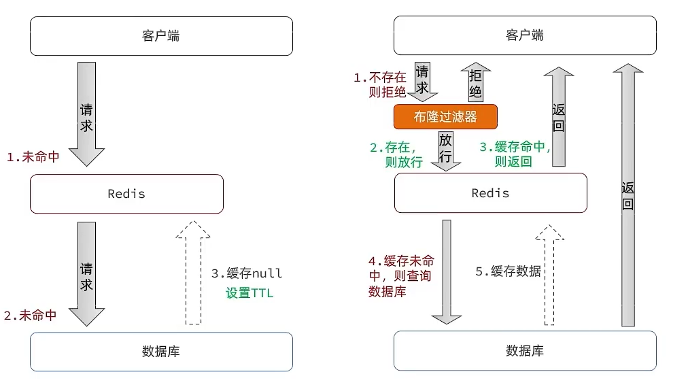
- 缓存空对象

  * 优点：实现简单，维护方便
  * 缺点：额外的内存消耗，可能造成短期的不一致
- 布隆过滤
  * 优点：内存占用较少，没有多余key
  * 缺点：实现复杂，存在误判可能

* 增强id的复杂度，避免被猜测id规律
* 做好数据的基础格式校验
* 加强用户权限校验
* 做好热点参数的限流

##### 缓存雪崩问题

- 缓存雪崩是指在同一时段大量的缓存key同时失效或者Redis服务宕机，导致大量请求到达数据库，带来巨大压力。
  - 
- 解决方案
  - 给不同的Key的TTL添加随机值
  - 利用Redis集群提高服务的可用性
  - 给缓存业务添加降级限流策略
  - 给业务添加多级缓存

##### 缓存击穿问题

- 缓存击穿问题也叫热点Key问题，就是一个被高并发访问并且缓存重建业务较复杂的key突然失效了，无数的请求访问会在瞬间给数据库带来巨大的冲击。
  
  - 

- 互斥锁

  - 

    

- 逻辑过期

  - 

  - ```java
    //新建实体类，对原来代码没有侵入性
    @Data
    public class RedisData<T> {
        private LocalDateTime expireTime;
        private T data;
    }
    ```

##### 封装Redis工具类

- 基于StringRedisTemplate封装一个缓存工具类，满足下列需求（方法一和三服务于普通数据；方法二和四服务于热点key）：

  * 方法1：将任意Java对象序列化为json并存储在string类型的key中，并且可以设置TTL过期时间
  * 方法2：将任意Java对象序列化为json并存储在string类型的key中，并且可以设置逻辑过期时间，用于处理缓存击穿问题

  * 方法3：根据指定的key查询缓存，并反序列化为指定类型，利用缓存空值的方式解决缓存穿透问题
  * 方法4：根据指定的key查询缓存，并反序列化为指定类型，需要利用逻辑过期解决缓存击穿问题

- 工具类

  - ```java
    @Slf4j
    @Component
    public class CacheClient {
    
        private final StringRedisTemplate stringRedisTemplate;
    
        private static final ExecutorService CACHE_REBUILD_EXECUTOR = Executors.newFixedThreadPool(10);
    
        public CacheClient(StringRedisTemplate stringRedisTemplate) {
            this.stringRedisTemplate = stringRedisTemplate;
        }
    	//方法一
        public void set(String key, Object value, Long time, TimeUnit unit) {
            stringRedisTemplate.opsForValue().set(key, JSONUtil.toJsonStr(value), time, unit);
        }
        
    	//方法二
        public void setWithLogicalExpire(String key, Object value, Long time, TimeUnit unit) {
            // 设置逻辑过期
            RedisData redisData = new RedisData();
            redisData.setData(value);
            redisData.setExpireTime(LocalDateTime.now().plusSeconds(unit.toSeconds(time)));
            // 写入Redis
            stringRedisTemplate.opsForValue().set(key, JSONUtil.toJsonStr(redisData));
        }
    
        //方法三
        public <R,ID> R queryWithPassThrough(
                String keyPrefix, ID id, Class<R> type, Function<ID, R> dbFallback, Long time, TimeUnit unit){
            String key = keyPrefix + id;
            // 1.从redis查询商铺缓存
            String json = stringRedisTemplate.opsForValue().get(key);
            // 2.判断是否存在
            if (StrUtil.isNotBlank(json)) {
                // 3.存在，直接返回
                return JSONUtil.toBean(json, type);
            }
            // 判断命中的是否是空值
            if (json != null) {
                // 返回一个错误信息
                return null;
            }
    
            // 4.不存在，根据id查询数据库，具体查询方法由调用者提供
            R r = dbFallback.apply(id);
            // 5.不存在，返回错误
            if (r == null) {
                // 将空值写入redis
                stringRedisTemplate.opsForValue().set(key, "", CACHE_NULL_TTL, TimeUnit.MINUTES);
                // 返回错误信息
                return null;
            }
            // 6.存在，写入redis
            this.set(key, r, time, unit);
            return r;
        }
    
        //方法四
        public <R, ID> R queryWithLogicalExpire(
                String keyPrefix, ID id, Class<R> type, Function<ID, R> dbFallback, Long time, TimeUnit unit) {
            String key = keyPrefix + id;
            // 1.从redis查询商铺缓存
            String json = stringRedisTemplate.opsForValue().get(key);
            // 2.判断是否存在
            if (StrUtil.isBlank(json)) {
                // 3.不存在，直接返回空
                return null;
            }
            // 4.命中，需要先把json反序列化为对象
            RedisData redisData = JSONUtil.toBean(json, RedisData.class);
            R r = JSONUtil.toBean((JSONObject) redisData.getData(), type);
            LocalDateTime expireTime = redisData.getExpireTime();
            // 5.判断是否过期
            if(expireTime.isAfter(LocalDateTime.now())) {
                // 5.1.未过期，直接返回店铺信息
                return r;
            }
            // 5.2.已过期，需要缓存重建
            // 6.缓存重建
            // 6.1.获取互斥锁
            String lockKey = LOCK_SHOP_KEY + id;
            boolean isLock = tryLock(lockKey);
            // 6.2.判断是否获取锁成功
            if (isLock){
                // 6.3.成功，开启独立线程，实现缓存重建
                CACHE_REBUILD_EXECUTOR.submit(() -> {
                    try {
                        // 查询数据库
                        R newR = dbFallback.apply(id);
                        // 重建缓存
                        this.setWithLogicalExpire(key, newR, time, unit);
                    } catch (Exception e) {
                        throw new RuntimeException(e);
                    }finally {
                        // 释放锁
                        unlock(lockKey);
                    }
                });
            }
            // 6.4.返回过期的商铺信息
            return r;
        }
    
        //互斥锁
        public <R, ID> R queryWithMutex(
                String keyPrefix, ID id, Class<R> type, Function<ID, R> dbFallback, Long time, TimeUnit unit) {
            String key = keyPrefix + id;
            // 1.从redis查询商铺缓存
            String shopJson = stringRedisTemplate.opsForValue().get(key);
            // 2.判断是否存在
            if (StrUtil.isNotBlank(shopJson)) {
                // 3.存在，直接返回
                return JSONUtil.toBean(shopJson, type);
            }
            // 判断命中的是否是空值
            if (shopJson != null) {
                // 返回一个错误信息
                return null;
            }
    
            // 4.实现缓存重建
            // 4.1.获取互斥锁
            String lockKey = LOCK_SHOP_KEY + id;
            R r = null;
            try {
                boolean isLock = tryLock(lockKey);
                // 4.2.判断是否获取成功
                if (!isLock) {
                    // 4.3.获取锁失败，休眠并重试
                    Thread.sleep(50);
                    return queryWithMutex(keyPrefix, id, type, dbFallback, time, unit);
                }
                // 4.4.获取锁成功，根据id查询数据库
                r = dbFallback.apply(id);
                // 5.不存在，返回错误
                if (r == null) {
                    // 将空值写入redis
                    stringRedisTemplate.opsForValue().set(key, "", CACHE_NULL_TTL, TimeUnit.MINUTES);
                    // 返回错误信息
                    return null;
                }
                // 6.存在，写入redis
                this.set(key, r, time, unit);
            } catch (InterruptedException e) {
                throw new RuntimeException(e);
            }finally {
                // 7.释放锁
                unlock(lockKey);
            }
            // 8.返回
            return r;
        }
    
        private boolean tryLock(String key) {
            Boolean flag = stringRedisTemplate.opsForValue().setIfAbsent(key, "1", 10, TimeUnit.SECONDS);
            return BooleanUtil.isTrue(flag);
        }
    
        private void unlock(String key) {
            stringRedisTemplate.delete(key);
        }
    }
    ```

- 业务层

  - ```java
    @Resource
    private CacheClient cacheClient;
    
     @Override
        public Result queryById(Long id) {
            // 解决缓存穿透
            Shop shop = cacheClient.queryWithPassThrough(CACHE_SHOP_KEY, id, Shop.class, this::getById, CACHE_SHOP_TTL, TimeUnit.MINUTES);
    
            if (shop == null) {
                return Result.fail("店铺不存在！");
            }
            return Result.ok(shop);
        }
    ```

#### 分布式锁（优惠券秒杀）

##### 全局ID生成器

- 订单表使用自增ID的问题
  - id的规律性太明显，容易产生安全问题
  - 数据量越来越大时会受到单表数据量的限制

- 
  - 符号位：1bit，永远为0
  - 时间戳：31bit，以秒为单位，可以使用69年
  - 序列号：32bit，秒内的计数器，支持每秒产生2^32个不同ID

- ```java
  @Component
  public class RedisIdWorker {
      /**
       * 开始时间戳
       */
      private static final long BEGIN_TIMESTAMP = 1640995200L;
      /**
       * 序列号的位数
       */
      private static final int COUNT_BITS = 32;
  
      private StringRedisTemplate stringRedisTemplate;
  
      public RedisIdWorker(StringRedisTemplate stringRedisTemplate) {
          this.stringRedisTemplate = stringRedisTemplate;
      }
  
      public long nextId(String keyPrefix) {
          // 1.生成时间戳
          LocalDateTime now = LocalDateTime.now();
          long nowSecond = now.toEpochSecond(ZoneOffset.UTC);
          long timestamp = nowSecond - BEGIN_TIMESTAMP;
  
          // 2.生成序列号
          // 2.1.获取当前日期，精确到天
          String date = now.format(DateTimeFormatter.ofPattern("yyyy:MM:dd"));
          // 2.2.自增长，在缓存中每天使用不同的key防止ID溢出
          long count = stringRedisTemplate.opsForValue().increment("icr:" + keyPrefix + ":" + date);
  
          // 3.拼接并返回
          return timestamp << COUNT_BITS | count;
      }
  }
  ```

##### 乐观锁解决超卖问题

- 我们先查询数据库中优惠券的数量是否充足，再执行修改操作，当许多线程共同访问数据库时，由于数据库操作耗时较长，会出现明明优惠券已经不足但是仍查询到有余量的情况，出现超卖现象

- 悲观锁

  - 认为线程安全问题一定会发生，数据库操作强制一次只让一个线程执行

- 乐观锁

  - 认为线程安全问题不一定会发生，允许多线程执行数据库修改操作，但是增加修改条件使不符合条件的线程操作失败

  - ```java
    boolean success = seckillVoucherService.update()
                .setSql("stock= stock -1")
                .eq("voucher_id", voucherId).update().gt("stock",0); //where id = ? and stock > 0
    ```

##### 悲观锁解决一人一券问题

- 限制一人一券我们不能在线程进入数据库操作时再作判断，只能使用悲观锁。我们在使用悲观锁时，需要特别关注锁粒度，如果我们把锁直接加在方法上，则所有用户的线程争抢同一把锁，其性能极低，而我们把锁加在同一个用户的线程，则每一个用户的不同线程争抢一把锁，互不影响并行，性能大大提升

- ```java
  @Transactional
  public  Result createVoucherOrder(Long voucherId) {
  	Long userId = UserHolder.getUser().getId();
  	synchronized(userId.toString().intern()){
           // 5.1.查询订单
          int count = query().eq("user_id", userId).eq("voucher_id", voucherId).count();
          // 5.2.判断是否存在
          if (count > 0) {
              // 用户已经购买过了
              return Result.fail("用户已经购买过一次！");
          }
  
          // 6.扣减库存
          boolean success = seckillVoucherService.update()
                  .setSql("stock = stock - 1") // set stock = stock - 1
                  .eq("voucher_id", voucherId).gt("stock", 0) // where id = ? and stock > 0
                  .update();
          if (!success) {
              // 扣减失败
              return Result.fail("库存不足！");
          }
  
          // 7.创建订单
          VoucherOrder voucherOrder = new VoucherOrder();
          // 7.1.订单id
          long orderId = redisIdWorker.nextId("order");
          voucherOrder.setId(orderId);
          // 7.2.用户id
          voucherOrder.setUserId(userId);
          // 7.3.代金券id
          voucherOrder.setVoucherId(voucherId);
          save(voucherOrder);
  
          // 7.返回订单id
          return Result.ok(orderId);
      }
  }
  ```

##### 分布式锁解决集群问题

- Tomcat集群下悲观锁失效分析
  - 不同的Tomcat服务器对应有各自的JVM，它们的线程监视器各不相同，当线程访问不同的Tomcat服务器时，Tomcat只能监视自身的线程，无法监视其他Tomcat的线程，悲观锁失效。而乐观锁是数据库层的逻辑判断，与JVM无关，乐观锁不会失效。

- 分布式锁实现原理

  - 我们利用redis 的setNx 方法，当有多个线程进入时，第一个线程进入时，redis 中这个key就被创造了，返回了1，如果结果是1，则表示抢到了锁，可以执行业务，业务完成后再删除锁，没有抢到锁的线程，无法执行业务代码，也可以等待一定时间后重试。我们还可以设置锁的超时时间，防止业务出现错误长时间阻塞。

- 锁误删问题解决

  - 逻辑分析

    - 持有锁的线程在锁的内部出现了阻塞，导致他的锁超时自动释放，这时其他线程，线程2来尝试获得锁，就拿到了这把锁，然后线程2在持有锁执行过程中，线程1反应过来，继续执行，而线程1执行过程中，走到了删除锁逻辑，此时就会把本应该属于线程2的锁进行删除，这就是误删锁。

  - 解决方案

    - 在获取锁时存入线程标示，在释放锁时先获取锁中的线程标示，判断是否与当前线程标示一致如果一致则释放锁，如果不一致则不释放锁。

    - 获取锁

      - ```java
        //UUID区分不同服务器
        private static final String ID_PREFIX = UUID.randomUUID().toString(true) + "-";
        @Override
        public boolean tryLock(long timeoutSec) {
           // 获取线程标示，区分同一服务器的不同线程
           String threadId = ID_PREFIX + Thread.currentThread().getId();
           // 获取锁
           Boolean success = stringRedisTemplate.opsForValue()
                        .setIfAbsent(KEY_PREFIX + name, threadId, timeoutSec, TimeUnit.SECONDS);
           return Boolean.TRUE.equals(success);
        }
        ```

    - 释放锁

      - ```java
        public void unlock() {
            // 获取线程标示
            String threadId = ID_PREFIX + Thread.currentThread().getId();
            // 获取锁中的标示
            String id = stringRedisTemplate.opsForValue().get(KEY_PREFIX + name);
            // 判断标示是否一致
            if(threadId.equals(id)) {
                // 释放锁
                stringRedisTemplate.delete(KEY_PREFIX + name);
            }
        }
        ```

- 多条命令原子性问题解决

  - 更为极端的锁误删问题

    - 线程1现在持有锁之后，在执行业务逻辑过程中，他正准备删除锁，而且已经走到了条件判断的过程中，当前这把锁确实是属于他自己的，正准备删除锁时代码阻塞，锁超时释放，此时线程2获取锁，线程1接着往后执行，直接删除锁。所以无论如何，我们要保证拿锁比锁删锁是一个原子性动作，也就是说拿锁比锁删锁作为一行java代码执行。Lua脚本可以帮助我们解决这个问题，因为即使我们在Lua中写很多行代码，在java中调用Lua脚本时是作为一行java代码出现的。

  - 编写Lua脚本

    - 

    - ```Lua
      -- 这里的 KEYS[1] 就是锁的key，这里的ARGV[1] 就是当前线程标示，由java传入
      -- 获取锁中的标示，判断是否与当前线程标示一致
      if (redis.call('GET', KEYS[1]) == ARGV[1]) then
        -- 一致，则删除锁
        return redis.call('DEL', KEYS[1])
      end
      -- 不一致，则直接返回
      return 0
      ```

  - java代码调用Lua脚本

    - ```java
      //配置Lua脚本
      private static final DefaultRedisScript<Long> UNLOCK_SCRIPT;
          static {
              UNLOCK_SCRIPT = new DefaultRedisScript<>();
              //文件路径
              UNLOCK_SCRIPT.setLocation(new ClassPathResource("unlock.lua"));
              //返回值类型
              UNLOCK_SCRIPT.setResultType(Long.class);
          }
      
      public void unlock() {
          // 调用lua脚本
          stringRedisTemplate.execute(
                  UNLOCK_SCRIPT,//脚本
                  Collections.singletonList(KEY_PREFIX + name),//KEYS集合
                  ID_PREFIX + Thread.currentThread().getId());//ARGV可变参数
      }
      ```

- 可重入锁实现原理

  - 重入问题
    - 重入问题是指 获得锁的线程可以再次进入到相同的锁的代码块或方法中，可重入锁的意义在于防止死锁，假如在一个方法内，调用另一个方法，那么此时如果是不可重入的，这个方法获取不到锁，就会死锁了。
  - 解决方案
    - 

- 锁重试实现原理

  - 采用while true加上订阅机制实现锁重试，每个线程释放锁时，都会发布一条消息，线程没抢到锁时，不是立刻开始下一轮抢锁，而是先订阅消息，等待索德释放，这样能很大程度减轻CPU的压力

- 看门狗机制原理

  - 我们在加锁时增加了过期时间，这样的我们可以防止死锁，但是如果卡顿的时间超长，虽然我们采用了lua表达式防止误删，但是毕竟没有锁住，有安全隐患。
  - 每隔十秒就会刷新锁的过期时间为30秒

- MultiLock原理

  - 主从一致性问题
    -  如果Redis提供了主从集群，当我们向集群写数据时，主机需要异步的将数据同步给从机，而万一在同步过去之前，主机宕机了，一台从机被选为主机，但是这台新的主机中没有锁信息，锁丢失，就会出现死锁问题。
    - 
  - 解决方案
    - redission提出了MutiLock锁，使用这把锁就能不使用主从了，每个节点的地位都是一样的， 这把锁加锁的逻辑需要写入到每一个主丛节点上，只有所有的服务器都写入成功，此时才是加锁成功，假设现在某个节点挂了，那么他去获得锁的时候，只要有一个节点拿不到，都不能算是加锁成功，就保证了加锁的可靠性。
    - 

- Ression使用步骤

  - 引入依赖

    - ```xml
      <dependency>
      	<groupId>org.redisson</groupId>
      	<artifactId>redisson</artifactId>
      	<version>3.13.6</version>
      </dependency>
      ```

  - 配置

    - ```java
      @Configuration
      public class RedissonConfig {
      
          @Bean
          public RedissonClient redissonClient(){
              // 配置（可配置多台）
              Config config = new Config();
              config.useSingleServer().setAddress("redis://192.168.150.101:6379")
                  .setPassword("123321");
              // 创建RedissonClient对象
              return Redisson.create(config);
          }
      }
      ```

  - 使用

    - ```java
      @Resource
      private RedissionClient redissonClient;
      
      @Test
      void testRedisson() throws Exception{
          //获取锁(可重入)，指定锁的名称
          RLock lock = redissonClient.getLock("lock:order:" + userId);
          //尝试获取锁，参数分别是：获取锁的最大等待时间(期间会重试)，锁自动释放时间，时间单位
          boolean isLock = lock.tryLock(1,10,TimeUnit.SECONDS);
          //判断获取锁成功
          if(isLock){
              try{
                  System.out.println("执行业务");          
              }finally{
                  //释放锁
                  lock.unlock();
              }
          }       
      }
      ```

- Redisson原理总结
  - 

#### 消息队列（优化秒杀）

##### 异步思路

- 获取锁资格的判断往往是在Redis当中，执行流程十分迅速，后续的逻辑往往要操作数据库，执行流程十分缓慢。就好比一家餐厅让点单的服务员同时去炒菜，那么他在炒菜漫长的时间内1无法接待下一个客人；但是如果我们雇佣多一个厨师，将它们的业务分离，先让客人点单，即使炒菜的过程再慢也无所谓，不影响接待下一波客人，等菜按顺序炒好再呈上来就行了。在业务中，我们就可以将锁操作封装成Lua脚本，再将数据库业务逻辑加入消息队列等待执行。

- 

- 

##### Stream消息队列

- 

- Stream 是 Redis 5.0 引入的一种新数据类型，可以实现一个功能非常完善的消息队列。（消息可回溯；可以多消费者争抢消息，加快消费速度；可以阻塞读取；没有消息漏读的风险；有消息确认机制，保证消息至少被消费一次）

  - 发送消息
    - 

  - 读取消息（如果我们处理一条消息的过程中，又有超过1条以上的消息到达队列，则下次获取时也只能获取到最新的一条，会出现漏读消息的问题）
    - 

##### 消费者组解决漏读问题

- 

- | 命令                                                         | 描述                                                         |
  | ------------------------------------------------------------ | ------------------------------------------------------------ |
  | XGROUP CREATE key groupName ID [MKSTREAM]                    | 创建消费者组<br/>key：队列名称<br/>groupName：消费者组名称<br/>ID：起始ID标示，$代表队列中最后一个消息，0则代表队列中第一个消息<br/>MKSTREAM：队列不存在时自动创建队列（默认） |
  | XGROUP DESTORY key groupName                                 | 删除指定的消费者组                                           |
  | XGROUP CREATECONSUMER key groupname consumername             | 给指定的消费者组添加消费者                                   |
  | XGROUP DELCONSUMER key groupname consumername                | 删除消费者组中的指定消费者                                   |
  | XREADGROUP GROUP group consumer [COUNT count] [BLOCK milliseconds] [NOACK] STREAMS key [key ...] ID [ID ...] | 从消费者组读取消息<br/>group：消费组名称<br/> consumer：消费者名称，如果消费者不存在，会自动创建一个消费者 <br/>count：本次查询的最大数量 BLOCK milliseconds：当没有消息时最长等待时间<br/>NOACK：无需手动ACK，获取到消息后自动确认 STREAMS key：指定队列名称 <br/>ID：获取消息的起始ID（">"表示从下一个未消费的消息开始。其它则根据指定id从pending-list中获取已消费但未确认的消息，例如0，是从pending-list中的第一个消息开始） |

##### 业务代码

- Lua脚本

  - ```lua
    -- 1.参数列表
    -- 1.1.优惠券id
    local voucherId = ARGV[1]
    -- 1.2.用户id
    local userId = ARGV[2]
    -- 1.3.订单id
    local orderId = ARGV[3]
    
    -- 2.数据key
    -- 2.1.库存key
    local stockKey = 'seckill:stock:' .. voucherId
    -- 2.2.订单key
    local orderKey = 'seckill:order:' .. voucherId
    
    -- 3.脚本业务，可以保证原子性，不需再加锁
    -- 3.1.判断库存是否充足 get stockKey
    if(tonumber(redis.call('get', stockKey)) <= 0) then
        -- 3.2.库存不足，返回1
        return 1
    end
    -- 3.2.判断用户是否下单 SISMEMBER orderKey userId
    if(redis.call('sismember', orderKey, userId) == 1) then
        -- 3.3.存在，说明是重复下单，返回2
        return 2
    end
    -- 3.4.扣库存 incrby stockKey -1
    redis.call('incrby', stockKey, -1)
    -- 3.5.下单（保存用户）sadd orderKey userId
    redis.call('sadd', orderKey, userId)
    -- 3.6.发送消息到队列中，整体作为一个Bean XADD stream.orders * k1 v1 k2 v2 ...
    redis.call('xadd', 'stream.orders', '*', 'userId', userId, 'voucherId', voucherId, 'id', orderId)
    return 0
    ```

- VoucherOrderServiceImpl

  - ```java
    //注册Lua脚本
        static {
                SECKILL_SCRIPT = new DefaultRedisScript<>();
                SECKILL_SCRIPT.setLocation(new ClassPathResource("seckill.lua"));
                SECKILL_SCRIPT.setResultType(Long.class);
            }
    
    //创建线程池
        private static final ExecutorService SECKILL_ORDER_EXECUTOR = Executors.newSingleThreadExecutor();
    
    //在Bean创造且成员变量注入后执行
        @PostConstruct
        private void init() {
            //开启线程执行run方法不断监听消息队列
            SECKILL_ORDER_EXECUTOR.submit(new VoucherOrderHandler());
        }
        private class VoucherOrderHandler implements Runnable {
    
            @Override
            public void run() {
                while (true) {
                    try {
                        // 1.获取消息队列中的订单信息 XREADGROUP GROUP g1 c1 COUNT 1 BLOCK 2000 STREAMS s1 >
                        List<MapRecord<String, Object, Object>> list = stringRedisTemplate.opsForStream().read(
                            Consumer.from("g1", "c1"),
                            StreamReadOptions.empty().count(1).block(Duration.ofSeconds(2)),
                            StreamOffset.create("stream.orders", ReadOffset.lastConsumed())
                        );
                        // 2.判断订单信息是否为空
                        if (list == null || list.isEmpty()) {
                            // 如果为null，说明没有消息，继续下一次循环
                            continue;
                        }
                        // 解析数据，record的value就是消息队列中的Bean，Id是在消息队列中的编号
                        MapRecord<String, Object, Object> record = list.get(0);
                        Map<Object, Object> value = record.getValue();
                        VoucherOrder voucherOrder = BeanUtil.fillBeanWithMap(value, new VoucherOrder(), true);
                        // 3.创建订单
                        createVoucherOrder(voucherOrder);
                        // 4.确认消息 XACK
                        stringRedisTemplate.opsForStream().acknowledge("s1", "g1", record.getId());
                    } catch (Exception e) {
                        log.error("处理订单异常", e);
                        //处理异常消息
                        handlePendingList();
                    }
                }
            }
    
            private void handlePendingList() {
                while (true) {
                    try {
                        // 1.获取pending-list中的订单信息 XREADGROUP GROUP g1 c1 COUNT 1 BLOCK 2000 STREAMS s1 0
                        List<MapRecord<String, Object, Object>> list = stringRedisTemplate.opsForStream().read(
                            Consumer.from("g1", "c1"),
                            StreamReadOptions.empty().count(1),
                            StreamOffset.create("stream.orders", ReadOffset.from("0"))
                        );
                        // 2.判断订单信息是否为空
                        if (list == null || list.isEmpty()) {
                            // 如果为null，说明没有异常消息，结束循环
                            break;
                        }
                        // 解析数据
                        MapRecord<String, Object, Object> record = list.get(0);
                        Map<Object, Object> value = record.getValue();
                        VoucherOrder voucherOrder = BeanUtil.fillBeanWithMap(value, new VoucherOrder(), true);
                        // 3.创建订单
                        createVoucherOrder(voucherOrder);
                        // 4.确认消息 XACK
                        stringRedisTemplate.opsForStream().acknowledge("s1", "g1", record.getId());
                    } catch (Exception e) {
                        log.error("处理pendding订单异常", e);
                        try{
                            Thread.sleep(20);
                        }catch(Exception e){
                            e.printStackTrace();
                        }
                    }
                }
            }
        }
        @Override
        public Result seckillVoucher(Long voucherId) {
            //获取用户
            Long userId = UserHolder.getUser().getId();
            long orderId = redisIdWorker.nextId("order");
            // 1.执行lua脚本
            Long result = stringRedisTemplate.execute(
                    SECKILL_SCRIPT,
                    Collections.emptyList(),
                    voucherId.toString(), userId.toString(), String.valueOf(orderId)
            );
            int r = result.intValue();
            // 2.判断结果是否为0
            if (r != 0) {
                // 2.1.不为0 ，代表没有购买资格
                return Result.fail(r == 1 ? "库存不足" : "不能重复下单");
            }
            // 3.返回订单id，订单创建异步处理
            return Result.ok(orderId);
        }
    
    	private void createVoucherOrder(VoucherOrder voucherOrder) {
            Long userId = voucherOrder.getUserId();
            Long voucherId = voucherOrder.getVoucherId();
            // 创建锁对象，前面已经经过Lua脚本判断，这里理论上可以不加锁了
            RLock redisLock = redissonClient.getLock("lock:order:" + userId);
            // 尝试获取锁
            boolean isLock = redisLock.tryLock();
            // 判断
            if (!isLock) {
                // 获取锁失败，直接返回失败或者重试
                log.error("不允许重复下单！");
                return;
            }
    
            try {
                // 5.1.查询订单
                int count = query().eq("user_id", userId).eq("voucher_id", voucherId).count();
                // 5.2.判断是否存在
                if (count > 0) {
                    // 用户已经购买过了
                    log.error("不允许重复下单！");
                    return;
                }
    
                // 6.扣减库存
                boolean success = seckillVoucherService.update()
                        .setSql("stock = stock - 1") // set stock = stock - 1
                        .eq("voucher_id", voucherId).gt("stock", 0) // where id = ? and stock > 0
                        .update();
                if (!success) {
                    // 扣减失败
                    log.error("库存不足！");
                    return;
                }
    
                // 7.创建订单
                save(voucherOrder);
            } finally {
                // 释放锁
                redisLock.unlock();
            }
        }
    ```

#### SortedSet应用（点赞排行）

- 技术选型

  - 
  - 点赞功能一般根据时间先后顺序排行，且一个用户只能点赞一次，不能重复。适合使用SortedSet，数据不能重复的同时，插入时间戳作为score排序。

- 代码实现

  - 在Blog 添加一个字段

    - ```java
      @TableField(exist = false)
      private Boolean isLike;
      ```

  - BlogServiceImpl

    - ```java
       	@Override
          public Result likeBlog(Long id) {
              // 1.获取登录用户
              Long userId = UserHolder.getUser().getId();
              // 2.判断当前登录用户是否已经点赞，获取分数，如果有分数的话x
              String key = BLOG_LIKED_KEY + id;
              Double score = stringRedisTemplate.opsForZSet().score(key, userId.toString());
              if (score == null) {
                  // 3.如果未点赞，可以点赞
                  // 3.1.数据库点赞数 + 1
                  boolean isSuccess = update().setSql("liked = liked + 1").eq("id", id).update();
                  // 3.2.保存用户到Redis的set集合  zadd key value score
                  if (isSuccess) {
                      stringRedisTemplate.opsForZSet().add(key, userId.toString(), System.currentTimeMillis());
                  }
              } else {
                  // 4.如果已点赞，取消点赞
                  // 4.1.数据库点赞数 -1
                  boolean isSuccess = update().setSql("liked = liked - 1").eq("id", id).update();
                  // 4.2.把用户从Redis的set集合移除
                  if (isSuccess) {
                      stringRedisTemplate.opsForZSet().remove(key, userId.toString());
                  }
              }
              return Result.ok();
          }
       	 @Override
         public Result queryBlogLikes(Long id) {
             String key = BLOG_LIKED_KEY + id;
             // 1.查询top5的点赞用户 zrange key 0 4
             Set<String> top5 = stringRedisTemplate.opsForZSet().range(key, 0, 4);
             if (top5 == null || top5.isEmpty()) {
                 return Result.ok(Collections.emptyList());
             }
             // 2.解析出其中的用户id
             List<Long> ids = top5.stream().map(Long::valueOf).collect(Collectors.toList());
             String idStr = StrUtil.join(",", ids);
             // 3.根据用户id查询用户 WHERE id IN ( 5 , 1 ) ORDER BY FIELD(id, 5, 1)使用in筛选时查询并不会按照所给
             List<UserDTO> userDTOS = userService.query()
                     .in("id", ids).last("ORDER BY FIELD(id," + idStr + ")").list()
                     .stream()
                     .map(user -> BeanUtil.copyProperties(user, UserDTO.class))
                     .collect(Collectors.toList());
             // 4.返回
             return Result.ok(userDTOS);
         }
    


#### Set应用（共同关注）

- 技术选型

  - 在set集合中，有交集并集补集的api，我们可以把两人的关注的人分别放入到一个set集合中，然后再通过api去查看这两个set集合中的交集数据。

- 代码实现

  - ```java
    @Override
    public Result follow(Long followUserId, Boolean isFollow) {
        // 1.获取登录用户
        Long userId = UserHolder.getUser().getId();
        String key = "follows:" + userId;
        // 1.判断到底是关注还是取关
        if (isFollow) {
            // 2.关注，新增数据
            Follow follow = new Follow();
            follow.setUserId(userId);
            follow.setFollowUserId(followUserId);
            boolean isSuccess = save(follow);
            if (isSuccess) {
                // 把关注用户的id，放入redis的set集合 sadd userId followerUserId
                stringRedisTemplate.opsForSet().add(key, followUserId.toString());
            }
        } else {
            // 3.取关，删除 delete from tb_follow where user_id = ? and follow_user_id = ?
            boolean isSuccess = remove(new QueryWrapper<Follow>()
                    .eq("user_id", userId).eq("follow_user_id", followUserId));
            if (isSuccess) {
                // 把关注用户的id从Redis集合中移除
                stringRedisTemplate.opsForSet().remove(key, followUserId.toString());
            }
        }
        return Result.ok();
    }
    ```

  - ```java
    @Override
    public Result followCommons(Long id) {
        // 1.获取当前用户
        Long userId = UserHolder.getUser().getId();
        String key = "follows:" + userId;
        // 2.求交集
        String key2 = "follows:" + id;
        Set<String> intersect = stringRedisTemplate.opsForSet().intersect(key, key2);
        if (intersect == null || intersect.isEmpty()) {
            // 无交集
            return Result.ok(Collections.emptyList());
        }
        // 3.解析id集合
        List<Long> ids = intersect.stream().map(Long::valueOf).collect(Collectors.toList());
        // 4.查询用户
        List<UserDTO> users = userService.listByIds(ids)
                .stream()
                .map(user -> BeanUtil.copyProperties(user, UserDTO.class))
                .collect(Collectors.toList());
        return Result.ok(users);
    }
    ```

#### Feed流（消息推送）

##### 推送模式

- 

- 拉模式

  - 给被关注者分配内存空间，被关注者发送推送到内存空间，不给关注者分配内存空间，当其要查看收件箱时动态拉取推送

- 推模式

  - 不给被关注者分配内存空间，给关注者分配内存空间，当关注者发布推送时直接发送到关注者的内存空间。

- 推拉结合模式

  - 

  - 推拉模式是一个折中的方案，站在发件人的角度来看，如果是个粉丝量不多的普通用户，那么采用推模式，直接把数据写入到他的粉丝收件箱中去，因为普通的人他的粉丝量比较小，所以这样做没有压力；如果是大V，那么他是直接将数据先写入到一份到发件箱里边去，然后再采用推模式直接写一份到活跃粉丝收件箱里边去，对于僵尸粉等其查看收件箱再自动拉取。站在收件人的角度来看，如果是活跃粉丝，那么大V和普通的人发的都会直接写入到自己收件箱里边来，而如果是普通的粉丝，由于他们上线不是很频繁，所以等他们上线时，再从发件箱里边去拉信息。

##### 业务实现

- 技术选型

  - 传统分页模式
    - 传统的分页模式在feed流是不适用的，可能会读到重复的数据
    - 
  - 滚动分页模式
    - 我们需要记录上一次操作的最后一条，然后从这个位置开始去读取数据。可以采用sortedSet对时间戳进行范围查询，并且还可以记录当前获取数据时间戳最小值，作为下一次查询的最大边界并设定偏移量，跳过时间戳相同的数据，就可以实现滚动分页了。
    - 

- 代码实现

  - 返回值实体类

    - ```java
      @Data
      public class ScrollResult {
          private List<?> list;
          private Long minTime;
          private Integer offset;
      }
      ```

  - BlogServiceImpl

    - ```java
      @Override
      public Result queryBlogOfFollow(Long max, Integer offset) {
          // 1.获取当前用户
          Long userId = UserHolder.getUser().getId();
          // 2.查询收件箱 ZREVRANGEBYSCORE key Max Min LIMIT offset count
          String key = FEED_KEY + userId;
          Set<ZSetOperations.TypedTuple<String>> typedTuples = stringRedisTemplate.opsForZSet()
              .reverseRangeByScoreWithScores(key, 0, max, offset, 2);
          // 3.非空判断
          if (typedTuples == null || typedTuples.isEmpty()) {
              return Result.ok();
          }
          // 4.解析数据：blogId、minTime（时间戳）、offset（每次查询偏移最大值的量）
          List<Long> ids = new ArrayList<>(typedTuples.size());
          long minTime = 0; // 2
          int os = 1; // 2
          for (ZSetOperations.TypedTuple<String> tuple : typedTuples) { // 5 4 4 2 2
              // 4.1.获取id
              ids.add(Long.valueOf(tuple.getValue()));
              // 4.2.获取分数(时间戳）
              long time = tuple.getScore().longValue();
              if(time == minTime){
                  os++;
              }else{
                  minTime = time;
                  os = 1;
              }
          }
      	os = minTime == max ? os : os + offset;
          // 5.根据id查询blog
          String idStr = StrUtil.join(",", ids);
          List<Blog> blogs = query().in("id", ids).last("ORDER BY FIELD(id," + idStr + ")").list();
      
          for (Blog blog : blogs) {
              // 5.1.查询blog有关的用户
              queryBlogUser(blog);
              // 5.2.查询blog是否被点赞
              isBlogLiked(blog);
          }
      
          // 6.封装并返回
          ScrollResult r = new ScrollResult();
          r.setList(blogs);
          r.setOffset(os);
          r.setMinTime(minTime);
      
          return Result.ok(r);
      }
      ```

#### GEO应用（附近商户）

- 技术选型

  - GEO是存储地理坐标信息的一种数据结构（底层就是SortedSet），帮助我们根据经纬度来检索数据。

  - | 命令                    | 描述                                                         |
    | ----------------------- | ------------------------------------------------------------ |
    | GEOADD x y member       | 添加一个地理空间信息，包含：经度（longitude）、纬度（latitude）、值（member） |
    | GEODIST member1 member2 | 计算指定的两个点之间的距离并返回                             |
    | GEOHASH member          | 将指定member的坐标转为hash字符串形式并返回                   |
    | GEOPOS member           | 返回指定member的坐标                                         |
    | GEOSEARCH               | 在指定范围内搜索member，并按照与指定点之间的距离排序后返回。范围可以是圆形或矩形 |
    | GEOSEARCHSTORE          | 与GEOSEARCH功能一致，不过可以把结果存储到一个指定的key       |

- 代码实现

  - HmDianPingApplicationTests（按照商户类型做分组，类型相同的商户作为同一组，以typeId为key存入同一个GEO集合中）

    - ```java
      @Test
      void loadShopData() {
          // 1.查询店铺信息
          List<Shop> list = shopService.list();
          // 2.把店铺分组，按照typeId分组，typeId一致的放到一个集合
          Map<Long, List<Shop>> map = list.stream().collect(Collectors.groupingBy(Shop::getTypeId));
          // 3.分批完成写入Redis
          for (Map.Entry<Long, List<Shop>> entry : map.entrySet()) {
              // 3.1.获取类型id
              Long typeId = entry.getKey();
              String key = SHOP_GEO_KEY + typeId;
              // 3.2.获取同类型的店铺的集合
              List<Shop> value = entry.getValue();
              List<RedisGeoCommands.GeoLocation<String>> locations = new ArrayList<>(value.size());
              // 3.3.写入redis GEOADD key 经度 纬度 member
              for (Shop shop : value) {
                  // stringRedisTemplate.opsForGeo().add(key, new Point(shop.getX(), shop.getY()), shop.getId().toString());
                  locations.add(new RedisGeoCommands.GeoLocation<>(
                          shop.getId().toString(),
                          new Point(shop.getX(), shop.getY())
                  ));
              }
              stringRedisTemplate.opsForGeo().add(key, locations);
          }
      }
      ```

  - ShopServiceImpl

    - ```java
      @Override
          public Result queryShopByType(Integer typeId, Integer current, Double x, Double y) {
              // 1.判断是否需要根据坐标查询
              if (x == null || y == null) {
                  // 不需要坐标查询，按数据库查询
                  Page<Shop> page = query()
                          .eq("type_id", typeId)
                          .page(new Page<>(current, SystemConstants.DEFAULT_PAGE_SIZE));
                  // 返回数据
                  return Result.ok(page.getRecords());
              }
      
              // 2.计算分页参数
              int from = (current - 1) * SystemConstants.DEFAULT_PAGE_SIZE;
              int end = current * SystemConstants.DEFAULT_PAGE_SIZE;
      
              // 3.查询redis、按照距离排序、分页。结果：shopId、distance
              String key = SHOP_GEO_KEY + typeId;
              GeoResults<RedisGeoCommands.GeoLocation<String>> results = stringRedisTemplate.opsForGeo() // GEOSEARCH key BYLONLAT x y BYRADIUS 10 WITHDISTANCE
                      .search(
                              key,
                              GeoReference.fromCoordinate(x, y),
                              new Distance(5000),
                              RedisGeoCommands.GeoSearchCommandArgs.newGeoSearchArgs().includeDistance().limit(end)
                      );
              // 4.解析出id
              if (results == null) {
                  return Result.ok(Collections.emptyList());
              }
              List<GeoResult<RedisGeoCommands.GeoLocation<String>>> list = results.getContent();
              if (list.size() <= from) {
                  // 没有下一页了，结束
                  return Result.ok(Collections.emptyList());
              }
              // 4.1.截取 from ~ end的部分
              List<Long> ids = new ArrayList<>(list.size());
              Map<String, Distance> distanceMap = new HashMap<>(list.size());
              list.stream().skip(from).forEach(result -> {
                  // 4.2.获取店铺id
                  String shopIdStr = result.getContent().getName();
                  ids.add(Long.valueOf(shopIdStr));
                  // 4.3.获取距离
                  Distance distance = result.getDistance();
                  distanceMap.put(shopIdStr, distance);
              });
              // 5.根据id查询Shop
              String idStr = StrUtil.join(",", ids);
              List<Shop> shops = query().in("id", ids).last("ORDER BY FIELD(id," + idStr + ")").list();
              for (Shop shop : shops) {
                  shop.setDistance(distanceMap.get(shop.getId().toString()).getValue());
              }
              // 6.返回
              return Result.ok(shops);
          }
      ```

#### BitMap应用（用户签到）

- 技术选型

  - 针对签到功能完全可以使用数据库实现，设计一张能储存用户信息，签到日期的表，但是这样日复一日数据量是十分庞大的。

  - BitMap（位图）是一种专门用于储存位信息的数据结构，底层是String数据结构，因此最大上限是512M，转换为bit则是2^32个1bit位，能极大压缩非黑即白的数据占用空间

  - | 命令                           | 描述                                                         |
    | ------------------------------ | ------------------------------------------------------------ |
    | SETBIT key offset value        | 向指定位置（offset）存入一个0或1                             |
    | GETBIT key offset              | 获取指定位置（offset）的bit值，offset前指定有符号（i）或无符号（u） |
    | BITCOUNT key                   | 统计BitMap中值为1的bit位的数量                               |
    | BITFIELD key get offset borden | 批量查询指定位置（offset）的值                               |
    | BITPOS key 0\|1 start end      | 查找bit数组中指定范围内第一个0或1出现的位置                  |

- 实现代码

  - 签到

    - ```java
      @Override
      public Result sign() {
          // 1.获取当前登录用户
          Long userId = UserHolder.getUser().getId();
          // 2.获取日期
          LocalDateTime now = LocalDateTime.now();
          // 3.拼接key
          String keySuffix = now.format(DateTimeFormatter.ofPattern(":yyyyMM"));
          String key = USER_SIGN_KEY + userId + keySuffix;
          // 4.获取今天是本月的第几天
          int dayOfMonth = now.getDayOfMonth();
          // 5.写入Redis SETBIT key offset 1
          stringRedisTemplate.opsForValue().setBit(key, dayOfMonth - 1, true);
          return Result.ok();
      }
      ```

  - 签到统计

    - ```java
      @Override
      public Result signCount() {
          // 1.获取当前登录用户
          Long userId = UserHolder.getUser().getId();
          // 2.获取日期
          LocalDateTime now = LocalDateTime.now();
          // 3.拼接key
          String keySuffix = now.format(DateTimeFormatter.ofPattern(":yyyyMM"));
          String key = USER_SIGN_KEY + userId + keySuffix;
          // 4.获取今天是本月的第几天
          int dayOfMonth = now.getDayOfMonth();
          // 5.获取本月截止今天为止的所有的签到记录，返回的是一个十进制的数字 BITFIELD sign:5:202203 GET u14 0
          List<Long> result = stringRedisTemplate.opsForValue().bitField(
                  key,
                  BitFieldSubCommands.create()
                          .get(BitFieldSubCommands.BitFieldType.unsigned(dayOfMonth)).valueAt(0)
          );
          if (result == null || result.isEmpty()) {
              // 没有任何签到结果
              return Result.ok(0);
          }
          Long num = result.get(0);
          if (num == null || num == 0) {
              return Result.ok(0);
          }
          // 6.循环遍历
          int count = 0;
          while (true) {
              // 6.1.让这个数字与1做与运算，得到数字的最后一个bit位  // 判断这个bit位是否为0
              if ((num & 1) == 0) {
                  // 如果为0，说明未签到，结束
                  break;
              }else {
                  // 如果不为0，说明已签到，计数器+1
                  count++;
              }
              // 把数字右移一位，抛弃最后一个bit位，继续下一个bit位
              num >>>= 1;
          }
          return Result.ok(count);
      }
      ```

- 解决缓存穿透
  - 我们可以将数据库的数据，所对应的id写入到一个list集合中，当用户过来访问的时候，我们直接去判断list中是否包含当前的要查询的数据，如果说用户要查询的id数据并不在list集合中，则直接返回，如果list中包含对应查询的id数据，则说明不是一次缓存穿透数据，则直接放行。这个list会很大，所以我们可以使用bitmap来减少list的存储空间，通过哈希算法得出用户的id落在bitMap的哪一位，这样会有一定的误差率，这相当于一个布隆过滤器

#### HyperLogLog应用（UV统计）

- 技术选型

  - UV：全称Unique Visitor，也叫独立访客量，是指通过互联网访问、浏览这个网页的自然人。1天内同一个用户多次访问该网站，只记录1次。

  - PV：全称Page View，也叫页面访问量或点击量，用户每访问网站的一个页面，记录1次PV，用户多次打开页面，则记录多次PV。往往用来衡量网站的流量。

  - UV和PV统计的数据量都十分恐怖，考虑采用Hyperloglog数据结构。Hyperloglog是从Loglog算法派生的概率算法，用于确定非常大的集合的基数，而不需要存储其所有值。是基于string结构实现的，单个HLL的内存永远小于16kb，其测量结果有小于0.81％的误差，对于UV统计来说，这完全可以忽略。

  - | 命令              | 语法     |
    | ----------------- | -------- |
    | PFADD KEY element | 插入数据 |
    | PFCOUNT KEY       | 统计数据 |

### Redis高级篇

#### 最佳实践

##### key的设计

- Redis的Key最好遵循下面的几个最佳实践约定：
  - 遵循基本格式：[业务名称]:[数据名]:[id]
  - 长度不超过44字节
  - 不包含特殊字符
- 这样设计的优点：
  - 可读性强
  - 避免不同业务间key冲突
  - 客户端软件中分级显示，方便管理
  - 更节省内存： key是string类型，底层编码包含int、embstr和raw三种。embstr在小于44字节使用，采用连续内存空间，内存占用更小。当字节数大于44字节时，会转为raw模式存储，在raw模式下，内存空间不是连续的，而是采用一个指针指向了另外一段内存空间，在这段空间里存储SDS内容，这样空间不连续，访问的时候性能也就会收到影响，还有可能产生内存碎片

##### 拒绝BigKey

- BigKey通常以Key的大小和Key中成员的数量来综合判定

  - Key本身的数据量过大：一个String类型的Key，它的值为5 MB

  - Key中的成员数过多：一个ZSET类型的Key，它的成员数量为10,000个

  - Key中成员的数据量过大：一个Hash类型的Key，它的成员数量虽然只有1,000个但这些成员的Value（值）总大小为100 MB

- Key大小推荐

  - 单个key的value小于10KB
  - 对于集合类型的key，建议元素数量小于1000

- 删除BigKey

  - ```
    unlink KEY
    ```

  - 这个命令是异步删除KEY，对redis性能影响较小

##### 恰当的数据结构

- 虽然String数据结构简单好用，但是我们不应该不区分场景什么都往里面扔，这样会大大增加内存损耗，当我们在存储多字段对象时，就应该使用HashSet；存储地理位置信息就应该使用GEO；存储UV/PV信息就应该使用HyberLogLog；存储签到信息就应该使用BitMap；存储排名信息就应该使用SortedSet。因为这些数据结构往往占用更小的内存空间，更加贴合业务，更加高效。例如：HashSet在数据量小于500时底层使用ziplist，空间占用小，可以灵活访问对象的任意字段。

- 拆分HashSet

  - 当我们的数据量过大时，HashSet底层就不能使用ziplist，占用内存十分大，我们可以通过拆分减小内存消耗

  - ```java
    void testSmallHash() {
            int hashSize = 100;
            Map<String, String> map = new HashMap<>(hashSize);
            for (int i = 1; i <= 100000; i++) {
                int k = (i - 1) / hashSize;
                int v = i % hashSize;
                map.put("key_" + v, "value_" + v);
                if (v == 0) {
                    jedis.hmset("test:small:hash_" + k, map);
                }
            }
        }
    
        @AfterEach
        void tearDown() {
            if (jedis != null) {
                jedis.close();
            }
        }
    ```

##### 总结

- Key的最佳实践
  - 固定格式：[业务名]:[数据名]:[id]
  - 足够简短：不超过44字节
  - 不包含特殊字符
- Value的最佳实践：
  - 合理的拆分数据，拒绝BigKey
  - 选择合适数据结构
  - Hash结构的entry数量不要超过1000
  - 设置合理的超时时间

## Docker

> 2023.11.16~2023.11.16

#### 环境搭建

- 详见[day02-Docker - 飞书云文档 (feishu.cn)](https://b11et3un53m.feishu.cn/wiki/MWQIw4Zvhil0I5ktPHwcoqZdnec)

#### Docker概述

- Docker是一个项目部署运维工具（Maven是依赖版本控制工具，Git是代码版本上传管理工具），相比于传统用Linux命令部署项目需要大量的命令行安装与配置项目，Docker只需要简单的一行命令。
- 当我们利用Docker安装应用时，Docker会自动搜索并下载应用镜像。镜像不仅包含应用本身，还包含应用运行所需要的环境、配置、系统函数库。我们传统的安装方式相当于运行安装包，然后下载软件；利用Docker安装相当于直接安装这个软件的压缩包，压缩包里已经有相应的配置文件，以及在各种平台上运行的环境，这样就不用我们手动配置了。Docker会在运行镜像时创建一个隔离环境，称为容器（相当于一台独立的服务器，拥有其独自的ip及操作系统，宿主机与其建立映射）用于集群模式下镜像间互不干扰。Docker官方维护了一个镜像仓库：[Docker Hub](https://hub.docker.com/)，这些镜像是由各软件的开发者上传的。
- 

#### 常用命令

- 

- | 命令                                                         | 描述                                                         |
  | ------------------------------------------------------------ | ------------------------------------------------------------ |
  | docker run -d --name 容器名 -p 宿主机端口:容器端口 -e 配置 镜像名:版本号 -v 数据卷/宿主机内目录:容器内目录 | 创建容器并运行，当镜像不存在时会自动拉取（每次都会创建一个新的容器，不可作为开启容器命令使用）（宿主机目录必须以/或./开头，不然会被识别成数据卷） |
  | docker pull                                                  | 拉取镜像                                                     |
  | docker push                                                  | 上传镜像                                                     |
  | docker images                                                | 查看镜像                                                     |
  | docker rmi                                                   | 移除镜像                                                     |
  | docker exec -it 容器名 bash                                  | 进入容器                                                     |
  | docker start                                                 | 开启容器线程                                                 |
  | docker stop                                                  | 关闭容器线程                                                 |
  | docker ps                                                    | 查看容器                                                     |
  | docker rm -f                                                 | 移除容器                                                     |
  | systemctl enable docker                                      | 容器开机自启                                                 |

#### 文件挂载

##### 数据卷挂载

- 数据卷概述
  - 
  - 我们创建的容器中只保留服务运行时所必须的系统依赖，许多功能比如编辑器是不存在的，这也是减少镜像文件空间占用的需要，但这样我们就无法对容器中资源进行编辑了。数据卷（volume）是一个虚拟目录，是容器内目录与宿主机目录之间映射的桥梁，通过对容器内目录的编辑就可以实现对容器内目录的间接编辑。宿主机的映射目录默认在/var/lib/docker/volumes/数据卷名/_data中

- 命令

  - | 命令                  | 描述               |
    | --------------------- | ------------------ |
    | docker volume ls      | 查看数据卷         |
    | docker volume rm      | 删除数据卷         |
    | docker volume inspect | 查看数据卷详情     |
    | docker volume prune   | 删除未使用的数据卷 |

##### 本地文件挂载

- 除了数据卷挂载，我们还可以使用本地文件挂载，即宿主机的文件直接与容器内文件建立映射，不需要数据卷作为中间件，这样我们就可以将容器内文件同步到我们自己创建的目录中。许多镜像在创建容器时即使没有指定挂载映射也会默认进行数据卷挂载，但是生成的目录名过于复杂，如果我们对服务进行升级，数据卷与容器的映射就很容易断裂导致数据丢失，所以挂载最好还是我们自己命名，升级部署时只要带上相同的映射设置数据就不会丢失。

#### 自定义镜像

- 镜像结构

  - 
  - 镜像采用分层结构，将各层的压缩包放在一个文件夹里，通过同文件中的Dockerfile命令文件构建镜像，运行时再解压到容器中。便于管理与复用，当我们构建的镜像所需的基础镜像或其他层在宿主中已经存在时，就不会再重新构建，有利于节省空间。

- 命令

  - | 命令   | 描述                                                     |
    | ------ | -------------------------------------------------------- |
    | FROM   | 指定基础镜像                                             |
    | ENV    | 配置环境变量                                             |
    | COPY   | 拷贝本地文件到镜像的指定目录                             |
    | RUN    | 执行Linux的shell命令，一般是安装过程的命令               |
    | EXPOSE | 指定容器运行时监听的端口，是给镜像使用者创建容器时参考的 |

  - 

  - 当编写好了Dockerfile，利用下面命令来构建镜像

    - ```
      docker build -t myImage:1.0 .
      -t ：是给镜像起名，格式依然是repository:tag的格式，不指定tag时，默认为latest
      .  ：是指定Dockerfile所在目录，如果就在当前目录，则指定为"."
      ```

#### 网络

##### 默认网络

- 

- 当我们在创建容器时不指定网络，Docker就会启用其默认的网桥给容器分配ip地址，这些ip地址属于同一个网段，容器内的具体服务启用我们提前配置的端口，它们之间可以相互访问，并且对宿主机以外是隔绝的，只能通过宿主机端口与容器服务端口的映射访问。但是使用默认网络一旦容器关闭，该ip地址就会释放给其他容器使用，那么ip地址就不固定，给容器间的连接造成了极大的麻烦。

##### 自定义网络

- 我们可以不使用Docker的默认网桥，自己创建网桥并指定容器加入该网桥，这样我们就可以通过容器的名字访问该容器的服务，即使ip地址变化也不会带来影响

- | 命令                      | 描述                     |
  | ------------------------- | ------------------------ |
  | docker network create     | 创建一个网络             |
  | docker network ls         | 查看所有网络             |
  | docker network rm         | 删除指定网络             |
  | docker network prune      | 清除未使用的网络         |
  | docker network connect    | 使指定容器连接加入某网络 |
  | docker network disconnect | 使指定容器连接离开某网络 |
  | docker network inspect    | 查看网络详细信息         |

#### 项目部署

##### 后端部署

- 将项目环境配置更换为生产环境（数据库等连接直接采用容器名）
- 将Maven打包好的项目jar包和编写好的Dockerfile上传到Linux虚拟机
- 运行Dockerfile生成镜像
- 通过镜像创建容器，务必要加入自己创建的网桥

##### 前端部署

- 创建nginx容器，务必要加入自己创建的网桥

- 更换nginx配置文件中的网络配置

- 将nginx配置文件和前端资源上传到虚拟机并挂载到nginx容器

##### 自动部署

- Docker Compose通过一个单独的docker-compose.yml模板文件（YAML 格式）来定义一组相关联的应用容器，帮助我们实现多个相互关联的Docker容器的快速部署。

- ```yml
  version: "3.8"
  
  services:
    mysql:
      image: mysql
      container_name: mysql
      ports:
        - "3306:3306"
      environment:
        TZ: Asia/Shanghai
        MYSQL_ROOT_PASSWORD: 123
      volumes:
        - "./mysql/conf:/etc/mysql/conf.d"
        - "./mysql/data:/var/lib/mysql"
        - "./mysql/init:/docker-entrypoint-initdb.d"
      networks:
        - hm-net
    hmall:
      build: 
        context: .
        dockerfile: Dockerfile
      container_name: hmall
      ports:
        - "8080:8080"
      networks:
        - hm-net
      depends_on:
        - mysql
    nginx:
      image: nginx
      container_name: nginx
      ports:
        - "18080:18080"
        - "18081:18081"
      volumes:
        - "./nginx/nginx.conf:/etc/nginx/nginx.conf"
        - "./nginx/html:/usr/share/nginx/html"
      depends_on:
        - hmall
      networks:
        - hm-net
  networks:
    hm-net:
      name: hmall
  ```

- ```
  docker compose [OPTIONS] [COMMAND] -d
  ```

- | 选项    | 参数    | 描述                         |
  | ------- | ------- | ---------------------------- |
  | OPTIONS | -f      | 指定compose文件的路径和名称  |
  |         | -p      | 指定project名称              |
  | COMMAND | up      | 创建并启动所有service容器    |
  |         | down    | 停止并移除所有容器、网络     |
  |         | ps      | 列出所有启动的容器           |
  |         | logs    | 查看指定容器的日志           |
  |         | stop    | 停止容器                     |
  |         | start   | 启动容器                     |
  |         | restart | 重启容器                     |
  |         | top     | 查看运行的进程               |
  |         | exec    | 在指定的运行中容器中执行命令 |

## SpringCloud

> 2023.11.17~2023.11.21

#### 微服务

##### 单体架构

- 整个项目中所有功能模块都在一个工程中开发；项目部署时需要对所有模块一起编译、打包；项目的架构设计、开发模式都非常简单。当项目规模较小时，这种模式上手快，部署、运维也都很方便，但随着项目的业务规模越来越大，团队开发人员也不断增加，单体架构就呈现出越来越多的问题：
  - 团队协作成本高：团队数十个人同时协作开发同一个项目，由于所有模块都在一个项目中，不同模块的代码之间物理边界越来越模糊。最终要把功能合并到一个分支，绝对会陷入到解决冲突的泥潭之中。
  - 系统发布效率低：任何模块变更都需要发布整个系统，而系统发布过程中需要多个模块之间制约较多，需要对比各种文件，任何一处出现问题都会导致发布失败，往往一次发布需要数十分钟甚至数小时。
  - 系统可用性差：单体架构各个功能模块是作为一个服务部署，相互之间会互相影响，一些热点功能会耗尽系统资源，导致其它服务低可用。

##### 微服务架构

- 将单体架构中的功能模块从单体应用中拆分出来，独立部署为多个服务。同时要满足下面的一些特点：
  - 单一职责：一个微服务负责一部分业务功能，并且其核心数据不依赖于其它模块。
  - 团队自治：每个微服务都有自己独立的开发、测试、发布、运维人员，团队人员规模不超过10人（2张披萨能喂饱）
  - 服务自治：每个微服务都独立打包部署，访问自己独立的数据库。并且要做好服务隔离，避免对其它服务产生影响

- 微服务架构虽然能解决单体架构的各种问题，但在拆分的过程中，还会面临很多其它问题
  - 如果出现跨服务的业务该如何处理？
  - 页面请求到底该访问哪个服务？
  - 如何实现各个服务之间的服务隔离？

##### SpringCloud

- 微服务拆分以后碰到的各种问题都有对应的解决方案和微服务组件，而SpringCloud框架可以说是目前Java领域最全面的微服务组件的集合了。SpringCloud依托于SpringBoot的自动装配能力，大大降低了其项目搭建、组件使用的成本，Alibaba的微服务产品SpringCloudAlibaba目前也成为了SpringCloud组件中的一员。

#### 微服务拆分

##### 服务拆分原则

- 高内聚
  - 每个微服务的职责要尽量单一，包含的业务相互关联度高、完整度高。
  - 高内聚首先是单一职责，但不能说一个微服务就一个接口，而是要保证微服务内部业务的完整性为前提。目标是当我们要修改某个业务时，最好就只修改当前微服务，这样变更的成本更低。
- 低耦合
  - 每个微服务的功能要相对独立，尽量减少对其它微服务的依赖，或者依赖接口的稳定性要强。
  - 微服务之间不可避免的会有或多或少的业务交互，比如下单时需要查询商品数据。这个时候我们不能在订单服务直接查询商品数据库，否则就导致了数据耦合。而应该由商品服务对应暴露接口，并且一定要保证微服务对外接口的稳定性（尽量保证接口外观不变）。虽然出现了服务间调用，但此时无论你如何在商品服务做内部修改，都不会影响到订单微服务，服务间的耦合度就降低了。

##### 服务拆分方式

- 横向拆分
  - 看各个功能模块之间有没有公共的业务部分，如果有将其抽取出来作为通用服务。通用业务一般接口稳定性较强，也不会使服务之间过分耦合。
- 纵向拆分
  - 按照项目的功能模块来拆分，可以尽可能提高服务的内聚性。
- 独立Project
  - 每一个微服务都创建为一个独立的工程，甚至可以使用不同的开发语言来开发，项目完全解耦。
    - 优点：服务之间耦合度低
    - 缺点：每个项目都有自己的独立仓库，管理起来比较麻烦

- Maven聚合
  - 整个项目为一个Project，然后每个微服务是其中的一个Module
    - 优点：项目代码集中，管理和运维方便
    - 缺点：服务之间耦合，编译时间较长

##### 服务拆分步骤

- 修改pom文件
  - 保留需要的依赖
- 复制配置文件
  - 修改容器服务端口，服务名称，服务访问端口
- 编写启动类
  - 务必加入Service调试窗口管理，避免服务过多出现混乱
- 编写MVC类
  - 添加跟服务有关的类

#### 远程调用

##### 注册中心

- 

- 角色
  - 服务提供者：提供接口供其它微服务访问
  - 服务消费者：调用其它微服务提供的接口
  - 注册中心：记录并监控微服务各实例状态，推送服务变更信息
  - 服务提供者和服务消费者的关系并不是绝对的，事实上所有服务在启动时都会注册服务信息，都可以订阅其他服务
- 注册流程
  - 服务启动时就会注册自己的服务信息（服务名、IP、端口）到注册中心
  - 调用者可以从注册中心订阅想要的服务，获取服务对应的实例列表
  - 调用者自己对实例列表负载均衡，挑选一个实例
  - 调用者向该实例发起远程调用
- 心跳续约
  - 服务提供者会定期向注册中心发送请求，报告自己的健康状态（心跳请求）
  - 当注册中心长时间收不到提供者的心跳时，会认为该实例宕机，将其从服务的实例列表中剔除
  - 当服务有新实例启动时，会发送注册服务请求，其信息会被记录在注册中心的服务实例列表
  - 当注册中心服务列表变更时，会主动通知微服务，更新本地服务列表

##### Nacos注册中心

- Nacos是Alibaba开发的注册中心框架，实现了SpringCloud规范，我们基于Docker部署Nacos，详情见[day03-微服务01 - 飞书云文档 (feishu.cn)](https://b11et3un53m.feishu.cn/wiki/R4Sdwvo8Si4kilkSKfscgQX0niB)

##### 服务注册

- 引入依赖

  - ```xml
    <dependency>
        <groupId>com.alibaba.cloud</groupId>
        <artifactId>spring-cloud-starter-alibaba-nacos-discovery</artifactId>
    </dependency>
    ```

- 配置Nacos

  - ```yml
    spring:
      application:
        name: item-service # 服务名称
      cloud:
        nacos:
          server-addr: 192.168.150.101:8848 # nacos地址
    ```

- 监测服务
  - http://localhost/nacos/
  - 账号密码都是nacos

##### 服务发现

- 引入依赖

  - ```xml
    <!--服务调用者同样需要注册-->  
    <dependency>
        <groupId>com.alibaba.cloud</groupId>
        <artifactId>spring-cloud-starter-alibaba-nacos-discovery</artifactId>
    </dependency>
      <!--openFeign，帮助我们简化调用服务的代码-->
      <dependency>
          <groupId>org.springframework.cloud</groupId>
          <artifactId>spring-cloud-starter-openfeign</artifactId>
      </dependency>
      <!--负载均衡器-->
      <dependency>
          <groupId>org.springframework.cloud</groupId>
          <artifactId>spring-cloud-starter-loadbalancer</artifactId>
      </dependency>
    ```

- 启用OpenFeign

  - 在启动类上加@EnableFeignClients注解

- 编写OpenFeign客户端

  - ```java
    @FeignClient("item-service")//调用的服务名
    public interface ItemClient {
    
        @GetMapping("/items")//发送的请求类型及路径
        List<ItemDTO> queryItemByIds(@RequestParam("ids") Collection<Long> ids);//请求参数及返回值类型
    }
    ```

- 注入FeignClient

  - ```java
    //我们不需要写实现类，OpenFeign采用动态代理自动为我们生成并纳入Spring容器管理
    private final ItemClient itemClient;
    List<ItemDTO> items = itemClient.queryItemByIds(List.of(1,2,3));
    ```

##### 连接池

- OpenFeign原理

  - OpenFeign通过动态代理创建我们编写的FeignClient接口的实例对象，调用负载均衡器算出具体的访问地址，代替我们设置的服务名，然后通过JDK的HttpURLConnection发送请求给远程服务，调用相应方法得到json字符串返回值再反序列化为我们设置的返回值，然而JDK的HttpURLConnection发送请求不支持线程池，且效率十分低下，我们可以自己配置。

- OKHttp

  - 引入依赖

    - ```xml
      <dependency>
        <groupId>io.github.openfeign</groupId>
        <artifactId>feign-okhttp</artifactId>
      </dependency>
      ```

  - 服务调用者开启线程池

    - ```yml
      feign:
        okhttp:
          enabled: true # 开启OKHttp功能
      ```

##### 最佳实践

- 一个服务可能会有多个调用者，按照之前的开发模式，在每个调用者的模块中，我们都需要写一个FeignClient，这样不利于代码的复用，并且调用者的模块中也要具备被调用者的模型类，不利于解耦合。

- 每个微服务自己抽取一个module，这样做到了低耦合，并且各个服务各自的模块由各自的开发者维护，但是实现复杂。

  - 

- 抽取到微服务之外的公共module，这样虽然在一定程度上增加了代码的耦合度，但是实现简单。

  - 

  - 定义新的module，用于抽离代码的存放，要引入OpenFeign和负载均衡器的依赖

  - 服务调用者只需要引入新模块的依赖，无需自己编写FeignClient了。但是现在FeignClient定义到了服务调用者的模块之外，并不会纳入该服务器的Spring容器管理，所以我们要在启动类上手动添加包扫描。

    - ```java
      @EnableFeignClients(basePackages = "")
      ```

##### 日志

- OpenFeign只会在FeignClient所在包的日志级别为**DEBUG**时，才会输出日志。Feign默认的日志级别就是NONE，默认我们看不到请求日志。而且其日志级别有4级：

  - **NONE**：不记录任何日志信息，这是默认值。

  - **BASIC**：仅记录请求的方法，URL以及响应状态码和执行时间

  - **HEADERS**：在BASIC的基础上，额外记录了请求和响应的头信息

  - **FULL**：记录所有请求和响应的明细，包括头信息、请求体、元数据。

- 抽离模块中配置类

  - ```java
    public class DefaultFeignConfig {
        @Bean
        public Logger.Level feignLogLevel(){
            return Logger.Level.FULL;
        }
    }
    ```

- 调用者启动类

  - ```java
    //配置类包扫描，日志配置针对所有feign生效
    @EnableFeignClients(basePackage = "com.hmall.api.client",defaultConfiguration = DefaultFeignConfig.class)
    ```

#### 网关路由

##### 网关

- 

- 网关就是网络的关口。数据在网络间传输，从一个网络传输到另一网络时就需要经过网关来做数据的路由和转发以及数据安全的校验。前端请求不能直接访问微服务，而是要请求网关，网关可以做安全控制，校验通过才放行到微服务的内网，通过认证后，网关再根据请求判断应该访问哪个微服务，将请求转发过去。网关解决了三个问题：前端请求后端的路径统一问题；后端服务的拦截验证问题；后端服务之间信息同步的问题。

##### 开发步骤

- 创建网关服务

  - 在新建的xxx-gateway添加所需依赖：Spring Cloud Gateway（网关框架），Nacos（网关需要通过注册中心拉取服务），LoadBalance（拉取服务时要负载均衡）

- 配置路由

  - ```yml
    server:
      port: 8080 #网关监听8080端口，用户只需要发送请求给8080端口就可以访问各种微服务
    spring:
      application:
        name: gateway
      cloud:
        nacos:
          server-addr: 192.168.150.101:8848 #配置Nacos
        gateway:
          routes:
            - id: item # 路由规则id，自定义，唯一
              uri: lb://item-service # 路由的目标服务，以服务名为标志，lb代表负载均衡，会从注册中心拉取服务列表
              predicates: # 路由断言，判断当前请求是否符合当前规则，符合则路由到目标服务
                - Path=/items/**,/search/** # 这里是以请求路径作为判断规则
            - id: cart
              uri: lb://cart-service
              predicates:
                - Path=/carts/**
            - id: user
              uri: lb://user-service
              predicates:
                - Path=/users/**,/addresses/**
            - id: trade
              uri: lb://trade-service
              predicates:
                - Path=/orders/**
            - id: pay
              uri: lb://pay-service
              predicates:
                - Path=/pay-orders/**
    ```

#### 网关登录校验

##### 思路分析

- 传统方式登录校验
  - 登录是基于JWT来实现的，校验JWT的算法复杂，而且需要用到秘钥。如果每个微服务都去做登录校验，这就存在着两大问题：
    - 每个微服务都需要知道JWT的秘钥，不安全
    - 每个微服务重复编写登录校验代码、权限校验代码，麻烦
- 网关方式登录校验
  - 网关是所有微服务的入口，一切请求都需要先经过网关。可以把登录校验的工作放到网关去做，之前的问题就解决了：
    - 只需要在网关和用户服务保存秘钥
    - 只需要在网关开发登录校验功能
- 需要解决的问题：
  - 网关路由是配置的，请求转发是Gateway内部代码，我们如何在转发之前做登录校验？
  - 网关校验JWT之后，如何将用户信息传递给微服务？
  - 微服务之间也会相互调用，这种调用不经过网关，又该如何传递用户信息？

##### 网关过滤器

- 

- 实现逻辑

  - 客户端请求进入网关后对请求做判断，找到与当前请求匹配的路由规则，然后将请求交给`WebHandler`去处理。
  - `WebHandler`则会加载当前路由下需要执行的过滤器链，然后按照顺序逐一执行过滤器。
  - 图中`Filter`被虚线分为左右两部分，是因为`Filter`内部的逻辑分为`pre`和`post`两部分，分别会在请求路由到微服务**之前**和**之后**被执行。
  - 只有所有`Filter`的`pre`逻辑都依次顺序执行通过后，请求才会被路由到微服务。
  - 微服务返回结果后，再倒序执行`Filter`的`post`逻辑。
  - 最终把响应结果返回。

  - 最终请求转发是有一个名为`NettyRoutingFilter`的过滤器来执行的，而且这个过滤器是整个过滤器链中顺序最靠后的一个。如果我们能够定义一个过滤器，在其中实现登录校验逻辑，并且将过滤器执行顺序定义到`NettyRoutingFilter`之前，这就符合我们的需求了。

- 路由过滤器

  - **`GatewayFilter`**：路由过滤器，作用范围比较灵活，可以是任意指定的路由`Route`. 

  - **`GlobalFilter`**：全局过滤器，作用范围是所有路由，不可配置。

  - `FilteringWebHandler`在处理请求时，会将`GlobalFilter`装饰为`GatewayFilter`，然后放到同一个过滤器链中，排序以后依次执行。

  - ```java
    /**
     * 处理请求并将其传递给下一个过滤器
     * @param exchange 当前请求的上下文，其中包含request、response等各种数据
     * @param chain 过滤器链，基于它向下传递请求
     * @return 根据返回值标记当前请求是否被完成或拦截，chain.filter(exchange)就放行了。
     */
    Mono<Void> filter(ServerWebExchange exchange, GatewayFilterChain chain);
    ```


##### 内置过滤器

- `Gateway`内置的`GatewayFilter`过滤器使用起来非常简单，无需编码，只要在yaml文件中简单配置即可。而且其作用范围也很灵活，配置在哪个`Route`下，就作用于哪个`Route`。

- | **名称**             | **说明**                     | **示例**                                        |
  | -------------------- | ---------------------------- | ----------------------------------------------- |
  | AddRequestHeader     | 给当前请求添加一个请求头     | AddrequestHeader=headerName,headerValue         |
  | RemoveRequestHeader  | 移除请求中的一个请求头       | RemoveRequestHeader=headerName                  |
  | AddResponseHeader    | 给响应结果中添加一个响应头   | AddResponseHeader=headerName,headerValue        |
  | RemoveResponseHeader | 从响应结果中移除有一个响应头 | RemoveResponseHeader=headerName                 |
  | RewritePath          | 重写路径                     | RewritePath=/red/?(?<segment>.*),  /$\{segment} |
  | StripPrefix          | 去除请求路径中的N段前缀      | StripPrefix=1，则路径/a/b转发时只保留/b         |

- ```yml
  spring:
    cloud:
      gateway:
        #default-filters: default-filters下的过滤器可以作用于所有路由
          #- AddRequestHeader=key, value
        routes:
        - id: test_route
          uri: lb://test-service
          predicates:
            -Path=/test/**
          filters:
            - AddRequestHeader=key, value # 逗号之前是请求头的key，逗号之后是value
  ```

##### 自定义过滤器

- GatewayFilter

  - ```java
    @Component
    public class PrintAnyGatewayFilterFactory // 为了方便配置，必须命名为xxxGatewayFilterFactory
                    extends AbstractGatewayFilterFactory<PrintAnyGatewayFilterFactory.Config> {
    
        @Override
        public GatewayFilter apply(Config config) {
            // OrderedGatewayFilter是GatewayFilter的子接口，需要使用匿名内部类实现，包含两个参数：
            // - GatewayFilter：过滤器
            // - int order值：值越小，过滤器执行优先级越高
            return new OrderedGatewayFilter(new GatewayFilter() {
                @Override
                //ServerWebExchange中可以得到各种域及请求头等参数
                //GatewayFilterChain确定过滤器链的顺序
                public Mono<Void> filter(ServerWebExchange exchange, GatewayFilterChain chain) {
                    // 获取config值
                    String a = config.getA();
                    String b = config.getB();
                    String c = config.getC();
                    // 编写过滤器逻辑
                    System.out.println("a = " + a);
                    System.out.println("b = " + b);
                    System.out.println("c = " + c);
                    // 放行
                    return chain.filter(exchange);
                }
            }, 1);
        }
    
        // 自定义配置属性，成员变量名称很重要
        @Data
        static class Config{
            private String a;
            private String b;
            private String c;
        }
        // 确定参数顺序
        @Override
        public List<String> shortcutFieldOrder() {
            return List.of("a", "b", "c");
        }
        // 返回当前配置类的类型，供泛型使用
        @Override
        public Class<Config> getConfigClass() {
            return Config.class;
        }
    }
    ```

  - ```yml
    spring:
      cloud:
        gateway:
          default-filters:
                - PrintAny=1,2,3
    ```

- GlobalFilter

  - ```java
    @Component
    //无法传参
    public class PrintAnyGlobalFilter implements GlobalFilter, Ordered {
        @Override
        public Mono<Void> filter(ServerWebExchange exchange, GatewayFilterChain chain) {
            // 编写过滤器逻辑
            System.out.println("未登录，无法访问");
            // 放行
            // return chain.filter(exchange);
    
            // 拦截
            ServerHttpResponse response = exchange.getResponse();
            response.setRawStatusCode(401);
            return response.setComplete();
        }
    
        @Override
        public int getOrder() {
            // 过滤器执行顺序，值越小，优先级越高
            return 0;
        }
    }
    ```

##### 登录校验

- 密钥工具

  - `AuthProperties`：配置登录校验需要拦截的路径，因为不是所有的路径都需要登录才能访问

    - ```java
      @Data
      @ConfigurationProperties(prefix = "hm.auth")
      public class AuthProperties {
          private List<String> includePaths;
          private List<String> excludePaths;
      }
      ```

    - ```yml
      hm:
        jwt:
          location: classpath:hmall.jks # 秘钥地址
          alias: hmall # 秘钥别名
          password: hmall123 # 秘钥文件密码
          tokenTTL: 30m # 登录有效期
        auth:
          excludePaths: # 无需登录校验的路径
            - /search/**
            - /users/login
            - /items/**
      ```

  - `JwtProperties`：定义与JWT工具有关的属性，比如秘钥文件位置

  - `SecurityConfig`：工具的自动装配

  - `JwtTool`：JWT工具，其中包含了校验和解析`token`的功能

  - `hmall.jks`：秘钥文件

- 全局过滤器

  - ```java
    @Component
    @RequiredArgsConstructor
    @EnableConfigurationProperties(AuthProperties.class)
    public class AuthGlobalFilter implements GlobalFilter, Ordered {
    
        private final JwtTool jwtTool;
    
        private final AuthProperties authProperties;
    	//Spring的路径校验工具
        private final AntPathMatcher antPathMatcher = new AntPathMatcher();
    
        @Override
        public Mono<Void> filter(ServerWebExchange exchange, GatewayFilterChain chain) {
            // 1.获取Request
            ServerHttpRequest request = exchange.getRequest();
            // 2.判断是否不需要拦截
            if(isExclude(request.getPath().toString())){
                // 无需拦截，直接放行
                return chain.filter(exchange);
            }
            // 3.获取请求头中的token
            String token = null;
            List<String> headers = request.getHeaders().get("authorization");
            if (!CollUtils.isEmpty(headers)) {
                token = headers.get(0);
            }
            // 4.校验并解析token
            Long userId = null;
            try {
                userId = jwtTool.parseToken(token);
            } catch (UnauthorizedException e) {
                // 如果无效，拦截
                ServerHttpResponse response = exchange.getResponse();
                response.setRawStatusCode(401);
                return response.setComplete();
            }
    
            // TODO 5.如果有效，传递用户信息
            System.out.println("userId = " + userId);
            // 6.放行
            return chain.filter(exchange);
        }
    
        private boolean isExclude(String antPath) {
            for (String pathPattern : authProperties.getExcludePaths()) {
                if(antPathMatcher.match(pathPattern, antPath)){
                    return true;
                }
            }
            return false;
        }
    
        @Override
        public int getOrder() {
            return 0;
        }
    }
    ```

##### 微服务获取用户

- 改造网关过滤器，在获取用户信息后保存到请求头，转发到下游微服务

  - ```java
    @Component
    @RequiredArgsConstructor
    @EnableConfigurationProperties(AuthProperties.class)
    public class AuthGlobalFilter implements GlobalFilter, Ordered {
    
        private final JwtTool jwtTool;
    
        private final AuthProperties authProperties;
    	//Spring的路径校验工具
        private final AntPathMatcher antPathMatcher = new AntPathMatcher();
    
        @Override
        public Mono<Void> filter(ServerWebExchange exchange, GatewayFilterChain chain) {
            // 1.获取Request
            ServerHttpRequest request = exchange.getRequest();
            // 2.判断是否不需要拦截
            if(isExclude(request.getPath().toString())){
                // 无需拦截，直接放行
                return chain.filter(exchange);
            }
            // 3.获取请求头中的token
            String token = null;
            List<String> headers = request.getHeaders().get("authorization");
            if (!CollUtils.isEmpty(headers)) {
                token = headers.get(0);
            }
            // 4.校验并解析token
            Long userId = null;
            try {
                userId = jwtTool.parseToken(token);
            } catch (UnauthorizedException e) {
                // 如果无效，拦截
                ServerHttpResponse response = exchange.getResponse();
                response.setRawStatusCode(401);
                return response.setComplete();
            }
    
            // 5.传递用户信息
            String userinfo = UserId.toString();
            //生成新的exchange，添加请求头并转发
            ServerWebExchange ex = exchange.mutate().request(bulider -> bulider.header("user-info",userinfo)).bulid
            // 6.放行
            return chain.filter(ex);
        }
    
        private boolean isExclude(String antPath) {
            for (String pathPattern : authProperties.getExcludePaths()) {
                if(antPathMatcher.match(pathPattern, antPath)){
                    return true;
                }
            }
            return false;
        }
    
        @Override
        public int getOrder() {
            return 0;
        }
    }
    ```

- 在common中编写微服务拦截器获取用户信息，保存到TreadLocal（不进行拦截）

  - ```java
    public class UserInfoInterceptor implements HandlerInterceptor {
        @Override
        public boolean preHandle(HttpServletRequest request, HttpServletResponse response, Object handler) throws Exception {
            // 1.获取请求头中的用户信息
            String userInfo = request.getHeader("user-info");
            // 2.判断是否为空
            if (StrUtil.isNotBlank(userInfo)) {
                // 不为空，保存到ThreadLocal
                    UserContext.setUser(Long.valueOf(userInfo));
            }
            // 3.放行
            return true;
        }
    
        @Override
        public void afterCompletion(HttpServletRequest request, HttpServletResponse response, Object handler, Exception ex) throws Exception {
            // 移除用户
            UserContext.removeUser();
        }
    }
    ```

- 自动装配拦截器（common包不会被微服务类扫描，需要被SpringBoot自动装配）

  - ```java
    //网关没有WebMVC依赖，而common中的WebMVC依赖是provide级别的，自动装配需要排除网关
    @Conditionalonclass(DispatcherServlet.class)
    @Configuration
    public class MvcConfig implements WebMvcConfigurer {
        @Override
        public void addInterceptors(InterceptorRegistry registry) {
            registry.addInterceptor(new UserInfoInterceptor());
        }
    }
    ```

  - ```
    org.springframework.boot.autoconfigure.EnableAutoConfiguration=\
      com.hmall.common.config.MyBatisConfig,\
      com.hmall.common.config.MvcConfig
    ```

##### OpenFeign传递用户

- Feign配置类中添加Bean

  - ```java
    @Bean
    public RequestInterceptor userInfoRequestInterceptor(){
        return new RequestInterceptor() {
            @Override
            public void apply(RequestTemplate template) {
                // 获取登录用户
                Long userId = UserContext.getUser();
                if(userId == null) {
                    // 如果为空则直接跳过
                    return;
                }
                // 如果不为空则放入请求头中，传递给下游微服务
                template.header("user-info", userId.toString());
            }
        };
    }
    ```

##### 总结

- 

- 用户请求到达网关，配置网关过滤器进行登录校验并把用户信息存入请求头转发请求到微服务；微服务拦截器获取请求头中的用户信息并存入TreadLocal，服务结束后删除TreadLocal；微服务调用另一个微服务请求前执行Feign拦截器，取出TreadLocal中的用户信息保存到请求头中。

#### 配置管理

##### 共享配置

- 引入依赖

  - 

  - ```xml
      <!--nacos配置管理-->
      <dependency>
          <groupId>com.alibaba.cloud</groupId>
          <artifactId>spring-cloud-starter-alibaba-nacos-config</artifactId>
      </dependency>
      <!--读取bootstrap文件-->
      <dependency>
          <groupId>org.springframework.cloud</groupId>
          <artifactId>spring-cloud-starter-bootstrap</artifactId>
      </dependency>
    ```

- 添加共享配置shared-jdbc.yml

  - ```yml
    spring:
      datasource:
        url: jdbc:mysql://${hm.db.host:192.168.150.101}:${hm.db.port:3306}/${hm.db.database}?useUnicode=true&characterEncoding=UTF-8&autoReconnect=true&serverTimezone=Asia/Shanghai
        driver-class-name: com.mysql.cj.jdbc.Driver
        username: ${hm.db.un:root}
        password: ${hm.db.pw:123}
    mybatis-plus:
      configuration:
        default-enum-type-handler: com.baomidou.mybatisplus.core.handlers.MybatisEnumTypeHandler
      global-config:
        db-config:
          update-strategy: not_null
          id-type: auto
    ```

- 拉取共享配置bootstrap.yml

  - ```yml
    spring:
      application:
        name: cart-service # 服务名称
      profiles:
        active: dev
      cloud:
        nacos:
          server-addr: 192.168.150.101 # nacos地址
          config:
            file-extension: yaml # 文件后缀名
            shared-configs: # 共享配置
              - dataId: shared-jdbc.yaml # 共享mybatis配置
              - dataId: shared-log.yaml # 共享日志配置
              - dataId: shared-swagger.yaml # 共享swagger配置
              - dataId: shared-feign.yaml #共享OKHttp配置
    ```

- 特有配置application.yml

  - ```yml
    server:
      port: 8082
    hm:
      swagger:
        title: 购物车服务接口文档
        package: com.hmall.cart.controller
      db:
        database: hm-cart
    ```

##### 配置热更新

- 添加非共享配置到Nacos

  - 文件的DataId格式

    - ```java
      //Nacos根据这个Id查找对应的服务，运行环境及其h，添加该配置给该服务，运行环境可以省略，如：cart-service.yml
      [服务名]-[spring.active.profile环境名].[文件后缀名]
      ```

  - 配置文件

    - ```yml
      hm:
      	cart:
      		maxAmount:10
      ```

- 配置类

  - ```java
    @Data
    @Component
    @ConfigurationProperties(prefix = "hm.cart")
    public class CartProperties {
        private Long maxAmount;
    }
    ```

- 使用配置

  - ```java
    @Resource
    private final CartProperties catProperties;
    
    Long maxAmount = cartProperties.getMaxAmount();
    ```

- 配置热更新

  - 在Nacos客户端可以动态对配置文件进行修改，不需要重启服务器就可以生效，一般只用于具体业务。

##### 动态路由

- 路由配置是写在application中的，不是写在bootstrap.yml中的，Nacos不支持路由配置的热更新，但给出了监听配置、修改配置的API，需要我们自行监听路由配置的变化并修改路由配置。

- 网关引入依赖

  - ```xml
    <!--统一配置管理-->
    <dependency>
        <groupId>com.alibaba.cloud</groupId>
        <artifactId>spring-cloud-starter-alibaba-nacos-config</artifactId>
    </dependency>
    <!--加载bootstrap-->
    <dependency>
        <groupId>org.springframework.cloud</groupId>
        <artifactId>spring-cloud-starter-bootstrap</artifactId>
    </dependency>
    ```

- 移除网关application.yml中的网关配置

- 配置监听器DynamicRouteLoader

  - ```java
    @Slf4j
    @Component
    @RequiredArgsConstructor
    public class DynamicRouteLoader {
    	//更新和删除路由的接口，由Nacos自动实现并注入
        private final RouteDefinitionWriter writer;
        //动态监听配置接口，Nacos自动配置
        private final NacosConfigManager nacosConfigManager;
    
        // 路由配置文件的id和分组（必须为json格式文件）
        private final String dataId = "gateway-routes.json";
        private final String group = "DEFAULT_GROUP";
        // 保存更新过的路由id
        private final Set<String> routeIds = new HashSet<>();
    	
        //拉取配置需要在项目启动前执行，@PostConstruct可以让方法在Bean创建并且成员变量注入之后执行
        @PostConstruct
        public void initRouteConfigListener() throws NacosException {
            // 1.注册监听器并首次拉取配置
            String configInfo = nacosConfigManager.getConfigService()
                    .getConfigAndSignListener(dataId, group, 5000, new Listener() {
                        //获取线程
                        @Override
                        public Executor getExecutor() {
                            return null;
                        }
    					//监听到配置文件后调用的方法
                        @Override
                        public void receiveConfigInfo(String configInfo) {
                            updateConfigInfo(configInfo);
                        }
                    });
            // 2.首次启动时，更新一次配置
            updateConfigInfo(configInfo);
        }
    
        private void updateConfigInfo(String configInfo) {
            // 1.json反序列化为routeDefinitions
            List<RouteDefinition> routeDefinitions = JSONUtil.toList(configInfo, RouteDefinition.class);
            // 2.更新前先清空旧路由
            // 2.1.清除所有旧路由
            for (String routeId : routeIds) {
                //删除路由
                writer.delete(Mono.just(routeId)).subscribe();
            }
            routeIds.clear();
            // 2.2.判断是否有新的路由要更新
            if (CollUtils.isEmpty(routeDefinitions)) {
                // 无新路由配置，直接结束
                return;
            }
            // 3.更新路由
            routeDefinitions.forEach(routeDefinition -> {
                // 3.1.更新路由
                writer.save(Mono.just(routeDefinition)).subscribe();
                // 3.2.记录所有旧路由id，方便将来删除
                routeIds.add(routeDefinition.getId());
            });
        }
    }
    ```

- 在Nacos控制台添加或修改路由（只支持json文件格式）

  - ```json
    [
        {
            "id": "item",
            "predicates": [{
                "name": "Path",
                "args": {"_genkey_0":"/items/**", "_genkey_1":"/search/**"}
            }],
            "filters": [],
            "uri": "lb://item-service"
        },
        {
            "id": "cart",
            "predicates": [{
                "name": "Path",
                "args": {"_genkey_0":"/carts/**"}
            }],
            "filters": [],
            "uri": "lb://cart-service"
        },
        {
            "id": "user",
            "predicates": [{
                "name": "Path",
                "args": {"_genkey_0":"/users/**", "_genkey_1":"/addresses/**"}
            }],
            "filters": [],
            "uri": "lb://user-service"
        },
        {
            "id": "trade",
            "predicates": [{
                "name": "Path",
                "args": {"_genkey_0":"/orders/**"}
            }],
            "filters": [],
            "uri": "lb://trade-service"
        },
        {
            "id": "pay",
            "predicates": [{
                "name": "Path",
                "args": {"_genkey_0":"/pay-orders/**"}
            }],
            "filters": [],
            "uri": "lb://pau-service"
        }
    ]
    ```

#### 微服务保护

##### 服务保护方案

- 思路分析
  - 在微服务架构中，往往需要在一个微服务内调用另一个微服务，如果一个微服务出现阻塞，那么就会产生雪崩效应，导致多个微服务阻塞，服务保护方案最直接的就是服务降级。
  - 

- 请求限流
  - 限制访问接口的请求的并发量，避免服务因流量激增出现故障。就像一个漏斗，即使往里面加很多水，漏斗的出水口总是平缓的，这也称为流量整型。
  - 

- 线程隔离
  - 也叫做舱壁模式，模拟船舱隔板的防水原理。通过限定每个业务能使用的线程数量而将故障业务隔离，避免故障扩散。其实线程隔离也是一种请求限流，不过线程隔离是针对服务调用者调用服务提供者的过程，且控制量为线程数；请求限流是针对到达服务的请求，且控制量为QPS(请求数)
  - 

- 服务熔断
  - 由断路器统计请求的异常比例或慢调用比例，如果超出阈值则会熔断该业务，则拦截该接口的请求。熔断期间，所有请求快速失败，全都走fallback逻辑。服务熔断给用户提供了更好的体验，包括线程隔离以及服务处理的异常，服务熔断提供了服务失败的相应逻辑，而不是直接抛出异常。相当于保险丝对电路的保护。
  - 
  
  - 

##### Sentinel

- Sentinel介绍

  - Sentinel是阿里巴巴的一款服务保护框架，Sentinel 的使用可以分为两个部分:
    - 核心库（Jar包）：不依赖任何框架/库，能够运行于 Java 8 及以上的版本的运行时环境，同时对 Dubbo / Spring Cloud 等框架也有较好的支持。在项目中引入依赖即可实现服务限流、隔离、熔断等功能。
    - 控制台（Dashboard）：Dashboard 主要提供管理推送规则、监控、管理机器信息等操作的客户端界面，让我们免去编码式开发，直接在界面配置微服务保护信息

- 环境配置

  - 搭建控制台

    - 我们需要在本机的另一个端口配置Sentinel的客户端界面服务，下载Sentinel控制台的jar包，并在文件目录下运行下面的命令即可，再访问我们为控制台设定的端口，就可以打开控制台了。

    - ```
      java -Dserver.port=8090 -Dcsp.sentinel.dashboard.server=localhost:8090 -Dproject.name=sentinel-dashboard -jar sentinel-dashboard.jar
      ```

- 连接微服务

  - 在需要微服务保护的服务中引入依赖

    - ```xml
      <!--sentinel-->
      <dependency>
          <groupId>com.alibaba.cloud</groupId> 
          <artifactId>spring-cloud-starter-alibaba-sentinel</artifactId>
      </dependency>
      ```

  - 连接微服务与控制台

    - ```yml
      spring:
        cloud: 
          sentinel:
            transport:
              dashboard: localhost:8090 # 控制台端口
            http-method-specify: true # 开启请求方式前缀
      ```

- 簇点链路

  - 簇点链路就是单机调用链路。是一次请求进入服务后经过的每一个被Sentinel监控的资源链。默认Sentinel会监控SpringMVC的每一个Endpoint（即每一个Ctroller）。限流、熔断等都是针对簇点链路中的资源设置的。而资源名默认就是接口的请求路径。不过，需要注意的是，如果SpringMVC接口是按照Restful风格设计，业务的查询、删除、修改等接口都是同一路径，这时候可以选择打开Sentinel的请求方式前缀，把`请求方式 + 请求路径`作为簇点资源名，如上配置。

##### 请求限流

- 在控制台簇点链路后面点击流控按钮，即可对其做限流配置

##### 线程隔离

- 服务调用者开启Feign的sentinel功能

  - ```yml
    feign:
      sentinel:
        enabled: true # 开启feign对sentinel的支持
    ```

- 控制台服务调用者的簇点资源下有服务提供者的资源配置

##### 服务熔断

- api中编写降级逻辑xxxClientFallBack

  - ```java
    @Slf4j
    //实现FallbackFactory接口，后面的泛型绑定服务降级的Client，才能获取请求路径
    public class ItemClientFallback implements FallbackFactory<ItemClient> {
        //服务正常时Client自动为我们发送微服务间的请求
        //服务降级时需要我们自己编写Client的业务逻辑
        @Override
        public ItemClient create(Throwable cause) {
            return new ItemClient() {
                @Override
                public List<ItemDTO> queryItemByIds(Collection<Long> ids) {
                    log.error("远程调用ItemClient#queryItemByIds方法出现异常，参数：{}", ids, cause);
                    // 查询购物车允许失败，查询失败，返回空集合
                    return CollUtils.emptyList();
                }
    
                @Override
                public void deductStock(List<OrderDetailDTO> items) {
                    // 库存扣减业务需要触发事务回滚，查询失败，抛出异常
                    throw new BizIllegalException(cause);
                }
            };
        }
    }
    ```

- 在`DefaultFeignConfig`类中将`ItemClientFallback`注册

  - ```java
    @Bean
    public ItemClientFallBack itemClientFallBack(){
    	return new ItemClientFallBack();
    }
    ```

- 在`api`中的`ItemClient`接口中配置`ItemClientFallbackFactory`

  - ```java
    @FeignClient(value = "item-service",fallbackFactory = ItemClientFallBack.class)
    ```

- 熔断配置
  - 

#### 分布式事务

##### Seata

- 在分布式微服务中事务无法跨服务回滚，参与事务的多个分支事务互相无感知，不知道彼此的执行状态。分布式事务在实际开发中是很少用的，因为性能不高且浪费空间，还要通过网络访问Seata服务，效率较低。一般采用消息队列通知的方式进行事务的通知统一。
  - 

- Seata是一个分布式事务框架

  - **TC**事务协调者：维护全局和分支事务的状态，全局事务提交或回滚。 
  -  **TM**事务管理器：定义全局事务的范围边界
  -  **RM **资源管理器：管理分支事务，与TC交谈以注册分支事务和报告分支事务的状态，并接收TC命令驱动分支事务提交或回滚。 

  - 

##### 环境准备

- 部署TC服务
  - 部署在Docker中，并且注册到Nacos，微服务拉取TC服务时不需要根据端口号配置yml文件，只需要从Nacos中拉取即可。详情见文档

- 微服务拉取Seata

  - 引入依赖

    - ```xml
      <!--seata-->
        <dependency>
            <groupId>com.alibaba.cloud</groupId>
            <artifactId>spring-cloud-starter-alibaba-seata</artifactId>
        </dependency>
      ```

  - 添加共享配置

    - ```yml
      seata:
        registry: # TC服务注册中心的配置，微服务根据这些信息去注册中心获取tc服务地址
          type: nacos # 注册中心类型 nacos
          nacos:
            server-addr: 192.168.150.101:8848 # nacos地址
            namespace: "" # namespace，默认为空
            group: DEFAULT_GROUP # 分组，默认是DEFAULT_GROUP
            application: seata-server # seata服务名称
            username: nacos
            password: nacos
        tx-service-group: hmall # 事务组名称
        service:
          vgroup-mapping: # 事务组与tc集群的映射关系
            hmall: "default"
      ```

##### XA模式

- 控制流程

  - 

- 优缺点

  - 实现事务强一致性
  - 执行完业务sql后处于悬挂状态，等待提交或回滚信号，期间无法对数据进行读写，性能低
  - 依赖关系型数据库实现事务

- 开发步骤

  - 修改共享配置，让所有参与业务微服务加入分布式事务

    - ```yml
      seata:
      	data-source-proxy-mode: XA # 开启数据源代理的XA模式
      ```

  - 给发起全局事务的入口方法添加@GlobalTransactional注解,微服务方法添加@Transactional注解

##### AT模式

- 控制流程
  - 

- 优缺点
  - 性能高，不会锁死数据库资源
  - 占用空间大，因为要记录快照
  - 如果事务要回滚，回滚之前存在数据不一致问题
- 开发步骤
  - 添加seata-at.sql到微服务对应的数据库（储存快照使用）
  - 修改共享配置，直接删除配置即可，默认即是AT模式。

## RabbitMQ

> 2023.11.24~2023.11.25

#### RabbitMQ概述

##### OpenFeign同步调用

- 同步调用
  - 微服务一旦拆分，必然涉及到服务之间的相互调用，目前我们服务之间调用采用的都是基于OpenFeign的调用。这种调用中，调用者发起请求后需要等待服务提供者执行业务返回结果后，才能继续执行后面的业务。也就是说调用者在调用过程中处于阻塞状态，因此我们成这种调用方式为同步调用。
- 优点
  - 能够实时得到处理结果，对于必须得到处理结果才能进行下一步操作的业务必须同步调用。
- 缺点
  - 拓展性差
    - 每次有新的需求，现有逻辑都要跟着变化，代码经常变动，不符合开闭原则。
  - 性能下降
    - 调用者需要等待服务提供者执行完返回结果后，才能继续向下执行，每次远程调用，调用者都是阻塞等待状态，最终整个业务的响应时长就是每次远程调用的执行时长之和
  - 级联失败
    - 加上分布式事务后，当一个服务出现故障时，整个事务都要回滚。

##### RabbitMQ异步调用

- 异步调用
  - 异步调用方式其实就是基于消息通知的方式，一般包含三个角色：
    - 消息发送者：投递消息的人，服务调用者
    - 消息Broker：管理、暂存、转发消息
    - 消息接收者：接收和处理消息的人，服务提供者
  - 在异步调用中，发送者不再直接同步调用接收者的业务接口，而是发送一条消息投递给消息Broker。然后接收者根据自己的需求从消息Broker那里订阅消息。每当发送方发送消息后，接受者都能获取消息并处理，送消息的人和接收消息的人就完全解耦了。
- 优点
  - 拓展性强
    - 假如有新的需求，服务调用者的代码完全不用变更，而仅仅是让服务提供者也订阅消息即可。
  - 性能强
    - 服务提供者无需再关心等待任务处理结果，只需关心消息的发送。
  - 故障隔离
    - 即使服务提供者出现了故障，也不会影响服务调用者，并且消息队列具有数据保存功能，不用担心数据丢失，可无限重试
- 缺点
  - 服务调用者不能实时得到任务结果反馈
  - 架构复杂

##### 环境准备

- 基于Docker部署RabbitMQ，详情见文档

##### RabbitMQ

- 框架
  - 
  - `publisher`：生产者，也就是发送消息的一方
  - `consumer`：消费者，也就是消费消息的一方
  - `queue`：队列，存储消息。生产者投递的消息会暂存在消息队列中，等待消费者处理
  - `exchange`：交换机，负责消息路由。生产者发送的消息由交换机决定投递到哪个队列。只负责转发消息，不具备存储消息的能力。
  - `virtual host`：虚拟主机，起到数据隔离的作用。每个虚拟主机相互独立，有各自的exchange、queue
- 最佳实践
  - 服务调用者只需要发送消息，由交换机根据条件具体路由给不同的队列，一个队列只供一种服务使用，一个队列可以部署多态服务。

#### SpringAMQP

##### 概述

- 由于`RabbitMQ`采用了AMQP协议，因此它具备跨语言的特性。任何语言只要遵循AMQP协议收发消息，都可以与`RabbitMQ`交互。并且`RabbitMQ`官方也提供了各种不同语言的客户端。但是，RabbitMQ官方提供的Java客户端编码相对复杂，一般生产环境下我们更多会结合Spring来使用。而Spring的官方刚好基于RabbitMQ提供了这样一套消息收发的模板工具：SpringAMQP。并且还基于SpringBoot对其实现了自动装配，使用起来非常方便。

##### 开发步骤

- 引入依赖

  - ```xml
    <dependency>
                <groupId>org.springframework.boot</groupId>
                <artifactId>spring-boot-starter-amqp</artifactId>
            </dependency>
    ```

- 配置（可以抽取共享配置）

  - ```yml
    spring:
      rabbitmq:
        host: 192.168.150.101 # 你的虚拟机IP
        port: 5672 # 端口
        virtual-host: /hmall # 虚拟主机
        username: hmall # 用户名
        password: 123 # 密码
    ```

##### WorkQueues模型

- Work queues，任务模型。简单来说就是让多个消费者绑定到一个队列，共同消费队列中的消息，用于部署多台处理相同业务的微服务，提高消息处理效率，避免消息堆积

- 当我们用多个消费者绑定一个队列时，SpringAMQP默认采用的负载均衡方式是轮询，即不管任务完成情况，先把任务平均地发给每个服务提供者，再由其处理，这样的弊端是没有考虑到消费者的处理能力。导致某些消费者空闲，某些消费者忙的不可开交。没有充分利用每一个消费者的能力。

- 能者多劳模式：只有在服务提供者完成任务后才会给其发送下一条消息

  - ```yml
    spring:
      rabbitmq:
        listener:
          simple:
            prefetch: 1 
    ```

##### 交换机类型

- Fanout交换机

  - 广播模式，所有绑定交换机的队列都会收到消息

  - 消息发送

    - ```java
      rabbitTemplate.convertAndSend(exchangeName, "", message);
      ```

  - 消息接收

    - ```java
      @RabbitListener(queues = "fanout.queue")
      public void listenFanoutQueue(String msg) {
          System.out.println(msg);
      }
      ```

- Direct交换机

  - 队列与交换机的绑定要指定一个`RoutingKey`，向 Exchange发送消息也必须指定`RoutingKey`Exchange不再把消息交给每一个绑定的队列，只有队列的`Routingkey`与消息的 `Routing key`完全一致，才会接收到消息。

  - 消息发送

    - ```java
      rabbitTemplate.convertAndSend(exchangeName, "red", message);
      ```

  - 消息接收

    - ```java
      @RabbitListener(queues = "direct.queue")
      public void listenDirectQueue(String msg) {
          System.out.println(msg);
      }
      ```

- Topic交换机

  - Topic交换机是Direct交换机的增强版，可以进行更细致的条件划分，可以让队列在绑定`BindingKey` 的时候使用通配符。
    - `BindingKey` 由一个或多个单词组成，多个单词之间以`.`分割
    - `#`匹配一个或多个词，`*`：匹配一个词

  - 消息发送

    - ```java
      rabbitTemplate.convertAndSend(exchangeName, "china.news", message);
      ```

  - 消息接收

    - ```java
      @RabbitListener(queues = "topic.queue")
      public void listenTopicQueue(String msg){
          System.out.println(msg);
      }
      ```

##### 队列与交换机的声明

- 基于Bean注入

  - ```java
    @Configuration
    public class DirectConfig {
        @Bean
        public DirectExchange directExchange(){
            return ExchangeBuilder.directExchange("hmall.direct").build();
        }
        @Bean
        public Queue directQueue1(){
            return new Queue("direct.queue");
        }
        @Bean
        public Binding bindingQueue1WithRed(Queue directQueue1, DirectExchange directExchange){
            return BindingBuilder.bind(directQueue1).to(directExchange).with("red");
        }
    }
    ```

- 基于注解

  - ```java
    @RabbitListener(bindings = @QueueBinding(
        value = @Queue(name = "topic.queue"),
        exchange = @Exchange(name = "hmall.topic", type = ExchangeTypes.TOPIC),
        key = "china.#"
    ))
    public void listenTopicQueue1(String msg){
        System.out.println(msg);
    }
    ```

##### 消息转换器

- JDK序列化

  - 我们在将Bean对象发送给队列时，SpringAMQP会自动帮我们将Bean序列化为字节传输，默认使用的是JDK序列化，即ObjectOutputStream，这种序列化占用空间极大

- Json序列化

  - 需要引入Jackson依赖，如果引入了MVC的依赖就不需要再引了。

  - 在启动类添加Bean

    - ```java
      @Bean
      public MessageConverter messageConverter(){
          Jackson2JsonMessageConverter jackson2JsonMessageConverter = new Jackson2JsonMessageConverter();
      	//配置自动创建消息id，用于识别不同消息，便于我们将来做幂等性判断。
          jackson2JsonMessageConverter.setCreateMessageIds(true);
          return jackson2JsonMessageConverter;
      }
      ```

##### 业务改造

- 服务调用者和提供者都需要引入SpringAMQP，Jackson依赖，配置RabbitMQ
- 服务调用者修改Openfeign调用为消息发送，把必要参数发送到队列，消息发送务必要用try catch包围，否则发送失败还是会事务回滚，无法利用异步机制
- 服务提供者编写监听器，处理业务

#### 生产者可靠性

##### 生产者重试

- 生产者发送消息时，出现了网络故障，导致与MQ的连接中断。SpringAMQP提供了消息发送时的重试机制，当`RabbitTemplate`与MQ连接超时后，多次重试。

- ```yml
  spring:
    rabbitmq:
      connection-timeout: 1s # 设置MQ的连接超时时间
      template:
        retry:
          enabled: true # 开启超时重试机制
          initial-interval: 1000ms # 失败后的初始等待时间
          multiplier: 1 # 失败后下次的等待时长倍数，下次等待时长 = initial-interval * multiplier
          max-attempts: 3 # 最大重试次数
  ```

- 网络不稳定的时候，利用重试机制可以有效提高消息发送的成功率。不过SpringAMQP提供的重试机制是阻塞式的重试，如果对于业务性能有要求，建议禁用重试机制。如果一定要使用，请合理配置等待时长和重试次数。

##### 生产者确认

- 生产者确认机制

  - 当消息投递到MQ，但是路由失败时，通过**Publisher Return**返回异常信息，同时返回ack的确认信息，代表投递成功
  - 临时消息投递到了MQ，并且入队成功，返回ACK，告知投递成功
  - 持久消息投递到了MQ，并且入队完成持久化，返回ACK ，告知投递成功
  - 其它情况都会返回NACK，告知投递失败

  - 其中`ack`和`nack`属于**Publisher Confirm**机制，`ack`是投递成功；`nack`是投递失败。而`return`则属于**Publisher Return**机制。
  - 默认两种机制都是关闭状态，需要通过配置文件来开启。

- 应用场景

  - 开启生产者确认比较消耗MQ性能，一般不建议开启。触发确认的几种情况：
    - 路由失败：一般是因为RoutingKey错误导致，不可能是MQ内部机制问题，往往是编程导致，可以直接修改代码，无需使用**Publisher Return**机制。
    - 交换机名称错误：同样是编程错误导致
    - MQ内部故障：这种需要处理，但概率往往较低。因此只有对消息可靠性要求非常高的业务才需要开启，而且仅仅需要开启ConfirmCallback处理nack就可以了。

- 定义ConfirmCallback

  - 由于每个消息发送时的处理逻辑不一定相同，因此ConfirmCallback需要在每次发消息时定义，在调用RabbitTemplate中的convertAndSend方法时，多传递一个参数。

  - ```java
    @Test
    void testPublisherConfirm() {
        // 1.创建CorrelationData
        CorrelationData cd = new CorrelationData(UUID.RandomUUID());
        // 2.创建回调函数
        cd.getFuture().addCallback(new ListenableFutureCallback<CorrelationData.Confirm>() {
            @Override
            public void onFailure(Throwable ex) {
                // 2.1.Future发生异常时的处理逻辑，基本不会触发
                log.error("send message fail", ex);
            }
            @Override
            public void onSuccess(CorrelationData.Confirm result) {
                // 2.2.Future接收到回执的处理逻辑，参数中的result就是回执内容
                if(result.isAck()){ 
                    log.debug("发送消息成功，收到 ack!");
                }else{ 
                    log.error("发送消息失败，收到 nack, reason : {}", result.getReason());
                    //消息重发
                }
            }
        });
        // 3.发送消息
        rabbitTemplate.convertAndSend("hmall.direct", "q", "hello", cd);
    }
    ```

#### MQ可靠性

##### LazyQueque

- 在默认情况下，RabbitMQ会将接收到的信息保存在内存中以降低消息收发的延迟。但在某些特殊情况下，这会导致消息积压，比如：

  - 消费者宕机或出现网络故障
  - 消息发送量激增，超过了消费者处理速度
  - 消费者处理业务发生阻塞

- 一旦出现消息堆积问题，RabbitMQ的内存占用就会越来越高，直到触发内存预警上限。此时RabbitMQ会将内存消息刷到磁盘上，这个行为成为`PageOut`. `PageOut`会耗费一段时间，并且会阻塞队列进程。因此在这个过程中RabbitMQ不会再处理新的消息，生产者的所有请求都会被阻塞。

- 为了解决这个问题，从RabbitMQ的3.6.0版本开始，就增加了Lazy Queues的模式，也就是惰性队列。惰性队列的特征如下：

  - 接收到消息后直接存入磁盘而非内存
  - 消费者要消费消息时才会从磁盘中读取并加载到内存（也就是懒加载）
  - 支持数百万条的消息存储

  - 在3.12版本之后，LazyQueue已经成为所有队列的默认格式，不支持其他格式。

#### 消费者可靠性

##### 消费者确认

- 为了确认消费者是否成功处理消息，RabbitMQ提供了消费者确认机制，当消费者处理消息结束后，应该向RabbitMQ发送一个回执，告知RabbitMQ自己消息处理状态。回执有三种可选值：
  - ack：成功处理消息，RabbitMQ从队列中删除该消息
  - nack：消息处理失败，RabbitMQ需要再次投递消息
  - reject：消息处理失败并拒绝该消息，RabbitMQ从队列中删除该消息

- 由于消息回执的处理代码比较统一，因此SpringAMQP帮我们实现了消息确认。并允许我们通过配置文件设置ACK处理方式，有三种模式：
  - `none`：不处理。即消息投递给消费者后立刻ack，消息会立刻从MQ删除。非常不安全，不建议使用
  - `manual`：手动模式。需要自己在业务代码中调用api，发送`ack`或`reject`，存在业务入侵，但更灵活
  - `auto`：自动模式。SpringAMQP利用AOP对我们的消息处理逻辑做了环绕增强，当业务正常执行时则自动返回`ack`.  当业务出现异常时，根据异常判断返回不同结果：
    - 如果是业务异常，会自动返回`nack`，并由队列重新投递给消费者
    - 如果是消息处理或校验异常，自动返回`reject`;

- 修改配置

  - ```yml
    spring:
      rabbitmq:
        listener:
          simple:
            acknowledge-mode: auto # 自动ack
    ```

##### 失败重试

- 当消费者出现异常后，消息会不断重入队，再重新发送给消费者。如果消费者再次执行依然出错，消息会再次投递，直到消息处理成功为止。如果消费者一直无法执行成功，那么消息重入队就会无限循环，导致mq的消息处理飙升，带来不必要的压力。为了应对上述情况Spring提供了消费者失败重试机制，在消费者出现异常时在消费者本地重试（默认三次），而不是无限制重入队。

- 修改配置

  - ```yml
    spring:
      rabbitmq:
        listener:
          simple:
            retry:
              enabled: true # 开启消费者失败重试
              initial-interval: 1000ms # 初识的失败等待时长为1秒
              multiplier: 1 # 失败的等待时长倍数，下次等待时长 = multiplier * last-interval
              max-attempts: 3 # 最大重试次数
              stateless: true # true无状态；false有状态。如果业务中包含事务，这里改为false
    ```

##### 失败处理

- 本地测试达到最大重试次数后，消息默认会被丢弃。这在某些对于消息可靠性要求较高的业务场景下，十分合适了。因此Spring允许我们自定义重试次数耗尽后的消息处理策略，这个策略是由`MessageRecovery`接口来定义的，它有3个不同实现：
  -  `RejectAndDontRequeueRecoverer`：重试耗尽后，直接`reject`，丢弃消息。默认方式 。
  -  `ImmediateRequeueMessageRecoverer`：重试耗尽后，返回`nack`，消息重新入队 。
  -  `RepublishMessageRecoverer`：重试耗尽后，将失败消息投递到指定的交换机，这是比较优雅的一种处理方案，失败后将消息以及详细失败日志投递到一个指定的，专门存放异常消息的队列，后续由人工集中处理。


- 定义处理失败消息的交换机和队列

  - ```java
    @Bean
    public DirectExchange errorMessageExchange(){
        return new DirectExchange("error.direct");
    }
    @Bean
    public Queue errorQueue(){
        return new Queue("error.queue", true);
    }
    @Bean
    public Binding errorBinding(Queue errorQueue, DirectExchange errorMessageExchange){
        return BindingBuilder.bind(errorQueue).to(errorMessageExchange).with("error");
    }
    ```

- 在同一个配置类中定义一个RepublishMessageRecoverer，关联队列和交换机

  - ```java
    @Bean
    public MessageRecoverer republishMessageRecoverer(RabbitTemplate rabbitTemplate){
        return new RepublishMessageRecoverer(rabbitTemplate, "error.direct", "error");
    }
    ```

##### 业务幂等性

- 幂等性

  - 在程序开发中是指同一个业务，执行一次或多次对业务状态的影响是一致的。例如数据的增删改，但数据的更新往往不是幂等的，如果重复执行可能造成不一样的后果。比如退款业务，重复退款对商家而言会有经济损失。所以，我们要尽可能避免业务被重复执行。然而在实际业务场景中，由于意外经常会出现业务被重复执行的情况，例如：
    - 页面卡顿时频繁刷新导致表单重复提交
    - 服务间调用的重试
    - MQ消息的重复投递


  - 我们在用户支付成功后会发送MQ消息到交易服务，修改订单状态为已支付，就可能出现消息重复投递的情况。如果消费者不做判断，很有可能导致消息被消费多次，出现业务故障。
    1. 假如用户刚刚支付完成，并且投递消息到交易服务，交易服务更改订单为**已支付**状态。
    2. 由于某种原因，例如网络故障导致生产者没有得到确认，隔了一段时间后**重新投递**给交易服务。
    3. 但是，在新投递的消息被消费之前，用户选择了退款，将订单状态改为了**已退款**状态。
    4. 退款完成后，新投递的消息才被消费，那么订单状态会被再次改为**已支付**。业务异常。


  - 因此，我们必须想办法保证消息处理的幂等性，即同一种消息无论被发送多少次只会接收一次，这里给出两种方案：
    - 唯一消息ID
    - 业务状态判断

- 唯一消息ID

  - 思路

    - 每一条消息都生成一个唯一的id，与消息一起投递给消费者。
    - 消费者接收到消息后处理自己的业务，业务处理成功后将消息ID保存到数据库
    - 如果下次又收到相同消息，去数据库查询判断是否存在，存在则为重复消息放弃处理。

  - 实现

    - SpringAMQP的MessageConverter自带了MessageID的功能，在将我们的消息序列化的同时添加ID。

    - ```java
      ublic MessageConverter messageConverter(){
          // 1.定义消息转换器
          Jackson2JsonMessageConverter jjmc = new Jackson2JsonMessageConverter();
          // 2.配置自动创建消息id，用于识别不同消息，也可以在业务中基于ID判断是否是重复消息
          jjmc.setCreateMessageIds(true);
          return jjmc;
      }
      ```

  - 缺点

    - 接收消息时要查询数据库，对性能影响较大

- 业务判断

  - 思路
    - 业务判断就是基于业务本身的逻辑或状态来判断是否是重复的请求或消息，不同的业务场景判断的思路也不一样。当前案例中，处理消息的业务逻辑是把订单状态从未支付修改为已支付。因此我们就可以在执行业务时判断订单状态是否是未支付，如果不是则证明订单已经被处理过，无需重复处理。

  - 实现

    - ```java
          @Override
          public void markOrderPaySuccess(Long orderId) {
              // 1.查询订单
              Order old = getById(orderId);
              // 2.判断订单状态
              if (old == null || old.getStatus() != 1) {
                  // 订单不存在或者订单状态不是1，放弃处理
                  return;
              }
              // 3.尝试更新订单
              Order order = new Order();
              order.setId(orderId);
              order.setStatus(2);
              order.setPayTime(LocalDateTime.now());
              updateById(order);
          }
      ```

    - 由于判断和更新是两步动作，因此能存在线程安全问题，可以优化代码保证原子性

    - ```java
      @Override
      public void markOrderPaySuccess(Long orderId) {
          // UPDATE `order` SET status = ? , pay_time = ? WHERE id = ? AND status = 1
          lambdaUpdate()
                  .set(Order::getStatus, 2)
                  .set(Order::getPayTime, LocalDateTime.now())
                  .eq(Order::getId, orderId)
                  .eq(Order::getStatus, 1)
                  .update();
      }
      ```

##### 兜底方案

- 思路

  - 虽然我们利用各种机制尽可能增加了消息的可靠性，但也不好说能保证消息100%的可靠。既然MQ通知不一定能发送到交易服务，那么交易服务就必须自己**主动去查询**支付状态。这样即便支付服务的MQ通知失败，我们依然能通过主动查询来保证订单状态的一致。
  - 

  - 需要注意的是，交易服务并不知道用户会在什么时候支付，如果查询的时机不正确（比如查询的时候用户正在支付中），可能查询到的支付状态也不正确。这个时间是无法确定的，因此，通常我们采取的措施就是利用**定时任务**定期查询，例如每隔20秒就查询一次，并判断支付状态。如果发现订单已经支付，则立刻更新订单状态为已支付即可。

##### 总结

- 支付服务与交易服务之间异步调用的订单状态一致性是如何保证的？
  - 首先，支付服务会正在用户支付成功以后利用MQ消息通知交易服务，完成订单状态同步。
  - 其次，为了保证MQ消息的可靠性，我们采用了生产者确认机制、消费者确认、消费者失败重试等策略，确保消息投递的可靠性
  - 最后，我们还在交易服务设置了定时任务，定期查询订单支付状态。这样即便MQ通知失败，还可以利用定时任务作为兜底方案，确保订单支付状态的最终一致性。

#### 延迟消息

##### 需求

- 在电商的支付业务中，对于超过一定时间未支付的订单，立刻取消订单并释放占用的库存。例如，订单支付超时时间为30分钟，则我们应该在用户下单后的第30分钟检查订单支付状态，如果发现未支付，应该立刻取消订单，释放库存。像这种在一段时间以后才执行的任务，我们称之为**延迟任务**，最简单的方案就是利用MQ的延迟消息了。在RabbitMQ中实现延迟消息也有两种方案：
  - 死信交换机+TTL
  - 延迟消息插件

##### 死信交换机

- 死信
  - 消费者使用`basic.reject`或 `basic.nack`声明消费失败，并且消息的`requeue`参数设置为false
  - 消息是一个过期消息，超时无人消费
  - 要投递的队列消息满了，无法投递

- 死信交换机
  - 如果一个队列中的消息已经成为死信，并且这个队列通过`dead-letter-exchange`属性指定了一个交换机，那么队列中的死信就会投递到这个交换机中，而这个交换机就称为**死信交换机**。而此时有队列与死信交换机绑定，则最终死信就会被投递到这个队列中。死信交换机作用：
    - 收集那些因处理失败而被拒绝的消息
    - 收集那些因队列满了而被拒绝的消息
    - 收集因TTL（有效期）到期的消息

##### 延迟消息

- DelayExchange插件

  - 安装详见文档

- 声明延迟交换机

  - ```java
    @RabbitListener(bindings = @QueueBinding(
            value = @Queue(name = "delay.queue", durable = "true"),
            exchange = @Exchange(name = "delay.direct", delayed = "true"),
            key = "delay"
    ))
    public void listenDelayMessage(String msg){
        log.info(msg);
    }
    ```

- 发送延迟消息

  - ```java
    @Test
    void testPublisherDelayMessage() {
        // 1.创建消息
        String message = "hello, delayed message";
        // 2.发送消息，利用消息后置处理器添加消息头，可以单独写成类
        rabbitTemplate.convertAndSend("delay.direct", "delay", message, new MessagePostProcessor() {
            @Override
            public Message postProcessMessage(Message message) throws AmqpException {
                // 添加延迟消息属性
                message.getMessageProperties().setDelay(5000);
                return message;
            }
        });
    }
    ```

- 注意

  - 延迟消息插件内部会维护一个本地数据库表，同时使用Elang Timers功能实现计时。如果消息的延迟时间设置较长，可能会导致堆积的延迟消息非常多，会带来较大的CPU开销，同时延迟消息的时间会存在误差。因此，**不建议设置延迟时间过长的延迟消息**。在实际业务中，可能90%的用户都会在30s内完成支付，这样我们就可以设置阶梯延迟时间，将未确认消息再次发送，这样就可以减少资源消耗了。

##### 订单状态同步问题

- 

- 定义能记录消息延迟时间的消息体

  - ```java
    @Data
    public class MultiDelayMessage<T> {
        /**
         * 消息体
         */
        private T data;
        /**
         * 记录延迟时间的集合
         */
        private List<Long> delayMillis;
    
        public MultiDelayMessage(T data, List<Long> delayMillis) {
            this.data = data;
            this.delayMillis = delayMillis;
        }
        public static <T> MultiDelayMessage<T> of(T data, Long ... delayMillis){
            return new MultiDelayMessage<>(data, CollUtils.newArrayList(delayMillis));
        }
    
        /**
         * 获取并移除下一个延迟时间
         * @return 队列中的第一个延迟时间
         */
        public Long removeNextDelay(){
            return delayMillis.remove(0);
        }
    
        /**
         * 是否还有下一个延迟时间
         */
        public boolean hasNextDelay(){
            return !delayMillis.isEmpty();
        }
    }
    ```

- 定义常量

  - ```java
    public interface MqConstants {
        String DELAY_EXCHANGE = "trade.delay.topic";
        String DELAY_ORDER_QUEUE = "trade.order.delay.queue";
        String DELAY_ORDER_ROUTING_KEY = "order.query";
    }
    ```

- 改造交易业务

  - ```java
    @Slf4j
    @Component
    @RequiredArgsConstructor
    public class OrderStatusListener {
    
        private final IOrderService orderService;
    
        private final PayClient payClient;
    
        private final RabbitTemplate rabbitTemplate;
    
        @RabbitListener(bindings = @QueueBinding(
                value = @Queue(name = MqConstants.DELAY_ORDER_QUEUE, durable = "true"),
                exchange = @Exchange(name = MqConstants.DELAY_EXCHANGE, type = ExchangeTypes.TOPIC),
                key = MqConstants.DELAY_ORDER_ROUTING_KEY
        ))
        public void listenOrderCheckDelayMessage(MultiDelayMessage<Long> msg) {
            // 1.获取消息中的订单id
            Long orderId = msg.getData();
            // 2.查询订单，判断状态：1是未支付，大于1则是已支付或已关闭
            Order order = orderService.getById(orderId);
            if (order == null || order.getStatus() > 1) {
                // 订单不存在或交易已经结束，放弃处理
                return;
            }
            // 3.可能是未支付，查询支付服务
            PayOrderDTO payOrder = payClient.queryPayOrderByBizOrderNo(orderId);
            if (payOrder != null && payOrder.getStatus() == 3) {
                // 支付成功，更新订单状态
                orderService.markOrderPaySuccess(orderId);
                return;
            }
            // 4.确定未支付，判断是否还有剩余延迟时间
            if (msg.hasNextDelay()) {
                // 4.1.有延迟时间，需要重发延迟消息，先获取延迟时间的int值
                int delayVal = msg.removeNextDelay().intValue();
                // 4.2.发送延迟消息
                rabbitTemplate.convertAndSend(MqConstants.DELAY_EXCHANGE, MqConstants.DELAY_ORDER_ROUTING_KEY, msg,
                        message -> {
                            message.getMessageProperties().setDelay(delayVal);
                            return message;
                        });
                return;
            }
            // 5.没有剩余延迟时间了，说明订单超时未支付，需要取消订单
            orderService.cancelOrder(orderId);
        }
    }
    ```

## 开发工具

#### Knife4j

##### Swagger

- Swagger是世界上最流行的API框架，支持多种语言 ，自动生成Restful Api 文档，可以在线测试后台API程序。前后端分离架构下，后端工程师可以以前端视角测试代码，前端工程师通过Swagger实时跟踪后端程序最新API，这大大降低了前后端工程师沟通成本，提高了开发效率。Knife4j是Swagger的增强，提供了更为简洁方便的界面

- | 注解                                                    | 描述                                                         |
  | ------------------------------------------------------- | ------------------------------------------------------------ |
  | @Api(tags = “xxx模块说明”)                              | 作用在模块类上                                               |
  | @ApiParam(“xxx参数说明”)                                | 作用在参数、方法和字段上，required为true表示必传参数         |
  | @ApiModel(“xxxPOJO说明”)                                | 作用在模型类上                                               |
  | @ApiOperation(“xxx接口说明”)                            | 作用在接口方法上                                             |
  | @ApiModelProperty(value = “xxx属性说明”, hidden = true) | 作用在模型类方法和属性上，hidden为true可以隐藏该属性，required为true表示添加或修改数据作为参数或返回值时必填参数 |

##### 开发步骤

- 引入依赖

  - ```xml
    <dependency>
        <groupId>com.github.xiaoymin</groupId>
        <artifactId>knife4j-spring-boot-starter</artifactId>
        <version>3.0.3</version>
    </dependency>
    ```

- 开启支持

  - 在启动类上加上@EnableSwagger2注解

- VO类添加注解

  - ```java
    @ApiModel("员工实体类")//该实体类须被某个Controller类中的handler方法使用，要么作为方法参数，要么作为方法返回值。
    public class Employee {
        @ApiModelProperty("主键")
        private String id;
        @ApiModelProperty("用户名")
        private String userName;
        @ApiModelProperty(value="密码",hidden = true)
        private String password;
        @ApiModelProperty(value="姓名",required=true)
        private String realName;
        @ApiModelProperty("民族id")
        private String nationId;
        @ApiModelProperty("角色 1-管理员 2-普通员工")
        private int role;
        @ApiModelProperty("在职状态 1-试用 2-在职 3-离职")
        private int status;
        @ApiModelProperty("手机号")
        private String mobile;
        @ApiModelProperty("家庭地址")
        private String address;
        @ApiModelProperty("创建时间")
        private Date createTime;
        @ApiModelProperty("修改时间")
        private Date updateTime;
    }
    ```

- Ctroller类添加注解

  - ```java
    @RestController
    @RequestMapping("/employee")
    public class EmployeeController {
    
        @PostMapping("/save.do")//推荐使用@GetMapping、@PostMapping、@PutMapping和@DeleteMapping
        @ApiOperation("保存员工信息，返回Map集合，key有status和message")
        public Map<String,Object> save(Employee employee){
            return map;
        }
    
        @GetMapping("/get.do")
        @ApiOperation("获取某个员工信息")
        public Employee get(@ApiParam(value="员工id", required = true) String id){
            return employee;
        }
    }
    
    ```

- 配置Swagger

  - ```java
    //配置类配置
    @Configuration
    public class ApplicationConfig {
    
    	@Bean
        public ApiInfo apiInfo() {
            //联系人，帮助网址，邮箱
            Contact contact = new Contact("高焕杰", "https://blog.csdn.net/gaohuanjie", "3114728709@qq.com");
            return new ApiInfo(
                    "dubhe API 文档", // 标题
                    "API 文档", // 描述
                    "v1.0", // 版本
                    "https://space.bilibili.com/276896380", // 组织链接
                    contact, // 联系人信息
                    "Apache 2.0", // 许可
                    "http://www.apache.org/licenses/LICENSE-2.0", // 许可链接
                    new ArrayList()// 扩展
            );
        }
    	
        //扫描提供信息的接口
        @Bean
        public Docket docket(ApiInfo apiInfo){
            return new Docket(DocumentationType.SWAGGER_2)
                    .apiInfo(apiInfo)
                    //通过.select()方法配置扫描接口
                    .select()
                    /*
                        RequestHandlerSelectors 配置如何扫描接口
                        any()：全部扫描（项目中的所有接口）
                        none()：不扫描
                        basePackage：扫描指定包下的接口
                        withClassAnnotation：扫描带有指定注解的类
                        withMethodAnnotation：扫描带有指定注解的方法
                    */
                	//扫描RestController修饰的所有类
                    .apis(RequestHandlerSelectors.withClassAnnotation(RestController.class))
                    .build();
    	}
    }
    ```

  - ```yml
    #配置文件配置
    knife4j:
      enable: true
      openapi:
        title: 黑马商城接口文档
        description: "黑马商城接口文档"
        email: zhanghuyi@itcast.cn
        concat: 虎哥
        url: https://www.itcast.cn
        version: v1.0.0
        group:
          default:
            group-name: default
            api-rule: package
            api-rule-resources:
              - com.hmall.controller
    ```

- 访问测试

  - http://localhost:8080/doc.html

#### hutool

#### Jmeter

#### Postman

