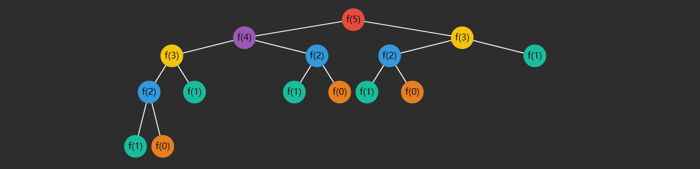
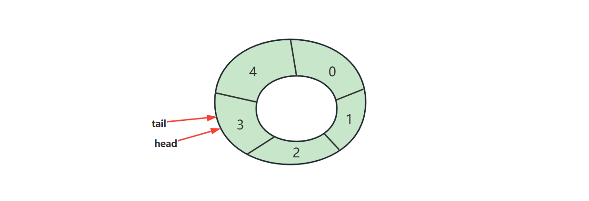
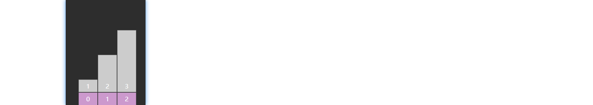
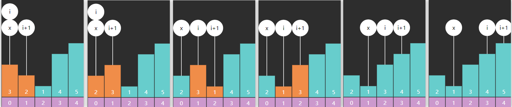
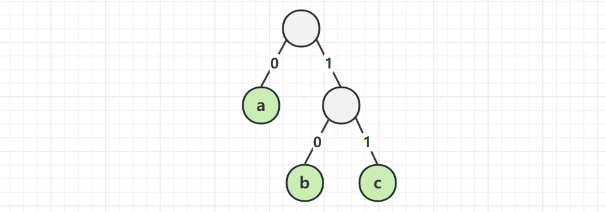
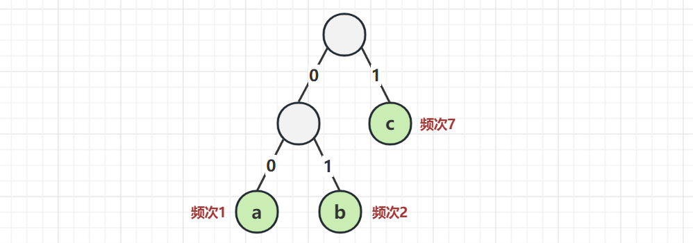
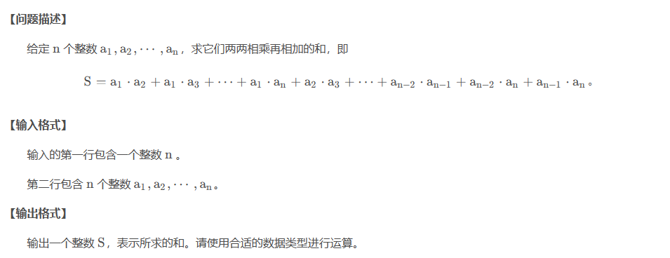

# 一. 初识算法

## 1.1 什么是算法？

**定义**

在数学和计算机科学领域，算法是一系列有限的严谨指令，通常用于解决一类特定问题或执行计算

> In mathematics and computer science, an **algorithm** (/ˈælɡərɪðəm/) is a finite sequence of rigorous instructions, typically used to solve a class of specific problems or to perform a computation.[^1]


**Introduction to Algorithm[^2]**

不正式的说，算法就是任何定义优良的计算过程：接收一些值作为输入，在有限的时间内，产生一些值作为输出。

> Informally, an algorithm is any well-defined computational procedure that takes some value, or set of values, as input and produces some value, or set of values, as output in a finite amount of time.


## 1.2 什么是数据结构？

**定义**

在计算机科学领域，数据结构是一种数据组织、管理和存储格式，通常被选择用来高效访问数据

> In computer science, a **data structure** is a data organization, management, and storage format that is usually chosen for efficient access to data


**Introduction to Algorithm[^2]**

数据结构是一种存储和组织数据的方式，旨在便于访问和修改

> A data structure is a way to store and organize data in order to facilitate access and modifications


可以说，**程序 = 数据结构 + 算法**，它们是每一位程序员的基本功，下来我们通过对一个非常著名的二分查找算法的讲解来认识一下算法


## 1.3 二分查找 [^3]

二分查找算法也称折半查找，是一种非常高效的工作于有序数组的查找算法。后续的课程中还会学习更多的查找算法，但在此之前，不妨用它作为入门。

### 1) 基础版

需求：在**有序**数组 $A$ 内，查找值 $target$

* 如果找到返回索引
* 如果找不到返回 $-1$


```java
public static int binarySearch(int[] a, int target) {
    int i = 0, j = a.length - 1;
    while (i <= j) {
        int m = (i + j) >>> 1;
        if (target < a[m]) {			// 在左边
            j = m - 1;
        } else if (a[m] < target) {		// 在右边
            i = m + 1;
        } else {
            return m;
        }
    }
    return -1;
}
```

* $i,j$ 对应着搜索区间 $[0,a.length-1]$（注意是闭合的区间），$i<=j$ 意味着搜索区间内还有未比较的元素，$i,j$ 指向的元素也可能是比较的目标
  * 思考：如果不加 $i==j$ 行不行？
  * 回答：不行，因为这意味着 $i,j$ 指向的元素会漏过比较
* $m$ 对应着中间位置，中间位置左边和右边的元素可能不相等（差一个），不会影响结果
* 如果某次未找到，那么缩小后的区间内不包含 $m$

### 2) 平衡版

```java
public static int binarySearchBalance(int[] a, int target) {
    int i = 0, j = a.length;
    while (1 < j - i) {
        int m = (i + j) >>> 1;
        if (target < a[m]) {
            j = m;
        } else {
            i = m;
        }
    }
    return (a[i] == target) ? i : -1;
}
```

思想：

1. 左闭右开的区间，$i$ 指向的可能是目标，而 $j$ 指向的不是目标
2. 不奢望循环内通过 $m$ 找出目标, 缩小区间直至剩 1 个, 剩下的这个可能就是要找的（通过 $i$）
   * $j - i > 1$ 的含义是，在范围内待比较的元素个数 > 1
3. 改变 $i$ 边界时，它指向的可能是目标，因此不能 $m+1$
4. 循环内的平均比较次数减少了
5. 时间复杂度 $\Theta(log(n))$


### 3) 返回插入位置版

```java
public static int binarySearch(int[] a, int target) {
    int i = 0, j = a.length - 1;
    while (i <= j) {
        int m = (i + j) >>> 1;
        if (target < a[m]) {			// 在左边
            j = m - 1;
        } else if (a[m] < target) {		// 在右边
            i = m + 1;
        } else {
            return m;
        }
    }
    return i;
}
```

* 例如 $[1,3,5,6]$ 要插入 $2$ 那么就是找到一个位置，这个位置左侧元素都比它小
  * 等循环结束，若没找到，i左侧元素肯定都比 target 小，因此 i 即插入点


### 4) Leftmost 与 Rightmost

```java
public static int binarySearchLeftmost1(int[] a, int target) {
    int i = 0, j = a.length - 1;
    // 初始化为找不到返回的值
    int candidate = -1;
    while (i <= j) {
        int m = (i + j) >>> 1;
        if (target < a[m]) {
            j = m - 1;
        } else if (a[m] < target) {
            i = m + 1;
        } else {
            candidate = m; // 记录候选位置
            j = m - 1;     // 继续向左
        }
    }
    return candidate;
}
```

```java
public static int binarySearchRightmost1(int[] a, int target) {
    int i = 0, j = a.length - 1;
    int candidate = -1;
    while (i <= j) {
        int m = (i + j) >>> 1;
        if (target < a[m]) {
            j = m - 1;
        } else if (a[m] < target) {
            i = m + 1;
        } else {
            candidate = m; // 记录候选位置
            i = m + 1;	   // 继续向右
        }
    }
    return candidate;
}
```


**返回插入位置版**

Leftmost 改为

```java
public static int binarySearchLeftmost(int[] a, int target) {
    int i = 0, j = a.length - 1;
    while (i <= j) {
        int m = (i + j) >>> 1;
        if (target <= a[m]) {
            j = m - 1;
        } else {
            i = m + 1;
        }
    }
    return i; 
}
```

* leftmost 返回值的另一层含义：$\lt target$ 的元素个数
* 小于等于中间值，都要向左找

Rightmost 改为

```java
public static int binarySearchRightmost(int[] a, int target) {
    int i = 0, j = a.length - 1;
    while (i <= j) {
        int m = (i + j) >>> 1;
        if (target < a[m]) {
            j = m - 1;
        } else {
            i = m + 1;
        }
    }
    return i - 1; // 返回i+ 1
}
```

* 大于等于中间值，都要向右找

几个名词


**范围查询**：

* 查询 $x \lt 4$，$0 .. leftmost(4) - 1$
* 查询 $x \leq 4$，$0 .. rightmost(4)$
* 查询 $4 \lt x$，$rightmost(4) + 1 .. \infty $
* 查询 $4 \leq x$， $leftmost(4) .. \infty$
* 查询 $4 \leq x \leq 7$，$leftmost(4) .. rightmost(7)$
* 查询 $4 \lt x \lt 7$，$rightmost(4)+1 .. leftmost(7)-1$

**求排名**：$leftmost(target) + 1$

* $target$ 可以不存在，如：$leftmost(5)+1 = 6$
* $target$ 也可以存在，如：$leftmost(4)+1 = 3$

**求前任（predecessor）**：$leftmost(target) - 1$

* $leftmost(3) - 1 = 1$，前任 $a_1 = 2$
* $leftmost(4) - 1 = 1$，前任 $a_1 = 2$

**求后任（successor）**：$rightmost(target)+1$

* $rightmost(5) + 1 = 5$，后任 $a_5 = 7$
* $rightmost(4) + 1 = 5$，后任 $a_5 = 7$

**求最近邻居**：

* 前任和后任距离更近者

### 5）递归版

```java
public int search(int[] nums, int target) {
        int left = 0;
        int right = nums.length - 1;
        return rec1(nums, left, right, target);
    }

    private int rec1(int[] nums, int left, int right, int target) {
        if (left > right) {
            return -1;
        }
        int middle = (left + right) / 2;
        if (nums[middle] > target) {
            return rec1(nums, left, middle - 1, target);
        } else if (nums[middle] < target) {
            return rec1(nums, middle + 1, right, target);
        }
        return middle;
    }
```

## 习题

### E01. 二分查找-Leetcode 704

### E02. 搜索插入位置-Leetcode 35

**参考答案1**：用二分查找基础版代码改写，找到返回 m，没找到 i 代表插入点，因此有

```java
public int searchInsert(int[] a, int target) {
    int i = 0, j = a.length - 1;
    while (i <= j) {
        int m = (i + j) >>> 1;
        if (target < a[m]) {
            j = m - 1;
        } else if (a[m] < target) {
            i = m + 1;
        } else {
            return m;
        }
    }
    return i;
}
```

**参考答案2**：用 leftmost 版本解，返回值即为插入位置（并能处理元素重复的情况）

```java
public int searchInsert(int[] a, int target) {
    int i = 0, j = a.length - 1;
    while(i <= j) {
        int m = (i + j) >>> 1;
        if(target <= a[m]) {
            j = m - 1;
        } else {
            i = m + 1;
        } 
    }
    return i;
}
```

### E03. 搜索开始结束位置-Leetcode 34

```java
public static int left(int[] a, int target) {
    int i = 0, j = a.length - 1;
    int candidate = -1;
    while (i <= j) {
        int m = (i + j) >>> 1;
        if (target < a[m]) {
            j = m - 1;
        } else if (a[m] < target) {
            i = m + 1;
        } else {
            candidate = m;
            j = m - 1;
        }
    }
    return candidate;
}

public static int right(int[] a, int target) {
    int i = 0, j = a.length - 1;
    int candidate = -1;
    while (i <= j) {
        int m = (i + j) >>> 1;
        if (target < a[m]) {
            j = m - 1;
        } else if (a[m] < target) {
            i = m + 1;
        } else {
            candidate = m;
            i = m + 1;
        }
    }
    return candidate;
}

public static int[] searchRange(int[] nums, int target) {
    int x = left(nums, target);
    if(x == -1) {
        return new int[] {-1, -1};
    } else {
        return new int[] {x, right(nums, target)};
    }
}
```

# 二. 基础数据结构

## 2.1 数组

### 1) 概述

**定义**

在计算机科学中，数组是由一组元素（值或变量）组成的数据结构，每个元素有至少一个索引或键来标识

>In computer science, an **array** is a data structure consisting of a collection of *elements* (values or variables), each identified by at least one *array index* or *key*


因为数组内的元素是**连续存储**的，所以数组中元素的地址，可以通过其索引计算出来，例如：

```java
int[] array = {1,2,3,4,5}
```


知道了数组的**数据**起始地址 $BaseAddress$，就可以由公式 $BaseAddress + i * size$ 计算出索引 $i$ 元素的地址

* $i$ 即索引，在 Java、C 等语言都是从 0 开始
* $size$ 是每个元素占用字节，例如 $int$ 占 $4$，$double$ 占 $8$


**小测试**

```java
byte[] array = {1,2,3,4,5}
```

已知 array 的**数据**的起始地址是 0x7138f94c8，那么元素 3 的地址是什么？

> 答：0x7138f94c8 + 2 * 1 = 0x7138f94ca


**空间占用**

Java 中数组结构为

* 8 字节 markword
* 4 字节 class 指针（压缩 class 指针的情况）
* 4 字节 数组大小（决定了数组最大容量是 $2^{32}$）
* 数组元素 + 对齐字节（java 中所有对象大小都是 8 字节的整数倍[^12]，不足的要用对齐字节补足）

例如

```java
int[] array = {1, 2, 3, 4, 5};
```

的大小为 40 个字节，组成如下

```
8 + 4 + 4 + 5*4 + 4(alignment)
```


**随机访问性能**

即根据索引查找元素，时间复杂度是 $O(1)$


### 2) 动态数组

```java
public class DynamicArray implements Iterable<Integer> {
    private int size = 0; // 逻辑大小
    private int capacity = 8; // 容量
    private int[] array = {};


    /**
     * 向最后位置 [size] 添加元素
     *
     * @param element 待添加元素
     */
    public void addLast(int element) {
        add(size, element);
    }

    /**
     * 向 [0 .. size] 位置添加元素
     *
     * @param index   索引位置
     * @param element 待添加元素
     */
    public void add(int index, int element) {
        checkAndGrow();

        // 添加逻辑
        if (index >= 0 && index < size) {
            // 向后挪动, 空出待插入位置
            System.arraycopy(array, index,
                    array, index + 1, size - index);
        }
        array[index] = element;
        size++;
    }

    private void checkAndGrow() {
        // 容量检查
        if (size == 0) {
            array = new int[capacity];
        } else if (size == capacity) {
            // 进行扩容, 1.5 1.618 2
            capacity += capacity >> 1;
            int[] newArray = new int[capacity];
            System.arraycopy(array, 0,
                    newArray, 0, size);
            array = newArray;
        }
    }

    /**
     * 从 [0 .. size) 范围删除元素
     *
     * @param index 索引位置
     * @return 被删除元素
     */
    public int remove(int index) { // [0..size)
        int removed = array[index];
        if (index < size - 1) {
            // 向前挪动
            System.arraycopy(array, index + 1,
                    array, index, size - index - 1);
        }
        size--;
        return removed;
    }


    /**
     * 查询元素
     *
     * @param index 索引位置, 在 [0..size) 区间内
     * @return 该索引位置的元素
     */
    public int get(int index) {
        return array[index];
    }

    /**
     * 遍历方法1
     *
     * @param consumer 遍历要执行的操作, 入参: 每个元素
     */
    public void foreach(Consumer<Integer> consumer) {
        for (int i = 0; i < size; i++) {
            // 提供 array[i]
            // 返回 void
            consumer.accept(array[i]);
        }
    }

    /**
     * 遍历方法2 - 迭代器遍历
     */
    @Override
    public Iterator<Integer> iterator() {
        return new Iterator<Integer>() {
            int i = 0;

            @Override
            public boolean hasNext() { // 有没有下一个元素
                return i < size;
            }

            @Override
            public Integer next() { // 返回当前元素,并移动到下一个元素
                return array[i++];
            }
        };
    }

    /**
     * 遍历方法3 - stream 遍历
     *
     * @return stream 流
     */
    public IntStream stream() {
        return IntStream.of(Arrays.copyOfRange(array, 0, size));
    }
}
```

* 这些方法实现，都简化了 index 的有效性判断，假设输入的 index 都是合法的


**插入或删除性能**

头部位置，时间复杂度是 $O(n)$

中间位置，时间复杂度是 $O(n)$

尾部位置，时间复杂度是 $O(1)$（均摊来说）


### 3) 二维数组

```java
int[][] array = {
    {11, 12, 13, 14, 15},
    {21, 22, 23, 24, 25},
    {31, 32, 33, 34, 35},
};
```

内存图如下


* 二维数组占 32 个字节，其中 array[0]，array[1]，array[2] 三个元素分别保存了指向三个一维数组的引用

* 三个一维数组各占 40 个字节

* 它们在内层布局上是**连续**的

更一般的，对一个二维数组 $Array[m][n]$

* $m$ 是外层数组的长度，可以看作 row 行
* $n$ 是内层数组的长度，可以看作 column 列
* 当访问 $Array[i][j]$，$0\leq i \lt m, 0\leq j \lt n$时，就相当于
  * 先找到第 $i$ 个内层数组（行）
  * 再找到此内层数组中第 $j$ 个元素（列）


**小测试**

Java 环境下（不考虑类指针和引用压缩，此为默认情况），有下面的二维数组

```java
byte[][] array = {
    {11, 12, 13, 14, 15},
    {21, 22, 23, 24, 25},
    {31, 32, 33, 34, 35},
};
```

已知 array **对象**起始地址是 0x1000，那么 23 这个元素的地址是什么？

> 答：
>
> * 起始地址 0x1000
> * 外层数组大小：16字节对象头 + 3元素 * 每个引用4字节 + 4 对齐字节 = 32 = 0x20
> * 第一个内层数组大小：16字节对象头 + 5元素 * 每个byte1字节 + 3 对齐字节 = 24 = 0x18
> * 第二个内层数组，16字节对象头 = 0x10，待查找元素索引为 2
> * 最后结果 = 0x1000 + 0x20 + 0x18 + 0x10 + 2*1 = 0x104a


### 4) 局部性原理

这里只讨论空间局部性

* cpu 读取内存（速度慢）数据后，会将其放入高速缓存（速度快）当中，如果后来的计算再用到此数据，在缓存中能读到的话，就不必读内存了
* 缓存的最小存储单位是缓存行（cache line），一般是 64 bytes，一次读的数据少了不划算啊，因此最少读 64 bytes 填满一个缓存行，因此读入某个数据时也会读取其**临近的数据**，这就是所谓**空间局部性**


**对效率的影响**

比较下面 ij 和 ji 两个方法的执行效率

```java
int rows = 1000000;
int columns = 14;
int[][] a = new int[rows][columns];

StopWatch sw = new StopWatch();
sw.start("ij");
ij(a, rows, columns);
sw.stop();
sw.start("ji");
ji(a, rows, columns);
sw.stop();
System.out.println(sw.prettyPrint());
```

ij 方法

```java
public static void ij(int[][] a, int rows, int columns) {
    long sum = 0L;
    for (int i = 0; i < rows; i++) {
        for (int j = 0; j < columns; j++) {
            sum += a[i][j];
        }
    }
    System.out.println(sum);
}
```

ji 方法

```java
public static void ji(int[][] a, int rows, int columns) {
    long sum = 0L;
    for (int j = 0; j < columns; j++) {
        for (int i = 0; i < rows; i++) {
            sum += a[i][j];
        }
    }
    System.out.println(sum);
}
```

执行结果

```
0
0
StopWatch '': running time = 96283300 ns
---------------------------------------------
ns         %     Task name
---------------------------------------------
016196200  017%  ij
080087100  083%  ji
```

可以看到 ij 的效率比 ji 快很多，为什么呢？

* 缓存是有限的，当新数据来了后，一些旧的缓存行数据就会被覆盖
* 如果不能充分利用缓存的数据，就会造成效率低下

以 ji 执行为例，第一次内循环要读入 $[0,0]$ 这条数据，由于局部性原理，读入 $[0,0]$ 的同时也读入了 $[0,1] ... [0,13]$，如图所示


但很遗憾，第二次内循环要的是 $[1,0]$ 这条数据，缓存中没有，于是再读入了下图的数据


这显然是一种浪费，因为 $[0,1] ... [0,13]$ 包括 $[1,1] ... [1,13]$ 这些数据虽然读入了缓存，却没有及时用上，而缓存的大小是有限的，等执行到第九次内循环时


缓存的第一行数据已经被新的数据 $[8,0] ... [8,13]$ 覆盖掉了，以后如果再想读，比如 $[0,1]$，又得到内存去读了

同理可以分析 ij 函数则能充分利用局部性原理加载到的缓存数据

**举一反三**

1. I/O 读写时同样可以体现局部性原理

2. 数组可以充分利用局部性原理，那么链表呢？

   > 答：链表不行，因为链表的元素并非相邻存储


### 5) 越界检查

java 中对数组元素的读写都有越界检查，类似于下面的代码

```c++
bool is_within_bounds(int index) const        
{ 
    return 0 <= index && index < length(); 
}
```

* 代码位置：`openjdk\src\hotspot\share\oops\arrayOop.hpp`

只不过此检查代码，不需要由程序员自己来调用，JVM 会帮我们调用

### 习题

#### 合并有序数组 - Leetcode 88

```java
public static void merge(int[] a1, int i, int iEnd,
                             int j, int jEnd,
                             int[] a2) {
    int k = i;
    while (i <= iEnd && j <= jEnd) {
        if (a1[i] < a1[j]) {
            a2[k] = a1[i];
            i++;
        } else {
            a2[k] = a1[j];
            j++;
        }
        k++;
    }
    if (i > iEnd) {
        System.arraycopy(a1, j, a2, k, jEnd - j + 1);
    }
    if (j > jEnd) {
        System.arraycopy(a1, i, a2, k, iEnd - i + 1);
    }
}
```

#### 寻找两个正序数组的中位数 - 4

- 先合并再找中位数

```java
public double findMedianSortedArrays(int[] nums1, int[] nums2) {
    int length1 = nums1.length;
    int length2 = nums2.length;
    int[] nums3 = new int[length1 + length2];
    int i  = 0;
    int j = 0;
    int k = 0;
    while (i < length1 && j < length2){
        if (nums1[i] < nums2[j]) {
            nums3[k] = nums1[i];
            i++;
        }else {
            nums3[k] = nums2[j];
            j++;
        }
        k++;
    }
    if (i == length1) {
        System.arraycopy(nums2, j, nums3, k, length2 - j);
    }
    if (j == length2) {
        System.arraycopy(nums1, i, nums3, k, length1 - i);
    }
    int length3 = nums3.length;
    int mid = length3 / 2;
    return length3 % 2 == 0 ? (double) (nums3[mid] + nums3[mid - 1]) / 2.0 : (double) nums3[mid];
}
```

## 2.2 链表

### 1) 概述

**定义**

在计算机科学中，链表是数据元素的线性集合，其每个元素都指向下一个元素，元素存储上并不连续

> In computer science, a **linked list** is a linear collection of data elements whose order is not given by their physical placement in memory. Instead, each element points to the next. 


可以分类为[^5]

* 单向链表，每个元素只知道其下一个元素是谁


* 双向链表，每个元素知道其上一个元素和下一个元素


* 循环链表，通常的链表尾节点 tail 指向的都是 null，而循环链表的 tail 指向的是头节点 head


链表内还有一种特殊的节点称为哨兵（Sentinel）节点，也叫做哑元（ Dummy）节点，它不存储数据，通常用作头尾，用来简化边界判断，如下图所示


**随机访问性能**

根据 index 查找，时间复杂度 $O(n)$

**插入或删除性能**

* 起始位置：$O(1)$
* 结束位置：如果已知 tail 尾节点是 $O(1)$，不知道 tail 尾节点是 $O(n)$
* 中间位置：根据 index 查找时间 + $O(1)$


### 2) 单向链表（不带哨兵）

根据单向链表的定义，首先定义一个存储 value 和 next 指针的类 Node，和一个描述头部节点的引用

```java
public class SinglyLinkedList {
    
    private Node head; // 头部节点
    
    private static class Node { // 节点类
        int value;
        Node next;

        public Node(int value, Node next) {
            this.value = value;
            this.next = next;
        }
    }
}
```

* Node 定义为内部类，是为了对外**隐藏**实现细节，没必要让类的使用者关心 Node 结构
* 定义为 static 内部类，是因为 Node **不需要**与 SinglyLinkedList 实例相关，多个 SinglyLinkedList实例能共用 Node 类定义


**头部添加**

```java
public class SinglyLinkedList {
    // ...
    public void addFirst(int value) {
		this.head = new Node(value, this.head);
    }
}
```

* 如果 this.head == null，新增节点指向 null，并作为新的 this.head
* 如果 this.head != null，新增节点指向原来的 this.head，并作为新的 this.head
  * 注意赋值操作执行顺序是从右到左


**while 遍历**

```java
public class SinglyLinkedList {
    // ...
    public void loop() {
        Node curr = this.head;
        while (curr != null) {
            // 做一些事
            curr = curr.next;
        }
    }
}
```


**for 遍历**

```java
public class SinglyLinkedList {
    // ...
    public void loop() {
        for (Node curr = this.head; curr != null; curr = curr.next) {
            // 做一些事
        }
    }
}
```

* 以上两种遍历都可以把**要做的事**以 Consumer 函数的方式传递进来
  * Consumer 的规则是**一个参数**，**无返回值**，因此像 System.out::println 方法等都是 Consumer
  * 调用 Consumer 时，将当前节点 curr.value 作为参数传递给它


**迭代器遍历**

```java
public class SinglyLinkedList implements Iterable<Integer> {
    // ...
    private class NodeIterator implements Iterator<Integer> {
        Node curr = head;
        
        public boolean hasNext() {
            return curr != null;
        }

        public Integer next() {
            int value = curr.value;
            curr = curr.next;
            return value;
        }
    }
    
    public Iterator<Integer> iterator() {
        return new NodeIterator();
    }
}
```

* hasNext 用来判断是否还有必要调用 next
* next 做两件事
  * 返回当前节点的 value
  * 指向下一个节点
* NodeIterator 要定义为**非 static 内部类**，是因为它与 SinglyLinkedList 实例相关，是对某个 SinglyLinkedList 实例的迭代


**递归遍历**

```java
public class SinglyLinkedList implements Iterable<Integer> {
    // ...
    public void loop() {
        recursion(this.head);
    }

    private void recursion(Node curr) {
        if (curr == null) {
            return;
        }
        // 前面做些事
        recursion(curr.next);
        // 后面做些事
    }
}
```


**尾部添加**

```java
public class SinglyLinkedList {
    // ...
    private Node findLast() {
        if (this.head == null) {
            return null;
        }
        Node curr;
        for (curr = this.head; curr.next != null; ) {
            curr = curr.next;
        }
        return curr;
    }
    
    public void addLast(int value) {
        Node last = findLast();
        if (last == null) {
            addFirst(value);
            return;
        }
        last.next = new Node(value, null);
    }
}
```

* 注意，找最后一个节点，终止条件是 curr.next == null 
* 分成两个方法是为了代码清晰，而且 findLast() 之后还能复用


**尾部添加多个**

```java
public class SinglyLinkedList {
    // ...
	public void addLast(int first, int... rest) {
        
        Node sublist = new Node(first, null);
        Node curr = sublist;
        for (int value : rest) {
            curr.next = new Node(value, null);
            curr = curr.next;
        }
        
        Node last = findLast();
        if (last == null) {
            this.head = sublist;
            return;
        }
        last.next = sublist;
    }
}
```

* 先串成一串 sublist
* 再作为一个整体添加


**根据索引获取**

```java
public class SinglyLinkedList {
    // ...
	private Node findNode(int index) {
        int i = 0;
        for (Node curr = this.head; curr != null; curr = curr.next, i++) {
            if (index == i) {
                return curr;
            }
        }
        return null;
    }
    
    private IllegalArgumentException illegalIndex(int index) {
        return new IllegalArgumentException(String.format("index [%d] 不合法%n", index));
    }
    
    public int get(int index) {
        Node node = findNode(index);
        if (node != null) {
            return node.value;
        }
        throw illegalIndex(index);
    }
}
```

* 同样，分方法可以实现复用


**插入**

```java
public class SinglyLinkedList {
    // ...
	public void insert(int index, int value) {
        if (index == 0) {
            addFirst(value);
            return;
        }
        Node prev = findNode(index - 1); // 找到上一个节点
        if (prev == null) { // 找不到
            throw illegalIndex(index);
        }
        prev.next = new Node(value, prev.next);
    }
}
```

* 插入包括下面的删除，都必须找到上一个节点


**删除**

```java
public class SinglyLinkedList {
    // ...
	public void remove(int index) {
        if (index == 0) {
            if (this.head != null) {
                this.head = this.head.next;
                return;
            } else {
                throw illegalIndex(index);
            }
        }
        Node prev = findNode(index - 1);
        Node curr;
        if (prev != null && (curr = prev.next) != null) {
            prev.next = curr.next;
        } else {
            throw illegalIndex(index);
        }
    }
}
```

* 第一个 if 块对应着 removeFirst 情况
* 最后一个 if 块对应着至少得两个节点的情况
  * 不仅仅判断上一个节点非空，还要保证当前节点非空


### 3) 单向链表（带哨兵）

观察之前单向链表的实现，发现每个方法内几乎都有判断是不是 head 这样的代码，能不能简化呢？

用一个不参与数据存储的特殊 Node 作为哨兵，它一般被称为哨兵或哑元，拥有哨兵节点的链表称为带头链表

```java
public class SinglyLinkedListSentinel {
    // ...
    private Node head = new Node(Integer.MIN_VALUE, null);
}
```

* 具体存什么值无所谓，因为不会用到它的值

加入哨兵节点后，代码会变得比较简单，先看几个工具方法

```java
public class SinglyLinkedListSentinel {
    // ...
    
    // 根据索引获取节点
    private Node findNode(int index) {
        int i = -1;
        for (Node curr = this.head; curr != null; curr = curr.next, i++) {
            if (i == index) {
                return curr;
            }
        }
        return null;
    }
    
    // 获取最后一个节点
    private Node findLast() {
        Node curr;
        for (curr = this.head; curr.next != null; ) {
            curr = curr.next;
        }
        return curr;
    }
}
```

* findNode 与之前类似，只是 i 初始值设置为 -1 对应哨兵，实际传入的 index 也是 $[-1, \infty)$
* findLast 绝不会返回 null 了，就算没有其它节点，也会返回哨兵作为最后一个节点


这样，代码简化为

```java
public class SinglyLinkedListSentinel {
    // ...
    
    public void addLast(int value) {
        Node last = findLast();
        /*
        改动前
        if (last == null) {
            this.head = new Node(value, null);
            return;
        }
        */
        last.next = new Node(value, null);
    }
    
    public void insert(int index, int value) {
        /*
        改动前
        if (index == 0) {
            this.head = new Node(value, this.head);
            return;
        }
        */
        // index 传入 0 时，返回的是哨兵
        Node prev = findNode(index - 1);
        if (prev != null) {
            prev.next = new Node(value, prev.next);
        } else {
            throw illegalIndex(index);
        }
    }
    
    public void remove(int index) {
        /*
        改动前
        if (index == 0) {
            if (this.head != null) {
                this.head = this.head.next;
                return;
            } else {
                throw illegalIndex(index);
            }
        }
        */
        // index 传入 0 时，返回的是哨兵
        Node prev = findNode(index - 1);
        Node curr;
        if (prev != null && (curr = prev.next) != null) {
            prev.next = curr.next;
        } else {
            throw illegalIndex(index);
        }
    }
    
    public void addFirst(int value) {
        /*
        改动前
        this.head = new Node(value, this.head);
        */
		this.head.next = new Node(value, this.head.next);
        // 也可以视为 insert 的特例, 即 insert(0, value);
    }
}
```

* 对于删除，前面说了【最后一个 if 块对应着至少得两个节点的情况】，现在有了哨兵，就凑足了两个节点


### 4) 双向链表（带哨兵）

```java
public class DoublyLinkedListSentinel implements Iterable<Integer> {

    private final Node head;
    private final Node tail;

    public DoublyLinkedListSentinel() {
        head = new Node(null, 666, null);
        tail = new Node(null, 888, null);
        head.next = tail;
        tail.prev = head;
    }

    private Node findNode(int index) {
        int i = -1;
        for (Node p = head; p != tail; p = p.next, i++) {
            if (i == index) {
                return p;
            }
        }
        return null;
    }

    public void addFirst(int value) {
        insert(0, value);
    }

    public void removeFirst() {
        remove(0);
    }

    public void addLast(int value) {
        Node prev = tail.prev;
        Node added = new Node(prev, value, tail);
        prev.next = added;
        tail.prev = added;
    }

    public void removeLast() {
        Node removed = tail.prev;
        if (removed == head) {
            throw illegalIndex(0);
        }
        Node prev = removed.prev;
        prev.next = tail;
        tail.prev = prev;
    }

    public void insert(int index, int value) {
        Node prev = findNode(index - 1);
        if (prev == null) {
            throw illegalIndex(index);
        }
        Node next = prev.next;
        Node inserted = new Node(prev, value, next);
        prev.next = inserted;
        next.prev = inserted;
    }

    public void remove(int index) {
        Node prev = findNode(index - 1);
        if (prev == null) {
            throw illegalIndex(index);
        }
        Node removed = prev.next;
        if (removed == tail) {
            throw illegalIndex(index);
        }
        Node next = removed.next;
        prev.next = next;
        next.prev = prev;
    }

    private IllegalArgumentException illegalIndex(int index) {
        return new IllegalArgumentException(
                String.format("index [%d] 不合法%n", index));
    }

    @Override
    public Iterator<Integer> iterator() {
        return new Iterator<Integer>() {
            Node p = head.next;

            @Override
            public boolean hasNext() {
                return p != tail;
            }

            @Override
            public Integer next() {
                int value = p.value;
                p = p.next;
                return value;
            }
        };
    }

    static class Node {
        Node prev;
        int value;
        Node next;

        public Node(Node prev, int value, Node next) {
            this.prev = prev;
            this.value = value;
            this.next = next;
        }
    }
}
```


### 5) 环形链表（带哨兵）

双向环形链表带哨兵，这时哨兵**既作为头，也作为尾**


参考实现

```java
public class DoublyLinkedListSentinel implements Iterable<Integer> {

    @Override
    public Iterator<Integer> iterator() {
        return new Iterator<>() {
            Node p = sentinel.next;

            @Override
            public boolean hasNext() {
                return p != sentinel;
            }

            @Override
            public Integer next() {
                int value = p.value;
                p = p.next;
                return value;
            }
        };
    }

    static class Node {
        Node prev;
        int value;
        Node next;

        public Node(Node prev, int value, Node next) {
            this.prev = prev;
            this.value = value;
            this.next = next;
        }
    }

    private final Node sentinel = new Node(null, -1, null); // 哨兵

    public DoublyLinkedListSentinel() {
        sentinel.next = sentinel;
        sentinel.prev = sentinel;
    }

    /**
     * 添加到第一个
     * @param value 待添加值
     */
    public void addFirst(int value) {
        Node next = sentinel.next;
        Node prev = sentinel;
        Node added = new Node(prev, value, next);
        prev.next = added;
        next.prev = added;
    }

    /**
     * 添加到最后一个
     * @param value 待添加值
     */
    public void addLast(int value) {
        Node prev = sentinel.prev;
        Node next = sentinel;
        Node added = new Node(prev, value, next);
        prev.next = added;
        next.prev = added;
    }
    
    /**
     * 删除第一个
     */
    public void removeFirst() {
        Node removed = sentinel.next;
        if (removed == sentinel) {
            throw new IllegalArgumentException("非法");
        }
        Node a = sentinel;
        Node b = removed.next;
        a.next = b;
        b.prev = a;
    }

    /**
     * 删除最后一个
     */
    public void removeLast() {
        Node removed = sentinel.prev;
        if (removed == sentinel) {
            throw new IllegalArgumentException("非法");
        }
        Node a = removed.prev;
        Node b = sentinel;
        a.next = b;
        b.prev = a;
    }

    /**
     * 根据值删除节点
     * <p>假定 value 在链表中作为 key, 有唯一性</p>
     * @param value 待删除值
     */
    public void removeByValue(int value) {
        Node removed = findNodeByValue(value);
        if (removed != null) {
            Node prev = removed.prev;
            Node next = removed.next;
            prev.next = next;
            next.prev = prev;
        }
    }

    private Node findNodeByValue(int value) {
        Node p = sentinel.next;
        while (p != sentinel) {
            if (p.value == value) {
                return p;
            }
            p = p.next;
        }
        return null;
    }

}
```

### 习题

#### E01. 反转单向链表-Leetcode 206

**方法1**

构造一个新链表，从**旧链表**依次拿到每个节点，创建新节点添加至**新链表**头部，完成后新链表即是倒序的

```java
public ListNode reverseList(ListNode o1) {
    ListNode n1 = null;
    ListNode p = o1;
    while (p != null) {
        // 必须创建新的结点，不能从旧链表中断开
        n1 = new ListNode(p.val, n1);
        p = p.next;
    }
    return n1;
}
```

**方法4**

从链表每次拿到第二个节点，将其从链表断开，插入头部，直至它为 null 结束

1. 设置指针 o1(旧头)、n1(新头)、o2(旧老二)，分别指向第一，第一，第二节点（o1起记录作用，让o2能定位到旧链表的第二个元素）

2. 将 o2 节点从链表断开，即 o1 节点指向第三节点

$ \frac{n1 \ o1}{1} \rightarrow 3 \rightarrow 4 \rightarrow 5 \rightarrow null$ ，$\frac{o2}{2}$

3. o2 节点链入链表头部，即

$\frac{o2}{2} \rightarrow \frac{n1 \ o1}{1} \rightarrow 3 \rightarrow 4 \rightarrow 5 \rightarrow null$

4. n1 指向 o2

$\frac{n1 \ o2}{2} \rightarrow \frac{o1}{1} \rightarrow 3 \rightarrow 4 \rightarrow 5 \rightarrow null$

5. o2 指向 o1 的下一个节点，即

$\frac{n1}{2} \rightarrow \frac{o1}{1} \rightarrow \frac{o2}{3} \rightarrow 4 \rightarrow 5 \rightarrow null$

6. 重复以上 $2\sim5$ 步，直到 o2 指向 null

7. 还应当考虑边界条件，即链表中不满两个元素时，无需走以上逻辑

```java
public ListNode reverseList(ListNode o1) {    
    if (o1 == null || o1.next == null) { // 不足两个节点
        return o1;
    }
    ListNode o2 = o1.next;
    ListNode n1 = o1;
    while (o2 != null) {
        o1.next = o2.next; 
        o2.next = n1;
        n1 = o2;
        o2 = o1.next;
    }
    return n1;
}
```

**方法5**

要点：把链表分成两部分，思路就是不断从链表2的头，往链表1的头搬移

1. n1 指向 null，代表**新链表**一开始没有元素，o1 指向**原链表**的首节点

$\frac{n1}{null}$，$\frac{o1}{1} \rightarrow 2 \rightarrow 3 \rightarrow 4 \rightarrow 5 \rightarrow null$

2. 开始循环，o2 指向**原链表**次节点（o2起记录作用，使o1能定位到旧链表的头元素）

$\frac{n1}{null}$，$\frac{o1}{1} \rightarrow \frac{o2}{2} \rightarrow 3 \rightarrow 4 \rightarrow 5 \rightarrow null$

3. 搬移

$\frac{o1}{1} \rightarrow \frac{n1}{null}$  ， $\frac{o2}{2} \rightarrow 3 \rightarrow 4 \rightarrow 5 \rightarrow null$

4. 指针复位

$\frac{n1}{1} \rightarrow null$ ， $\frac{o1 \ o2}{2} \rightarrow 3 \rightarrow 4 \rightarrow 5 \rightarrow null$

5. 重复 $2\sim4$ 步
6. 当 o1 = null 时退出循环

**参考答案**

```java
public ListNode reverseList(ListNode o1) {
    if (o1 == null || o1.next == null) {
        return o1;
    }
    ListNode n1 = null;
    while (o1 != null) {
        ListNode o2 = o1.next;
        o1.next = n1;
        n1 = o1;
        o1 = o2;
    }
    return n1;
}
```

评价：本质上与方法2 相同，只是方法2更为面向对象

#### E02. 根据值删除节点-Leetcode 203

**方法1**

用哨兵节点+双指针法

```java
public ListNode removeElements(ListNode head, int val) {
    ListNode sentinel = new ListNode(-1, head);
    ListNode p1 = sentinel;
    ListNode p2;
    while ((p2 = p1.next) != null) {
        if (p2.val == val) {
            p1.next = p2.next;
        } else {
            p1 = p1.next;
        }
    }
    return sentinel.next;
}
```

**方法2**

思路，递归函数负责返回：从当前节点（我）开始，完成删除的子链表

1. 若我与 v 相等，应该返回下一个节点递归结果
2. 若我与 v 不等，应该返回我，但我的 next 应该更新（让我能带上后续删过的子链表）

```java
public ListNode removeElements(ListNode head, int val) {
    if (head == null) {
        return null;
    }
    if (head.val == val) {
        return removeElements(head.next, val);
    } else {
        head.next = removeElements(head.next, val);
        return head;
    }
}
```

#### E03.  删除倒数节点-Leetcode 19

**方法1**

哨兵加递归

函数负责返回当前链表的头节点是倒数第几个节点

```java
public ListNode removeNthFromEnd(ListNode head, int n) {
    ListNode sentinel = new ListNode(-1, head);
    recursion(sentinel, n);
    return sentinel.next;
}

public int recursion(ListNode p, int n) {
    if (p == null) {
        return 0;
    }
    int nth = recursion(p.next, n);
    if (nth == n) {
        p.next = p.next.next;
    }
    return nth + 1;
}
```

**方法2**

哨兵+快慢指针，p1 指向待删节点的上一个，p2 先走 n + 1 步

```java
public ListNode removeNthFromEnd(ListNode head, int n) {
    ListNode s = new ListNode(-1, head);
    ListNode p1 = s;
    ListNode p2 = s;
    for (int i = 0; i < n + 1; i++) {
        p2 = p2.next;
    }
    while (p2 != null) {
        p1 = p1.next;
        p2 = p2.next;
    }
    p1.next = p1.next.next;
    return s.next;
}
```

#### E04. 有序链表去重-Leetcode 83

**方法1**

双指针

```java
public ListNode deleteDuplicates(ListNode head) {
    if (head == null || head.next == null) {
        return head;
    }
    ListNode p1 = head;
    ListNode p2 = head.next;
    while(p2 != null){
        if (p1.val == p2.val) {
            p1.next = p2.next;
            p2 = p1.next;
        }else {
            p1 = p1.next;
            p2 = p2.next;
        }
    }
    return head;
}
```

**方法2**

递归函数负责返回：从当前节点（我）开始，完成去重的链表

1. 若我与 next 重复，返回 next
2. 若我与 next 不重复，返回我，但 next 应当更新

```java
public ListNode deleteDuplicates(ListNode p) {
    if (p == null || p.next == null) {
        return p;
    }
    if(p.val == p.next.val) {
        return deleteDuplicates(p.next);
    } else {
        p.next = deleteDuplicates(p.next);
        return p;
    }
}
```

#### E05. 有序链表去重-Leetcode 82

**方法1**

递归函数负责返回：从当前节点（我）开始，完成去重的链表

1. 若我与 next 重复，一直找到下一个不重复的节点，以它的返回结果为准
2. 若我与 next 不重复，返回我，同时更新 next

```java
//函数负责返回从当前节点删除重复元素的链表
public ListNode deleteDuplicates(ListNode head) {
    if (head == null || head.next == null) {
        return head;
    }
    if (head.val == head.next.val) {
        while (head.next != null && head.val == head.next.val) {
            head = head.next;
        }
        return deleteDuplicates(head.next);
    }
    head.next = deleteDuplicates(head.next);
    return head;
}
```

**方法2**

三指针

```java
public ListNode deleteDuplicates(ListNode head) {
    if (head == null || head.next == null) {
        return head;
    }
    ListNode s = new ListNode(-1, head);
    ListNode p1 = s;
    ListNode p2 = head;
    ListNode p3 = head.next;
    while(p3 != null){
        if (p2.val == p3.val) {
            while(p3 != null && p2.val == p3.val){
                p3 = p3.next;
            }
            p1.next = p3;
            if (p3 == null) {
                break;
            }
            p2 = p3;
            p3 = p3.next;
        }
        else{
            p1 = p1.next;
            p2 = p2.next;
            p3 = p3.next;
        }
    }
    return s.next;
}
```

#### E06. 合并有序链表-Leetcode 21

**方法1**

* 谁小，把谁链给 p，p 和小的都向后平移一位
* 当 p1、p2 有一个为 null，退出循环，把不为 null 的链给 p

```
p1
1	3	8	9	null

p2
2	4	null

p		
s	null
```

代码

```java
public ListNode mergeTwoLists(ListNode p1, ListNode p2) {
    ListNode s = new ListNode(-1, null);
    ListNode p = s;
    while (p1 != null && p2 != null) {
        if (p1.val < p2.val) {
            p.next = p1;
            p1 = p1.next;
        } else {
            p.next = p2;
            p2 = p2.next;
        }
        p = p.next;
    }
    if (p1 != null) {
        p.next = p1;
    }
    if (p2 != null) {
        p.next = p2;
    }
    return s.next;
}
```


**方法2**

递归函数应该返回

* 更小的那个链表节点，并把它剩余节点与另一个链表再次递归
* 返回之前，更新此节点的 next

```java
mergeTwoLists(p1=[1,3,8,9], p2=[2,4]) {
    1.next=mergeTwoLists(p1=[3,8,9], p2=[2,4]) {
        2.next=mergeTwoLists(p1=[3,8,9], p2=[4]) {            
            3.next=mergeTwoLists(p1=[8,9], p2=[4]) {
                4.next=mergeTwoLists(p1=[8,9], p2=null) {
                    return [8,9]
                }
                return 4
            }
            return 3
        }
        return 2
    }
	return 1
}
```

代码

```java
 //函数负责返回两个链表中较小的头节点
public ListNode mergeTwoLists(ListNode list1, ListNode list2) {
    if (list1 == null) {
        return list2;
    }
    if (list2 == null) {
        return list1;
    }

    if (list1.val < list2.val) {
        list1.next = mergeTwoLists(list1.next, list2);
        return list1;
    } else {
        list2.next = mergeTwoLists(list1, list2.next);
        return list2;
    }
}
```


#### E07. 合并多个有序链表-Leetcode 23

**方法1**

分治

```java
// 分治
public ListNode mergeKLists(ListNode[] lists) {
    int length = lists.length;
    if (length == 0) {
        return null;
    }
    return split(lists, 0, length - 1);
}

private ListNode split(ListNode[] lists, int left, int right) {
    if (left == right) {
        return lists[left];
    }

    int middle = (left + right) >>> 1;
    ListNode l = split(lists, left, middle);
    ListNode r = split(lists, middle + 1, right);

    return mergeTwoLists(l, r);
}

//函数负责返回两个链表中较小的头节点
public ListNode mergeTwoLists(ListNode list1, ListNode list2) {
    if (list1 == null) {
        return list2;
    }
    if (list2 == null) {
        return list1;
    }

    if (list1.val < list2.val) {
        list1.next = mergeTwoLists(list1.next, list2);
        return list1;
    } else {
        list2.next = mergeTwoLists(list1, list2.next);
        return list2;
    }
}
```

**方法2**

优先级队列

```java
public ListNode mergeKLists(ListNode[] lists) {
    PriorityQueue<ListNode> queue = new PriorityQueue<>(Comparator.comparingInt(node -> node.val));
    ListNode s = new ListNode(-1, null);
    ListNode p = s;
    // 先把头节点加入
    for (ListNode list : lists){
        if (list != null) {
            queue.offer(list);
        }
    }
    while (!queue.isEmpty()){
        ListNode curr = queue.poll();
        p.next = curr;
        p = p.next;
        if (curr.next != null) {
            // 该链表被选中后加入下一个结点
            queue.offer(curr.next);
        }
    }
    return s.next;
}
```


#### E08. 查找链表中间节点-Leetcode 876

* **偶数**节点时，中间点是靠右的那个

解法：快慢指针，快指针一次走两步，慢指针一次走一步，当快指针到链表结尾时，慢指针恰好走到链表的一半

```java
public ListNode middleNode(ListNode head) {
    ListNode p1 = head;	// 慢指针，中间点
    ListNode p2 = head;	// 快指针
    while (p2 != null && p2.next != null) {
        p1 = p1.next;
        p2 = p2.next;
        p2 = p2.next;
    }
    return p1;
}
```

#### E09. 回文链表-Leetcode 234

**方法一**

```java
/*
    步骤1. 找中间点
    步骤2. 中间点后半个链表反转
    步骤3. 反转后链表与原链表逐一比较
*/

public boolean isPalindrome(ListNode head) {
    ListNode middle = middleNode(head);
    ListNode n = reverseList(middle);
    while(n != null){
        if (n.val != head.val) {
            return false;
        }
        n = n.next;
        head = head.next;
    }
    return true;
}

public ListNode middleNode(ListNode head) {
    ListNode p1 = head;
    ListNode p2 = head;
    while (p2 != null && p2.next != null) {
        p1 = p1.next;
        p2 = p2.next.next;
    }
    return p1;
}

public ListNode reverseList(ListNode head) {
    if (head == null || head.next == null) {
        return head;
    }
    ListNode o1 = head;
    ListNode n1 = head;
    ListNode o2 = head.next;
    while (o2 != null) {
        o1.next = o1.next.next;
        o2.next = n1;
        n1 = o2;
        o2 = o1.next;
    }
    return n1;
}
```

**方法二**

快慢指针，慢指针边走边将经历的结点值入栈，找到中间节点后继续往下走，边走边出栈比较

```java
public boolean isPalindrome(ListNode head) {
    ListNode p1 = head;
    ListNode p2 = head;
    LinkedList<Integer> stack = new LinkedList<>();
    while (p2 != null && p2.next != null) {
        stack.push(p1.val);
        p2 = p2.next.next;
        p1 = p1.next;
    }
    // 不能判断p2.next == null，会报空指针异常
    if (p2 != null) {
        p1 = p1.next;
    }
    while (p1 != null) {
        if (p1.val != stack.pop()) {
            return false;
        }
        p1 = p1.next;
    }
    return true;
}
```

#### E10. 环形链表-Leetcode 141

本题以及下题，实际是 Floyd's Tortoise and Hare Algorithm （Floyd 龟兔赛跑算法）[^15]


如果链表上存在环，那么在环上以不同速度前进的两个指针必定会在某个时刻相遇。算法分为两个阶段

阶段1

* 龟一次走一步，兔子一次走两步
* 当兔子能走到终点时，不存在环
* 当兔子能追上龟时，可以判断存在环

阶段2

* 从它们第一次相遇开始，龟回到起点，兔子保持原位不变
* 龟和兔子一次都走一步
* 当再次相遇时，地点就是环的入口

为什么呢？

* 设起点到入口走 a 步（本例是 7），绕环一圈长度为 b（本例是 5），
* 那么**从起点开始，走 a + 绕环 n 圈，都能找到环入口**
* 第一次相遇时
  * 兔走了 a + 绕环 n 圈（本例 2 圈） + k，k 是它们相遇距环入口位置（本例 3，不重要）
  * 龟走了 a + 绕环 n 圈（本例 0 圈） + k，当然它绕的圈数比兔少
  * 兔走的距离是龟的两倍，所以**龟走的** = 兔走的 - 龟走的 = **绕环 n 圈**
* 而前面分析过，如果走 a + 绕环 n 圈，都能找到环入口，因此从相遇点开始，再走 a 步，就是环入口


阶段1 参考代码（判断是否有环）

```java
public boolean hasCycle(ListNode head) {
    ListNode h = head; // 兔
    ListNode t = head; // 龟
    while (h != null && h.next != null) {
        t = t.next;
        h = h.next.next;
        if(h == t){
            return true;
        }
    }
    return false;
}
```

#### E11. 环形链表-Leetcode 142

阶段2 参考代码（找到环入口）

```java
public ListNode detectCycle(ListNode head) {
    ListNode t = head; // 龟
    ListNode h = head; // 兔
    while (h != null && h.next != null) {
        t = t.next;
        h = h.next.next;
        if (h == t) {
            t = head;
            while (true) {
                if (h == t) {
                    return h;
                }
                h = h.next;
                t = t.next;
            }
        }
    }
    return null;
}
```

* 还有一道扩展题目，也可以用判环算法思想来解：就是 287 题，寻找重复数

#### E12. 删除节点-Leetcode 237

不给头节点，直接给删除的结点，那么就将该节点与下一个结点交换，删除下一个结点就行了

注意：被删除的节点**不是**末尾节点

**参考答案**

```java
public class Ex1Leetcode237 {
    /**
     *
     * @param node 待删除节点, 题目已说明肯定不是最后一个节点
     */
    public void deleteNode(ListNode node) {
        node.val = node.next.val;		// 下一个节点值赋值给待"删除"节点
        node.next = node.next.next;		// 把下一个节点删除
    }

    public static void main(String[] args) {
        ListNode o5 = new ListNode(5, null);
        ListNode o4 = new ListNode(4, o5);
        ListNode o3 = new ListNode(3, o4);
        ListNode o2 = new ListNode(2, o3);
        ListNode o1 = new ListNode(1, o2);
        System.out.println(o1);
        new E0xLeetcode237().deleteNode(o3);
        System.out.println(o1);
    }
}
```

输出

#### E13. 共尾链表-Leetcode 160

原题叫做**相交**链表，个人觉得用**共尾**链表更形象些，此题更像是一道脑筋急转弯，留给大家练习

例如，下图的两个链表 [1, 2, 4, 5] 与 [3, 4, 5] 它们中 [4, 5] 是相同的，此时应返回节点 4


非共尾的情况，如下图所示，此时返回 null


思路，称两个链表为 a=[1, 2, 4, 5]，b=[3, 4, 5]，图中用 N 代表 null

1. 遍历 a，遇到 null 时改道遍历 b
2. 与此同时，遍历 b，遇到 null 时改道遍历 a
3. 在此过程中，如果**遇到相同**的节点，即为找寻目标，返回即可，如下图中的第二次出现的 4
4. 相同节点应该比较其**引用值**，图中数字只是为了便于区分

```
1	2	4	5	N	3	4	5	N
3	4	5	N	1	2	4	5	N
```

如果两个链表长度相同，则可以更早找到目标，例如 a=[1, 4, 5]，b=[3, 4, 5]，第一次出现 4 时，即可返回

```
1	4	5	N	3	4	5	N
3	4	5	N	1	4	5	N
```

如果是非共尾的情况，如 a=[1, 2, 4]，b=[3, 5]，可以看到，唯一相等的情况，是遍历到最后那个 N 此时退出循环

```
1	2	4	N	3	5	N
3	5	N	1	2	4	N
```

代码

```java
public ListNode getIntersectionNode(ListNode a, ListNode b) {
    ListNode p1 = a;
    ListNode p2 = b;
    while (true) {
        if (p1 == p2) {
            return p1;
        }
        if (p1 == null) {
            p1 = b;
        } else {
            p1 = p1.next;
        }
        if (p2 == null) {
            p2 = a;
        } else {
            p2 = p2.next;
        }            
    }
}
```

#### E14. 交换链表节点-Leetcode 24

```java
// 函数负责返回完成交换的子链的头节点
public ListNode swapPairs(ListNode head) {
    // 终止条件
    if (head == null || head.next == null) {
        return head;
    }
    // 递归逻辑
    ListNode next = head.next;
    ListNode newNode = swapPairs(next.next);
    next.next = head;
    head.next = newNode;
    return next;
}
```

#### E15. 对链表排序

```java
// 递归函数负责返回当前链表排序后的头节点
public static Node rec(Node root){
    //终止条件
    if(root == null || root.next == null){
        return root;
    }
    //递归逻辑
    root.next = rec(root.next);
    Node s = new Node(-1, root);
    Node p = s;
    Node p1 = root;
    Node p2 = root.next;
    while(p2 != null && p1.val > p2.val){
        p.next = p2;
        p1.next = p2.next;
        p2.next = p1;
        p = p.next;
        p2 = p1.next;
    }
    return s.next;
}
```

## 2.3 递归

### 1) 概述

**定义**

计算机科学中，递归是一种解决计算问题的方法，其中解决方案取决于同一类问题的更小子集

> In computer science, **recursion** is a method of solving a computational problem where the solution depends on solutions to smaller instances of the same problem.

比如单链表递归遍历的例子：

```java
void f(Node node) {
    if(node == null) {
        return;
    }
    println("before:" + node.value)
    f(node.next);
    println("after:" + node.value)
}
```

说明：

1. 自己调用自己，如果说每个函数对应着一种解决方案，自己调用自己意味着解决方案是一样的（有规律的）
2. 每次调用，函数处理的数据会较上次缩减（子集），而且最后会缩减至无需继续递归
3. 内层函数调用（子集处理）完成，外层函数才能算调用完成


**原理**

假设链表中有 3 个节点，value 分别为 1，2，3，以上代码的执行流程就类似于下面的**伪码**

```java
// 1 -> 2 -> 3 -> null  f(1)

void f(Node node = 1) {
    println("before:" + node.value) // 1
    void f(Node node = 2) {
        println("before:" + node.value) // 2
        void f(Node node = 3) {
            println("before:" + node.value) // 3
            void f(Node node = null) {
                if(node == null) {
                    return;
                }
            }
            println("after:" + node.value) // 3
        }
        println("after:" + node.value) // 2
    }
    println("after:" + node.value) // 1
}
```


**思路**

1. 确定能否使用递归求解
2. 推导出递推关系，即父问题与子问题的关系，以及递归的结束条件


例如之前遍历链表的递推关系为
$$
f(n) = 
\begin{cases}
停止& n = null \\
f(n.next) & n \neq null
\end{cases}
$$


* 深入到最里层叫做**递**
* 从最里层出来叫做**归**
* 在**递**的过程中，外层函数内的局部变量（以及方法参数）并未消失，**归**的时候还可以用到


### 2) 单路递归 Single Recursion

#### E01. 阶乘

用递归方法求阶乘 

* 阶乘的定义 $n!= 1⋅2⋅3⋯(n-2)⋅(n-1)⋅n$，其中 $n$ 为自然数，当然 $0! = 1$

* 递推关系


$$
f(n) = 
\begin{cases}
1 & n = 1\\
n * f(n-1) & n > 1
\end{cases}
$$

代码

```java
private static int f(int n) {
    if (n == 1) {
        return 1;
    }
    return n * f(n - 1);
}
```

拆解**伪码**如下，假设 n 初始值为 3

```java
f(int n = 3) { // 解决不了,递
    return 3 * f(int n = 2) { // 解决不了,继续递
        return 2 * f(int n = 1) {
            if (n == 1) { // 可以解决, 开始归
                return 1;
            }
        }
    }
}
```


#### E02. 反向打印字符串

用递归反向打印字符串，n 为字符在整个字符串 str 中的索引位置

* **递**：n 从 0 开始，每次 n + 1，一直递到 n == str.length() - 1
* **归**：从 n == str.length() 开始归，从归打印，自然是逆序的

递推关系
$$
f(n) = 
\begin{cases}
停止 & n = str.length() \\
f(n+1) & 0 \leq n \leq str.length() - 1
\end{cases}
$$
代码为

```java
public static void reversePrint(String str, int index) {
    if (index == str.length()) {
        return;
    }
    reversePrint(str, index + 1);
    System.out.println(str.charAt(index));
}
```

拆解**伪码**如下，假设字符串为 "abc"

```java
void reversePrint(String str, int index = 0) {
    void reversePrint(String str, int index = 1) {
        void reversePrint(String str, int index = 2) {
            void reversePrint(String str, int index = 3) { 
                if (index == str.length()) {
                    return; // 开始归
                }
            }
            System.out.println(str.charAt(index)); // 打印 c
        }
        System.out.println(str.charAt(index)); // 打印 b
    }
    System.out.println(str.charAt(index)); // 打印 a
}
```

#### E03. 二分查找（单路递归）

```java
public static int binarySearch(int[] a, int target) {
    return recursion(a, target, 0, a.length - 1);
}

public static int recursion(int[] a, int target, int i, int j) {
    if (i > j) {
        return -1;
    }
    int m = (i + j) >>> 1;
    if (target < a[m]) {
        return recursion(a, target, i, m - 1);
    } else if (a[m] < target) {
        return recursion(a, target, m + 1, j);
    } else {
        return m;
    }
}
```


#### E04. 冒泡排序（单路递归）

```java
public static void main(String[] args) {
    int[] a = {3, 2, 6, 1, 5, 4, 7};
    bubble(a, 0, a.length - 1);
    System.out.println(Arrays.toString(a));
}

private static void bubble(int[] a, int low, int high) {
    if(low == high) {
        return;
    }
    int j = low;
    for (int i = low; i < high; i++) {
        if (a[i] > a[i + 1]) {
            swap(a, i, i + 1);
            j = i;
        }
    }
    bubble(a, low, j);
}

private static void swap(int[] a, int i, int j) {
    int t = a[i];
    a[i] = a[j];
    a[j] = t;
}
```

* low 与 high 为未排序范围
* j 表示的是未排序的边界，下一次递归时的 high
  * 发生交换，意味着有无序情况
  * 最后一次交换（以后没有无序）时，左侧 i 仍是无序，右侧 i+1 已然有序
* 视频中讲解的是只考虑 high 边界的情况，参考以上代码，理解在 low .. high 范围内的处理方法


#### E05. 插入排序（单路递归）

```java
public static void main(String[] args) {
    int[] a = {3, 2, 6, 1, 5, 7, 4};
    insertion(a, 1, a.length - 1);
    System.out.println(Arrays.toString(a));
}

private static void insertion(int[] a, int low, int high) {
    if (low > high) {
        return;
    }
    int i = low - 1;
    int t = a[low];
    while (i >= 0 && a[i] > t) {
        a[i + 1] = a[i];
        i--;
    }
    if(i + 1 != low) {
        a[i + 1] = t;
    }    
    insertion(a, low + 1, high);
}
```

* 已排序区域：[0 .. i .. low-1]
* 未排序区域：[low .. high]
* 视频中讲解的是只考虑 low 边界的情况，参考以上代码，理解 low-1 ..  high 范围内的处理方法
* 扩展：利用二分查找 leftmost 版本，改进寻找插入位置的代码


#### E06. 约瑟夫问题[^16]（单路递归）

$n$ 个人排成圆圈，从头开始报数，每次数到第 $m$ 个人（$m$ 从 $1$ 开始）杀之，继续从下一个人重复以上过程，求最后活下来的人是谁？


**方法1**

根据最后的存活者 a 倒推出它在上一轮的索引号

| f(n,m) | 本轮索引 | 为了让 a 是这个索引，上一轮应当这样排 | 规律        |
| ------ | -------- | ------------------------------------- | ----------- |
| f(1,3) | 0        | x x x a                               | (0 + 3) % 2 |
| f(2,3) | 1        | x x x 0 a                             | (1 + 3) % 3 |
| f(3,3) | 1        | x x x 0 a                             | (1 + 3) % 4 |
| f(4,3) | 0        | x x x a                               | (0 + 3) % 5 |
| f(5,3) | 3        | x x x 0 1 2 a                         | (3 + 3) % 6 |
| f(6,3) | 0        | x x x a                               |             |


**方法2**

设 n 为总人数，m 为报数次数，解返回的是这些人的索引，从0开始

| f(n, m) | 解                       | 规律  |
| ------- | ------------------------ | ----- |
| f(1, 3) | 0                        |       |
| f(2, 3) | 0 1 => 1                 | 3%2=1 |
| f(3, 3) | 0 1 2 => 0 1             | 3%3=0 |
| f(4, 3) | 0 1 2 3 => 3 0 1         | 3%4=3 |
| f(5, 3) | 0 1 2 3 4  => 3 4 0 1    | 3%5=3 |
| f(6, 3) | 0 1 2 3 4 5 => 3 4 5 0 1 | 3%6=3 |

**一. 找出等价函数**

规律：下次报数的起点为 $k = m \% n$

* 首次出列人的序号是 $k-1$，剩下的的 $n-1$ 个人重新组成约瑟夫环
* 下次从 $k$ 开始数，序号如下
  * $k,\ k+1, \ ...\ ,\ 0,\ 1,\ k-2$，如上例中 $3\ 4\ 5\ 0\ 1$

这个函数称之为 $g(n-1,m)$，它的最终结果与 $f(n,m)$ 是相同的。


**二. 找到映射函数**

现在想办法找到 $g(n-1,m)$ 与 $f(n-1, m)$ 的对应关系，即
$$
3 \rightarrow 0 \\
4 \rightarrow 1 \\
5 \rightarrow 2 \\
0 \rightarrow 3 \\
1 \rightarrow 4 \\
$$
映射函数为
$$
mapping(x) = 
\begin{cases}
x-k & x=[k..n-1] \\
x+n-k & x=[0..k-2]
\end{cases}
$$
等价于下面函数
$$
mapping(x) = (x + n - k)\%{n}
$$
代入测试一下
$$
3 \rightarrow (3+6-3)\%6 \rightarrow 0 \\
4 \rightarrow (4+6-3)\%6 \rightarrow 1 \\
5 \rightarrow (5+6-3)\%6 \rightarrow 2 \\
0 \rightarrow (0+6-3)\%6 \rightarrow 3 \\
1 \rightarrow (1+6-3)\%6 \rightarrow 4 \\
$$
综上有
$$
f(n-1,m) = mapping(g(n-1,m))
$$


**三. 求逆映射函数**

映射函数是根据 x 计算 y，逆映射函数即根据 y 得到 x
$$
mapping^{-1}(x) = (x + k)\%n
$$
代入测试一下
$$
0 \rightarrow (0+3)\%6 \rightarrow 3 \\
1 \rightarrow (1+3)\%6 \rightarrow 4 \\
2 \rightarrow (2+3)\%6 \rightarrow 5 \\
3 \rightarrow (3+3)\%6 \rightarrow 0 \\
4 \rightarrow (4+3)\%6 \rightarrow 1 \\
$$
因此可以求得
$$
g(n-1,m) = mapping^{-1}(f(n-1,m))
$$


**四. 递推式**

代入推导
$$
\begin{aligned}
f(n,m) = \ & g(n-1,m) \\
= \ & mapping^{-1}(f(n-1,m)) \\
= \ & (f(n-1,m) + k) \% n \\
= \ & (f(n-1,m) + m\%n) \% n \\
= \ & (f(n-1,m) + m) \% n \\
\end{aligned}
$$
最后一步化简是利用了模运算法则

$(a+b)\%n = (a\%n + b\%n) \%n$  例如 

* $(6+6)\%5 = 2 = (6+6\%5)\%5$
* $(6+5)\%5 = 1 = (6+5\%5)\%5$
* $(6+4)\%5 = 0 = (6+4\%5)\%5$

最终递推式
$$
f(n,m) = 
\begin{cases}
(f(n-1,m) + m) \% n & n>1\\
0 & n = 1
\end{cases}
$$


### 3) 多路递归 Multi Recursion

#### E01. 斐波那契数列-Leetcode 70

* 之前的例子是每个递归函数只包含一个自身的调用，这称之为 single recursion
* 如果每个递归函数例包含多个自身调用，称之为 multi recursion

**递推关系**
$$
f(n) = 
\begin{cases}
0 & n=0 \\
1 & n=1 \\
f(n-1) + f(n-2) & n>1
\end{cases}
$$


下面的表格列出了数列的前几项

| *F*0 | *F*1 | *F*2 | *F*3 | *F*4 | *F*5 | *F*6 | *F*7 | *F*8 | *F*9 | *F*10 | *F*11 | *F*12 | *F*13 |
| ---- | ---- | ---- | ---- | ---- | ---- | ---- | ---- | ---- | ---- | ----- | ----- | ----- | ----- |
| 0    | 1    | 1    | 2    | 3    | 5    | 8    | 13   | 21   | 34   | 55    | 89    | 144   | 233   |

**实现**

```java
public static int f(int n) {
    if (n == 0) {
        return 0;
    }
    if (n == 1) {
        return 1;
    }
    return f(n - 1) + f(n - 2);
}
```

**执行流程**


* 绿色代表正在执行（对应递），灰色代表执行结束（对应归）
* 递不到头，不能归，对应着深度优先搜索

**时间复杂度**

* 递归的次数也符合斐波那契规律，$2 * f(n+1)-1$
* 时间复杂度推导过程
  * 斐波那契通项公式 $f(n) = \frac{1}{\sqrt{5}}*({\frac{1+\sqrt{5}}{2}}^n - {\frac{1-\sqrt{5}}{2}}^n)$
  * 简化为：$f(n) = \frac{1}{2.236}*({1.618}^n - {(-0.618)}^n)$
  * 带入递归次数公式 $2*\frac{1}{2.236}*({1.618}^{n+1} - {(-0.618)}^{n+1})-1$
  * 时间复杂度为 $\Theta(1.618^n)$


> 1. 更多 Fibonacci 参考[^8][^9][^10]
> 2. 以上时间复杂度分析，未考虑大数相加的因素


**变体1 - 兔子问题[^8]**


* 第一个月，有一对未成熟的兔子（黑色，注意图中个头较小）
* 第二个月，它们成熟
* 第三个月，它们能产下一对新的小兔子（蓝色）
* 所有兔子遵循相同规律，求第 $n$ 个月的兔子数

**分析**

兔子问题如何与斐波那契联系起来呢？设第 n 个月兔子数为 $f(n)$

* $f(n)$ = 上个月兔子数 + 新生的小兔子数
* 而【新生的小兔子数】实际就是【上个月成熟的兔子数】
* 因为需要一个月兔子就成熟，所以【上个月成熟的兔子数】也就是【上上个月的兔子数】
* 上个月兔子数，即 $f(n-1)$
* 上上个月的兔子数，即 $f(n-2)$

因此本质还是斐波那契数列，只是从其第一项开始


**变体2 - 青蛙爬楼梯** 

* 楼梯有 $n$ 阶
* 青蛙要爬到楼顶，可以一次跳一阶，也可以一次跳两阶
* 只能向上跳，问有多少种跳法

**分析**

| n    | 跳法                                                | 规律                                                         |
| ---- | --------------------------------------------------- | ------------------------------------------------------------ |
| 1    | (1)                                                 | 暂时看不出                                                   |
| 2    | (1,1)  (2)                                          | 暂时看不出                                                   |
| 3    | (1,1,1)  (1,2)  (2,1)                               | 暂时看不出                                                   |
| 4    | (1,1,1,1)    (1,2,1)    (2,1,1)<br />(1,1,2)  (2,2) | 最后一跳，跳一个台阶的，基于f(3)<br />最后一跳，跳两个台阶的，基于f(2) |
| 5    | ...                                                 | ...                                                          |

* 因此本质上还是斐波那契数列，只是从其第二项开始

* 对应 leetcode 题目 [70. 爬楼梯 - 力扣（LeetCode）](https://leetcode.cn/problems/climbing-stairs/)


#### E02. 汉诺塔[^13]（多路递归）

Tower of Hanoi，是一个源于印度古老传说：大梵天创建世界时做了三根金刚石柱，在一根柱子从下往上按大小顺序摞着 64 片黄金圆盘，大梵天命令婆罗门把圆盘重新摆放在另一根柱子上，并且规定

* 一次只能移动一个圆盘
* 小圆盘上不能放大圆盘

下面的动图演示了4片圆盘的移动方法


使用程序代码模拟圆盘的移动过程，并估算出时间复杂度


**思路**

* 假设每根柱子标号 a，b，c，每个圆盘用 1，2，3 ... 表示其大小，圆盘初始在 a，要移动到的目标是 c

* 如果只有一个圆盘，此时是最小问题，可以直接求解

  * 移动圆盘1 $a \mapsto c$  

  

* 如果有两个圆盘，那么

  * 圆盘1 $a \mapsto b$ 
  * 圆盘2 $a \mapsto c$
  * 圆盘1 $b \mapsto c$

  

* 如果有三个圆盘，那么

  * 圆盘12 $a \mapsto b$
  * 圆盘3 $a \mapsto c$
  * 圆盘12 $b \mapsto c$

  

* 如果有四个圆盘，那么

  * 圆盘 123 $a \mapsto b$
  * 圆盘4 $a \mapsto c$
  * 圆盘 123 $b \mapsto c$


**题解**

```java
public class E02HanoiTower {


    /*
             源 借 目
        h(4, a, b, c) -> h(3, a, c, b)
                         a -> c
                         h(3, b, a, c)
     */
    static LinkedList<Integer> a = new LinkedList<>();
    static LinkedList<Integer> b = new LinkedList<>();
    static LinkedList<Integer> c = new LinkedList<>();

    static void init(int n) {
        for (int i = n; i >= 1; i--) {
            a.add(i);
        }
    }

    static void h(int n, LinkedList<Integer> a, 
                  LinkedList<Integer> b, 
                  LinkedList<Integer> c) {
        if (n == 0) {
            return;
        }
        h(n - 1, a, c, b);
        c.addLast(a.removeLast());
        print();
        h(n - 1, b, a, c);
    }

    private static void print() {
        System.out.println("-----------------------");
        System.out.println(a);
        System.out.println(b);
        System.out.println(c);
    }

    public static void main(String[] args) {
        init(3);
        print();
        h(3, a, b, c);
    }
}
```


#### E03. 杨辉三角[^6]


**分析**

把它斜着看

```
        1
      1   1
    1   2   1
  1   3   3   1
1   4   6   4   1
```

* 行 $i$，列 $j$，那么 $[i][j]$ 的取值应为 $[i-1][j-1] + [i-1][j]$
* 当 $j=0$ 或 $i=j$ 时，$[i][j]$ 取值为 $1$


**题解**

```java
public static void print(int n) {
    for (int i = 0; i < n; i++) {
        if (i < n - 1) {
            System.out.printf("%" + 2 * (n - 1 - i) + "s", " ");
        }

        for (int j = 0; j < i + 1; j++) {
            System.out.printf("%-4d", element(i, j));
        }
        System.out.println();
    }
}

public static int element(int i, int j) {
    if (j == 0 || i == j) {
        return 1;
    }
    return element(i - 1, j - 1) + element(i - 1, j);
}
```


**优化1**

是 multiple recursion，因此很多递归调用是重复的，例如

* recursion(3, 1) 分解为
  * recursion(2, 0) + recursion(2, 1) 
* 而 recursion(3, 2) 分解为
  * recursion(2, 1) + recursion(2, 2)

这里 recursion(2, 1) 就重复调用了，事实上它会重复很多次，可以用 static AtomicInteger counter = new AtomicInteger(0) 来查看递归函数的调用总次数

事实上，可以用 **memoization** 来进行优化：

```java
public static void print1(int n) {
    int[][] triangle = new int[n][];
    for (int i = 0; i < n; i++) {
        // 打印空格
        triangle[i] = new int[i + 1];
        for (int j = 0; j <= i; j++) {
            System.out.printf("%-4d", element1(triangle, i, j));
        }
        System.out.println();
    }
}

public static int element1(int[][] triangle, int i, int j) {
    //默认值为零，如果不是零则m
    if (triangle[i][j] > 0) {
        return triangle[i][j];
    }

    if (j == 0 || i == j) {
        triangle[i][j] = 1;
        return triangle[i][j];
    }
    triangle[i][j] = element1(triangle, i - 1, j - 1) + element1(triangle, i - 1, j);
    return triangle[i][j];
}
```

* 将数组作为递归函数内可以访问的遍历，如果 $triangle[i][j]$ 已经有值，说明该元素已经被之前的递归函数计算过，就不必重复计算了


**优化2**

```java
public static void print2(int n) {
    int[] row = new int[n];
    for (int i = 0; i < n; i++) {
        // 打印空格
        createRow(row, i);
        for (int j = 0; j <= i; j++) {
            System.out.printf("%-4d", row[j]);
        }
        System.out.println();
    }
}

private static void createRow(int[] row, int i) {
    if (i == 0) {
        row[0] = 1;
        return;
    }
    for (int j = i; j > 0; j--) {
        row[j] = row[j - 1] + row[j];
    }
}
```

> 注意：还可以通过每一行的前一项计算出下一项，不必借助上一行，这与杨辉三角的另一个特性有关，暂不展开了


#### 其它题目

力扣对应题目，但递归不适合在力扣刷高分，因此只列出相关题目，不做刷题讲解了

| 题号        | 名称       |
| ----------- | ---------- |
| Leetcode118 | 杨辉三角   |
| Leetcode119 | 杨辉三角II |
|             |            |


### 4) 递归优化-记忆法

上述代码存在很多重复的计算，例如求 $f(5)$ 递归分解过程



可以看到（颜色相同的是重复的）：

* $f(3)$ 重复了 2 次
* $f(2)$ 重复了 3 次
* $f(1)$ 重复了 5 次
* $f(0)$ 重复了 3 次

随着  $n$ 的增大，重复次数非常可观，如何优化呢？


**Memoization** 记忆法（也称备忘录）是一种优化技术，通过存储函数调用结果（通常比较昂贵），当再次出现相同的输入（子问题）时，就能实现加速效果，改进后的代码

```java
public static void main(String[] args) {
    int n = 13;
    int[] cache = new int[n + 1];
    Arrays.fill(cache, -1);
    cache[0] = 0;
    cache[1] = 1;
    System.out.println(f(cache, n));
}

public static int f(int[] cache, int n) {
    if (cache[n] != -1) {
        return cache[n];
    }

    cache[n] = f(cache, n - 1) + f(cache, n - 2);
    return cache[n];
}
```

优化后的图示，只要结果被缓存，就**不会执行其子问题**


* 改进后的时间复杂度为 $O(n)$
* 请自行验证改进后的效果
* 请自行分析改进后的空间复杂度

> **注意**
>
> 1. 记忆法是动态规划的一种情况，强调的是自顶向下的解决
> 2. 记忆法的本质是空间换时间


### 5) 递归优化-尾递归

**爆栈**

用递归做 $n + (n-1) + (n-2) ... + 1$

```java
public static long sum(long n) {
    if (n == 1) {
        return 1;
    }
    return n + sum(n - 1);
}
```

在我的机器上  $n = 12000$ 时，爆栈了

```
Exception in thread "main" java.lang.StackOverflowError
	at Test.sum(Test.java:10)
	at Test.sum(Test.java:10)
	at Test.sum(Test.java:10)
	at Test.sum(Test.java:10)
	at Test.sum(Test.java:10)
	...
```

为什么呢？

* 每次方法调用是需要消耗一定的栈内存的，这些内存用来存储方法参数、方法内局部变量、返回地址等等
* 方法调用占用的内存需要等到**方法结束时**才会释放
* 而递归调用我们之前讲过，不到最深不会回头，最内层方法没完成之前，外层方法都结束不了
  * 例如，$sum(3)$ 这个方法内有个需要执行 $3 + sum(2)$，$sum(2)$ 没返回前，加号前面的 $3$ 不能释放 
  * 看下面伪码

```java
long sum(long n = 3) {
    return 3 + long sum(long n = 2) {
        return 2 + long sum(long n = 1) {
            return 1;
        }
    }
}
```


**尾调用**

如果函数的最后一步是调用一个函数，那么称为尾调用，例如

```js
function a() {
    return b()
}
```


下面三段代码**不能**叫做尾调用

```js
function a() {
    const c = b()
    return c
}
```

* 因为最后一步并非调用函数

```js
function a() {
    return b() + 1
}
```

* 最后一步执行的是加法

```js
function a(x) {
    return b() + x
}
```

* 最后一步执行的是加法


**一些语言**[^11]的编译器能够对尾调用做优化，例如

```js
function a() {
    // 做前面的事
    return b() 
}

function b() {
    // 做前面的事
    return c()
}

function c() {
    return 1000
}

a()
```

没优化之前的**伪码**

```js
function a() {
    return function b() {
        return function c() {
            return 1000
        }
    }
}
```

优化后**伪码**如下

```js
a()
b()
c()
```

为何尾递归才能优化？

调用 a 时

* a 返回时发现：没什么可留给 b 的，将来返回的结果 b 提供就可以了，用不着我 a 了，我的内存就可以释放

调用 b 时

* b 返回时发现：没什么可留给 c 的，将来返回的结果 c 提供就可以了，用不着我 b 了，我的内存就可以释放

如果调用 a 时

* 不是尾调用，例如 return b() + 1，那么 a 就不能提前结束，因为它还得利用 b 的结果做加法


**尾递归**

尾递归是尾调用的一种特例，也就是最后一步执行的是同一个函数


**尾递归避免爆栈**

安装 Scala


Scala 入门

```scala
object Main {
  def main(args: Array[String]): Unit = {
    println("Hello Scala")
  }
}
```

* Scala 是 java 的近亲，java 中的类都可以拿来重用
* 类型是放在变量后面的
* Unit 表示无返回值，类似于 void
* 不需要以分号作为结尾，当然加上也对


还是先写一个会爆栈的函数

```scala
def sum(n: Long): Long = {
    if (n == 1) {
        return 1
    }
    return n + sum(n - 1)
}
```

* Scala 最后一行代码若作为返回值，可以省略 return

不出所料，在 $n = 11000$ 时，还是出了异常

```scala
println(sum(11000))

Exception in thread "main" java.lang.StackOverflowError
	at Main$.sum(Main.scala:25)
	at Main$.sum(Main.scala:25)
	at Main$.sum(Main.scala:25)
	at Main$.sum(Main.scala:25)
	...
```


这是因为以上代码，还不是尾调用，要想成为尾调用，那么：

1. 最后一行代码，必须是一次函数调用
2. 内层函数必须**摆脱**与外层函数的关系，内层函数**执行后**不依赖于外层的变量或常量

```scala
def sum(n: Long): Long = {
    if (n == 1) {
        return 1
    }
    return n + sum(n - 1)  // 依赖于外层函数的 n 变量
}
```

如何让它执行后就摆脱对 n 的依赖呢？

* 不能等递归回来再做加法，那样就必须保留外层的 n
* 把 n 当做内层函数的一个参数传进去，这时 n 就属于内层函数了
* 传参时就完成累加, 不必等回来时累加

```
sum(n - 1, n + 累加器)
```


改写后代码如下

```scala
@tailrec
def sum(n: Long, accumulator: Long): Long = {
    if (n == 1) {
        return 1 + accumulator
    } 
    return sum(n - 1, n + accumulator)
}
```

* accumulator 作为累加器
* @tailrec 注解是 scala 提供的，用来检查方法是否符合尾递归
* 这回 sum(10000000, 0) 也没有问题，打印 50000005000000


执行流程如下，以**伪码**表示 $sum(4, 0)$

```scala
// 首次调用
def sum(n = 4, accumulator = 0): Long = {
    return sum(4 - 1, 4 + accumulator)
}

// 接下来调用内层 sum, 传参时就完成了累加, 不必等回来时累加，当内层 sum 调用后，外层 sum 空间没必要保留
def sum(n = 3, accumulator = 4): Long = {
    return sum(3 - 1, 3 + accumulator)
}

// 继续调用内层 sum
def sum(n = 2, accumulator = 7): Long = {
    return sum(2 - 1, 2 + accumulator)
}

// 继续调用内层 sum, 这是最后的 sum 调用完就返回最后结果 10, 前面所有其它 sum 的空间早已释放
def sum(n = 1, accumulator = 9): Long = {
    if (1 == 1) {
        return 1 + accumulator
    }
}
```

本质上，尾递归优化是将函数的**递归**调用，变成了函数的**循环**调用


**改循环避免爆栈**

```java
public static void main(String[] args) {
    long n = 100000000;
    long sum = 0;
    for (long i = n; i >= 1; i--) {
        sum += i;
    }
    System.out.println(sum);
}
```


### 6) 递归时间复杂度-Master theorem[^14]

若有递归式
$$
T(n) = aT(\frac{n}{b}) + f(n)
$$
其中 

* $T(n)$ 是问题的运行时间，$n$ 是数据规模
* $a$ 是子问题个数
* $T(\frac{n}{b})$ 是子问题运行时间，每个子问题被拆成原问题数据规模的 $\frac{n}{b}$
* $f(n)$ 是除递归外执行的计算

令 $x = \log_{b}{a}$，即 $x = \log_{子问题缩小倍数}{子问题个数}$

那么
$$
T(n) = 
\begin{cases}
\Theta(n^x) & f(n) = O(n^c) 并且 c \lt x\\
\Theta(n^x\log{n}) & f(n) = \Theta(n^x)\\
\Theta(n^c) & f(n) = \Omega(n^c) 并且 c \gt x
\end{cases}
$$

**例1**

$T(n) = 2T(\frac{n}{2}) + n^4$ 

* 此时 $x = 1 < 4$，由后者决定整个时间复杂度 $\Theta(n^4)$
* 如果觉得对数不好算，可以换为求【$b$ 的几次方能等于 $a$】


**例2**

$T(n) = T(\frac{7n}{10}) + n$

* $a=1, b=\frac{10}{7}, x=0, c=1$
* 此时 $x = 0 < 1$，由后者决定整个时间复杂度 $\Theta(n)$


**例3**

$T(n) = 16T(\frac{n}{4}) + n^2$

* $a=16, b=4, x=2, c=2$
* 此时 $x=2 = c$，时间复杂度 $\Theta(n^2 \log{n})$


**例4**

$T(n)=7T(\frac{n}{3}) + n^2$

* $a=7, b=3, x=1.?, c=2$
* 此时 $x = \log_{3}{7} < 2$，由后者决定整个时间复杂度 $\Theta(n^2)$


**例5**

$T(n) = 7T(\frac{n}{2}) + n^2$

* $a=7, b=2, x=2.?, c=2$
* 此时 $x = log_2{7} > 2$，由前者决定整个时间复杂度 $\Theta(n^{\log_2{7}})$


**例6**

$T(n) = 2T(\frac{n}{4}) + \sqrt{n}$

* $a=2, b=4, x = 0.5, c=0.5$
* 此时 $x = 0.5 = c$，时间复杂度 $\Theta(\sqrt{n}\ \log{n})$


**例7. 二分查找递归**

```java
int f(int[] a, int target, int i, int j) {
    if (i > j) {
        return -1;
    }
    int m = (i + j) >>> 1;
    if (target < a[m]) {
        return f(a, target, i, m - 1);
    } else if (a[m] < target) {
        return f(a, target, m + 1, j);
    } else {
        return m;
    }
}
```

* 子问题个数 $a = 1$
* 子问题数据规模缩小倍数 $b = 2$
* 除递归外执行的计算是常数级 $c=0$

$T(n) = T(\frac{n}{2}) + n^0$

* 此时 $x=0 = c$，时间复杂度 $\Theta(\log{n})$


**例8. 归并排序递归**

```python
void split(B[], i, j, A[])
{
    if (j - i <= 1)                    
        return;                                
    m = (i + j) / 2;             
    
    // 递归
    split(A, i, m, B);  
    split(A, m, j, B); 
    
    // 合并
    merge(B, i, m, j, A);
}
```

* 子问题个数 $a=2$
* 子问题数据规模缩小倍数 $b=2$
* 除递归外，主要时间花在合并上，它可以用 $f(n) = n$ 表示

$T(n) = 2T(\frac{n}{2}) + n$

* 此时 $x=1=c$，时间复杂度 $\Theta(n\log{n})$


**例9. 快速排序递归**

```python
algorithm quicksort(A, lo, hi) is 
  if lo >= hi || lo < 0 then 
    return
  
  // 分区
  p := partition(A, lo, hi) 
  
  // 递归
  quicksort(A, lo, p - 1) 
  quicksort(A, p + 1, hi) 
```

* 子问题个数 $a=2$
* 子问题数据规模缩小倍数
  * 如果分区分的好，$b=2$
  * 如果分区没分好，例如分区1 的数据是 0，分区 2 的数据是 $n-1$
* 除递归外，主要时间花在分区上，它可以用 $f(n) = n$ 表示


情况1 - 分区分的好

$T(n) = 2T(\frac{n}{2}) + n$

* 此时 $x=1=c$，时间复杂度 $\Theta(n\log{n})$


情况2 - 分区没分好

$T(n) = T(n-1) + T(1) + n$

* 此时不能用主定理求解


### 7) 递归时间复杂度-展开求解

像下面的递归式，都不能用主定理求解

**例1 - 递归求和**

```java
long sum(long n) {
    if (n == 1) {
        return 1;
    }
    return n + sum(n - 1);
}
```

$T(n) = T(n-1) + c$，$T(1) = c$

下面为展开过程

$T(n) = T(n-2) + c + c$

$T(n) = T(n-3) + c + c + c$

...

$T(n) = T(n-(n-1)) + (n-1)c$ 

* 其中 $T(n-(n-1))$ 即 $T(1)$
* 带入求得 $T(n) = c + (n-1)c = nc$

时间复杂度为 $O(n)$


**例2 - 递归冒泡排序**

```java
void bubble(int[] a, int high) {
    if(0 == high) {
        return;
    }
    for (int i = 0; i < high; i++) {
        if (a[i] > a[i + 1]) {
            swap(a, i, i + 1);
        }
    }
    bubble(a, high - 1);
}
```

$T(n) = T(n-1) + n$，$T(1) = c$

下面为展开过程

$T(n) = T(n-2) + (n-1) + n$

$T(n) = T(n-3) + (n-2) + (n-1) + n$

...

$T(n) = T(1) + 2 + ... + n = T(1) + (n-1)\frac{2+n}{2} = c + \frac{n^2}{2} + \frac{n}{2} -1$

时间复杂度 $O(n^2)$

> 注：
>
> * 等差数列求和为 $个数*\frac{\vert首项-末项\vert}{2}$ 


**例3 - 递归快排**

快速排序分区没分好的极端情况

$T(n) = T(n-1) + T(1) + n$，$T(1) = c$

$T(n) = T(n-1) + c + n$

下面为展开过程

$T(n) = T(n-2) + c + (n-1) + c + n$

$T(n) = T(n-3) + c + (n-2) + c + (n-1) + c + n$

...

$T(n) = T(n-(n-1)) + (n-1)c + 2+...+n = \frac{n^2}{2} + \frac{2cn+n}{2} -1$

时间复杂度 $O(n^2)$


不会推导的同学可以进入 https://www.wolframalpha.com/

* 例1 输入 f(n) = f(n - 1) + c, f(1) = c
* 例2 输入 f(n) = f(n - 1) + n, f(1) = c
* 例3 输入 f(n) = f(n - 1) + n + c, f(1) = c


## 2.4 队列

### 1) 概述

计算机科学中，queue 是以顺序的方式维护的一组数据集合，在一端添加数据，从另一端移除数据。习惯来说，添加的一端称为**尾**，移除的一端称为**头**，就如同生活中的排队买商品

> In computer science, a **queue** is a collection of entities that are maintained in a sequence and can be modified by  the addition of entities at one end of the sequence and the removal of  entities from the other end of the sequence

先定义一个简化的队列接口

```java
public interface Queue<E> {

    /**
     * 向队列尾插入值
     * @param value 待插入值
     * @return 插入成功返回 true, 插入失败返回 false
     */
    boolean offer(E value);

    /**
     * 从对列头获取值, 并移除
     * @return 如果队列非空返回对头值, 否则返回 null
     */
    E poll();

    /**
     * 从对列头获取值, 不移除
     * @return 如果队列非空返回对头值, 否则返回 null
     */
    E peek();

    /**
     * 检查队列是否为空
     * @return 空返回 true, 否则返回 false
     */
    boolean isEmpty();

    /**
     * 检查队列是否已满
     * @return 满返回 true, 否则返回 false
     */
    boolean isFull();
}
```


### 2) 链表实现

下面以**单向环形带哨兵**链表方式来实现队列


代码

```java
public class LinkedListQueue<E>
        implements Queue<E>, Iterable<E> {

    private static class Node<E> {
        E value;
        Node<E> next;

        public Node(E value, Node<E> next) {
            this.value = value;
            this.next = next;
        }
    }

    private Node<E> head = new Node<>(null, null);
    private Node<E> tail = head;
    private int size = 0;
    private int capacity = Integer.MAX_VALUE;

    {
        tail.next = head;
    }

    public LinkedListQueue() {
    }

    public LinkedListQueue(int capacity) {
        this.capacity = capacity;
    }

    @Override
    public boolean offer(E value) {
        if (isFull()) {
            return false;
        }
        Node<E> added = new Node<>(value, head);
        tail.next = added;
        tail = added;
        size++;
        return true;
    }

    @Override
    public E poll() {
        if (isEmpty()) {
            return null;
        }
        Node<E> first = head.next;
        head.next = first.next;
        if (first == tail) {
            tail = head;
        }
        size--;
        return first.value;
    }

    @Override
    public E peek() {
        if (isEmpty()) {
            return null;
        }
        return head.next.value;
    }

    @Override
    public boolean isEmpty() {
        return head == tail;
    }

    @Override
    public boolean isFull() {
        return size == capacity;
    }

    @Override
    public Iterator<E> iterator() {
        return new Iterator<E>() {
            Node<E> p = head.next;
            @Override
            public boolean hasNext() {
                return p != head;
            }
            @Override
            public E next() {
                E value = p.value;
                p = p.next;
                return value;
            }
        };
    }
}
```


### 3) 环形数组实现

**好处**

1. 对比普通数组，起点和终点更为自由，不用考虑数据移动
2. “环”意味着不会存在【越界】问题
2. “环”只是用索引循环实现，并非真正的让数组首尾相接
3. 数组性能更佳
4. 环形数组比较适合实现有界队列、RingBuffer 等


**下标计算**

例如，数组长度是 5，当前位置是 3 ，向前走 2 步，此时下标为 $(3 + 2)\%5 = 0$


$$
(cur + step) \% length
$$

* cur 当前指针位置
* step 前进步数
* length 数组长度

> 注意：
>
> * 如果 step = 1，也就是一次走一步，可以在 >= length 时重置为 0 即可


**判断空**



**判断满**


满之后的策略可以根据业务需求决定

* 例如我们要实现的环形队列，满之后就拒绝入队
* head指向的是队头元素
* tail指向的是队尾元素的下一个位置

代码

```java
public class ArrayQueue<E> implements Queue<E>, Iterable<E>{

    private int head = 0;
    private int tail = 0;
    private final E[] array;
    private final int length;

    @SuppressWarnings("all")
    public ArrayQueue(int capacity) {
        length = capacity + 1;
        array = (E[]) new Object[length];
    }

    @Override
    public boolean offer(E value) {
        if (isFull()) {
            return false;
        }
        array[tail] = value;
        tail = (tail + 1) % length;
        return true;
    }

    @Override
    public E poll() {
        if (isEmpty()) {
            return null;
        }
        E value = array[head];
        head = (head + 1) % length;
        return value;
    }

    @Override
    public E peek() {
        if (isEmpty()) {
            return null;
        }
        return array[head];
    }

    @Override
    public boolean isEmpty() {
        return tail == head;
    }

    @Override
    public boolean isFull() {
        return (tail + 1) % length == head;
    }

    @Override
    public Iterator<E> iterator() {
        return new Iterator<E>() {
            int p = head;
            @Override
            public boolean hasNext() {
                return p != tail;
            }

            @Override
            public E next() {
                E value = array[p];
                p = (p + 1) % array.length;
                return value;
            }
        };
    }
}
```


**判断空、满方法2**

引入 size 

```java
public class ArrayQueue2<E> implements Queue<E>, Iterable<E> {

    private int head = 0;
    private int tail = 0;
    private final E[] array;
    private final int capacity;
    private int size = 0;

    @SuppressWarnings("all")
    public ArrayQueue2(int capacity) {
        this.capacity = capacity;
        array = (E[]) new Object[capacity];
    }

    @Override
    public boolean offer(E value) {
        if (isFull()) {
            return false;
        }
        array[tail] = value;
        tail = (tail + 1) % capacity;
        size++;
        return true;
    }

    @Override
    public E poll() {
        if (isEmpty()) {
            return null;
        }
        E value = array[head];
        head = (head + 1) % capacity;
        size--;
        return value;
    }

    @Override
    public E peek() {
        if (isEmpty()) {
            return null;
        }
        return array[head];
    }

    @Override
    public boolean isEmpty() {
        return size == 0;
    }

    @Override
    public boolean isFull() {
        return size == capacity;
    }

    @Override
    public Iterator<E> iterator() {
        return new Iterator<E>() {
            int p = head;

            @Override
            public boolean hasNext() {
                return p != tail;
            }

            @Override
            public E next() {
                E value = array[p];
                p = (p + 1) % capacity;
                return value;
            }
        };
    }
}
```


**判断空、满方法3**

* head 和 tail 不断递增，用到索引时，再用它们进行计算，两个问题
  * 如何保证 head 和 tail 自增超过正整数最大值的正确性

  * 如何让取模运算性能更高

* 答案：让 capacity 为 2 的幂

```java
public class ArrayQueue3<E> implements Queue<E>, Iterable<E> {

    private int head = 0;
    private int tail = 0;
    private final E[] array;
    private final int capacity;

    @SuppressWarnings("all")
    public ArrayQueue3(int capacity) {
        if ((capacity & capacity - 1) != 0) {
            throw new IllegalArgumentException("capacity 必须为 2 的幂");
        }
        this.capacity = capacity;
        array = (E[]) new Object[this.capacity];
    }

    @Override
    public boolean offer(E value) {
        if (isFull()) {
            return false;
        }
        array[tail & capacity - 1] = value;
        tail++;
        return true;
    }

    @Override
    public E poll() {
        if (isEmpty()) {
            return null;
        }
        E value = array[head & capacity - 1];
        head++;
        return value;
    }

    @Override
    public E peek() {
        if (isEmpty()) {
            return null;
        }
        return array[head & capacity - 1];
    }

    @Override
    public boolean isEmpty() {
        return tail - head == 0;
    }

    @Override
    public boolean isFull() {
        return tail - head == capacity;
    }

    @Override
    public Iterator<E> iterator() {
        return new Iterator<E>() {
            int p = head;

            @Override
            public boolean hasNext() {
                return p != tail;
            }

            @Override
            public E next() {
                E value = array[p & capacity - 1];
                p++;
                return value;
            }
        };
    }
}
```

### 习题

#### E01. 二叉树层序遍历-Leetcode 102

```java
public List<List<Integer>> levelOrder(TreeNode root) {
    LinkedList<TreeNode> queue = new LinkedList<>();
    List<List<Integer>> result = new ArrayList<>();
    if (root == null) {
        return result;
    }
    TreeNode curr = root;
    queue.offer(root);
    while(!queue.isEmpty()){
        List<Integer> temp = new ArrayList<>();
        int size = queue.size();
        for (int i = 0; i < size; i++) {
            TreeNode poll = queue.poll();
            temp.add(poll.val);
            if (poll.left != null) {
                queue.offer(poll.left);
            }
            if (poll.right != null) {
                queue.offer(poll.right);
            }
        }
        result.add(temp);
    }
    return result;
}
```

#### E02. 设计队列-Leetcode 622

基于链表的实现

```java
class MyCircularQueue {

    int size;
    int max;

    class Node {
        Integer val;
        Node next;

        public Node(Integer val, Node next) {
            this.val = val;
            this.next = next;
        }
    }

    Node head = new Node(-1, null);
    Node tail = head;
    {
        tail.next = head;
    }


    public MyCircularQueue(int k) {
        this.max = k;
    }

    public boolean enQueue(int value) {
        if (isFull()) {
            return false;
        }
        Node node = new Node(value, head);
        tail.next = node;
        tail = node;
        size++;
        return true;
    }

    public boolean deQueue() {
        if (isEmpty()) {
            return false;
        }
        // 避免尾结点丢失
        if (head.next == tail) {
            tail = head;
        }
        head.next = head.next.next;
        size--;
        return true;
    }

    public int Front() {
        if (isEmpty()) {
            return -1;
        }
        return head.next.val;
    }

    public int Rear() {
        if (isEmpty()) {
            return -1;
        }
        return tail.val;
    }

    public boolean isEmpty() {
        return head == tail;
    }

    public boolean isFull() {
        return size == max;
    }
}
```

注意：

* Leetcode 的实现里 deQueue（出队）返回值是布尔值，并不会返回队头元素
* 它期望用法是先用 Front 返回对头元素，再 deQueue 出队

## 2.5 栈

### 1) 概述

计算机科学中，**stack** 是一种线性的数据结构，只能在其一端添加数据和移除数据。习惯来说，这一端称之为**栈顶**，另一端不能操作数据的称之为**栈底**，就如同生活中的一摞书


先提供一个栈接口

```java
public interface Stack<E> {
    /**
     * 向栈顶压入元素
     * @param value 待压入值
     * @return 压入成功返回 true, 否则返回 false
     */
    boolean push(E value);

    /**
     * 从栈顶弹出元素
     * @return 栈非空返回栈顶元素, 栈为空返回 null
     */
    E pop();

    /**
     * 返回栈顶元素, 不弹出
     * @return 栈非空返回栈顶元素, 栈为空返回 null
     */
    E peek();

    /**
     * 判断栈是否为空
     * @return 空返回 true, 否则返回 false
     */
    boolean isEmpty();

    /**
     * 判断栈是否已满
     * @return 满返回 true, 否则返回 false
     */
    boolean isFull();
}
```


### 2) 链表实现

```java
public class LinkedListStack<E> implements Stack<E>, Iterable<E> {

    private final int capacity;
    private int size;
    private final Node<E> head = new Node<>(null, null);

    public LinkedListStack(int capacity) {
        this.capacity = capacity;
    }

    @Override
    public boolean push(E value) {
        if (isFull()) {
            return false;
        }
        head.next = new Node<>(value, head.next);
        size++;
        return true;
    }

    @Override
    public E pop() {
        if (isEmpty()) {
            return null;
        }
        Node<E> first = head.next;
        head.next = first.next;
        size--;
        return first.value;
    }

    @Override
    public E peek() {
        if (isEmpty()) {
            return null;
        }
        return head.next.value;
    }

    @Override
    public boolean isEmpty() {
        return head.next == null;
    }

    @Override
    public boolean isFull() {
        return size == capacity;
    }

    @Override
    public Iterator<E> iterator() {
        return new Iterator<E>() {
            Node<E> p = head.next;
            @Override
            public boolean hasNext() {
                return p != null;
            }

            @Override
            public E next() {
                E value = p.value;
                p = p.next;
                return value;
            }
        };
    }

    static class Node<E> {
        E value;
        Node<E> next;

        public Node(E value, Node<E> next) {
            this.value = value;
            this.next = next;
        }
    }
}
```


### 3) 数组实现

```java
public class ArrayStack<E> implements Stack<E>, Iterable<E>{
    private final E[] array;
    private int top = 0;

    @SuppressWarnings("all")
    public ArrayStack(int capacity) {
        this.array = (E[]) new Object[capacity];
    }

    @Override
    public boolean push(E value) {
        if (isFull()) {
            return false;
        }
        array[top++] = value;
        return true;
    }

    @Override
    public E pop() {
        if (isEmpty()) {
            return null;
        }
        return array[--top];
    }

    @Override
    public E peek() {
        if (isEmpty()) {
            return null;
        }
        return array[top-1];
    }

    @Override
    public boolean isEmpty() {
        return top == 0;
    }

    @Override
    public boolean isFull() {
        return top == array.length;
    }

    @Override
    public Iterator<E> iterator() {
        return new Iterator<E>() {
            int p = top;
            @Override
            public boolean hasNext() {
                return p > 0;
            }

            @Override
            public E next() {
                return array[--p];
            }
        };
    }
}
```


### 习题

#### E01. 有效的括号-Leetcode 20

思路

* 遇到左括号, 把要配对的右括号放入栈顶
* 遇到右括号, 若此时栈为空, 返回 false，否则把它与栈顶元素对比
  * 若相等, 栈顶元素弹出, 继续对比下一组
  * 若不等, 无效括号直接返回 false
* 循环结束
  * 若栈为空, 表示所有括号都配上对, 返回 true
  * 若栈不为空, 表示右没配对的括号, 应返回 false

```java
public boolean isValid(String s) {
        LinkedList<Character> stack = new LinkedList<>();
        char[] chars = s.toCharArray();
        for (char c : chars) {
            if (c == '(') {
                stack.push(')');
            } else if (c == '[') {
                stack.push(']');
            } else if (c == '{') {
                stack.push('}');
            } else if (c == ')' || c == '}' || c == ']') {
                // 栈为空说明右括号多了
                if (stack.isEmpty() || stack.pop() != c) {
                    return false;
                }
            }
        }
    	// 栈不为空说明左括号多了
        return stack.isEmpty();
    }
```


#### E02. 后缀表达式求值-Leetcode 150

```java
public int evalRPN(String[] tokens) {
    LinkedList<Integer> stack = new LinkedList<>();
    for (String s : tokens) {
        if (s.equals("+")) {
            Integer i = stack.pop();
            Integer j = stack.pop();
            stack.push(j + i);
        }else if (s.equals("-")) {
            Integer i = stack.pop();
            Integer j = stack.pop();
            stack.push(j - i);
        }else if (s.equals("*")) {
            Integer i = stack.pop();
            Integer j = stack.pop();
            stack.push(j * i);
        }else if (s.equals("/")) {
            Integer i = stack.pop();
            Integer j = stack.pop();
            stack.push(j / i);
        }else {
            stack.push(Integer.parseInt(s));
        }
    }
    return stack.pop();
}
```


#### E03. 中缀表达式转后缀

```java
public class E03InfixToSuffix {
    /*
        思路
        1. 遇到数字, 拼串
        2. 遇到 + - * /
            - 优先级高于栈顶运算符 入栈
            - 否则将栈中高级或平级运算符出栈拼串, 本运算符入栈
        3. 遍历完成, 栈中剩余运算符出栈拼串
            - 先出栈,意味着优先运算
        4. 带 ()
            - 左括号直接入栈
            - 右括号要将栈中直至左括号为止的运算符出栈拼串

        |   |
        |   |
        |   |
        _____

        a+b
        a+b-c
        a+b*c
        a*b+c
        (a+b)*c

     */
    public static void main(String[] args) {
        System.out.println(infixToSuffix("a+b"));
        System.out.println(infixToSuffix("a+b-c"));
        System.out.println(infixToSuffix("a+b*c"));
        System.out.println(infixToSuffix("a*b-c"));
        System.out.println(infixToSuffix("(a+b)*c"));
        System.out.println(infixToSuffix("a+b*c+(d*e+f)*g"));
    }

    static String infixToSuffix(String exp) {
        LinkedList<Character> stack = new LinkedList<>();
        StringBuilder sb = new StringBuilder(exp.length());
        for (int i = 0; i < exp.length(); i++) {
            char c = exp.charAt(i);
            switch (c) {
                case '+', '-', '*', '/' -> {
                    if (stack.isEmpty()) {
                        stack.push(c);
                    } else {
                        if (priority(c) > priority(stack.peek())) {
                            stack.push(c);
                        } else {
                            while (!stack.isEmpty() 
                                   && priority(stack.peek()) >= priority(c)) {
                                sb.append(stack.pop());
                            }
                            stack.push(c);
                        }
                    }
                }
                case '(' -> {
                    stack.push(c);
                }
                case ')' -> {
                    while (!stack.isEmpty() && stack.peek() != '(') {
                        sb.append(stack.pop());
                    }
                    stack.pop();
                }
                default -> {
                    sb.append(c);
                }
            }
        }
        while (!stack.isEmpty()) {
            sb.append(stack.pop());
        }
        return sb.toString();
    }

    static int priority(char c) {
        return switch (c) {
            case '(' -> 0;
            case '*', '/' -> 2;
            case '+', '-' -> 1;
            default -> throw new IllegalArgumentException("不合法字符:" + c);
        };
    }
}
```


#### E04. 双栈模拟队列-Leetcode 232

- 右边的栈专门用于放元素
- 左边的栈专门用于取元素
- 当需要取出或者获取元素时
  - 若左边的栈不为空，直接从左边的栈取
  - 若左边的栈为空，先把右边的栈全部放到左边后再取

```java
class MyQueue{
    ArrayStack<Integer> left = new ArrayStack<>(100);
    ArrayStack<Integer> right = new ArrayStack<>(100);

    int pop(){
        if (!left.isEmpty()) {
            return left.pop();
        }
        if (right.isEmpty()) {
            return -1;
        }
        while (!right.isEmpty()) {
            left.push(right.pop());
        }
        return left.pop();
    }

    void push(int x){
        right.push(x);
    }

    int peek(){
        if (!left.isEmpty()) {
            return left.peek();
        }
        if (right.isEmpty()) {
            return -1;
        }
        while (!right.isEmpty()) {
            left.push(right.pop());
        }
        return left.peek();
    }

    boolean empty(){
        return left.isEmpty() && right.isEmpty();
    }
}
```


#### E05. 单队列模拟栈-Leetcode 225

- 加入元素先加入再将前面的元素重新入队
- 取出元素时正常取出

```java
public class MyStack {
    LinkedList<Integer> queue = new L<>(100);
    int size = 0;
    public void push(int x) {
        queue.offer(x);
        for (int i = 0; i < size; i++) {
            queue.offer(queue.poll());
        }
        size++;
    }

    public int pop() {
        size--;
        return queue.poll();
    }

    public int top() {
        return queue.peek();
    }

    public boolean empty() {
        return queue.isEmpty();
    }
}
```

## 2.6 双端队列

### 1) 概述

双端队列、队列、栈对比

|                | 定义                               | 特点                   |
| -------------- | ---------------------------------- | ---------------------- |
| 队列           | 一端删除（头）另一端添加（尾）     | First In First Out     |
| 栈             | 一端删除和添加（顶）               | Last In First Out      |
| 双端队列       | 两端都可以删除、添加               |                        |
| 优先级队列     |                                    | 优先级高者先出队       |
| 延时队列       |                                    | 根据延时时间确定优先级 |
| 并发非阻塞队列 | 队列空或满时不阻塞                 |                        |
| 并发阻塞队列   | 队列空时删除阻塞、队列满时添加阻塞 |                        |

> 注1：
>
> * Java 中 LinkedList 即为典型双端队列实现，不过它同时实现了 Queue 接口，也提供了栈的 push pop 等方法
>
> 注2：
>
> * 不同语言，操作双端队列的方法命名有所不同，参见下表
>
>   | 操作     | Java       | JavaScript | C++        | leetCode 641 |
>   | -------- | ---------- | ---------- | ---------- | ------------ |
>   | 尾部插入 | offerLast  | push       | push_back  | insertLast   |
>   | 头部插入 | offerFirst | unshift    | push_front | insertFront  |
>   | 尾部移除 | pollLast   | pop        | pop_back   | deleteLast   |
>   | 头部移除 | pollFirst  | shift      | pop_front  | deleteFront  |
>   | 尾部获取 | peekLast   | at(-1)     | back       | getRear      |
>   | 头部获取 | peekFirst  | at(0)      | front      | getFront     |
>
> * 吐槽一下 leetCode 命名比较 low
>
> * 常见的单词还有 enqueue 入队、dequeue 出队


**接口定义**

```java
public interface Deque<E> {

    boolean offerFirst(E e);

    boolean offerLast(E e);

    E pollFirst();

    E pollLast();

    E peekFirst();

    E peekLast();
    
    boolean isEmpty();

    boolean isFull();
}
```


### 2) 链表实现

```java
/**
 * 基于环形链表的双端队列
 * @param <E> 元素类型
 */
public class LinkedListDeque<E> implements Deque<E>, Iterable<E> {

    @Override
    public boolean offerFirst(E e) {
        if (isFull()) {
            return false;
        }
        size++;
        Node<E> a = sentinel;
        Node<E> b = sentinel.next;
        Node<E> offered = new Node<>(a, e, b);
        a.next = offered;
        b.prev = offered;
        return true;
    }

    @Override
    public boolean offerLast(E e) {
        if (isFull()) {
            return false;
        }
        size++;
        Node<E> a = sentinel.prev;
        Node<E> b = sentinel;
        Node<E> offered = new Node<>(a, e, b);
        a.next = offered;
        b.prev = offered;
        return true;
    }

    @Override
    public E pollFirst() {
        if (isEmpty()) {
            return null;
        }
        Node<E> a = sentinel;
        Node<E> polled = sentinel.next;
        Node<E> b = polled.next;
        a.next = b;
        b.prev = a;
        size--;
        return polled.value;
    }

    @Override
    public E pollLast() {
        if (isEmpty()) {
            return null;
        }
        Node<E> polled = sentinel.prev;
        Node<E> a = polled.prev;
        Node<E> b = sentinel;
        a.next = b;
        b.prev = a;
        size--;
        return polled.value;
    }

    @Override
    public E peekFirst() {
        if (isEmpty()) {
            return null;
        }
        return sentinel.next.value;
    }

    @Override
    public E peekLast() {
        if (isEmpty()) {
            return null;
        }
        return sentinel.prev.value;
    }

    @Override
    public boolean isEmpty() {
        return size == 0;
    }

    @Override
    public boolean isFull() {
        return size == capacity;
    }

    @Override
    public Iterator<E> iterator() {
        return new Iterator<E>() {
            Node<E> p = sentinel.next;
            @Override
            public boolean hasNext() {
                return p != sentinel;
            }

            @Override
            public E next() {
                E value = p.value;
                p = p.next;
                return value;
            }
        };
    }

    static class Node<E> {
        Node<E> prev;
        E value;
        Node<E> next;

        public Node(Node<E> prev, E value, Node<E> next) {
            this.prev = prev;
            this.value = value;
            this.next = next;
        }
    }

    Node<E> sentinel = new Node<>(null, null, null);
    int capacity;
    int size;

    public LinkedListDeque(int capacity) {
        sentinel.next = sentinel;
        sentinel.prev = sentinel;
        this.capacity = capacity;
    }
}
```


### 3) 数组实现

```java
/**
 * 基于循环数组实现, 特点
 * <ul>
 *     <li>tail 停下来的位置不存储, 会浪费一个位置</li>
 * </ul>
 * @param <E>
 */
public class ArrayDeque1<E> implements Deque<E>, Iterable<E> {

    /*
                    h
            t
        0   1   2   3
        b           a
     */
    @Override
    public boolean offerFirst(E e) {
        if (isFull()) {
            return false;
        }
        head = dec(head, array.length);
        array[head] = e;
        return true;
    }

    @Override
    public boolean offerLast(E e) {
        if (isFull()) {
            return false;
        }
        array[tail] = e;
        tail = inc(tail, array.length);
        return true;
    }

    @Override
    public E pollFirst() {
        if (isEmpty()) {
            return null;
        }
        E e = array[head];
        array[head] = null;
        head = inc(head, array.length);
        return e;
    }

    @Override
    public E pollLast() {
        if (isEmpty()) {
            return null;
        }
        tail = dec(tail, array.length);
        E e = array[tail];
        array[tail] = null;
        return e;
    }

    @Override
    public E peekFirst() {
        if (isEmpty()) {
            return null;
        }
        return array[head];
    }

    @Override
    public E peekLast() {
        if (isEmpty()) {
            return null;
        }
        return array[dec(tail, array.length)];
    }

    @Override
    public boolean isEmpty() {
        return head == tail;
    }

    @Override
    public boolean isFull() {
        if (tail > head) {
            return tail - head == array.length - 1;
        } else if (tail < head) {
            return head - tail == 1;
        } else {
            return false;
        }
    }

    @Override
    public Iterator<E> iterator() {
        return new Iterator<E>() {
            int p = head;
            @Override
            public boolean hasNext() {
                return p != tail;
            }

            @Override
            public E next() {
                E e = array[p];
                p = inc(p, array.length);
                return e;
            }
        };
    }

    E[] array;
    int head;
    int tail;

    @SuppressWarnings("unchecked")
    public ArrayDeque1(int capacity) {
        array = (E[]) new Object[capacity + 1];
    }

    static int inc(int i, int length) {
        if (i + 1 >= length) {
            return 0;
        }
        return i + 1;
    }

    static int dec(int i, int length) {
        if (i - 1 < 0) {
            return length - 1;
        }
        return i - 1;
    }
}
```

数组实现中，如果存储的是基本类型，那么无需考虑内存释放，例如


但如果存储的是引用类型，应当设置该位置的引用为 null，以便内存及时释放


### 习题

#### E01. 二叉树 Z 字层序遍历-Leetcode 103

- 利用一个标志位来确定每层遍历的方向，用来存放节点的队列是正常的队列，用来临时存放结果的队列是双端队列，从左到右是尾部添加，从右到左时头部添加

```java
public List<List<Integer>> zigzagLevelOrder(TreeNode root) {
    LinkedList<TreeNode> queue = new LinkedList<>();
    List<List<Integer>> result = new ArrayList<>();
    if (root == null) {
        return result;
    }
    TreeNode curr = root;
    queue.offer(root);
    boolean leftToRight = true;
    while(!queue.isEmpty()){
        LinkedList<Integer> temp = new LinkedList<>();
        int size = queue.size();
        for (int i = 0; i < size; i++) {
            TreeNode poll = queue.poll();
            if (leftToRight) {
                temp.offerLast(poll.val);
            }else {
                temp.offerFirst(poll.val);
            }
            if (poll.left != null) {
                queue.offer(poll.left);
            }
            if (poll.right != null) {
                queue.offer(poll.right);
            }
        }
        result.add(temp);
        leftToRight = !leftToRight;
    }
    return result;
}
```

#### E02. 设计双端队列-Leetcode 641

与课堂例题也是差别不大，略

## 2.8 阻塞队列

### 双锁实现

单锁的缺点在于：

* 生产和消费几乎是不冲突的，唯一冲突的是生产者和消费者它们有可能同时修改 size
* 冲突的主要是生产者之间：多个 offer 线程修改 tail
* 冲突的还有消费者之间：多个 poll 线程修改 head

如果希望进一步提高性能，可以用两把锁

* 一把锁保护 tail
* 另一把锁保护 head

```java
public class BlockingQueue2<E> implements BlockingQueue<E> {

    private final E[] array;
    private int head = 0;
    private int tail = 0;
    private final AtomicInteger size = new AtomicInteger(0);
    ReentrantLock headLock = new ReentrantLock();
    Condition headWaits = headLock.newCondition();
    ReentrantLock tailLock = new ReentrantLock();
    Condition tailWaits = tailLock.newCondition();

    public BlockingQueue2(int capacity) {
        this.array = (E[]) new Object[capacity];
    }

    @Override
    public void offer(E e) throws InterruptedException {
        int c;
        tailLock.lockInterruptibly();
        try {
            while (isFull()) {
                tailWaits.await();
            }
            array[tail] = e;
            if (++tail == array.length) {
                tail = 0;
            }            
            c = size.getAndIncrement();
            // 队列还没有满, 由此offer线程唤醒其它offer线程
            if (c + 1 < array.length) {
                tailWaits.signal();
            }
        } finally {
            tailLock.unlock();
        }
        // 由此offer线程唤醒等待的poll线程
        if (c == 0) {
            headLock.lock();
            try {
                headWaits.signal();
            } finally {
                headLock.unlock();
            }
        }
    }

    @Override
    public E poll() throws InterruptedException {
        E e;
        int c;
        headLock.lockInterruptibly();
        try {
            while (isEmpty()) {
                headWaits.await(); 
            }
            e = array[head]; 
            if (++head == array.length) {
                head = 0;
            }
            c = size.getAndDecrement();
            // 队列还没有空，由此poll线程通知其它poll线程
            if (c > 1) {
                headWaits.signal();
            }
        } finally {
            headLock.unlock();
        }
        // 由此poll线程唤醒等待的offer线程
        if (c == array.length) {
            tailLock.lock();
            try {
                tailWaits.signal();
            } finally {
                tailLock.unlock();
            }
        }
        return e;
    }

    private boolean isEmpty() {
        return size.get() == 0;
    }

    private boolean isFull() {
        return size.get() == array.length;
    }

}
```

## 2.9 堆

- 如果从索引 0 开始存储节点数据
  - 节点 i 的父节点为(i-1)/2，当 i>0 时
  - 节点 i 的左子节点为 2i+1，右子节点为 2i+2，当然它们得 < size

```java
public class MaxHeap {
    int[] array;
    int size;

    public MaxHeap(int capacity) {
        this.array = new int[capacity];
    }

    /**
     * 获取堆顶元素
     *
     * @return 堆顶元素
     */
    public int peek() {
        return array[0];
    }

    /**
     * 删除堆顶元素
     *
     * @return 堆顶元素
     */
    public int poll() {
        int top = array[0];
        swap(0, size - 1);
        size--;
        down(0);
        return top;
    }

    /**
     * 删除指定索引处元素
     *
     * @param index 索引
     * @return 被删除元素
     */
    public int poll(int index) {
        int deleted = array[index];
        up(Integer.MAX_VALUE, index);
        poll();
        return deleted;
    }

    /**
     * 替换堆顶元素
     *
     * @param replaced 新元素
     */
    public void replace(int replaced) {
        array[0] = replaced;
        down(0);
    }

    /**
     * 堆的尾部添加元素
     *
     * @param offered 新元素
     * @return 是否添加成功
     */
    public boolean offer(int offered) {
        if (size == array.length) {
            return false;
        }
        up(offered, size);
        size++;
        return true;
    }

    // 将 val 元素上浮: 直至 v 小于父元素或到堆顶
    private void up(int val, int child) {
        int parent = (child - 1) / 2;
        while (parent >= 0 && val > array[parent]) {
            array[child] = array[parent];
            child = parent;
            parent = (child - 1) / 2;
        }
        array[child] = val;
    }

    public MaxHeap(int[] array) {
        this.array = array;
        this.size = array.length;
        heapify();
    }

    // 建堆
    private void heapify() {
        // 如何找到最后这个非叶子节点  size / 2 - 1
        for (int i = size / 2 - 1; i >= 0; i--) {
            down(i);
        }
    }

    // 将 parent 索引处的元素下潜: 与两个孩子较大者交换, 直至没孩子或孩子没它大
    private void down(int parent) {
        int left = parent * 2 + 1;
        int right = left + 1;
        int max = parent;
        if (left < size && array[left] > array[max]) {
            max = left;
        }
        if (right < size && array[right] > array[max]) {
            max = right;
        }
        if (max != parent) { // 找到了更大的孩子
            swap(max, parent);
            down(max);
        }
    }

    // 交换两个索引处的元素
    private void swap(int i, int j) {
        int t = array[i];
        array[i] = array[j];
        array[j] = t;
    }
}
```

### 建堆

Floyd 建堆算法作者：

1. 找到最后一个非叶子节点：size/2 - 1
2. 从后向前，对每个节点执行下潜

一些规律

* 一棵满二叉树节点个数为 $2^h-1$，如下例中高度 $h=3$ 节点数是 $2^3-1=7$
* 非叶子节点范围为 $[0, size/2-1]$

算法时间复杂度 $O(n)$

### 习题

#### E01. 合并多个有序链表-Leetcode 23

**方法一**

分治的思想，先合并两个有序链表

**方法二**

利用堆存放链表的头节点

```java
public ListNode mergeKLists(ListNode[] lists) {
    PriorityQueue<ListNode> priorityQueue = new PriorityQueue<>(Comparator.comparingInt(node -> node.val));
    ListNode s = new ListNode(-1, null);
    ListNode p = s;
    for (ListNode node : lists){
        if (node != null) {
            priorityQueue.offer(node);
        }
    }
    while (!priorityQueue.isEmpty()) {
        ListNode poll = priorityQueue.poll();
        p.next = poll;
        if (poll.next != null) {
            priorityQueue.offer(poll.next);
        }
        p = p.next;
    }
    return s.next;
}
```

#### E02. 数组中第K大元素-Leetcode 215

**方法一**

使用容量为k个元素的小顶堆，没满时直接加入，满了后与堆顶元素比较，如果比堆顶元素大就取出堆顶元素后加入

注意不能用size判断队列满没满，这个size是队列大小，不是元素个数

```java
public int findKthLargest(int[] nums, int k) {
    PriorityQueue<Integer> queue = new PriorityQueue<>(k);
    for (int i = 0; i < k; i++) {
        queue.offer(nums[i]);
    }
    for (int i = k; i < nums.length; i++) {
        if (queue.peek() < nums[i]) {
            queue.poll();
            queue.offer(nums[i]);
        }
    }
    return queue.peek();
}
```

**方法二**

更好的选择是快速选择算法，也就是快排的某一轮排到这个元素就可以终止了，使用堆更适合每次加入都需要算出第k大元素的场景

```java
public int findKthLargest(int[] nums, int k) {
    // 第k大元素索引是nums.length - k
    return split(nums, 0, nums.length - 1, nums.length - k);
}

private int split(int[] nums, int left, int right, int k) {
    int middle = rec(nums, left, right);
    // 终止条件
    if (middle == k) {
        return nums[k];
    } else if (middle > k) {
        // 递归调用的是split不是rec
        return split(nums, left, middle - 1, k);
    }else {
        return split(nums, middle + 1, right, k);
    }
}

private int rec(int[] nums, int left, int right) {
    int i = left;
    int j = right;
    int target = nums[left];
    while (i < j) {
        while (i < j && nums[j] > target){
            j--;
        }
        while (i < j && nums[i] <= target) {
            i++;
        }
        swap(nums, i, j);
    }
    swap(nums, left, i);
    return i;
}

private void swap(int[] nums, int i, int j) {
    int temp = nums[i];
    nums[i] = nums[j];
    nums[j] = temp;
}
```

#### E03. 数据流中第K大元素-Leetcode 703

使用堆再合适不过了

```java
public KthLargest(int k, int[] nums) {
    heap = new MinHeap703(k);
    for(int i = 0; i < nums.length; i++) {
        add(nums[i]);
    }
}

public int add(int val) {
    if(!heap.isFull()){
        heap.offer(val);
    } else if(val > heap.peek()){
        heap.replace(val);
    }
    return heap.peek();
}
```

#### E04. 数据流的中位数-Leetcode 295

一个小顶堆，一个大顶堆，保证两个堆中的元素个数相等，大的一半元素存放在小顶堆，小的一半元素存放在大顶堆

加入元素前先与两个堆的堆顶元素作比较，如果比小顶堆的堆顶元素大，就放入小顶堆，否则放入大顶堆

最终要保持两个堆的数据量相差不大于1，即加入后要把堆顶元素移动到另一个堆

```java
// 小顶堆放大元素
PriorityQueue<Integer> min;
// 大顶堆放小元素
PriorityQueue<Integer> max;

public MedianFinder() {
    min = new PriorityQueue<>();
    max = new PriorityQueue<>(Comparator.reverseOrder());
}

public void addNum(int num) {
    // 第一个元素加入小顶堆
    if (min.isEmpty()) {
        min.offer(num);
    } else if (num > min.peek()) {
        min.offer(num);
        // 维持数据量相等
        if (min.size() - max.size() > 1) {
            int move = min.poll();;
            max.offer(move);
        }
    }else {
        max.offer(num);
        if (max.size() - min.size() > 1) {
            int move = max.poll();;
            min.offer(move);
        }
    }
}

public double findMedian() {
    if (min.size() == max.size()) {
        return (double)(min.peek() + max.peek()) / 2; 
    } else if (min.size() > max.size()) {
        return min.peek();
    }else {
        return max.peek();
    }
}
```

## 2.10 二叉树

二叉树是这么一种树状结构：每个节点最多有两个孩子，左孩子和右孩子

重要的二叉树结构

* 完全二叉树（complete binary tree）是一种二叉树结构，除最后一层以外，每一层都必须填满，填充时要遵从先左后右（堆和优先级队列）
* 平衡二叉树（balance binary tree）是一种二叉树结构，其中每个节点的左右子树高度相差不超过1

### 1) 存储

存储方式分为两种

1. 定义树节点与左、右孩子引用（TreeNode）
2. 使用数组，前面讲堆时用过，若以 0 作为树的根，索引可以通过如下方式计算
   * 父 = floor((子 - 1) / 2)
   * 左孩子 = 父 * 2 + 1
   * 右孩子 = 父 * 2 + 2

### 2) 遍历

遍历也分为两种

1. 广度优先遍历（Breadth-first order）：尽可能先访问距离根最近的节点，也称为层序遍历
2. 深度优先遍历（Depth-first order）：对于二叉树，可以进一步分成三种（要深入到叶子节点）
   1. pre-order 前序遍历，对于每一棵子树，先访问该节点，然后是左子树，最后是右子树（执左右）
   2. in-order 中序遍历，对于每一棵子树，先访问左子树，然后是该节点，最后是右子树（左执右）
   3. post-order 后序遍历，对于每一棵子树，先访问左子树，然后是右子树，最后是该节点（左右执）

#### 广度优先


#### 深度优先


#### 递归实现

```java
/**
 * <h3>前序遍历</h3>
 * @param node 节点
 */
static void preOrder(TreeNode node) {
    if (node == null) {
        return;
    }
    System.out.print(node.val + "\t"); // 执
    preOrder(node.left); // 左
    preOrder(node.right); // 右
}

/**
 * <h3>中序遍历</h3>
 * @param node 节点
 */
static void inOrder(TreeNode node) {
    if (node == null) {
        return;
    }
    inOrder(node.left); // 左
    System.out.print(node.val + "\t"); // 执
    inOrder(node.right); // 右
}

/**
 * <h3>后序遍历</h3>
 * @param node 节点
 */
static void postOrder(TreeNode node) {
    if (node == null) {
        return;
    }
    postOrder(node.left); // 左
    postOrder(node.right); // 右
    System.out.print(node.val + "\t"); // 执
}
```


#### 非递归实现

**前序遍历**

```java
LinkedListStack<TreeNode> stack = new LinkedListStack<>();
TreeNode curr = root;

// 加curr != null是因为处理完根节点后栈就为空了，但是还有右子树没有处理
while (!stack.isEmpty() || curr != null) {
    if (curr != null) {
        stack.push(curr); //记录
        System.out.println(curr); //执
        curr = curr.left; //左
    } else {
        TreeNode pop = stack.pop(); //向左走到尽头直接弹出，因为最后一个左节点已经被处理了，不需要留念，直接处理右子树
        curr = pop.right; //右
    }
}
```

**中序遍历**

```java
LinkedListStack<TreeNode> stack = new LinkedListStack<>();
TreeNode curr = root;

while (!stack.isEmpty() || curr != null) {
    if (curr != null) {
        stack.push(curr); //记录
        curr = curr.left; //左
    } else {
        TreeNode pop = stack.pop();//直接弹出，紧接着就可以被处理了，不需要留念
        System.out.println(pop);//执
        curr = pop.right;//右
    }
}
```

**后序遍历**

```java
LinkedListStack<TreeNode> stack = new LinkedListStack<>();
TreeNode curr = root;
TreeNode pop = null;

while (!stack.isEmpty() || curr != null) {
    if (curr != null) {
        stack.push(curr);//记录
        curr = curr.left;//左
    } else {
        //不能直接弹出，该节点还没有被处理，要等它的右子树全部处理完才能处理，要保持记录
        TreeNode peek = stack.peek();
        //已经没有右子树或者右子树已经在上一轮中被处理
        if (peek.right == null || peek.right == pop) {
            pop = stack.pop();//弹出
            System.out.println(pop);//处理
            //右边已经无需处理，让curr为null继续处理栈中的上一个元素
        } else {
            //处理右子树
            curr = peek.right;
        }
    }
}
```

对于后序遍历，向回走时，需要处理完右子树才能 pop 出栈。如何知道右子树处理完成呢？

* 如果栈顶元素的 $right \equiv null$ 表示没啥可处理的，可以出栈

* 如果栈顶元素的 $right \neq null$，

  * 那么使用 lastPop 记录最近出栈的节点，即表示从这个节点向回走
  * 如果栈顶元素的 $right==lastPop$ 此时应当出栈


对于前、中两种遍历，实际以上代码从右子树向回走时，并未走完全程（stack 提前出栈了）后序遍历代码是走完全程了

### 习题

#### E01. 前序遍历二叉树-Leetcode 144

#### E02. 中序遍历二叉树-Leetcode 94

#### E03. 后序遍历二叉树-Leetcode 145

#### E04. 对称二叉树-Leetcode 101

```java
public boolean isSymmetric(TreeNode root) {
    return check(root.left, root.right);
}

public boolean check(TreeNode left, TreeNode right) {
    // 若同时为 null
    if (left == null && right == null) {
        return true;
    }
    // 若有一个为 null (有上一轮筛选，另一个肯定不为 null)
    if (left == null || right == null) {
        return false;
    }
    if (left.val != right.val) {
        return false;
    }
    return check(left.left, right.right) && check(left.right, right.left);
}
```

#### E04. 相同的树-Leetcode 100

```java
public boolean isSameTree(TreeNode p, TreeNode q) {
    if (p == null) {
        return q == null;
    }
    if (q == null) {
        return false;
    }
    if (p.val != q.val) {
        return false;
    }
    return isSameTree(p.left, q.left) && isSameTree(p.right, q.right);
}
```

#### E05. 二叉树最大深度-Leetcode 104

**方法一**

递归

得到左子树深度, 得到右子树深度, 二者最大者加一, 就是本节点深度

```java
public int maxDepth(TreeNode root) {
    // 终止条件
    if (root == null) {
        return 0;
    }
    int left = maxDepth(root.left);
    int right = maxDepth(root.right);
    return Math.max(left, right) + 1;
}
```

**方法二**

非递归

使用非递归后序遍历, 栈的最大高度即为最大深度（在每次插入元素时获取），效率比递归慢太多了

```java
public int maxDepth(TreeNode root) {
    int max = 0;
    LinkedList<TreeNode> stack = new LinkedList<>();
    TreeNode curr = root;
    TreeNode pop = null;
    while (!stack.isEmpty() || curr != null) {
        if (curr != null) {
            stack.push(curr);
            max = Math.max(max, stack.size());
            curr = curr.left;
        }else {
            TreeNode peek = stack.peek();
            if (peek.right == null || peek.right == pop) {
                pop = stack.pop();
            }else {
                curr = peek.right;
            }
        }
    }
    return max;
}
```

**方法三**

使用层序遍历, 层数即最大深度

```java
public int maxDepth(TreeNode root) {
    if(root == null) {
        return 0;
    }
    Queue<TreeNode> queue = new LinkedList<>();
    queue.offer(root);
    int level = 0;
    while (!queue.isEmpty()) {
        level++;
        int size = queue.size();
        for (int i = 0; i < size; i++) {
            TreeNode node = queue.poll();
            if (node.left != null) {
                queue.offer(node.left);
            }
            if (node.right != null) {
                queue.offer(node.right);
            }
        }
    }
    return level;
}
```

#### E06. 二叉树最小深度-Leetcode 111

**后序遍历求解**

```java
public int minDepth(TreeNode node) {
    if (node == null) {
        return 0;
    }
    int d1 = minDepth(node.left);
    int d2 = minDepth(node.right);
    if (d1 == 0 || d2 == 0) {
        return d1 + d2 + 1;
    }
    return Integer.min(d1, d2) + 1;
}
```

相较于求最大深度，应当考虑：

* 当右子树为 null，应当返回左子树深度加一
* 当左子树为 null，应当返回右子树深度加一

上面两种情况满足时，不应该再把为 null 子树的深度 0 参与最小值比较，例如这样

```
    1
   /
  2
```

* 正确深度为 2，若把为 null 的右子树的深度 0 考虑进来，会得到错误结果 1

```
    1
     \
      3
       \
        4
```

* 正确深度为 3，若把为 null 的左子树的深度 0 考虑进来，会得到错误结果 1

**层序遍历求解**

遇到的第一个叶子节点所在层就是最小深度

例如，下面的树遇到的第一个叶子节点 3 所在的层就是最小深度，其他 4，7 等叶子节点深度更深，也更晚遇到

```
     1
    / \     
   2   3
  / \
 4   5 
    /
   7 
```

代码

```java
public int minDepth(TreeNode root) {
    if (root == null) {
        return 0;
    }
    LinkedList<TreeNode> queue = new LinkedList<>();
    queue.offer(root);
    int count1 = 1;
    int result = 0;
    while (!queue.isEmpty()) {
        int count2 = 0;
        result++;
        for (int i = 0; i < count1; i++) {
            TreeNode curr = queue.poll();
            if (curr.left == null && curr.right == null) {
                return result;
            }
            if (curr.left != null) {
                queue.offer(curr.left);
                count2++;
            }
            if (curr.right != null) {
                queue.offer(curr.right);
                count2++;
            }
        }
        count1 = count2;
    }
    return result;
}
```

效率会高于之前后序遍历解法，因为找到第一个叶子节点后，就无需后续的层序遍历了

#### E07. 翻转二叉树-Leetcode 226

```java
// 函数负责返回左右节点翻转后的当前节点
public TreeNode invertTree(TreeNode root) {
    if (root == null) {
        return null;
    }
    TreeNode right = invertTree(root.left);
    TreeNode left = invertTree(root.right);
    root.left = left;
    root.right = right;
    return root;
}
```

#### E08. 后缀表达式转二叉树

```java
/*
    中缀表达式           (2-1)*3
    后缀（逆波兰）表达式   21-3*

    1.遇到数字入栈
    2.遇到运算符, 出栈两次, 与当前节点建立父子关系, 当前节点入栈

    栈
    |   |
    |   |
    |   |
    _____

    表达式树
        *
       / \
      -   3
     / \
    2   1

    21-3*
 */
public TreeNode constructExpressionTree(String[] tokens) {
    LinkedList<TreeNode> stack = new LinkedList<>();
    for (String t : tokens) {
        switch (t) {
            case "+", "-", "*", "/" -> {
                TreeNode right = stack.pop();
                TreeNode left = stack.pop();
                TreeNode parent = new TreeNode(t);
                parent.left = left;
                parent.right = right;
                stack.push(parent);
            }
            default -> {
                stack.push(new TreeNode(t));
            }
        }
    }
    return stack.peek();
}
```

#### E09. 根据前序与中序遍历结果构造二叉树-Leetcode 105

* 先通过前序遍历结果定位根节点
* 再结合中序遍历结果切分左右子树
* 注意数组复制方法左开右闭

```java
// 函数负责返回根据当前前中序遍历数组构建的二叉树
public TreeNode buildTree(int[] preorder, int[] inorder) {
    if (preorder.length == 0) {
        return null;
    }
    int value = preorder[0];
    TreeNode root = new TreeNode(value);
    int idx = 0;
    for (int i = 0; i < inorder.length; i++) {
        if (value == inorder[i]) {
            idx = i;
        }
    }
    root.left = buildTree(Arrays.copyOfRange(preorder, 1, idx + 1), Arrays.copyOfRange(inorder, 0, idx));
    root.right = buildTree(Arrays.copyOfRange(preorder, idx + 1 , preorder.length), Arrays.copyOfRange(inorder, idx + 1, inorder.length));
    return root;
}
```

* 可以用HashMap存储inorder优化查询

#### E10. 根据中序与后序遍历结果构造二叉树-Leetcode 106

* 先通过后序遍历结果定位根节点
* 再结合中序遍历结果切分左右子树

```java
public TreeNode buildTree(int[] inorder, int[] postorder) {
    if (inorder.length == 0) {
        return null;
    }
    int value = postorder[postorder.length - 1];
    TreeNode root = new TreeNode(value);
    int idx = 0;
    for (int i = 0; i < inorder.length; i++) {
        if (value == inorder[i]) {
            idx = i;
        }
    }
    root.left = buildTree(Arrays.copyOfRange(inorder, 0, idx), Arrays.copyOfRange(postorder, 0, idx));
    root.right = buildTree(Arrays.copyOfRange(inorder, idx + 1, inorder.length), Arrays.copyOfRange(postorder, idx , postorder.length - 1));
    return root;
}
```

* 代码可以用Hash表进一步优化

#### E11.  二叉树的最近公共祖先-Leetcode 236

- 分：分别往左右子树方向找
- 治：左子树找到了或者右子树找到了，或者两个都找到了
- 如果左右子树分别找到了一个就都会返回结果，那么我就是公共祖先
- 如果左子树返回结果，右子树没有返回结果，那么左子树的结果就是公共祖先
- 如果右子树返回结果，左子树没有返回结果，那么右子树的结果就是公共祖先
- ruguo1左右子树都没有返回结果，那么说明已经进入得太深了

```java
// 函数负责返回当前子树中p，q的共同
public TreeNode lowestCommonAncestor(TreeNode root, TreeNode p, TreeNode q) {
    // 治
    if (root == null || root == p || root == q) {
        return root;
    }
    // 分
    TreeNode left = lowestCommonAncestor(root.left, p, q);
    TreeNode right = lowestCommonAncestor(root.right, p, q);
    // 合
    if (left == null && right == null) {
        return null;
    }
    if (left == null) {
        return right;
    }
    if (right == null) {
        return left;
    }
    return root;
}
```

# 三. 基础算法

## 3.1 查找概述

查找算法是一种在数据集中寻找特定数据项的方法。通常，数据集是在计算机程序中存储的，例如数组、链表或散列表。在编写程序时，查找算法是非常重要的，它有助于快速找到所需的数据。在本文中，我们将介绍一些基本的查找算法及其特点。

### 线性查找

线性查找也称为顺序查找，是一种最简单的查找算法。在这种算法中，我们从数据集的开头开始，逐个比较每个数据项，以寻找要查找的数据。如果我们找到了目标数据，查找过程就结束了。如果我们到达数据集的末尾，仍然找不到目标数据，则可以认为它不存在于数据集中。

线性查找的时间复杂度是O(n)，其中n是数据集的大小。因此，它在大型数据集中可能会很慢。然而，在小型数据集中，它仍然是一种非常有用的算法。

### 二分查找

二分查找也称为折半查找，是一种更快速的查找算法。但前提是，数据集必须已经排序。在二分查找中，我们取数据集的中间值，然后将目标与中间值进行比较。如果目标小于中间值，则在左侧子集中继续查找；如果目标大于中间值，则在右侧子集中继续查找。每次比较都会缩小要搜索的数据集的大小。

二分查找的时间复杂度是O(log n)，其中n是数据集的大小。这种算法在大型数据集中非常有效，但在小型数据集中可能并不是最快的选择。

### 哈希表查找

哈希表查找也称为散列表查找，是另一种常见的查找算法。它利用哈希函数将数据项映射到散列表中的位置。在查找过程中，我们只需通过哈希函数计算目标数据的位置，然后检查该位置是否包含目标数据。

哈希表查找的时间复杂度是O(1)。这使得它成为大型数据集中最快的查找算法之一。但是，哈希表查找的效率取决于哈希函数的质量。如果两个数据项映射到相同的位置，就会发生哈希冲突，这可能会导致性能下降。

### 小结

在编写程序时，我们需要选择适合数据集大小和其他要求的最佳查找算法。例如，如果数据集很小，则线性查找可能是最快的选择；如果数据集已经排序，则二分查找是非常有用的。然而，在大型数据集中，哈希表查找通常是最好的选择。了解不同类型的查找算法及其特点可以帮助我们在编写程序时做出明智的选择。

不管是之前学过的数组、链表、队列、还是栈，这些线性结构中，如果想在其中查找一个元素，效率是比较慢的，只有$O(N)$，因此如果你的需求是实现数据的快速查找，那么就需要**新的数据结构**支持。

还记得最先介绍的那个二分查找算法吗？它的查找效率能够达到 $O(\log{N})$，是不是还不错？不过呢，它需要对数组事先排好序，而排序的成本是比较高的。那么有没有一个折中的办法呢？有，那就是接下来要给大家介绍的**二叉搜索树**，它插入元素后，自然就是排好序的，接下来的查询也自然而然可以应用二分查找算法进行高效搜索。


## 3.2 二叉搜索树（BST）

### 概述

#### 历史

> 二叉搜索树最早是由Bernoulli兄弟在18世纪中提出的，但是真正推广和应用该数据结构的是1960年代的D.L. Gries。他的著作《The Science of Programming》中详细介绍了二叉搜索树的实现和应用。
>
> 在计算机科学的发展中，二叉搜索树成为了一种非常基础的数据结构，被广泛应用在各种领域，包括搜索、排序、数据库索引等。随着计算机算力的提升和对数据结构的深入研究，二叉搜索树也不断被优化和扩展，例如AVL树、红黑树等。

#### 特性

二叉搜索树（也称二叉排序树）是符合下面特征的二叉树：

1. 树节点增加 key 属性，用来比较谁大谁小，key 不可以重复
2. 对于任意一个树节点，它的 key 比左子树的 key 都大，同时也比右子树的 key 都小，例如下图所示


轻易看出要查找 7 （从根开始）自然就可应用二分查找算法，只需三次比较

* 与 4 比，较之大，向右找
* 与 6 比，较之大，继续向右找
* 与 7 比，找到

查找的时间复杂度与**树高**相关，插入、删除也是如此。

* 如果这棵树长得还不赖（左右平衡）上图，那么时间复杂度均是 $O(\log{N})$
* 当然，这棵树如果长得丑（左右高度相差过大）下图，那么这时是最糟的情况，时间复杂度是 $O(N)$


> 注：
>
> * 二叉搜索树 - 英文 binary search tree，简称 BST
> * 二叉排序树 - 英文 binary ordered tree 或 binary sorted tree


### 实现

#### 定义节点

```java
static class BSTNode {
    int key; // 若希望任意类型作为 key, 则后续可以将其设计为 Comparable 接口
    Object value;
    BSTNode left;
    BSTNode right;

    public BSTNode(int key) {
        this.key = key;
        this.value = key;
    }

    public BSTNode(int key, Object value) {
        this.key = key;
        this.value = value;
    }

    public BSTNode(int key, Object value, BSTNode left, BSTNode right) {
        this.key = key;
        this.value = value;
        this.left = left;
        this.right = right;
    }
}
```


#### 查询

**递归实现**

```java
private TreeNode findNode(TreeNode root, int key) {
    if (root == null) {
        return null;
    }
    if (root.val == key) {
        return root;
    } else if (root.val > key) {
        return findNode(root.left, key);
    }else {
        return findNode(root.right, key);
    }
}
```


**非递归实现**

```java
public Object get(int key) {
    BSTNode node = root;
    while (node != null) {
        if (key < node.key) {
            node = node.left;
        } else if (node.key < key) {
            node = node.right;
        } else {
            return node.value;
        }
    }
    return null;
}
```


#### Comparable

如果希望让除 int 外更多的类型能够作为 key，一种方式是 key 必须实现 Comparable 接口。

```java
public class BSTTree2<T extends Comparable<T>> {
    static class BSTNode<T> {
        T key; // 若希望任意类型作为 key, 则后续可以将其设计为 Comparable 接口
        Object value;
        BSTNode<T> left;
        BSTNode<T> right;

        public BSTNode(T key) {
            this.key = key;
            this.value = key;
        }

        public BSTNode(T key, Object value) {
            this.key = key;
            this.value = value;
        }

        public BSTNode(T key, Object value, BSTNode<T> left, BSTNode<T> right) {
            this.key = key;
            this.value = value;
            this.left = left;
            this.right = right;
        }
    }

    BSTNode<T> root;

    public Object get(T key) {
        return doGet(root, key);
    }

    private Object doGet(BSTNode<T> node, T key) {
        if (node == null) {
            return null;
        }
        int result = node.key.compareTo(key);
        if (result > 0) {
            return doGet(node.left, key);
        } else if (result < 0) {
            return doGet(node.right, key);
        } else {
            return node.value;
        }
    }

}
```

还有一种做法不要求 key 实现 Comparable 接口，而是在构造 Tree 时把比较规则作为 Comparator 传入，将来比较 key 大小时都调用此 Comparator 进行比较，这种做法可以参考 Java 中的 java.util.TreeMap


#### 最小

**递归实现**

```java
public Object min() {
    return doMin(root);
}

public Object doMin(BSTNode node) {
    if (node == null) {
        return null;
    }
    // 左边已走到头
    if (node.left == null) { 
        return node.value;
    }
    return doMin(node.left);
}
```


**非递归实现**

```java
public Object min() {
    if (root == null) {
        return null;
    }
    BSTNode p = root;
    // 左边未走到头
    while (p.left != null) {
        p = p.left;
    }
    return p.value;
}
```


#### 最大

**递归实现**

```java
public Object max() {
    return doMax(root);
}

public Object doMax(BSTNode node) {
    if (node == null) {
        return null;
    }
    // 右边已走到头
    if (node.left == null) { 
        return node.value;
    }
    return doMin(node.right);
}
```

**非递归实现**

```java
public Object max() {
    if (root == null) {
        return null;
    }
    BSTNode p = root;
    // 右边未走到头
    while (p.right != null) {
        p = p.right;
    }
    return p.value;
}
```


#### 新增

**递归实现**

```java
public void put(int key, Object value) {
    root = doPut(root, key, value);
}

private BSTNode doPut(BSTNode node, int key, Object value) {
    if (node == null) {
        return new BSTNode(key, value);
    }
    if (key < node.key) {
        node.left = doPut(node.left, key, value);
    } else if (node.key < key) {
        node.right = doPut(node.right, key, value);
    } else {
        node.value = value;
    }
    return node;
}
```

* 若找到 key，走 else 更新找到节点的值
* 若没找到 key，走第一个 if，创建并返回新节点（一定能找到空位，不用破坏原来的结构）
  * 返回的新节点，作为上次递归时 node 的左孩子或右孩子
  * 缺点是，会有很多不必要的赋值操作


**非递归实现**

```java
public void put(int key, Object value) {
    BSTNode node = root;
    BSTNode parent = null;
    while (node != null) {
        parent = node;
        if (key < node.key) {
            node = node.left;
        } else if (node.key < key) {
            node = node.right;
        } else {
            // 1. key 存在则更新
            node.value = value;
            return;
        }
    }
    // 2. key 不存在则新增
    if (parent == null) {
        root = new BSTNode(key, value);
    } else if (key < parent.key) {
        parent.left = new BSTNode(key, value);
    } else {
        parent.right = new BSTNode(key, value);
    }
}
```


#### 前驱后继


一个节点的前驱（前任）节点是指比它小的节点中，最大的那个

一个节点的后继（后任）节点是指比它大的节点中，最小的那个

例如上图中

* 1 没有前驱，后继是 2
* 2 前驱是 1，后继是 3
* 3 前驱是 2，后继是 4
* ...

简单的办法是中序遍历，即可获得排序结果，此时很容易找到前驱后继

要效率更高，需要研究一下规律，**找前驱**分成 2 种情况：


1. 节点有左子树，此时前驱节点就是左子树的最大值，图中属于这种情况的有
   * 2 的前驱是1
   * 4 的前驱是 3
   * 6 的前驱是 5
   * 7 的前驱是 6
2. 节点没有左子树，若**离它最近的从左而来的祖先即为前驱**，如
   * 3 的祖先 2 自左而来，前驱 2
   * 5 的祖先 4 自左而来，前驱 4
   * 8 的祖先 7 自左而来，前驱 7
   * 1 没有这样的祖先，前驱 null


**找后继**也分成 2 种情况


1. 节点有右子树，此时后继节点即为右子树的最小值，如
   * 2 的后继 3
   * 3 的后继 4
   * 5 的后继 6
   * 7 的后继 8
2. 节点没有右子树，**最近的从右而来的祖先即为后继**，如
   * 1 的祖先 2 自右而来，后继 2
   * 4 的祖先 5 自右而来，后继 5
   * 6 的祖先 7 自右而来，后继 7
   * 8 没有这样的祖先，后继 null


```java
public Object predecessor(int key) {
    BSTNode ancestorFromLeft = null;
    BSTNode p = root;
    while (p != null) {
        if (key < p.key) {
            p = p.left;
        } else if (p.key < key) {
            //只要往右边走了就要记录一下左边的父亲节点
            ancestorFromLeft = p;
            p = p.right;
        } else {
            break;
        }
    }
	//没有该节点
    if (p == null) {
        return null;
    }
    // 情况1 - 有左孩子
    if (p.left != null) {
        return max(p.left);
    }
    // 情况2 - 有祖先自左而来
    return ancestorFromLeft != null ? ancestorFromLeft.value : null;
}


public Object successor(int key) {
    BSTNode ancestorFromRight = null;
    BSTNode p = root;
    while (p != null) {
        if (key < p.key) {
            ancestorFromRight = p;
            p = p.left;
        } else if (p.key < key) {
            p = p.right;
        } else {
            break;
        }
    }

    if (p == null) {
        return null;
    }
    // 情况1 - 有右孩子
    if (p.right != null) {
        return min(p.right);
    }
    // 情况2 - 有祖先自右而来
    return ancestorFromRight != null ? ancestorFromRight.value : null;
}
```


#### 删除

要删除某节点（称为 D），必须先找到被删除节点的父节点，这里称为 Parent

1. 删除节点没有左孩子，将右孩子托孤给 Parent
2. 删除节点没有右孩子，将左孩子托孤给 Parent
3. 删除节点左右孩子都没有，已经被涵盖在情况1、情况2 当中，把 null 托孤给 Parent
4. 删除节点左右孩子都有，可以将它的后继节点（称为 S）托孤给 Parent，设 S 的父亲为 SP，又分两种情况
   1. SP 就是被删除节点，此时 D 与 S 紧邻，只需将 S 托孤给 Parent（S直接顶替D的位置）
   2. SP 不是被删除节点，此时 D 与 S 不相邻，此时需要将 S 的后代（S只可能有右子树）托孤给 SP（成为它的左子树），再将 S 顶替孤D的位置，左右孩子都要连好

**非递归实现**

```java
/**
 * <h3>根据关键字删除</h3>
 *
 * @param key 关键字
 * @return 被删除关键字对应值
 */
public Object delete(int key) {
    BSTNode p = root;
    BSTNode parent = null;
    while (p != null) {
        if (key < p.key) {
            parent = p;
            p = p.left;
        } else if (p.key < key) {
            parent = p;
            p = p.right;
        } else {
            break;
        }
    }
    //找不到该节点
    if (p == null) {
        return null;
    }
    // 删除操作
    if (p.left == null) {
        shift(parent, p, p.right); // 情况1
    } else if (p.right == null) {
        shift(parent, p, p.left); // 情况2
    } else {
        // 情况4
        // 后继节点
        BSTNode s = p.right;
        // 后继节点的父亲
        BSTNode sParent = p;
        // 找后继节点（右子树的最小值）
        while (s.left != null) {
            sParent = s;
            s = s.left;
        }
        // 4.2 删除和后继不相邻, 处理后继的后事
        if (sParent != p) {                
            shift(sParent, s, s.right); // 不可能有左孩子
            s.right = p.right; //直接顶替被删除节点
        }
        // 4.3 后继取代被删除节点
        shift(parent, p, s);
        s.left = p.left;
    }
    return p.value;
}

/**
 * 托孤方法
 *
 * @param parent  被删除节点的父亲
 * @param deleted 被删除节点
 * @param child   被顶上去的节点
 */
private void shift(BSTNode parent, BSTNode deleted, BSTNode child) {
    if (parent == null) {
        root = child;
    } else if (deleted == parent.left) {
        parent.left = child;
    } else {
        parent.right = child;
    }
}
```


**递归实现**

```java
public Object delete(int key) {
    ArrayList<Object> result = new ArrayList<>();
    root = doDelete(root, key, result);
    return result.isEmpty() ? null : result.get(0);
}

// 函数负责返回当前子树删除节点后的根节点
public BSTNode doDelete(BSTNode node, int key, ArrayList<Object> result) {
    if (node == null) {
        return null;
    }
    if (key < node.key) {
        node.left = doDelete(node.left, key, result);
        return node;
    }
    if (node.key < key) {
        node.right = doDelete(node.right, key, result);
        return node;
    }
    //找到了
    result.add(node.value);
    //情况四：左右节点都不为空
    //两种情况可以合并
    if (node.left != null && node.right != null) {
        BSTNode s = node.right; //后继节点
        while (s.left != null) {
            s = s.left;
        }
        // 1.将s的后代托孤给sp
        // 2.结果赋值给s.right，直接顶替被删除节点
        s.right = doDelete(node.right, s.key, new ArrayList<>());
        // 3.连接左孩子
        s.left = node.left;
        // 4.返回出去让parent连接
        return s;
    }
    // 情况1，2，3
    return node.left != null ? node.left : node.right;
}
```

说明

1. `ArrayList<Object> result` 用来保存被删除节点的值
2. 第二、第三个 if 对应没找到的情况，继续递归查找和删除，注意后续的 doDelete 返回值代表删剩下的，因此需要更新
3. 最后一个 return 对应删除节点只有一个孩子的情况，返回那个不为空的孩子，待删节点自己因没有返回而被删除
4. 第四个 if 对应删除节点有两个孩子的情况，此时需要找到后继节点，并在待删除节点的右子树中删掉后继节点，最后用后继节点替代掉待删除节点返回，别忘了改变后继节点的左右指针


#### 找小的

```java
//中序遍历结果就是排序好的，遍历到key就停止
public List<Object> less(int key) {
    ArrayList<Object> result = new ArrayList<>();
    BSTNode p = root;
    LinkedList<BSTNode> stack = new LinkedList<>();
    while (p != null || !stack.isEmpty()) {
        if (p != null) {
            stack.push(p);
            p = p.left;
        } else {
            BSTNode pop = stack.pop();
            if (pop.key < key) {
                result.add(pop.value);
            } else {
                break;
            }
            p = pop.right;
        }
    }
    return result;
}
```


#### 找大的

```java
public List<Object> greater(int key) {
    ArrayList<Object> result = new ArrayList<>();
    BSTNode p = root;
    LinkedList<BSTNode> stack = new LinkedList<>();
    while (p != null || !stack.isEmpty()) {
        if (p != null) {
            stack.push(p);
            p = p.left;
        } else {
            BSTNode pop = stack.pop();
            if (pop.key > key) {
                result.add(pop.value);
            }
            p = pop.right;
        }
    }
    return result;
}
```

找小的就应该先去左边找，但找大的应该去右边找，这样效率不高，可以用 RNL 遍历

> 注：
>
> - Pre-order, NLR
> - In-order, LNR
> - Post-order, LRN
> - Reverse pre-order, NRL
> - Reverse in-order, RNL
> - Reverse post-order, RLN

```java
public List<Object> greater(int key) {
    ArrayList<Object> result = new ArrayList<>();
    BSTNode p = root;
    LinkedList<BSTNode> stack = new LinkedList<>();
    while (p != null || !stack.isEmpty()) {
        if (p != null) {
            stack.push(p);
            p = p.right;
        } else {
            BSTNode pop = stack.pop();
            if (pop.key > key) {
                result.add(pop.value);
            } else {
                break;
            }
            p = pop.left;
        }
    }
    return result;
}
```


#### 找之间

```java
public List<Object> between(int key1, int key2) {
    ArrayList<Object> result = new ArrayList<>();
    BSTNode p = root;
    LinkedList<BSTNode> stack = new LinkedList<>();
    while (p != null || !stack.isEmpty()) {
        if (p != null) {
            stack.push(p);
            p = p.left;
        } else {
            BSTNode pop = stack.pop();
            if (pop.key >= key1 && pop.key <= key2) {
                result.add(pop.value);
            } else if (pop.key > key2) {
                break;
            }
            p = pop.right;
        }
    }
    return result;
}
```


#### 小结

优点：

1. **如果每个节点的左子树和右子树的大小差距不超过一，可以保证搜索操作的时间复杂度是 O(log n)**，效率高。
2. 插入、删除结点等操作也比较容易实现，效率也比较高。
3. 对于有序数据的查询和处理，二叉查找树非常适用，可以使用中序遍历得到有序序列。

缺点：

1. **如果输入的数据是有序或者近似有序的，就会出现极度不平衡的情况，可能导致搜索效率下降，时间复杂度退化成O(n)**。
2. 对于频繁地插入、删除操作，需要维护平衡二叉查找树，例如红黑树、AVL 树等，否则搜索效率也会下降。
3. 对于存在大量重复数据的情况，需要做相应的处理，否则会导致树的深度增加，搜索效率下降。
4. 对于结点过多的情况，由于树的空间开销较大，可能导致内存消耗过大，不适合对内存要求高的场景。


### 习题

#### E01. 删除节点-Leetcode 450

当根节点就是被删除节点时无法在方法内修改根节点需要定义全局变量，非递归法实现起来十分麻烦

```java
// 函数负责返回当前子树删除指定节点后的根节点
public TreeNode deleteNode(TreeNode root, int key) {
    // 终止条件
    if (root == null) {
        return null;
    }
    if (root.val > key) {
        root.left = deleteNode(root.left, key);
        return root;
    } else if (root.val < key) {
        root.right = deleteNode(root.right, key);
        return root;
    }else {
        if (root.left == null) {
            return root.right;
        } else if (root.right == null) {
            return root.left;
        }else {
            // z
            TreeNode s = root.right;
            TreeNode sp = root;
            while(s.left != null){
                sp = s;
                s = s.left;
            }
            // 托孤
            deleteNode(sp, s.val);
            // 顶替
            s.left = root.left;
            s.right = root.right;
            return s;
        }
    }
}
```

#### E02. 新增节点-Leetcode 701

递归实现

```java
//函数负责返回在当前子树插入元素的根节点
public TreeNode insertIntoBST(TreeNode root, int val) {
    if (root == null) {
        return new TreeNode(val);
    }
    if (root.val > val) {
        root.left = insertIntoBST(root.left, val);
        return root;
    } else{
        root.right = insertIntoBST(root.right, val);
        return root;
    }
}
```

非递归实现

```java
public TreeNode insertIntoBST(TreeNode root, int val) {
    TreeNode insert = new TreeNode(val);
    if (root == null) {
        return insert;
    }
    TreeNode curr= root;
    TreeNode parent = null;
    while (curr != null){
        if (curr.val > val) {
            parent = curr;
            curr = curr.left;
        }else {
            parent = curr;
            curr = curr.right;
        }
    }
    if (parent.val > val) {
        parent.left = insert;
    }else {
        parent.right = insert;
    }
    return root;
}
```

#### E03. 查询节点-Leetcode 700

例题讲过，下面给出递归实现

```java
public TreeNode searchBST(TreeNode node, int val) {
    if(node == null) {
        return null;
    }
    if(val < node.val) {
        return searchBST(node.left, val);
    } else if(node.val < val) {
        return searchBST(node.right, val);
    } else {
        return node;
    }
}
```


#### E04. 验证二叉搜索树-Leetcode 98

**方法一：中序非递归实现**

```java
public boolean isValidBST(TreeNode root) {
    LinkedList<TreeNode> stack = new LinkedList<>();
    TreeNode curr = root;
    long last = Long.MIN_VALUE;
    while (!stack.isEmpty() || curr != null) {
        if (curr != null) {
            stack.push(curr);
            curr = curr.left;
        }
        else {
            TreeNode pop = stack.pop();
            if (pop.val <= last) {
                return false;
            }
            last = pop.val;
            curr = pop.right;
        }
    }
    return true;
}
```

* 记录 prev 需要用 long，否则若测试用例中最小的节点为 Integer.MIN_VALUE 则测试会失败
* 注意，如果相邻两个节点相等，也不应当通过测试，例如，下面的树也是不合法的

```
	2
   / 
  2 
```

**方法二：上下限递归**

```java
public boolean isValidBST(TreeNode node) {
    return doValid(node, Long.MIN_VALUE, Long.MAX_VALUE);
}

private boolean doValid(TreeNode node, long min, long max) {
    if (node == null) {
        return true;
    }
    if (node.val <= min || node.val >= max) {
        return false;
    }
    return doValid(node.left, min, node.val) && doValid(node.right, node.val, max);
}
```

* 设每个节点必须在一个范围内：$(min, max)$，不包含边界，若节点值超过这个范围，则返回 false
* 对于 node.left 范围肯定是 $(min, node.val)$
* 对于 node.right 范围肯定是 $(node.val, max)$
* 一开始不知道 min，max 则取 java 中长整数的最小、最大值
* 本质是前序遍历 + 剪枝
* 效率比中序遍历高是因为可以直接从根节点开始比较

#### E05. 求范围和-Leetcode 938

**方法一：递归实现**

```java
// 函数负责返回当前子树的范围和
public int rangeSumBST(TreeNode root, int low, int high) {
    if (root == null) {
        return 0;
    }
    int a = rangeSumBST(root.left, low, high);
    int b = rangeSumBST(root.right, low, high);
    return a + b + (root.val >= low && root.val <= high ? root.val : 0);
}
```

**方法二：中序非递归实现**

```java
public int rangeSumBST(TreeNode node, int low, int high) {
    TreeNode p = node;
    LinkedList<TreeNode> stack = new LinkedList<>();
    int sum = 0;
    while(p != null || !stack.isEmpty()) {
        if (p != null) {
            stack.push(p);
            p = p.left;
        } else {
            TreeNode pop = stack.pop();
            // 中序遍历二叉搜索树是按序排好的，大于上限就可以直接退出了
            if (pop.val > high) {
                break;
            }
            if (pop.val >= low) {
                sum += pop.val;
            }
            p = pop.right;
        }
    }
    return sum;
}
```

**方法三：上下限递归实现**

中序遍历虽然剪掉了超出上限的部分但是不能剪掉低于下限的部分

上下限递归相当于普通递归的剪枝版

```java
// 函数负责返回当前子树的范围和
public int rangeSumBST(TreeNode root, int low, int high) {
    if (root == null) {
        return 0;
    }
    if (root.val < low) {
        return rangeSumBST(root.right, low, high);
    }else if (root.val > high){
        return rangeSumBST(root.left,low, high);
    }else {
        return root.val + rangeSumBST(root.right, low, high) + rangeSumBST(root.left,low, high);
    }
}
```

* node.val < low 只需考虑它右子树的累加结果
* node.val > high 只需考虑它左子树的累加结果
* node.val 在范围内，需要把当前节点的值加上其左右子树的累加结果

#### E06. 根据前序遍历结果构造二叉搜索树-Leetcode 1008

**递归法**

```java
// 函数负责将当前前序遍历数组构建二叉搜索树并返回根节点
public TreeNode bstFromPreorder(int[] preorder) {
    int length = preorder.length;
    if (length == 0) {
        return null;
    }
    int pev = preorder[0];
    TreeNode root = new TreeNode(pev);
    // 右孩子索引
    int right = 1;
    // 如果根节点没有右子树，那么right的值就是数组最后一个元素的索引+1
    for (int i = 1; i < length; i++) {
        if (preorder[i] < pev) {
            right++;
        }
    }
    root.left = bstFromPreorder(Arrays.copyOfRange(preorder, 1, right));
    root.right = bstFromPreorder(Arrays.copyOfRange(preorder, right, length));
    return root;
}
```

#### E07. 二叉搜索树的最近公共祖先-Leetcode 235

若 p，q 在 ancestor 的两侧，则 ancestor 就是它们的最近公共祖先

```java
// 函数负责返回当前子树中两个节点的共同祖先
public TreeNode lowestCommonAncestor(TreeNode root, TreeNode p, TreeNode q) {
    if (root == null) {
        return null;
    }
    if (root.val > p.val && root.val > q.val) {
        return lowestCommonAncestor(root.left, p, q);
    } else if (root.val < p.val && root.val < q.val) {
        return lowestCommonAncestor(root.right, p, q);
    }else {
        return root;
    }
}
```

#### E08. 二叉树展开为链表-Leetcode 114

题目要求空间复杂度为O(1)

**方法一：Morris 算法**

```java
    1
   / \
  2   5
 / \   \
3   4   6

//将 1 的左子树插入到右子树的地方
    1
     \
      2         5
     / \         \
    3   4         6        
//将原来的右子树接到左子树的最右边节点
    1
     \
      2          
     / \          
    3   4  
         \
          5
           \
            6
            
 //将 2 的左子树插入到右子树的地方
    1
     \
      2          
       \          
        3       4  
                 \
                  5
                   \
                    6   
        
 //将原来的右子树接到左子树的最右边节点
    1
     \
      2          
       \          
        3      
         \
          4  
           \
            5
             \
              6         
public void flatten(TreeNode root) {
    while (root != null) { 
        //左子树为 null，直接考虑下一个节点
        if (root.left == null) {
            root = root.right;
        } else {
            // 找左子树最右边的节点
            TreeNode pre = root.left;
            while (pre.right != null) {
                pre = pre.right;
            } 
            //将原来的右子树接到左子树的最右边节点
            pre.right = root.right;
            // 将左子树插入到右子树的地方
            root.right = root.left;
            root.left = null;
            // 考虑下一个节点
            root = root.right;
        }
    }
}
```

**方法二：反向前序遍历**

这道题用前序遍历是不行的，因为只要将右子树覆盖向右走的时候就找不到右子树了，那么我们能不能反过来从右边开始连？右-左-执

```java
private TreeNode pre = null;

public void flatten1(TreeNode root) {
    if (root == null)
        return;
    flatten(root.right);
    flatten(root.left);
    root.right = pre;
    root.left = null;
    pre = root;
}
```

#### E09. 有序数组构造平衡二叉搜索树-Leetcode 108

中间元素作为根节点，左右两边分别为左右子树

```java
// 函数负责返回将当前有序数组构建成平衡二叉搜索树的根节点
public TreeNode sortedArrayToBST(int[] nums) {
    int length = nums.length;
    if (length == 0) {
        return null;
    }
    int mid = length / 2;
    TreeNode root = new TreeNode(nums[mid]);
    root.left = sortedArrayToBST(Arrays.copyOfRange(nums, 0, mid));
    root.right = sortedArrayToBST(Arrays.copyOfRange(nums, mid + 1, length));
    return root;
}
```

#### E10. 二叉搜索树变为平衡-Leetcode 1382

手撕AVL并不是最优解，只是通解，时间复杂度是nlog(n)。利用二叉搜索树的性质，中序遍历输出，然后以中间为root，递归构造树，效率更高，时间复杂度是n

```java
List<Integer> postorder = new ArrayList<>();

public TreeNode balanceBST(TreeNode root) {
    rec(root);
    return sortedArrayToBST(postorder);
}

// 后序遍历
private void rec(TreeNode root) {
    if (root == null) {
        return;
    }
    rec(root.left);
    postorder.add(root.val);
    rec(root.right);
}

// 函数负责返回将当前有序数组构建成平衡二叉搜索树的根节点
public TreeNode sortedArrayToBST(List<Integer> postorder) {
    int length = postorder.size();;
    if (length == 0) {
        return null;
    }
    int mid = length / 2;
    TreeNode root = new TreeNode(postorder.get(mid));
    // 这里用下标定位的方式效率更高
    root.left = sortedArrayToBST(postorder.subList(0, mid));
    root.right = sortedArrayToBST(postorder.subList(mid + 1, length));
    return root;
}
```

## 3.3 AVL 树

### 概述

#### 历史

> AVL 树是一种自平衡二叉搜索树，由托尔·哈斯特罗姆在 1960 年提出并在 1962 年发表。它的名字来源于发明者的名字：Adelson-Velsky 和 Landis，他们是苏联数学家，于 1962 年发表了一篇论文，详细介绍了 AVL 树的概念和性质。
>
> 在二叉搜索树中，如果插入的元素按照特定的顺序排列，可能会导致树变得非常不平衡，从而降低搜索、插入和删除的效率。为了解决这个问题，AVL 树通过在每个节点中维护一个平衡因子来确保树的平衡。平衡因子是左子树的高度减去右子树的高度。如果平衡因子的绝对值大于等于 2，则通过旋转操作来重新平衡树。
>
> AVL 树是用于存储有序数据的一种重要数据结构，它是二叉搜索树的一种改进和扩展。它不仅能够提高搜索、插入和删除操作的效率，而且还能够确保树的深度始终保持在 O(log n) 的水平。随着计算机技术的不断发展，AVL 树已经成为了许多高效算法和系统中必不可少的一种基础数据结构。

前面介绍过，如果一棵二叉搜索树长的不平衡，那么查询的效率会受到影响，如下图


通过旋转可以让树重新变得平衡，并且不会改变二叉搜索树的性质（即左边仍然小，右边仍然大）


#### 如何判断失衡？

> 如果一个节点的**左右孩子，高度差超过 1**，则此节点失衡，才需要旋转


#### 处理高度

如何得到节点高度？一种方式之前做过的一道题目：E05. 求二叉树的最大深度（高度），但由于求高度是一个非常频繁的操作，因此将高度作为节点的一个属性，将来新增或删除时及时更新，默认为 1（按力扣说法）

```java
static class AVLNode {
    int height = 1;
    int key;
    Object value;
    AVLNode left;
    AVLNode right;
    // ...
}
```

**求高度代码**

这里加入了 height 函数方便求节点为 null 时的高度

```java
private int height(AVLNode node) {
    return node == null ? 0 : node.height;
}
```

**更新高度代码**

将来新增、删除、旋转时，高度都可能发生变化，需要更新。下面是更新高度的代码

```java
private void updateHeight(AVLNode node) {
    node.height = Integer.max(height(node.left), height(node.right)) + 1;
}
```


#### 何时触发失衡判断？

定义平衡因子（balance factor）如下
$$
平衡因子 = 左子树高度 - 右子树高度
$$
当平衡因子

* bf = 0，1，-1 时，表示左右平衡
* bf > 1 时，表示左边太高
* bf < -1 时，表示右边太高

对应代码

```java
private int bf(AVLNode node) {
    return height(node.left) - height(node.right);
}
```

当插入新节点，或删除节点时，引起高度变化时，例如


目前此树平衡，当再插入一个 4 时，节点们的高度都产生了相应的变化，8 节点失衡了


在比如说，下面这棵树一开始也是平衡的


当删除节点 8 时，节点们的高度都产生了相应的变化，6 节点失衡了


#### 失衡的四种情况

**LL**


* 失衡节点（图中 8 红色）的 bf > 1，即左边更高
* 失衡节点的左孩子（图中 6）的 bf >= 0 即左孩子这边也是左边更高或等高

**LR**


* 失衡节点（图中 8）的 bf > 1，即左边更高
* 失衡节点的左孩子（图中 6 红色）的 bf < 0 即左孩子这边是右边更高

对称的还有两种情况

**RL**


* 失衡节点（图中 3）的 bf <-1，即右边更高
* 失衡节点的右孩子（图中 6 红色）的 bf > 0，即右孩子这边左边更高

**RR**


* 失衡节点（图中 3）的 bf <-1，即右边更高
* 失衡节点的右孩子（图中 6 红色）的 bf <= 0，即右孩子这边右边更高或等高


### 实现

#### 解决失衡

失衡可以通过树的旋转解决。什么是树的旋转呢？它是在不干扰元素顺序的情况下更改结构，通常用来让树的高度变得平衡。

观察下面一棵二叉搜索树，可以看到，旋转后，并未改变树的左小右大特性，但根、父、孩子节点都发生了变化

```
      4                                   2
     / \             4 right             / \
    2   5      -------------------->    1   4
   / \         <--------------------       / \
  1   3              2 left               3   5
```


**右旋**

旋转前


* 红色节点，旧根（失衡节点）
* 黄色节点，旧根的左孩子，将来作为新根，旧根是它右孩子
* 绿色节点，新根的右孩子，将来要换爹作为旧根的左孩子

旋转后


代码

```java
private AVLNode rightRotate(AVLNode red) {
    AVLNode yellow = red.left;
    AVLNode green = yellow.right;
    yellow.right = red;
    red.left = green;
    return yellow;
}
```


**左旋**

旋转前


* 红色节点，旧根（失衡节点）
* 黄色节点，旧根的右孩子，将来作为新根，旧根是它左孩子
* 绿色节点，新根的左孩子，将来要换爹作为旧根的右孩子

旋转后


代码

```java
private AVLNode leftRotate(AVLNode red) {
    AVLNode yellow = red.right;
    AVLNode green = yellow.left;
    yellow.left = red;
    red.right = green;
    return yellow;
}
```


**左右旋**

指先左旋左子树，再右旋根节点（失衡），这时一次旋转并不能解决失衡


左子树旋转后


根右旋前


根右旋后


代码

```java
private AVLNode leftRightRotate(AVLNode root) {
    root.left = leftRotate(root.left);
    return rightRotate(root);
}
```


**右左旋**

指先右旋右子树，再左旋根节点（失衡）


右子树右旋后


根左旋前


根左旋后


代码

```java
private AVLNode rightLeftRotate(AVLNode root) {
    root.right = rightRotate(root.right);
    return leftRotate(root);
}
```


**判断及调整平衡代码**

```java
private AVLNode balance(AVLNode node) {
    if (node == null) {
        return null;
    }
    int bf = bf(node);
    if (bf > 1 && bf(node.left) >= 0) {
        return rightRotate(node);
    } else if (bf > 1 && bf(node.left) < 0) {
        return rightLeftRotate(node);
    } else if (bf < -1 && bf(node.right) > 0) {
        return leftRightRotate(node);
    } else if (bf < -1 && bf(node.right) <= 0) {
        return rightRotate(node);
    }
    return node;
}
```

以上四种旋转代码里，都需要更新高度，需要更新的节点是红色、黄色，而绿色节点高度不变


#### 新增

```java
public void put(int key, Object value) {
    root = doPut(root, key, value);
}

private AVLNode doPut(AVLNode node, int key, Object value) {
    if (node == null) {
        return new AVLNode(key, value);
    }
    if (key == node.key) {
        node.value = value;
        return node;
    }
    if (key < node.key) {
        node.left = doPut(node.left, key, value);
    } else {
        node.right = doPut(node.right, key, value);
    }
    updateHeight(node);
    return balance(node);
}
```


#### 删除

```java
public void remove(int key) {
    root = doRemove(root, key);
}

private AVLNode doRemove(AVLNode node, int key) {
    if (node == null) {
        return null;
    }
    if (key < node.key) {
        node.left = doRemove(node.left, key);
    } else if (node.key < key) {
        node.right = doRemove(node.right, key);
    } else {
        if (node.left == null) {
            node = node.right;
        } else if (node.right == null) {
            node = node.left;
        } else {
            AVLNode s = node.right;
            while (s.left != null) {
                s = s.left;
            }
            s.right = doRemove(node.right, s.key);
            s.left = node.left;
            node = s;
        }
    }
    if (node == null) {
        return null;
    }
    updateHeight(node);
    return balance(node);
}
```


完整代码备份

```java
public class AVLTree {
    static class AVLNode {
        int height = 1;
        int key;
        Object value;
        AVLNode left;
        AVLNode right;

        public AVLNode(int key) {
            this.key = key;
        }

        public AVLNode(int key, Object value) {
            this.key = key;
            this.value = value;
        }

        public AVLNode(int key, Object value, AVLNode left, AVLNode right) {
            this.key = key;
            this.value = value;
            this.left = left;
            this.right = right;
        }
    }

    AVLNode root;

    private AVLNode leftRotate(AVLNode p) {
        AVLNode r = p.right;
        AVLNode b = r.left;
        r.left = p;
        p.right = b;
        updateHeight(p);
        updateHeight(r);
        return r;
    }

    private void updateHeight(AVLNode node) {
        node.height = Integer.max(height(node.left), height(node.right)) + 1;
    }

    private AVLNode rightRotate(AVLNode r) {
        AVLNode a = r.left;
        AVLNode b = a.right;
        a.right = r;
        r.left = b;
        updateHeight(r);
        updateHeight(a);
        return a;
    }

    private AVLNode leftRightRotate(AVLNode p) {
        AVLNode r = p.left;
        p.left = leftRotate(r);
        return rightRotate(p);
    }

    private AVLNode rightLeftRotate(AVLNode p) {
        AVLNode r = p.right;
        p.right = rightRotate(r);
        return leftRotate(p);
    }

    private int height(AVLNode node) {
        return node == null ? 0 : node.height;
    }


    public void remove(int key) {
        root = doRemove(root, key);
    }

    private AVLNode doRemove(AVLNode node, int key) {
        if (node == null) {
            return null;
        }
        if (key < node.key) {
            node.left = doRemove(node.left, key);
        } else if (node.key < key) {
            node.right = doRemove(node.right, key);
        } else {
            if (node.left == null) {
                node = node.right;
            } else if (node.right == null) {
                node = node.left;
            } else {
                AVLNode s = node.right;
                while (s.left != null) {
                    s = s.left;
                }
                s.right = doRemove(node.right, s.key);
                s.left = node.left;
                node = s;
            }
        }
        if (node == null) {
            return null;
        }
        updateHeight(node);
        return balance(node);
    }

    public void put(int key, Object value) {
        root = doPut(root, key, value);
    }

    private AVLNode doPut(AVLNode node, int key, Object value) {
        if (node == null) {
            return new AVLNode(key, value);
        }
        if (key == node.key) {
            node.value = value;
            return node;
        }
        if (key < node.key) {
            node.left = doPut(node.left, key, value);
        } else {
            node.right = doPut(node.right, key, value);
        }
        updateHeight(node);
        return balance(node);
    }

    private int bf(AVLNode node) {
        return height(node.left) - height(node.right);
    }

    private AVLNode balance(AVLNode node) {
        if (node == null) {
            return null;
        }
        int bf = bf(node);
        if (bf > 1 && bf(node.left) >= 0) {
            return rightRotate(node);
        } else if (bf > 1 && bf(node.left) < 0) {
            return rightLeftRotate(node);
        } else if (bf < -1 && bf(node.right) > 0) {
            return leftRightRotate(node);
        } else if (bf < -1 && bf(node.right) <= 0) {
            return rightRotate(node);
        }
        return node;
    }
}
```


#### 小结

AVL树的优点：

1. AVL树是一种自平衡树，保证了树的高度平衡，从而保证了树的查询和插入操作的时间复杂度均为O(logn)。
2. 相比于一般二叉搜索树，AVL树对查询效率的提升更为显著，因为其左右子树高度的差值不会超过1，避免了二叉搜索树退化为链表的情况，使得整棵树的高度更低。
3. AVL树的删除操作比较简单，只需要像插入一样旋转即可，在旋转过程中树的平衡性可以得到维护。

AVL树的缺点：

1. AVL树每次插入或删除节点时需要进行旋转操作，这个操作比较耗时，因此在一些应用中不太适用。
2. 在AVL树进行插入或删除操作时，为保持树的平衡需要不断进行旋转操作，在一些高并发环节和大数据量环境下，这可能会导致多余的写锁导致性能瓶颈。
3. AVL树的旋转操作相对较多，因此在一些应用中可能会造成较大的空间浪费。


## 3.4 红黑树

### 概述

#### 历史

> 红黑树是一种自平衡二叉查找树，最早由一位名叫Rudolf Bayer的德国计算机科学家于1972年发明。然而，最初的树形结构不是现在的红黑树，而是一种称为B树的结构，它是一种多叉树，可用于在磁盘上存储大量数据。
>
> 在1980年代早期，计算机科学家Leonard Adleman和Daniel Sleator推广了红黑树，并证明了它的自平衡性和高效性。从那时起，红黑树成为了最流行的自平衡二叉查找树之一，并被广泛应用于许多领域，如编译器、操作系统、数据库等。
>
> 红黑树的名字来源于红色节点和黑色节点的交替出现，它们的颜色是用来维护树的平衡性的关键。它们的颜色具有特殊的意义，黑色节点代表普通节点，而红色节点代表一个新添加的节点，它们必须满足一些特定的规则才能维持树的平衡性。

红黑树也是一种自平衡的二叉搜索树，较之 AVL，插入和删除时旋转次数更少

#### 红黑树特性

1. 所有节点都有两种颜色：红:red_circle:、黑:black_circle:
2. 所有 null 视为黑色:black_circle:
3. 红色:red_circle:节点不能相邻
4. 根节点是黑色:black_circle:
5. 从根到任意一个叶子节点，路径中的黑色:black_circle:节点数一样


### 实现

#### 插入情况

插入节点均视为红色:red_circle:

case 1：插入节点为根节点，将根节点变黑:black_circle:

case 2：插入节点的父亲若为黑色:black_circle:，树的红黑性质不变，无需调整


插入节点的父亲为红色:red_circle:，触发红红相邻

case 3：叔叔为红色:red_circle:

- 父亲变为黑色:black_circle:，为了保证黑色平衡，连带的叔叔也变为黑色:black_circle:
- 祖父如果是黑色不变，会造成这颗子树黑色过多，因此祖父节点变为红色:red_circle:

- 祖父如果变成红色，可能会接着触发红红相邻，因此对将祖父进行递归调整

case 4：叔叔为黑色:black_circle:

1. 父亲为左孩子，插入节点也是左孩子，此时即 LL 不平衡
   * 让父亲变黑:black_circle:，为了保证这颗子树黑色不变，将祖父变成红:red_circle:，但叔叔子树少了一个黑色
   * 祖父右旋，补齐一个黑色给叔叔，父亲旋转上去取代祖父，由于它是黑色，不会再次触发红红相邻
2. 父亲为左孩子，插入节点是右孩子，此时即 LR 不平衡
   * 父亲左旋，变成 LL 情况，按 1. 来后续处理
3. 父亲为右孩子，插入节点也是右孩子，此时即 RR 不平衡
   * 让父亲变黑:black_circle:，为了保证这颗子树黑色不变，将祖父变成红:red_circle:，但叔叔子树少了一个黑色
   * 祖父左旋，补齐一个黑色给叔叔，父亲旋转上去取代祖父，由于它是黑色，不会再次触发红红相邻
4. 父亲为右孩子，插入节点是左孩子，此时即 RL 不平衡
   * 父亲右旋，变成 RR 情况，按 3. 来后续处理


#### 删除情况

case0：如果删除节点有两个孩子

* 交换删除节点和后继节点的 key，value，递归删除后继节点，直到该节点没有孩子或只剩一个孩子


如果删除节点没有孩子或只剩一个孩子

case 1：删的是根节点

* 删完了，直接将 root = null
* 用剩余节点替换了根节点的 key，value，根节点孩子 = null，颜色保持黑色:black_circle:不变


删黑色会失衡，删红色不会失衡，但删黑色有一种简单情况

case 2：删的是黑:black_circle:，剩下的是红:red_circle:，剩下这个红节点变黑:black_circle:


删除节点和剩下节点都是黑:black_circle:，触发双黑，双黑意思是，**少了一个黑**

case 3：被调整节点的兄弟为红:red_circle:，此时两个侄子定为黑 :black_circle:

* 删除节点是左孩子，父亲左旋
* 删除节点是右孩子，父亲右旋
* 父亲和兄弟要变色，保证旋转后颜色平衡
* 旋转的目的是让黑侄子变为删除节点的黑兄弟，对删除节点再次递归，进入 case 4 或 case 5

case 4：被调整节点的兄弟为黑:black_circle:，两个侄子都为黑 :black_circle:

* 将兄弟变红:red_circle:，目的是将删除节点和兄弟那边的黑色高度同时减少 1
* 如果父亲是红:red_circle:，则需将父亲变为黑，避免红红，此时路径黑节点数目不变
* 如果父亲是黑:black_circle:，说明这条路径还是少黑，再次让父节点触发双黑

case 5：被调整节点的兄弟为黑:black_circle:，至少一个红:red_circle:侄子

* 如果兄弟是左孩子，左侄子是红:red_circle:，LL 不平衡
  * 将来删除节点这边少个黑，所以最后旋转过来的父亲需要变成黑:black_circle:，平衡起见，左侄子也是黑:black_circle:
  * 原来兄弟要成为父亲，需要保留父亲颜色
* 如果兄弟是左孩子，右侄子是红:red_circle:，LR 不平衡
  * 将来删除节点这边少个黑，所以最后旋转过来的父亲需要变成黑:black_circle:
  * 右侄子会取代原来父亲，因此它保留父亲颜色
  * 兄弟已经是黑了:black_circle:，无需改变
* 如果兄弟是右孩子，右侄子是红:red_circle:，RR 不平衡
  * 将来删除节点这边少个黑，所以最后旋转过来的父亲需要变成黑:black_circle:，平衡起见，右侄子也是黑:black_circle:
  * 原来兄弟要成为父亲，需要保留父亲颜色
* 如果兄弟是右孩子，左侄子是红:red_circle:，RL 不平衡
  * 将来删除节点这边少个黑，所以最后旋转过来的父亲需要变成黑:black_circle:
  * 左侄子会取代原来父亲，因此它保留父亲颜色
  * 兄弟已经是黑了:black_circle:，无需改变


#### 完整代码

 ```java
package com.itheima.datastructure.redblacktree;

import static com.itheima.datastructure.redblacktree.RedBlackTree.Color.BLACK;
import static com.itheima.datastructure.redblacktree.RedBlackTree.Color.RED;

/**
 * <h3>红黑树</h3>
 */
public class RedBlackTree {

    enum Color {
        RED, BLACK;
    }

    Node root;

    static class Node {
        int key;
        Object value;
        Node left;
        Node right;
        Node parent;        // 父节点
        Color color = RED;  // 颜色

        public Node(int key, Object value) {
            this.key = key;
            this.value = value;
        }

        public Node(int key) {
            this.key = key;
        }

        public Node(int key, Color color) {
            this.key = key;
            this.color = color;
        }

        public Node(int key, Color color, Node left, Node right) {
            this.key = key;
            this.color = color;
            this.left = left;
            this.right = right;
            if (left != null) {
                left.parent = this;
            }
            if (right != null) {
                right.parent = this;
            }
        }

        // 是否是左孩子
        boolean isLeftChild() {
            return parent != null && parent.left == this;
        }

        // 叔叔
        Node uncle() {
            if (parent == null || parent.parent == null) {
                return null;
            }
            if (parent.isLeftChild()) {
                return parent.parent.right;
            } else {
                return parent.parent.left;
            }
        }

        // 兄弟
        Node sibling() {
            if (parent == null) {
                return null;
            }
            if (this.isLeftChild()) {
                return parent.right;
            } else {
                return parent.left;
            }
        }
    }

    // 判断红
    boolean isRed(Node node) {
        return node != null && node.color == RED;
    }

    // 判断黑
    boolean isBlack(Node node) {
//        return !isRed(node);
        return node == null || node.color == BLACK;
    }

    // 右旋 1. parent 的处理 2. 旋转后新根的父子关系
    private void rightRotate(Node pink) {
        Node parent = pink.parent;
        Node yellow = pink.left;
        Node green = yellow.right;
        if (green != null) {
            green.parent = pink;
        }
        yellow.right = pink;
        yellow.parent = parent;
        pink.left = green;
        pink.parent = yellow;
        if (parent == null) {
            root = yellow;
        } else if (parent.left == pink) {
            parent.left = yellow;
        } else {
            parent.right = yellow;
        }
    }

    // 左旋
    private void leftRotate(Node pink) {
        Node parent = pink.parent;
        Node yellow = pink.right;
        Node green = yellow.left;
        if (green != null) {
            green.parent = pink;
        }
        yellow.left = pink;
        yellow.parent = parent;
        pink.right = green;
        pink.parent = yellow;
        if (parent == null) {
            root = yellow;
        } else if (parent.left == pink) {
            parent.left = yellow;
        } else {
            parent.right = yellow;
        }
    }

    /**
     * 新增或更新
     * <br>
     * 正常增、遇到红红不平衡进行调整
     *
     * @param key   键
     * @param value 值
     */
    public void put(int key, Object value) {
        Node p = root;
        Node parent = null;
        while (p != null) {
            parent = p;
            if (key < p.key) {
                p = p.left;
            } else if (p.key < key) {
                p = p.right;
            } else {
                p.value = value; // 更新
                return;
            }
        }
        Node inserted = new Node(key, value);
        if (parent == null) {
            root = inserted;
        } else if (key < parent.key) {
            parent.left = inserted;
            inserted.parent = parent;
        } else {
            parent.right = inserted;
            inserted.parent = parent;
        }
        fixRedRed(inserted);
    }

    void fixRedRed(Node x) {
        // case 1 插入节点是根节点，变黑即可
        if (x == root) {
            x.color = BLACK;
            return;
        }
        // case 2 插入节点父亲是黑色，无需调整
        if (isBlack(x.parent)) {
            return;
        }
        /* case 3 当红红相邻，叔叔为红时
            需要将父亲、叔叔变黑、祖父变红，然后对祖父做递归处理
        */
        Node parent = x.parent;
        Node uncle = x.uncle();
        Node grandparent = parent.parent;
        if (isRed(uncle)) {
            parent.color = BLACK;
            uncle.color = BLACK;
            grandparent.color = RED;
            fixRedRed(grandparent);
            return;
        }

        // case 4 当红红相邻，叔叔为黑时
        if (parent.isLeftChild() && x.isLeftChild()) { // LL
            parent.color = BLACK;
            grandparent.color = RED;
            rightRotate(grandparent);
        } else if (parent.isLeftChild()) { // LR
            leftRotate(parent);
            x.color = BLACK;
            grandparent.color = RED;
            rightRotate(grandparent);
        } else if (!x.isLeftChild()) { // RR
            parent.color = BLACK;
            grandparent.color = RED;
            leftRotate(grandparent);
        } else { // RL
            rightRotate(parent);
            x.color = BLACK;
            grandparent.color = RED;
            leftRotate(grandparent);
        }
    }

    /**
     * 删除
     * <br>
     * 正常删、会用到李代桃僵技巧、遇到黑黑不平衡进行调整
     *
     * @param key 键
     */
    public void remove(int key) {
        Node deleted = find(key);
        if (deleted == null) {
            return;
        }
        doRemove(deleted);
    }

    public boolean contains(int key) {
        return find(key) != null;
    }

    // 查找删除节点
    private Node find(int key) {
        Node p = root;
        while (p != null) {
            if (key < p.key) {
                p = p.left;
            } else if (p.key < key) {
                p = p.right;
            } else {
                return p;
            }
        }
        return null;
    }

    // 查找剩余节点
    private Node findReplaced(Node deleted) {
        if (deleted.left == null && deleted.right == null) {
            return null;
        }
        if (deleted.left == null) {
            return deleted.right;
        }
        if (deleted.right == null) {
            return deleted.left;
        }
        Node s = deleted.right;
        while (s.left != null) {
            s = s.left;
        }
        return s;
    }

    // 处理双黑 (case3、case4、case5)
    private void fixDoubleBlack(Node x) {
        if (x == root) {
            return;
        }
        Node parent = x.parent;
        Node sibling = x.sibling();
        // case 3 兄弟节点是红色
        if (isRed(sibling)) {
            if (x.isLeftChild()) {
                leftRotate(parent);
            } else {
                rightRotate(parent);
            }
            parent.color = RED;
            sibling.color = BLACK;
            fixDoubleBlack(x);
            return;
        }
        if (sibling != null) {
            // case 4 兄弟是黑色, 两个侄子也是黑色
            if (isBlack(sibling.left) && isBlack(sibling.right)) {
                sibling.color = RED;
                if (isRed(parent)) {
                    parent.color = BLACK;
                } else {
                    fixDoubleBlack(parent);
                }
            }
            // case 5 兄弟是黑色, 侄子有红色
            else {
                // LL
                if (sibling.isLeftChild() && isRed(sibling.left)) {
                    rightRotate(parent);
                    sibling.left.color = BLACK;
                    sibling.color = parent.color;
                }
                // LR
                else if (sibling.isLeftChild() && isRed(sibling.right)) {
                    sibling.right.color = parent.color;
                    leftRotate(sibling);
                    rightRotate(parent);
                }
                // RL
                else if (!sibling.isLeftChild() && isRed(sibling.left)) {
                    sibling.left.color = parent.color;
                    rightRotate(sibling);
                    leftRotate(parent);
                }
                // RR
                else {
                    leftRotate(parent);
                    sibling.right.color = BLACK;
                    sibling.color = parent.color;
                }
                parent.color = BLACK;
            }
        } else {
            // @TODO 实际也不会出现，触发双黑后，兄弟节点不会为 null
            fixDoubleBlack(parent);
        }
    }

    private void doRemove(Node deleted) {
        Node replaced = findReplaced(deleted);
        Node parent = deleted.parent;
        // 没有孩子
        if (replaced == null) {
            // case 1 删除的是根节点
            if (deleted == root) {
                root = null;
            } else {
                if (isBlack(deleted)) {
                    // 双黑调整
                    fixDoubleBlack(deleted);
                } else {
                    // 红色叶子, 无需任何处理
                }
                if (deleted.isLeftChild()) {
                    parent.left = null;
                } else {
                    parent.right = null;
                }
                deleted.parent = null;
            }
            return;
        }
        // 有一个孩子
        if (deleted.left == null || deleted.right == null) {
            // case 1 删除的是根节点
            if (deleted == root) {
                root.key = replaced.key;
                root.value = replaced.value;
                root.left = root.right = null;
            } else {
                if (deleted.isLeftChild()) {
                    parent.left = replaced;
                } else {
                    parent.right = replaced;
                }
                replaced.parent = parent;
                deleted.left = deleted.right = deleted.parent = null;
                if (isBlack(deleted) && isBlack(replaced)) {
                    // @TODO 实际不会有这种情况 因为只有一个孩子时 被删除节点是黑色 那么剩余节点只能是红色不会触发双黑
                    fixDoubleBlack(replaced);
                } else {
                    // case 2 删除是黑，剩下是红
                    replaced.color = BLACK;
                }
            }
            return;
        }
        // case 0 有两个孩子 => 有一个孩子 或 没有孩子
        int t = deleted.key;
        deleted.key = replaced.key;
        replaced.key = t;

        Object v = deleted.value;
        deleted.value = replaced.value;
        replaced.value = v;
        doRemove(replaced);
    }
}
 ```

* 以上代码中的 TODO 未作改正


#### 小结

| 维度         | 普通二叉搜索树        | AVL树          | 红黑树                     |
| ------------ | --------------------- | -------------- | -------------------------- |
| 查询         | 平均O(logn)，最坏O(n) | O(logn)        | O(logn)                    |
| 插入         | 平均O(logn)，最坏O(n) | O(logn)        | O(logn)                    |
| 删除         | 平均O(logn)，最坏O(n) | O(logn)        | O(logn)                    |
| 平衡性       | 不平衡                | 严格平衡       | 近似平衡                   |
| 结构         | 二叉树                | 自平衡的二叉树 | 具有红黑性质的自平衡二叉树 |
| 查找效率     | 低                    | 高             | 高                         |
| 插入删除效率 | 低                    | 中等           | 高                         |

普通二叉搜索树插入、删除、查询的时间复杂度与树的高度相关，因此在最坏情况下，时间复杂度为O(n)，而且容易退化成链表，查找效率低。

AVL树是一种高度平衡的二叉搜索树，其左右子树的高度差不超过1。因此，它能够在logn的平均时间内完成插入、删除、查询操作，但是在维护平衡的过程中，需要频繁地进行旋转操作，导致插入删除效率较低。

红黑树是一种近似平衡的二叉搜索树，它在保持高度平衡的同时，又能够保持较高的插入删除效率。红黑树通过节点着色和旋转操作来维护平衡。红黑树在维护平衡的过程中，能够进行较少的节点旋转操作，因此插入删除效率较高，并且查询效率也较高。

综上所述，红黑树具有较高的综合性能，是一种广泛应用的数据结构。


## 3.5 B 树

ai 问题列表

请用中文回答：B-树历史

请用中文回答：100万的数据使用 avl 树来存储，树高是多少?

请用中文回答：100万的数据，如果存储到B-树(最小度数是500)，那么树高大约是多少?

请用中文回答：B-树的特性有哪些？


### 概述

#### 历史

> B树（B-Tree）结构是一种高效存储和查询数据的方法，它的历史可以追溯到1970年代早期。B树的发明人Rudolf Bayer和Edward M. McCreight分别发表了一篇论文介绍了B树。这篇论文是1972年发表于《ACM Transactions on Database Systems》中的，题目为"Organization and Maintenance of Large Ordered Indexes"。
>
> 这篇论文提出了一种能够高效地维护大型有序索引的方法，这种方法的主要思想是将每个节点扩展成多个子节点，以减少查找所需的次数。B树结构非常适合应用于磁盘等大型存储器的高效操作，被广泛应用于关系数据库和文件系统中。
>
> B树结构有很多变种和升级版，例如B+树，B*树和SB树等。这些变种和升级版本都基于B树的核心思想，通过调整B树的参数和结构，提高了B树在不同场景下的性能表现。
>
> 总的来说，B树结构是一个非常重要的数据结构，为高效存储和查询大量数据提供了可靠的方法。它的历史可以追溯到上个世纪70年代，而且在今天仍然被广泛应用于各种场景。

#### B 的含义

> B-树的名称是由其发明者Rudolf  Bayer提出的。Bayer和McCreight从未解释B代表什么，人们提出了许多可能的解释，比如Boeing、balanced、between、broad、bushy和Bayer等。但McCreight表示，越是思考B-trees中的B代表什么，就越能更好地理解B-trees


#### 特性

一棵 B-树具有以下性质

特性1：每个节点 x 具有

* 属性 n，表示节点 x 中 key 的个数
* 属性 leaf，表示节点是否是叶子节点
* 节点 key 可以有多个，以升序存储

特性2：每个非叶子节点中的孩子数是 n + 1、叶子节点没有孩子

特性3：最小度数t（节点的孩子数称为度）和节点中键数量的关系如下：

| 最小度数t | 键数量范围     |
| --------- | -------------- |
| 2         | 1 ~ 3          |
| 3         | 2 ~ 5          |
| 4         | 3 ~ 7          |
| ...       | ...            |
| n         | (n-1) ~ (2n-1) |

其中，当节点中键数量达到其最大值时，即 3、5、7 ... 2n-1，需要分裂

特性4：叶子节点的深度都相同


> 问：
>
> B-树为什么有最小度数的限制？
>
> 答：
>
> B树中有最小度数的限制是为了保证B树的平衡特性。
>
> 在B树中，每个节点都可以有多个子节点，这使得B树可以存储大量的键值，但也带来了一些问题。如果节点的子节点数量太少，那么就可能导致B树的高度过高，从而降低了B树的效率。此外，如果节点的子节点数量太多，那么就可能导致节点的搜索、插入和删除操作变得复杂和低效。
>
> 最小度数的限制通过限制节点的子节点数量，来平衡这些问题。在B树中，每个节点的子节点数量都必须在一定的范围内，即t到2t之间（其中t为最小度数）


#### B-树与 2-3 树、2-3-4 树的关系

可以这样总结它们之间的关系：

1. 2-3树是最小度数为2的B树，其中每个节点可以包含2个或3个子节点。
2. 2-3-4树是最小度数为2的B树的一种特殊情况，其中每个节点可以包含2个、3个或4个子节点。
3. B树是一种更加一般化的平衡树，可以适应不同的应用场景，其节点可以包含任意数量的键值，节点的度数取决于最小度数t的设定。


### 实现

#### 定义节点

```java
static class Node {
    boolean leaf = true;
    int keyNumber;
    int t;
    int[] keys;
    Node[] children;    

    public Node(int t) {
        this.t = t;
        this.keys = new int[2 * t - 1];
        this.children = new Node[2 * t];
    }
    
    @Override
    public String toString() {
        return Arrays.toString(Arrays.copyOfRange(keys, 0, keyNumber));
    }
}
```

* leaf 表示是否为叶子节点
* keyNumber 为 keys 中有效 key 数目
* t 为最小度数，它决定了节点中key 的最小、最大数目，分别是 t-1 和 2t-1
* keys 存储此节点的 key
* children 存储此节点的 child
* toString 只是为了方便调试和测试，非必须

> 实际 keys 应当改为 entries 以便同时保存 key 和 value，刚开始简化实现


#### 多路查找

为上面节点类添加 get 方法

```java
Node get(int key) {
    int i = 0;
    while (i < keyNumber && keys[i] < key) {
        i++;
    }
    if (i < keyNumber && keys[i] == key) {
        return this;
    }
    if (leaf) {
        return null;
    }
    return children[i].get(key);
}
```


#### 插入 key 和 child

为上面节点类添加 insertKey 和 insertChild 方法

```java
void insertKey(int key, int index) {
    System.arraycopy(keys, index, keys, index + 1, keyNumber - index);
    keys[index] = key;
    keyNumber++;
}

void insertChild(Node child, int index) {
    System.arraycopy(children, index, children, index + 1, keyNumber - index);
    children[index] = child;
}
```

作用是向 keys 数组或 children 数组指定 index 处插入新数据，注意

* 由于使用了静态数组，并且不会在新增或删除时改变它的大小，因此需要额外的 keyNumber 来指定数组内有效 key 的数目
  * 插入时 keyNumber++
  * 删除时减少  keyNumber 的值即可
* children 不会单独维护数目，它比 keys 多一个
* 如果这两个方法同时调用，注意它们的先后顺序，insertChild 后调用，因为它计算复制元素个数时用到了 keyNumber


#### 定义树

```java
public class BTree {
    final int t;
    final int MIN_KEY_NUMBER;
    final int MAX_KEY_NUMBER;
    Node root;

    public BTree() {
        this(2);
    }

    public BTree(int t) {
        this.t = t;
        MIN_KEY_NUMBER = t - 1;
        MAX_KEY_NUMBER = 2 * t - 1;
        root = new Node(t);
    }
}
```


#### 插入

```java
public void put(int key) {
    doPut(null, 0, root, key);
}

private void doPut(Node parent, int index, Node node, int key) {
    int i = 0;
    while (i < node.keyNumber && node.keys[i] < key) {
        i++;
    }
    if (i < node.keyNumber && node.keys[i] == key) {
        return;
    }
    if (node.leaf) {
        node.insertKey(key, i);
    } else {
        doPut(node, i, node.children[i], key);
    }
    if (isFull(node)) {
        split(parent, index, node);
    }
}
```

* 首先查找本节点中的插入位置 i，如果没有空位（key 被找到），应该走更新的逻辑，目前什么没做
* 接下来分两种情况
  * 如果节点是叶子节点，可以直接插入了
  * 如果节点是非叶子节点，需要继续在 children[i] 处继续递归插入
* 无论哪种情况，插入完成后都可能超过节点 keys 数目限制，此时应当执行节点分裂
  * 参数中的 parent 和 index 都是给分裂方法用的，代表当前节点父节点，和分裂节点是第几个孩子

判断依据为：

```java
boolean isFull(Node node) {
    return node.keyNumber == MAX_KEY_NUMBER;
}
```


#### 分裂

```java
void split(Node parent, int index , Node left) {
    if (parent == null) {
        Node newRoot = new Node(this.t);
        newRoot.leaf = false;
        newRoot.insertChild(root, 0);
        root = newRoot;
        parent = newRoot;
    }
    Node right = new Node(this.t);
    right.leaf = left.leaf;
    right.keyNumber = t - 1;
    System.arraycopy(left.keys, t, right.keys, 0, t - 1);
    if (!left.leaf) {
        System.arraycopy(left.children, t, right.children, 0, t);
    }
    left.keyNumber = t - 1;
    int mid = left.keys[t - 1];
    parent.insertKey(mid, index);
    parent.insertChild(right, index + 1);

}
```

分两种情况：

* 如果 parent == null 表示要分裂的是根节点，此时需要创建新根，原来的根节点作为新根的 0 孩子
* 否则
  * 创建 right 节点（分裂后大于当前 left 节点的），把 t 以后的 key 和 child 都拷贝过去
  * t-1 处的 key 插入到 parent 的 index 处，index 指 left 作为孩子时的索引
  * right 节点作为 parent 的孩子插入到 index + 1 处


#### 删除

case 1：当前节点是叶子节点，没找到

case 2：当前节点是叶子节点，找到了

case 3：当前节点是非叶子节点，没找到

case 4：当前节点是非叶子节点，找到了

case 5：删除后 key 数目 < 下限（不平衡）

case 6：根节点


#### 完整代码

```java
package com.itheima.algorithm.btree;

import java.util.Arrays;

/**
 * <h3>B-树</h3>
 */
@SuppressWarnings("all")
public class BTree {

    static class Node {
        int[] keys; // 关键字
        Node[] children; // 孩子
        int keyNumber; // 有效关键字数目
        boolean leaf = true; // 是否是叶子节点
        int t; // 最小度数 (最小孩子数)

        public Node(int t) { // t>=2
            this.t = t;
            this.children = new Node[2 * t];
            this.keys = new int[2 * t - 1];
        }

        public Node(int[] keys) {
            this.keys = keys;
        }

        @Override
        public String toString() {
            return Arrays.toString(Arrays.copyOfRange(keys, 0, keyNumber));
        }

        // 多路查找
        Node get(int key) {
            int i = 0;
            while (i < keyNumber) {
                if (keys[i] == key) {
                    return this;
                }
                if (keys[i] > key) {
                    break;
                }
                i++;
            }
            // 执行到此时 keys[i]>key 或 i==keyNumber
            if (leaf) {
                return null;
            }
            // 非叶子情况
            return children[i].get(key);
        }

        // 向 keys 指定索引处插入 key
        void insertKey(int key, int index) {
            System.arraycopy(keys, index, keys, index + 1, keyNumber - index);
            keys[index] = key;
            keyNumber++;
        }

        // 向 children 指定索引处插入 child
        void insertChild(Node child, int index) {
            System.arraycopy(children, index, children, index + 1, keyNumber - index);
            children[index] = child;
        }

        int removeKey(int index) {
            int t = keys[index];
            System.arraycopy(keys, index + 1, keys, index, --keyNumber - index);
            return t;
        }

        int removeLeftmostKey() {
            return removeKey(0);
        }

        int removeRightmostKey() {
            return removeKey(keyNumber - 1);
        }

        Node removeChild(int index) {
            Node t = children[index];
            System.arraycopy(children, index + 1, children, index, keyNumber - index);
            children[keyNumber] = null;
            return t;
        }

        Node removeLeftmostChild() {
            return removeChild(0);
        }

        Node removeRightmostChild() {
            return removeChild(keyNumber);
        }

        void moveToLeft(Node left) {
            int start = left.keyNumber;
            if (!leaf) {
                for (int i = 0; i <= keyNumber; i++) {
                    left.children[start + i] = children[i];
                }
            }
            for (int i = 0; i < keyNumber; i++) {
                left.keys[left.keyNumber++] = keys[i];
            }
        }

        Node leftSibling(int index) {
            return index > 0 ? children[index - 1] : null;
        }

        Node rightSibling(int index) {
            return index == keyNumber ? null : children[index + 1];
        }
    }

    Node root;

    int t; // 树中节点最小度数
    final int MIN_KEY_NUMBER; // 最小key数目
    final int MAX_KEY_NUMBER; // 最大key数目

    public BTree() {
        this(2);
    }

    public BTree(int t) {
        this.t = t;
        root = new Node(t);
        MAX_KEY_NUMBER = 2 * t - 1;
        MIN_KEY_NUMBER = t - 1;
    }

    // 1. 是否存在
    public boolean contains(int key) {
        return root.get(key) != null;
    }

    // 2. 新增
    public void put(int key) {
        doPut(root, key, null, 0);
    }

    private void doPut(Node node, int key, Node parent, int index) {
        int i = 0;
        while (i < node.keyNumber) {
            if (node.keys[i] == key) {
                return; // 更新
            }
            if (node.keys[i] > key) {
                break; // 找到了插入位置，即为此时的 i
            }
            i++;
        }
        if (node.leaf) {
            node.insertKey(key, i);
        } else {
            doPut(node.children[i], key, node, i);
        }
        if (node.keyNumber == MAX_KEY_NUMBER) {
            split(node, parent, index);
        }
    }

    /**
     * <h3>分裂方法</h3>
     *
     * @param left   要分裂的节点
     * @param parent 分裂节点的父节点
     * @param index  分裂节点是第几个孩子
     */
    void split(Node left, Node parent, int index) {
        // 分裂的是根节点
        if (parent == null) {
            Node newRoot = new Node(t);
            newRoot.leaf = false;
            newRoot.insertChild(left, 0);
            this.root = newRoot;
            parent = newRoot;
        }
        // 1. 创建 right 节点，把 left 中 t 之后的 key 和 child 移动过去
        Node right = new Node(t);
        right.leaf = left.leaf;
        System.arraycopy(left.keys, t, right.keys, 0, t - 1);
        // 分裂节点是非叶子的情况
        if (!left.leaf) {
            System.arraycopy(left.children, t, right.children, 0, t);
            for (int i = t; i <= left.keyNumber; i++) {
                left.children[i] = null;
            }
        }
        right.keyNumber = t - 1;
        left.keyNumber = t - 1;
        // 2. 中间的 key （t-1 处）插入到父节点
        int mid = left.keys[t - 1];
        parent.insertKey(mid, index);
        // 3. right 节点作为父节点的孩子
        parent.insertChild(right, index + 1);
    }

    // 3. 删除
    public void remove(int key) {
        doRemove(root, key, null, 0);
    }

    private void doRemove(Node node, int key, Node parent, int index) {
        int i = 0;
        while (i < node.keyNumber) {
            if (node.keys[i] >= key) {
                break;
            }
            i++;
        }
        if (node.leaf) {
            if (notFound(node, key, i)) { // case 1
                return;
            }
            node.removeKey(i);  // case 2
        } else {
            if (notFound(node, key, i)) { // case 3
                doRemove(node.children[i], key, node, i);
            } else { // case 4
                Node s = node.children[i + 1];
                while (!s.leaf) {
                    s = s.children[0];
                }
                int k = s.keys[0];
                node.keys[i] = k;
                doRemove(node.children[i + 1], k, node, i + 1);
            }
        }
        if (node.keyNumber < MIN_KEY_NUMBER) { // case 5
            balance(node, parent, index);
        }
    }

    private boolean notFound(Node node, int key, int i) {
        return i >= node.keyNumber || (i < node.keyNumber && node.keys[i] != key);
    }

    private void balance(Node node, Node parent, int i) {
        if (node == root) {
            if (root.keyNumber == 0 && root.children[0] != null) {
                root = root.children[0];
            }
            return;
        }
        Node leftSibling = parent.leftSibling(i);
        Node rightSibling = parent.rightSibling(i);
        if (leftSibling != null && leftSibling.keyNumber > MIN_KEY_NUMBER) {
            rightRotate(node, leftSibling, parent, i);
            return;
        }
        if (rightSibling != null && rightSibling.keyNumber > MIN_KEY_NUMBER) {
            leftRotate(node, rightSibling, parent, i);
            return;
        }
        if (leftSibling != null) {
            mergeToLeft(leftSibling, parent, i - 1);
        } else {
            mergeToLeft(node, parent, i);
        }
    }


    private void mergeToLeft(Node left, Node parent, int i) {
        Node right = parent.removeChild(i + 1);
        left.insertKey(parent.removeKey(i), left.keyNumber);
        right.moveToLeft(left);
    }

    private void rightRotate(Node node, Node leftSibling, Node parent, int i) {
        node.insertKey(parent.keys[i - 1], 0);
        if (!leftSibling.leaf) {
            node.insertChild(leftSibling.removeRightmostChild(), 0);
        }
        parent.keys[i - 1] = leftSibling.removeRightmostKey();
    }

    private void leftRotate(Node node, Node rightSibling, Node parent, int i) {
        node.insertKey(parent.keys[i], node.keyNumber);
        if (!rightSibling.leaf) {
            node.insertChild(rightSibling.removeLeftmostChild(), node.keyNumber + 1);
        }
        parent.keys[i] = rightSibling.removeLeftmostKey();
    }
}
```


## 3.6 哈希表

### 第一版

未考虑 hash 码的生成，假定该 hash 码由我们提供

 ```java
public class HashTable {

    // 节点类
    static class Entry {
        int hash; // 哈希码
        Object key; // 键
        Object value; // 值
        Entry next;

        public Entry(int hash, Object key, Object value) {
            this.hash = hash;
            this.key = key;
            this.value = value;
        }
    }

    Entry[] table = new Entry[16];
    int size = 0; // 元素个数
    float loadFactor = 0.75f; // 12 阈值
    int threshold = (int) (loadFactor * table.length);

    /* 求模运算替换为位运算
        - 前提：数组长度是 2 的 n 次方
        - hash % 数组长度 等价于 hash & (数组长度-1)
     */

    // 根据 hash 码获取 value
    Object get(int hash, Object key) {
        int idx = hash & (table.length - 1);
        if (table[idx] == null) {
            return null;
        }
        Entry p = table[idx];
        while (p != null) {
            if (p.key.equals(key)) {
                return p.value;
            }
            p = p.next;
        }
        return null;
    }

    // 向 hash 表存入新 key value，如果 key 重复，则更新 value
    void put(int hash, Object key, Object value) {
        int idx = hash & (table.length - 1);
        if (table[idx] == null) {
            // 1. idx 处有空位, 直接新增
            table[idx] = new Entry(hash, key, value);
        } else {
            // 2. idx 处无空位, 沿链表查找 有重复key更新，否则新增
            Entry p = table[idx];
            while (true) {
                if (p.key.equals(key)) {
                    p.value = value; // 更新
                    return;
                }
                if (p.next == null) {
                    break;
                }
                p = p.next;
            }
            p.next = new Entry(hash, key, value); // 新增
        }
        size++;
        if (size > threshold) {
            resize();
        }
    }

    private void resize() {
        Entry[] newTable = new Entry[table.length << 1];
        for (int i = 0; i < table.length; i++) {
            Entry p = table[i]; // 拿到每个链表头
            if (p != null) {
            /*
                拆分链表，移动到新数组，拆分规律
                * 一个链表最多拆成两个
                * hash & table.length == 0 的一组
                * hash & table.length != 0 的一组
                                          p
                0->8->16->24->32->40->48->null
                            a
                0->16->32->48->null
                        b
                8->24->40->null
             */
                Entry a = null;
                Entry b = null;
                Entry aHead = null;
                Entry bHead = null;
                while (p != null) {
                    if ((p.hash & table.length) == 0) {
                        if (a != null) {
                            a.next = p;
                        } else {
                            aHead = p;
                        }
                        a = p; // 分配到a
                    } else {
                        if (b != null) {
                            b.next = p;
                        } else {
                            bHead = p;
                        }
                        b = p; // 分配到b
                    }
                    p = p.next;
                }
                // 规律： a 链表保持索引位置不变，b 链表索引位置+table.length
                if (a != null) {
                    a.next = null;
                    newTable[i] = aHead;
                }
                if (b != null) {
                    b.next = null;
                    newTable[i + table.length] = bHead;
                }
            }
        }
        table = newTable;
        threshold = (int) (loadFactor * table.length);
    }

    // 根据 hash 码删除，返回删除的 value
    Object remove(int hash, Object key) {
        int idx = hash & (table.length - 1);
        if (table[idx] == null) {
            return null;
        }
        Entry p = table[idx];
        Entry prev = null;
        while (p != null) {
            if (p.key.equals(key)) {
                // 找到了, 删除
                if (prev == null) { // 链表头
                    table[idx] = p.next;
                } else { // 非链表头
                    prev.next = p.next;
                }
                size--;
                return p.value;
            }
            prev = p;
            p = p.next;
        }
        return null;
    }
}
 ```

### 生成 hashCode


hash 算法是将任意对象，分配一个**编号**的过程，其中编号是一个有限范围内的数字（如 int 范围内）


**Object.hashCode**

* Object 的 hashCode 方法默认是生成随机数作为 hash 值（会缓存在对象头当中）
* 缺点是包含相同**值**的不同对象，他们的 hashCode 不一样，不能够用 hash 值来反映对象的**值**特征，因此诸多子类都会重写 hashCode 方法

**String.hashCode**

```java
public static void main(String[] args) {
    String s1 = "bac";                     
    String s2 = new String("abc");         

    System.out.println(s1.hashCode());
    System.out.println(s2.hashCode());

    // 原则：值相同的字符串生成相同的 hash 码, 尽量让值不同的字符串生成不同的 hash 码
    /*
    对于 abc  a * 100 + b * 10 + c
    对于 bac  b * 100 + a * 10 + c
     */
    int hash = 0;
    for (int i = 0; i < s1.length(); i++) {
        char c = s1.charAt(i);
        System.out.println((int) c);
        // (a*10 + b)*10 + c  ==>  a*100 + b*10 + c  2^5
        hash = (hash << 5) - hash + c;     
    }
    System.out.println(hash);
}
```

* 经验表明如果每次乘的是较大质数，可以有更好地降低 hash 冲突，因此改【乘 10】为【乘 31】
* 【乘 31】可以等价为【乘 32 - hash】，进一步可以转为更高效地【左移5位 - hash】


**检查 hash 表的分散性**

```java
public void print() {
    int[] sum = new int[table.length];
    for (int i = 0; i < table.length; i++) {
        Entry p = table[i];
        while (p != null) {
            sum[i]++;
            p = p.next;
        }
    }
    System.out.println(Arrays.toString(sum));

    Map<Integer, Long> result = Arrays.stream(sum).boxed()
        .collect(Collectors.groupingBy(s -> s, Collectors.counting()));
    System.out.println(result);
}
```


测试

```java
public static void main(String[] args) throws IOException {
    // 测试 Object.hashCode
    HashTable table = new HashTable();
    for (int i = 0; i < 200000; i++) {
        Object obj = new Object();
        table.put(obj, obj);
    }
    table.print();
    
    // 测试 String.hashCode
    table = new HashTable();
    List<String> strings = Files.readAllLines(Path.of("words"));
    for (String string : strings) {
        table.put(string, string);
    }
    table.print();
}
```


**MurmurHash**


### 思考

1. 我们的代码里使用了尾插法，如果改成头插法呢？
2. JDK 的 HashMap 中采用了将对象 hashCode 高低位相互异或的方式减少冲突，怎么理解
3. 我们的 HashTable 中表格容量是 2 的 n 次方，很多优化都是基于这个前提，能否不用 2 的 n 次方作为表格容量？
4. JDK 的 HashMap 在链表长度过长会转换成红黑树，对此你怎么看


### 习题

#### E01. 两数之和-Leetcode 1

```java
public int[] twoSum(int[] nums, int target) {
    HashMap<Integer, Integer> map = new HashMap<>();
    for (int i = 0; i < nums.length; i++) {
        Integer idx = map.get(nums[i]);
        if (idx == null) {
            map.put(target - nums[i], i);
        }else {
            return new int[]{idx, i};
        }
    }
    return null;
}
```

#### E02. 无重复字符的最长字串-Leetcode 3

**方法一：HashMap**

双指针，end不停往后走，把元素放入哈希表，遇到重复元素调整begin

```java
public int lengthOfLongestSubstring(String s) {
    HashMap<Character, Integer> map = new HashMap<>();
    int begin = 0;
    int max = 0;
    char[] chars = s.toCharArray();
    for (int end = 0; end < chars.length; end++) {
        if (map.containsKey(chars[end])) {
            // 为了让后面重复的元素不被已经在范围外的元素影响
            begin = Math.max(begin, map.get(chars[end]) + 1);
        }
        map.put(chars[end], end);
        max = Math.max(max, end - begin + 1);
    }
    return max;
}
```

begin 调整时的解释，遇到重复的 begin 应该向右调整，例如

```
abca
```

* 遇到重复的 a，这时 begin 应该调整到上个重复字符 a 索引加 1 处，即 map.get('a') + 1 = 1，

但还有一种情况需要考虑，就是连续遇到两次重复，例如

```
abba
```

* 遇到重复的 b，这时 begin 应该调整到上个重复字符 b 索引加 1 处，即 map.get('b') + 1 = 2
* 不过接下来，又遇到了重复的 a，此时若还执行 map.get('a') + 1 = 1，则 begin 相当于向左退了，不对
* 应该是 Math.max(2, map.get('a') + 1)，即 begin 应该是两个重复字符索引中更靠右者

**方法二：计数**

将128计数数组赋默认值-1，出现元素就更新为索引，空间上的一种优化

```java
public int lengthOfLongestSubstring(String s) {
    int[] count = new int[128];
    Arrays.fill(count, -1);
    char[] chars = s.toCharArray();
    int begin = 0;
    int max = 0;
    for (int end = 0; end < chars.length; end++) {
        if (count[chars[end]] != -1) {
            begin = Math.max(begin, count[chars[end]] + 1);
        }
        count[chars[end]] = end;
        max = Math.max(max, end - begin + 1);
    }
    return max;
}
```

#### E03. 字母异位词分组-Leetcode 49

将字符数组排序后作为key，字母异位词的list作为value

```java
public List<List<String>> groupAnagrams(String[] strs) {
    HashMap<String, List<String>> map = new HashMap<>();
    for (String str : strs) {
        char[] chars = str.toCharArray();
        Arrays.sort(chars);
        String key = new String(chars);
        // 如果不存在就计算并加入，返回value
        List<String> strings = map.computeIfAbsent(key, k -> new ArrayList<>());
        strings.add(str);
    }
    return new ArrayList<>(map.values());
}
```

#### E04. 判断有没有重复元素-Leetcode 217

只用到了Hash去重功能，用HashSet就可以了

```java
public boolean containsDuplicate(int[] nums) {
    HashSet<Integer> set = new HashSet<>();
    for (int key : nums) {
        if (!set.add(key)) {
            return true;
        }
    }
    return false;
}
```

#### E05. 找出出现一次的数字-Leetcode 136

**方法一：HashSet**

题目要求用常量的空间复杂度，不符合要求

```java
public int singleNumber(int[] nums) {
    HashSet<Integer> set = new HashSet<>();
    for (int num : nums) {
        if (!set.add(num)) {
            set.remove(num);
        }
    }
    return set.toArray(new Integer[0])[0];
}
```

**方法二：xor**

```java
public int singleNumber(int[] nums) {
    int num = nums[0];
    for (int i = 1; i < nums.length; i++) {
        num = num ^ nums[i];
    }
    return num;
}
```

#### E06. 判断字母异位词-Leetcode 242

**方法一：字符数组排序**

```java
public boolean isAnagram(String s, String t) {
        char[] chars = s.toCharArray();
        char[] chars1 = t.toCharArray();
        Arrays.sort(chars);
        Arrays.sort(chars1);
        return Arrays.equals(chars, chars1);
    }
```

**方法二：计数法**

题目说了只包含小写字符，一个对计数数组加，一个对计数数组减，最后整个数组是零就是字符异位词

```java
public boolean isAnagram1(String s, String t) {
    char[] chars = s.toCharArray();
    char[] chars1 = t.toCharArray();
    int[] count = new int[26];
    for (char c : chars){
        count[c - 97]++; 
    }
    for (char c : chars1){
        count[c - 97]--;
    }
    for (int i = 0; i < 26; i++) {
        if (count[i] != 0) {
            return false;
        }
    }
    return true;
}
```

#### E07. 第一个不重复字符-Leetcode 387

**错误解法：HashMap**

当重复次数是偶数时可以判断出来，如果重复次数是计数还是会再次加入到HashMap

```java
public int firstUniqChar(String s) {
    char[] chars = s.toCharArray();
    HashMap<Character, Integer> map = new HashMap<>();
    for (int i = 0; i < chars.length; i++) {
        if (map.containsKey(chars[i])) {
            map.remove(chars[i]);
        }else {
            map.put(chars[i], i);
        }
    }
    List<Integer> list = map.values().stream().sorted().collect(Collectors.toList());
    return list.isEmpty() ? -1 : list.get(0);
}
```

**正确解法：计数**

```java
public int firstUniqChar(String s) {
    char[] chars = s.toCharArray();
    int[] count = new int[26];
    for (char c : chars){
        count[c - 97]++;
    }
    // 从头遍历到尾技术为1的就是第一个不重复字符
    for (int i = 0; i < chars.length; i++) {
        if (count[chars[i] - 97] == 1) {
            return i;
        }
    }
    return -1;
}
```

#### E08. 出现次数最多的单词-Leetcode 819

**StringBuilder+HashMap+HashSet**

```java
public String mostCommonWord1(String paragraph, String[] banned) {
    char[] chars = paragraph.toLowerCase().toCharArray();
    StringBuilder stringBuilder = new StringBuilder();
    HashMap<String, Integer> map = new HashMap<>();
    HashSet<String> bannedSet = new HashSet<>(Arrays.asList(banned));
    for (char c : chars) {
        if (c >= 'a' && c <= 'z') {
            stringBuilder.append(c);
        } else {
            put(stringBuilder, bannedSet, map);
        }
    }
    // 加入最后一个单词
    put(stringBuilder, bannedSet, map);
    return map.entrySet().stream().max(Comparator.comparingInt(Map.Entry::getValue)).map(Map.Entry::getKey).orElse(null);
}

private static void put(StringBuilder stringBuilder, HashSet<String> bannedSet, HashMap<String, Integer> map) {
    String word = stringBuilder.toString();
    // 有空格和标点符号连在一起的情况
    if (!word.isEmpty() && !bannedSet.contains(word)) {
        map.compute(word, (k, v) -> v == null ? 1 : v + 1);
    }
    // 重置
    stringBuilder.setLength(0);
}
```

#### E09. 根据前序与中序遍历结果构造二叉树-Leetcode105

```java
HashMap<Integer, Integer> map = new HashMap<>();
public TreeNode buildTree(int[] preorder, int[] inorder) {
    for (int i = 0; i < inorder.length; i++) {
        map.put(inorder[i], i);
    }
    return rec(preorder, 0, 0, inorder.length - 1);
}

// 函数负责返回当前两个数组构建的二叉树根节点
private TreeNode rec(int[] preorder, int pBegin, int iBegin, int iEnd) {
    if (iEnd < iBegin) {
        return null;
    }
    // 根节点
    int root = preorder[pBegin];
    // 中序数组位置
    Integer mid = map.get(root);
    // 左子树长度
    int left = mid - iBegin;
    return new TreeNode(root, rec(preorder, pBegin + 1, iBegin, mid - 1), rec(preorder, pBegin + left + 1, mid + 1, iEnd));
}
```

#### E10. 根据中序与后序遍历结果构造二叉树-Leetcode106

```java
HashMap<Integer, Integer> map = new HashMap<>();

public TreeNode buildTree(int[] inorder, int[] postorder) {
    int length = inorder.length;
    for (int i = 0; i < length; i++) {
        map.put(inorder[i], i);
    }
    return rec1(postorder, length - 1, 0, length - 1);
}

private TreeNode rec1(int[] postorder, int pEnd, int iBegin, int iEnd) {
    if (iBegin > iEnd) {
        return null;
    }
    int pv = postorder[pEnd];
    TreeNode root = new TreeNode(pv);
    Integer iMid = map.get(pv);
    // 计算右子树长度
    int rightSize = iEnd - iMid;
    root.right = rec1(postorder, pEnd - 1, iMid + 1, iEnd);
    root.left = rec1(postorder, pEnd - rightSize - 1, iBegin, iMid - 1);
    return root;
}
```

#### 两个数组的交集 349

``` java
public int[] intersection(int[] nums1, int[] nums2) {
    HashSet<Integer> result = new HashSet<>();
    HashSet<Integer> set = new HashSet<>();
    for (int num : nums1){
        set.add(num);
    }
    for (int num : nums2){
        if (set.contains(num)) {
            result.add(num);
        }
    }
    return result.stream().mapToInt(x -> x).toArray();
}
```

#### 快乐数 202

```java
public boolean isHappy(int n) {
    HashSet<Integer> set = new HashSet<>();
    int curr = n;
    while (true){
        Integer c = c(curr);
        if (c == 1) {
            return true;
        }
        if (set.contains(c)) {
            return false;
        }else {
            set.add(c);
            curr = c;
        }
    }
}

private Integer c(int n) {
    int sum = 0;
    while(n > 0){
        int i = n % 10;
        sum += i * i;
        n = n / 10;
    }
    return sum;
}
```

#### 四数相加2 454

**回溯：超时**

```java
int count = 0;
LinkedList<Integer> stack = new LinkedList<>();

public int fourSumCount(int[] nums1, int[] nums2, int[] nums3, int[] nums4) {
    int[][] nums = {nums1, nums2, nums3, nums4};
    dfs10(nums, 0);
    return count;
}

private void dfs10(int[][] nums, int i) {
    // 终止条件
    if (i == 4) {
        List<Integer> list = new ArrayList<>(stack);
        if (list.stream().mapToInt(x -> x).sum() == 0) {
            count++;
        }
        return;
    }
    // 递归
    for (int j = 0; j < nums[i].length; j++) {
        stack.push(nums[i][j]);
        dfs10(nums, i + 1);
        stack.pop();
    }
    }
```

**哈希表**

```java
public int fourSumCount(int[] nums1, int[] nums2, int[] nums3, int[] nums4) {
    int result = 0;
    HashMap<Integer, Integer> map = new HashMap<>();
    for (int num1 : nums1){
        for (int num2 : nums2){
            int sum = num1 + num2;
            // 记录两数之和以及出现的次数
            map.put(sum, map.getOrDefault(sum, 0) + 1);
        }
    }
    for (int num3 : nums3){
        for (int num4 : nums4){
            int sum = num3 + num4;
            // 匹配
            result += map.getOrDefault(-sum, 0);
        }
    }
    return result;
}
```

#### 赎金信 383

```java
public boolean canConstruct(String ransomNote, String magazine) {
    char[] r = ransomNote.toCharArray();
    char[] m = magazine.toCharArray();
    int[] count = new int[26];
    for (char c : m){
        count[c - 'a']++;
    }
    for (char c : r){
        if (count[c - 'a']-- == 0) {
            return false;
        }
    }
    return true;
}
```


## 3.7 排序算法

### 概述

#### 比较排序算法

| 算法 |    最好    |    最坏    |    平均    |  空间   | 稳定 | 思想 |                           注意事项                           |
| :--: | :--------: | :--------: | :--------: | :-----: | :--: | :--: | :----------------------------------------------------------: |
| 冒泡 |    O(n)    |  O($n^2$)  |  O($n^2$)  |  O(1)   |  Y   | 比较 |                     最好情况需要额外判断                     |
| 选择 |  O($n^2$)  |  O($n^2$)  |  O($n^2$)  |  O(1)   |  N   | 比较 |                     交换次数一般少于冒泡                     |
|  堆  | O($nlogn$) | O($nlogn$) | O($nlogn$) |  O(1)   |  N   | 选择 |         堆排序的辅助性较强，理解前先理解堆的数据结构         |
| 插入 |    O(n)    |  O($n^2$)  |  O($n^2$)  |  O(1)   |  Y   | 比较 | 插入排序对于近乎有序的数据处理速度比较快，复杂度有所下降，可以提前结束 |
| 希尔 |  O(nlogn)  |  O($n^2$)  | O($nlogn$) |  O(1)   |  N   | 插入 |  gap序列的构造有多种方式，不同方式处理的数据复杂度可能不同   |
| 归并 | O($nlogn$) | O($nlogn$) | O($nlogn$) |  O(n)   |  Y   | 分治 |                   需要额外的O(n)的存储空间                   |
| 快速 | O($nlogn$) |  O($n^2$)  | O($nlogn$) | O(logn) |  N   | 分治 | 快排可能存在最坏情况，需要把枢轴值选取得尽量随机化来缓解最坏情况下的时间复杂度 |


#### 非比较排序算法

| 非比较排序算法 | 时间复杂度 | 空间复杂度 | 稳定性 |
| -------------- | ---------- | ---------- | ------ |
| 计数排序       | O(n+k)     | O(n+k)     | 稳定   |
| 桶排序         | O(n+k)     | O(n+k)     | 稳定   |
| 基数排序       | O(d*(n+k)) | O(n+k)     | 稳定   |

其中

* n 是数组长度
* k 是桶长度
* d 是基数位数


#### 稳定 vs 不稳定


#### Java 中的排序

Arrays.sort

JDK 7~13 中的排序实现

| 排序目标                      | 条件                                       | 采用算法            |
| ----------------------------- | ------------------------------------------ | ------------------- |
| int[] long[] float[] double[] | size < 47                                  | 混合插入排序 (pair) |
|                               | size < 286                                 | 双基准点快排        |
|                               | 有序度低                                   | 双基准点快排        |
|                               | 有序度高                                   | 归并排序            |
| byte[]                        | size <= 29                                 | 插入排序            |
|                               | size > 29                                  | 计数排序            |
| char[] short[]                | size < 47                                  | 插入排序            |
|                               | size < 286                                 | 双基准点快排        |
|                               | 有序度低                                   | 双基准点快排        |
|                               | 有序度高                                   | 归并排序            |
|                               | size > 3200                                | 计数排序            |
| Object[]                      | -Djava.util.Arrays.useLegacyMergeSort=true | 传统归并排序        |
|                               |                                            | TimSort             |

JDK 14~20 中的排序实现

| 排序目标                      | 条件                                         | 采用算法           |
| ----------------------------- | -------------------------------------------- | ------------------ |
| int[] long[] float[] double[] | size < 44 并位于最左侧                       | 插入排序           |
|                               | size < 65 并不是最左侧                       | 混合插入排序 (pin) |
|                               | 有序度低                                     | 双基准点快排       |
|                               | 递归次数超过 384                             | 堆排序             |
|                               | 对于整个数组或非最左侧 size > 4096，有序度高 | 归并排序           |
| byte[]                        | size <= 64                                   | 插入排序           |
|                               | size > 64                                    | 计数排序           |
| char[] short[]                | size < 44                                    | 插入排序           |
|                               | 再大                                         | 双基准点快排       |
|                               | 递归次数超过 384                             | 计数排序           |
|                               | size > 1750                                  | 计数排序           |
| Object[]                      | -Djava.util.Arrays.useLegacyMergeSort=true   | 传统归并排序       |
|                               |                                              | TimSort            |

* 其中 TimSort 是用归并+二分插入排序的混合排序算法
* 值得注意的是从 JDK 8 开始支持 Arrays.parallelSort 并行排序
* 根据最新的提交记录来看 JDK 21 可能会引入基数排序等优化


#### 外部排序


### 1) 冒泡排序

要点

* 每轮冒泡不断地比较**相邻**的两个元素，如果它们是逆序的，则交换它们的位置
* 下一轮冒泡，可以调整未排序的右边界，减少不必要比较

以数组 3、2、1 的冒泡排序为例，第一轮冒泡


第二轮冒泡


未排序区域内就剩一个元素，结束



优化手段：每次循环时，若能确定**更合适的**右边界，则可以减少冒泡轮数

以数组 3、2、1、4、5 为例，第一轮结束后记录的 x，即为右边界



非递归版代码

```java
//时间复杂度n^2，空间复杂度1，稳定
public class BubbleSort {
	/*
	非递归实现
	*/
    private static void bubble(int[] a) {
        int right = a.length - 1;//未排序区的右边界
        while (right > 0) {
            int x = 0;//优化算法
            for (int i = 0; i < right; i++) {
                if (a[i] > a[i + 1]) {
                    int t = a[i];
                    a[i] = a[i + 1];
                    a[i + 1] = t;
                    x = i;//只有交换了，才更新右边界
                }
            }
            right = x;
        }
    }
}
```


### 2) 选择排序

要点

* 每一轮从未排序区选出最大元素，排到最后一位，更新未排序区

以下面的数组选择最大值为例


非递归实现

```java
//时间复杂度n^2，空间复杂度1，不稳定
public class SelectionSort {
    public static void sort(int[] a) {
        // 每一轮插入的索引位置，初始 a.length - 1, 每次递减
        for (int right = a.length - 1; right > 0 ; right--) {
            //将默认最大值设置为边界元素可以省下一轮比较；并且当边界值就是最大值时，可以省下交换
            int max = right;
            for (int i = 0; i < right; i++) {
                if (a[i] > a[max]) {
                    max = i;
                }
            }
            if(max != right) {
                swap(a, max, right);
            }
        }
    }

    private static void swap(int[] a, int i, int j) {
        int t = a[i];
        a[i] = a[j];
        a[j] = t;
    }
}
```

### 3) 堆排序

要点：

* 建立大顶堆
* 每次将堆顶元素（最大值）交换到末尾，下潜堆顶元素（不包括最后一个元素），让它重新符合大顶堆特性
* **相当于利用堆的特性进行选择排序**

建堆


交换，下潜调整


```java
//时间复杂度nlogn，空间复杂度1，不稳定
public class HeapSort {
    public static void sort(int[] a) {
        heapify(a, a.length);
        for (int right = a.length - 1; right > 0; right--) {
            swap(a, 0, right);
            down(a, 0, right);
        }
    }

    // 建堆 O(n)
    private static void heapify(int[] array, int size) {
        for (int i = size / 2 - 1; i >= 0; i--) {
            down(array, i, size);
        }
    }

    // 下潜logn
    // 一定要指明下潜的右边界
    private static void down(int[] array, int parent, int size) {
        while (true) {
            int left = parent * 2 + 1;
            int right = left + 1;
            int max = parent;
            if (left < size && array[left] > array[max]) {
                max = left;
            }
            if (right < size && array[right] > array[max]) {
                max = right;
            }
            if (max == parent) { // 没找到更大的孩子
                break;
            }
            swap(array, max, parent);
            parent = max;
        }
    }

    // 交换
    private static void swap(int[] a, int i, int j) {
        int t = a[i];
        a[i] = a[j];
        a[j] = t;
    }
}
```

### 4) 插入排序

要点

* *将数组分为两部分* *[0 .. low-1]  [low .. a.length-1]*
  * *左边* *[0 .. low-1]* *是已排序部分*
  * *右边* *[low .. a.length-1]* *是未排序部分*
* *每次从未排序区域取出* *low* *位置的元素*, *插入到已排序区域*
* **它与选择排序的区别是，选择排序是每次从未排序区筛选出最大元素，直接放入排序区；而插入排序是每次从未排序区域就选第一个元素，再判断应该插入到已排序区的哪个位置；这两种算法只是对数据处理的时间节点不一样**

例


代码

```java
//时间复杂度n^2
public class InsertionSort {

    public static void sort(int[] a) {
        for (int low = 1; low < a.length; low++) {
            // 因为low位置要被覆盖，所以要先把它记录下来
            int temp = a[low];
            // 已排序区域指针
            int i = low - 1; 
			
            while (i >= 0 && temp < a[i]) {
                a[i + 1] = a[i]; // 空出插入位置
                i--;
            }
            
            // 找到插入位置 i + 1
            if (i != low - 1) {
                // 注意不是交换
                a[i + 1] = t;
            }
        }
    }
}
```

### 5) 希尔排序

要点

* 简单的说，就是分组实现插入，每组元素间隙称为 gap
* 每轮排序后 gap 逐渐变小，直至 gap 为 1 完成排序 
* **对插入排序的优化**，让元素更快速地交换到最终位置
* 就是将插入排序的加减1改为加减gap就可以了

下图演示了 gap = 4，gap = 2，gap = 1 的三轮排序前后比较


代码

```java
public class ShellSort {
    public static void sort(int[] a) {
        for (int gap = a.length>>1; gap >0 ; gap=gap>>1) {
            // 注意是low++不是low += gap，后面每一个元素都要插入
            for (int low = gap; low < a.length; low ++) {
                int t = a[low];
                int i = low - gap; 

                while (i >= 0 && t < a[i]) {
                    a[i + gap] = a[i];
                    i -= gap;
                }

                // 找到插入位置
                if (i != low - gap) {
                    a[i + gap] = t;
                }
            }            
        }
    }
}
```


### 6) 归并排序

* 分 - 每次从中间切一刀，处理的数据少一半
* 治 - 当数据仅剩一个时可以认为有序
* 合 - 两个有序的结果，可以进行合并排序（参见数组练习 E01. 合并有序数组）
* 实际顺序并不是图中那样，先是左边两个，再是第3，4个，再合并1，2，3，4个再是5，6个，再是7，8个，再是5，6，7，8个，最后全部


```java
public class MergeSortTopDown {

    void mergeSort(int[] nums) {
        split(nums, 0, nums.length - 1);
    }

    void split(int[] nums, int left, int right) {
        //终止条件
        if (left == right) {
            return;
        }

        int middle = left + right >>> 1;
        
        split(nums, left, middle);
        split(nums, middle + 1, right);

        merge(nums, left, middle, right);
    }

    void merge(int[] nums, int left, int middle, int right) {
        // 必须用临时数组排序，排序后再复制回原数组
        int[] temp = new int[nums.length];
        int i = left;
        int j = middle + 1;
        int k = left;

        while(i <= middle && j <= right){
            if (nums[i] < nums[j]) {
                temp[k] = nums[i];
                i++;
            }else {
                temp[k] = nums[j];
                j++;
            }
            k++;
        }

        if (i > middle) {
            System.arraycopy(nums, j, temp, k, right - j + 1);
        }
        if(j > right){
            System.arraycopy(nums, i, temp, k, middle - i + 1);
        }

        System.arraycopy(temp, left, nums, left, right - left + 1);
    }

}
```

### 7) 归并+插入

* 小数据量且有序度高时，插入排序效果高
* 大数据量用归并效果好
* 可以结合二者

```java
public class MergeInsertionSort {

    public static void insertion(int[] a, int left, int right) {
        for (int low = left + 1; low <= right; low++) {
            int t = a[low];
            int i = low - 1;
            while (i >= left && t < a[i]) {
                a[i + 1] = a[i];
                i--;
            }
            if (i != low - 1) {
                a[i + 1] = t;
            }
        }
    }

    /*
        a1 原始数组
        i~iEnd 第一个有序范围
        j~jEnd 第二个有序范围
        a2 临时数组
     */
    public static void merge(int[] a1, int i, int iEnd, int j, int jEnd, int[] a2) {
        int k = i;
        while (i <= iEnd && j <= jEnd) {
            if (a1[i] < a1[j]) {
                a2[k] = a1[i];
                i++;
            } else {
                a2[k] = a1[j];
                j++;
            }
            k++;
        }
        if (i > iEnd) {
            System.arraycopy(a1, j, a2, k, jEnd - j + 1);
        }
        if (j > jEnd) {
            System.arraycopy(a1, i, a2, k, iEnd - i + 1);
        }
    }

    public static void sort(int[] a1) {
        int[] a2 = new int[a1.length];
        split(a1, 0, a1.length - 1, a2);
    }

    private static void split(int[] a1, int left, int right, int[] a2) {
//        int[] array = Arrays.copyOfRange(a1, left, right + 1);
//        System.out.println(Arrays.toString(array));

        // 2. 治
        if (right == left) {
            return;
        }
        if (right - left <= 32) {
            insertion(a1, left, right);
            System.out.println("insert..." + left + " " + right +" "+Arrays.toString(a1));
            return;
        }
        // 1. 分
        int m = (left + right) >>> 1;
        split(a1, left, m, a2);                 // left = 0 m = 0  9
        split(a1, m + 1, right, a2);       // m+1 = 1 right = 1  3
        System.out.println(left + " " + right + " "+Arrays.toString(a1));
        // 3. 合
        merge(a1, left, m, m + 1, right, a2);
        System.arraycopy(a2, left, a1, left, right - left + 1);
    }

    public static void main(String[] args) {
        int[] a = {9, 3, 7, 2, 8, 5, 1, 4};
        System.out.println(Arrays.toString(a));
        sort(a);
        System.out.println(Arrays.toString(a));
    }
}
```


### 8) 快速排序

#### 单边快排

单边循环（lomuto分区）要点

* 选择最右侧元素作为基准点
* j 找比基准点小的，i 找比基准点大的，一旦找到，二者进行交换
  * 交换时机：j 找到小的，且与 i 不相等（此时i一定找到了比基准点大的元素）
  * i和j一开始一起运动，i找到 >= 基准点元素后，i停止自增
  * j应该一直自增，最终一定是j先碰到右边界
* 最后基准点与 i 交换，i 即为基准点最终索引

例：

i 和 j 都从左边出发向右查找，i 找到比基准点4大的5，j找到比基准点小的2，停下来交换


i 找到了比基准点大的5，j 找到比基准点小的3，停下来交换


j 到达right 处结束，right 与 i 交换，一轮分区结束，i处的元素确定位置，i - 1作为左边分区的基准点，i + 1作为右边分区的起始点


代码

```java
public class QuickSortLomuto {

    public static void sort(int[] a) {
        quick(a, 0, a.length - 1);
    }

    private static void quick(int[] a, int left, int right) {
        if (left >= right) {
            return;
        }
        int p = partition(a, left, right); // p代表基准点元素索引
        quick(a, left, p - 1);
        quick(a, p + 1, right);
    }

    private static int partition(int[] a, int left, int right) {
        int pv = a[right]; // 基准点元素值
        int i = left;
        int j = left;
        while (j < right) {
            //因为i，j一开始是一起运动的，i与j相等，不进入循环代表i找到大的了，i就停下来，j继续增加
            //此时j再找到小的，必定与i不相等
            if (a[j] < pv) {
                //这个if是为了判断第一个元素
                if (i != j) {
                    swap(a, i, j);
                }
                i++;
            }
            j++;
        }
        swap(a, i, right);
        return i;
    }

    private static void swap(int[] a, int i, int j) {
        int t = a[i];
        a[i] = a[j];
        a[j] = t;
    }

    public static void main(String[] args) {
        int[] a = {5, 3, 7, 2, 9, 8, 1, 4};
        System.out.println(Arrays.toString(a));
        sort(a);
        System.out.println(Arrays.toString(a));
    }
}
```

#### 双边快排

* 选择最左侧元素作为基准点
* j 找比基准点**小或者等于基准点**的（必须j先找），i 找比基准点大的，一旦找到，二者进行交换
  * i 从左向右
  * j 从右向左
* 最后i与j重叠，基准点与 i 交换
* 这一轮就将i这个元素排好了，将数组分割成左右部分，左边比i小，右边比i大，再对两部分递归
* 这跟归并排序的分治思想很像
  * **归并排序是将左右两个区域分别排好，再组合在一起排好**
  * **双边快排是先将中间元素排好，分割成了左右两个区域，再将左右两个区域排好**

- **引申出快速选择算法，每一轮都可以确定基准点的位置，与我们想要查找的位置进行大小比较，小的只递归左边， 大的只递归右边，一旦这一轮确定的基准点位置与我们想要的位置相同就可以直接返回了，时间复杂度为O(n)**

例：

i 找到比基准点大的5停下来，j 找到比基准点小的1停下来（包含等于），二者交换


i 找到8，j 找到3，二者交换，i 找到7，j 找到2，二者交换


i == j，退出循环，基准点与 i 交换


```java
public static void quickSort(int[] a) {
    split(a, 0, a.length - 1);
}

private static void split(int[] a, int left, int right) {
    if (left >= right) {
        return;
    }
    int p = partition(a, left, right);
    split(a, left, p - 1);
    split(a, p + 1, right);
}

private static int partition(int[] a, int left, int right) {
    int i = left;
    int j = right;
    int pv = a[left];
    while (i < j) {
        // 一定要加内层判断，
        while (i < j && a[j] > pv) {
            j--;
        }
        // 等于时也要移动，否则出现一个与基准值相同的元素时整个循环就会被卡死
        while (i < j && pv >= a[i]) {
            i++;
        }
        swap(a, i, j);
    }
    // i一定等于j
    swap(a, left, i);
    return i;
}

private static void swap(int[] a, int i, int j) {
    int t = a[i];
    a[i] = a[j];
    a[j] = t;
}
```

#### 随机基准点

使用随机数作为基准点，避免万一最大值或最小值作为基准点导致的分区不均衡

例


改进代码

```java
int idx = ThreadLocalRandom.current().nextInt(right - left + 1) + left;
swap(a, idx, left);
```

#### 处理重复值

如果重复值较多，则原来算法中的分区就会一边大一边小，递归的分支方法负担不平衡，效果十分不好，如下图中左侧所示，需要想办法改为右侧的分区效果


改进代码

```java
public class QuickSortHandleDuplicate {

    public static void sort(int[] a) {
        quick(a, 0, a.length - 1);
    }

    private static void quick(int[] a, int left, int right) {
        if (left >= right) {
            return;
        }
        int p = partition(a, left, right);
        quick(a, left, p - 1);
        quick(a, p + 1, right);
    }

    /*
        循环内
            i 从 left + 1 开始，从左向右找大的或相等的
            j 从 right 开始，从右向左找小的或相等的
            交换，i++ j--

        循环外 j 和 基准点交换，j 即为分区位置
     */
    private static int partition(int[] a, int left, int right) {
        //随机基准点
        int idx = ThreadLocalRandom.current().nextInt(right - left + 1) + left;
        swap(a, left, idx);
        int pv = a[left];
        int i = left + 1;
        int j = right;
        while (i <= j) {
            // i 从左向右找大的或者相等的
            while (i <= j && a[i] < pv) {
                i++;
            }
            // j 从右向左找小的或者相等的
            while (i <= j && a[j] > pv) {
                j--;
            }
            if (i <= j) {
                swap(a, i, j);
                i++;
                j--;
            }
        }
        //退出循环时i = j + 1
        swap(a, j, left);
        return j;
    }

    private static void swap(int[] a, int i, int j) {
        int t = a[i];
        a[i] = a[j];
        a[j] = t;
    }

    public static void main(String[] args) {
//        int[] a = {4, 2, 1, 3, 2, 4}; // 最外层循环 = 要加
//        int[] a = {2, 1, 3, 2}; // 内层循环 = 要加
        int[] a = {2, 1, 3, 2}; // 内层if要加
        System.out.println(Arrays.toString(a));
        sort(a);
        System.out.println(Arrays.toString(a));
    }
}
```

* 核心思想是
  * 改进前，i 只找大于的，j 会找小于等于的。一个不找等于、一个找等于，势必导致等于的值分布不平衡
  * 改进后，二者都会找等于的交换，等于的值会平衡分布在基准点两边
* 细节：
  * 因为i是从left + 1开始 ，i 就可能等于 j，因此外层循环需要加等于条件保证至少进入一次，让 j 能减到正确位置
  * 内层 while 循环中 i <= j 的 = 也不能去掉，因为 i == j 时也要做一次与基准点的判断，好让 i 及 j 正确
  * i == j 时，也要做一次 i++ 和 j-- 使下次循环二者不等才能退出
  * 因为最后退出循环时 i 会大于 j，因此最终与基准点交换的是 j
* 内层两个 while 循环的先后顺序不再重要


### 9) 计数排序

为范围内的每个数分配一个等值的数组索引，适合数据范围较小的情况

稳定计数排序

```java
public static void sort2(int[] a) {
    int min = a[0];
    int max = a[0];
    for (int i : a) {
        if (i > max) {
            max = i;
        } else if (i < min) {
            min = i;
        }
    }
    int[] counting = new int[max - min + 1];
    for (int i : a) {
        counting[i - min]++;
    }
    for (int i = 1; i < counting.length; i++) {
        counting[i] = counting[i] + counting[i - 1];
    }
    int[] b = new int[a.length];
    for (int i = a.length - 1; i >= 0; i--) {
        int j = a[i] - min;
        counting[j]--;
        b[counting[j]] = a[i];
    }
    System.arraycopy(b, 0, a, 0, a.length);
}
```


### 10) 桶排序

为每个范围内的数创建一个数组，数组的多少与划分范围的大小有关

初步实现

```java
public class BucketSort {
    public static void main(String[] args) {
        int[] ages = {20, 18, 66, 25, 67, 30}; // 假设人类年龄 1~99 那么分为10个桶
        System.out.println(Arrays.toString(ages));
        sort(ages);
        System.out.println(Arrays.toString(ages));
    }

    public static void sort(int[] a) {
        DynamicArray[] buckets = new DynamicArray[10];
        for (int i = 0; i < buckets.length; i++) {
            buckets[i] = new DynamicArray();
        }
        for (int v : a) {
            DynamicArray bucket = buckets[v / 10];
            bucket.addLast(v);
        }
        for (DynamicArray bucket : buckets) {
            System.out.println(Arrays.toString(bucket.array()));
        }
        int k = 0;
        for (DynamicArray bucket : buckets) {
            int[] array = bucket.array();
            InsertionSort.sort(array);
            for (int v : array) {
                a[k++] = v;
            }
        }
    }
}
```

通用

```java
public class BucketSortGeneric {
    public static void main(String[] args) {
        int[] ages = {20, 10, 28, 66, 25, 31, 67, 30, 70}; // 假设人类年龄 1~99
        System.out.println(Arrays.toString(ages));
        sort(ages, 20);
        System.out.println(Arrays.toString(ages));
    }

    public static void sort(int[] a, int range) {
        int max = a[0];
        int min = a[0];
        for (int i = 1; i < a.length; i++) {
            if (a[i] > max) {
                max = a[i];
            }
            if (a[i] < min) {
                min = a[i];
            }
        }
        // 1. 准备桶
        DynamicArray[] buckets = new DynamicArray[(max - min) / range + 1];
        System.out.println(buckets.length);
        for (int i = 0; i < buckets.length; i++) {
            buckets[i] = new DynamicArray();
        }
        // 2. 放入年龄数据
        for (int age : a) {
            buckets[(age - min) / range].addLast(age);
        }
        int k = 0;
        for (DynamicArray bucket : buckets) {
            // 3. 排序桶内元素
            int[] array = bucket.array();
            InsertionSort.sort(array);
            System.out.println(Arrays.toString(array));
            // 4. 把每个桶排序好的内容，依次放入原始数组
            for (int v : array) {
                a[k++] = v;
            }
        }
    }
}
```


### 11) 基数排序

按照不同位的权重依次排序，桶的大小固定为10

```java
public class RadixSort {
    public static void radixSort(String[] a, int length) {
        ArrayList<String>[] buckets = new ArrayList[128];
        for (int i = 0; i < buckets.length; i++) {
            buckets[i] = new ArrayList<>();
        }
        for (int i = length - 1; i >= 0 ; i--) {
            for (String s : a) {
                buckets[s.charAt(i)].add(s);
            }
            int k = 0;
            for (ArrayList<String> bucket : buckets) {
                for (String s : bucket) {
                    a[k++] = s;
                }
                bucket.clear();
            }
        }
    }

    public static void main(String[] args) {
        /*String[] phoneNumbers = new String[10];
        phoneNumbers[0] = "13812345678";
        phoneNumbers[1] = "13912345678";
        phoneNumbers[2] = "13612345678";
        phoneNumbers[3] = "13712345678";
        phoneNumbers[4] = "13512345678";
        phoneNumbers[5] = "13412345678";
        phoneNumbers[6] = "15012345678";
        phoneNumbers[7] = "15112345678";
        phoneNumbers[8] = "15212345678";
        phoneNumbers[9] = "15712345678";*/

        String[] phoneNumbers = new String[10];
        phoneNumbers[0] = "138";
        phoneNumbers[1] = "139";
        phoneNumbers[2] = "136";
        phoneNumbers[3] = "137";
        phoneNumbers[4] = "135";
        phoneNumbers[5] = "134";
        phoneNumbers[6] = "150";
        phoneNumbers[7] = "151";
        phoneNumbers[8] = "152";
        phoneNumbers[9] = "157";
        RadixSort.radixSort(phoneNumbers, 3);
        for (String phoneNumber : phoneNumbers) {
            System.out.println(phoneNumber);
        }
    }
}
```

基数排序是稳定排序，因此先排个位、再排十位，十位的排序不会打乱个位取值相等的元素顺序


### 习题

#### E01. 根据另一个数组次序排序-Leetcode 1122

```java
/*
    前提
    1. 元素值均 >= 0
    2. arr2 内元素唯一，且长度 <= 1000
 */
public class E01Leetcode1122 {
    public int[] relativeSortArray(int[] arr1, int[] arr2) {
        int[] count = new int[1001];
        for (int i : arr1) {
            count[i]++;
        }
        int[] result = new int[arr1.length];
        int k = 0;
        for (int i : arr2) {
            while (count[i] > 0) {
                result[k++] = i;
                count[i]--;
            }
        }
        for (int i = 0; i < count.length; i++) {
            while (count[i] > 0) {
                result[k++] = i;
                count[i]--;
            }
        }
        return result;
    }
}
```

#### E02. 按出现频率排序-Leetcode 1636

```java
public class E02Leetcode1636 {
    public int[] frequencySort(int[] nums) {
        int[] count = new int[201];
        for (int i : nums) {
            count[i + 100]++;
        }

        return Arrays.stream(nums).boxed().sorted((a, b) -> {
            int fa = count[a + 100];
            int fb = count[b + 100];
            if (fa == fb) {
                return Integer.compare(b, a);
            } else {
                return fa - fb;
            }
        }).mapToInt(Integer::intValue).toArray();
    }
}
```

#### E03. 最大间距-Leetcode 164

解法1：桶排序 - 超过**内存**限制

```java
public class E03Leetcode164_1 {
    public int maximumGap(int[] nums) {
        int n = nums.length;
        if (n < 2) {
            return 0;
        }

        sort(nums, 1);

        int ret = 0;
        for (int i = 1; i < n; i++) {
            ret = Math.max(ret, nums[i] - nums[i - 1]);
        }
        return ret;
    }

    public static void sort(int[] a, int range) {
        int max = a[0];
        int min = a[0];
        for (int i = 1; i < a.length; i++) {
            if (a[i] > max) {
                max = a[i];
            }
            if (a[i] < min) {
                min = a[i];
            }
        }
        // 1. 准备桶
        DynamicArray[] buckets = new DynamicArray[(max - min) / range + 1];
        for (int i = 0; i < buckets.length; i++) {
            buckets[i] = new DynamicArray();
        }
        // 2. 放入数据
        for (int age : a) {
            buckets[(age - min) / range].addLast(age);
        }
        int k = 0;
        for (DynamicArray bucket : buckets) {
            // 3. 排序桶内元素
            int[] array = bucket.array();
            InsertionSort.sort(array);
            // 4. 把每个桶排序好的内容，依次放入原始数组
            for (int v : array) {
                a[k++] = v;
            }
        }
    }

    public static void main(String[] args) {
        int[] nums = {13, 26, 16, 11};
        int r = new E03Leetcode164_1().maximumGap(nums);
        System.out.println(r);
    }
}
```


解法2：基数排序

```java
public class E03Leetcode164 {
    public int maximumGap(int[] a) {
        if (a.length < 2) {
            return 0;
        }
                
        // 计算最大值
        int max = a[0];
        for (int i = 1; i < a.length; i++) {
            max = Math.max(a[i], max);
        }
		
        // 准备10个桶
        ArrayList<Integer>[] buckets = new ArrayList[10];
        for (int i = 0; i < buckets.length; i++) {
            buckets[i] = new ArrayList<>();
        }

        // 没超过最大值（最大值有多少位就需要排序多少次）
        long exp = 1;
        while (max >= exp) {
            for (int j : a) {
                buckets[(j / (int) exp) % 10].add(j);
            }
            int k = 0;
            for (ArrayList<Integer> bucket : buckets) {
                for (Integer i : bucket) {
                    a[k++] = i;
                }
                bucket.clear();
            }
            exp *= 10;
        }

        // 求最大间距
        int r = 0;
        for (int i = 1; i < a.length; i++) {
            r = Math.max(r, a[i] - a[i - 1]);
        }
        return r;
    }

    public static void main(String[] args) {
        int[] nums = {3, 6, 16, 1};
        int r = new E03Leetcode164().maximumGap(nums);
        System.out.println(r);
    }
}
```


解法3：桶排序 - 合理化桶个数

基数排序时当某一个数据比其他数据大得多时（10000000 ，12 ，9 ，67），排序次数就会因为这个数变大，其实后面的比较都是没有必要的

```java
public class E03Leetcode164_3 {
    public int maximumGap(int[] nums) {
        // 1. 处理特殊情况
        if (nums.length < 2) {
            return 0;
        }
        // 2. 桶排序
        int max = nums[0];
        int min = nums[0];
        for (int i1 = 1; i1 < nums.length; i1++) {
            if (nums[i1] > max) {
                max = nums[i1];
            }
            if (nums[i1] < min) {
                min = nums[i1];
            }
        }
        // 2.1 准备桶
        /*
            计算桶个数                   期望桶个数
            (max - min) / range + 1 = nums.length
            (max - min) / (nums.length - 1) = range
         */
        int range = Math.max((max - min) / (nums.length - 1), 1);
        DynamicArray[] buckets = new DynamicArray[(max - min) / range + 1];
        for (int i1 = 0; i1 < buckets.length; i1++) {
            buckets[i1] = new DynamicArray();
        }
        // 2.2 放入数据
        for (int age : nums) {
            buckets[(age - min) / range].addLast(age);
        }
        int k = 0;
        for (DynamicArray bucket : buckets) {
            // 2.3 排序桶内元素
            int[] array = bucket.array();
            InsertionSort.sort(array);
            System.out.println(Arrays.toString(array));
            // 2.4 把每个桶排序好的内容，依次放入原始数组
            for (int v : array) {
                nums[k++] = v;
            }
        }
        // 3. 寻找最大差值
        int r = 0;
        for (int i = 1; i < nums.length; i++) {
            r = Math.max(r, nums[i] - nums[i - 1]);
        }
        return r;
    }

    public static void main(String[] args) {
//        int[] nums = {1, 10000000};
//        int[] nums = {9, 1, 3, 5};
//        int[] nums = {1, 1, 1, 1};
//        int[] nums = {1, 1, 1, 1, 1, 5, 5, 5, 5, 5};
        int[] nums = {15252, 16764, 27963, 7817, 26155, 20757, 3478, 22602, 20404, 6739, 16790, 10588, 16521, 6644, 20880, 15632, 27078, 25463, 20124, 15728, 30042, 16604, 17223, 4388, 23646, 32683, 23688, 12439, 30630, 3895, 7926, 22101, 32406, 21540, 31799, 3768, 26679, 21799, 23740};
        int r = new E03Leetcode164_3().maximumGap(nums);
        System.out.println(r);
    }
}
```


解法4：在解法3的基础上，只保留桶内最大最小值

```java
public class E03Leetcode164_4 {
   public int maximumGap(int[] nums) {
        if (nums.length < 2) {
            return 0;
        }
        // 2. 桶排序
        int max = nums[0];
        int min = nums[0];
        for (int i = 1; i < nums.length; i++) {
            if (nums[i] > max) {
                max = nums[i];
            }
            if (nums[i] < min) {
                min = nums[i];
            }
        }
        if (max == min) {
            return 0;
        }
        // 桶个数 = (max - min) / range + 1  我们希望的桶个数为nums.length + 1，保证一定有空桶
        // 所以range = (max - min) / nums.length
        // 有空桶时，空桶隔着的两边距离一定大于桶内元素的距离
        // 第一个桶和最后一个桶一定不为空
        int range = Math.max(1, (max - min) / nums.length);
        int size = (max - min) / range + 1;
        Pair[] buckets = new Pair[size];
        // 2. 放入数据
        for (int i : nums) {
            int idx = (i - min) / range;
            if (buckets[idx] == null) {
                //每个桶只维护范围内的最大最小值
                buckets[idx] = new Pair();
            }
            buckets[idx].add(i);
        }
        // 3. 寻找最大差值
        int r = 0;
        int lastMax = buckets[0].max;
        for (int i = 1; i < buckets.length; i++) {
            Pair pair = buckets[i];
            if (pair != null) {
                r = Math.max(r, pair.min - lastMax);
                lastMax = pair.max;
            }
        }
        return r;
    }

    static class Pair {
        int max = 0;
        int min = 1000_000_000;

        public void add(int v) {
            max = Math.max(max, v);
            min = Math.min(min, v);
        }
    }
}
```


#### 排序数组-Leetcode 912

#### 排序链表-Leetcode 148

```java
class Solution {
    public ListNode sortList(ListNode head) {
        //治：链表只有一个节点
        if (head == null || head.next == null){
            return head;
        }
        //快慢指针法分割链表
        ListNode fast = head.next, slow = head;
        while (fast != null && fast.next != null) {
            slow = slow.next;
            fast = fast.next.next;
        }
        ListNode tmp = slow.next;
        slow.next = null;
        //分
        ListNode left = sortList(head);
        ListNode right = sortList(tmp);
        //合
        ListNode h = new ListNode(0);//哨兵节点
        ListNode res = h;
        while (left != null && right != null) {
            if (left.val < right.val) {
                h.next = left;
                left = left.next;
            } else {
                h.next = right;
                right = right.next;
            }
            h = h.next;
        }
        h.next = left != null ? left : right;
        return res.next;
    }
}
```

#### 翻转对-Leetcode493

```java
class Solution {
    public int reversePairs(int[] nums) {
        // 使用归并排序
        if(nums.length < 2) {
            return 0;
        }
        return sort(nums,0,nums.length - 1);
    }

    public int sort(int[] nums,int left,int right) {
        //治
        if(left >= right) {
            return 0;
        }
        //分
        int mid = (left + right) / 2;
        int leftRes = sort(nums,left,mid);
        int rightRes = sort(nums,mid + 1,right);
       //合：总翻转对数 = 左边数组翻转对数 + 右边数组翻转对数 + 左右数组联合翻转对数
        return leftRes + rightRes + merge(nums,left,mid,right);
    }
	
    //统计左右数组的翻转对数并返回，并对数组进行排序
    public int merge(int[] nums,int left,int mid,int right) {
        int[] temp = new int[right - left + 1];
        int i = left;
        int j = mid + 1;
        //翻转对总数
        int res = 0;
        int flag = 0;
        // 计算翻转对
        while(i <= mid && j <= right) {
            if(nums[i] > 2 * (long)nums[j]) {
                //因为左右数组都是升序的，所以只要左边数组i可以和j翻转对，那么i以后的都可以和j配对
                res += mid - i + 1;
                j++;
            }else {
                i++;
            }
        }

        i = left;
        j = mid + 1;
        // 进行排序
        int[] a2 = new int[a1.length];
        int k = left;
        while (i <= mid && j <= right) {
            if (a1[i] < a1[j]) {
                a2[k] = a1[i];
                i++;
            } else {
                a2[k] = a1[j];
                j++;
            }
            k++;
        }
        if (i > middle) {
            System.arraycopy(a1, j, a2, k, right - j + 1);
        }
        if (j > right) {
            System.arraycopy(a1, i, a2, k, mid - i + 1);
        }
        System.arraycopy(a2, i, a1, i, j - i);
    }
}
```

#### 前K个高频元素-Leetcode347

计数排序

```java
class Solution {
    public List<Integer> topKFrequent(int[] nums, int k) {
        List<Integer> res = new ArrayList();
        // 使用字典，统计每个元素出现的次数，元素为键，元素出现的次数为值
        HashMap<Integer,Integer> map = new HashMap();
        for(int num : nums){
            if (map.containsKey(num)) {
               map.put(num, map.get(num) + 1);
             } else {
                map.put(num, 1);
             }
        }
        //将频率作为数组下标，对于出现频率不同的数字集合，存入对应的数组下标
        List<Integer>[] list = new List[nums.length+1];
        for(int key : map.keySet()){
            // 获取出现的次数作为下标
            int i = map.get(key);
            if(list[i] == null){
               list[i] = new ArrayList();
            } 
            list[i].add(key);
        }
        
        // 倒序遍历数组获取出现顺序从大到小的排列
        for(int i = list.length - 1;i >= 0 && res.size() < k;i--){
            if(list[i] == null) continue;
            res.addAll(list[i]);
        }
        return res;
    }
}
```

堆排序

```java
class Solution {
    public List<Integer> topKFrequent(int[] nums, int k) {
        // 统计每个元素出现的次数，元素为键，元素出现的次数为值
        HashMap<Integer,Integer> map = new HashMap();
        for(int num : nums){
            if (map.containsKey(num)) {
               map.put(num, map.get(num) + 1);
             } else {
                map.put(num, 1);
             }
        }
        // 遍历map，用最小堆保存频率最大的k个元素
        PriorityQueue<Integer> pq = new PriorityQueue<>(new Comparator<Integer>() {
            @Override
            public int compare(Integer a, Integer b) {
                return map.get(a) - map.get(b);
            }
        });
        for (Integer key : map.keySet()) {
            if (pq.size() < k) {
                pq.add(key);
            } else if (map.get(key) > map.get(pq.peek())) {
                pq.remove();
                pq.add(key);
            }
        }
        // 取出最小堆中的元素
        List<Integer> res = new ArrayList<>();
        while (!pq.isEmpty()) {
            res.add(pq.remove());
        }
        return res;
    }
}
```

#### 颜色分类-Leetcode 75

计数排序

```java
class Solution {
    public void sortColors(int[] nums) {
        int[] count = new int[3];
        int k = 0;
        for(int i: nums){
            count[i]++;
        }
        for(int i = 0; i < 3; i++){
            while(count[i] > 0){
                nums[k] = i;
                k++;
                count[i]--;
            }
        }
    }
}
```

指针碰撞

```java
import java.util.Arrays;


public class Solution {

    public void sortColors(int[] nums) {
        int len = nums.length;
        if (len < 2) {
            return;
        }
        //0区指针
        int zero = 0;
        //2区指针
        int two = len;
        int i = 0;
        // 当 i == two 上面的三个子区间正好覆盖了全部数组
        while (i < two) {
            if (nums[i] == 0) {
                swap(nums, i, zero);
                zero++;
                i++;
            } else if (nums[i] == 1) {
                i++;
            } else {
                two--;
                swap(nums, i, two);
            }
        }
    }

    private void swap(int[] nums, int index1, int index2) {
        int temp = nums[index1];
        nums[index1] = nums[index2];
        nums[index2] = temp;
    }
}
```

#### 通过删除字母匹配到字典里最长单词-Leetcode 524

```java
class Solution {
    public String findLongestWord(String s, List<String> list) {
        //先以字符串长度为优先级1，字符大小为优先级2排序
        Collections.sort(list, (a,b)->{
            if (a.length() != b.length()) return b.length() - a.length();
            return a.compareTo(b);
        });
        int n = s.length();
        //z
        for (String ss : list) {
            int m = ss.length();
            int i = 0, j = 0;
            while (i < n && j < m) {
                if (s.charAt(i) == ss.charAt(j)) j++;
                i++;
            }
            if (j == m) return ss;
        }
        return "";
    }
}
```


#### 其它题目

| 题目编号 | 题目标题                   | 排序算法类型     |
| -------- | -------------------------- | ---------------- |
| 1122     | 数组的相对排序             | 计数排序         |
| 1636     | 按照频率将数组升序排序     | 计数排序         |
| 164      | 最大间距                   | 基数排序、桶排序 |
| 315      | 计算右侧小于当前元素的个数 | 基数排序         |
| 347      | 前 K 个高频元素            | 桶排序           |


| 题目编号 | 题目标题                         | 排序算法类型     |
| -------- | -------------------------------- | ---------------- |
| 75       | 颜色分类                         | 三向切分快速排序 |
| 215      | 数组中的第K个最大元素            | 堆排序           |
| 493      | 翻转对                           | 归并排序         |
| 493      | 翻转对                           | 树状数组         |
| 524      | 通过删除字母匹配到字典里最长单词 | 循环排序         |
| 977      | 有序数组的平方                   | 双指针法         |


# 四. 高级数据结构与算法设计

## 4.1 图

### 1) 概念

图是由顶点（vertex）和边（edge）组成的数据结构，例如


该图有四个顶点：A、B、C、D 以及四条有向边，有向图中，边是单向的

#### 有向 vs 无向

如果是无向图，那么边是双向的，下面是一个无向图的例子


#### 度

**度**是指与该顶点相邻的边的数量


例如上图中

* A、B、C、E、F 这几个顶点度数为 2
* D 顶点度数为 4


有向图中，细分为**入度**和**出度**，参见下图


* A (2 out / 0 in)
* B、C、E (1 out / 1 in)
* D (2 out / 2 in)
* F (0 out / 2 in)


#### 权

边可以有权重，代表从源顶点到目标顶点的距离、费用、时间或其他度量。


#### 路径

路径被定义为从一个顶点到另一个顶点的一系列连续边，例如上图中【北京】到【上海】有多条路径

* 北京 - 上海
* 北京 - 武汉 - 上海

路径长度

* 不考虑权重，长度就是边的数量
* 考虑权重，一般就是权重累加


#### 环

在有向图中，从一个顶点开始，可以通过若干条有向边返回到该顶点，那么就形成了一个环


#### 图的连通性

如果两个顶点之间存在路径，则这两个顶点是连通的，所有顶点都连通，则该图被称之为连通图，若子图连通，则称为连通分量


### 2) 图的表示

比如说，下面的图


用**邻接矩阵**可以表示为：

```
  A B C D
A 0 1 1 0
B 1 0 0 1 
C 1 0 0 1
D 0 1 1 0
```

用**邻接表**可以表示为：

```
A -> B -> C
B -> A -> D
C -> A -> D
D -> B -> C
```

有向图的例子


```
  A B C D
A 0 1 1 0
B 0 0 0 1
C 0 0 0 1
D 0 0 0 0
```

```
A - B - C
B - D
C - D
D - empty
```


### 3) Java 表示

顶点

```java
public class Vertex {
    String name;
    List<Edge> edges;
    
    // 拓扑排序相关
    int inDegree;
    int status; // 状态 0-未访问 1-访问中 2-访问过，用在拓扑排序

    // dfs, bfs 相关
    boolean visited;

    // 求解最短距离相关
    private static final int INF = Integer.MAX_VALUE;
    int dist = INF;
    Vertex prev = null;
}
```

边

```java
public class Edge {

    Vertex linked;
    int weight;

    public Edge(Vertex linked) {
        this(linked, 1);
    }

    public Edge(Vertex linked, int weight) {
        this.linked = linked;
        this.weight = weight;
    }
}
```


### 4) DFS

深度优先遍历


```java
public class Dfs {
    //递归
    private static void dfs1(Vertex v) {
        if(v.visit == true){
            return;
        }
        //将当前节点设置为已访问
        v.visited = true;
        System.out.println(v.name);
        //遍历它的边
        for (Edge edge : v.edges) {
            //选择一条未访问过的，走到底再返回
            dfs(edge.linked);
        }
    }
    
    //非递归：利用栈先进后出的性质
    private static void dfs2(Vertex v) {
        LinkedList<Vertex> stack = new LinkedList<>();
        stack.push(v);
        while (!stack.isEmpty()) {
            Vertex pop = stack.pop();
            pop.visited = true;
            System.out.println(pop.name);
            for (Edge edge : pop.edges) {
                if (!edge.linked.visited) {
                    stack.push(edge.linked);
                }
            }
        }
    }
}
```


### 5) BFS

广度优先遍历


```java
public class Bfs {
    public static void main(String[] args) {
        Vertex v1 = new Vertex("v1");
        Vertex v2 = new Vertex("v2");
        Vertex v3 = new Vertex("v3");
        Vertex v4 = new Vertex("v4");
        Vertex v5 = new Vertex("v5");
        Vertex v6 = new Vertex("v6");

        v1.edges = List.of(new Edge(v3), new Edge(v2), new Edge(v6));
        v2.edges = List.of(new Edge(v4));
        v3.edges = List.of(new Edge(v4), new Edge(v6));
        v4.edges = List.of(new Edge(v5));
        v5.edges = List.of();
        v6.edges = List.of(new Edge(v5));

        bfs(v1);
    }
	
    //利用队列先进先出的特性
    //这跟二叉树的层序遍历很像，但是二叉树是严格的层级结构，图不是，所以需要一个是否访问的属性
    private static void bfs(Vertex v) {
        LinkedList<Vertex> queue = new LinkedList<>();
        v.visited = true;
        queue.offer(v);
        while (!queue.isEmpty()) {
            Vertex poll = queue.poll();
            System.out.println(poll.name);
            for (Edge edge : poll.edges) {
                if (!edge.linked.visited) {
                    edge.linked.visited = true;
                    queue.offer(edge.linked);
                }
            }
        }
    }
}
```


### 6) 拓扑排序

对于单向不连通的图，比如按照学习的先后顺序排序


#### Kahn（卡恩）

1. 统计每个顶点的入度
2. 将入度为0的顶点加入队列
3. 队列中不断移除顶点，每移除一个顶点，把它连接的顶点入度减1，若减到0则入队
3. 最终结果数量不足说明有节点没有加入队列，说明存在环

```java
public class TopologicalSort {
    public static void main(String[] args) {
        Vertex v1 = new Vertex("网页基础");
        Vertex v2 = new Vertex("Java基础");
        Vertex v3 = new Vertex("JavaWeb");
        Vertex v4 = new Vertex("Spring框架");
        Vertex v5 = new Vertex("微服务框架");
        Vertex v6 = new Vertex("数据库");
        Vertex v7 = new Vertex("实战项目");

        v1.edges = List.of(new Edge(v3));
        v2.edges = List.of(new Edge(v3));
        v3.edges = List.of(new Edge(v4));
        v6.edges = List.of(new Edge(v4));
        v4.edges = List.of(new Edge(v5));
        v5.edges = List.of(new Edge(v7));
        v7.edges = List.of();

        List<Vertex> graph = List.of(v1, v2, v3, v4, v5, v6, v7);
        // 1. 统计每个顶点的入度
        for (Vertex v : graph) {
            for (Edge edge : v.edges) {
                edge.linked.inDegree++;
            }
        }
        
        // 2. 将入度为0的顶点加入队列
        LinkedList<Vertex> queue = new LinkedList<>();
        for (Vertex v : graph) {
            if (v.inDegree == 0) {
                queue.offer(v);
            }
        }
        // 3. 队列中不断移除顶点，每移除一个顶点，把它相邻顶点入度减1，若减到0则入队
        List<String> result = new ArrayList<>();
        while (!queue.isEmpty()) {
            Vertex poll = queue.poll();
            result.add(poll.name);
            for (Edge edge : poll.edges) {
                edge.linked.inDegree--;
                if (edge.linked.inDegree == 0) {
                    queue.offer(edge.linked);
                }
            }
        }
        // 4.环的任意一个节点入度不为零加不入队列
       	// 结果的顶点数不等于实际顶点数
        if (result.size() != graph.size()) {
            System.out.println("出现环");
        } else {
            for (String key : result) {
                System.out.println(key);
            }
        }
    }
}
```


#### DFS


1. 对所有顶点进行深度优先遍历
2. 如果当前节点状态为2已经访问过了就直接返回
2. 如果当前节点状态为1检测出环
3. 如果当前节点状态为0就将状态设为1继续遍历
4. 到达终点压入栈

```java
public class TopologicalSortDFS {

    public static void main(String[] args) {
        Vertex v1 = new Vertex("网页基础");
        Vertex v2 = new Vertex("Java基础");
        Vertex v3 = new Vertex("JavaWeb");
        Vertex v4 = new Vertex("Spring框架");
        Vertex v5 = new Vertex("微服务框架");
        Vertex v6 = new Vertex("数据库");
        Vertex v7 = new Vertex("实战项目");

        v1.edges = List.of(new Edge(v3));
        v2.edges = List.of(new Edge(v3));
        v3.edges = List.of(new Edge(v4));
        v6.edges = List.of(new Edge(v4));
        v4.edges = List.of(new Edge(v5));
        v5.edges = List.of(new Edge(v7));
        v7.edges = List.of();

        List<Vertex> graph = List.of(v1, v2, v3, v4, v5, v6, v7);
        LinkedList<String> result = new LinkedList<>();
        for (Vertex v : graph) {
            if(v.status==0) {
                dfs(v, result);
            }
        }
        System.out.println(result);
    }

    private static void dfs(Vertex v, LinkedList<String> result) {
        if (v.status == 2) {
            return;
        }
        //检测环，就是比正常的dfs多出一个中间状态
        if (v.status == 1) {
            throw new RuntimeException("发现环");
        }
        v.status = 1;
        for (Edge edge : v.edges) {
            dfs(edge.linked, result);
        }
        v.status = 2;
        // 压到栈底
        result.push(v.name);
    }
}
```

### 7) 最短路径

单源最短路径算法：从一个顶点出发到其余顶点的最短距离（迪斯特拉，贝尔曼福德）

多源最短路径算法：从每个顶点出发到其余顶点的最短距离（弗洛伊德）

#### Dijkstra（狄克斯特拉）


算法描述：

1. 将所有顶点标记为未访问。创建一个未访问顶点的集合。
2. 为每个顶点分配一个临时距离值
   * 对于我们的初始顶点，将其设置为零
   * 对于所有其他顶点，将其设置为无穷大。
3. 每次选择最小临时距离的未访问顶点，作为新的当前顶点
4. 对于当前顶点，遍历其所有**未访问**的邻居，并更新它们的临时距离为更小
   * 例如，1->6 的距离是 14，而1->3->6 的距离是11。这时将距离更新为 11
   * 否则，将保留上次距离值
5. 当前顶点的邻居处理完成后，把它从未访问集合中删除
5. 时间复杂度n^2

```java
public class Dijkstra {
    public static void main(String[] args) {
        Vertex v1 = new Vertex("v1");
        Vertex v2 = new Vertex("v2");
        Vertex v3 = new Vertex("v3");
        Vertex v4 = new Vertex("v4");
        Vertex v5 = new Vertex("v5");
        Vertex v6 = new Vertex("v6");

        v1.edges = List.of(new Edge(v3, 9), new Edge(v2, 7), new Edge(v6, 14));
        v2.edges = List.of(new Edge(v4, 15));
        v3.edges = List.of(new Edge(v4, 11), new Edge(v6, 2));
        v4.edges = List.of(new Edge(v5, 6));
        v5.edges = List.of();
        v6.edges = List.of(new Edge(v5, 9));

        List<Vertex> graph = List.of(v1, v2, v3, v4, v5, v6);

        dijkstra(graph, v1);
    }

    private static void dijkstra(List<Vertex> graph, Vertex source) {
        ArrayList<Vertex> list = new ArrayList<>(graph);
        // 将初始节点的临时距离设置为0
        source.dist = 0;
		// 还有顶点未访问
        while (!list.isEmpty()) {
            // 选取最小临时距离顶点作为当前顶点
            Vertex curr = chooseMinDistVertex(list);
            // 更新当前顶点未访问邻居距离
            updateNeighboursDist(curr, list);
            // 移除当前顶点
            list.remove(curr);
        }
    }

    private static void updateNeighboursDist(Vertex curr, ArrayList<Vertex> list) {
        for (Edge edge : curr.edges) {
            Vertex n = edge.linked;
            //未访问的邻居
            if (list.contains(n)) {
                int dist = curr.dist + edge.weight;
                if (dist < n.dist) {
                    n.dist = dist;
                }
            }
        }
    }

    private static Vertex chooseMinDistVertex(ArrayList<Vertex> list) {
        Vertex min = list.get(0);
        for (int i = 1; i < list.size(); i++) {
            if (list.get(i).dist < min.dist) {
                min = list.get(i);
            }
        }
        return min;
    }

}
```


改进 - 优先级队列（堆找最小值有优势）

1. 创建一个优先级队列，放入所有顶点（队列大小会达到边的数量）
2. 为每个顶点分配一个临时距离值
   * 对于我们的初始顶点，将其设置为零
   * 对于所有其他顶点，将其设置为无穷大。
3. 每次选择最小临时距离的未访问顶点，作为新的当前顶点
4. 对于当前顶点，遍历其所有未访问的邻居，并更新它们的临时距离为更小
   * 例如，1->6 的距离是 14，而1->3->6 的距离是11。这时将距离更新为 11
   * 否则，将保留上次距离值
5. 当前顶点的邻居处理完成后，把它从队列中删除
5. 用优先级队列改进后，标记为已访问节点与起点之间的距离不会在后面被改变，因为每一轮选出的都是离起点最近的点，没有其他离起点更近的点可以作为它的跳板
5. 时间复杂度mlogn（适合点多边少，稀疏图）

```java
public class DijkstraPriorityQueue {
    public static void main(String[] args) {
        Vertex v1 = new Vertex("v1");
        Vertex v2 = new Vertex("v2");
        Vertex v3 = new Vertex("v3");
        Vertex v4 = new Vertex("v4");
        Vertex v5 = new Vertex("v5");
        Vertex v6 = new Vertex("v6");

        v1.edges = List.of(new Edge(v3, 9), new Edge(v2, 7), new Edge(v6, 14));
        v2.edges = List.of(new Edge(v4, 15));
        v3.edges = List.of(new Edge(v4, 11), new Edge(v6, 2));
        v4.edges = List.of(new Edge(v5, 6));
        v5.edges = List.of();
        v6.edges = List.of(new Edge(v5, 9));

        List<Vertex> graph = List.of(v1, v2, v3, v4, v5, v6);

        dijkstra(graph, v1);
    }

    private static void dijkstra(List<Vertex> graph, Vertex source) {
        // 储存在堆里，每次直接从堆顶取出元素
        PriorityQueue<Vertex> queue = new PriorityQueue<>(Comparator.comparingInt(v -> v.dist));
        source.dist = 0;
        for (Vertex v : graph) {
            queue.offer(v);
        }

        while (!queue.isEmpty()) {
            System.out.println(queue);
            // 3. 选取当前顶点
            Vertex curr = queue.peek();
            // 4. 更新当前顶点邻居距离
            updateNeighboursDist(curr, queue);
            // 5. 移除当前顶点，自动对大顶堆进行重新排序
            queue.poll();
        }

        for (Vertex v : graph) {
            System.out.println(v.name + " " + v.dist + " " + (v.prev != null ? v.prev.name : "null"));
        }
    }

    private static void updateNeighboursDist(Vertex curr, PriorityQueue<Vertex> queue) {
        for (Edge edge : curr.edges) {
            Vertex n = edge.linked;
            if (!n.visited) {
                int dist = curr.dist + edge.weight;
                if (dist < n.dist) {
                    n.dist = dist;
                    n.prev = curr;
                }
            }
        }
    }

}
```


**问题**


Dijkstra算法在面对权值为负时会出现问题

按照 Dijkstra 算法，得出

* v1 -> v2 最短距离2
* v1 -> v3 最短距离1
* v1 -> v4 最短距离2

事实应当是

* v1 -> v2 最短距离2
* v1 -> v3 最短距离0
* v1 -> v4 最短距离1


#### Bellman-Ford（贝尔曼福德）

贝尔曼福德算法，面向边进行处理，不属于贪心算法，可以处理负环

1. 给起点临时距离设置为0，其他顶点临时距离设为无穷大
2. 每一轮遍历**所有的边**，对于每一条边如果头的距离加上权重小于尾的距离就更新尾顶点的距离
3. 一共要进行顶点数 - 1 轮
3. 时间复杂度km

```java
public class BellmanFord {
    public static void main(String[] args) {

        Vertex v1 = new Vertex("v1");
        Vertex v2 = new Vertex("v2");
        Vertex v3 = new Vertex("v3");
        Vertex v4 = new Vertex("v4");

        v1.edges = List.of(new Edge(v2, 2), new Edge(v3, 1));
        v2.edges = List.of(new Edge(v3, -2));
        v3.edges = List.of(new Edge(v4, 1));
        v4.edges = List.of();
        List<Vertex> graph = List.of(v1, v2, v3, v4);
        bellmanFord(graph, v1);
    }

    private static void bellmanFord(List<Vertex> graph, Vertex source) {
        source.dist = 0;
        int size = graph.size();
        // 1. 进行 顶点个数 - 1 轮处理，为了检测负环，多加一轮处理
        for (int i = 0; i < size; i++) {
            // 2. 遍历所有的边
            for (Vertex s : graph) {
                for (Edge edge : s.edges) {
                    // 3. 处理每一条边，如果头的距离加上权重小于尾的距离就更新
                    Vertex e = edge.linked;
                    if (s.dist != Integer.MAX_VALUE && s.dist + edge.weight < e.dist) {
                        //如果检测完n - 1轮后还能找到更短路径，则说明存在负环
                        if(i == size - 1){
                            System.out.println("出现负环");
                        }
                        e.dist = s.dist + edge.weight;
                    }
                }
            }
        }
    }
}
```


**负环**

走环的一圈权值之和为负数，这样会越走越短，无限更新


如果在【顶点-1】轮处理完成后，还能继续找到更短距离，表示发现了负环


#### Floyd-Warshall（弗洛伊德）

弗洛伊德多源最短路径算法，即把所有顶点到其顶点的最短路径都可以算出来，也不能有负环

1. 用连通数组表示图，创建一个二维数组，将自己到自己设为0，可以**直接连通（不需要跨顶点）**的设置为距离，否则设为无穷大
2. 其余节点分别借助该节点能否缩短到达其余节点的距离，可以则更新
3. 把所有节点都借助完
3. 时间复杂度n^3，基于动态规划


```java
public class FloydWarshall {
    public static void main(String[] args) {
        Vertex v1 = new Vertex("v1");
        Vertex v2 = new Vertex("v2");
        Vertex v3 = new Vertex("v3");
        Vertex v4 = new Vertex("v4");

        v1.edges = List.of(new Edge(v3, -2));
        v2.edges = List.of(new Edge(v1, 4), new Edge(v3, 3));
        v3.edges = List.of(new Edge(v4, 2));
        v4.edges = List.of(new Edge(v2, -1));
        List<Vertex> graph = List.of(v1, v2, v3, v4);

        /*
                直接连通
                v1  v2  v3  v4
            v1  0   ∞   -2  ∞
            v2  4   0   3   ∞
            v3  ∞   ∞   0   2
            v4  ∞   -1  ∞   0

                k=0 借助v1到达其它顶点
                v1  v2  v3  v4
            v1  0   ∞   -2  ∞
            v2  4   0   2   ∞
            v3  ∞   ∞   0   2
            v4  ∞   -1  ∞   0

                k=1 借助v2到达其它顶点
                v1  v2  v3  v4
            v1  0   ∞   -2  ∞
            v2  4   0   2   ∞
            v3  ∞   ∞   0   2
            v4  3   -1  1   0

                k=2 借助v3到达其它顶点
                v1  v2  v3  v4
            v1  0   ∞   -2  0
            v2  4   0   2   4
            v3  ∞   ∞   0   2
            v4  3   -1  1   0

                k=3 借助v4到达其它顶点
                v1  v2  v3  v4
            v1  0   -1   -2  0
            v2  4   0   2   4
            v3  5   1   0   2
            v4  3   -1  1   0
            
            即使有的路径需要借助多个顶点也能实现，因为如果发现一个顶点到另一个顶点的最短通路就会更新，这条通路已经包含了多个顶点了
         */
        floydWarshall(graph);
    }

    static void floydWarshall(List<Vertex> graph) {
        // 准备二维数组
        int size = graph.size();
        int[][] dist = new int[size][size];
        // 初始化二维数组
        for (int i = 0; i < size; i++) {
            Vertex v = graph.get(i); // 拿到出发顶点
            Map<Vertex, Integer> map = v.edges.stream().collect(Collectors.toMap(e -> e.linked, e -> e.weight));// 将出发顶点直接连接的顶点作为key，距离作为value存入map
            for (int j = 0; j < size; j++) {
                Vertex u = graph.get(j); // 拿到内层顶点
                if (v == u) {
                    dist[i][j] = 0;
                } else {
                    dist[i][j] = map.getOrDefault(u, Integer.MAX_VALUE);
                }
            }
        }
        // 看能否借路到达其它顶点并更新距离，k代表被借助的顶点，i代表起始顶点，j代表目标顶点
        for (int k = 0; k < size; k++) {
            for (int i = 0; i < size; i++) {
                for (int j = 0; j < size; j++) {
                    if (dist[i][k] != Integer.MAX_VALUE &&
                            dist[k][j] != Integer.MAX_VALUE &&
                            dist[i][k] + dist[k][j] < dist[i][j]) {
                        dist[i][j] = dist[i][k] + dist[k][j];
                    }
                }
            }
        }
    }
}
```


**负环**

如果在循环结束后，在 dist 数组的对角线处（i==j 处）发现了负数，表示出现了负环

### 8) 最小生成树

连接n个顶点只需要n - 1条边，当这n - 1条边的总权重最小时，就是无向图的最小生成树

比如家里有n个开关，如何用最少的电线把这n个开关连接起来就是最小生成树问题

#### Prim（普利姆）


1. 任意选择一个顶点作为起始顶点，路程标记为0，其余标记的正无穷
2. 选择最小距离的顶点进行处理，对其连接的还没有处理过的顶点标记自己到达该顶点的路程，将自己从列表中移除并标记为已处理
3. 处理完所有顶点后，顶点与标记它的顶点之间的路径就是需要连接的边（边的权重等于路程）

与Dijkstra算法只有一步不一样，计算距离时只需要计算当前边的权重，不需要加上前一个顶点的路程

```java
public class Prim {
    public static void main(String[] args) {
        Vertex v1 = new Vertex("v1");
        Vertex v2 = new Vertex("v2");
        Vertex v3 = new Vertex("v3");
        Vertex v4 = new Vertex("v4");
        Vertex v5 = new Vertex("v5");
        Vertex v6 = new Vertex("v6");
        Vertex v7 = new Vertex("v7");

        v1.edges = List.of(new Edge(v2, 2), new Edge(v3, 4), new Edge(v4, 1));
        v2.edges = List.of(new Edge(v1, 2), new Edge(v4, 3), new Edge(v5, 10));
        v3.edges = List.of(new Edge(v1, 4), new Edge(v4, 2), new Edge(v6, 5));
        v4.edges = List.of(new Edge(v1, 1), new Edge(v2, 3), new Edge(v3, 2),
                new Edge(v5, 7), new Edge(v6, 8), new Edge(v7, 4));
        v5.edges = List.of(new Edge(v2, 10), new Edge(v4, 7), new Edge(v7, 6));
        v6.edges = List.of(new Edge(v3, 5), new Edge(v4, 8), new Edge(v7, 1));
        v7.edges = List.of(new Edge(v4, 4), new Edge(v5, 6), new Edge(v6, 1));

        List<Vertex> graph = List.of(v1, v2, v3, v4, v5, v6, v7);

        prim(graph, v1);

    }

    static void prim(List<Vertex> graph, Vertex source) {
        ArrayList<Vertex> list = new ArrayList<>(graph);
        source.dist = 0;

        while (!list.isEmpty()) {
            Vertex min = chooseMinDistVertex(list);
            updateNeighboursDist(min);
            list.remove(min);
            min.visited = true;
        }
    }

    private static void updateNeighboursDist(Vertex curr) {
        for (Edge edge : curr.edges) {
            Vertex n = edge.linked;
            if (!n.visited) {
                //不一样的地方
                int dist = edge.weight;
                if (dist < n.dist) {
                    n.dist = dist;
                    n.prev = curr;
                }
            }
        }
    }

    private static Vertex chooseMinDistVertex(ArrayList<Vertex> list) {
        Vertex min = list.get(0);
        for (int i = 1; i < list.size(); i++) {
            if (list.get(i).dist < min.dist) {
                min = list.get(i);
            }
        }
        return min;
    }
}
```


#### Kruskal（克鲁斯卡尔）

克鲁斯卡尔算法


1. 以边的权重由小到大排序
2. 如果边的两端是不连通的就可以选取
3. n个顶点只需要选取n - 1条边

```java
public class Kruskal {
    static class Edge implements Comparable<Edge> {
        List<Vertex> vertices;
        int start;
        int end;
        int weight;

        public Edge(List<Vertex> vertices, int start, int end, int weight) {
            this.vertices = vertices;
            this.start = start;
            this.end = end;
            this.weight = weight;
        }

        public Edge(int start, int end, int weight) {
            this.start = start;
            this.end = end;
            this.weight = weight;
        }

        @Override
        public int compareTo(Edge o) {
            return Integer.compare(this.weight, o.weight);
        }

        @Override
        public String toString() {
            return vertices.get(start).name + "<->" + vertices.get(end).name + "(" + weight + ")";
        }
    }

    public static void main(String[] args) {
        Vertex v1 = new Vertex("v1");
        Vertex v2 = new Vertex("v2");
        Vertex v3 = new Vertex("v3");
        Vertex v4 = new Vertex("v4");
        Vertex v5 = new Vertex("v5");
        Vertex v6 = new Vertex("v6");
        Vertex v7 = new Vertex("v7");

        List<Vertex> vertices = List.of(v1, v2, v3, v4, v5, v6, v7);
        PriorityQueue<Edge> queue = new PriorityQueue<>(List.of(
                new Edge(vertices,0, 1, 2),
                new Edge(vertices,0, 2, 4),
                new Edge(vertices,0, 3, 1),
                new Edge(vertices,1, 3, 3),
                new Edge(vertices,1, 4, 10),
                new Edge(vertices,2, 3, 2),
                new Edge(vertices,2, 5, 5),
                new Edge(vertices,3, 4, 7),
                new Edge(vertices,3, 5, 8),
                new Edge(vertices,3, 6, 4),
                new Edge(vertices,4, 6, 6),
                new Edge(vertices,5, 6, 1)
        ));

        kruskal(vertices.size(), queue);
    }
	
    static void kruskal(int size, PriorityQueue<Edge> queue) {
        //边的结果集
        List<Edge> result = new ArrayList<>();
        //并查集
        DisjointSet set = new DisjointSet(size);
        //n个顶点只需要n-1条边连通
        while (result.size() < size - 1) {
            //利用小顶堆快速选出权重最小的边
            Edge poll = queue.poll();
            int s = set.find(poll.start);
            int e = set.find(poll.end);
            if (s != e) {
                result.add(poll);
                //连通
                set.union(s, e);
            }
        }
    }
}
```


### 9) 不相交集合（并查集合）

```java
class UnionFind {
    int[] roots; // 数据数组 
    int size; // 集合数量
    
    public UnionFind(int n) {
        // 初始化
        roots = new int[n];
        for (int i = 0; i < n; i++) {
            roots[i] = i;
        }
        size = n;
    }

    // 找元素的老大，相等时表示在同一个并查集
    public int find(int i) {
        // 仍然独立或者老大是它自己
       if (i == roots[i]) {
           return i;
       }
        // 找老大的老大并更新为老大
       return roots[i] = find(roots[i]);
    }

    public void union(int p, int q) {
        // 找到各自的老大
        int pRoot = find(p);
        int qRoot = find(q);
        // 不相等则连通
        if (pRoot != qRoot) {
            roots[pRoot] = qRoot;
            size--;
        }
    }
}
```

### 习题

#### E01. 省份数量-Leetcode 547

**方法一：DFS**

```java
public int findCircleNum(int[][] isConnected) {
    // 城市数量
    int n = isConnected.length;
    int count = 0;
    // 访问数组
    boolean[] visit = new boolean[n];
    for (int i = 0; i < n; i++) {
        // 发现一个新的连通域，采用dfs把这个连通域内所有城市标记为已读
        if (!visit[i]) {
            count++;
            dfs(isConnected, visit, i);
        }
    }
    return count;
}

private void dfs(int[][] isConnected, boolean[] visit, int i) {
    // 连接当前城市
    visit[i] = true;

    for (int j = 0; j < isConnected.length; j++) {
        // 连接下一个城市，!visit[j]是防止往回走进入死循环
        if (isConnected[i][j] == 1 && !visit[j]) {
            dfs(isConnected, visit, j);
        }
    }
}
```

**方法二：bfs**

其实思路都一样，但是bfs明显效率不如dfs

```java
public int findCircleNum(int[][] isConnected) {
    int n = isConnected.length;
    boolean[] visit = new boolean[n];
    LinkedList<Integer> queue = new LinkedList<>();
    int count = 0;
    for (int i = 0; i < n; i++) {
        // 发现新的连通域，采用bfs将连通域内所有城市标记
        if (!visit[i]) {
            count++;
            visit[i] = true;
            queue.offer(i);
            while (!queue.isEmpty()){
                Integer poll = queue.poll();
                for (int j = 0; j < n; j++) {
                    if (isConnected[poll][j] == 1 && !visit[j]) {
                        queue.offer(j);
                        visit[j] = true;
                    }
                }
            }
        }
    }
    return count;
}
```

**方法三：并查集**

利用并查集的特性轻轻松松做出来了，并查集怎么写？硬背

```java
class Solution {
    public int findCircleNum(int[][] isConnected) {
        int n = isConnected.length;
        // 初始化并查集
        UnionFind uf = new UnionFind(n);
        // 遍历每个顶点，将当前顶点与其连接的顶点合并
        for (int i = 0; i < n; i++) {
            for (int j = i + 1; j < n; j++) {
                if (isConnected[i][j] == 1) {
                    uf.union(i, j);
                }
            }
        }
        // 返回最终合并后的集合的数量
        return uf.size;
    }
}

// 并查集
class UnionFind {
    int[] roots;
    int size; // 集合数量
    
    public UnionFind(int n) {
        roots = new int[n];
        for (int i = 0; i < n; i++) {
            roots[i] = i;
        }
        size = n;
    }

    public int find(int i) {
       if (i == roots[i]) {
           return i;
       }
       return roots[i] = find(roots[i]);
    }

    public void union(int p, int q) {
        int pRoot = find(p);
        int qRoot = find(q);
        if (pRoot != qRoot) {
            roots[pRoot] = qRoot;
            size--;
        }
    }
}
```

#### E02. 所有可能路径-Leetcode 797

**dfs + 回溯**

visit数组的意义：

- 保证一个顶点只被走过一次
- 在无向图遍历时防止死循环

当我们在有向图中需要重复走时就不需要visit数组（也就是遍历和找所有可能路径的区别）

```java
List<List<Integer>> result = new ArrayList<>();

public List<List<Integer>> allPathsSourceTarget(int[][] graph) {
    for (int connect : graph[0]){
        // 这里不能用栈，因为栈会颠倒顺序，这里不像全排列，是要求顺序的
        List<Integer> temp = new ArrayList<>();
        temp.add(0);
        // 为什么不需要visit数组？这里不是遍历，是找出所有可能路径，要重复走
        dfs(graph, connect, temp);
    }
    return result;
}

private void dfs(int[][] graph, int curr, List<Integer> temp) {
    temp.add(curr);
    // 终止条件
    if (curr == graph.length - 1) {
        // 必须创建新的再加入，否则已加入的会被后面程序改变
        result.add(new ArrayList<>(temp));
        // 回溯
        temp.remove(temp.size() - 1);
        return;
    }
    for(int next : graph[curr]){
        dfs(graph, next, temp);
    }
    // 回溯
    temp.remove(temp.size() - 1);
}
```

#### E03.   连接所有点的最小费用-Leetcode 1584

**最小生成树：克鲁斯卡尔**

- 首先要将图用边类表示出来（将点的位置抽象，用边来表示），放进ArrayList并以边的权重由小到大排序
- 利用并查集，遍历边的集合，每次取出权重最小的边，如果边的两端是不连通的就可以连接，如果是连通的就跳过

```java
public int minCostConnectPoints(int[][] points) {
    int n = points.length;
    int result = 0;
    ArrayList<Edge> edges = new ArrayList<>();
    UnionFind unionFind = new UnionFind(n);
    // 存图
    for (int i = 0; i < n; i++) {
        // 从i + 1开始防止重复
        for (int j = i + 1; j < n; j++) {
            edges.add(new Edge(i, j, Math.abs(points[i][0] - points[j][0]) + Math.abs(points[i][1] - points[j][1])));
        }
    }
    // 排序
    edges.sort(Comparator.comparingInt(e -> e.w));

    for (Edge edge : edges) {
        // 不连通
        if (unionFind.find(edge.d) != unionFind.find(edge.s)) {
            result += edge.w;
            unionFind.union(edge.d, edge.s);
        }
        // 连通
        else {
            continue;
        }
    }

    return result;
}

// 边类存图
class Edge{
    int s;
    int d;
    int w;

    public Edge(int s, int d, int w) {
        this.s = s;
        this.d = d;
        this.w = w;
    }
}

// 并查集
class UnionFind{

    int[] roots;
    int size;

    public UnionFind(int n) {
        roots = new int[n];
        for (int i = 0; i < n; i++) {
            roots[i] = i;
        }
        size = n;
    }

    public int find(int n){
        if (n == roots[n]) {
            return n;
        }
        return roots[n] = find(roots[n]);
    }

    public void union(int p, int q){
        int pRoot = find(p);
        int qRoot = find(q);
        if (qRoot != pRoot) {
            roots[pRoot] = qRoot;
        }
    }
}
```

#### E03. 网络延迟时间-Leetcode 743

**方法一：多源最短路径：弗洛伊德**

- 跑一遍 Floyd，可以得到「从任意起点出发，到达任意起点的最短距离」的数组。然后从中取指定起点数组的最大值即是「从该点出发，到其他点的最短距离的最大值」。

- 弗洛伊德算法首先要用邻接矩阵表示图
- 用三层循环求解

```java
public int networkDelayTime(int[][] times, int n, int k) {
    // 为了更方便表示多给一行一列
    int[][] w = new int[n + 1][n + 1];
    // 初始化：对角线为0，其他为正无穷
    for (int i = 1; i <= n ; i++) {
        for (int j = 1; j <= n ; j++) {
            w[i][j] = w[j][i] = i == j ? 0 : Integer.MAX_VALUE;
        }
    }
    // 存图：要明确行列的意义，行表示出发顶点，列表示到达顶点
    for (int[] time : times){
        w[time[0]][time[1]] = time[2];
    }
    // 算法
    for (int i = 1; i <= n; i++) {
        for (int j = 1; j <= n; j++) {
            for (int m = 1; m <= n; m++) {
                // 与前面行列的意义保持一致
                if (w[j][i] != Integer.MAX_VALUE && w[i][m] != Integer.MAX_VALUE) {
                    w[j][m] = Math.min(w[j][m], w[j][i] + w[i][m]);
                }
            }
        }
    }
    int max = 0;
    for (int i = 1; i <= n; i++) {
        // 不可达
        if (w[k][i] == Integer.MAX_VALUE) {
            return -1;
        }
        max = Math.max(max, w[k][i]);
    }
    return max;
}
```

**方法二：单源最短路径：堆优化迪杰斯特拉**

- 迪杰斯特拉是依据点遍历的，要建立邻接矩阵

```java
public int networkDelayTime1(int[][] times, int n, int k) {
    int[][] w = new int[n + 1][n + 1];
    // 初始化
    for (int i = 1; i <= n ; i++) {
        for (int j = 1; j <= n ; j++) {
            w[i][j] = w[j][i] = i == j ? 0 : Integer.MAX_VALUE;
        }
    }
    // 邻接矩阵存图
    for (int[] time : times){
        w[time[0]][time[1]] = time[2];
    }
    // 访问数组
    boolean[] visit = new boolean[n + 1];
    // 距离数组并初始化
    int[] dis = new int[n + 1];
    for (int i = 1; i <= n; i++) {
        // 起点为0，其他为正无穷
        dis[i] = i == k ? 0 : Integer.MAX_VALUE;
    }
    // 小顶堆，数组第一个元素为顶点，第二个元素为距离
    PriorityQueue<int[]> heap = new PriorityQueue<>(Comparator.comparingInt(t -> t[1]));
    // 算法
    // 加入起点
    heap.offer(new int[]{k, 0});
    while (!heap.isEmpty()) {
        int[] poll = heap.poll();
        int v = poll[0];
        int[] con = w[v];
        if (!visit[v]) {
            for (int i = 1; i <= n; i++) {
                if (con[i] != Integer.MAX_VALUE) {
                    dis[i] = Math.min(dis[i], dis[v] + con[i]);
                    // 将当前顶点所有连接的顶点加入堆
                    heap.offer(new int[]{i, dis[i]});
                }
            }
        }
        // 标记为已访问
        visit[v] = true;
    }
    int max = 0;
    for (int i : dis){
        max = Math.max(max, i);
    }
    // 不可达
    return max == Integer.MAX_VALUE ? -1 : max;
}
```

**方法三：单源最短路径：贝尔曼福德**

- 贝尔曼福德是依据边遍历的，用边类存图
- 必须执行松弛操作，每一次都要使用上一次的执行结果，不然在这一次中前面的更新会影响到后面的更新

```java
public int networkDelayTime(int[][] times, int n, int k) {
    // 存图
    List<Edge> edges = new ArrayList<>();
    for (int[] time : times){
        edges.add(new Edge(time[0], time[1], time[2]));
    }
    // 距离数组并初始化
    int[] dis = new int[n + 1];
    for (int i = 1; i <= n; i++) {
        dis[i] = i == k ? 0 : Integer.MAX_VALUE;
    }
    // 算法
    for (int i = 0; i < n - 1; i++) {
        for (Edge edge : edges){
            // 起点可达
            if (dis[edge.s] != Integer.MAX_VALUE) {
                dis[edge.d] = Math.min(dis[edge.d], dis[edge.s] + edge.w);
            }
        }
    }
    int max = 0;
    for (int i : dis){
        max = Math.max(i, max);
    }
    return max == Integer.MAX_VALUE ? -1 : max;
}

class Edge{
    int s;
    int d;
    int w;

    public Edge(int s, int d, int w) {
        this.s = s;
        this.d = d;
        this.w = w;
    }
}
```

#### E04. K 站中转内最便宜的航班-Leetcode 787

**Bellman**

- 题目说了不能超过k站，那是不能用Dijkstra的，因为Dijkstra是基于贪心的，你根本无法得知已经走了多少站
- Bellman算法要走n-1轮的原因是保证n个点全能走到，每走一轮就从起点往外走一步，在这道题目中只走k + 1轮就可以了（k个中转站）

```java
public int findCheapestPrice(int n, int[][] flights, int src, int dst, int k) {
    List<Edge> edges = new ArrayList<>();
    for (int[] flight : flights){
        edges.add(new Edge(flight[0], flight[1], flight[2]));
    }
    int[] dist = new int[n];
    for (int i = 0; i < n; i++) {
        dist[i] = i == src ? 0 : Integer.MAX_VALUE;
    }
    for (int i = 0; i < k + 1; i++) {
        // 松弛操作
        int[] clone = dist.clone();
        for (Edge edge : edges){
            // 起点可达
            if (clone[edge.s] != Integer.MAX_VALUE) {
                dist[edge.d] = Math.min(dist[edge.d], clone[edge.s] + edge.w);
            }
        }
    }
    return dist[dst] == Integer.MAX_VALUE ? -1 : dist[dst];
}

class Edge{
    int s;
    int d;
    int w;

    public Edge(int s, int d, int w) {
        this.s = s;
        this.d = d;
        this.w = w;
    }
}
```

#### E05. 课程表-Leetcode 207

**卡恩**

- 使用邻接矩阵存图

```java
public static boolean canFinish(int numCourses, int[][] prerequisites) {
    // 存图
    int[][] w = new int[numCourses][numCourses];
    // 统计入度
    int[] count = new int[numCourses];
    for (int[] p : prerequisites){
        w[p[1]][p[0]] = 1;
        count[p[0]]++;
    }
    LinkedList<Integer> queue = new LinkedList<>();
    // 存入入度为零的点
    for (int i = 0; i < numCourses; i++) {
        if (count[i] == 0) {
            queue.offer(i);
        }
    }
    // 算法
    int result = 0;
    while (!queue.isEmpty()) {
        Integer poll = queue.poll();
        result++;
        int[] con = w[poll];
        for (int i = 0; i < numCourses; i++) {
            if (con[i] == 1) {
                if (--count[i] == 0) {
                    queue.offer(i);
                }
            }
        }
    }
    // 判环
    return result == numCourses;

```

#### E06. 课程表2-Leetcode 210

```java
public int[] findOrder(int numCourses, int[][] prerequisites) {
    // 存图
    int[][] w = new int[numCourses][numCourses];
    // 统计入度
    int[] count = new int[numCourses];
    for (int[] p : prerequisites){
        w[p[1]][p[0]] = 1;
        count[p[0]]++;
    }
    LinkedList<Integer> queue = new LinkedList<>();
    // 存入入度为零的点
    for (int i = 0; i < numCourses; i++) {
        if (count[i] == 0) {
            queue.offer(i);
        }
    }
    // 算法
    int[] result = new int[numCourses];
    Arrays.fill(result, -1);
    int idx = 0;
    while (!queue.isEmpty()) {
        Integer poll = queue.poll();
        result[idx++] = poll;
        int[] con = w[poll];
        for (int i = 0; i < numCourses; i++) {
            if (con[i] == 1) {
                if (--count[i] == 0) {
                    queue.offer(i);
                }
            }
        }
    }
    // 判环
    return result[numCourses - 1] != -1 ? result : new int[]{};
}
```

## 4.2 贪心

#### 分发饼干 455

```java
public int findContentChildren(int[] g, int[] s) {
    Arrays.sort(s);
    Arrays.sort(g);
    int n = g.length - 1;
    int count = 0;
    for (int i = s.length - 1; i >= 0; i--) {
        for (int j = n; j >= 0 ; j--) {
            if (s[i] >= g[j]) {
                count++;
                n = j - 1;
                break;
            }
        }
    }
    return count;
}
```

#### 摆动序列 367

```java
public int wiggleMaxLength(int[] nums) {
    if (nums.length == 1) {
        return 1;
    }
    int count = 1;
    int prev = 0;
    int curr = 0;
    for (int i = 1; i < nums.length; i++) {
        curr = nums[i] - nums[i - 1];
        if ((curr > 0 && prev <= 0) || (curr < 0 && prev >= 0)) {
            count++;
            prev = curr;
        }
    }
    return count;
}
```

#### 最大子数组和 53

```java
public int maxSubArray(int[] nums) {
    int count = 0;
    int sum = Integer.MIN_VALUE;
    for (int i = 0; i < nums.length; i++) {
        count += nums[i];
        sum = Math.max(sum, count);
        if (count < 0) {
            count = 0;
        }
    }
    return sum;
}
```

#### 买卖股票的最佳时机2 122

```java
public int maxProfit(int[] prices) {
    int[] count = new int[prices.length];
    for (int i = 1; i < prices.length; i++) {
        count[i] = prices[i] - prices[i - 1];
    }
    return Arrays.stream(count).filter(a -> a > 0).sum();
}
```

#### 跳跃游戏 55

- 看能不能从终点走到起点

```java
public static boolean canJump(int[] nums) {
    // 当前节点
    int curr = nums.length - 1;
    int i = 1;
    while (i <= curr) {
        // 前第i个节点可以走到该节点
        if (nums[curr - i] >= i) {
            curr = curr - i;
            i = 1;
        }else {
            i++;
        }
    }
    return curr == 0;
}
```

#### 跳跃游戏2 45

```java
public int jump(int[] nums) {
    int step = 0;
    int range = 0;
    int preRange = 0;
    while (range < nums.length - 1){
        for (int i = 0; i <= preRange; i++) {
            range = Math.max(range, nums[i] + i);
        }
        preRange = range;
        step++;
    }
    return step;
}
```

### 2) 零钱兑换问题

#### 有几个解（零钱兑换 II）Leetcode 518

```java
public class Leetcode518 {
    public int change(int[] coins, int amount) {
        //从最大值开始有利于减少递归次数
        return rec(coins,length - 1, coins, amount);
    }

    /**
     * 求凑成剩余金额的解的个数
     *
     * @param index     当前硬币索引
     * @param coins     硬币面值数组
     * @param remainder 剩余金额
     * @return 解的个数
     */
    public int rec(int index, int[] coins, int remainder) {
        // 情况1：剩余金额 < 0 - 无解
        int count = 0;
        if (remainder < 0) {
            return 0;
        }
        // 情况2：剩余金额 == 0 - 有解
        else if (remainder == 0) {
            return 1;
        }
        // 情况3：剩余金额 > 0 - 继续递归
        else {
            for (int i = index; i >= 0; i--) {
                count += rec(i, coins, remainder - coins[i]);
            }
        	return count;
        }    
    }
}
```


#### 最优解（零钱兑换）- 穷举法 Leetcode 322

```java
public class Leetcode322 {
    static int min = -1; // 需要的最少硬币数  2 3

    public int coinChange(int[] coins, int amount) {
        rec(0, coins, amount, new AtomicInteger(-1));
        return min;
    }

    // count 代表某一组合钱币的总数, AtomicInteger是可变的包装类型，值改变时不会新建对象
    public void rec(int index, int[] coins, int remainder, AtomicInteger count) {
        count.incrementAndGet(); // count++
        if (remainder == 0) {
            //记录count的值
            if (min == -1) {
                min = count.get();
            } else {
                min = Integer.min(min, count.get());
            }
        } else if (remainder > 0) {
            for (int i = index; i < coins.length; i++) {
                rec(i, coins, remainder - coins[i], count);
            }
        }
        count.decrementAndGet(); // count-- 恢复
    }

    public static void main(String[] args) {
        Leetcode322 leetcode = new Leetcode322();
//        int count = leetcode.coinChange(new int[]{5, 2, 1}, 5);
        int count = leetcode.coinChange(new int[]{25, 10, 5, 1}, 41);
//        int count = leetcode.coinChange(new int[]{2}, 3);
//        int count = leetcode.coinChange(new int[]{15, 10, 1}, 21);
        System.out.println(count);
    }
}
```


#### 最优解（零钱兑换）- 贪心法 Leetcode 322

```java
public class Leetcode322 {
    public int coinChange(int[] coins, int amount) {
        int remainder = amount;
        int count = 0;
        for (int coin : coins) {
            while (remainder - coin > 0) {
                remainder -= coin;
                count++;
            }
            if (remainder - coin == 0) {
                remainder = 0;
                count++;
                break;
            }
        }
        if (remainder > 0) {
            return -1;
        } else {
            return count;
        }
    }

    public static void main(String[] args) {
        Leetcode322 leetcode = new Leetcode322();
        int count = leetcode.coinChange(new int[]{5, 2, 1}, 5);
//        int count = leetcode.coinChange(new int[]{25, 10, 5, 1}, 41);
//        int count = leetcode.coinChange(new int[]{2}, 3);
        
        // 问题1 没有回头，导致找到更差的解
//        int count = leetcode.coinChange(new int[]{15, 10, 1}, 21);  
        // 问题2 没有回头，导致无解
//        int count = leetcode.coinChange(new int[]{15, 10}, 20);  
        System.out.println(count);
    }
}
```


### 3) Huffman 编码问题（可解决）

#### 问题引入

什么是编码？

简单说就是建立【字符】到【数字】的对应关系，如下面大家熟知的 ASC II 编码表，例如，可以查表得知字符【a】对应的数字是十六进制数【0x61】

| \    | 00   | 01   | 02   | 03   | 04   | 05   | 06   | 07   | 08   | 09   | 0a   | 0b   | 0c   | 0d   | 0e   | 0f   |
| ---- | ---- | ---- | ---- | ---- | ---- | ---- | ---- | ---- | ---- | ---- | ---- | ---- | ---- | ---- | ---- | ---- |
| 0000 | 00   | 01   | 02   | 03   | 04   | 05   | 06   | 07   | 08   | 09   | 0a   | 0b   | 0c   | 0d   | 0e   | 0f   |
| 0010 | 10   | 11   | 12   | 13   | 14   | 15   | 16   | 17   | 18   | 19   | 1a   | 1b   | 1c   | 1d   | 1e   | 1f   |
| 0020 | 20   | !    | "    | #    | $    | %    | &    | '    | (    | )    | *    | +    | ,    | -    | .    | /    |
| 0030 | 0    | 1    | 2    | 3    | 4    | 5    | 6    | 7    | 8    | 9    | :    | ;    | <    | =    | >    | ?    |
| 0040 | @    | A    | B    | C    | D    | E    | F    | G    | H    | I    | J    | K    | L    | M    | N    | O    |
| 0050 | P    | Q    | R    | S    | T    | U    | V    | W    | X    | Y    | Z    | [    | \    | ]    | ^    | _    |
| 0060 | `    | a    | b    | c    | d    | e    | f    | g    | h    | i    | j    | k    | l    | m    | n    | o    |
| 0070 | p    | q    | r    | s    | t    | u    | v    | w    | x    | y    | z    | {    | \|   | }    | ~    | 7f   |

> 注：一些直接以十六进制数字标识的是那些不可打印字符


传输时的编码

* java 中每个 char 对应的数字会占用固定长度 2 个字节
* 如果在传输中仍采用上述规则，传递 abbccccccc 这 10 个字符
  * 实际的字节为  0061006200620063006300630063006300630063（16进制表示）
  * 总共 20 个字节，不经济


现在希望找到一种最节省字节的传输方式，怎么办？

假设传输的字符中只包含 a，b，c 这 3 个字符，有同学重新设计一张二进制编码表，见下图

* 0 表示 a
* 1 表示 b
* 10 表示 c

现在还是传递 abbccccccc 这 10 个字符

* 实际的字节为  01110101010101010 （二进制表示）
* 总共需要 17 bits，也就是 2 个字节多一点，行不行？


不行，因为解码会出现问题，因为 10 会被错误的解码成 ba，而不是 c

* 解码后结果为 abbbababababababa，是错误的


怎么解决？必须保证编码后的二进制数字，要能区分它们的前缀（prefix-free）

用满二叉树结构编码，可以确保前缀不重复



* 向左走 0，向右走 1
* 走到叶子字符，累计起来的 0 和 1 就是该字符的二进制编码

再来试一遍

* a 的编码 0
* b 的编码 10
* c 的编码 11

现在还是传递 abbccccccc 这 10 个字符

* 实际的字节为  0101011111111111111（二进制表示）
* 总共需要 19 bits，也是 2 个字节多一点，并且解码没有问题了，行不行？


这回解码没问题了，但并非最少字节，因为 c 的出现频率高（7 次）a 的出现频率低（1 次），因此出现频率高的字符编码成短数字更经济

考察下面的树



* 00 表示 a
* 01 表示 b
* 1 表示 c

现在还是传递 abbccccccc 这 10 个字符

* 实际的字节为 000101 1111111 （二进制表示）
* 总共需要 13 bits，这棵树就称之为 Huffman 树
* 根据 Huffman 树对字符和数字进行编解码，就是 Huffman 编解码


#### Huffman 树


```java
public class HuffmanTree {

    /*
        Huffman 树的构建过程

        1. 统计了字符的出现频率，放入小顶堆
        2. 每次出队两个频次最低的元素，给它俩找个爹，爹的出现频率为它两之和
        3. 把爹重新放入du，重复 2~3
        4. 当队列只剩一个根节点时，Huffman 树构建完成
     */

    static class Node {
        Character ch; // 字符
        int freq;     // 频次
        Node left;
        Node right;
        String code;  // 编码

        public Node(Character ch) {
            this.ch = ch;
        }

        public Node(int freq, Node left, Node right) {
            this.freq = freq;
            this.left = left;
            this.right = right;
        }

        int freq() {
            return freq;
        }

        boolean isLeaf() {
            return left == null;
        }

        @Override
        public String toString() {
            return "Node{" +
                    "ch=" + ch +
                    ", freq=" + freq +
                    '}';
        }
    }

    String str;
    Map<Character, Node> map = new HashMap<>();

    public HuffmanTree(String str) {
        this.str = str;
        // 统计频率
        char[] chars = str.toCharArray();
        for (char c : chars) {
            Node node = map.computeIfAbsent(c, Node::new);
            node.freq++;
        }
        // 构造树
        PriorityQueue<Node> queue = new PriorityQueue<>(Comparator.comparingInt(Node::freq));
        queue.addAll(map.values());
        while (queue.size() >= 2) {
            Node x = queue.poll();
            Node y = queue.poll();
            int freq = x.freq + y.freq;
            queue.offer(new Node(freq, x, y));
        }
        Node root = queue.poll();
        // 计算每个字符的编码
        int sum = dfs(root, new StringBuilder());
        for (Node node : map.values()) {
            System.out.println(node + " " + node.code);
        }
        System.out.println("总共会占用 bits:" + sum);
    }

    private int dfs(Node node, StringBuilder code) {
        int sum = 0;
        if (node.isLeaf()) {
            node.code = code.toString();
            sum = node.freq * code.length();
        } else {
            sum += dfs(node.left, code.append("0"));
            sum += dfs(node.right, code.append("1"));
        }
        if (code.length() > 0) {
            code.deleteCharAt(code.length() - 1);
        }
        return sum;
    }

    public static void main(String[] args) {
        new HuffmanTree("abbccccccc");
    }
}
```

> ***注意***
>
> * Node::new 是一个 Function，根据 key（即字符）生成 Node 对象
> * 对应的是 public Node(Character ch) 有参构造


#### Huffman 编解码

补充两个方法，注意为了简单起见用了编解码都用字符串演示，实际应该按 bits 编解码

```java
public class HuffmanTree {
    // ...
    
    // 编码
    public String encode() {
        char[] chars = str.toCharArray();
        StringBuilder sb = new StringBuilder();
        for (char c : chars) {
            sb.append(map.get(c).code);
        }
        return sb.toString();
    }

    // 解码
    public String decode(String str) {
        /*
            从根节点，寻找数字对应的字符
                数字是 0 向左走
                数字是 1 向右走
                如果没走到头，每走一步数字的索引 i++
            走到头就可以找到解码字符，再将 node 重置为根节点
         */
        char[] chars = str.toCharArray();
        int i = 0;
        StringBuilder sb = new StringBuilder();
        Node node = root;
        while (i < chars.length) {
            if (!node.isLeaf()) { // 非叶子
                if(chars[i] == '0') { // 向左走
                    node = node.left;
                } else if(chars[i] == '1') { // 向右走
                    node = node.right;
                }
                i++;
            }
            if (node.isLeaf()) {
                sb.append(node.ch);
                node = root;
            }
        }
        return sb.toString();
    }
}
```

> ***注意***
>
> * 循环中非叶子节点 i 要自增，但叶子节点 i 暂不自增
> * 第一个非叶子的 if 判断结束后，仍需要第二个叶子的 if 判断，因为在第一个 if 内 node 发生了变化


#### 相关题目

| 题目编号          | 题目标题           | 算法思路         |
| ----------------- | ------------------ | ---------------- |
| 1167（Plus 题目） | 连接棒材的最低费用 | Huffman 树、贪心 |

参考解答

```java
/**
 * <h3>连接棒材的最低费用</h3>
 * <p>为了装修新房，你需要加工一些长度为正整数的棒材。如果要将长度分别为 X 和 Y 的两根棒材连接在一起，你需要支付 X + Y 的费用。 返回讲所有棒材连成一根所需要的最低费用。</p>
 */
public class Leetcode1167 {
    /*
        举例 棒材为 [1,8,3,5]

        如果以如下顺序连接(非最优)
        - 1+8=9
        - 9+3=12
        - 12+5=17
        总费用为 9+12+17=38

        如果以如下顺序连接(最优)
        - 1+3=4
        - 4+5=9
        - 8+9=17
        总费用为 4+9+17=30
     */
    int connectSticks(int[] sticks) {
        PriorityQueue<Integer> queue = new PriorityQueue<>();
        for (int stick : sticks) {
            queue.offer(stick);
        }

        int sum = 0;
        while (queue.size() >= 2) {
            Integer x = queue.poll();
            Integer y = queue.poll();
            int c = x + y;
            sum += c;
            queue.offer(c);
        }
        return sum;
    }

    public static void main(String[] args) {
        Leetcode1167 leetcode = new Leetcode1167();
        System.out.println(leetcode.connectSticks(new int[]{1, 8, 3, 5})); // 30
        System.out.println(leetcode.connectSticks(new int[]{2, 4, 3})); // 14
    }
}
```


### 4) 活动选择问题（可解决）

```java
public class ActivitySelectionProblem {

    /*
        要在一个会议室举办 n 个活动
        - 每个活动有它们各自的起始和结束时间
        - 找出在时间上互不冲突的活动组合，能够最充分利用会议室（举办的活动次数最多）

        例1
            0   1   2   3   4   5   6   7   8   9
                |-------)
                    |-------)
                        |-------)
        例2
            0   1   2   3   4   5   6   7   8   9
                |---)
                        |---)
            |-----------------------)
                                |-------)
                                            |---)
                                |---------------)


        几种贪心策略
        1. 优先选择持续时间最短的活动
            0   1   2   3   4   5   6   7   8   9
                |---------------)
                            |-------)
                                |---------------)

        2. 优先选择冲突最少的活动
            0   1   2   3   4   5   6   7   8   9
            |-------)                                       3
                |-------)                                   4
                |-------)                                   4
                |-------)                                   4
                    |-------)                               4
                        |-------)                           2
                            |-----------)                   4
                                    |-------)               4
                                    |-------)               4
                                    |-------)               4
                                        |-------)           3

        3. 优先选择最先开始的活动
            0   1   2   3   4   5   6   7   8   9
            |-----------------------------------)
                |---)
                    |---)
                        |---)

        4. 优先选择最后结束的活动
     */

    static class Activity {
        int index;
        int start;
        int finish;

        public Activity(int index, int start, int finish) {
            this.index = index;
            this.start = start;
            this.finish = finish;
        }

        @Override
        public String toString() {
            return "Activity(" + index + ")";
        }
    }

    public static void main(String[] args) {
        Activity[] activities = new Activity[]{
                new Activity(0, 1, 3),
                new Activity(1, 2, 4),
                new Activity(2, 3, 5)
        };
//        Activity[] activities = new Activity[]{
//                new Activity(0, 1, 2),
//                new Activity(1, 3, 4),
//                new Activity(2, 0, 6),
//                new Activity(3, 5, 7),
//                new Activity(4, 8, 9),
//                new Activity(5, 5, 9)
//        };
        select(activities, activities.length);
    }

    public static void select(Activity[] activities, int n) {
        List<Activity> result = new ArrayList<>();
        int i, j;
        i = 0;
        result.add(activities[i]);
        for (j = 1; j < n; j++) {
            if (activities[j].start >= activities[i].finish) {
                result.add(activities[j]);
                i = j;
            }
        }
        System.out.println(result);
    }
}
```


#### 无重叠区间-Leetcode 435

| 题目编号 | 题目标题   | 算法思路 |
| -------- | ---------- | -------- |
| 435      | 无重叠区间 | 贪心     |

参考解答

```java
// 下面代码为 Leetcode 435 题解
public int eraseOverlapIntervals(int[][] intervals) {
    Arrays.sort(intervals, Comparator.comparingInt(a -> a[1]));
    int i, j;
    i = 0;
    int count = 1;
    for (j = 1; j < intervals.length; j++) {
        if (intervals[j][0] >= intervals[i][1]) {
            i = j;
            count++;
        }
    }
    return intervals.length - count;
}
```

* 找到不重叠的最多的活动数（count），即活动选择问题原始需求
* 在此基础上，活动总数 - count，就是题目要的排除数量


### 5) 分数背包问题（可解决）

#### 贪心法

```java
public class FractionalKnapsackProblem {

    /*
    1. n个物品都是液体，有重量和价值
    2. 现在你要取走 10升 的液体
    3. 每次可以不拿，全拿，或拿一部分，问最高价值是多少

        编号 重量(升) 价值
        0   4       24      水
        1   8       160     牛奶       选中 7/8
        2   2       4000    五粮液     选中
        3   6       108     可乐
        4   1       4000    茅台       选中

        8140

        简化起见，给出的数据都是【价值/重量】能够整除，避免计算结果中出现小数，增加心算难度
     */

    static class Item {
        int index;
        int weight;
        int value;

        public Item(int index, int weight, int value) {
            this.index = index;
            this.weight = weight;
            this.value = value;
        }

        int unitPrice() {
            return value / weight;
        }

        @Override
        public String toString() {
            return "Item(" + index + ")";
        }
    }

    public static void main(String[] args) {
        Item[] items = new Item[]{
                new Item(0, 4, 24),
                new Item(1, 8, 160),
                new Item(2, 2, 4000),
                new Item(3, 6, 108),
                new Item(4, 1, 4000),
        };
        select(items, 10);
    }

    static void select(Item[] items, int total) {
        Arrays.sort(items, Comparator.comparingInt(Item::unitPrice).reversed());
        int remainder = total;
        int max = 0;
        for (Item item : items) {
            if (remainder - item.weight > 0) {
                max += item.value;
                remainder -= item.weight;
            } else {
                max += remainder * item.unitPrice();
                break;
            }
        }
        System.out.println("最高价值为：" + max);
    }


}
```


### 6) 0-1 背包问题

#### 贪心法

可能得不到最优解

```java
public class KnapsackProblem {
    /*
    1. n个物品都是固体，有重量和价值
    2. 现在你要取走不超过 10克 的物品
    3. 每次可以不拿或全拿，问最高价值是多少

        编号 重量(g)  价值(元)
        0   1       1_000_000      钻戒一枚
        1   4       1600           黄金一块
        2   8       2400           红宝石戒指一枚
        3   5       30             白银一块

     */

    static class Item {
        int index;
        int weight;
        int value;

        public Item(int index, int weight, int value) {
            this.index = index;
            this.weight = weight;
            this.value = value;
        }

        public int unitValue() {
            return value / weight;
        }

        @Override
        public String toString() {
            return "Item(" + index + ")";
        }
    }

    public static void main(String[] args) {
        Item[] items = new Item[]{
                new Item(0, 1, 1_000_000),
                new Item(1, 4, 1600),
                new Item(2, 8, 2400),
                new Item(3, 5, 30)
        };
        select(items, 10);
    }

    static void select(Item[] items, int total) {
        Arrays.sort(items, Comparator.comparingInt(Item::unitValue).reversed());
        int max = 0; // 最大价值
        for (Item item : items) {
            System.out.println(item);
            if (total >= item.weight) { // 可以拿完
                total -= item.weight;
                max += item.value;
            } else { // 拿不完
//                max += total * item.unitValue();
//                break;
            }
        }
        System.out.println("最大价值是:" + max);
    }
}
```


### 贪心算法的局限

| 问题名称             | 是否能用贪心得到最优解 | 替换解法     |
| -------------------- | ---------------------- | ------------ |
| Dijkstra(不存在负边) | ✔️                      |              |
| Dijkstra(存在负边)   | ❌                      | Bellman-Ford |
| Prim                 | ✔️                      |              |
| Kruskal              | ✔️                      |              |
| 零钱兑换             | ❌                      | 动态规划     |
| Huffman 树           | ✔️                      |              |
| 活动选择问题         | ✔️                      |              |
| 分数背包问题         | ✔️                      |              |
| 0-1 背包问题         | ❌                      | 动态规划     |


### 7) Set cover problem

集合覆盖问题


## 4.3 动态规划

1. 确定dp数组以及下标的含义
2. 确定递推公式
3. dp数组如何初始化
4. 确定遍历顺序
5. 举例推导dp数组

- 注意事项
  - debug时打印dp数组可以更快定位问题所在
  - 要对初始化范围的数据进行拦截输出
  - dp数组通常多给一行多给一列使其看起来更直观

#### E01.FibonacciLeetcode 509

```java
public int fib(int n) {
    if (n < 2) {
        return n;
    }
    // 缓存变量
    int a = 1;
    int b = 1;
    int c = 0;
    for (int i = 0; i < n - 2; i++) {
        c = a + b;
        a = b;
        b = c;
    }
    return b;
}
```

#### E02.不同路径-Leetcode 62 

机器人要从左上角走到右下角，每次只能**向右**或**向下**，问一共有多少条不同路径？


总结规律发现：

1. 终点是第一行走法只有1种
2. 终点是 第一列走法也只有1种
3. 除了上面两种情况以外，**(i,j) 处的走法等于(i-1,j) + (i,j-1) 的走法之和**，即为递推公式

```
0	1	1	1	1	1	1
1	2	3	4	5	6	7
1	3	6	10	15	21	28
```

题解

```java
public int uniquePaths(int m, int n) {
    //结果缓存数组：每一个位置的走法数
    int[][] dp = new int[m][n];
    //初始化
    for (int i = 0; i < m; i++) {
        dp[i][0] = 1;
    }
    for (int j = 0; j < n; j++) {
        dp[0][j] = 1;
    }
    //递推公式求解子问题
    for (int i = 1; i < m; i++) {
        for (int j = 1; j < n; j++) {
            dp[i][j] = dp[i - 1][j] + dp[i][j - 1];
        }
    }
    return dp[m - 1][n - 1];
}
```

降维

```java
public int uniquePaths(int m, int n) {
    // 缓存数组
    int[] dp = new int[n];
    // 初始化：第一行,降维后第一个元素为1
    Arrays.fill(dp, 1);
    // 递推公式 当前 = 左边一格 + 上面一格
    for (int i = 1; i < m; i++) {
        for (int j = 1; j < n; j++) {
            dp[j] = dp[j - 1] + dp[j];
        }
    }
    return dp[n - 1];
}
```

#### E03.爬楼梯-LeetCode 70

- dp数组为每一级楼梯可能的种数，状态压缩为三个变量：当前，前一级，前两级
- 当前 = 前一级 + 前两级
- 第一级初始化为1，第二级初始化为1
- 遍历n - 2遍

```java
public int climbStairs(int n) {
        if (n <= 2) {
            return n;
        }
        // 缓存变量
        int a = 1;
        int b = 2;
        int c = 0;
        for (int i = 0; i < n - 2; i++) {
            c = a + b;
            a = b;
            b = c;
        }
        return b;
    }
```

#### E04.使用最小花费爬楼梯-LeetCode 746

- dp数组为爬到该级接替的最小花费
- dp[n] = min(dp[n - 1] + cost[n - 1] , dp[n - 2] + cost[n - 2])
- 因为可以选择从第零级还是第一级开始爬，那么第四级才适用递推公式，第二级初始化为Math.min(cost[0], cost[1])，第三级阶梯初始化为Math.min(cost[1], 第一级 + cost[2])
- 遍历n - 3遍

- 状态压缩为三个变量

```java
public int minCostClimbingStairs(int[] cost) {
    if (cost.length == 1) {
        return cost[0];
    }
    // 缓存数组
    int a = Math.min(cost[0], cost[1]);
    if (cost.length == 2) {
        return a;
    }
    int b = Math.min(cost[1], a + cost[2]);
    if (cost.length == 3) {
        return b;
    }
    int c = 0;
    // 递推公式
    for (int i = 4; i <= cost.length ; i++) {
        c = Math.min(b + cost[i -1], a + cost[i - 2]);
        a = b;
        b = c;
    }
    return c;
}
```

#### E05.不同路径2-LeetCode 63

**方法一：依据前状态推导**

- dp数组表示走到每个格的可能情况
- 递推公式
  - 当前格有障碍物或上面左边都有障碍物 dp i j = 0
  - 没有障碍物：dp i j=dp i-1 j +  dp i j-1
  - 障碍物在上面：dp i j=dp i-1 j 
  - 障碍物在左边：dp i j=dp i j-1

- 第一行或者第一列遇到障碍物后面的全部都是0
- 遍历 行数-1 次

```java
public int uniquePathsWithObstacles(int[][] obstacleGrid) {
    int m = obstacleGrid.length;
    int n = obstacleGrid[0].length;
    // 缓存数组
    int[][] dp = new int[m][n];
    for (int i = 0; i < m; i++) {
        Arrays.fill(dp[i], 0);
    }
    for (int i = 0; i < n; i++) {
        if (obstacleGrid[0][i] == 0) {
            dp[0][i] = 1;
        }else {
            break;
        }
    }
    for (int i = 0; i < m; i++) {
        if (obstacleGrid[i][0] == 0) {
            dp[i][0] = 1;
        }else {
            break;
        }
    }

    // 递推公式
    for (int i = 1; i < m; i++) {
        for (int j = 1; j < n; j++) {
            if (obstacleGrid[i][j] == 1 || obstacleGrid[i - 1][j] == 1 && obstacleGrid[i][j - 1] == 1) {
                dp[i][j] = 0;
            } else if (obstacleGrid[i - 1][j] == 1) {
                dp[i][j] = dp[i][j - 1];
            } else if (obstacleGrid[i][j - 1] == 1) {
                dp[i][j] = dp[i - 1][j];
            } else {
                dp[i][j] = dp[i - 1][j] + dp[i][j - 1];
            }
        }
    }
    return dp[m - 1][n - 1];
}
```

**方法二：依据现状态推导**

```java
public int uniquePathsWithObstacles(int[][] obstacleGrid) {
    int m = obstacleGrid.length;
    int n = obstacleGrid[0].length;
    int[][] dp = new int[m][n];

    //如果在起点或终点出现了障碍，直接返回0
    if (obstacleGrid[m - 1][n - 1] == 1 || obstacleGrid[0][0] == 1) {
        return 0;
    }
	
    // 初始化
    for (int i = 0; i < m && obstacleGrid[i][0] == 0; i++) {
        dp[i][0] = 1;
    }
    for (int j = 0; j < n && obstacleGrid[0][j] == 0; j++) {
        dp[0][j] = 1;
    }

    // 递推公式
    for (int i = 1; i < m; i++) {
        for (int j = 1; j < n; j++) {
            dp[i][j] = (obstacleGrid[i][j] == 0) ? dp[i - 1][j] + dp[i][j - 1] : 0;
        }
    }
    return dp[m - 1][n - 1];
}
```

#### E06.整数拆分-LeetCode 343

- dp[i]表示整数i拆分乘积的最大值
- dp[i]  j从1到i遍历表示拆分部分的数 dp[i] = max(dp[j] * i - j, j * i - j)（对于每个拆分部分的数只需要考虑拆还是不拆，不需要考虑拆成几个）
- dp[1] = 1,dp[2] = 1
- 遍历n - 2遍

```java
public int integerBreak(int n) {
    if (n <= 2) {
        return 1;
    }
    // 缓存数组
    int[] dp = new int[n + 1];
    dp[1] = 1;
    dp[2] = 1;
    // 递推公式
    for (int i = 3; i <= n; i++) {
        for (int j = 1; j < n; j++) {
            dp[i] = Math.max(dp[i], Math.max(dp[j] * (i - j), j * (i - j)));
        }
    }
    return dp[n];
}
```

#### E07.不同的二叉搜索树-LeetCode 96

- 卡特兰数
- dp[0] = 1,dp[1] = 1
- dp[i]等于所有将i - 1拆分成两个值的dp值之积的和
- 

```java
public int numTrees(int n) {
    int[] dp = new int[n + 1];
    dp[0] = 1;
    dp[1] = 1;
    for (int i = 2; i <= n; i++) {
        for (int j = 0; j < i; j++) {
            dp[i] += dp[j] * dp[i - 1 - j];
        }
    }
    return dp[n];
}
```

#### E08.0-1 背包问题

- dp i j表示从下标为[0-i]的物品里任意取，放进容量为j的背包，价值总和最大是多少
- dp i j = max(dp i - 1 j, dp i - 1 j - weight[i] + value[i]);拿这一行的物品或者不拿
- 第一列为0，第一行背包大小大于第一个物品重量时为物品价值

```java
// items第一个元素为价值，第二个元素为重量；total为背包容量
public int select(int[][] items, int total) {
    int n = items.length;
    // 缓存数组
    int[][] dp = new int[n][total + 1];
    for (int i = items[0][1]; i <= total; i++) {
        dp[0][i] = items[0][1];
    }
    // 递推公式
    for (int i = 1; i < n; i++) {
        for (int j = 1; j <= total; j++) {
            if (j >= items[i][1]) {
                dp[i][j] = Math.max(dp[i - 1][j], dp[i - 1][j - items[i][1]] + items[i][0]);
            }else {
                dp[i][j] = dp[i - 1][j];
            }
        }
    }
    return dp[n - 1][total];
}
```

降维

```java
static int select(Item[] items, int total) {
    //缓存数组不需要初始化
    int[] dp = new int[total + 1];
    for (Item item : items) {
        //需要倒序，否则 dp[j - item.weight] 的结果会被提前覆盖，就会出现拿了多次同一物品的情况
        for (int j = total; j > 0; j--) {
            if (j >= item[1]) { 
                dp[j] = Integer.max(dp[j], item[0] + dp[j - item[1]]); 
            }
        }
    }
    return dp[total];
}
```

#### E09.分割等和子集 416

- 转换为01背包问题，背包容量为sum/2，物品重量和价值都为数组元素，就是判断能不能把背包装满，而不是最多能装走多少

```java
public boolean canPartition(int[] nums) {
    int sum = 0;
    for(int num : nums){
        sum += num;
    }
    if (sum % 2 != 0) {
        return false;
    }
    // 缓存数组
    int n = sum / 2;
    int[] dp = new int[n + 1];
    // 递推公式
    for (int i = 0; i < nums.length; i++) {
        for (int j = n ; j >= nums[i]; j--) {
            dp[j] = Math.max(dp[j - nums[i]] + nums[i], dp[j]);
        }
        // 每填完一轮后剪枝
        if (dp[n] == n) {
            return true;
        }
    }
    return dp[n] == n;
}
```

#### E10.最后一块石头的重量II 1049

- 题目意思就是想将石头分为尽可能重量相等的两堆并求它们的重量差也就是尽量将一堆石头堆成sum/2，那么两队石头的差自然最小
- 转换为01背包问题，背包容量为sum/2，石头重量就是石头价值，就是判断最多能装走多少与装不走的差

```java
public int lastStoneWeightII(int[] stones) {
        // 缓存数组
        int sum = 0;
        for (int stone : stones){
            sum += stone;
        }
        int n = sum / 2;
        int[] dp = new int[n + 1];
        // 递推公式
        for (int i = 0; i < stones.length; i++) {
            for (int j = n; j >= stones[i]; j--) {
                dp[j] = Math.max(dp[j], dp[j - stones[i]] + stones[i]);
            }
        }
        return sum - dp[n] - dp[n];
    }
```

#### E11.一和零 474

- 两个维度的背包容量，但是不能三维数组，不得不状态压缩了

```java
public int findMaxForm(String[] strs, int m, int n) {
    // 缓存数组
    int[][] dp = new int[m + 1][n + 1];
    // 递推公式
    for (String str : strs){
        int zCount = 0, oCount = 0;
        char[] chars = str.toCharArray();
        for (char c : chars){
            if (c == '0') {
                zCount++;
            } else {
                oCount++;
            }
        }
        for (int i = m; i >= zCount ; i--) {
            for (int j = n; j >= oCount ; j--) {
                dp[i][j] = Math.max(dp[i][j], dp[i - zCount][j - oCount] + 1);
            }
        }
    }
    return dp[m][n];
}
```

#### E12.完全背包问题

- 在状态压缩时，01背包问题要从后往前去遍历就是为了防止一个物品被加入多次
- 而完全背包问题就从前往后去遍历就可以了（两层for循环的顺序是可以调换的）

```java
public class KnapsackProblemComplete {

    /*
            0   1   2   3   4   5   6
        1   0   0   c   c   cc  cc  ccc
        2   0   0   c   s   cc  cs  ccc
        3   0   0   c   s   a   a   ac
     */

    private static int select(Item[] items, int total) {
        //缓存
        int[][] dp = new int[items.length][total + 1];
        Item item0 = items[0];
        //初始化
        for (int j = 0; j < total + 1; j++) {
            if (j >= item0.weight) {
                dp[0][j] = dp[0][j - item0.weight] + item0.value;
            }
        }
        //递推公式解决父问题
        for (int i = 1; i < items.length; i++) {
            Item item = items[i];            
            for (int j = 1; j < total + 1; j++) {
                //上一次同容量背包的最大价值
            	int x = dp[i - 1][j];
                //能够装下这次的物品
                if (j >= item.weight) {
                    // 因为可以无限存放，比较的对象就是这一层之前的数据而不是上一层的数据
                    int y = dp[i][j - item.weight] + item.value;
                    dp[i][j] = Integer.max(x, y);
                } else {
                    dp[i][j] = x;
                }
            }
        }
        return dp[dp.length - 1][total];
    }
```

降维

```java
private static int select(Item[] items, int total) {
    int[] dp = new int[total + 1];
    for (Item item : items) {
        //每件东西都有多个，不用考虑覆盖问题
        for (int j = 0; j < total + 1; j++) {
            if (j >= item.weight) {
                dp[j] = Integer.max(dp[j], dp[j - item.weight] + item.value);
            }
        }
    }
    return dp[total];
}
```

 #### E13.零钱兑换2 518

```java
public int change(int amount, int[] coins) {
    // 缓存数组
    int[] dp = new int[amount + 1];
    dp[0] = 1;
    // 递推公式
    for (int i = 0; i < coins.length; i++) {
        for (int j = coins[i]; j <= amount; j++) {
            // 没用这个硬币 + 用上这个硬币
            dp[j] = dp[j] + dp[j - coins[i]];
        }
    }
    return dp[amount];
}
```

#### E14.组合种数4 377

同E13

#### E15.爬楼梯2 卡码57

```java
public int climb(int n, int m){
    // 缓存数组
    int[] dp = new int[n + 1];
    dp[0] = 1;
    // 递推公式
    for (int i = 1; i <= m; i++) {
        for (int j = m; j <= n; j++) {
            dp[j] = dp[j] + dp[j - m];
        }
    }
    return dp[n];
}
```

#### E16.零钱兑换 322

```java
public int coinChange(int[] coins, int amount) {
    // 缓存数组
    int[] dp = new int[amount + 1];
    Arrays.fill(dp, Integer.MAX_VALUE);
    dp[0] = 0;
    // 递推公式
    for (int i = 0; i < coins.length; i++) {
        for (int j = coins[i]; j <= amount; j++) {
            // 只有使用了硬币后能凑出才尝试
            if (dp[j - coins[i]] != Integer.MAX_VALUE) {
                dp[j] = Math.min(dp[j], dp[j - coins[i]] + 1);
            }
        }
    }
    return dp[amount] == Integer.MAX_VALUE? -1 : dp[amount];
}
```

#### E17.完全平方数 279

- 完全平方数就是物品（可以无限件使用），凑个正整数n就是背包，问凑满这个背包最少有多少物品？
- 根号n行（向下取整），n列

```java
public int numSquares(int n) {
    // 缓存数组
    int sqrt = (int)Math.sqrt(n);
    int[] dp = new int[n + 1];
    // 初始化（用1）
    for (int i = 0; i <= n; i++) {
        dp[i] = i;
    }
    // 递推公式（从2到根号n）
    for (int i = 2; i <= sqrt; i++) {
        int re = i * i;
        for (int j = re; j <= n; j++) {
            dp[j] = Math.min(dp[j - re] + 1, dp[j]);
        }
    }
    return dp[n];
}
```

#### E18.单词拆分 139

- 一定是先遍历背包再遍历物品，否则在applepenapple这种情况就会错误，必须竖着扫描不能横着扫描
- 如果求组合数就是外层for循环遍历物品，内层for遍历背包，如果求排列数就是外层for遍历背包，内层for循环遍历物品。

```java
public boolean wordBreak(String s, List<String> wordDict) {
    boolean[] dp = new boolean[s.length() + 1];
    dp[0] = true;

    for (int i = 1; i <= s.length(); i++) {
        for (String word : wordDict) {
            int len = word.length();
            // 剪枝
            // 大于当前单词长度 提前判断才进入后面的重量级操作 比较
            if (i >= len && dp[i - len] && word.equals(s.substring(i - len, i))) {
                dp[i] = true;
                // 后面的单词没必要再判断l
                break;
            }
        }
    }

    return dp[s.length()];
}
```

#### E19. 钢条切割问题

```java
/*		
		长度  1 2 3 4
		价格	1 5 8 9
*/
public int cut(int[] values, int n){
    // 缓存数组
    int[] dp = new int[n + 1];
    // 递推公式
    for (int i = 0; i < values.length; i++) {
        int length = i + 1;
        for (int j = length; j <= n; j++) {
            dp[j] = Math.max(dp[j], dp[j - length] + values[length]);
        }
    }
    return dp[n];
}
```

#### E20. 打家劫舍 198

- dp[i]表示经过当前房屋的金额最大值
- dp[i] = max(dp[i - 2] + 当前房屋价值, dp[i - 1])
- dp[0] = 0, dp[1] = 第一件房屋价值
- 循环n次

```java
public int rob(int[] nums) {
    // 缓存数组
    int n = nums.length;
    int[] dp = new int[n + 1];
    dp[0] = 0;
    dp[1] = nums[0];
    // 递推公式
    for (int i = 2; i <= n; i++) {
        dp[i] = Math.max(dp[i - 1], dp[i - 2] + nums[i - 1]);
    }
    return dp[n];
}
```

#### E21. 打家劫舍2 213

- 因为第一个和最后一个不能同时选中，所以舍去第一个房屋dp一次，舍弃最后一个房屋dp一次

```java
public int doRob(int[] nums) {
    // 缓存数组
    int n = nums.length;
    int[] dp = new int[n + 1];
    dp[0] = 0;
    dp[1] = nums[0];
    // 递推公式
    for (int i = 2; i <= n; i++) {
        dp[i] = Math.max(dp[i - 1], dp[i - 2] + nums[i - 1]);
    }
    return dp[n];
}

public int rob(int[] nums) {
    int length = nums.length;
    if (length == 1) {
        return nums[0];
    }
    return Math.max(rob(Arrays.copyOfRange(nums, 0, length - 1)), rob(Arrays.copyOfRange(nums, 1, length)));
}
```

#### E22. 打家劫舍3 337

- 后序递归 + dp，所以dp数组只要记录当前节点的状态
- dp[0]表示不偷当前节点，dp[1]表示偷当前节点

```java
public int rob(TreeNode root) {
    int[] result = rec(root);
    return Math.max(result[0], result[1]);
}

private int[] rec(TreeNode root) {
    int[] dp = new int[2];
    if (root == null) {
        return dp;
    }
    int[] left = rec(root.left);
    int[] right = rec(root.right);
    dp[0] = Math.max(left[0], left[1]) + Math.max(right[0], right[1]);
    dp[1] = root.val + left[0] + right[0];
    return dp;
}
```

#### E23. 最长公共子串


```java
//不能降维，因为最后要在整个dp数组内取最大值，不能覆盖之前的结果
static int lcs(String a, String b) {
    int[][] dp = new int[b.length()][a.length()];
    int max = 0;
    for (int i = 0; i < b.length(); i++) {
        for (int j = 0; j < a.length(); j++) {
            if (a.charAt(j) == b.charAt(i)) {
                if (i == 0 || j == 0) {
                    dp[i][j] = 1;
                } else {
                    dp[i][j] = dp[i - 1][j - 1] + 1;
                }
                max = Integer.max(dp[i][j], max);
            } else {
                dp[i][j] = 0;
            }
        }
    }
    return max;
}
```

#### E24. 最长重复子数组 718

```java
public class Leetcode718 {

    public int findLength(int[] nums1, int[] nums2) {
        int m = nums1.length + 1;
        int n = nums2.length + 1;
        int[] dp = new int[n];
        int max = 0;
        for (int i = 1; i < m; i++) {
            for (int j = n - 1; j > 0; j--) {
                if (nums1[i - 1] == nums2[j - 1]) {
                    dp[j] = dp[j - 1] + 1;
                    max = Integer.max(max, dp[j]);
                } else {
                    dp[j] = 0;
                }
            }
        }
        return max;
    }

    public int findLength1(int[] nums1, int[] nums2) {
        int m = nums1.length;
        int n = nums2.length;
        int[] dp = new int[n];
        int max = 0;
        for (int i = 0; i < m; i++) {
            for (int j = n - 1; j >= 0; j--) {
                if (nums1[i] == nums2[j]) {
                    if (i == 0 || j == 0) {
                        dp[j] = 1;
                    } else {
                        dp[j] = dp[j - 1] + 1;
                    }
                    max = Integer.max(max, dp[j]);
                } else {
                    dp[j] = 0;
                }
            }
        }
        return max;
    }

    public int findLength2(int[] nums1, int[] nums2) {
        int[][] dp = new int[nums1.length][nums2.length];
        int max = 0;
        for (int i = 0; i < nums1.length; i++) {
            for (int j = 0; j < nums2.length; j++) {
                if (nums1[i] == nums2[j]) {
                    if (i == 0 || j == 0) {
                        dp[i][j] = 1;
                    } else {
                        dp[i][j] = dp[i - 1][j - 1] + 1;
                    }
                    max = Integer.max(max, dp[i][j]);
                } else {
                    dp[i][j] = 0;
                }
            }
        }
        return max;
    }
}
```

#### E25. 最长公共子序列 1143 


```java
public class LCSubsequence {
    public int longestCommonSubsequence(String text1, String text2) {
        int m = text1.length();
        int n = text2.length();
        int[][] dp = new int[m + 1][n + 1];
        for (int i = 1; i < m + 1; i++) {
            char a = text1.charAt(i - 1);
            for (int j = 1; j < n + 1; j++) {
                char b = text2.charAt(j - 1);
                if (a == b) {
                    dp[i][j] = dp[i - 1][j - 1] + 1;
                } else {
                    dp[i][j] = Integer.max(dp[i - 1][j], dp[i][j - 1]);
                }
            }
        }
        return dp[m][n];
    }
}
```

#### E26. 两个字符串的删除操作 583 

```java
public int minDistance(String word1, String word2) {
    int m = word1.length();
    int n = word2.length();
    char[] chars1 = word1.toCharArray();
    char[] chars2 = word2.toCharArray();
    int[][] dp = new int[m + 1][n + 1];
    for (int i = 1; i < m + 1; i++) {
        int x = chars1[i - 1];
        for (int j = 1; j < n + 1; j++) {
            int y = chars2[j - 1];
            if (x == y) {
                dp[i][j] = dp[i - 1][j - 1] + 1;
            } else {
                dp[i][j] = Integer.max(dp[i - 1][j], dp[i][j - 1]);
            }
        }
    }
    return m + n - dp[m][n] - dp[m][n];
}
```

#### E27 最长递增子序列 300

```java
public class Leetcode300 {
    /*
            1       3       6       4       9
            1       13      16      14      19
                            136     134     139
                                            169
                                            1369
                                            149
                                            1349
           (1)    (2)      (3)     (3)      (4)
                                             4
     */
    public int lengthOfLIS(int[] nums) {
        int[] dp = new int[nums.length];
        Arrays.fill(dp, 1);
        //每一个元素跟前面的所有元素组合
        for (int i = 1; i < nums.length; i++) {
            for (int j = 0; j < i; j++) {
                if (nums[i] > nums[j]) { // 满足了升序条件
                    // 用之前递增子序列的最大长度 + 1 更新当前长度
                    dp[i] = Integer.max(dp[i], dp[j] + 1);
                }
            }
        }
        return Arrays.stream(dp).max().getAsInt();
    }
}
```

## 4.4 分治

### 快速幂-Leetcode 50

```java
public double myPow(double x, int n) {
    double result = pow(x, n);
    return n < 0 ? 1.0 / result : result;
}

private double pow(double x, int n) {
    // 终止条件
    if (n == 0) {
        return 1;
    }
    if (n == 1) {
        return x;
    }
    // 递归
    double y = pow(x, n / 2);
    return n % 2 == 0 ? y * y : y * y * x;
}
```

### 平方根整数部分-Leetcode 69

```java
public int mySqrt(int x) {
    int left = 1;
    int right = x;
    int result = 0;
    while (left <= right){
        int mid = left + right >>> 1;
        if (x / mid >= mid) {
            left = mid + 1;
            result = mid;
        }else {
            right = mid - 1;
        }
    }
    return result;
}
```

* while(i <= j) 含义是在此区间内，只要有数字还未尝试，就不算结束，二分法包含左右边界
* r 的作用是保留最近一次当 $m^2 <= x$ 的 m 的值
* 使用除法而非乘法，避免大数相乘越界

### 至少k个重复字符的最长子串-Leetcode 395

```java
        /*  ddeaabaaabaaeiipfbff
            dd aabaaabaaeiipfbff
               aa aaabaaeiipfbff
                  aaa aaeiipfbff
                   3  aaeiipfbff
                        f ff
                         0
            统计当前字符串中每个字符的出现次数
            从头开始移除出现次数 < k 的字符
            递归处理左右字符串
            - 整个子串长度 < k (排除)
            - 子串中没有出现次数 < k 的字符(che)
         */
public int longestSubstring(String s, int k) {
    // 终止条件
    int length = s.length();
    if (length < k) {
        return 0;
    }
    // 计数
    char[] chars = s.toCharArray();
    int[] count = new int[24];
    for (char c : chars){
        count[c - 'a']++;
    }
    // 递归
    for (int i = 0; i < length; i++) {
        if (count[chars[i] - 'a'] < k) {
            int j = i + 1;
            while (j < length && count[chars[j] - 'a'] < k) {
                j++;
            }
            return Math.max(longestSubstring(s.substring(0, i), k), longestSubstring(s.substring(j), k));
        }
    }
    // 经过了for循环的筛选，没有出现次数小于k的字符，子串符合要求
    return length;
}
```

## 4.5 回溯

在递归的”归“时，我们希望能够恢复数据的状态，不受”递“时对数据的操作的影响，而普通数据类型是复制在每个栈帧内的，不会改变原始的值，而对象传递的是引用，在方法中改变对象，方法外也会受到影响，这时就要用到回溯，是深度优先遍历的一种体现

#### 全排列无重复-Leetcode 46


```java
public List<List<Integer>> permute(int[] nums) {
    List<List<Integer>> result = new ArrayList<>();new LinkedList<>()
    dfs(nums, new boolean[nums.length], new LinkedList<Integer>(), result);
    return result;
}

/**
  * nums:排列数组
  * visited:已访问数组
  * stack:一个排列结果记录栈
  * result:全排列结果
  **/
private void dfs(int[] nums, boolean[] visit, LinkedList<Integer> stack, List<List<Integer>> result) {
    // 终止条件
    if (stack.size() == nums.length) {
        result.add(new ArrayList<>(stack));
        return;
    }
    // 递归
    for (int i = 0; i < nums.length; i++) {
        if (!visit[i]) {
            visit[i] = true;
            stack.push(nums[i]);
            dfs(nums, visit, stack, result);
            stack.pop();
            visit[i] = false;
        }
    }
}
```

#### 全排列有重复-Leetcode 47


```java
public List<List<Integer>> permuteUnique(int[] nums) {
    List<List<Integer>> result = new ArrayList<>();
    Arrays.sort(nums);
    dfs(nums, new boolean[nums.length], new LinkedList<Integer>(), result);
    return result;
}

private void dfs(int[] nums, boolean[] visit, LinkedList<Integer> stack, List<List<Integer>> result) {
    // 终止条件
    if (stack.size() == nums.length) {
        result.add(new ArrayList<>(stack));
        return;
    }
    // 递归
    for (int i = 0; i < nums.length; i++) {
        if (!visit[i] && !(i > 0 && nums[i] == nums[i - 1] && !visit[i - 1])) {
            // 要清楚用break还是continue
            // 一个for循环代表一层，break就是这一层后面不需要再继续了
            // continue是这一条路不需要再继续了，这一层后面还是要继续，continue判断可以放在if中省略
            visit[i] = true;
            stack.push(nums[i]);
            dfs(nums, visit, stack, result);
            stack.pop();
            visit[i] = false;
        }
    }
}
```

* 排好序，这样重复的数字必定会相邻
* 定好规则：必须 1 固定之后才能固定 1'，即 1 的 visited = true 才能继续处理 1'
* 在遍历时，遇到了 `nums[i] == nums[i - 1]`（即 1 和 1‘ 这种情况），进一步检查 i-1 位置的数字有没有 visited，没有，则拦截，（剪枝），剪枝一定是在for循环内continue（剪去一条分路）或break（剪去一层）

#### 组合-Leetcode 77


```java
public List<List<Integer>> combine(int n, int k) {
    List<List<Integer>> result = new ArrayList<>();
    dfs(n, k, 1, new LinkedList<Integer>(), result);
    return result;
}
/**
  * start:开始选的数字（替代visited数组，start以后的没有被访问）
  * n:数字最大值
  * k:剩余要排列元素个数
  * stack:一个排列结果记录栈
  * result:全排列结果
  **/
private void dfs(int n, int k, int start, LinkedList<Integer> stack, List<List<Integer>> result) {
    // 终止条件
    if (k == 0) {
        result.add(new ArrayList<>(stack));
        return;
    }
    // 递归
    for (int i = start; i <= n; i++) {
        // 剪枝：元素不够用了，这里要用break，这一层后面的都不够用了
        if (n - i + 1 < k) {
            break;
        }
        stack.push(i);
        dfs(n, k - 1, i + 1, stack, result);
        stack.pop();
    }
}
```

递归时start值为1


递归时start值为i


递归时start值为i+1


#### 组合总和-Leetcode 39

完全背包问题，但是要记录组合的状态，用dp很麻烦不好做

```java
public List<List<Integer>> combinationSum(int[] candidates, int target) {
    List<List<Integer>> result = new ArrayList<>();
    dfs(candidates, 0, target, new LinkedList<Integer>(), result);
    return result;
}

private void dfs(int[] nums, int start, int target, LinkedList<Integer> stack, List<List<Integer>> result) {
    // 终止条件
    if (target == 0) {
        result.add(new ArrayList<>(stack));
        return;
    }
    // 剪枝
    else if (target < 0) {
        return;
    }
    // 递归
    for (int i = start; i < nums.length; i++) {
        stack.push(nums[i]);
        dfs(nums, i, target - nums[i], stack, result);
        stack.pop();
    }
}
```

#### 组合总和2-Leetcode 40

01背包问题，dp不好记录状态

```java
public List<List<Integer>> combinationSum2(int[] candidates, int target) {
    // 排序
    Arrays.sort(candidates);
    List<List<Integer>> result = new ArrayList<>();
    dfs3(candidates, 0, target, new LinkedList<Integer>(), result);
    return result;
}

private void dfs3(int[] nums, int start, int target, LinkedList<Integer> stack, List<List<Integer>> result) {
    // 终止条件
    if (target == 0) {
        result.add(new ArrayList<>(stack));
        return;
    }
    // 剪枝
    else if (target < 0) {
        return;
    }
    // 递归
    for (int i = start; i < nums.length; i++) {
        // 重复的硬币在一层只出现一次，但是可以在一条分路中使用多次
        // 注意使用continue，这一层后面还要继续处理
        if (i > start && nums[i] == nums[i - 1]) {
            continue;
        }
        stack.push(nums[i]);
        dfs3(nums, i + 1, target - nums[i], stack, result);
        stack.pop();
    }
}
```

#### 组合总和 3-Leetcode 216

```java
public List<List<Integer>> combinationSum3(int k, int n) {
    List<List<Integer>> result = new ArrayList<>();
    dfs4(k, 1, n, new LinkedList<Integer>(), result);
    return result;
}

private void dfs4(int k, int start, int target, LinkedList<Integer> stack, List<List<Integer>> result) {
    // 终止条件
    if (target == 0 && k == 0) {
        result.add(new ArrayList<>(stack));
        return;
    }
    // 剪枝
    else if (target < 0) {
        return;
    }
    // 剪枝
    if (k == 0) {
        return;
    }
    // 递归
    for (int i = start; i <= 9; i++) {
        // 剪枝
        if (10 - i < k) {
            break;
        }
        stack.push(i);
        dfs4(k - 1, i + 1, target - i, stack, result);
        stack.pop();
    }
}
```

#### 分割回文串-Leetcode 131

- 本质上是组合问题


```java
public List<List<String>> partition(String s) {
    List<List<String>> result = new ArrayList<>();
    dfs(s, 0, new LinkedList<>(), result);
    return result;
}

private void dfs(String s, int start, LinkedList<String> stack, List<List<String>> result) {
    // 终止条件
    if (start == s.length()) {
        result.add(new ArrayList<>(stack));
    }
    // 递归
    for (int i = start; i < s.length(); i++) {
        // 判断是否是回文子串
        if (isPalindrome(s, start, i)) {
            stack.addLast(s.substring(start, i + 1));
            dfs(s, i + 1, stack, result);
            stack.removeLast();
        }
        // 不是回文子串，没有必要再继续了continue
    }
}

private boolean isPalindrome(String s, int start, int end) {
    char[] chars = s.toCharArray();
    for (int i = start,  j = end; i < j; i++, j--) {
        if (chars[i] != chars[j]) {
            return false;
        }
    }
    return true;
}
```

#### 复原ip地址-Leetcode 93

- 本质上就是切割字符串


```java
class Solution {
    List<String> result = new ArrayList<String>();
	StringBuilder stringBuilder = new StringBuilder();

	public List<String> restoreIpAddresses(String s) {
		restoreIpAddressesHandler(s, 0, 0);
		return result;
	}

	// number表示stringbuilder中ip段的数量
	public void restoreIpAddressesHandler(String s, int start, int number) {
		// 如果start等于s的长度并且ip段的数量是4，则加入结果集，并返回
		if (start == s.length() && number == 4) {
			result.add(stringBuilder.toString());
			return;
		}
		// 如果start等于s的长度但是ip段的数量不为4，或者ip段的数量为4但是start小于s的长度，则直接返回
		if (start == s.length() || number == 4) {
			return;
		}
		// 剪枝：ip段的长度最大是3，并且ip段处于[0,255]
		for (int i = start; i < s.length() && i - start < 3 && Integer.parseInt(s.substring(start, i + 1)) >= 0
				&& Integer.parseInt(s.substring(start, i + 1)) <= 255; i++) {
			// 如果ip段的长度大于1，并且第一位为0的话，continue
			if (i + 1 - start > 1 && s.charAt(start) - '0' == 0) {
				continue;
			}
			stringBuilder.append(s.substring(start, i + 1));
			// 当stringBuilder里的网段数量小于3时，才会加点；如果等于3，说明已经有3段了，最后一段不需要再加点
			if (number < 3) {
				stringBuilder.append(".");
			}
			number++;
			restoreIpAddressesHandler(s, i + 1, number);
			number--;
			// 删除当前stringBuilder最后一个网段，注意考虑点的数量的问题
			stringBuilder.delete(start + number, i + number + 2);
		}
	}
}
```

#### 子集 Leetcode 78

- 要保存每一个节点


```java
public List<List<Integer>> subsets(int[] nums) {
    List<List<Integer>> result = new ArrayList<>();
    dfs7(nums, 0, new LinkedList<Integer>(), result);
    return result;
}

private void dfs7(int[] nums, int start, LinkedList<Integer> stack, List<List<Integer>> result) {
    // 加入每一个节点
    result.add(new ArrayList<>(stack));
    // 终止条件
    if (start >= nums.length) {
        return;
    }
    // 递归
    for (int i = start; i < nums.length; i++) {
        stack.add(nums[i]);
        dfs7(nums, i + 1, stack, result);
        stack.removeLast();
    }
}
```

#### 子集2 Leetcode 90

```java
public List<List<Integer>> subsetsWithDup(int[] nums) {
    Arrays.sort(nums);
    List<List<Integer>> result = new ArrayList<>();
    dfs(nums, 0, new boolean[nums.length], new LinkedList<Integer>(), result);
    return result;
}

// 用start是因为组合问题，用visit[]是因为去重
private void dfs(int[] nums, int start, boolean[] visit, LinkedList<Integer> stack, List<List<Integer>> result) {
    result.add(new ArrayList<>(stack));
    for (int i = start; i < nums.length; i++) {
        if (i > start && nums[i] == nums[i - 1] && !visit[i - 1]) {
            continue;
        }
        stack.add(nums[i]);
        visit[i] = true;
        dfs(nums, i + 1, visit, stack, result);
        visit[i] = false;
        stack.removeLast();
    }
}
```

#### 非递减子序列 Leetcode 491

- 这道题不能对数组排序，所以不能用visit数组来去重，只能用hashSet

```java
public List<List<Integer>> findSubsequences(int[] nums) {
    List<List<Integer>> result = new ArrayList<>();
    dfs(nums, 0, new LinkedList<Integer>(), result);
    return result;
}

private void dfs(int[] nums, int start, LinkedList<Integer> stack, List<List<Integer>> result) {
    if (stack.size() >= 2) {
        result.add(new ArrayList<>(stack));
    }
    // 对于同一层生效
    HashSet<Integer> set = new HashSet<>();
    for (int i = start; i < nums.length; i++) {
        // 去重
        if (set.contains(nums[i])) {
            continue;
        }
        if (!stack.isEmpty() && nums[i] < stack.peekLast()) {
            continue;
        }
        stack.add(nums[i]);
        set.add(nums[i]);
        dfs(nums, i + 1, stack, result);
        stack.removeLast();
    }
}
```

#### N 皇后 Leetcode 51

```java
public class NQueenLeetcode51 {
    static List<List<String>> solveNQueens(int n) {
        List<List<String>> result = new ArrayList<>();
        char[][] table = new char[n][n];
        //列
        boolean[] va = new boolean[n];
        //左对角线
        boolean[] vb = new boolean[2 * n - 1];
        //右对角线
        boolean[] vc = new boolean[2 * n - 1];
        for (int i = 0; i < n; i++) {
            Arrays.fill(table[i], '.');
        }
        dfs(0, n, table, result, va, vb, vc);
        return result;
    }

    //i表示目前在处理第几行；n表示有几个皇后
    static void dfs(int i, int n, char[][] table, List<List<String>> result, boolean[] va, boolean[] vb, boolean[] vc) {
        //成功
        if (i == n) {
            ArrayList<String> list = new ArrayList<>();
            for (char[] chars : table) {
                list.add(String.valueOf(chars));
            }
            result.add(list);
            return;
        }
        //处理列
        for (int j = 0; j < n; j++) {
            //冲突
            if (va[j] || vb[i + j] || vc[i - j + n - 1]) {
                continue;
            }
            va[j] = true;
            vb[i + j] = true;
            vc[i - j + n - 1] = true;
            table[i][j] = 'Q';
            //处理下一行
            dfs(i + 1, n, table, result, va, vb, vc);
            //hu
            table[i][j] = '.';
            va[j] = false;
            vb[i + j] = false;
            vc[i - j + n - 1] = false;
        }
    }
}
```

#### 解数独-Leetcode37

```java
public class SudokuLeetcode37 {
    record Pair(int i, int j) {

    }

    static void solveSudoku(char[][] table) {
        int n = 9;
        boolean[][] va = new boolean[n][n];
        boolean[][] vb = new boolean[n][n];
        boolean[][][] vc = new boolean[3][3][n];
        List<Pair> blanks = new ArrayList<>();
        for (int i = 0; i < n; i++) {
            for (int j = 0; j < n; j++) {
                if (table[i][j] != '.') {
                    int x = table[i][j] - '0' - 1;
                    va[i][x] = true;
                    vb[j][x] = true;
                    vc[i / 3][j / 3][x] = true;
                } else {
                    blanks.add(new Pair(i, j));
                }
            }
        }
        dfs(0, blanks, table, va, vb, vc);
    }

    static boolean dfs(int p, List<Pair> blanks, char[][] table, boolean[][] va, boolean[][] vb, boolean[][][] vc) {
        if (p == blanks.size()) {
            print(table);
            return true;
        }
        int n = table.length;
        for (int d = 0; d < n; d++) {
            Pair pair = blanks.get(p);
            if (va[pair.i][d] || vb[pair.j][d] || vc[pair.i / 3][pair.j / 3][d]) {
                continue;
            }
            char ch = (char) (d + '0' + 1);
            table[pair.i][pair.j] = ch;
            va[pair.i][d] = true;
            vb[pair.j][d] = true;
            vc[pair.i / 3][pair.j / 3][d] = true;
            boolean dfs = dfs(p + 1, blanks, table, va, vb, vc);
            if (dfs) {
                return true;
            }
            table[pair.i][pair.j] = '.';
            va[pair.i][d] = false;
            vb[pair.j][d] = false;
            vc[pair.i / 3][pair.j / 3][d] = false;

        }
        return false;
    }

    public static void main(String[] args) {
        char[][] table = {
                {'5', '3', '.', '.', '7', '.', '.', '.', '.'},
                {'6', '.', '.', '1', '9', '5', '.', '.', '.'},
                {'.', '9', '8', '.', '.', '.', '.', '6', '.'},
                {'8', '.', '.', '.', '6', '.', '.', '.', '3'},
                {'4', '.', '.', '8', '.', '3', '.', '.', '1'},
                {'7', '.', '.', '.', '2', '.', '.', '.', '6'},
                {'.', '6', '.', '.', '.', '.', '2', '8', '.'},
                {'.', '.', '.', '4', '1', '9', '.', '.', '5'},
                {'.', '.', '.', '.', '8', '.', '.', '7', '9'}
        };

        solveSudoku(table);

        print(table);
    }

    static char[][] solved = {
            {'5', '3', '4', '6', '7', '8', '9', '1', '2'},
            {'6', '7', '2', '1', '9', '5', '3', '4', '8'},
            {'1', '9', '8', '3', '4', '2', '5', '6', '7'},
            {'8', '5', '9', '7', '6', '1', '4', '2', '3'},
            {'4', '2', '6', '8', '5', '3', '7', '9', '1'},
            {'7', '1', '3', '9', '2', '4', '8', '5', '6'},
            {'9', '6', '1', '5', '3', '7', '2', '8', '4'},
            {'2', '8', '7', '4', '1', '9', '6', '3', '5'},
            {'3', '4', '5', '2', '8', '6', '1', '7', '9'}
    };

    static void print(char[][] table) {
        for (char[] chars : table) {
            System.out.println(new String(chars));
        }
        System.out.println(Arrays.deepEquals(table, solved));
    }
}
```


```java
public class SudokuLeetcode37 {

    static void solveSudoku(char[][] table) {
        int n = 9;
        boolean[][] va = new boolean[n][n];
        boolean[][] vb = new boolean[n][n];
        boolean[][][] vc = new boolean[3][3][n];
        for (int i = 0; i < n; i++) {
            for (int j = 0; j < n; j++) {
                if (table[i][j] != '.') {
                    int x = table[i][j] - '0' - 1;
                    va[i][x] = true;
                    vb[j][x] = true;
                    vc[i / 3][j / 3][x] = true;
                }
            }
        }
        dfs(table, va, vb, vc, 0, 0);
    }

    static boolean dfs(char[][] table, boolean[][] va, boolean[][] vb, boolean[][][] vc, int i, int j) {
        while (table[i][j] != '.') {
            if (++j >= 9) {
                j = 0;
                i++;
            }
            if (i >= 9) {
                return true;
            }
        }
        int n = table.length;
        for (int d = 0; d < n; d++) {
            if (va[i][d] || vb[j][d] || vc[i / 3][j / 3][d]) {
                continue;
            }
            char ch = (char) (d + '0' + 1);
            table[i][j] = ch;
            va[i][d] = true;
            vb[j][d] = true;
            vc[i / 3][j / 3][d] = true;
            boolean dfs = dfs(table, va, vb, vc, i, j);
            if (dfs) {
                return true;
            }
            table[i][j] = '.';
            va[i][d] = false;
            vb[j][d] = false;
            vc[i / 3][j / 3][d] = false;

        }
        return false;
    }

    public static void main(String[] args) {
        char[][] table = {
                {'5', '3', '.', '.', '7', '.', '.', '.', '.'},
                {'6', '.', '.', '1', '9', '5', '.', '.', '.'},
                {'.', '9', '8', '.', '.', '.', '.', '6', '.'},
                {'8', '.', '.', '.', '6', '.', '.', '.', '3'},
                {'4', '.', '.', '8', '.', '3', '.', '.', '1'},
                {'7', '.', '.', '.', '2', '.', '.', '.', '6'},
                {'.', '6', '.', '.', '.', '.', '2', '8', '.'},
                {'.', '.', '.', '4', '1', '9', '.', '.', '5'},
                {'.', '.', '.', '.', '8', '.', '.', '7', '9'}
        };
        solveSudoku(table);

        print(table);
    }

    static char[][] solved = {
            {'5', '3', '4', '6', '7', '8', '9', '1', '2'},
            {'6', '7', '2', '1', '9', '5', '3', '4', '8'},
            {'1', '9', '8', '3', '4', '2', '5', '6', '7'},
            {'8', '5', '9', '7', '6', '1', '4', '2', '3'},
            {'4', '2', '6', '8', '5', '3', '7', '9', '1'},
            {'7', '1', '3', '9', '2', '4', '8', '5', '6'},
            {'9', '6', '1', '5', '3', '7', '2', '8', '4'},
            {'2', '8', '7', '4', '1', '9', '6', '3', '5'},
            {'3', '4', '5', '2', '8', '6', '1', '7', '9'}
    };

    static void print(char[][] table) {
        for (char[] chars : table) {
            System.out.println(new String(chars));
        }
        System.out.println(Arrays.deepEquals(table, solved));
    }
}
```

#### 其它题目

| 题号          | 标题                                  | 说明                                                         |
| ------------- | ------------------------------------- | ------------------------------------------------------------ |
| Leetcode 1219 | 黄金矿工                              |                                                              |
| 无            | 马踏棋盘（The Knight’s tour problem） |                                                              |
| 无            | Rat in a Maze                         | 与 Leetcode 62 不同路径区别在于，该题问的是有多少种走法，而本题只是找到其中一种走法实现 |


## 4.6 双指针

### 移动零-Leetcode 283

双指针法，i和j都从头开始，j一直向前，直到找到非零元素就与后面的i交换

```java
public void moveZeroes(int[] nums) {
    int slow = 0;
    int fast = 0;
    while(fast < nums.length){
        if (nums[fast] != 0) {
            nums[slow] = nums[fast];
            slow++;
        }
        fast++;
    }
    Arrays.fill(nums, slow, nums.length, 0);
}
```

### 两数之和 II-Leetcode 167

先排好序，两头相加小于目标值，左指针移动，大于目标值，右指针移动


```java
public int[] twoSum(int[] numbers, int target) {
    int left = 0;
    int right = numbers.length - 1;
    while (left < right) {
        if (numbers[left] + numbers[right] > target) {
            right--;
        } else if (numbers[left] + numbers[right] < target) {
            left++;
        }else {
            return new int[]{left + 1, right + 1};
        }
    }
    return null;
}
```

### 三数之和-Leetcode 15

先固定一个数，问题转化为两数之和，剩下的两个元素用两数之和处理


```java
public List<List<Integer>> threeSum(int[] nums) {
    List<List<Integer>> result = new ArrayList<>();
    Arrays.sort(nums);
    for (int i = 0; i < nums.length - 2; i++) {
        // 剪枝
        if (nums[i] > 0) {
            return result;
        }
        //去重
        if (i > 0 && nums[i] == nums[i - 1]) {
            continue;
        }
        int left = i + 1;
        int right = nums.length - 1;
        while (left < right) {
            int sum = nums[left] + nums[right];
            if (sum > -nums[i]) {
                right--;
            } else if (sum < -nums[i]) {
                left++;
            }else {
                result.add(Arrays.asList(nums[i], nums[left], nums[right]));
                // 去重
                while (left < right && nums[left] == nums[left + 1]){
                    left++;
                }
                while (left < right && nums[right] == nums[right - 1]){
                    right--;
                }
                left++;
                right--;
            }
        }
    }
    return result;
}
```

* 本题与之前的两数之和（Leetcode 1 和 Leetcode 167）相比，区别在于
  * 两数之和里明确说了，只有一个答案，而本题要找出所有答案
  * 本题要考虑去重
* 本题类似于 组合总和 II（Leetcode 40） 区别在于
  * 40 题要求列出**任意数**之和等于 target 的所有组合，而本题要求**三数**之和等于 target 的所有组合
  * 40 题使用回溯的办法时间复杂度是 $O(2^n * n)$，而本题的三数限制了递归次数仅有一次，并且每次递归终点是求两数之和时间复杂度为 $O(n)$，因此总时间复杂度为 $O(n^2)$

### 四数之和-Leetcode 18

多加一层循环

```java
public List<List<Integer>> fourSum(int[] nums, int target) {
    List<List<Integer>> result = new ArrayList<>();
    Arrays.sort(nums);
    for (int i = 0; i < nums.length - 3; i++) {
        // 剪枝
        if (nums[i] > target) {
            return result;
        }
        //去重
        if (i > 0 && nums[i] == nums[i - 1]) {
            continue;
        }
        for (int j = i + 1; j < nums.length - 2; j++) {
            // 去重
            if (j > i + 1 && nums[j] == nums[j - 1]) {
                continue;
            }
            int left = j + 1;
            int right = nums.length - 1;
            while (left < right) {
                int sum = nums[left] + nums[right];
                int temp = target -nums[i] - nums[j];
                if (sum > temp) {
                    right--;
                } else if (sum < temp) {
                    left++;
                }else {
                    result.add(Arrays.asList(nums[i], nums[j], nums[left], nums[right]));
                    // 去重
                    while (left < right && nums[left] == nums[left + 1]){
                        left++;
                    }
                    while (left < right && nums[right] == nums[right - 1]){
                        right--;
                    }
                    left++;
                    right--;
                }
            }
        }
    }
    return result;
}
```


### 盛最多水的容器-Leetcode 11


```java
public int maxArea(int[] height) {
    // 左指针
    int left = 0;
    //右指针
    int right = height.length - 1;
    int max = 0;
    while (left < right) {
        int min = Integer.min(height[left], height[right]);
        max = Integer.max(max, (right - left) * min);
        // 移动较短挡板，直到找到比它长的才有可能使容量变大
        if (min == height[left]) {
            while (left < right && height[left] <= min){
                left++;
            }
        }else {
            while (left < right && height[right] <= min){
                right--;
            }
        }
    }
    return max;
}
```

### 反转字符数组-Leetcode 344

```java
public void reverseString(char[] s) {
    int slow = 0;
    int fast = s.length - 1;
    while (slow < fast){
        char temp = s[slow];
        s[slow] = s[fast];
        s[fast] = temp;
        slow++;
        fast--;
    }
}
```

### 移除元素 27

与移动零逻辑相同

```java
public int removeElement(int[] nums, int val) {
    int slow = 0;
    int fast = 0;
    while (fast != nums.length) {
        if (nums[fast] != val) {
            nums[slow] = nums[fast];
            slow++;
        }
        fast++;
    }
    return slow;
}
```

### 有序数组的平方 977

```java
public int[] sortedSquares(int[] nums) {
    int slow = 0;
    int fast = nums.length - 1;
    int[] result = new int[nums.length];
    for (int i = nums.length - 1; i >= 0; i--) {
        int a = nums[slow] * nums[slow];
        int b = nums[fast] * nums[fast];
        if (a > b) {
            result[i] = a;
            slow++;
        }else {
            result[i] = b;
            fast--;
        }
    }
    return result;
}
```

### 长度最小的子数组 209

```java
public int minSubArrayLen(int target, int[] nums) {
    int slow = 0;
    int sum = 0;
    int min = nums.length + 1;
    for (int fast = 0; fast < nums.length; fast++) {
        sum += nums[fast];
        while (sum >= target) {
            min = Math.min(min, fast - slow + 1);
            sum -= nums[slow];
            slow++;
        }
    }
    return min == nums.length + 1? 0 : min;
}
```

### 翻转字符串里的单词 151

```java
public String reverseWords(String s) {
    // 去除头尾及中间空格
    char[] chars = s.toCharArray();
    int length = s.length();
    int start = 0;
    int end = s.length() - 1;
    while (chars[start] == ' '){
        start++;
    }
    while (chars[end] == ' '){
        end--;
    }
    StringBuilder sb = new StringBuilder();
    for (int i = start; i <= end; i++) {
        if (!(chars[i] == ' ' && chars[i - 1] == ' ')) {
            sb.append(chars[i]);
        } 
    }
    // 翻转
    String[] strings = sb.toString().split(" ");
    for (int i = 0, j = strings.length - 1; i < j; i++, j--) {
        String temp = strings[i];
        strings[i] = strings[j];
        strings[j] = temp;
    }
    StringBuilder sb1 = new StringBuilder();
    for (String string : strings){
        sb1.append(string).append(" ");
    }
    return sb1.deleteCharAt(sb1.length() - 1).toString();
}
```


## 4.7 单调队列和栈

### 单调递减队列

单调队列和单调栈区别不大，或者说单调队列是包含单调栈的，其主要区别在于，单调队列可以在队头进行操作，即可以在一段区间的左边界进行相应操作，而单调栈不行。即对于一段子区间来说，单调栈只能变化子区间的右边界，而单调队列可以变化左右边界。

单调栈：找上一个比当前元素小（大）的元素，同端出入的特性，同端取较大值。O（n）算法。

单调队列：单调队列就是滑动窗口，滑动窗口就是在一个数组结构中滑动的窗口，作用是维护在数组中的一个定长的窗口的最大值（最小值），异端出入的特性，异端取最大值

```java
// LinkedList最底层是一个双端队列，它可以是栈（用双端队列的方法实现栈），也可以是队列（用双端队列的方法实现队列）
//单调递减队列
    public class MonotonicQueue<T extends Comparable<T>> {
        private final LinkedList<T> queue = new LinkedList<>();
        
        // 右边插入元素
        public void offer(T target){
            while(!queue.isEmpty() && queue.getLast().compareTo(target) < 0){
                queue.removeLast();
            }
            queue.addLast(target);
        }
        
        // 左边获取元素
        public T peek(){
            return queue.getFirst();
        }
        
        // 左边移除元素
        public T poll(){
            return queue.removeFirst();
        } 

        public int size(){
            return queue.size();
        }
    }
```


### 最大滑动窗口-Leetcode 239

用单调队列求解，时间复杂度为n

也可以用大顶堆来求解，时间复杂度为n*logk


```java
public class SlidingWindowMaximumLeetcode239 {
    static int[] maxSlidingWindow(int[] nums, int k) {
        MonotonicQueue<Integer> q = new MonotonicQueue<>();
        int[] output = new int[nums.length - (k - 1)];
        for (int i = 0; i < nums.length; i++) {
            // 如果当前元素前面第k个元素仍然在队列里，那么窗口就满员了，必须要移除最前面的元素，而且这个元素肯定是最大的
            if (i >= k && nums[i - k] == q.peek()) {
                q.poll();
            }
            int num = nums[i];
            q.offer(num);
            //从第k个元素开始拿到结果
            if (i >= k - 1) {
                output[i - (k - 1)] = q.peek();
            }
        }
        return output;
    }
}
```

* 如果每移动一次窗口，就在 k 个数里找最大值，时间复杂度约为 $O(n*k)$
* 利用了单调队列后，每个元素都最多**入队**、**出队**一次，找最大值就在队头找，时间复杂度为 $O(n)$


### 单调递减栈

```java
public class MonotonicStack {
    static class ValueAndIndex {
        int value;
        int i;
        public ValueAndIndex(int value, int i) {
            this.value = value;
            this.i = i;
        }
        
    private final LinkedList<ValueAndIndex> stack = new LinkedList<>();

    public void push(int value, int i, TriConsumer onPop) {
        while (!stack.isEmpty() && stack.peek().value < value) {
            ValueAndIndex pop = stack.pop();
            ValueAndIndex peek = stack.peek();
            if (peek != null) {
                onPop.accept(pop.value, peek.value, peek.i);
            }
        }
        stack.push(new ValueAndIndex(value, i));
    }
}
```


### 接雨水-Leetcode 42


```java
public class TrappingRainWaterLeetcode42 {

    //JDK17新特性
    record Data(int height, int i) {
        
    }


    static int trap(int[] heights) {
        int sum = 0;
        LinkedList<Data> stack = new LinkedList<>();
        for (int i = 0; i < heights.length; i++) {
            Data right = new Data(heights[i], i);
            // 发现凹陷位置，不用管到底凹陷了几个位置，左边一个就是中间元素，再左边一个就是左边元素
            while (!stack.isEmpty() && stack.peek().height < heights[i]) {
                // 中间元素
                Data pop = stack.pop();
                // 左边元素
                Data left = stack.peek();
                // 最左边必须有挡板
                if (left != null) {
                    //       高度                                                      宽度
                    sum += (Integer.min(left.height, right.height) - pop.height) * (right.i - left.i - 1);
                }
            }
            stack.push(right);
        }
        return sum;
    }
}
```

* 维护一个单调栈
* 当加入新柱子（right）时，如果发现要弹出之前的柱子，表示遇到了凹陷的地方
  * 此时栈里没有更左边的柱子，表示拦不住雨水
  * 栈里有左边柱子（left）就可以计算雨水容量：$(right.i - left.i-1)*Min(right.height,left.height)-pop.height$


## 4.8 字符串

### indexOf-Leetcode 28

双指针法，j向右移动不断比较，一旦发现不一样i向右移动一格，j回到i位置向后比较，直到j能完成对子串的比较i就是最小索引，如果i走到了字符串长度已经不够的位置，就说明不包含子串


```java
public int strStr(String haystack, String needle) {
    char[] needleCharArray = needle.toCharArray();
    char[] haystackCharArray = haystack.toCharArray();
    int length = needle.length();
    int p = 0;
    for (int i = 0; i < haystack.length() - length; i++) {
        // 剪枝
        if (haystackCharArray[i] == needleCharArray[0]) {
            for (int j = i; j < i + length; j++) {
                if (needleCharArray[p] != haystackCharArray[j]) {
                    break;
                }
                p++;
            }
            // 完成比较
            if (p == length) {
                return i;
            }
            // 从头开始
            p = 0;
        }
    }
    return -1;
}
```

kmp算法优化

没有必要回头做重复的工作，按照之前的方式下一次匹配灰色部分一定是匹配的，接下来只需要让j回退一步就可以了，不用从头再来


哪一部分可以跳过呢？只跟模式子串有关，因为已经匹配了的部分父串跟模式子串一定相等，取决于模式子串的对称程度

维护一个最长前后缀数组

下标表示已经匹配了模式子串的前几个字符

值表示最长前后缀的长度，恰好是下次匹配j要回退的的位置


怎么求最长前后缀数组？


```java
public class StrStrLeetcode28KMP {
    static int strStr(String haystack, String needle) {
        char[] text = haystack.toCharArray();
        char[] pattern = needle.toCharArray();
        int n = text.length;
        int m = pattern.length;
        int[] lps = lps(pattern);
        int i = 0;
        int j = 0;
        // 父串剩余可比较长度大于模式子串
        while ((n - i) >= (m - j)) {
            if (text[i] == pattern[j]) { // 匹配成功
                i++;
                j++;
            } else if (j != 0) { // 匹配失败
                j = lsp[j - 1];
            } else { // 匹配失败 j == 0
                i++;
            }
            if (j == m) { // 找到解
                return i - j;
            }
        }
        return -1;
    }

    static int[] lps(char[] pattern) {
        int[] lps = new int[pattern.length];
        int i = 1; // 后缀
        int j = 0; // 前缀 同时也是数量
        while (i < pattern.length) {
            if (pattern[i] == pattern[j]) {
                j++;
                lps[i] = j;
                i++;
            } else if (j != 0) {
                j = lps[j - 1];
            } else {
                i++;
            }
        }
        return lps;
    }
}
```

* 很多文章里[^17]，把 lps 数组的向后平移一位，lps 用 -1 填充，这个平移后的数组称为 next
  * 这样可以用 -1 代替 j == 0 的判断
  * 并可以在 j > 0 向前移动时，做少量优化（不用 next 数组也能做同样优化）
* 其它字符串匹配算法有：BM 算法、sunday 算法、Horspool 算法等

### 最长公共前缀-Leetcode 14


```java
public String longestCommonPrefix(String[] strs) {
    char[] first = strs[0].toCharArray();
    for (int i = 0; i < first.length; i++) {
        for (int j = 1; j < strs.length; j++) {
            if (strs[j].length() == i || strs[j].charAt(i) != first[i]) {
                return new String(first, 0, i);
            }
        }
    }
    return strs[0];
}
```

### 最长回文子串-Leetcode 5

将每个字符或每两个字符作为中心，两个指针往两边走比较


```java
public String longestPalindrome(String s) {
    char[] chars = s.toCharArray();
    int left = 0;
    int right = 0;
    for (int i = 0; i < chars.length; i++) {
        int[] result = find(chars, i, i);
        if (right - left < result[1] - result[0]) {
            left = result[0];
            right = result[1];
        }
        result = find(chars, i, i + 1);
        if (right - left < result[1] - result[0]) {
            left = result[0];
            right = result[1];
        }
    }
    return new String(chars, left, right - left + 1);
}

private int[] find(char[] chars, int left, int right) {
    while (left >= 0 && right < chars.length && chars[left] == chars[right]){
        left--;
        right++;
    }
    return new int[]{left + 1, right - 1};
}
```

### 最小覆盖子串-Leetcode 76

为了让计数数组可以复用，父串计数必须独立计算


```java
public String minWindow(String s, String t) {
    char[] sChar = s.toCharArray();
    char[] tChar = t.toCharArray();
    int[] tcount = new int[128];
    // 需要满足的条件个数
    int fulfill = 0;
    for (char c : tChar){
        if (tcount[c]++ == 0) {
            fulfill++;
        }
    }
    int slow = 0;
    int fast = 0;
    int start = 0;
    int min = sChar.length + 1;
    // 满足的条件个数
    int fill = 0;
    int[] scount = new int[128];
    while (fast < sChar.length) {
        // 满足一个条件
        if (++scount[sChar[fast]] == tcount[sChar[fast]]) {
            fill++;
        }
        // 满足所有条件缩小范围
        while (fill == fulfill) {
            // 减少一个tiao
            if (--scount[sChar[slow]] < tcount[sChar[slow]]) {
                int n = fast - slow + 1;
                if (n < min) {
                    min = n;
                    start = slow;
                }
                fill--;
            }
            slow++;
        }
        fast++;
    }
    return min == sChar.length + 1 ? "" : new String(sChar, start, min);
}
```

### 翻转字符串2 541

```java
public String reverseStr(String s, int k) {
    char[] chars = s.toCharArray();
    int length = s.length();
    int n = length / (2 * k);
    int left = length % (2 * k);
    for (int i = 0; i < n; i++) {
        reverse(k, chars, i);
    }
    if (left < k) {
        reverse(k, chars, n, left);
    }else {
        reverse(k, chars, n);
    }
    return new String(chars);
}

private void reverse(int k, char[] chars, int n, int left) {
    int start = n * 2 * k;
    for (int j = start, m = start + left - 1; j < m; j++, m--) {
        char temp = chars[j];
        chars[j] = chars[m];
        chars[m] = temp;
    }
}

private void reverse(int k, char[] chars, int n) {
    reverse(k, chars, n, k);
}
```

### 字符串右旋 卡码55

```java
public void rightReverse(String s, int k){
    int length = s.length();
    char[] chars = s.toCharArray();
    reverse(chars, 0, length - 1);
    reverse(chars, length - k, length - 1);
    reverse(chars, 0, length - k - 1);
}

private void reverse(char[] chars, int start, int end) {
    while (start < end) {
        char temp = chars[start];
        chars[start] = chars[end];
        chars[end] = temp;
        start++;
        end--;
    }
}
```

### 重复的子字符串 459

判断字符串s是否由重复子串组成，只要两个s拼接在一起，里面还出现一个s的话，就说明是由重复子串组成。在判断 s + s 拼接的字符串里是否出现一个s的的时候，**要刨除 s + s 的首字符和尾字符**，这样避免在s+s中搜索出原来的s，我们要搜索的是中间拼接出来的s。

```java
public boolean repeatedSubstringPattern(String s) {
    String s1 = s + s;
    String s2 = s1.substring(1, s1.length() - 1);
    return s2.contains(s);
}
```

## 4.9 设计

### LRU 缓存-Leetcode 146


```java
public class LRUCacheLeetcode146 {

    static class LRUCache {
        static class Node {
            Node prev;
            Node next;
            int key;
            int value;

            public Node(int key, int value) {
                this.key = key;
                this.value = value;
            }
        }
		
        // 可以直接用LinkedList
        static class DoublyLinkedList {
            private final Node head;
            private final Node tail;

            DoublyLinkedList() {
                head = tail = new Node(-1, -1);
                head.next = tail;
                tail.prev = head;
            }

            void addFirst(Node newFirst) {
                Node oldFirst = head.next;
                newFirst.prev = head;
                newFirst.next = oldFirst;
                head.next = newFirst;
                oldFirst.prev = newFirst;
            }

            void remove(Node node) {
                Node prev = node.prev;
                Node next = node.next;
                prev.next = next;
                next.prev = prev;
            }

            Node removeLast() {
                Node last = tail.prev;
                remove(last);
                return last;
            }
        }

        private final HashMap<Integer, Node> map = new HashMap<>();
        private final DoublyLinkedList linkedList = new DoublyLinkedList();
        private final int capacity;

        public LRUCache(int capacity) {
            this.capacity = capacity;
        }

        public int get(int key) {
            Node node = map.get(key);
            if (node == null) {
                return -1;
            }
            //更新位置
            linkedList.remove(node);
            linkedList.addFirst(node);
            return node.value;
        }

        public void put(int key, int value) {
            if (map.containsKey(key)) {
                Node node = map.get(key);
                node.value = value;
                //更新位置
                linkedList.remove(node);
                linkedList.addFirst(node);
            } else {
                Node node = new Node(key, value);
                map.put(key, node);
                linkedList.addFirst(node);
                if (map.size() > capacity) {
                    Node last = linkedList.removeLast();
                    map.remove(last.key);
                }
            }
        }
    }
}
```

注意：

* 这里很重要的一点是，map 中存储 node，可以省去在双向链表中查找 node 的时间，这样让使用最近访问的节点移动到链表头时达到 $O(1)$ 的需求
* 同时我们应当意识到，node 的引用不能修改了（不方便修改，真要改得同时改链表）
  * 例如，不能在更新时用新的 node 对象替换，而应该在原有的 node 上修改 value


### LFU 缓存-Leetcode 460

维护两个哈希表

一个哈希表存放数据，包括数值和使用频次

另一个哈希表存放使用频次相同的最长时间不使用LinkList

淘汰元素时先考虑使用频次最低，再考虑最长时间不使用


```java
public class LFUCacheLeetcode460 {
    static class LFUCache {
        static class Node {
            Node prev;
            Node next;
            int key;
            int value;
            int freq;

            public Node() {
            }

            public Node(int key, int value, int freq) {
                this.key = key;
                this.value = value;
                this.freq = freq;
            }
        }
		
        static class DoublyLinkedList {
            private final Node head;
            private final Node tail;
            int size = 0;

            public DoublyLinkedList() {
                head = tail = new Node();
                head.next = tail;
                tail.prev = head;
            }

            void remove(Node node) {
                Node prev = node.prev;
                Node next = node.next;
                prev.next = next;
                next.prev = prev;
                node.prev = node.next = null;
                size--;
            }

            void addFirst(Node newFirst) {
                Node oldFirst = head.next;
                newFirst.prev = head;
                newFirst.next = oldFirst;
                head.next = newFirst;
                oldFirst.prev = newFirst;
                size++;
            }

            Node removeLast() {
                Node last = tail.prev;
                remove(last);
                return last;
            }

            boolean isEmpty() {
                return size == 0;
            }
        }

        private final HashMap<Integer, DoublyLinkedList> freqMap = new HashMap<>();
        private final HashMap<Integer, Node> kvMap = new HashMap<>();

        private final int capacity;
        private int minFreq;

        public LFUCache(int capacity) {
            this.capacity = capacity;
        }

        public int get(int key) {
            Node node = kvMap.get(key);
            if (node == null) {
                return -1;
            }
            DoublyLinkedList list = freqMap.get(node.freq);
            //从原来的频度队列中删除
            list.remove(node);
            //维护最小频度
            if (node.freq == minFreq && list.isEmpty()) {
                minFreq++;
            }
            node.freq++;
            //放入新的频度队列
            freqMap.computeIfAbsent(node.freq, k -> new DoublyLinkedList()).addFirst(node);
            return node.value;
        }

        public void put(int key, int value) {
            if (kvMap.containsKey(key)) {
                Node node = kvMap.get(key);
                DoublyLinkedList list = freqMap.get(node.freq);
                // 更新位置
                list.remove(node);
                //维护最小频度
                if (node.freq == minFreq && list.isEmpty()) {
                    minFreq++;
                }
                node.freq++;
                node.value = value;
                freqMap.computeIfAbsent(node.freq, k -> new DoublyLinkedList()).addFirst(node);
            } else {
                if (kvMap.size() == capacity) {
                    //移除最小频度队列的最久未使用元素
                    Node last = freqMap.get(minFreq).removeLast();
                    kvMap.remove(last.key);
                }
                Node node = new Node(key, value, 1);
                kvMap.put(key, node);
                //维护最小频度
                minFreq = 1;
                freqMap.computeIfAbsent(node.freq, k -> new DoublyLinkedList()).addFirst(node);
            }
        }
    }
}
```


### 随机数

#### 线性同余发生器

公式 $nextSeed = (seed * a + c) \mod m$

```java
public class MyRandom {
    private final int a;
    private final int c;
    private final int m;
    private int seed;

    public MyRandom(int a, int c, int m, int seed) {
        this.a = a;
        this.c = c;
        this.m = m;
        this.seed = seed;
    }

    public int nextInt() {
        return seed = (a * seed + c) % m;
    }

    public static void main(String[] args) {
        MyRandom r1 = new MyRandom(7, 0, 11, 1);
        System.out.println(Arrays.toString(IntStream.generate(r1::nextInt).limit(30).toArray()));
        MyRandom r2 = new MyRandom(7, 0, Integer.MAX_VALUE, 1);
        System.out.println(Arrays.toString(IntStream.generate(r2::nextInt).limit(30).toArray()));
    }
}
```

* 32 位随机数生成器
* 乘法会超过 int 范围导致随机性被破坏

#### java 版

```java
public class MyRandom2 {
    private static final long a = 0x5DEECE66DL;
    private static final long c = 0xBL;
    private static final long m = 1L << 48;

    private long seed;

    public MyRandom2(long seed) {
        this.seed = (seed ^ a) & (m - 1);
    }

    public int nextInt() {
        seed = (a * seed + c) & (m - 1);
        return ((int) (seed >>> 16));
    }

    public static void main(String[] args) {
        Random r1 = new Random(1);
        MyRandom2 r2 = new MyRandom2(1);
        System.out.println(Arrays.toString(IntStream.generate(r1::nextInt).limit(10).toArray()));
        System.out.println(Arrays.toString(IntStream.generate(r2::nextInt).limit(10).toArray()));
    }
}
```

* 0x5DEECE66DL * 0x5DEECE66DL 不会超过 long 的范围
* m 决定只取 48 位随机数
* 对于 nextInt，只取 48 位随机数的高 32 位


### 跳表-Leetcode 1206


#### randomLevel

设计一个方法调用若干次，每次返回 *1~max* 的数字，从 1 开始，返回数字的比例减半，例如 *max = 4*，让大概

* 50% 的几率返回 1
* 25% 的几率返回 2
* 12.5% 的几率返回 3
* 12.5% 的几率返回 4

```java
/*
    第一轮有 500 个(level 1) >= 0.5 退出循环，剩下 500 个(level 2)
    第二轮有 250 个(level 2) >= 0.5 退出循环，剩下 125 个(level 3)
    第三轮有 63 个(level 3) >= 0.5 退出循环，剩下 62 个(level 4) 由于第二个条件退出循环
 */
static int randomLevel(int max) {
    int level = 1;
    while (Math.random() < 0.5 && level < max) {
        level++;
    }    
    return level;
}
```


#### 跳表

```java
public class SkipListLeetcode1206 {


    public static void main(String[] args) {
        HashMap<Integer, Integer> map = new HashMap<>();
        for (int i = 0; i < 1000; i++) {
            int level = Skiplist.randomLevel();
            map.compute(level, (k, v) -> v == null ? 1 : v + 1);
        }
        System.out.println(map.entrySet().stream().collect(Collectors.toMap(Map.Entry::getKey, e -> String.format("%d%%", e.getValue() * 100 / 1000))));
    }


    static class Skiplist {
        static final int MAX = 4;

        static int randomLevel() {
            int level = 1;
            while (Math.random() < 0.5 && level < MAX) {
                level++;
            }
        /*
            第一轮有 500 个(level 1) >= 0.5 退出循环，剩下 500 个(level 2)
            第二轮有 250 个(level 2) >= 0.5 退出循环，剩下 125 个(level 3)
            第三轮有 63 个(level 3) >= 0.5 退出循环，剩下 62 个(level 4) 由于第二个条件退出循环
         */
            return level;
        }

        private final Node head = new Node(-1);

        static class Node {
            int val;
            Node[] next;

            public Node(int val) {
                this.val = val;
                this.next = new Node[MAX];
            }
        }
		// 查找结果，返回走过的路径
        private Node[] find(int val) {
            Node[] path = new Node[MAX];
            Node curr = head;
            for (int lvl = MAX - 1; lvl >= 0; lvl--) {
                while (curr.next[lvl] != null && curr.next[lvl].val < val) {
                    curr = curr.next[lvl];
                }
                path[lvl] = curr;
            }
            return path;
        }
		// 是否有这个结果
        public boolean search(int val) {
            Node[] path = find(val);
            Node node = path[0].next[0];
            return node != null && node.val == val;
        }
		//增加
        public void add(int val) {
            // 确定添加位置
            Node[] path = find(val);
            // 随机高度
            int lv = randomLevel();
            Node node = new Node(val);
            for (int i = 0; i < lv; i++) {
                // 连接后面的结点
                node.next[i] = path[i].next[i];
                // 连接前面的结点
                path[i].next[i] = node;
            }
        }
		//删除
        public boolean erase(int val) {
            // 找到结点
            Node[] path = find(val);
            Node node = path[0].next[0];
            // 结点不存在
            if (node == null || node.val != val) {
                return false;
            }
            // 跳过g
            for (int i = 0; i < MAX; i++) {
                if (path[i].next[i] != node) {
                    break;
                }
                path[i].next[i] = node.next[i];
            }
            return true;
        }
    }
}
```

下楼梯规则

- 若 next 指针为 null，或者 next 指向的节点值 >= 目标，向下找
- 若 next 指针不为 null，且 next 指向的节点值 < 目标，向右找

节点的【高度】

* 高度并不需要额外属性来记录，而是由之前节点 next == 本节点的个数来决定，或是本节点 next 数组长度
* 本实现选择了第一种方式来决定高度，本节点的 next 数组长度统一为 MAX


### 最小栈-Leetcode 155


```java
static class MinStack2 {
    record Data(int val, int min) {

    }
    final LinkedList<Data> stack = new LinkedList<>();

    public void push(int val) {
        if (stack.isEmpty()) {
            stack.push(new Data(val, val));
        } else {
            Data peek = stack.peek();
            stack.push(new Data(val, Math.min(val, peek.min)));
        }
    }

    public void pop() {
        stack.pop();
    }

    public int top() {
        return stack.peek().val;
    }

    public int getMin() {
        return stack.peek().min;
    }
}
```


### TinyURL 的加密与解密-Leetcode 535

```java
public class TinyURLLeetcode535 {

    public static void main(String[] args) {
        /*CodecSequence codec = new CodecSequence();
        String encoded = codec.encode("https://leetcode.cn/problems/1");
        System.out.println(encoded);

        encoded = codec.encode("https://leetcode.cn/problems/2");
        System.out.println(encoded);*/
//        for (int i = 0; i <= 62; i++) {
//            System.out.println(i + "\t" + CodecSequence.toBase62(i));
//        }

        System.out.println(CodecSequence.toBase62(237849728));
    }


    /*
        要让【长】【短】网址一一对应

            1. 用【随机数】作为短网址标识
            2. 用【hash码】作为短网址标识
            3. 用【递增数】作为短网址标识
                1) 多线程下可以使用吗？
                2) 分布式下可以使用吗？
                3) 4e9iAk 是怎么生成的？

                a-z 0-9 A-Z  62进制的数字

        0   1   2   3   4   5   6   7   8   9   a   b   c   d   e   f

        十进制 => 十六进制
        31       1f

        31 % 16 = 15
        31 / 16 = 1

        1 % 16 = 1
        1 / 16 = 0


        长网址： https://leetcode.cn/problems/encode-and-decode-tinyurl/description/
        对应的短网址： http://tinyurl.com/4e9iAk
     */

    static class CodecSequence {
        private static final char[] toBase62 = {
                'A', 'B', 'C', 'D', 'E', 'F', 'G', 'H', 'I', 'J', 'K', 'L', 'M',
                'N', 'O', 'P', 'Q', 'R', 'S', 'T', 'U', 'V', 'W', 'X', 'Y', 'Z',
                'a', 'b', 'c', 'd', 'e', 'f', 'g', 'h', 'i', 'j', 'k', 'l', 'm',
                'n', 'o', 'p', 'q', 'r', 's', 't', 'u', 'v', 'w', 'x', 'y', 'z',
                '0', '1', '2', '3', '4', '5', '6', '7', '8', '9'
        };

        public static String toBase62(int number) {
            if (number == 0) {
                return String.valueOf(toBase62[0]);
            }
            StringBuilder sb = new StringBuilder();
            while (number > 0) {
                int r = number % 62;
                sb.append(toBase62[r]);
                number = number / 62;
            }
            return sb.toString();
        }

        private final Map<String, String> longToShort = new HashMap<>();
        private final Map<String, String> shortToLong = new HashMap<>();
        private static final String SHORT_PREFIX = "http://tinyurl.com/";
        private static int id = 1;

        public String encode(String longUrl) {
            String shortUrl = longToShort.get(longUrl);
            if (shortUrl != null) {
                return shortUrl;
            }
            // 生成短网址
            shortUrl = SHORT_PREFIX + id;
            longToShort.put(longUrl, shortUrl);
            shortToLong.put(shortUrl, longUrl);
            id++;
            return shortUrl;
        }

        public String decode(String shortUrl) {
            return shortToLong.get(shortUrl);
        }
    }

    static class CodecHashCode {
        private final Map<String, String> longToShort = new HashMap<>();
        private final Map<String, String> shortToLong = new HashMap<>();
        private static final String SHORT_PREFIX = "http://tinyurl.com/";

        public String encode(String longUrl) {
            String shortUrl = longToShort.get(longUrl);
            if (shortUrl != null) {
                return shortUrl;
            }
            // 生成短网址
            int id = longUrl.hashCode(); // int
            while (true) {
                shortUrl = SHORT_PREFIX + id;
                if (!shortToLong.containsKey(shortUrl)) {
                    longToShort.put(longUrl, shortUrl);
                    shortToLong.put(shortUrl, longUrl);
                    break;
                }
                id++;
            }
            return shortUrl;
        }

        public String decode(String shortUrl) {
            return shortToLong.get(shortUrl);
        }
    }

    static class CodecRandom {
        private final Map<String, String> longToShort = new HashMap<>();
        private final Map<String, String> shortToLong = new HashMap<>();
        private static final String SHORT_PREFIX = "http://tinyurl.com/";

        public String encode(String longUrl) {
            String shortUrl = longToShort.get(longUrl);
            if (shortUrl != null) {
                return shortUrl;
            }
            // 生成短网址
            while (true) {
                int id = ThreadLocalRandom.current().nextInt();// 1
                shortUrl = SHORT_PREFIX + id;
                if (!shortToLong.containsKey(shortUrl)) {
                    longToShort.put(longUrl, shortUrl);
                    shortToLong.put(shortUrl, longUrl);
                    break;
                }
            }
            return shortUrl;
        }

        public String decode(String shortUrl) {
            return shortToLong.get(shortUrl);
        }
    }
}
```


### 设计 Twitter-Leetcode 355


线性合并


```java
static class Twitter2 {

    static int time;

    static class Tweet {
        int id;
        int time;
        Tweet next;

        public Tweet(int id, int time, Tweet next) {
            this.id = id;
            this.time = time;
            this.next = next;
        }

        public int id() {
            return id;
        }

        public int time() {
            return time;
        }
    }

    static class User {
        Integer id;

        public User(Integer id) {
            this.id = id;
        }

        Set<Integer> followees = new HashSet<>();
        Tweet head = new Tweet(-1, -1, null);
    }

    private final Map<Integer, User> userMap = new HashMap<Integer, User>();

    public void postTweet(int userId, int tweetId) {
        User user = userMap.computeIfAbsent(userId, User::new);
        user.head.next = new Tweet(tweetId, time++, user.head.next);
    }

    public List<Integer> getNewsFeed(int userId) {
        User user = userMap.get(userId);
        if (user == null) {
            return List.of();
        }
        Tweet p1 = user.head.next;
        for (Integer id : user.followees) {
            p1 = merge(p1, userMap.get(id).head.next);
        }
        LinkedList<Integer> result = new LinkedList<>();
        int count = 0;
        while (p1 != null && count < 10) {
            result.addLast(p1.id);
            p1 = p1.next;
            count++;
        }
        return result;
    }

    private Tweet merge(Tweet p1, Tweet p2) {
        Tweet head = new Tweet(-1, -1, null);
        Tweet p0 = head;
        int count = 0;
        while (p1 != null && p2 != null && count < 10) {
            if (p1.time > p2.time) {
                p0.next = new Tweet(p1.id, p1.time, null);
                p0 = p0.next;
                p1 = p1.next;
            } else {
                p0.next = new Tweet(p2.id, p2.time, null);
                p0 = p0.next;
                p2 = p2.next;
            }
            count++;
        }
        while (p1 != null && count < 10) {
            p0.next = new Tweet(p1.id, p1.time, null);
            p0 = p0.next;
            p1 = p1.next;
            count++;
        }
        while (p2 != null && count < 10) {
            p0.next = new Tweet(p2.id, p2.time, null);
            p0 = p0.next;
            p2 = p2.next;
            count++;
        }
        return head.next;
    }

    public void follow(int userId, int followeeId) {
        User user = userMap.computeIfAbsent(userId, User::new);
        User followee = userMap.computeIfAbsent(followeeId, User::new);
        user.followees.add(followeeId);
    }

    public void unfollow(int userId, int followeeId) {
        User user = userMap.get(userId);
        if (user != null) {
            user.followees.remove(followeeId);
        }
    }
}
```

优先级队列合并

```java
public class TwitterLeetcode355 {
    static class Twitter {

        static class Tweet {
            int id;
            int time;
            Tweet next;

            public Tweet(int id, int time, Tweet next) {
                this.id = id;
                this.time = time;
                this.next = next;
            }

            public int getId() {
                return id;
            }

            public int getTime() {
                return time;
            }
        }

        static class User {
            int id;

            public User(int id) {
                this.id = id;
            }

            Set<Integer> followees = new HashSet<>();
            Tweet head = new Tweet(-1, -1, null);
        }

        private final Map<Integer, User> userMap = new HashMap<>();
        private static int time;

        // 发布文章
        public void postTweet(int userId, int tweetId) {
            User user = userMap.computeIfAbsent(userId, User::new);
            user.head.next = new Tweet(tweetId, time++, user.head.next);
        }

        // 新增关注
        public void follow(int userId, int followeeId) {
            User user = userMap.computeIfAbsent(userId, User::new);
            User followee = userMap.computeIfAbsent(followeeId, User::new);
            user.followees.add(followee.id);
        }

        // 取消关注
        public void unfollow(int userId, int followeeId) {
            User user = userMap.get(userId);
            if (user != null) {
                user.followees.remove(followeeId);
            }
        }

        // 获取最新10篇文章（包括自己和关注用户）
        public List<Integer> getNewsFeed(int userId) {
            User user = userMap.get(userId);
            if (user == null) {
                return List.of();
            }
            PriorityQueue<Tweet> queue
                    = new PriorityQueue<>(Comparator.comparingInt(Tweet::getTime).reversed());
            if(user.head.next != null) {
                queue.offer(user.head.next);
            }
            for (Integer id : user.followees) {
                User followee = userMap.get(id);
                if(followee.head.next != null) {
                    queue.offer(followee.head.next);
                }
            }
            List<Integer> res = new ArrayList<>();
            int count = 0;
            while (!queue.isEmpty() && count < 10) {
                Tweet max = queue.poll();
                res.add(max.id);
                if (max.next != null) {
                    queue.offer(max.next);
                }
                count++;
            }
            return res;
        }
    }
}
```


## 4.10 股票问题

### 买一次-Leetcode 121

慢指针i，快指针j

j遇到比i低的价格，i更新到更低的价格

j遇到比i高的价格要记录下来


```java
public class SharesI {
    static int maxProfit(int[] prices) {
        int i = 0;
        int j = 1;
        int max = 0;
        while (j < prices.length) {
            if (prices[j] - prices[i] > 0) {
                max = Math.max(max, prices[j] - prices[i]);
                j++;
            } else {
                i = j;
                j++;
            }
        }
        return max;
    }
}
```

### 买多次-Leetcode 122

贪心思想，只要有钱赚就买入，在所有上涨的结点买入卖出


```java
public class SharesIILeetcode122 {
    static int maxProfit(int[] prices) {
        int i = 0;
        int j = 1;
        int max = 0;
        while (j < prices.length) {
            if (prices[j] - prices[i] > 0) { // 有利润
                max += prices[j] - prices[i];
            }
            i = j;
            j++;
        }
        return max;
    }

    public static void main(String[] args) {
        System.out.println(maxProfit(new int[]{9, 3, 12, 1, 2, 3})); // 11
        System.out.println(maxProfit(new int[]{7, 1, 5, 3, 6, 4})); // 7
    }
}
```


### 手续费-Leetcode 714

有手续费了就不能用贪心算法，用动态规划


买的数组状态一定是持有股票的

卖的数组状态一定是不持有股份的

最后的状态一定是不持有股份的，所以卖的数组的最后一个元素就是最大利润

在卖的时候扣减手续费，如果在买的时候扣减会影响判断，因为不一定走这条路，不一定会卖出去


```java
public class SharesLeetcode714 {
    static int maxProfit(int[] prices, int fee) {
        int b1 = -prices[0];
        int s1 = 0;
        for (int i = 1; i < prices.length; i++) {
            int s0 = Math.max(s1, b1 + prices[i] - fee);
            int b0 = Math.max(b1, s1 - prices[i]);
            s1 = s0;
            b1 = b0;
        }
        return s1;
}
```

降维

```java
public int maxProfit(int[] prices, int fee) {
    // 缓存变量 初始化
    int buy = -prices[0];
    int sell = 0;
    // 递推公式求解
    for(int i = 1; i < prices.length; i++){
        int lastbuy = buy;
        buy = Math.max(buy, sell - prices[i]);
        sell = Math.max(sell, lastbuy + prices[i] - fee);
    }
    return sell;
}
```

### 冷冻期-Leetcode 309

买入时依赖前两天卖出的利润


```java
public class SharesLeetcode309 {
    static int maxProfit(int[] prices) {
        if (prices.length == 1) {
            return 0;
        }
        int[] buy = new int[prices.length];
        int[] sell = new int[prices.length];
        buy[0] = -prices[0];
        sell[0] = 0;
        buy[1] = Math.max(-prices[0], -prices[1]);
        sell[1] = Math.max(sell[0], buy[0] + prices[1]);
        for (int i = 2; i < prices.length; i++) {
            buy[i] = Math.max(buy[i - 1], sell[i - 2] - prices[i]);
            sell[i] = Math.max(sell[i - 1], buy[i - 1] + prices[i]);
        }
        return sell[prices.length - 1];
    }

    public static void main(String[] args) {
        System.out.println(maxProfit(new int[]{1, 2, 3, 0, 2})); // 3
    }
}
```

降维

```java
public int maxProfit(int[] prices) {
        // 缓存变量
        int buy = -prices[0];
        int sell = 0;
    	// 上一次卖的利润
        int presell = 0;
        for(int i = 1; i < prices.length; i++){
            int lastbuy = buy;
            buy = Math.max(buy, presell - prices[i]);
            presell = sell;
            sell = Math.max(sell, lastbuy + prices[i]);
        }
        return sell;
    }
```


### 最多买两次-Leetcode 123

第一次卖不受第一次卖的影响，只决定这一次要不要买

第二次买受第一次卖的影响


```java
public class SharesIIILeetcode123 {
    public int maxProfit(int[] prices) {
        // 缓存变量 初始化
        int firstBuy = -prices[0];
        int firstSell = 0;
        int secondBuy = -prices[0];
        int secondSell = 0;
        for(int i = 1; i < prices.length; i++){
            int preBuy1 = firstBuy;
            int preSell1 = firstSell;
            int preBuy2 = secondBuy;
            firstBuy = Math.max(firstBuy, -prices[i]);
            firstSell = Math.max(firstSell, preBuy1 + prices[i]);
            secondBuy = Math.max(secondBuy, preSell1 - prices[i]);
            secondSell = Math.max(secondSell, preBuy2 + prices[i]);
        }
        return secondSell;
    }
}
```


### 最多买k次-Leetcode 188

```java
public class SharesLeetcode188 {
    static int maxProfit(int[] prices) {
        int i = 0;
        int j = 1;
        int sum = 0;
        while (j < prices.length) {
            if (prices[j] - prices[i] > 0) { // 有利润
                sum += prices[j] - prices[i];
            }
            i++;
            j++;
        }
        return sum;
    }

    static int maxProfit(int k, int[] prices) {
        if (k > prices.length / 2) {
            return maxProfit(prices);
        }
        int[] buy = new int[k];
        int[] sell = new int[k];
        Arrays.fill(buy, Integer.MIN_VALUE);
        for (int price : prices) {
            buy[0] = Math.max(buy[0], -price);
            sell[0] = Math.max(sell[0], buy[0] + price);
            for (int j = 1; j < k; j++) {
                buy[j] = Math.max(buy[j], sell[j - 1] - price);
                sell[j] = Math.max(sell[j], buy[j] + price);
            }
        }
        return sell[k - 1];
    }
}
```

* 对于天数 n = 6，最多进行 3 次交易，如果此时 k > 3，意味着不限次交易

* 对于天数 n = 7，最多进行 3 次交易，如果此时 k > 3，意味着不限次交易


# 附录

## 算法竞赛技巧

### 输入输出

输入输出的值比较少的时候直接输出即可

输入输出的值比较多的时候要利用流一次读取的特性提高效率

注意不同的数据类型要用不同的输入输出方式，不然精度会丢失

```java
import java.io.BufferedReader;
import java.io.BufferedWriter;
import java.io.IOException;
import java.io.InputStreamReader;
import java.io.OutputStreamWriter;
import java.io.PrintWriter;
import java.io.StreamTokenizer;
import java.util.Scanner;

public class Main {

	public static void main(String[] args) {
		new Main().run();
	}
	
	StreamTokenizer st = new StreamTokenizer(new BufferedReader(new InputStreamReader(System.in)));
	Scanner scanner = new Scanner(System.in);
	PrintWriter pWriter = new PrintWriter(new BufferedWriter(new OutputStreamWriter(System.out)));
	
	
	void run() {
		scanner.nextInt();
		System.out.println();
		System.out.print(0);
		
		nextInt();
		pWriter.print(0);
		pWriter.println();
	}
	
	int nextInt() {
		try {
			st.nextToken();
		} catch (IOException e) {
			e.printStackTrace();
		}
		return (int)st.nval;
	}
}

```

### 获取程序运行时间

```java
// 开始时间
long stime = System.currentTimeMillis();
// 执行时间（1s）
Thread.sleep(1000);
// 结束时间
long etime = System.currentTimeMillis();
// 计算执行时间
System.out.printf("执行时长：%d 毫秒.", (etime - stime));
```

### 剪枝

- 在大多数时候都要用暴力来解题，如何优化暴力来骗取通过更多的输入用例，剪枝就是一个答案

### 数据范围问题

- 仔细看题目输入的数据范围，不要让定义的变量溢出，如果无法避免溢出，就截取溢出的数据，直接输出default结果
- 数组不要开小了
- 数据范围如果真的没有把握就直接用BigInteger

### 混分

- 不会一定不要空着，可以根据题目较小的输入范围用if判断直接输出结果

### 数据结构

#### 优先级队列

接收一个比较器，可以自己实现，也可以用工具类的实现

默认是小顶堆

```java
PriorityQueue<Integer> queue = new PriorityQueue<>((a, b) -> b.compareTo(a));//大顶堆
PriorityQueue<Student> queue2 = new PriorityQueue<>(Comparator.comparingLong(stu -> stu.age));//小顶堆
```

#### 栈，队列，双端队列

LinkedList是一个全能高手

```java
LinkedList<Integer> list = new LinkedList<Integer>();
		// 队列
		list.offer(1);
		list.poll();
		list.peek();
		// 栈
		list.push(1);
		list.pop();
		list.peek();
		//双端队列
		list.offerFirst(1);
		list.offerLast(1);
		list.peekFirst();
		list.peekLast();
		list.pollFirst();
		list.pollLast();
```

#### 哈希表

```java
Map<Integer, Integer> map = new HashMap<Integer, Integer>();
		map.computeIfAbsent(1, k -> k++); //如果不存在，计算并插入
		map.computeIfPresent(1, (k, v) -> k + v);//如果存在，计算并更新
		map.compute(1, (k, v) -> v++);//以上两种的综合
		map.replace(1, 1);//如果存在则替换
		map.replaceAll((k, v) -> k + v);//替换所有
		map.merge(1, 2, (k, v) -> v++);//不存在则返回默认值，存在则返回计算处理过的值
		map.getOrDefault(1, 2);//不存在则返回默认值，存在则返回
		map.putIfAbsent(2, 1);//如果不存在则插入

		Set<Entry<Integer, Integer>> set = map.entrySet();
		map.keySet();
		map.values();
		
		Iterator<Entry<Integer, Integer>> iterator =  set.iterator();
            while(iterator.hasNext()) {
                Entry<Integer, Integer> entry = iterator.next();
                System.out.println(entry.getKey());
                System.out.println(entry.getValue());
            }
```

#### 单调队列，单调栈

#### 并查集

### 数学知识

#### 最大公因数，最小公倍数

```java
int gcd(int a, int b) {
    if (b == 0) {
        return a;
    }
    return gcd(b, a % b);
}

int lcm(int a, int b) {
    // 先除后乘防止越界
    return a / gcd(a, b) * b;
}
```

#### 分解质因数

```java
List<Integer> primeFactor(int n) {
    List<Integer> list = new ArrayList<Integer>();
    int i = 2;
    while (i <= n) {
        // 结束
        if (i == n) {
            list.add(n);
            break;
        } else if (n % i == 0) {
            list.add(i);
            n = n / i;
        } else {
            i++;
        }
    }
    return list;
}

```

#### 质数筛选

```java
List<Integer> prime(int n) {
		List<Integer> list = new ArrayList<Integer>();
		for (int i = 2; i <= n; i++) {
			boolean flag = true;
            // 只需要判断到sqrt(n)就可以了
			for (int j = 2; j <= (int) Math.sqrt(i); j++) {
				if (i % j == 0) {
					flag = false;
					break;
				}
			}
			if (flag) {
				list.add(i);
			}
		}
		return list;
	}
```

#### 前缀和

```java
// 一维前缀和（传入参数下标都是从1开始的）
// 做题时函数返回一维前缀和数组再通过数组结果计算，不要直接调用这个函数！
int preSum(int[] nums, int left, int right) {
    int length = nums.length;
    int[] sum = new int[length + 1];
    for (int i = 1; i <= length; i++) {
        sum[i] = sum[i - 1] + nums[i - 1];
    }
    return sum[right] - sum[left - 1];
}

// 二维前缀和（传入参数下标都是从1开始的）
int preSum2(int[][] nums, int x1, int x2, int y1, int y2) {
    int height = nums.length;
    int length = nums[0].length;
    int[][] sum = new int[height + 1][length + 1];
    for (int i = 1; i <= height; i++) {
        for (int j = 1; j <= height; j++) {
            // 原数据 + 单减 - 双减
            sum[i][j] = nums[i - 1][j - 1] + sum[i - 1][j] + sum[i][j - 1] - sum[i - 1][j - 1];
        }
    }
    
    // 大加小不加
    // 双加 + 双不加 + 单加
    return sum[x2 + 1][y2 + 1] + sum[x1][x2] - sum[x2 + 1][y1] - sum[x1][y2 + 1];
}
```

##### 求和




- 数字个数是10^5，如果不使用前缀和用两层for循环就是10的10次方，必超

```java
 public class Main {
	
	
    public static void main(String[] args) {
        new Main().run();
    }
    
    StreamTokenizer st = new StreamTokenizer(new BufferedReader(new InputStreamReader(System.in)));
    BigInteger ans = BigInteger.valueOf(0);
    
    void run() {
    	int n = nextInt();
    	long[] cir = new long[n];
    	for(int i = n - 1; i >= 0; i--) {
    		cir[i] = nextInt();
    	}
    	long[] sum = preSum(cir);
    	for(int i = 1; i < n; i++) {
    		ans = ans.add(BigInteger.valueOf(cir[i] * sum[i]));
    	}
    	System.out.println(ans);
    }
    
    // 说白了就是一层缓存避免重复运算
    long[] preSum(long[] nums) {
    	int length = nums.length;
    	long[] sum = new long[length + 1];
    	for(int i = 1; i <= length; i++) {
    		sum[i] = sum[i - 1] + nums[i - 1];
    	}
    	return sum;
    }
    
    int nextInt() {
    	try {
			st.nextToken();
		} catch (IOException e) {
			// TODO Auto-generated catch block
			e.printStackTrace();
		}
    	return (int)st.nval;
    }
}
```

#### 差分

#### 不定方程的解

对于不定方程a \* x + b \* y = c

若a，b互质，则方程有无穷多个解

若限定解都必须为正数，则使方程无解的c有有限个，c的最大值为a*b-a-b

### 实用API

#### 大数据

```java
BigInteger num = BigInteger.valueOf(0);
num = num.add(BigInteger.valueOf(1));
```

#### 排序

#### 流

### 常考算法

#### 二分

#### 深搜

##### 与或异或


- 这是一道一眼就应该看出暴搜的题，本质上就是问将|^&填入10个格子里一共有多少种情况
- 哪一种全排列？
  - 元素可以重复
- 填入集？
  - &|^
- 访问集？
  - 不需要，因为元素可以重复
- 暂存集？
  - 大小为10的栈，但是我们每次填入都能直接计算出结果，直接用5*5数组作为暂存集
  - 这个暂存集不是正常的，需要i和j来记录当前递归插入的是哪一个位置的元素
- 结果集？
  - 不需要，一次排列完就可以根据暂存集判断出结果，不需要得到所有排列的结果

```java
public class Main {

	public static void main(String[] args) {
		new Main().run();
	}
	
	int ans;
	int[][] cir = new int[5][5];
	int[] chose = new int[] {1,2,3};
	
	void run() {
	
		cir[4][0] = 1;
		cir[4][1] = 0;
		cir[4][2] = 1;
		cir[4][3] = 0;
		cir[4][4] = 1;
		
		dfs(4, 0);
		System.out.println(ans);
	}
	
	void dfs(int i, int j) {
		// 终止条件
		if(i == 0) {
			if(cir[0][0] == 1) {
				ans++;
			}
		}else if(j < i){
			//全排列
			for(int k : chose) {
				if(k == 1) {
					cir[i - 1][j] = cir[i][j] & cir[i][j + 1];
					dfs(i, j + 1);
					// 基本数据类型不需要回溯
				}else if(k == 2) {
					cir[i - 1][j] = cir[i][j] | cir[i][j + 1];
					dfs(i, j + 1);
				}else if(k == 3) {
					cir[i - 1][j] = cir[i][j] ^ cir[i][j + 1];
					dfs(i, j + 1);
				}
			}
		}else {
			dfs(i - 1,0);
		}		
	}

}
```

#### 动态规划

#### 贪心

##### 平均


- 看到“最少最多”，不是贪心就是动态规划或者暴搜，能用贪心先考虑贪心，这道题明确了“代价“，很明显是可以考虑使用贪心的

```java
import java.io.BufferedReader;
import java.io.IOException;
import java.io.InputStreamReader;
import java.io.StreamTokenizer;
import java.util.*;
class Main{
    public static void main(String[] args){
        new Main().run();
    } 
    
    StreamTokenizer st = new StreamTokenizer(new BufferedReader(new InputStreamReader(System.in)));
    
    void run() {
    	// 数据个数
        int n = nextInt();
        int m = n / 10;
        long sum = 0;
        int[][] store = new int[n][2];
        for(int i = 0; i < n; i++){
            store[i][0] = nextInt();
            store[i][1] = nextInt();
        }
        
        // 根据代价升序排序
        Arrays.sort(store, (a , b) -> Integer.compare(b[1], a[1]));
        
        int[] count = new int[10];
        for(int i = 0; i < store.length; i++){
            if(count[store[i][0]] == m){
                sum+=store[i][1];
            }else{
                count[store[i][0]]++;
            }
        }
        System.out.println(sum);
    }
    
    int nextInt() {
    	try {
			st.nextToken();
		} catch (IOException e) {
			e.printStackTrace();
		}
    	return (int)st.nval;
    }
}
```

#### 分治

##### 裁纸刀


```java
public class Main {
	
	
    public static void main(String[] args) {
        new Main().run();
    }
    
    
    void run() {
    	int height = 20;
    	int length = 22;
    	System.out.println(dfs(height, length) + 4);
    }
    
    // 分治：函数返回将当前剪好的次数
    int dfs(int a, int b) {
    	//终止条件
    	if(a == 1) {
    		return b - 1;
    	}
    	if(b == 1) {
    		return a - 1;
    	}
    	
    	int c;
    	int d;
    	if(a > b) {
    		c = a;
    		d = b;
    	}else {
    		c = b;
    		d = a;
    	}
    	if(c % 2 == 0) {
    		return dfs(c / 2, d) + dfs(c / 2, d) + 1;
    	}else {
    		return dfs(c / 2, d) + dfs(c / 2 + 1, d) + 1;
    	}
    }
}
```


## 力扣高评题单

引用自 [面试最常考的 100 道算法题分类整理！ - 知乎 (zhihu.com)](https://zhuanlan.zhihu.com/p/449686402)

> 带 ✔️ 是本课程讲解过的

- **[7. Reverse Integer (整数反转)](https://link.zhihu.com/?target=https%3A//leetcode-cn.com/problems/reverse-integer/)**, Easy, 2970 likes
- **[10. Regular Expression Matching (正则表达式匹配)](https://link.zhihu.com/?target=https%3A//leetcode-cn.com/problems/regular-expression-matching/)**, Hard, 2273 likes
- **[72. Edit Distance (编辑距离)](https://link.zhihu.com/?target=https%3A//leetcode-cn.com/problems/edit-distance/)**, Hard, 1743 likes
- **[9. Palindrome Number (回文数)](https://link.zhihu.com/?target=https%3A//leetcode-cn.com/problems/palindrome-number/)**, Easy, 1568 likes
- **[33. Search in Rotated Sorted Array (搜索旋转排序数组)](https://link.zhihu.com/?target=https%3A//leetcode-cn.com/problems/search-in-rotated-sorted-array/)**, Medium, 1493 likes
- **[84. Largest Rectangle in Histogram (柱状图中最大的矩形)](https://link.zhihu.com/?target=https%3A//leetcode-cn.com/problems/largest-rectangle-in-histogram/)**, Hard, 1472 likes
- **[13. Roman to Integer (罗马数字转整数)](https://link.zhihu.com/?target=https%3A//leetcode-cn.com/problems/roman-to-integer/)**, Easy, 1436 likes
- **[17. Letter Combinations of a Phone Number (电话号码的字母组合)](https://link.zhihu.com/?target=https%3A//leetcode-cn.com/problems/letter-combinations-of-a-phone-number/)**, Medium, 1436 likes
- **[32. Longest Valid Parentheses (最长有效括号)](https://link.zhihu.com/?target=https%3A//leetcode-cn.com/problems/longest-valid-parentheses/)**, Hard, 1400 likes
- **[287. Find the Duplicate Number (寻找重复数)](https://link.zhihu.com/?target=https%3A//leetcode-cn.com/problems/find-the-duplicate-number/)**, Medium, 1325 likes
- **[55. Jump Game (跳跃游戏)](https://link.zhihu.com/?target=https%3A//leetcode-cn.com/problems/jump-game/)**, Medium, 1292 likes
- **[200. Number of Islands (岛屿数量)](https://link.zhihu.com/?target=https%3A//leetcode-cn.com/problems/number-of-islands/)**, Medium, 1270 likes
- **[78. Subsets (子集)](https://link.zhihu.com/?target=https%3A//leetcode-cn.com/problems/subsets/)**, Medium, 1269 likes
- **[31. Next Permutation (下一个排列)](https://link.zhihu.com/?target=https%3A//leetcode-cn.com/problems/next-permutation/)**, Medium, 1260 likes
- **[148. Sort List (排序链表)](https://link.zhihu.com/?target=https%3A//leetcode-cn.com/problems/sort-list/)**, Medium, 1248 likes
- **[25. Reverse Nodes in k-Group (K 个一组翻转链表)](https://link.zhihu.com/?target=https%3A//leetcode-cn.com/problems/reverse-nodes-in-k-group/)**, Hard, 1230 likes
- **[6. ZigZag Conversion (Z 字形变换)](https://link.zhihu.com/?target=https%3A//leetcode-cn.com/problems/zigzag-conversion/)**, Medium, 1226 likes
- **[152. Maximum Product Subarray (乘积最大子数组)](https://link.zhihu.com/?target=https%3A//leetcode-cn.com/problems/maximum-product-subarray/)**, Medium, 1223 likes
- **[8. String to Integer (atoi) (字符串转换整数 (atoi))](https://link.zhihu.com/?target=https%3A//leetcode-cn.com/problems/string-to-integer-atoi/)**, Medium, 1168 likes
- **[41. First Missing Positive (缺失的第一个正数)](https://link.zhihu.com/?target=https%3A//leetcode-cn.com/problems/first-missing-positive/)**, Hard, 1163 likes
- **[124. Binary Tree Maximum Path Sum (二叉树中的最大路径和)](https://link.zhihu.com/?target=https%3A//leetcode-cn.com/problems/binary-tree-maximum-path-sum/)**, Hard, 1152 likes
- **[139. Word Break (单词拆分)](https://link.zhihu.com/?target=https%3A//leetcode-cn.com/problems/word-break/)**, Medium, 1097 likes
- **[45. Jump Game II (跳跃游戏 II)](https://link.zhihu.com/?target=https%3A//leetcode-cn.com/problems/jump-game-ii/)**, Medium, 1094 likes
- **[169. Majority Element (多数元素)](https://link.zhihu.com/?target=https%3A//leetcode-cn.com/problems/majority-element/)**, Easy, 1089 likes
- **[189. Rotate Array (旋转数组)](https://link.zhihu.com/?target=https%3A//leetcode-cn.com/problems/rotate-array/)**, Medium, 1057 likes
- **[56. Merge Intervals (合并区间)](https://link.zhihu.com/?target=https%3A//leetcode-cn.com/problems/merge-intervals/)**, Medium, 1051 likes
- **[560. Subarray Sum Equals K (和为K的子数组)](https://link.zhihu.com/?target=https%3A//leetcode-cn.com/problems/subarray-sum-equals-k/)**, Medium, 1036 likes
- **[279. Perfect Squares (完全平方数)](https://link.zhihu.com/?target=https%3A//leetcode-cn.com/problems/perfect-squares/)**, Medium, 1035 likes
- **[24. Swap Nodes in Pairs (两两交换链表中的节点)](https://link.zhihu.com/?target=https%3A//leetcode-cn.com/problems/swap-nodes-in-pairs/)**, Medium, 996 likes
- **[85. Maximal Rectangle (最大矩形)](https://link.zhihu.com/?target=https%3A//leetcode-cn.com/problems/maximal-rectangle/)**, Hard, 983 likes
- **[92. Reverse Linked List II (反转链表 II)](https://link.zhihu.com/?target=https%3A//leetcode-cn.com/problems/reverse-linked-list-ii/)**, Medium, 980 likes
- **[79. Word Search (单词搜索)](https://link.zhihu.com/?target=https%3A//leetcode-cn.com/problems/word-search/)**, Medium, 979 likes
- **[27. Remove Element (移除元素)](https://link.zhihu.com/?target=https%3A//leetcode-cn.com/problems/remove-element/)**, Easy, 967 likes
- **[75. Sort Colors (颜色分类)](https://link.zhihu.com/?target=https%3A//leetcode-cn.com/problems/sort-colors/)**, Medium, 961 likes
- **[48. Rotate Image (旋转图像)](https://link.zhihu.com/?target=https%3A//leetcode-cn.com/problems/rotate-image/)**, Medium, 960 likes
- **[95. Unique Binary Search Trees II (不同的二叉搜索树 II)](https://link.zhihu.com/?target=https%3A//leetcode-cn.com/problems/unique-binary-search-trees-ii/)**, Medium, 955 likes
- **[64. Minimum Path Sum (最小路径和)](https://link.zhihu.com/?target=https%3A//leetcode-cn.com/problems/minimum-path-sum/)**, Medium, 954 likes
- **[406. Queue Reconstruction by Height (根据身高重建队列)](https://link.zhihu.com/?target=https%3A//leetcode-cn.com/problems/queue-reconstruction-by-height/)**, Medium, 947 likes
- **[437. Path Sum III (路径总和 III)](https://link.zhihu.com/?target=https%3A//leetcode-cn.com/problems/path-sum-iii/)**, Medium, 937 likes
- **[337. House Robber III (打家劫舍 III)](https://link.zhihu.com/?target=https%3A//leetcode-cn.com/problems/house-robber-iii/)**, Medium, 929 likes
- **[91. Decode Ways (解码方法)](https://link.zhihu.com/?target=https%3A//leetcode-cn.com/problems/decode-ways/)**, Medium, 904 likes
- **[207. Course Schedule (课程表)](https://link.zhihu.com/?target=https%3A//leetcode-cn.com/problems/course-schedule/)**, Medium, 897 likes
- **[175. Combine Two Tables (组合两个表)](https://link.zhihu.com/?target=https%3A//leetcode-cn.com/problems/combine-two-tables/)**, Easy, 891 likes
- **[416. Partition Equal Subset Sum (分割等和子集)](https://link.zhihu.com/?target=https%3A//leetcode-cn.com/problems/partition-equal-subset-sum/)**, Medium, 886 likes
- **[238. Product of Array Except Self (除自身以外数组的乘积)](https://link.zhihu.com/?target=https%3A//leetcode-cn.com/problems/product-of-array-except-self/)**, Medium, 885 likes
- **[114. Flatten Binary Tree to Linked List (二叉树展开为链表)](https://link.zhihu.com/?target=https%3A//leetcode-cn.com/problems/flatten-binary-tree-to-linked-list/)**, Medium, 877 likes 

# 总结

### 二分查找

- 只需要记住左闭右闭的方法，此时循环条件是i<=j，循环结束后插入点是i

- leftmost和rightmost需要用另一个数据记录找到的下标，然后继续向左找或者向右找，最后返回

### 数组

##### 合并有序数组

- 伪递归实现
  - 每次递归将两个数组中较小元素放到新数组，当一个数组遍历完之后结束递归，将另一个数组剩余元素复制
- 双指针遍历实现

### 链表

##### 环形链表实现

##### 反转单向链表

- 遍历该链表，每次使用头插法构造一个新链表

##### 根据值删除节点

- 双指针法
  - 前指针寻找到删除节点后，后指针指向下一个节点，为了解决头节点问题，必须加入哨兵节点
- 递归法
  - 拆分问题：递归函数负责返回从该节点开始删除完成后的子链
  - 终止条件：该节点为null
  - 函数逻辑：如果该节点为待删除节点，则跳过该节点，返回对下一个节点递归调用的结果；否则该节点继续指向后续节点递归调用的结果

##### 删除倒数节点

- 双指针法
  - 后指针先走n步，再一起走到终点，前指针指向的就是待删除节点，为了处理头节点，必须加入哨兵节点
- 递归法
  - 拆分问题：递归函数负责返回上一个节点的倒数顺序，如果是待删除节点则删除节点
  - 终止条件：该节点指向null
  - 函数逻辑：如果是待删除节点则删除节点，否则返回倒数顺序

##### 有序链表去重（留一个）

- 双指针法
  - 遇到重复元素前指针不移动后指针移动
- 递归法
  - 拆分问题：递归函数负责返回从当前节点开始完成去重的子链表
  - 终止条件：该节点指向null或该节点为null
  - 函数逻辑：如果该节点与下一个节点重复，则跳过该节点，对下一个节点递归调用，否则对下一个节点递归调用

##### 有序链表去重（不留）

- 三指针法
  - 为了处理一开始的重复元素，必须引入哨兵节点。前指针负责完成删除操作，中后指针负责判断

- 递归法

  - 拆分问题：递归函数负责返回从当前节点开始去重后的子链

  - 终止条件：该节点指向null或该节点为null
  - 函数逻辑：如果我与下一个节点重复，则直接返回递归调用下一个非重复节点的结果；否则递归调用下一个节点

##### 合并两个有序链表

- 双指针法
- 递归法
  - 拆分问题：递归函数负责返回合并后的子链的头节点
  - 终止条件：任何一个节点为null
  - 函数逻辑：返回更小节点，并更改更小节点的指向为下一个节点与另一个节点的递归结果

##### 合并多个有序链表

- 递归法
  - 拆分问题：递归函数负责返回合并的两个链表
  - 终止条件：二分直到左边界与右边界相等

##### 查找链表中间节点

- 快慢指针法
  - 一个指针一次走一步，一个指针一次走两步

##### 回文链表

- 利用快慢指针法找到找中间节点，并将中间节点之前值入栈，再出栈与中间节点后的值比较

##### 环形链表

- 兔子能走到终点则不存在环，兔子和龟能相遇则存在环
- 相遇时兔子回到起点，兔子和龟一次走一步，相遇的地方就是入口

##### 删除节点

- 将删除节点的值与下一个节点交换，删除下一个节点

### 队列

##### 二叉树层序遍历

- 将根节点加入队列，处理完当前节点后将节点的左右孩子都加入队列，需要一个参数记录当前层的节点数，另外一个参数记录下一层的节点数

### 栈

##### 后缀表达式求值

- 遇到数字入栈，遇到运算符将前两个数字出栈运算后接过再入栈

##### 双栈模拟队列

- 入队：入A栈
- 出队：弹B栈，若B栈为空，将A栈中元素全部弹出再压入B栈，再从B栈弹出元素

##### 单队列模拟栈

- 压栈：入队，再将队内其他元素出队排到队尾
- 弹栈：出队

### 双端队列

##### 二叉树Z字层序遍历

- 用双端队列来接受数据，一次头插一次尾插

### 堆

##### 堆实现

- 出堆：将堆顶元素与堆尾元素交换，堆顶元素下潜（与左孩子2i+1和右孩子2i+2较大者交换）
- 入堆：与父亲(i-1)/2比较，不断上浮
- 建堆：最后一个非叶子节点size/2 - 1之前的全部下潜

##### 合并多个有序链表

- 头节点全部入堆，依次出堆构建链表，并将下一个节点入堆

### 二叉树

##### 遍历

- 层序遍历
- 前序遍历
  - 执左右，不需要走完整路径，直接弹出（前序遍历的第一个元素就是根节点）
- 中序遍历
  - 左执右，不需要走完整路径，直接弹出（中序遍历根节点左边的是左子树，右边的是右子树；遍历二叉搜索树为排序结果）
- 后序遍历
  - 左右执，需要走完整路径，先peek，如果该节点没有右子树或者右子树已经被处理完（右节点等于上一个pop的节点），直接pop，否则当前指针指向右节点，先处理右节点（后序遍历最后一个元素就是根节点）

##### 对称二叉树

- 递归法
  - 拆分问题：函数负责判断当前两个节点是否相等以及它们的子树是否对称
  - 终止条件：其中一个节点为null或者两个节点不相等
  - 函数逻辑：相等则继续比较子树，否则返回false

##### 二叉树最大深度

- 后序遍历法
  - 后序遍历走了完整的路径，栈的最大深度就是二叉树的最大深度
- 递归法
  - 拆分问题：函数负责返回当前节点子树的最大深度
  - 终止条件：当前节点为null
  - 函数逻辑：对左右节点分别递归调用，返回较大者+1

##### 二叉树最小深度

- 层序遍历法
  - 第一个叶子节点的层数就是最小深度

- 递归法

##### 翻转二叉树

- 递归法
  - 拆分问题：函数负责调转当前节点的左右节点并返回当前节点
  - 终止条件：当前节点为null
  - 函数逻辑：先将右节点暂存起来，右节点指向左节点的递归调用，左节点指向右节点的递归调用

##### 根据前序与中序遍历构建二叉树

- 前序遍历的第一个元素就是根节点，中序遍历根节点前面的是左子树，右边的是右子树

- 递归法
  - 拆分问题：函数负责根据当前数组，构建当前节点的左右子树并返回根节点
  - 终止条件：数组长度为0
  - 函数逻辑：根据前序遍历数组找到根节点，根据根节点划分中序遍历数组，再根据中序遍历数组的长度划分前序遍历数组，递归调用
- 可以用哈希表优化，在递归前把中序遍历的值作为key，索引作为value存入哈希表，找中序遍历数组的根节点时就不用遍历了

##### 根据中序与后序遍历构建二叉树

- 后序遍历最后一个元素就是根节点

##### 二叉树的最近共同祖先

- 看源代码

### 二叉搜索树

##### 删除节点

- 递归法
  - 拆分问题：函数负责从当前节点的子树删除节点并返回当前节点
  - 终止条件：当前节点为null
  - 函数逻辑：如果当前节点只有左孩子，直接将左孩子返回；如果当前节点只有右孩子，直接将右孩子返回；如果当前节点左右孩子都有，找后继节点，对右孩子和后继节点进行递归调用，赋值给后继节点的右孩子。

##### 新增节点

- 递归法
  - 拆分问题：函数负责从当前节点的子树添加节点并返回当前节点
  - 终止条件：当前节点为null
  - 函数逻辑：比较当前节点与插入值，对左节点或右节点递归

##### 查询节点

- 递归法
  - 拆分问题：函数负责从当前节点的子树查找节点并返回
  - 终止条件：当前节点为null
  - 函数逻辑：比较当前节点和查询节点的大小

##### 验证二叉搜索树

- 中序遍历

##### 求范围和

- 中序遍历

##### 根据前序遍历构建二叉搜索树

- 直接构建
  - 根节点是第一个元素，相当于不断新增元素

- 递归法
  - 拆分问题：函数负责根据数组和起始坐标，终止坐标构建二叉搜索树并返回根节点
  - 终止条件：起始位置大于终止位置
  - 函数逻辑：根节点是第一个元素，再根据比根节点大或小获取分割位置再进行递归调用

##### 二叉树的共同祖先

- 若两个节点在 ancestor 的两侧，则 ancestor 就是它们的最近公共祖先

### 哈希表

##### 两数之和

- 暴力法使用两次for循环解决，使用哈希表存储已经遍历过的值只需要一次for循环，空间换时间

##### 无重复字符的最长子串

- 字母为key，索引为value存入哈希表，遇到重复字母就调整起始指针

##### 字母异位词分组

- 先将字符串转为字符数组，利用数组的排序功能使所有异位词都变成同一字符串，再存入hashmap，遍历完后取出

### 排序

##### 根据另一个数组次序排序

- 题目有提示数据范围小于1000，适合使用计数排序

##### 按出现频率排序

- 题目有提示数据范围在-100到100之间，可以用计数排序，只不过要作偏移；再利用stream API进行排序

##### 最大间距

- 利用桶排序，设计n + 1个桶，必有一个空桶，空桶两边的差值就是最大间距

##### 前k个高频元素

- 计数排序
  - 先遍历遍数组，统计每个元素出现的频率记录到哈希表中，再以频率为下标建立计数数组，最后倒序遍历数组
- 堆排序
  - 同样记录到哈希表中，再以哈希表中存储的频率为comparator存储到堆中，最后从堆顶取k个元素

##### 颜色分类

- 计数排序
  - 统计每个颜色出现的频率
- 指针碰撞
  - 用zero指针指向0元素的右边界 + 1；用two指针指向2元素的左边界 - 1；从头开始遍历数组，遇到0则与zero位置交换，遍历指针和zero指针都++；遇到2则与two位置交换，遍历指针++，two指针--；遇到1遍历指针++；

### 图

